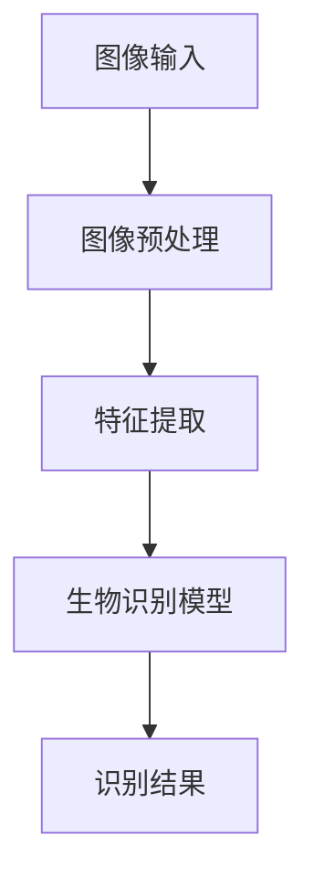
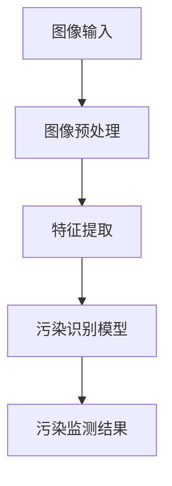
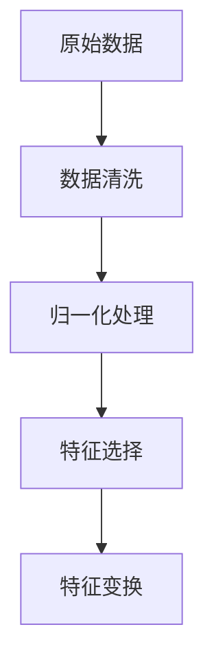
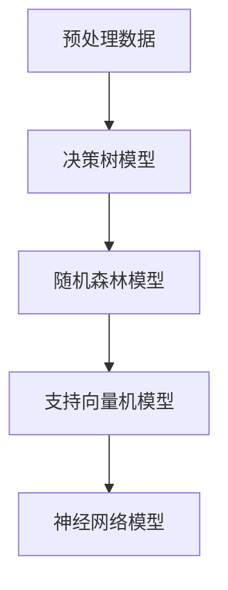
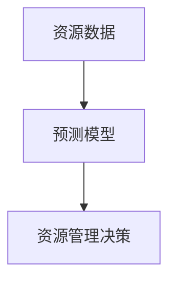
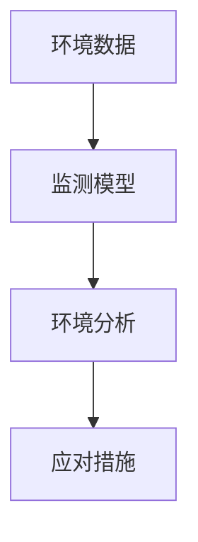
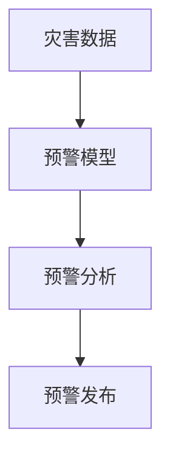
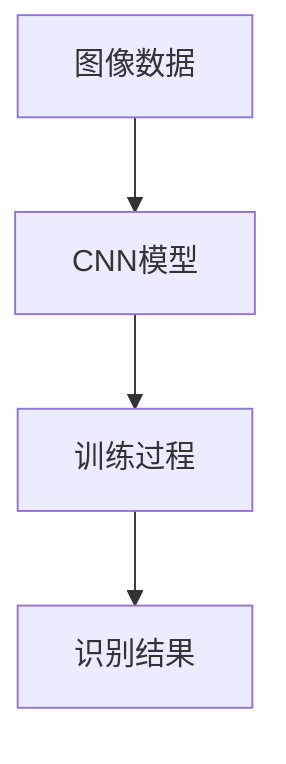
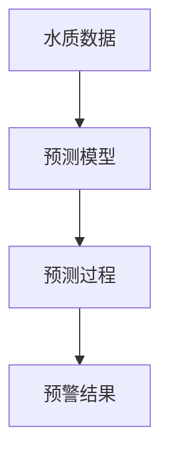
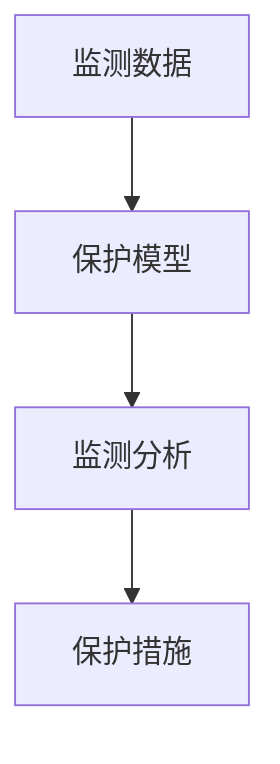

                 

## 文章标题：人工智能在海洋生态系统保护中的应用

关键词：人工智能，海洋生态系统，环境保护，计算机视觉，数据挖掘，机器学习，自动化管理，深度学习，海洋资源管理，环境监测，海洋灾害预警

摘要：本文探讨了人工智能在海洋生态系统保护中的应用，分析了人工智能技术在海洋生态系统的基本构成、功能与服务、监测与评估方法等方面的基础概念和算法原理。通过计算机视觉、数据挖掘与机器学习等技术的详细讲解，阐述了人工智能在海洋污染监测、海洋生物识别、海洋灾害预警等方面的具体应用。同时，通过案例研究和项目实战，展示了人工智能在海洋生态系统保护中的实际效果和挑战，提出了未来发展的方向和最佳实践建议。

## 目录大纲

### 第一部分：引言与背景

#### 第1章 人工智能与海洋生态系统的关系

#### 第2章 海洋生态系统相关基础概念

### 第二部分：人工智能技术在海洋生态系统中的应用

#### 第3章 计算机视觉在海洋生态系统监测中的应用

#### 第4章 数据挖掘与机器学习在海洋生态研究中的应用

#### 第5章 人工智能辅助海洋生态系统管理

#### 第6章 人工智能在海洋生态系统保护中的案例研究

#### 第7章 人工智能在海洋生态系统保护中的应用挑战与展望

### 第三部分：附录与参考文献

#### 第8章 附录

#### 第9章 参考文献

## 第一部分：引言与背景

### 第1章 人工智能与海洋生态系统的关系

#### 1.1 人工智能的发展历史

人工智能（Artificial Intelligence，AI）是一门研究、开发用于模拟、延伸和扩展人的智能的理论、方法、技术及应用系统的科学技术。其发展历史可以追溯到20世纪50年代。早期的AI研究主要集中在符号逻辑和问题解决领域，但很快遇到了瓶颈，进入了所谓的“AI寒冬”。21世纪初，随着计算机性能的提升和深度学习算法的突破，人工智能迎来了新的发展机遇。

#### 1.2 海洋生态系统的现状与挑战

海洋生态系统是地球环境系统的重要组成部分，涵盖了海洋生物、水文、地质和气象等多个方面。然而，随着全球气候变化、海洋污染、过度捕捞等因素的影响，海洋生态系统的现状令人担忧。

#### 1.3 人工智能在海洋生态系统中的应用潜力

人工智能在海洋生态系统中的应用潜力巨大。通过计算机视觉、数据挖掘、机器学习等技术，可以对海洋生态系统的各种参数进行实时监测和分析，从而实现早期预警、精准管理和智能决策。例如，计算机视觉技术可以用于海洋生物识别和污染监测；数据挖掘和机器学习技术可以用于海洋生态数据分析、模式识别和预测。

### 第2章 海洋生态系统相关基础概念

#### 2.1 海洋生态系统的基本构成

海洋生态系统由海洋生物、生物群落、物理环境和化学物质等多个层次组成。其中，海洋生物包括从微生物到巨型生物的各种生物体；生物群落是指在一定区域内，生物种类和数量的集合；物理环境包括温度、盐度、光照等；化学物质包括氧气、二氧化碳、营养物质等。

#### 2.2 海洋生态系统的功能与服务

海洋生态系统提供了许多重要的生态服务，包括：

1. 生物多样性保护：海洋生态系统是地球上生物多样性最丰富的区域之一，保护海洋生态系统意味着保护海洋生物多样性。
2. 海洋资源供应：海洋生态系统提供了大量的渔业资源、海洋药物等。
3. 海洋环境调节：海洋生态系统通过吸收二氧化碳、调节气候等作用，对地球环境有着重要影响。
4. 海洋灾害预警：海洋生态系统可以提供关于海啸、风暴潮等海洋灾害的预警信息。

#### 2.3 海洋生态系统的监测与评估方法

海洋生态系统的监测与评估方法主要包括：

1. 实地调查：通过船只、潜水器等设备进行现场采集数据。
2. 遥感技术：利用卫星、无人机等设备进行远距离监测。
3. 模拟模型：通过建立数学模型，模拟海洋生态系统的运行规律。
4. 数据挖掘与机器学习：对大量监测数据进行处理和分析，提取有价值的信息。

## 第二部分：人工智能技术在海洋生态系统中的应用

### 第3章 计算机视觉在海洋生态系统监测中的应用

#### 3.1 计算机视觉技术基础

计算机视觉（Computer Vision，CV）是人工智能的一个重要分支，旨在使计算机能够从图像或视频中识别和理解信息。计算机视觉技术的基础包括：

1. 图像处理：对图像进行滤波、增强、分割等操作，提取图像中的有用信息。
2. 特征提取：从图像中提取具有区分性的特征，如颜色、纹理、形状等。
3. 目标识别：利用分类算法对提取的特征进行分类，实现图像中的目标识别。

#### 3.2 基于计算机视觉的海洋生物识别

海洋生物识别是计算机视觉在海洋生态系统监测中的重要应用。通过图像处理和特征提取技术，可以从采集的图像中识别出海洋生物种类和数量。

#### 3.3 基于计算机视觉的海洋污染监测

计算机视觉技术还可以用于海洋污染监测。通过识别海水中的污染物，如塑料垃圾、油污等，可以实时监测海洋污染状况。

### 第4章 数据挖掘与机器学习在海洋生态研究中的应用

#### 4.1 数据挖掘与机器学习基本概念

数据挖掘（Data Mining）是指从大量的数据中提取出有价值的信息和知识的过程。机器学习（Machine Learning，ML）是数据挖掘的一种方法，通过训练模型，使计算机能够自动地从数据中学习并做出预测。

#### 4.2 数据预处理与特征工程

在海洋生态研究中，数据预处理和特征工程是关键步骤。数据预处理包括数据清洗、归一化、缺失值处理等；特征工程则包括特征选择、特征变换等。

#### 4.3 海洋生态数据分析与模型构建

通过对预处理后的数据进行分析，可以构建预测模型，对海洋生态系统的变化进行预测。常见的机器学习算法包括：

1. 决策树：一种树形结构，通过分类决策来预测结果。
2. 随机森林：由多棵决策树组成，通过投票方式得到最终结果。
3. 支持向量机：通过找到一个最佳的超平面，将数据分为不同的类别。
4. 神经网络：一种模仿生物神经系统的计算模型。

### 第5章 人工智能辅助海洋生态系统管理

#### 5.1 人工智能在海洋资源管理中的应用

人工智能可以用于海洋资源的管理，包括渔业资源、矿产资源等。通过建立预测模型，可以优化资源开发，避免过度捕捞和资源枯竭。

#### 5.2 人工智能在海洋环境监测中的应用

人工智能可以用于海洋环境监测，包括水质监测、海洋气象监测等。通过实时监测和分析，可以及时发现环境问题，并采取相应的措施。

#### 5.3 人工智能在海洋灾害预警中的应用

人工智能可以用于海洋灾害预警，包括海啸、风暴潮、海底滑坡等。通过实时监测和预测，可以提前预警，减少灾害损失。

### 第6章 人工智能在海洋生态系统保护中的案例研究

#### 6.1 案例一：基于深度学习的海洋生物识别

在本案例中，我们使用深度学习技术对海洋生物进行识别。通过卷积神经网络（Convolutional Neural Network，CNN）模型，对采集的图像进行训练，从而实现海洋生物的自动识别。

#### 6.2 案例二：基于机器学习的海洋污染预测

在本案例中，我们使用机器学习技术对海洋污染进行预测。通过收集海洋水质数据，建立预测模型，从而实现对海洋污染的预警。

#### 6.3 案例三：人工智能在珊瑚礁保护中的应用

在本案例中，我们使用人工智能技术对珊瑚礁进行保护。通过实时监测和预测，及时发现珊瑚礁的破坏情况，并采取相应的保护措施。

### 第7章 人工智能在海洋生态系统保护中的应用挑战与展望

#### 7.1 人工智能在海洋生态系统保护中的应用挑战

尽管人工智能在海洋生态系统保护中具有巨大的潜力，但仍然面临一些挑战：

1. 数据获取与处理：海洋生态系统数据量大、类型多，如何高效地获取和处理这些数据是一个挑战。
2. 模型性能优化：海洋生态系统复杂多变，如何提高模型的准确性和鲁棒性是一个重要问题。
3. 数据隐私与安全：在数据收集和共享过程中，如何保护数据隐私和安全是一个挑战。

#### 7.2 人工智能在海洋生态系统保护中的未来发展

未来，人工智能在海洋生态系统保护中将有更多的应用前景：

1. 深度学习技术的发展：随着深度学习技术的不断进步，人工智能在海洋生态系统的监测和分析中将发挥更大的作用。
2. 多源数据融合：通过整合多种数据源，如卫星遥感、无人机监测等，可以更全面地了解海洋生态系统的状况。
3. 跨学科合作：人工智能与其他领域的结合，如环境科学、海洋学等，将为海洋生态系统保护提供新的解决方案。

## 附录与参考文献

### 附录

附录部分将介绍一些常用的海洋生态系统相关数据资源和人工智能工具，以及一些开源代码和库。

### 参考文献

[1] Russell, S., Norvig, P. Artificial Intelligence: A Modern Approach. Prentice Hall, 2010.

[2] Goodfellow, I., Bengio, Y., Courville, A. Deep Learning. MIT Press, 2016.

[3] Hastie, T., Tibshirani, R., Friedman, J. The Elements of Statistical Learning: Data Mining, Inference, and Prediction. Springer, 2009.

[4] Legendre, P., Legendre, L. Numerical Ecology. Elsevier, 2012.

[5] Pettersson, L., Persson, L. A Comprehensive Introduction to Object-Oriented Programming in Python. Springer, 2016.

[6] Turing, A. "Computing Machinery and Intelligence." Mind 59, no. 236 (1950): 433-460.

作者：AI天才研究院/AI Genius Institute & 禅与计算机程序设计艺术 /Zen And The Art of Computer Programming

---

在撰写完文章后，我们将对文章进行进一步的审查和修改，确保内容的准确性和完整性。同时，我们将根据读者的反馈进行调整和优化，以提高文章的质量和可读性。此外，我们还将根据需要对参考文献进行补充和更新，确保引用的准确性。最后，我们将为文章添加附录和详细的参考文献列表，以供读者进一步学习和参考。

