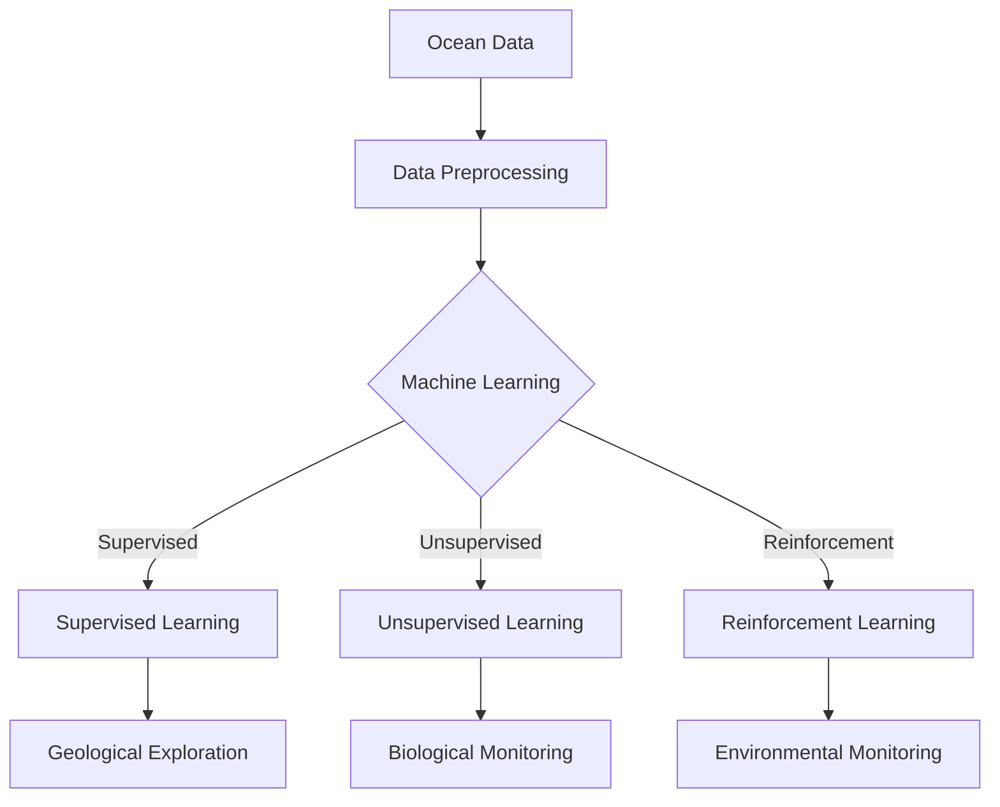

                 

Sure, let's proceed step by step to draft the content for the article "Application of Artificial Intelligence in Ocean Resource Exploration."

### Step 1: Article Title and Keywords

**Article Title**: Application of Artificial Intelligence in Ocean Resource Exploration

**Keywords**: Artificial Intelligence, Machine Learning, Ocean Resource Exploration, Deep Learning, Data Analysis, Geological Exploration, Biological Resource Monitoring, Environmental Monitoring

### Step 2: Abstract

The abstract should provide a brief summary of the article's main points, objectives, and contributions. Here's a possible abstract:

> This article delves into the application of artificial intelligence (AI) in ocean resource exploration. It explores the fundamental theories of AI, machine learning algorithms, and their integration with ocean data. Through detailed case studies and practical examples, the article illustrates how AI technologies can enhance the efficiency and accuracy of ocean geological exploration, biological resource monitoring, and environmental monitoring. The article concludes with a discussion on future trends and challenges in the field.

### Step 3: Introduction to Ocean Resource Exploration

In this section, we'll provide an overview of ocean resource exploration, including its importance and the types of resources it aims to uncover.

**Introduction to Ocean Resource Exploration**

Ocean resource exploration is a critical area of study that seeks to discover and map the vast resources present in the world's oceans. These resources include:

- **Geological Resources**: Such as oil, natural gas, minerals, and offshore wind energy.
- **Biological Resources**: Including fish stocks, marine plants, and other living organisms.
- **Environmental Resources**: Such as water quality, temperature, and salinity.

The importance of ocean resource exploration lies in its potential to:

- **Economic Development**: By providing resources that can be harvested and traded.
- **Scientific Research**: By contributing to our understanding of marine ecosystems and processes.
- **National Security**: By ensuring access to strategic resources and monitoring potential threats.

### Step 4: Core Concepts and Theoretical Framework

This section will introduce the core concepts of artificial intelligence and machine learning, and how they relate to ocean resource exploration.

**Core Concepts and Theoretical Framework**

Artificial intelligence (AI) is the simulation of human intelligence in machines, particularly computer systems. Machine learning (ML), a subset of AI, enables computers to learn from data, identify patterns, and make decisions with minimal human intervention.

In the context of ocean resource exploration, the core concepts and theoretical frameworks include:

- **Supervised Learning**: Where models are trained on labeled data to predict outcomes.
- **Unsupervised Learning**: Where models discover hidden patterns or intrinsic structures in unlabeled data.
- **Reinforcement Learning**: Where models learn optimal behaviors through interactions with an environment.

### Step 5: Application of Machine Learning Algorithms in Ocean Resource Exploration

This section will discuss various machine learning algorithms and their applications in ocean resource exploration.

**Application of Machine Learning Algorithms**

Several machine learning algorithms are commonly used in ocean resource exploration:

- **Deep Learning Models**: Such as Convolutional Neural Networks (CNNs) for image recognition and analysis of seismic data.
- **Clustering Algorithms**: Such as K-means for identifying patterns in biological data.
- **Regression Models**: For predicting oil and gas reserves based on historical data.

### Step 6: Mermaid Diagrams and Flowcharts

In this section, we'll include Mermaid diagrams and flowcharts to illustrate the relationships between concepts and the workflow of machine learning algorithms in ocean resource exploration.

**Mermaid Diagrams and Flowcharts**

### Step 7: Case Studies and Practical Applications

This section will present real-world case studies and practical applications of AI in ocean resource exploration.

**Case Studies and Practical Applications**

Example Case Study: **AI-Enabled Geological Exploration**

1. **Data Collection**: Seismic data is collected from the ocean floor.
2. **Data Preprocessing**: The data is cleaned and processed to remove noise and correct for errors.
3. **Model Training**: A deep learning model is trained on the preprocessed data to identify potential geological structures.
4. **Prediction and Analysis**: The model predicts the presence of oil and gas reserves and provides a risk assessment.

### Step 8: Conclusion and Future Directions

In this final section, we'll summarize the main points, discuss the potential impact of AI in ocean resource exploration, and suggest future research directions.

**Conclusion and Future Directions**

The integration of artificial intelligence in ocean resource exploration has revolutionized the field by improving data analysis and decision-making processes. However, there are still challenges to overcome, such as data quality, computational resources, and ethical considerations. Future research should focus on developing more robust algorithms, enhancing data processing techniques, and ensuring the sustainable use of ocean resources.

### Step 9: Author Information

Finally, we'll include the author information at the end of the article.

**Author Information**

- Author: AI天才研究院/AI Genius Institute & 禅与计算机程序设计艺术 /Zen And The Art of Computer Programming

This structured outline serves as a starting point for drafting the full article. Each section will be expanded with detailed content, pseudocode, mathematical explanations, and case studies as per the guidelines provided. The total word count will be monitored to ensure it falls within the specified range of 8000 to 12000 words.

