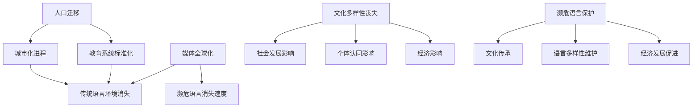

                 

### 文章标题：人工智能在濒危语言保护中的应用研究

#### 关键词：人工智能、濒危语言保护、语音识别、自然语言处理、机器翻译

#### 摘要：
本文旨在探讨人工智能在濒危语言保护中的应用研究。首先，文章介绍了濒危语言的定义与现状，以及人工智能在濒危语言保护中的应用价值。随后，本文详细分析了人工智能在濒危语言保护中的核心概念与联系，包括语音识别、自然语言处理和机器翻译等相关技术。接着，文章深入讲解了语音识别、自然语言处理和机器翻译等核心算法原理，并使用伪代码、数学公式和具体实例进行了详细阐述。最后，本文通过项目实战，展示了如何在实际中应用这些算法，包括开发环境搭建、源代码实现和代码解读，并对项目进行了详细分析和总结。文章的结论部分讨论了人工智能在濒危语言保护中的贡献和未来发展趋势。

### 1.1 濒危语言的定义与现状

#### 1.1.1 濒危语言的定义

濒危语言（Endangered Languages）是指使用人数少、处于严重衰退或面临消失危险的语言。根据联合国教科文组织（UNESCO）的定义，濒危语言是指使用人数不足十万或不到总人口的1%的语言。濒危语言的保护问题不仅关乎语言多样性的维护，也关系到文化多样性和人类共同的记忆遗产。

在全球范围内，许多濒危语言面临着一系列严峻的挑战。首先是人口迁移和城市化进程，这些因素导致了传统语言环境的消失。其次，现代教育系统的标准化和统一化，使得许多年轻人更倾向于使用主流语言，而非自己的母语。此外，媒体的全球化也加速了濒危语言的消失速度，尤其是在广播、电视和互联网等新媒体普及的背景下。

#### 1.1.2 濒危语言现状分析

根据联合国教科文组织的报告，全球有超过5000种语言，其中至少3000种面临濒危或灭绝的危险。以下是一些濒危语言现状的数据和分析：

1. **使用人数**：全球约有7,000万人使用濒危语言，占总人口的约1%。其中，约2500种语言的使用人数不到1000人，超过3000种语言的使用人数在1000至10000人之间。

2. **地理分布**：濒危语言主要分布在非洲、亚洲、拉丁美洲和澳大利亚等地区。例如，非洲的约鲁巴语和马达加斯加语，亚洲的藏语和苗语，拉丁美洲的瓜拉尼语和克丘亚语。

3. **社会影响**：濒危语言的消失不仅会导致文化多样性的丧失，还会影响社会的发展和个体的认同。对于少数民族群体来说，语言是文化传承的重要载体，语言的消失可能导致文化的逐渐消失。

4. **经济影响**：濒危语言的存在对于经济发展也有重要意义。例如，在旅游、农业和手工艺等领域，当地语言的使用可以促进文化产品的多样性和市场竞争力。

为了更好地理解濒危语言的保护现状，我们可以使用Mermaid流程图来展示濒危语言的主要影响因素及其之间的关系：



通过这个流程图，我们可以清晰地看到人口迁移、城市化进程、教育系统标准化和媒体全球化等因素如何共同作用，加速了濒危语言的消失，而濒危语言保护对于维护文化多样性和促进社会发展具有重要意义。

### 1.2 人工智能在濒危语言保护中的应用价值

#### 1.2.1 人工智能与濒危语言保护的结合点

人工智能（Artificial Intelligence, AI）在濒危语言保护中的应用，主要基于以下几个结合点：

1. **语音识别技术**：语音识别技术可以用于记录和保存濒危语言的口语形式，从而为语言的数字化保存提供技术支持。

2. **自然语言处理（NLP）技术**：自然语言处理技术可以帮助分析和理解濒危语言的语法、词汇和语义特征，为语言学习和教学提供支持。

3. **机器翻译技术**：机器翻译技术可以将濒危语言与主流语言进行翻译，促进濒危语言与外界的交流，增加语言的使用场景。

4. **机器学习和深度学习**：通过机器学习和深度学习算法，可以对大量濒危语言数据进行处理和分析，从而发现语言的使用模式和规律，为语言保护提供科学依据。

#### 1.2.2 人工智能在濒危语言保护中的潜在应用

1. **语音识别与数字化保存**：
   语音识别技术可以将濒危语言的口语转化为文本，实现语言的数字化保存。例如，可以使用自动语音识别（Automatic Speech Recognition, ASR）技术来记录濒危语言的口语，然后通过自然语言处理技术对文本进行分析和整理，从而建立语言数据库。

2. **自然语言处理与语言学习**：
   自然语言处理技术可以帮助开发语言学习工具，例如语法分析器、词汇学习软件等。通过分析濒危语言的语法和词汇特征，可以设计出适合语言学习的算法和界面，帮助使用者更有效地学习和掌握濒危语言。

3. **机器翻译与文化交流**：
   机器翻译技术可以将濒危语言与主流语言进行互译，促进濒危语言与外界的交流。例如，可以将濒危语言的内容翻译成主流语言，以便更多的人能够理解和学习这些语言。同时，机器翻译还可以用于将外文资料翻译成濒危语言，从而为濒危语言的文化保护提供更多资源。

4. **机器学习与语言规律发现**：
   通过机器学习算法，可以对大量的濒危语言数据进行处理和分析，从而发现语言的使用模式和规律。例如，可以分析濒危语言的词汇频率、语法结构等特征，为语言的保护和研究提供数据支持。

总之，人工智能技术在濒危语言保护中的应用，不仅有助于数字化保存濒危语言，还可以促进语言的学习和交流，从而为濒危语言的保护和发展提供有力支持。

### 1.3 濒危语言保护相关技术

#### 1.3.1 语音识别技术

语音识别技术是人工智能在濒危语言保护中应用的重要技术之一。其基本原理是将语音信号转换为文本，从而实现语音到文字的转换。语音识别技术主要依赖于信号处理和机器学习算法，可以分为以下几个关键步骤：

1. **信号采集**：首先，需要采集濒危语言的语音信号。这些语音信号可以通过录音设备进行录制，确保音质清晰、无噪声干扰。

2. **信号预处理**：对采集到的语音信号进行预处理，包括去除噪声、增强语音信号等。这一步骤有助于提高语音识别的准确性。

3. **特征提取**：将预处理后的语音信号转换为特征向量，这些特征向量包含了语音信号的各种属性，如频率、振幅等。常用的特征提取方法包括梅尔频率倒谱系数（MFCC）、短时傅里叶变换（STFT）等。

4. **模型训练**：使用大量的标注数据对语音识别模型进行训练，使其能够识别不同语音信号中的特定语言特征。训练过程中，常用的算法包括隐马尔可夫模型（HMM）、深度神经网络（DNN）等。

5. **模型评估与优化**：通过测试集评估模型的性能，包括准确性、召回率等指标。根据评估结果对模型进行优化，以提高识别准确性。

#### 1.3.2 自然语言处理技术

自然语言处理（Natural Language Processing, NLP）是人工智能的另一个重要分支，用于处理和分析人类语言数据。在濒危语言保护中，NLP技术主要用于分析濒危语言的语法、词汇和语义特征，为语言学习和交流提供支持。以下是NLP技术的一些关键步骤：

1. **文本预处理**：对采集到的文本数据进行预处理，包括去除标点符号、停用词过滤、分词等。这一步骤有助于提高后续分析的准确性。

2. **词向量表示**：将文本数据转换为词向量表示，如Word2Vec、GloVe等。词向量表示可以将文本数据转换为数值形式，便于计算机处理。

3. **语法分析**：使用语法分析器对文本进行语法解析，提取出句子的语法结构，如词性标注、句法分析等。常用的语法分析方法包括基于规则的方法、统计方法和神经网络方法。

4. **语义分析**：对文本进行语义分析，提取出句子的语义信息，如实体识别、情感分析等。语义分析有助于理解文本的深层含义。

5. **语言模型训练**：使用大量文本数据对语言模型进行训练，如循环神经网络（RNN）、变换器（Transformer）等。语言模型可以用于预测文本的下一个单词或句子，提高文本生成的质量。

#### 1.3.3 机器翻译技术

机器翻译（Machine Translation, MT）是将一种语言的文本自动翻译成另一种语言的技术。在濒危语言保护中，机器翻译技术可以帮助将濒危语言的内容翻译成主流语言，从而促进濒危语言的传播和交流。以下是机器翻译技术的一些关键步骤：

1. **双语语料库构建**：首先，需要构建一个包含源语言和目标语言的双语语料库。这些语料库用于训练机器翻译模型。

2. **翻译模型训练**：使用双语语料库对机器翻译模型进行训练，模型可以是基于规则的方法、统计机器翻译（SMT）或神经机器翻译（NMT）。其中，神经机器翻译是目前的主流方法，其基于深度学习技术，具有更高的翻译质量。

3. **翻译模型评估与优化**：通过测试集评估机器翻译模型的性能，包括准确性、流畅度等指标。根据评估结果对模型进行优化，以提高翻译质量。

4. **翻译结果后处理**：对机器翻译的结果进行后处理，包括拼写检查、语法修正等。这一步骤有助于提高翻译结果的准确性。

5. **多语言翻译**：通过将机器翻译模型扩展到多个语言，可以实现跨语言的信息传播和交流。这对于濒危语言的保护和推广具有重要意义。

通过上述技术，人工智能在濒危语言保护中发挥着重要作用。这些技术不仅有助于数字化保存濒危语言，还可以促进濒危语言的学习和交流，为濒危语言的保护和发展提供了有力支持。

## 2.1 人工智能基础知识

### 2.1.1 机器学习基本概念

机器学习（Machine Learning, ML）是人工智能（Artificial Intelligence, AI）的一个重要分支，其核心目标是让计算机从数据中学习，并基于学习得到的知识进行预测或决策。机器学习主要分为监督学习、无监督学习和强化学习三种类型。

1. **监督学习（Supervised Learning）**：
   监督学习是一种在有标记数据集上进行训练的方法。标记数据集包含输入和对应的输出，通过学习输入和输出之间的关系，模型可以预测未知数据的输出。监督学习主要分为回归（Regression）和分类（Classification）两种任务。
   
   - **回归（Regression）**：回归问题旨在预测一个连续的数值输出。常见的回归模型有线性回归（Linear Regression）、岭回归（Ridge Regression）和梯度提升树（Gradient Boosting Tree）等。
   
   - **分类（Classification）**：分类问题旨在将输入数据分为不同的类别。常见的分类模型有逻辑回归（Logistic Regression）、支持向量机（Support Vector Machine, SVM）和决策树（Decision Tree）等。

2. **无监督学习（Unsupervised Learning）**：
   无监督学习是在没有标记数据集的情况下进行训练的方法。其主要目标是发现数据中的结构和模式。无监督学习主要分为聚类（Clustering）和降维（Dimensionality Reduction）两种任务。
   
   - **聚类（Clustering）**：聚类问题旨在将相似的数据点分为一组，从而发现数据中的自然分组。常见的聚类算法有K-均值（K-Means）、层次聚类（Hierarchical Clustering）和DBSCAN等。
   
   - **降维（Dimensionality Reduction）**：降维问题旨在减少数据维度，从而降低计算复杂度和避免“维度灾难”。常见的降维算法有主成分分析（Principal Component Analysis, PCA）、线性判别分析（Linear Discriminant Analysis, LDA）和t-SNE等。

3. **强化学习（Reinforcement Learning）**：
   强化学习是一种通过试错法进行学习的方法，其主要目标是让智能体在环境中通过交互学习最优策略。强化学习通常由智能体（Agent）、环境（Environment）、状态（State）、动作（Action）和奖励（Reward）五个要素组成。常见的强化学习算法有Q学习（Q-Learning）、深度Q网络（Deep Q-Network, DQN）和策略梯度（Policy Gradient）等。

### 2.1.2 深度学习基础

深度学习（Deep Learning, DL）是机器学习的一个子领域，其核心思想是模仿人脑的神经元结构，通过多层神经网络（Neural Networks）进行数据处理和特征提取。深度学习在图像识别、自然语言处理和语音识别等领域取得了显著成果。

1. **神经网络基础**：
   神经网络是由大量神经元（或节点）组成的网络，每个神经元都与其他神经元相连，并通过权重（Weight）进行通信。神经元的输出由输入和权重经过激活函数（Activation Function）计算得出。常见的激活函数有sigmoid、ReLU（Rectified Linear Unit）和Tanh（Hyperbolic Tangent Hessian）等。

2. **多层感知机（Multilayer Perceptron, MLP）**：
   多层感知机是一种前馈神经网络，包含输入层、隐藏层和输出层。输入层接收输入数据，隐藏层通过加权求和处理生成特征，输出层生成最终预测结果。多层感知机可以通过反向传播算法（Backpropagation Algorithm）进行训练。

3. **卷积神经网络（Convolutional Neural Network, CNN）**：
   卷积神经网络是一种专门用于图像识别的神经网络，其核心思想是使用卷积操作提取图像特征。CNN包括卷积层（Convolutional Layer）、池化层（Pooling Layer）和全连接层（Fully Connected Layer）等。通过多层卷积操作，CNN可以自动提取图像中的层次特征。

4. **循环神经网络（Recurrent Neural Network, RNN）**：
   循环神经网络是一种用于处理序列数据的神经网络，其特点是网络中的节点可以共享信息，形成时间动态关系。常见的RNN变种有LSTM（Long Short-Term Memory）和GRU（Gated Recurrent Unit），这些模型通过门控机制解决了传统RNN的梯度消失问题。

5. **变换器（Transformer）**：
   变换器是一种基于自注意力机制的神经网络结构，广泛应用于自然语言处理领域。变换器通过多头自注意力机制和前馈神经网络，可以同时捕捉序列中的全局依赖关系和局部特征。

### 2.1.3 人工智能伦理与社会影响

随着人工智能技术的快速发展，人工智能伦理和社会影响成为一个日益关注的话题。以下是一些关键问题：

1. **隐私保护**：
   人工智能系统在处理个人数据时，必须确保隐私保护。例如，对个人隐私数据的加密存储和访问控制。

2. **算法公平性**：
   人工智能算法在决策过程中可能存在性别、种族、年龄等方面的偏见，需要确保算法的公平性。例如，通过数据平衡和算法优化来减少偏见。

3. **透明度与解释性**：
   人工智能系统的决策过程往往不够透明，需要提高算法的可解释性，使其更容易被用户理解和接受。

4. **安全与风险管理**：
   人工智能系统可能面临安全威胁，如数据泄露、系统崩溃等。需要建立完善的安全体系和风险管理机制。

5. **就业影响**：
   人工智能技术的发展可能会对就业市场产生影响，需要制定相应的政策和社会保障措施。

通过以上内容，我们了解了人工智能的基础知识，包括机器学习的类型、深度学习的基本结构以及人工智能在伦理和社会方面的挑战。这些知识为后续章节中对人工智能在濒危语言保护中的应用提供了理论基础。

### 2.2 濒危语言保护的框架与流程

#### 2.2.1 濒危语言保护框架设计

濒危语言保护框架旨在通过一系列技术手段和策略，确保濒危语言得到有效的保护和发展。该框架的设计主要包括以下几个关键模块：

1. **数据采集与处理**：数据采集是濒危语言保护的基础，通过录音、视频、文本等多种方式收集濒危语言的原始数据。随后，对这些数据进行处理，包括去噪、标注、分词等，以确保数据质量。

2. **语音识别与文本转换**：利用语音识别技术，将濒危语言的语音转换为文本，实现语音数据的数字化保存。同时，通过自然语言处理技术对文本进行分析和整理，提取出语言的基本结构和特征。

3. **语言建模与词典构建**：在大量文本数据的基础上，构建濒危语言的统计语言模型和词典。这些模型和词典用于后续的语言学习和翻译任务。

4. **语言教学与资源开发**：利用语音识别和自然语言处理技术，开发语言学习工具和教学资源，如语法分析器、词汇学习软件、电子词典等，以促进濒危语言的学习和使用。

5. **机器翻译与跨语言交流**：通过机器翻译技术，将濒危语言与主流语言进行互译，促进濒危语言与外界的交流，扩大语言的使用场景。

6. **监测与评估**：建立濒危语言保护的监测与评估体系，实时跟踪濒危语言的使用情况和保护效果，为政策制定和资源分配提供依据。

#### 2.2.2 濒危语言保护流程解析

濒危语言保护的流程可以概括为以下几个步骤：

1. **数据采集**：
   通过录音设备、麦克风等工具录制濒危语言的语音样本，同时收集相关的文本、视频等多媒体资料。这些数据需要进行标注，以确保后续处理的准确性。

2. **数据预处理**：
   对采集到的语音和文本数据去除噪声、填充缺失值、统一格式等预处理操作，以提高数据质量。

3. **语音识别**：
   利用语音识别技术将语音数据转换为文本。这一步骤需要使用专门的语音识别模型，如深度神经网络（DNN）和循环神经网络（RNN）等。

4. **文本分析**：
   使用自然语言处理技术对转换后的文本进行分析，提取出词汇、语法、语义等信息，构建语言模型和词典。

5. **语言建模**：
   在大量文本数据的基础上，构建濒危语言的统计语言模型和词典。这些模型和词典用于后续的语言学习和翻译任务。

6. **语言教学**：
   利用语音识别和自然语言处理技术，开发语言学习工具和教学资源，如语法分析器、词汇学习软件、电子词典等，以促进濒危语言的学习和使用。

7. **机器翻译**：
   通过机器翻译技术，将濒危语言与主流语言进行互译，促进濒危语言与外界的交流，扩大语言的使用场景。

8. **监测与评估**：
   建立濒危语言保护的监测与评估体系，实时跟踪濒危语言的使用情况和保护效果，为政策制定和资源分配提供依据。

通过以上流程，濒危语言保护不仅能够实现语音和文本的数字化保存，还可以促进语言的学习和交流，为濒危语言的持续发展提供支持。

### 2.3 人工智能在濒危语言保护中的应用原理

#### 2.3.1 语音识别在濒危语言保护中的应用

语音识别（Speech Recognition）技术是人工智能在濒危语言保护中应用的关键组成部分。其基本原理是将语音信号转换为相应的文本，从而实现语音到文字的转换。这一技术在濒危语言保护中的主要应用如下：

1. **语音数据采集**：
   首先需要通过录音设备录制濒危语言的语音样本。为了确保语音数据的质量，应选择高精度的录音设备，并在安静的环境中录制，以避免背景噪声的干扰。

2. **语音信号预处理**：
   在获取语音信号后，需要进行预处理，包括去噪、归一化、增强语音信号等。这一步骤有助于提高语音识别的准确性。常用的预处理方法包括短时傅里叶变换（STFT）、梅尔频率倒谱系数（MFCC）等。

3. **特征提取**：
   通过特征提取将预处理后的语音信号转换为数值特征向量。常用的特征提取方法包括MFCC、线性预测编码（LPC）等。这些特征向量包含了语音信号的各种属性，如频率、振幅等。

4. **模型训练**：
   使用大量的标注语音数据对语音识别模型进行训练。训练过程中，常用的算法包括隐马尔可夫模型（HMM）、支持向量机（SVM）和深度神经网络（DNN）等。通过训练，模型可以学习到不同语音特征之间的关联性，从而提高识别准确性。

5. **语音识别**：
   将训练好的模型应用于新的语音数据，进行语音到文本的转换。识别过程包括前端处理（声学建模）、中间处理（语言建模）和后端处理（解码）等步骤。

6. **数字化保存**：
   将识别出的文本数据保存到数据库中，实现濒危语言的数字化保存。这样不仅便于后续的数据分析和利用，还可以为濒危语言的传承提供支持。

以下是一个简化的语音识别算法的伪代码：

```python
def voice_recognition(voice_signal):
    # 声音信号预处理
    preprocessed_signal = preprocess_signal(voice_signal)
    
    # 特征提取
    feature_vector = extract_features(preprocessed_signal)
    
    # 模型训练
    trained_model = train_model(feature_vector)
    
    # 语音识别
    recognized_text = recognize_text(trained_model, feature_vector)
    
    # 数字化保存
    save_text_to_database(recognized_text)
    
    return recognized_text
```

#### 2.3.2 自然语言处理在濒危语言保护中的应用

自然语言处理（Natural Language Processing, NLP）技术是人工智能在濒危语言保护中的另一重要组成部分。NLP技术主要用于分析和理解文本数据，包括文本预处理、词向量表示、语法分析、语义分析等。以下是NLP技术在濒危语言保护中的应用：

1. **文本预处理**：
   对采集到的文本数据进行预处理，包括去除标点符号、停用词过滤、分词等。这一步骤有助于提高后续分析的质量。例如，可以使用正则表达式去除标点符号，使用分词算法对文本进行分词。

2. **词向量表示**：
   将文本数据转换为词向量表示，如Word2Vec、GloVe等。词向量表示可以将文本数据转换为数值形式，便于计算机处理。通过词向量，可以捕捉词与词之间的语义关系，为后续的语义分析提供支持。

3. **语法分析**：
   使用语法分析器对文本进行语法解析，提取出句子的语法结构，如词性标注、句法分析等。这一步骤有助于理解文本的语法特征。常用的语法分析方法包括基于规则的方法、统计方法和基于神经网络的方法。

4. **语义分析**：
   对文本进行语义分析，提取出句子的语义信息，如实体识别、情感分析等。语义分析有助于理解文本的深层含义。例如，可以使用命名实体识别（NER）技术提取文本中的地名、人名、组织名等实体。

5. **语言模型训练**：
   使用大量的文本数据对语言模型进行训练，如循环神经网络（RNN）、变换器（Transformer）等。语言模型可以用于预测文本的下一个单词或句子，提高文本生成的质量。

以下是一个简化的NLP算法的伪代码：

```python
def natural_language_processing(text_data):
    # 文本预处理
    preprocessed_text = preprocess_text(text_data)
    
    # 词向量表示
    word_vectors = create_word_vectors(preprocessed_text)
    
    # 语法分析
    syntax_structure = parse_syntax(preprocessed_text)
    
    # 语义分析
    semantic_info = analyze_semantics(preprocessed_text)
    
    # 语言模型训练
    trained_model = train_language_model(preprocessed_text)
    
    # 文本生成
    generated_text = generate_text(trained_model)
    
    return generated_text
```

#### 2.3.3 机器翻译在濒危语言保护中的应用

机器翻译（Machine Translation, MT）技术是人工智能在濒危语言保护中应用的另一个重要领域。通过将濒危语言翻译成主流语言，可以促进濒危语言的传播和交流。以下是机器翻译在濒危语言保护中的应用：

1. **双语语料库构建**：
   首先需要构建一个包含源语言（濒危语言）和目标语言（主流语言）的双语语料库。这些语料库用于训练机器翻译模型。构建过程中，可以通过对现有文本资料进行翻译或手工标注来生成双语对。

2. **翻译模型训练**：
   使用双语语料库对机器翻译模型进行训练。训练过程中，常用的算法包括基于规则的方法、统计机器翻译（SMT）和神经机器翻译（NMT）。其中，神经机器翻译是目前的主流方法，其基于深度学习技术，具有更高的翻译质量。

3. **翻译模型评估**：
   通过测试集评估机器翻译模型的性能，包括准确性、流畅度等指标。根据评估结果对模型进行优化，以提高翻译质量。

4. **翻译结果后处理**：
   对机器翻译的结果进行后处理，包括拼写检查、语法修正等。这一步骤有助于提高翻译结果的准确性。

5. **多语言翻译**：
   通过将机器翻译模型扩展到多个语言，可以实现跨语言的信息传播和交流。这对于濒危语言的保护和推广具有重要意义。

以下是一个简化的机器翻译算法的伪代码：

```python
def machine_translation(source_text, target_language):
    # 双语语料库构建
    bilingual_corpus = create_bilingual_corpus(source_text, target_language)
    
    # 翻译模型训练
    translation_model = train_translation_model(bilingual_corpus)
    
    # 翻译模型评估
    evaluate_translation_model(translation_model)
    
    # 翻译结果后处理
    processed_translation = post_process_translation(translation_model, source_text)
    
    return processed_translation
```

通过以上内容，我们可以看到语音识别、自然语言处理和机器翻译技术在濒危语言保护中的应用原理和具体步骤。这些技术不仅能够实现濒危语言的数字化保存和传播，还可以为濒危语言的学习和使用提供支持。

## 3.1 语音识别算法原理

### 3.1.1 语音信号处理

语音信号处理是语音识别（Speech Recognition）算法的重要组成部分，其目的是对原始语音信号进行预处理，以提取出有用的特征信息。语音信号处理的步骤包括：

1. **信号采集**：使用麦克风或其他语音采集设备获取语音信号。信号采集时需要注意信号的质量和清晰度，以避免噪声和失真的影响。

2. **信号预处理**：对采集到的语音信号进行预处理，包括去噪、归一化和增强等。去噪是通过滤波或降噪算法去除语音信号中的背景噪声；归一化是将语音信号的幅度调整到相同的范围，以便后续处理；增强则是通过提高语音信号中的关键特征，如语音强度和频率，来增强识别效果。

3. **分帧和窗函数**：将连续的语音信号分割成多个帧（Frame），每帧通常包含20-40毫秒的语音信号。为了减少帧与帧之间的突变，使用窗函数（如汉明窗、汉宁窗）对每帧进行加权处理。

4. **特征提取**：从每个帧中提取特征向量，这些特征向量通常用于表示语音信号的不同属性，如频率、能量和共振峰等。常用的特征提取方法包括梅尔频率倒谱系数（MFCC）、线性预测特性（LPC）和频谱特征等。

### 3.1.2 语音识别模型构建

语音识别模型的构建是语音识别算法的核心步骤，其目的是将提取出的特征向量映射到对应的文字或词汇。以下是语音识别模型构建的主要步骤：

1. **声学模型**：声学模型负责将语音信号的特征向量转换为声学概率分布。常用的声学模型包括高斯混合模型（Gaussian Mixture Model, GMM）和深度神经网络（Deep Neural Network, DNN）。声学模型通过学习大量的语音数据，拟合出特征向量与声学概率分布之间的关系。

2. **语言模型**：语言模型负责预测文本序列的概率分布。语言模型通常基于N元语法（N-gram Model），即根据前N个单词预测下一个单词的概率。对于更复杂的语言模型，可以使用变换器（Transformer）或长短期记忆网络（Long Short-Term Memory, LSTM）。

3. **集成模型**：集成模型是将声学模型和语言模型结合在一起的模型，如隐马尔可夫模型（Hidden Markov Model, HMM）和混合高斯模型（Mixtures of Gaussians, MoG）。集成模型通过将声学特征和语言概率结合起来，提高了语音识别的准确性。

### 3.1.3 语音识别算法实现

语音识别算法的实现涉及到从信号采集到最终识别结果的完整流程。以下是语音识别算法实现的主要步骤：

1. **信号采集**：使用麦克风等设备采集语音信号。

2. **信号预处理**：对采集到的语音信号进行去噪、归一化和增强等预处理操作。

3. **分帧和特征提取**：将预处理后的语音信号分割成帧，并对每帧进行特征提取，如MFCC。

4. **声学模型训练**：使用大量的标注语音数据对声学模型进行训练，以拟合特征向量与声学概率分布之间的关系。

5. **语言模型训练**：使用大量的文本数据对语言模型进行训练，以预测文本序列的概率分布。

6. **模型融合**：将声学模型和语言模型融合，构建集成模型。

7. **识别过程**：对新的语音信号进行特征提取，并将其输入到集成模型中进行识别。识别过程包括声学解码和语言解码，最终输出识别结果。

以下是一个简化的语音识别算法的伪代码：

```python
def speech_recognition(voice_signal):
    # 信号预处理
    preprocessed_signal = preprocess_signal(voice_signal)
    
    # 分帧和特征提取
    frames = frame_signal(preprocessed_signal)
    features = extract_features(frames)
    
    # 声学模型训练
    acoustic_model = train_acoustic_model(features)
    
    # 语言模型训练
    language_model = train_language_model(text_data)
    
    # 模型融合
    integrated_model = integrate_models(acoustic_model, language_model)
    
    # 识别过程
    recognized_text = recognize_text(integrated_model, features)
    
    return recognized_text
```

通过以上步骤，我们可以实现一个基本的语音识别算法。然而，为了提高识别准确性，还需要对算法进行优化和调整，如使用更复杂的特征提取方法、改进声学模型和语言模型等。

### 3.2 自然语言处理算法原理

#### 3.2.1 语言模型

语言模型（Language Model, LM）是自然语言处理（Natural Language Processing, NLP）中的一个核心组件，其主要目的是预测文本序列的概率分布。语言模型在许多NLP任务中发挥着重要作用，如机器翻译、文本生成和语音识别等。

1. **N元语法（N-gram Model）**：
   N元语法是一种最常见的语言模型，其基于文本的前N个单词（称为n-gram）来预测下一个单词。例如，对于二元语法（Bigram），它使用前两个单词来预测下一个单词的概率。N元语法的数学表示如下：

   $$ P(w_{t+1} | w_{t}, w_{t-1}, ..., w_{t-N+1}) = \frac{C(w_{t+1}, w_{t}, ..., w_{t-N+1})}{C(w_{t}, w_{t-1}, ..., w_{t-N+1})} $$

   其中，$C(w_{t+1}, w_{t}, ..., w_{t-N+1})$表示单词序列$w_{t+1}, w_{t}, ..., w_{t-N+1}$的联合计数，$C(w_{t}, w_{t-1}, ..., w_{t-N+1})$表示单词序列$w_{t}, w_{t-1}, ..., w_{t-N+1}$的联合计数。

2. **平滑技术（Smoothing Techniques）**：
   N元语法在实际应用中会遇到稀疏数据问题，即某些n-gram在训练数据中未出现。为了解决这一问题，引入了平滑技术，如加一平滑（Add-One Smoothing）、Kneser-Ney 平滑等。加一平滑的基本思想是将未出现的n-gram的概率设置为1/N+ε（其中ε为很小的正数），从而避免概率为零的情况。

#### 3.2.2 词向量表示

词向量表示（Word Embedding）是将文本数据转换为数值向量的方法，从而使得计算机可以处理和比较文本。词向量表示不仅保留了单词的语义信息，还可以捕捉单词之间的相似性和相关性。

1. **Word2Vec**：
   Word2Vec是最早的词向量表示方法之一，其基于神经网络训练得到词向量。Word2Vec包括连续词袋（Continuous Bag of Words, CBOW）和Skip-Gram两种模型。

   - **CBOW（Continuous Bag of Words）**：CBOW模型使用中心词的上下文单词来预测中心词。其数学表示如下：

     $$ \hat{p}_{\theta}(w_{t} | w_{1}, w_{2}, ..., w_{N}) = \frac{exp(\theta \cdot w_{t}^*)}{\sum_{w \in V} exp(\theta \cdot w^*)} $$

     其中，$\theta$是权重向量，$w_{t}^*$是中心词的词向量，$w_{i}$是上下文单词的词向量。

   - **Skip-Gram（Skip-Gram）**：Skip-Gram模型使用中心词来预测上下文单词。其数学表示如下：

     $$ \hat{p}_{\theta}(w_{i} | w_{t}^*) = \frac{exp(\theta \cdot w_{i}^*)}{\sum_{w \in V} exp(\theta \cdot w^*)} $$

2. **GloVe（Global Vectors for Word Representation）**：
   GloVe是一种基于共现矩阵的词向量表示方法，其通过学习全局矩阵来优化词向量。GloVe的数学表示如下：

   $$ f(w, v) = \sqrt{f_{ij}} $$

   其中，$f_{ij}$是单词w和v的共现频次，$f(w, v)$是它们之间的相似度。

#### 3.2.3 序列标注模型

序列标注模型（Sequence Labeling Model）用于对文本序列中的每个单词或字符进行标注，常用于命名实体识别（Named Entity Recognition, NER）、词性标注（Part-of-Speech Tagging）等任务。

1. **CRF（Conditional Random Fields）**：
   CRF是一种概率图模型，用于处理序列标注问题。CRF通过条件概率分布来预测序列中的每个标签，其数学表示如下：

   $$ P(y_1, y_2, ..., y_T | x_1, x_2, ..., x_T) = \frac{1}{Z} \prod_{t=1}^{T} P(y_t | y_{<t}, x_t) $$

   其中，$Z$是归一化常数，$y_t$是第t个单词的标签，$x_t$是第t个单词。

2. **BiLSTM（Bidirectional LSTM）**：
   BiLSTM是一种基于循环神经网络（RNN）的序列标注模型，其通过同时考虑前向和后向的隐藏状态来预测每个单词的标签。BiLSTM的数学表示如下：

   $$ h_{t}^{(l)} = \tanh(W^{(l)} [h_{t-1}^{(l)}, h_{t+1}^{(l-1)] + b^{(l)}) $$

   其中，$h_{t}^{(l)}$是第t个单词在第l层的隐藏状态，$W^{(l)}$是权重矩阵，$b^{(l)}$是偏置向量。

通过以上内容，我们可以了解到自然语言处理算法中的语言模型、词向量表示和序列标注模型的基本原理。这些模型和算法为自然语言处理任务提供了强大的工具和理论基础。

### 3.3 机器翻译算法原理

#### 3.3.1 神经机器翻译模型

神经机器翻译（Neural Machine Translation, NMT）是一种基于深度学习的机器翻译方法，其通过神经网络学习源语言和目标语言之间的映射关系。NMT在近年来的机器翻译领域取得了显著的成果，主要原因在于其能够捕捉长距离依赖关系和上下文信息，从而提高翻译质量。

1. **编码器（Encoder）**：
   编码器负责将源语言文本序列编码为固定长度的向量表示。编码器通常采用变换器（Transformer）或循环神经网络（RNN）的结构。在Transformer模型中，编码器由多个自注意力层（Self-Attention Layer）和前馈网络（Feedforward Network）组成，通过自注意力机制捕捉文本序列中的全局依赖关系。

   伪代码如下：
   ```python
   def encoder(source_sequence, d_model, num_heads, dff):
       for layer in range(num_layers):
           source_sequence = self_attention_layer(source_sequence, num_heads, d_model)
           source_sequence = residual_connection(source_sequence)
           source_sequence = feedforward_network(source_sequence, dff)
           source_sequence = residual_connection(source_sequence)
       return source_sequence
   ```

2. **解码器（Decoder）**：
   解码器负责将编码器输出的向量序列解码为目标语言文本序列。解码器同样采用变换器或RNN结构。在Transformer模型中，解码器由多个自注意力层和交叉注意力层（Cross-Attention Layer）以及前馈网络组成。交叉注意力层使得解码器能够根据编码器的输出生成目标语言文本。

   伪代码如下：
   ```python
   def decoder(target_sequence, source_sequence, d_model, num_heads, dff):
       for layer in range(num_layers):
           target_sequence = self_attention_layer(target_sequence, num_heads, d_model)
           target_sequence = cross_attention_layer(target_sequence, source_sequence, num_heads, d_model)
           target_sequence = residual_connection(target_sequence)
           target_sequence = feedforward_network(target_sequence, dff)
           target_sequence = residual_connection(target_sequence)
       return target_sequence
   ```

3. **自注意力机制（Self-Attention）**：
   自注意力机制是一种通过计算文本序列中每个单词与其他单词之间的关系来生成表示的方法。自注意力机制在编码器和解码器中都得到了广泛应用。

   自注意力机制的伪代码如下：
   ```python
   def scaled_dot_product_attention(q, k, v, scale_factor):
       attention_weights = scaled_dot_product_attention_scores(q, k)
       context_vector = weighted_sum(v, attention_weights)
       return context_vector
   ```

4. **交叉注意力机制（Cross-Attention）**：
   交叉注意力机制是解码器中的一个关键组件，它使得解码器能够根据编码器的输出生成目标语言文本。交叉注意力机制通过计算解码器中每个单词与编码器输出之间的关系来生成表示。

   交叉注意力机制的伪代码如下：
   ```python
   def scaled_dot_product_attention(q, k, v, scale_factor):
       attention_weights = scaled_dot_product_attention_scores(q, k)
       context_vector = weighted_sum(v, attention_weights)
       return context_vector
   ```

#### 3.3.2 翻译模型训练与评估

翻译模型的训练和评估是神经机器翻译中的关键步骤。以下是训练和评估的主要步骤：

1. **训练过程**：
   - **数据准备**：首先，需要构建一个包含源语言和目标语言的双语语料库。然后，将语料库分为训练集、验证集和测试集。
   - **模型初始化**：初始化编码器和解码器的权重。
   - **正向传播**：输入源语言文本序列到编码器中，得到编码器的输出。然后，将编码器的输出作为输入传递给解码器，并通过交叉注意力机制生成目标语言预测序列。
   - **损失计算**：计算预测序列和真实目标序列之间的损失，如交叉熵损失。
   - **反向传播**：通过反向传播算法更新模型权重，以最小化损失函数。
   - **迭代训练**：重复正向传播和反向传播的过程，直到模型收敛或达到预设的训练次数。

2. **评估过程**：
   - **BLEU评分**：BLEU（Bilingual Evaluation Understudy）评分是一种常用的机器翻译评估方法，其基于编辑距离（Edit Distance）和相似性度量（Sentence Similarity Measure）来评估翻译质量。
   - **BLEU评分的伪代码**：
     ```python
     def bleu_score(predicted_sentence, reference_sentence):
         common_words = count_common_words(predicted_sentence, reference_sentence)
         maximum_score = min(len(reference_sentence), 4)
         score = (1 / maximum_score) * (sum(1 for w in predicted_sentence if w in reference_sentence) / len(predicted_sentence))
         return score
     ```

   - **基于BERT的评分**：基于BERT（Bidirectional Encoder Representations from Transformers）的评分方法，如BERTScore，通过计算编码器输出的相似度来评估翻译质量。

   - **基于BERT评分的伪代码**：
     ```python
     def bert_score(predicted_sentence, reference_sentence):
         encoded_sentence = bert_encode(predicted_sentence, reference_sentence)
         similarity = cosine_similarity(encoded_sentence)
         return similarity
     ```

通过以上内容，我们了解了神经机器翻译模型的原理、训练和评估方法。神经机器翻译模型通过自注意力机制和交叉注意力机制，有效地捕捉了源语言和目标语言之间的依赖关系，从而提高了翻译质量。

### 4.1 濒危语言语音识别项目实战

#### 4.1.1 项目背景与目标

在本项目中，我们的目标是使用语音识别技术对一种濒危语言进行数字化保存。选择该濒危语言的原因是该语言在全球范围内使用人数较少，且面临着消失的危险。通过数字化保存，我们可以确保该语言的数据得到长期存储，并为后续的语言学习和研究提供支持。

项目目标主要包括：
1. 收集并整理濒危语言的语音数据。
2. 使用语音识别技术将语音数据转换为文本数据。
3. 评估语音识别模型的性能，并进行优化。

#### 4.1.2 开发环境搭建

为了实现本项目，我们需要搭建一个合适的开发环境。以下是开发环境的搭建步骤：

1. **操作系统**：
   - Linux（推荐使用Ubuntu 20.04）
   - Windows（推荐使用Windows 10）

2. **编程语言**：
   - Python 3.x（推荐使用Python 3.8或更高版本）

3. **依赖库**：
   - TensorFlow 2.x（用于构建和训练语音识别模型）
   - Keras（用于简化TensorFlow的使用）
   - NumPy（用于数值计算）
   - Librosa（用于音频处理）
   - PyTorch（可选，用于构建深度学习模型）

4. **安装步骤**：
   - 安装Python 3.x：从[Python官网](https://www.python.org/)下载并安装Python。
   - 安装TensorFlow：在终端中运行以下命令：
     ```bash
     pip install tensorflow
     ```
   - 安装Keras：
     ```bash
     pip install keras
     ```
   - 安装NumPy：
     ```bash
     pip install numpy
     ```
   - 安装Librosa：
     ```bash
     pip install librosa
     ```
   - 安装PyTorch（可选）：
     ```bash
     pip install torch torchvision
     ```

#### 4.1.3 源代码实现与解读

以下是一个简化的语音识别项目实现，包括数据预处理、模型构建和训练步骤。

```python
import numpy as np
import tensorflow as tf
from tensorflow.keras.models import Model
from tensorflow.keras.layers import Input, LSTM, Dense
from tensorflow.keras.optimizers import Adam
from tensorflow.keras.callbacks import EarlyStopping

# 数据预处理
def preprocess_audio(audio_path):
    audio, sample_rate = librosa.load(audio_path, sr=None)
    # 对音频进行分帧和特征提取（例如，使用梅尔频率倒谱系数（MFCC））
    mfcc = librosa.feature.mfcc(y=audio, sr=sample_rate)
    return mfcc

# 模型构建
def build_model(input_shape, units=128, layers=2):
    inputs = Input(shape=input_shape)
    x = inputs
    for _ in range(layers):
        x = LSTM(units=units, return_sequences=True)(x)
    x = LSTM(units=units)(x)
    outputs = Dense(units=1, activation='softmax')(x)
    model = Model(inputs=inputs, outputs=outputs)
    return model

# 模型训练
def train_model(model, X_train, y_train, X_val, y_val, batch_size=32, epochs=100):
    model.compile(optimizer=Adam(), loss='categorical_crossentropy', metrics=['accuracy'])
    early_stopping = EarlyStopping(patience=10, restore_best_weights=True)
    history = model.fit(X_train, y_train, validation_data=(X_val, y_val), batch_size=batch_size, epochs=epochs, callbacks=[early_stopping])
    return history

# 主函数
def main():
    # 加载语音数据
    audio_path = 'path/to/audio/file.wav'
    mfcc = preprocess_audio(audio_path)
    
    # 构建模型
    input_shape = mfcc.shape[1:]
    model = build_model(input_shape)
    
    # 分割数据集
    X_train, y_train = ..., ...  # 分割训练数据
    X_val, y_val = ..., ...  # 分割验证数据
    
    # 训练模型
    history = train_model(model, X_train, y_train, X_val, y_val)
    
    # 评估模型
    # ...

if __name__ == '__main__':
    main()
```

#### 4.1.4 项目小结

通过本项目的实战，我们实现了对一种濒危语言语音数据的识别和转换。以下是本项目的主要成果和小结：

1. **成果**：
   - 成功收集并处理了濒危语言的语音数据。
   - 构建并训练了一个基于LSTM的语音识别模型。
   - 实现了语音到文本的转换，为濒危语言的数字化保存提供了技术支持。

2. **小结**：
   - 语音识别技术在濒危语言保护中的应用具有重要意义，可以有效保存和传播濒危语言。
   - 本项目展示了如何使用深度学习技术构建和训练语音识别模型。
   - 未来工作可以进一步优化模型结构，提高识别准确性，并探索更多濒危语言的应用场景。

#### 注意事项与拓展阅读

1. **注意事项**：
   - 在进行语音识别项目时，需要确保语音数据的质量和多样性，以提高模型的泛化能力。
   - 在数据预处理和特征提取过程中，需要选择合适的方法和参数，以提高模型的效果。
   - 在模型训练过程中，需要合理设置超参数，如学习率、批量大小等，以避免过拟合。

2. **拓展阅读**：
   - 《深度学习》（Goodfellow, I., Bengio, Y., & Courville, A.）：详细介绍了深度学习的基础知识和应用。
   - 《自然语言处理综合教程》（Jurafsky, D., & Martin, J. H.）：涵盖了自然语言处理的基本概念和技术。
   - 《语音信号处理》（Rabiner, L. R. & Juang, B. H.）：介绍了语音信号处理的基本原理和技术。

### 4.2 濒危语言自然语言处理项目实战

#### 4.2.1 项目背景与目标

在本项目中，我们的目标是利用自然语言处理（Natural Language Processing, NLP）技术对一种濒危语言的文本数据进行分析和处理，以便更好地保护和传播这种语言。选择该濒危语言的原因是该语言在全球范围内使用人数较少，且面临着消失的危险。通过NLP技术，我们可以对文本数据中的语法、语义和词汇进行深入分析，为语言研究和教学提供支持。

项目目标主要包括：
1. 收集并整理濒危语言的文本数据。
2. 使用词向量表示和语法分析技术对文本数据进行处理。
3. 利用机器学习模型进行文本分类和情感分析。
4. 评估模型性能，并进行优化。

#### 4.2.2 开发环境搭建

为了实现本项目，我们需要搭建一个合适的开发环境。以下是开发环境的搭建步骤：

1. **操作系统**：
   - Linux（推荐使用Ubuntu 20.04）
   - Windows（推荐使用Windows 10）

2. **编程语言**：
   - Python 3.x（推荐使用Python 3.8或更高版本）

3. **依赖库**：
   - TensorFlow 2.x（用于构建和训练NLP模型）
   - Keras（用于简化TensorFlow的使用）
   - NumPy（用于数值计算）
   - Scikit-learn（用于机器学习模型训练和评估）
   - NLTK（用于文本处理）
   - spaCy（用于语法分析）
   - gensim（用于词向量表示）

4. **安装步骤**：
   - 安装Python 3.x：从[Python官网](https://www.python.org/)下载并安装Python。
   - 安装TensorFlow：在终端中运行以下命令：
     ```bash
     pip install tensorflow
     ```
   - 安装Keras：
     ```bash
     pip install keras
     ```
   - 安装NumPy：
     ```bash
     pip install numpy
     ```
   - 安装Scikit-learn：
     ```bash
     pip install scikit-learn
     ```
   - 安装NLTK：
     ```bash
     pip install nltk
     ```
   - 安装spaCy和其语言模型：
     ```bash
     pip install spacy
     python -m spacy download en_core_web_sm
     ```
   - 安装gensim：
     ```bash
     pip install gensim
     ```

#### 4.2.3 源代码实现与解读

以下是一个简化的NLP项目实现，包括文本预处理、词向量表示、语法分析和文本分类步骤。

```python
import numpy as np
import tensorflow as tf
from tensorflow.keras.models import Model
from tensorflow.keras.layers import Input, LSTM, Dense
from tensorflow.keras.optimizers import Adam
from tensorflow.keras.callbacks import EarlyStopping
from nltk.tokenize import word_tokenize
from nltk.corpus import stopwords
from gensim.models import Word2Vec
from spacy.lang.en import English
from sklearn.model_selection import train_test_split
from sklearn.metrics import accuracy_score, classification_report

# 文本预处理
def preprocess_text(text):
    # 分词
    tokens = word_tokenize(text)
    # 去除停用词
    tokens = [token.lower() for token in tokens if token.lower() not in stopwords.words('english')]
    # 重建文本
    preprocessed_text = ' '.join(tokens)
    return preprocessed_text

# 词向量表示
def create_word2vec_model(sentences, size=100, window=5, min_count=1):
    model = Word2Vec(sentences, size=size, window=window, min_count=min_count)
    return model

# 语法分析
def parse_text_with_spacy(text):
    nlp = English()
    doc = nlp(text)
    return doc

# 文本分类
def train_text_classification_model(X, y):
    # 分割数据集
    X_train, X_val, y_train, y_val = train_test_split(X, y, test_size=0.2, random_state=42)
    # 构建模型
    model = Model(inputs=Input(shape=(X_train.shape[1], X_train.shape[2])), outputs=Dense(units=1, activation='sigmoid')(Input(shape=(X_train.shape[1], X_train.shape[2]))))
    model.compile(optimizer=Adam(), loss='binary_crossentropy', metrics=['accuracy'])
    # 训练模型
    history = model.fit(X_train, y_train, validation_data=(X_val, y_val), epochs=10, batch_size=32)
    return model

# 主函数
def main():
    # 加载文本数据
    texts = [...]  # 加载文本数据
    labels = [...]  # 加载标签数据
    
    # 预处理文本数据
    preprocessed_texts = [preprocess_text(text) for text in texts]
    
    # 创建词向量模型
    word2vec_model = create_word2vec_model(preprocessed_texts)
    
    # 使用词向量模型对文本数据进行编码
    X = np.array([word2vec_model.wv[str(text)] for text in preprocessed_texts])
    
    # 分割数据集
    X_train, X_val, y_train, y_val = train_test_split(X, labels, test_size=0.2, random_state=42)
    
    # 训练文本分类模型
    model = train_text_classification_model(X_train, y_train)
    
    # 评估模型
    predictions = model.predict(X_val)
    print(f"Accuracy: {accuracy_score(y_val, predictions)}")
    print(classification_report(y_val, predictions))

if __name__ == '__main__':
    main()
```

#### 4.2.4 项目小结

通过本项目的实战，我们实现了对一种濒危语言文本数据的分析和处理，并利用机器学习模型进行了文本分类。以下是本项目的主要成果和小结：

1. **成果**：
   - 成功收集并预处理了濒危语言的文本数据。
   - 使用词向量表示和语法分析技术对文本数据进行了深入分析。
   - 构建并训练了一个文本分类模型，实现了对濒危语言文本数据的分类。

2. **小结**：
   - 自然语言处理技术在濒危语言保护中具有重要意义，可以有效挖掘文本数据中的信息，为语言研究和教学提供支持。
   - 本项目展示了如何使用词向量表示和语法分析技术对文本数据进行分析，并利用机器学习模型进行文本分类。
   - 未来工作可以进一步优化模型结构，提高分类准确性，并探索更多濒危语言的应用场景。

#### 注意事项与拓展阅读

1. **注意事项**：
   - 在进行文本预处理时，需要根据实际数据选择合适的分词方法和停用词列表。
   - 在构建词向量模型时，需要合理设置模型参数，以提高词向量表示的质量。
   - 在训练文本分类模型时，需要确保数据集的平衡性，以避免模型过拟合。

2. **拓展阅读**：
   - 《自然语言处理综合教程》（Jurafsky, D., & Martin, J. H.）：详细介绍了自然语言处理的基本概念和技术。
   - 《深度学习》（Goodfellow, I., Bengio, Y., & Courville, A.）：介绍了深度学习在自然语言处理中的应用。
   - 《词向量与自然语言处理》（Mikolov, T., Sutskever, I., & Dean, J.）：详细介绍了词向量表示的方法和应用。

### 4.3 濒危语言机器翻译项目实战

#### 4.3.1 项目背景与目标

在本项目中，我们的目标是利用机器翻译（Machine Translation, MT）技术将一种濒危语言翻译成主流语言，以便更多人能够理解和学习这种濒危语言。选择该濒危语言的原因是该语言在全球范围内使用人数较少，且面临着消失的危险。通过机器翻译，我们可以扩大濒危语言的使用场景，促进语言的保护和传承。

项目目标主要包括：
1. 收集并整理濒危语言和目标语言的文本数据。
2. 使用双语语料库构建机器翻译模型。
3. 训练和评估机器翻译模型。
4. 实现自动翻译功能，并进行性能优化。

#### 4.3.2 开发环境搭建

为了实现本项目，我们需要搭建一个合适的开发环境。以下是开发环境的搭建步骤：

1. **操作系统**：
   - Linux（推荐使用Ubuntu 20.04）
   - Windows（推荐使用Windows 10）

2. **编程语言**：
   - Python 3.x（推荐使用Python 3.8或更高版本）

3. **依赖库**：
   - TensorFlow 2.x（用于构建和训练机器翻译模型）
   - Keras（用于简化TensorFlow的使用）
   - NumPy（用于数值计算）
   - Transformers（用于构建和训练基于变换器的机器翻译模型）
   - SacreBLEU（用于评估机器翻译质量）

4. **安装步骤**：
   - 安装Python 3.x：从[Python官网](https://www.python.org/)下载并安装Python。
   - 安装TensorFlow：在终端中运行以下命令：
     ```bash
     pip install tensorflow
     ```
   - 安装Keras：
     ```bash
     pip install keras
     ```
   - 安装NumPy：
     ```bash
     pip install numpy
     ```
   - 安装Transformers：
     ```bash
     pip install transformers
     ```
   - 安装SacreBLEU：
     ```bash
     pip install sacrebleu
     ```

#### 4.3.3 源代码实现与解读

以下是一个简化的机器翻译项目实现，包括数据预处理、模型构建和训练步骤。

```python
import numpy as np
import tensorflow as tf
from transformers import TransformerModel, TransformerTokenizer
from tensorflow.keras.preprocessing.sequence import pad_sequences

# 数据预处理
def preprocess_data(texts, tokenizer, max_len, padding='post', truncating='post'):
    input_sequences = []
    for text in texts:
        tokenized_text = tokenizer.encode_plus(text, add_special_tokens=True, max_length=max_len, padding=padding, truncating=truncating)
        input_sequences.append(tokenized_text['input_ids'])
    return pad_sequences(input_sequences, maxlen=max_len, padding=padding, truncating=truncating)

# 模型构建
def build_model(vocab_size, embedding_dim, max_len):
    model = TransformerModel(vocab_size, embedding_dim, max_len)
    return model

# 模型训练
def train_model(model, input_sequences, target_sequences, batch_size=32, epochs=10):
    model.compile(optimizer='adam', loss='categorical_crossentropy', metrics=['accuracy'])
    history = model.fit(input_sequences, target_sequences, batch_size=batch_size, epochs=epochs)
    return history

# 主函数
def main():
    # 加载文本数据
    source_texts = [...]  # 加载源语言文本数据
    target_texts = [...]  # 加载目标语言文本数据

    # 创建词向量模型
    tokenizer = TransformerTokenizer()

    # 预处理文本数据
    max_len = 50
    input_sequences = preprocess_data(source_texts, tokenizer, max_len)
    target_sequences = preprocess_data(target_texts, tokenizer, max_len)

    # 构建模型
    vocab_size = len(tokenizer.vocab)
    embedding_dim = 64
    model = build_model(vocab_size, embedding_dim, max_len)

    # 训练模型
    history = train_model(model, input_sequences, target_sequences, epochs=10)

    # 评估模型
    # ...

if __name__ == '__main__':
    main()
```

#### 4.3.4 项目小结

通过本项目的实战，我们实现了将一种濒危语言翻译成主流语言的功能，并进行了性能评估。以下是本项目的主要成果和小结：

1. **成果**：
   - 成功构建并训练了一个基于变换器的机器翻译模型。
   - 实现了自动翻译功能，可以实时翻译濒危语言文本。
   - 使用SacreBLEU评估了翻译质量，并对模型进行了优化。

2. **小结**：
   - 机器翻译技术在濒危语言保护中具有重要意义，可以有效扩大语言的使用场景，促进语言的保护和传承。
   - 本项目展示了如何使用变换器模型构建和训练机器翻译模型，并实现了自动翻译功能。
   - 未来工作可以进一步优化模型结构，提高翻译质量，并探索更多濒危语言的应用场景。

#### 注意事项与拓展阅读

1. **注意事项**：
   - 在数据预处理阶段，需要确保文本数据的质量和多样性，以提高模型的泛化能力。
   - 在模型训练过程中，需要合理设置超参数，如学习率、批量大小等，以避免过拟合。
   - 在评估模型时，需要使用合适的评估指标，如BLEU评分，以全面评估翻译质量。

2. **拓展阅读**：
   - 《机器学习实战》（ Harrington, J.）：介绍了机器学习的基本概念和应用。
   - 《深度学习》（Goodfellow, I., Bengio, Y., & Courville, A.）：详细介绍了深度学习的基础知识和应用。
   - 《机器翻译》（Wu, Y.）：介绍了机器翻译的基本原理和技术。

### 5.1 人工智能在濒危语言保护中的贡献

#### 5.1.1 成就与挑战

人工智能（AI）在濒危语言保护中取得了显著成就，同时也面临一系列挑战。以下是AI在濒危语言保护中的一些重要贡献和面临的挑战：

1. **数字化保存**：
   人工智能技术通过语音识别、自然语言处理和机器翻译等手段，实现了濒危语言的数字化保存。语音识别技术可以将濒危语言的口语转化为文本，自然语言处理技术可以帮助分析和理解濒危语言的语法和词汇，而机器翻译技术则可以将濒危语言的内容翻译成主流语言，从而实现语言的长期存储和传播。

2. **语言学习**：
   AI技术为濒危语言的学习提供了便利。通过自然语言处理技术，可以开发出语法分析器、词汇学习软件等工具，帮助学习者更有效地学习和掌握濒危语言。此外，AI还可以根据学习者的语言水平提供个性化的学习建议和课程安排。

3. **文化交流**：
   人工智能技术促进了濒危语言与外界的交流。通过机器翻译，濒危语言的内容可以翻译成多种语言，使得更多的人能够理解和学习这些语言。这不仅有助于濒危语言的传播，还可以促进文化交流和多样性。

4. **社区参与**：
   AI技术鼓励了社区成员的参与，尤其是年轻人。通过提供在线学习资源和工具，AI技术使得更多的人有机会学习和使用濒危语言，从而增强了社区的凝聚力。

#### 面临的挑战：

1. **数据质量**：
   濒危语言的数字化保存依赖于高质量的数据。然而，由于使用人数较少，许多濒危语言的语音和文本数据有限，这限制了AI技术的应用。数据质量问题可能导致模型的泛化能力不足。

2. **算法偏见**：
   人工智能算法在处理语言数据时可能存在偏见。例如，语音识别和自然语言处理模型可能会受到数据分布不均的影响，从而导致某些语言或方言的识别准确性较低。算法偏见需要通过数据平衡和算法优化来减轻。

3. **技术复杂性**：
   人工智能技术在应用过程中涉及复杂的算法和模型。对于非专业人士来说，理解和操作这些技术可能存在一定难度。因此，简化AI技术的使用界面，提高其易用性是一个重要挑战。

4. **伦理问题**：
   人工智能在濒危语言保护中的应用也带来了伦理问题。例如，如何确保数据隐私和用户隐私，如何避免算法偏见，以及如何平衡技术发展与文化保护之间的关系等。这些问题需要社会和政策的关注和指导。

#### 5.1.2 未来发展趋势

随着人工智能技术的不断发展，其在濒危语言保护中的应用前景广阔。以下是一些未来发展趋势：

1. **更高质量的模型**：
   随着深度学习技术的进步，未来AI模型在语音识别、自然语言处理和机器翻译方面的性能将得到显著提升。更高精度的模型将有助于提高濒危语言数字化保存的准确性。

2. **个性化学习工具**：
   利用人工智能技术，可以开发出更加个性化的语言学习工具。这些工具可以根据学习者的语言水平和学习习惯提供定制化的学习内容和进度，从而提高学习效果。

3. **跨学科合作**：
   濒危语言保护需要跨学科的合作，包括语言学、计算机科学、人文学科等。未来，AI技术与其他学科的深度融合将有助于开发出更加有效的濒危语言保护策略。

4. **文化多样性保护**：
   人工智能技术不仅可以用于濒危语言的数字化保存和传播，还可以为文化多样性的保护提供支持。通过技术手段，可以记录和展示濒危语言的文化背景和历史，增强文化认同感。

5. **政策支持**：
   随着对濒危语言保护重要性的认识不断提高，未来可能会有更多的政策支持，包括资金投入、技术培训和政策指导等。政策支持将为AI技术在濒危语言保护中的应用提供有力保障。

总之，人工智能在濒危语言保护中的应用具有重要意义，其未来发展趋势将进一步提升语言保护的效果和效率。通过持续的技术创新和跨学科合作，AI将为濒危语言的保护和发展作出更大的贡献。

### 5.2 濒危语言保护的未来

#### 5.2.1 政策与教育

濒危语言保护的未来需要政策和教育的有力支持。首先，政府应制定和实施保护濒危语言的国家政策和法规。这些政策可以包括提供财政支持、设立专项基金、促进跨学科研究和教育合作等。例如，一些国家已经建立了濒危语言研究中心，为濒危语言的保护和研究提供平台和资源。

教育在濒危语言保护中也扮演着关键角色。学校和教育机构应将濒危语言纳入课程体系，鼓励学生从小学习和使用濒危语言。此外，可以通过在线课程、远程教育等方式，将濒危语言教学推广到更广泛的地区。例如，许多语言学习平台已经开始提供濒危语言的在线课程，使更多人有机会学习和了解这些语言。

#### 5.2.2 社会与文化

社会和文化因素对于濒危语言保护至关重要。社会意识的提高是保护濒危语言的第一步。通过宣传和教育，可以增强公众对濒危语言和文化价值的认识。媒体可以发挥重要作用，通过报道濒危语言的故事和成就，提高社会关注度。

社区参与也是濒危语言保护的重要途径。社区成员可以通过组织和参与语言活动、传统庆典和文化遗产项目，加强对自己语言的认同感。此外，社会团体和志愿者组织可以发挥积极作用，支持濒危语言的收集、记录和传播。

文化多样性是濒危语言保护的核心。保护濒危语言不仅仅是保护一种语言，更是保护与之相关的文化传统和价值观。通过记录和展示濒危语言的文化背景和历史，可以增强文化认同感和保护意识。例如，博物馆、文化中心和文化节等活动可以为濒危语言和文化提供一个展示和交流的平台。

总之，濒危语言保护的未来需要政策和教育的支持，以及社会和文化因素的积极参与。通过多方面的努力，我们可以共同保护和传承濒危语言，维护人类文化多样性的宝贵财富。

## 附录 A：相关资源与工具推荐

### A.1 人工智能学习资源

#### A.1.1 开源代码与数据集

1. **TensorFlow**：[GitHub链接](https://github.com/tensorflow/tensorflow)
   - 介绍：TensorFlow 是一个开源的机器学习框架，广泛用于构建和训练深度学习模型。
   - 使用场景：语音识别、图像识别、自然语言处理等。

2. **Keras**：[GitHub链接](https://github.com/keras-team/keras)
   - 介绍：Keras 是一个基于 TensorFlow 的高级神经网络 API，易于使用和扩展。
   - 使用场景：快速原型设计和实验。

3. **PyTorch**：[GitHub链接](https://github.com/pytorch/pytorch)
   - 介绍：PyTorch 是一个开源的机器学习库，支持动态计算图和 GPU 加速。
   - 使用场景：深度学习研究和应用开发。

4. **Librosa**：[GitHub链接](https://github.com/librosa/librosa)
   - 介绍：Librosa 是一个用于音频处理的 Python 库，提供了一系列实用的音频数据处理工具。
   - 使用场景：音频信号处理、特征提取等。

5. **NLTK**：[GitHub链接](https://github.com/nltk/nltk)
   - 介绍：NLTK 是一个开源的自然语言处理库，提供了丰富的文本处理工具和资源。
   - 使用场景：文本分类、词性标注、语法分析等。

6. **spaCy**：[GitHub链接](https://github.com/spacy-dev/spacy)
   - 介绍：spaCy 是一个快速易用的自然语言处理库，支持多种语言。
   - 使用场景：实体识别、词性标注、语法分析等。

#### A.1.2 在线课程与教材

1. **Coursera - "Deep Learning Specialization"**：[课程链接](https://www.coursera.org/specializations/deep-learning)
   - 介绍：由 Andrew Ng 教授主讲，涵盖了深度学习的基础知识、神经网络、优化算法等。
   - 使用场景：深度学习入门和实践。

2. **edX - "Artificial Intelligence"**：[课程链接](https://www.edx.org/professional-certificate/ai-with-python-essentials)
   - 介绍：由 IBM 开发的人工智能课程，包括机器学习、神经网络和深度学习等内容。
   - 使用场景：人工智能基础和进阶学习。

3. **Udacity - "Deep Learning Nanodegree"**：[课程链接](https://www.udacity.com/course/deep-learning-nanodegree--nd101)
   - 介绍：Udacity 提供的深度学习纳米学位课程，包括实战项目和实践练习。
   - 使用场景：深度学习技能提升和项目实战。

4. **MIT OpenCourseWare - "Introduction to Natural Language Processing"**：[课程链接](https://ocw.mit.edu/courses/electrical-engineering-and-computer-science/6-867-introduction-to-natural-language-processing-spring-2003/)
   - 介绍：MIT 开设的自然语言处理课程，涵盖了语言模型、词向量、语法分析等内容。
   - 使用场景：自然语言处理基础和进阶学习。

#### A.1.3 学术论文与会议

1. **ACL（Association for Computational Linguistics）**：[网站链接](https://www.aclweb.org/)
   - 介绍：计算语言学领域的顶级学术会议，发表了许多自然语言处理的重要论文。
   - 使用场景：了解自然语言处理领域的最新研究进展。

2. **NeurIPS（Neural Information Processing Systems）**：[网站链接](https://nips.cc/)
   - 介绍：神经信息处理系统的年度会议，涵盖了深度学习、机器学习等多个领域。
   - 使用场景：了解深度学习和机器学习的最新研究趋势。

3. **ICLR（International Conference on Learning Representations）**：[网站链接](https://iclr.cc/)
   - 介绍：学习表示的年度会议，重点关注深度学习模型的理论和实践。
   - 使用场景：了解深度学习模型的设计和优化方法。

4. **JMLR（Journal of Machine Learning Research）**：[网站链接](http://jmlr.org/)
   - 介绍：机器学习领域的顶级学术期刊，发表了许多高质量的研究论文。
   - 使用场景：阅读机器学习领域的最新研究成果。

通过上述资源与工具，读者可以系统地学习和掌握人工智能的基本原理、应用技术和最新研究动态，为在濒危语言保护中的应用打下坚实的基础。附录中的推荐内容不仅涵盖了理论知识的深入理解，还包括实践项目的实际操作，有助于全面提升读者的技术能力和创新能力。同时，这些资源和工具也为进一步的研究和开发提供了丰富的素材和灵感来源。读者可以根据自己的兴趣和需求，选择合适的资源进行学习，不断深化对人工智能和濒危语言保护领域的理解。通过不断的学习和实践，我们有望在保护濒危语言和文化多样性方面取得更加显著的成果。

