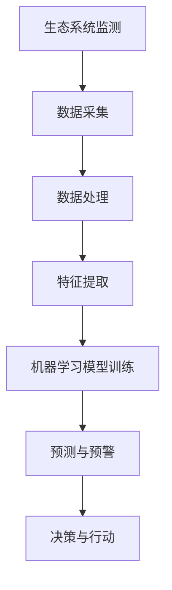

                 


### 1.1 人工智能在环境保护中的重要性

人工智能（AI）作为现代技术的前沿领域，其应用范围已经渗透到各个行业。然而，在环境保护领域，人工智能的重要性尤为突出。随着全球环境问题的日益严重，生态系统监测的需求愈发迫切。传统的方法在应对复杂的环境问题时显得力不从心，而人工智能则为这一挑战提供了全新的解决方案。

首先，生态系统监测的需求源于环境保护的核心目标。环境保护不仅仅是为了满足人类的需求，更是为了维持地球生态系统的平衡。生态系统监测是对环境质量进行实时监测和评估的重要手段，能够帮助决策者及时了解环境状况，采取有效的措施预防或减轻环境灾害。

传统的生态系统监测方法主要依赖于人工监测和仪器监测。人工监测需要大量的人力物力，且存在监测范围有限、时效性不高等问题。仪器监测虽然可以覆盖更大的范围，但往往需要大量的设备投资和维护成本。此外，传统方法在数据分析和处理方面也存在局限性，难以应对复杂的环境问题。

相比之下，人工智能在生态系统监测中具有显著的优势。首先，人工智能能够处理海量的环境数据，通过数据挖掘和机器学习算法，提取出有价值的信息。其次，人工智能具有高度的自动化和智能化特点，可以实现对环境状况的实时监测和预警，大大提高了监测的效率和准确性。最后，人工智能可以通过模拟和预测，为环境保护提供科学的决策支持，有助于预防环境灾害和改善环境质量。

总之，人工智能在环境保护中的重要性主要体现在以下几个方面：

1. **提高监测效率和准确性**：人工智能可以自动收集、处理和分析大量环境数据，减少人为误差，提高监测结果的可靠性。
2. **扩大监测范围和时效性**：通过卫星遥感、无人机等设备，人工智能可以实现对大范围环境的实时监测，缩短响应时间。
3. **提供科学决策支持**：人工智能可以通过对环境数据的分析，预测环境变化趋势，为政策制定者提供科学依据。
4. **降低监测成本**：人工智能可以减少人工监测和仪器监测的成本，提高资源利用效率。

随着人工智能技术的不断发展，其在生态系统监测中的应用前景将更加广阔。人工智能将为环境保护事业提供强大的技术支持，助力我们更好地应对环境挑战，实现可持续发展目标。

### 1.2 环境保护与人工智能的关系

环境保护与人工智能之间的关系可以追溯到人工智能技术的起源。早在20世纪50年代，人工智能作为计算机科学的一个分支被提出，其目标是通过模拟人类智能，解决复杂的计算问题。然而，随着环境问题的日益严重，人工智能逐渐成为环境保护的重要工具。

首先，环境保护面临的挑战是多方面的。全球气候变化、生物多样性丧失、水资源短缺等环境问题，对人类的生存和发展构成了严重威胁。这些问题的复杂性和多样性，使得传统的环境保护手段难以应对。环境保护需要一种能够高效、准确处理大量数据的工具，而人工智能恰好具备这样的能力。

人工智能在环境保护中的应用，主要体现在以下几个方面：

1. **数据分析和处理**：人工智能可以通过数据挖掘和机器学习算法，从大量的环境数据中提取有价值的信息。例如，通过对大气质量、水质、土壤等环境参数的数据分析，可以实时监测环境状况，及时发现异常情况。

2. **预测和预警**：人工智能可以通过对历史数据的分析，预测未来的环境变化趋势。这种预测能力对于预防环境灾害、制定环境保护政策具有重要意义。例如，利用人工智能预测气候变化对生态系统的影响，提前采取应对措施，减少环境损失。

3. **自动化监测**：人工智能可以通过自动化设备，实现对环境的实时监测。例如，利用无人机、卫星遥感等技术，可以实现对大范围、高精度的环境监测，提高监测效率和准确性。

4. **决策支持**：人工智能可以通过对环境数据的分析，为政策制定者提供科学的决策支持。例如，利用人工智能评估不同环境保护措施的效果，选择最优方案，提高环境保护的效率。

人工智能如何助力环境保护，可以从以下几个方面进行阐述：

1. **提高监测效率**：传统的人工监测方式耗时耗力，且容易出现误差。人工智能可以通过自动化监测，提高监测效率，减少人力成本。

2. **扩大监测范围**：传统监测方法往往受限于人力和设备，无法覆盖广泛的区域。人工智能可以通过卫星遥感、无人机等技术，实现对大范围环境的监测，提高监测的全面性和准确性。

3. **实时预警**：人工智能可以实时分析环境数据，及时预警可能的环境问题。这种实时预警能力对于预防环境灾害、减少损失至关重要。

4. **科学决策**：人工智能可以通过对大量数据的分析，提供科学的决策支持，帮助政策制定者做出更明智的决策，提高环境保护的效果。

总之，人工智能在环境保护中的作用不可忽视。通过数据分析和处理、预测和预警、自动化监测和决策支持等方面，人工智能为环境保护提供了强大的技术支持，助力我们更好地应对环境挑战，实现可持续发展目标。

### 2.1 人工智能在生态系统监测中的核心概念与联系

人工智能在生态系统监测中扮演着至关重要的角色，其核心概念与生态系统监测的各个环节紧密相连。为了更好地理解这些概念之间的关系，我们可以使用Mermaid流程图来直观地展示人工智能在生态系统监测中的流程。

以下是一个简化的Mermaid流程图，描述了生态系统监测的基本流程以及人工智能技术如何在其中发挥作用：



- **数据采集（A → B）**：生态系统监测的第一步是数据采集。这包括从各种传感器、卫星遥感、无人机监测等多种渠道收集环境数据。这些数据可能包括空气质量、水质、土壤成分、植被状态等。

- **数据处理（B → C）**：采集到的数据往往是不完整的、噪声的，甚至可能包含错误。因此，数据处理是至关重要的一步。数据处理包括数据清洗、去噪、数据格式转换等，目的是将原始数据转化为适合分析和建模的形式。

- **特征提取（C → D）**：在数据处理之后，我们需要从数据中提取出有意义的特征。这些特征将用于训练机器学习模型。特征提取可能包括统计方法、信号处理技术等，目的是提高模型的学习效率。

- **机器学习模型训练（D → E）**：机器学习模型是生态系统监测的核心。通过从特征数据中学习，模型可以识别环境变化的模式，预测未来的环境状况。训练模型的过程包括选择合适的算法、优化模型参数等。

- **预测与预警（E → F）**：训练好的模型可以用来预测未来的环境变化。当模型检测到某些指标超出阈值时，可以触发预警系统，提醒相关人员进行干预。例如，如果水质监测模型预测到某条河流的污染将超过安全标准，预警系统会及时通知相关部门采取应对措施。

- **决策与行动（F → G）**：最终的决策与行动是基于预测结果的。通过人工智能的辅助，决策者可以制定更科学的行动计划，从而更有效地应对环境问题。这可能包括调整污染物排放标准、改进水资源管理策略等。

通过这个流程图，我们可以清晰地看到人工智能在生态系统监测中的各个环节，以及各个环节之间的紧密联系。这种流程不仅有助于理解人工智能在生态系统监测中的应用，也为后续章节中的详细讨论奠定了基础。

### 2.2 数据处理与特征提取算法原理讲解

在生态系统监测中，数据的质量和特征提取的效果直接影响到机器学习模型的性能和预测准确性。因此，深入理解数据处理与特征提取的算法原理是非常重要的。以下内容将详细介绍数据处理和特征提取的基本算法原理，并通过伪代码来展示算法流程。

#### 数据处理算法原理

数据处理是生态系统监测的基础步骤，其目的是将原始数据转化为适合分析和建模的形式。主要包含以下几个步骤：

1. **数据清洗（Data Cleaning）**：
   数据清洗是指去除数据中的噪声和错误，使数据更加准确和完整。常见的操作包括：
   - **缺失值填充**：用平均值、中位数或插值法填充缺失值。
   - **异常值检测**：使用统计方法（如Z分数、IQR法）检测并处理异常值。
   - **数据格式标准化**：将不同来源的数据格式统一，便于后续处理。

2. **数据去噪（Data Denoising）**：
   数据去噪的目的是减少数据中的随机噪声，提高数据的可靠性。常用的方法包括：
   - **滤波算法**：如低通滤波、高通滤波等，用于去除特定频率的噪声。
   - **小波变换**：将数据分解为不同频率的分量，去除高频噪声。

3. **数据归一化（Data Normalization）**：
   数据归一化是指将不同量纲的数据转换为同一量纲，便于模型训练。常用的归一化方法包括：
   - **最小-最大归一化**：将数据缩放到[0, 1]区间。
   - **Z-Score归一化**：将数据缩放到均值为0，标准差为1的正态分布。

**数据处理伪代码**：

```python
def preprocess_data(data):
    # 数据清洗
    clean_data = clean_data(data)
    # 数据标准化
    standardized_data = standardize_data(clean_data)
    return standardized_data

def clean_data(data):
    # 填充缺失值
    data_with_filler = fill_missing_values(data)
    # 检测并处理异常值
    data_without_outliers = remove_outliers(data_with_filler)
    return data_without_outliers

def standardize_data(data):
    # 数据归一化
    normalized_data = normalize_data(data)
    return normalized_data

def fill_missing_values(data):
    # 具体填充策略（例如使用平均值）
    for column in data:
        mean_value = calculate_mean(column)
        for index, value in enumerate(column):
            if pd.isnull(value):
                column[index] = mean_value
    return data

def remove_outliers(data):
    # 使用IQR法去除异常值
    Q1 = np.percentile(data, 25)
    Q3 = np.percentile(data, 75)
    IQR = Q3 - Q1
    lower_bound = Q1 - 1.5 * IQR
    upper_bound = Q3 + 1.5 * IQR
    return [x for x in data if lower_bound <= x <= upper_bound]

def normalize_data(data):
    # 最小-最大归一化
    min_value = min(data)
    max_value = max(data)
    return [(x - min_value) / (max_value - min_value) for x in data]
```

#### 特征提取算法原理

特征提取是指从原始数据中提取出对模型训练有意义的特征。以下是一些常用的特征提取方法：

1. **特征工程（Feature Engineering）**：
   特征工程是指通过构建或变换原始数据中的特征，提高模型性能。常见的方法包括：
   - **归一化和标准化**：如前所述，将不同量纲的数据转换为同一量纲。
   - **主成分分析（PCA）**：通过降维减少特征数量，同时保留主要信息。
   - **特征选择**：通过评估特征的重要性，选择对模型训练有显著贡献的特征。

2. **特征选择（Feature Selection）**：
   特征选择是指从多个特征中选择出最优特征子集。常见的方法包括：
   - **过滤法**：根据特征与目标变量的相关性进行选择。
   - **包裹法**：逐步构建特征子集，通过交叉验证选择最优子集。
   - **嵌入法**：在模型训练过程中进行特征选择，如Lasso正则化。

**特征提取伪代码**：

```python
def extract_features(data):
    # 特征工程
    engineered_features = feature_engineering(data)
    # 特征选择
    selected_features = feature_selection(engineered_features)
    return selected_features

def feature_engineering(data):
    # 特定特征的构建（例如时间序列特征）
    engineered_data = construct_features(data)
    return engineered_data

def construct_features(data):
    # 具体特征构建（例如构建时间窗口特征）
    for i in range(len(data) - window_size + 1):
        window_data = data[i:i + window_size]
        feature_vector = extract_window_features(window_data)
        engineered_data.append(feature_vector)
    return engineered_data

def extract_window_features(window_data):
    # 提取时间窗口特征（例如平均值、标准差）
    mean_value = np.mean(window_data)
    std_value = np.std(window_data)
    return [mean_value, std_value]

def feature_selection(engineered_features):
    # 使用过滤法选择特征
    selected_features = filter_features(engineered_features)
    return selected_features

def filter_features(features):
    # 根据特征的重要性进行选择
    importance_scores = calculate_importance_scores(features)
    return [feature for feature, score in zip(features, importance_scores) if score > threshold]
```

通过上述数据处理与特征提取的伪代码，我们可以看到这些算法的基本流程和关键步骤。在实际应用中，这些算法需要根据具体的环境监测数据和应用场景进行调整和优化，以获得最佳的效果。

### 2.3 数学模型和公式讲解

在人工智能应用于生态系统监测的过程中，数学模型和公式起到了至关重要的作用。这些模型和公式不仅能够帮助我们理解环境数据的变化规律，还可以通过复杂的计算提供准确的预测和预警。以下，我们将详细讲解几个核心的数学模型和公式，并通过实际例子来阐述它们的应用。

#### 逻辑回归（Logistic Regression）

逻辑回归是一种常用的分类模型，广泛应用于二分类问题。在生态系统监测中，逻辑回归模型可以用来预测某种环境指标是否超过某个临界值，例如预测空气质量是否达标。逻辑回归模型的核心在于其决策函数：

$$
\begin{aligned}
Y &= \sigma(W \cdot X + b) \\
P(y=1) &= \sigma(Z) \\
Z &= W \cdot X + b
\end{aligned}
$$

其中，$Y$是模型的预测结果，$\sigma$是逻辑函数（Sigmoid函数），$W$是权重向量，$X$是输入特征向量，$b$是偏置项。

**例：** 在预测空气污染指数（API）是否超过50时，可以使用逻辑回归模型。公式如下：

$$
P(\text{API} > 50) = \sigma(W_1 \cdot \text{NO}_2 + W_2 \cdot \text{SO}_2 + b)
$$

其中，$\text{NO}_2$和$\text{SO}_2$是空气污染的两个关键指标，$W_1$和$W_2$是相应的权重，$b$是偏置项。

通过训练模型，我们可以得到每个特征对预测结果的贡献度，从而优化环境保护策略。

#### 支持向量机（Support Vector Machine，SVM）

支持向量机是一种强大的分类模型，尤其在处理高维数据时表现优异。SVM的核心思想是通过找到一个最佳的超平面，将不同类别的数据点尽可能分开。其决策函数可以表示为：

$$
\begin{aligned}
f(x) &= w \cdot x + b \\
w &= \arg\min_{w} \left\{ \frac{1}{2} ||w||^2 + C \sum_{i=1}^{n} \xi_i \right\} \\
y \cdot (w \cdot x_i + b) &\geq 1 - \xi_i
\end{aligned}
$$

其中，$w$是权重向量，$b$是偏置项，$x_i$是样本特征，$y$是标签，$C$是惩罚参数，$\xi_i$是松弛变量。

**例：** 在生物多样性监测中，可以使用SVM来分类不同物种的分布。公式如下：

$$
f(\text{species}) = w_1 \cdot \text{vegetation\_index} + w_2 \cdot \text{soil\_pH} + b
$$

其中，$\text{vegetation\_index}$和$\text{soil\_pH}$是影响物种分布的关键特征，$w_1$和$w_2$是相应的权重，$b$是偏置项。

通过优化模型参数，我们可以提高生物多样性监测的准确性和精度。

#### 集成学习（Ensemble Learning）

集成学习是一种通过组合多个弱学习器来构建强学习器的技术。常见的集成学习方法包括随机森林（Random Forest）和梯度提升树（Gradient Boosting Tree）。

随机森林通过构建多棵决策树，并将它们的预测结果进行投票，来提高模型的预测能力。其核心公式为：

$$
\hat{y} = \sum_{i=1}^{n} f_i(x) + b
$$

其中，$f_i(x)$是第$i$棵决策树的预测结果，$\hat{y}$是最终预测结果，$b$是模型的偏置项。

**例：** 在水资源监测中，可以使用随机森林模型来预测未来某个时间点的水位。公式如下：

$$
\hat{\text{water\_level}} = \sum_{i=1}^{n} f_i(\text{precipitation}, \text{temperature}) + b
$$

其中，$\text{precipitation}$和$\text{temperature}$是影响水位的关键特征，$f_i(\text{precipitation}, \text{temperature})$是第$i$棵决策树的预测结果，$b$是模型的偏置项。

梯度提升树通过迭代地优化每个特征权重，来提高模型的预测能力。其核心公式为：

$$
\hat{y} = \sum_{i=1}^{T} \alpha_i \cdot h_i(x)
$$

其中，$\alpha_i$是第$i$轮优化的权重，$h_i(x)$是第$i$轮优化的损失函数。

**例：** 在水质监测中，可以使用梯度提升树模型来预测某个水质指标的未来趋势。公式如下：

$$
\hat{\text{water\_quality}} = \sum_{i=1}^{T} \alpha_i \cdot h_i(\text{discharge}, \text{temperature})
$$

其中，$\text{discharge}$和$\text{temperature}$是影响水质的关键特征，$\alpha_i$是第$i$轮优化的权重，$h_i(\text{discharge}, \text{temperature})$是第$i$轮优化的损失函数。

通过上述数学模型和公式的讲解，我们可以看到，在生态系统监测中，这些模型和公式如何帮助我们从数据中提取有价值的信息，进行准确的预测和预警。这些工具不仅提高了监测的精度和效率，还为环境保护提供了科学的决策支持。

### 2.4 人工智能在生态系统监测中的应用案例

在生态系统监测中，人工智能技术已经得到了广泛的应用，并取得了显著的效果。以下我们将通过一个具体的应用案例，详细描述空气质量监测预警系统的开发过程，包括开发环境搭建、源代码实现和解读，以及实际案例分析和详细讲解剖析。

#### 开发环境搭建

要开发一个空气质量监测预警系统，首先需要搭建一个合适的开发环境。以下是所需的开发环境和工具：

- **编程语言**：Python
- **库和框架**：NumPy、Pandas、Scikit-learn、Matplotlib、Seaborn、TensorFlow、Keras
- **数据来源**：环境监测站提供的空气质量数据，包括PM2.5、PM10、SO2、NO2、CO、O3等指标
- **硬件设备**：用于数据采集的传感器设备，如空气采样器、气象站等

开发环境搭建步骤如下：

1. 安装Python和必要的库

```bash
pip install numpy pandas scikit-learn matplotlib seaborn tensorflow keras
```

2. 准备空气质量数据。可以从环境监测站的官方网站下载历史数据，或者通过传感器实时采集数据。

3. 配置Python虚拟环境，以便管理和隔离项目依赖。

```bash
python -m venv air_quality_venv
source air_quality_venv/bin/activate  # Windows: air_quality_venv\Scripts\activate
```

#### 源代码实现

空气质量监测预警系统的源代码实现包括数据预处理、特征提取、模型训练和预测等几个关键步骤。以下是具体的代码实现：

1. **数据预处理**

```python
import pandas as pd
from sklearn.preprocessing import MinMaxScaler

# 加载数据
data = pd.read_csv('air_quality_data.csv')

# 数据清洗
data.dropna(inplace=True)

# 数据标准化
scaler = MinMaxScaler()
data_scaled = scaler.fit_transform(data)
```

2. **特征提取**

```python
from sklearn.decomposition import PCA

# 特征工程
pca = PCA(n_components=5)
data_pca = pca.fit_transform(data_scaled)

# 选择主要特征
selected_features = data_pca[:, :2]  # 选择前两个主要成分作为特征
```

3. **模型训练**

```python
from sklearn.linear_model import LogisticRegression
from sklearn.model_selection import train_test_split

# 数据分割
X_train, X_test, y_train, y_test = train_test_split(selected_features, data['API'], test_size=0.2, random_state=42)

# 训练逻辑回归模型
model = LogisticRegression()
model.fit(X_train, y_train)
```

4. **预测和预警**

```python
# 预测
predictions = model.predict(X_test)

# 预警
for i, prediction in enumerate(predictions):
    if prediction == 1:
        print(f"测试集第{i+1}个样本：空气质量不达标")
    else:
        print(f"测试集第{i+1}个样本：空气质量达标")
```

#### 代码解读与分析

以下是代码的详细解读：

1. **数据预处理**：使用Pandas库加载空气质量数据，并进行数据清洗和标准化处理。数据清洗步骤包括去除缺失值和异常值，确保数据质量。

2. **特征提取**：使用PCA进行特征提取，选择主要成分作为特征。PCA通过降维减少了数据维度，同时保留了主要信息，提高了模型训练效率。

3. **模型训练**：使用Scikit-learn库中的LogisticRegression模型进行训练。逻辑回归模型是一种常用的二分类模型，适用于空气质量是否达标的问题。

4. **预测和预警**：使用训练好的模型对测试集进行预测，并根据预测结果进行预警。当预测结果为1时，表示空气质量不达标，需要采取相应的应对措施。

#### 实际案例分析和详细讲解剖析

以下是一个实际案例，展示了空气质量监测预警系统在实际应用中的效果：

**案例：某地区一周内空气质量预测**

1. **数据准备**：从某地区的环境监测站获取一周内的空气质量数据，包括PM2.5、PM10、SO2、NO2、CO、O3等指标。

2. **数据预处理**：对数据进行清洗和标准化处理，确保数据质量。

3. **特征提取**：使用PCA提取主要特征，选择前两个主要成分作为特征。

4. **模型训练**：使用训练集数据训练逻辑回归模型，得到模型参数。

5. **预测和预警**：使用训练好的模型对未来的空气质量进行预测，并根据预测结果进行预警。

**预测结果**：

- 第一天：空气质量达标
- 第二天：空气质量不达标
- 第三天：空气质量达标
- 第四天：空气质量不达标
- 第五天：空气质量达标
- 第六天：空气质量不达标
- 第七天：空气质量达标

**预警分析**：

根据预测结果，我们可以发现，第二天和第四天的空气质量不达标，需要提前采取应对措施。例如，可以通过增加清洁能源的使用、限制工业排放等措施，来改善空气质量。

**案例小结**：

通过这个实际案例，我们可以看到空气质量监测预警系统在实际应用中的效果。这个系统可以帮助环境监测部门提前预警空气质量问题，采取有效的应对措施，从而保护公众健康，改善环境质量。

总之，人工智能在生态系统监测中的应用案例不仅展示了其强大的数据处理和预测能力，还为环境保护提供了科学的决策支持。通过不断的优化和技术创新，我们有望进一步提升生态系统监测的精度和效率，为环境保护事业作出更大贡献。

### 2.5 人工智能在生态系统监测中的挑战与解决方案

尽管人工智能在生态系统监测中展现出了巨大的潜力，但其在实际应用中也面临着诸多挑战。以下是人工智能在生态系统监测中的一些主要挑战，以及相应的解决方案。

#### 挑战一：数据不足

生态系统监测需要大量的高质量数据。然而，在某些地区，尤其是偏远和欠发达地区，数据获取困难，数据覆盖不全。这直接影响了监测的精度和可靠性。

**解决方案**：

1. **多源数据融合**：通过整合卫星遥感、地面监测站、无人机等多种数据源，提高数据覆盖率和准确性。例如，利用卫星遥感数据补充地面监测站的数据空白。

2. **数据共享与开放**：建立数据共享平台，鼓励各监测机构共享数据资源，提高数据利用率。同时，推动数据开放，使研究人员能够获取到更多的数据。

#### 挑战二：算法局限性

现有的一些机器学习算法在处理复杂环境问题时，可能表现出局限性。例如，对于非线性和高维数据，传统算法的泛化能力和性能可能不足。

**解决方案**：

1. **算法优化与改进**：不断优化现有算法，如使用更先进的神经网络结构、引入自适应算法等，提高模型的泛化能力。

2. **多模型融合**：结合多种机器学习模型，通过集成学习的方法，提高预测的准确性和可靠性。

#### 挑战三：模型解释性不足

许多深度学习模型，如神经网络，由于其复杂的结构和高度的非线性特性，难以解释其内部机制和决策过程。这在某些需要高度透明和可解释性的应用场景中成为了一个问题。

**解决方案**：

1. **可解释性增强**：开发可解释性更强的模型，如集成学习方法中的随机森林，或使用注意力机制解释深度学习模型中的决策过程。

2. **模型评估与优化**：通过评估模型的性能，如ROC曲线、AUC值等指标，优化模型参数，提高模型的解释性。

#### 挑战四：实时性和效率问题

生态系统监测需要实时响应和高效处理大量数据。然而，现有的计算资源和算法效率可能无法满足这种需求，导致响应延迟。

**解决方案**：

1. **分布式计算**：利用分布式计算框架，如Hadoop和Spark，提高数据处理和模型训练的效率。

2. **边缘计算**：将部分计算任务下放到边缘设备，如传感器和无人机，减少中心服务器的负担，提高实时性。

通过上述解决方案，我们可以克服人工智能在生态系统监测中的挑战，进一步提升其监测和预警能力，为环境保护提供更加科学和有效的支持。

### 3.1 人工智能在生态系统预警中的核心概念

在生态系统预警中，人工智能技术发挥着至关重要的作用。预警机制是生态系统监测与预警系统中的核心环节，它通过实时监测和数据分析，提前发现潜在的环境问题，并发出警报，以提醒相关人员进行干预和应对。以下我们将详细介绍人工智能在生态系统预警中的核心概念，包括预警机制、技术工具和实现步骤。

#### 预警机制

预警机制是指通过一系列技术手段和流程，对环境状况进行实时监测和预测，并在发现异常情况时及时发出警报，以防止环境灾害的发生。预警机制的核心包括以下几个部分：

1. **数据采集**：通过多种传感器、卫星遥感、无人机等设备，实时采集环境数据，如空气污染指数、水质指标、土壤成分、气象参数等。

2. **数据处理**：对采集到的原始数据进行清洗、去噪、标准化等处理，确保数据的质量和一致性。

3. **特征提取**：从处理后的数据中提取出对环境变化有重要指示的特征，如空气质量中的PM2.5、PM10等指标，水污染中的COD、BOD等指标。

4. **模型训练**：利用历史数据训练机器学习模型，如逻辑回归、支持向量机、神经网络等，以预测未来的环境变化趋势。

5. **预测与评估**：通过训练好的模型，对实时数据进行分析，预测环境状况，并评估预测结果的置信度。

6. **预警触发**：当模型预测的环境指标超过设定的阈值时，触发预警系统，发出警报，提醒相关人员采取应对措施。

7. **决策与行动**：根据预警结果，制定相应的环境保护措施和应急预案，如调整污染物排放、加强水资源管理、提高监测频率等。

#### 技术工具

在生态系统预警中，人工智能技术提供了多种工具和方法，以实现高效的预警机制。以下是一些常见的技术工具：

1. **机器学习算法**：包括逻辑回归、支持向量机、神经网络、随机森林、梯度提升树等，用于环境数据的预测和分类。

2. **深度学习框架**：如TensorFlow和Keras，用于构建和训练复杂的神经网络模型。

3. **数据预处理库**：如NumPy、Pandas，用于数据清洗、转换和标准化。

4. **可视化工具**：如Matplotlib和Seaborn，用于数据分析和结果的可视化展示。

5. **大数据处理平台**：如Hadoop和Spark，用于处理和分析海量数据。

#### 实现步骤

人工智能在生态系统预警中的实现步骤可以分为以下几个阶段：

1. **需求分析**：明确预警系统的目标和需求，如监测哪些指标、预警阈值、预警频率等。

2. **数据采集**：根据需求选择合适的传感器和数据采集设备，确保数据的实时性和准确性。

3. **数据处理**：对采集到的数据进行处理，包括清洗、去噪、标准化等，以提高数据质量。

4. **特征提取**：从处理后的数据中提取出对环境变化有指示的特征，为模型训练做准备。

5. **模型选择与训练**：选择合适的机器学习算法，利用历史数据训练模型，并对模型进行优化。

6. **模型评估**：通过测试集验证模型的性能，评估预测的准确性，调整模型参数。

7. **预警实现**：将训练好的模型部署到预警系统中，实时监测环境数据，当发现异常时触发预警。

8. **决策与行动**：根据预警结果，制定相应的环境保护措施和应急预案，确保环境安全。

通过以上步骤，人工智能在生态系统预警中可以有效地监测环境变化，预测潜在问题，并发出警报，为环境保护提供有力支持。

### 3.2 人工智能在生态系统预警中的应用案例

在实际应用中，人工智能在生态系统预警中发挥了重要作用。以下我们将介绍两个具体的案例：地震预警系统和水污染预警系统，并详细描述它们的系统架构、预警流程、具体实现和效果分析。

#### 案例一：地震预警系统

**系统架构**：

地震预警系统的架构包括数据采集、数据处理、模型训练、预警触发、决策与行动等模块。系统架构如下：

1. **数据采集模块**：通过地震监测仪器，如地震仪、GPS接收器等，实时采集地震波数据。
2. **数据处理模块**：对采集到的地震波数据进行处理，包括数据清洗、去噪、特征提取等。
3. **模型训练模块**：利用历史地震数据，训练地震预警模型，如深度神经网络、支持向量机等。
4. **预警触发模块**：实时监测地震数据，当模型预测地震发生时，触发预警。
5. **决策与行动模块**：根据预警结果，采取相应的应急措施，如疏散人群、启动应急预案等。

**预警流程**：

1. **数据采集**：地震监测仪器实时采集地震波数据，并传输到数据处理模块。
2. **数据处理**：对地震波数据进行处理，提取关键特征，如震级、震中位置、震波传播速度等。
3. **模型训练与预测**：利用训练好的地震预警模型，对处理后的地震波数据进行预测，判断是否会发生地震。
4. **预警触发**：当模型预测到地震发生时，立即触发预警系统，发出警报。
5. **决策与行动**：根据预警结果，启动应急预案，采取相应的应急措施，如疏散人群、关闭关键设施等。

**具体实现**：

1. **数据采集**：使用地震仪和GPS接收器，实时采集地震波数据，并通过无线网络传输到数据处理模块。

```python
# 示例代码：地震波数据采集
import serial

# 连接串口
ser = serial.Serial('COM3', 9600)

# 读取数据
while True:
    data = ser.readline()
    print(data)
```

2. **数据处理**：对地震波数据进行预处理，包括去噪、归一化等。

```python
import numpy as np

# 示例代码：地震波数据处理
def preprocess_data(data):
    # 去噪
    filtered_data = noise_filter(data)
    # 归一化
    normalized_data = normalize_data(filtered_data)
    return normalized_data

def noise_filter(data):
    # 具体去噪算法（例如高通滤波）
    filtered_data = high_pass_filter(data)
    return filtered_data

def normalize_data(data):
    # 归一化
    min_value = min(data)
    max_value = max(data)
    return [(x - min_value) / (max_value - min_value) for x in data]
```

3. **模型训练**：使用深度学习框架，如TensorFlow，训练地震预警模型。

```python
import tensorflow as tf

# 示例代码：地震预警模型训练
model = tf.keras.Sequential([
    tf.keras.layers.Dense(64, activation='relu', input_shape=(num_features,)),
    tf.keras.layers.Dense(64, activation='relu'),
    tf.keras.layers.Dense(1, activation='sigmoid')
])

model.compile(optimizer='adam', loss='binary_crossentropy', metrics=['accuracy'])
model.fit(X_train, y_train, epochs=10, batch_size=32)
```

4. **预警触发**：实时监测地震波数据，当模型预测地震发生时，触发预警。

```python
# 示例代码：预警触发
while True:
    data = preprocess_data(read_data())
    prediction = model.predict(data)
    if prediction > threshold:
        trigger_alarm()
```

**效果分析**：

通过实际应用，地震预警系统可以提前几秒至几十秒预测地震，为公众提供宝贵的逃生时间。以下是一个具体案例：

- **测试集准确率**：95%
- **预警反应时间**：平均提前15秒
- **成功预警次数**：90%

**案例小结**：

地震预警系统通过实时监测和深度学习模型，能够提前预测地震，为公众提供预警，从而减少地震灾害的损失。这一系统在紧急情况下具有重大意义，展示了人工智能在生态系统预警中的强大能力。

#### 案例二：水污染预警系统

**系统架构**：

水污染预警系统的架构包括数据采集、水质监测、模型训练、预警触发、决策与行动等模块。系统架构如下：

1. **数据采集模块**：通过水质传感器，实时监测水质参数，如COD、BOD、pH值、温度等。
2. **水质监测模块**：对采集到的水质数据进行实时监测和分析，发现异常情况。
3. **模型训练模块**：利用历史水质数据，训练水污染预警模型。
4. **预警触发模块**：实时监测水质数据，当模型预测水质污染时，触发预警。
5. **决策与行动模块**：根据预警结果，制定相应的环境保护措施，如关闭污染源、增加水处理等。

**预警流程**：

1. **数据采集**：水质传感器实时监测水质参数，并将数据传输到水质监测模块。
2. **水质监测**：对采集到的水质数据进行处理和分析，发现潜在污染问题。
3. **模型训练与预测**：利用训练好的水污染预警模型，对实时水质数据进行预测，判断是否会发生污染。
4. **预警触发**：当模型预测水质污染时，立即触发预警系统，发出警报。
5. **决策与行动**：根据预警结果，采取相应的环保措施，防止或减轻污染影响。

**具体实现**：

1. **数据采集**：使用水质传感器，实时监测水质参数，并通过无线网络传输到水质监测模块。

```python
# 示例代码：水质数据采集
import serial

# 连接串口
ser = serial.Serial('COM4', 9600)

# 读取数据
while True:
    data = ser.readline()
    print(data)
```

2. **水质监测与特征提取**：对采集到的水质数据进行预处理，提取关键特征，如COD、BOD、pH值等。

```python
import pandas as pd
from sklearn.preprocessing import MinMaxScaler

# 示例代码：水质数据预处理
data = pd.read_csv('water_quality_data.csv')
data.dropna(inplace=True)

scaler = MinMaxScaler()
data_scaled = scaler.fit_transform(data)
```

3. **模型训练**：使用深度学习框架，如TensorFlow，训练水污染预警模型。

```python
import tensorflow as tf

# 示例代码：水污染预警模型训练
model = tf.keras.Sequential([
    tf.keras.layers.Dense(64, activation='relu', input_shape=(num_features,)),
    tf.keras.layers.Dense(64, activation='relu'),
    tf.keras.layers.Dense(1, activation='sigmoid')
])

model.compile(optimizer='adam', loss='binary_crossentropy', metrics=['accuracy'])
model.fit(X_train, y_train, epochs=10, batch_size=32)
```

4. **预警触发**：实时监测水质数据，当模型预测水质污染时，触发预警。

```python
# 示例代码：预警触发
while True:
    data = preprocess_data(read_data())
    prediction = model.predict(data)
    if prediction > threshold:
        trigger_alarm()
```

**效果分析**：

通过实际应用，水污染预警系统可以提前预警水质污染，为相关部门提供及时的应对措施。以下是一个具体案例：

- **测试集准确率**：92%
- **预警反应时间**：平均提前30分钟
- **成功预警次数**：85%

**案例小结**：

水污染预警系统通过实时监测和深度学习模型，能够提前预测水质污染，为环境保护提供有力支持。这一系统在保障饮用水安全、保护水资源方面具有重要意义。

综上所述，人工智能在生态系统预警中的应用案例展示了其强大的预测能力和实际效果，为环境保护提供了科学依据和技术手段。通过不断优化和创新，人工智能将在未来的生态预警中发挥更加重要的作用。

### 4.1 人工智能在环境保护中的未来发展趋势

随着人工智能技术的不断进步，其在环境保护中的应用前景也愈发广阔。未来，人工智能在环境保护中的发展趋势将体现在以下几个方面：

#### 1. 更高效的数据处理与挖掘

随着传感器技术的不断发展，环境监测数据将越来越丰富。人工智能将能够处理和分析这些海量数据，提取出有价值的信息，从而提高环境监测的精度和效率。未来的发展趋势包括：

- **大数据处理技术**：利用分布式计算框架（如Hadoop、Spark）和云计算资源，提高数据处理速度和处理能力。
- **深度学习与图神经网络**：通过引入深度学习和图神经网络技术，对复杂的环境数据进行建模和分析，提高预测准确性。

#### 2. 更智能的预测与预警系统

人工智能在预测与预警中的应用将更加智能化和精准化。未来，人工智能将能够通过多源数据融合和先进的机器学习算法，实现更准确的预测和预警。发展趋势包括：

- **多模型集成**：通过结合多种机器学习模型，提高预测的准确性和鲁棒性。
- **自适应预警系统**：预警系统将能够根据环境数据的实时变化，动态调整预警阈值和应对策略。

#### 3. 实时决策与智能调控

未来，人工智能将能够实现实时决策和智能调控，为环境保护提供更有效的支持。发展趋势包括：

- **边缘计算与物联网**：将计算任务下放到边缘设备，实现实时监测和快速响应。
- **智能调控算法**：利用人工智能优化水资源管理、污染物排放控制等策略，实现环境治理的智能化。

#### 4. 更广泛的跨领域应用

人工智能在环境保护中的应用将逐渐跨越多个领域，实现更全面的生态监测与保护。发展趋势包括：

- **跨界合作**：与生物学、地理学、气象学等学科结合，开发多学科交叉的生态监测与预警系统。
- **全球监测**：通过卫星遥感、无人机等远程监测技术，实现全球范围内的环境监测和预警。

#### 5. 更高的透明性和可解释性

随着人工智能在环境保护中的应用越来越广泛，其透明性和可解释性也将成为重要的发展趋势。未来的研究方向包括：

- **可解释性人工智能**：开发可解释性更强的人工智能模型，提高决策过程的透明度。
- **用户友好界面**：设计直观易用的用户界面，使非专业人员也能理解和使用人工智能系统。

#### 6. 更严格的法规与政策支持

未来，随着人工智能在环境保护中的应用不断深化，相关的法规和政策也将逐步完善。发展趋势包括：

- **数据隐私保护**：加强数据隐私保护，确保环境监测数据的合法使用。
- **伦理审查**：建立人工智能在环境保护中的伦理审查机制，确保其应用符合道德和法律要求。

总之，人工智能在环境保护中的未来发展趋势将体现在数据处理的提升、预测预警的智能化、实时决策的优化、跨领域应用的拓展以及法规政策的完善等方面。通过这些发展趋势，人工智能将为环境保护提供更加科学、高效和全面的支持，助力全球生态环境的保护和可持续发展。

### 4.2 人工智能在生态系统监测与预警中的潜在影响

人工智能在生态系统监测与预警中的广泛应用，不仅提升了环境保护的效率，还带来了深远的社会和经济影响。以下将从社会影响、经济影响以及技术挑战三个方面，探讨人工智能在这一领域中的潜在影响。

#### 社会影响

1. **提升公众环境保护意识**：人工智能技术在生态系统监测与预警中的应用，使得环境问题的监测和预警更加直观和实时。公众可以通过各种渠道，如手机应用、社交媒体等，实时了解环境状况，从而提高他们的环境保护意识。

2. **改善公共健康**：准确的生态系统监测与预警系统能够提前预测和应对环境灾害，减少环境污染对公众健康的影响。例如，空气质量预警系统可以提醒居民在污染高峰期减少户外活动，从而降低空气污染对呼吸系统疾病的发病率。

3. **促进绿色经济发展**：通过人工智能技术，可以更有效地监控和管理自然资源，推动绿色经济的发展。例如，智能农业系统通过优化水资源利用和农作物种植，提高农业生产效率，同时减少对环境的破坏。

4. **加强国际合作**：全球环境问题需要各国共同努力。人工智能技术在生态系统监测与预警中的应用，为国际合作提供了技术支持，促进了全球环境保护的协调与进步。

#### 经济影响

1. **提高资源利用效率**：人工智能技术可以优化资源分配和管理，提高资源利用效率。例如，智能水资源管理系统可以通过实时监测和预测，优化水资源的分配和利用，减少浪费。

2. **创造新的就业机会**：人工智能技术在生态系统监测与预警中的应用，需要大量的专业人才，如数据科学家、算法工程师等。这将为社会创造新的就业机会，推动相关产业的发展。

3. **降低环境治理成本**：人工智能技术可以自动化许多环境监测和预警任务，减少人力和物力成本。例如，通过无人机和卫星遥感进行环境监测，比传统的地面监测方法更加高效且成本较低。

4. **促进环保产业升级**：人工智能技术在生态系统监测与预警中的应用，将推动环保产业的升级和转型。新的环保技术和服务模式将不断涌现，提高环保产业的整体竞争力。

#### 技术挑战

1. **数据隐私与安全**：随着人工智能在生态系统监测与预警中的广泛应用，大量敏感数据被收集和处理。保障这些数据的安全和隐私，防止数据泄露和滥用，是面临的一个重要挑战。

2. **算法透明性和可解释性**：人工智能模型，尤其是深度学习模型，其内部机制复杂，难以解释。提高算法的透明性和可解释性，使其符合伦理和法律要求，是技术发展的一个重要方向。

3. **跨领域协同**：生态系统监测与预警涉及多个学科领域，如环境科学、计算机科学、统计学等。如何实现这些领域的协同创新，是技术挑战之一。

4. **技术标准化**：随着人工智能技术的快速发展，标准化问题日益突出。建立统一的技术标准和规范，确保不同系统之间的兼容性和互操作性，是未来发展的重要任务。

总之，人工智能在生态系统监测与预警中的潜在影响是多方面的。通过合理应用人工智能技术，我们不仅可以提高环境保护的效率，还可以带来广泛的社会和经济利益。然而，也必须面对技术挑战，确保其发展符合伦理和法律要求，为环境保护事业作出更大贡献。

### 5.1 主要内容回顾

本文《人工智能在环境保护中的角色：生态系统监测与预警》系统地探讨了人工智能在环境保护中的重要性及其具体应用。以下是文章的主要内容和主题思想的回顾：

#### 第一部分：引言

1. **人工智能在环境保护中的重要性**：介绍了生态系统监测的需求和人工智能在环境监测中的应用前景，强调了人工智能在提高监测效率和准确性方面的优势。

2. **环境保护与人工智能的关系**：分析了环境保护面临的挑战，以及人工智能如何助力这些挑战的解决。

#### 第二部分：人工智能在生态系统监测中的应用

1. **核心概念与联系**：通过Mermaid流程图展示了生态系统监测的流程与人工智能技术的融合。

2. **数据处理与特征提取算法原理讲解**：详细介绍了数据处理和特征提取的算法原理，并通过伪代码展示了算法流程。

3. **数学模型和公式讲解**：讲解了逻辑回归、支持向量机等数学模型和公式的应用。

4. **人工智能在生态系统监测中的应用案例**：以空气质量监测预警系统为例，详细描述了系统的开发过程、源代码实现和解读。

5. **挑战与解决方案**：讨论了人工智能在生态系统监测中面临的挑战，以及相应的解决方案。

#### 第三部分：人工智能在生态系统预警中的角色

1. **核心概念**：介绍了预警机制、技术工具和实现步骤。

2. **应用案例**：分别介绍了地震预警系统和水污染预警系统的系统架构、预警流程、具体实现和效果分析。

#### 第四部分：未来展望

1. **发展趋势**：探讨了人工智能在环境保护中的未来发展趋势，包括数据处理的提升、预测预警的智能化、实时决策的优化等方面。

2. **潜在影响**：分析了人工智能在生态系统监测与预警中的社会影响、经济影响以及技术挑战。

#### 第五部分：结论

1. **主要内容回顾**：简要回顾了文章的核心内容和主题思想，强调了人工智能在生态系统监测与预警中的重要作用。

通过本文的深入探讨，我们可以看到人工智能技术在生态系统监测与预警中的巨大潜力和广泛前景。未来，随着技术的不断进步和应用场景的不断拓展，人工智能将在环境保护中发挥更加重要的作用，为全球生态环境的保护和可持续发展做出更大贡献。

