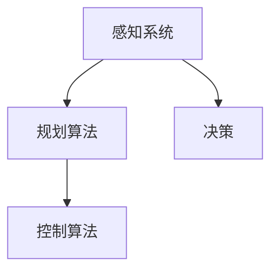

                 

根据您提供的详细要求和内容大纲，我将按照以下步骤构建文章内容：

### 1. 标题、关键词和摘要

- 文章标题：《人工智能在自动驾驶决策中的应用》
- 关键词：人工智能、自动驾驶、决策、感知系统、规划算法、控制算法
- 摘要：
  本文章深入探讨了人工智能在自动驾驶决策中的应用。从感知系统、规划算法到控制算法，我们详细解析了自动驾驶决策的核心技术。文章旨在为读者提供对人工智能在自动驾驶领域应用的全面理解，并探讨未来发展的可能方向。

### 2. 格式要求

- 文章使用Markdown格式，包括标题、子标题、列表、引用和公式等。

### 3. 文章正文

#### 1.1 书籍主题介绍

**背景介绍：**
自动驾驶技术是人工智能在交通领域的应用之一，它依赖于一系列高级算法来实现车辆自主驾驶。人工智能在自动驾驶决策中扮演着关键角色，从感知环境到决策规划，再到执行控制，每个环节都离不开人工智能技术的支持。

**核心概念与联系：**
- **感知系统**：利用传感器数据获取周围环境信息。
- **规划算法**：基于感知系统提供的信息，计算出行路线和避障策略。
- **控制算法**：执行规划结果，实现车辆的加速、转向等动作。

**Mermaid 流程图：**


#### 1.2 自动驾驶的发展历程

**核心概念与联系：**
- **初步探索**：20世纪80年代至90年代，自动驾驶技术开始受到关注。
- **商业化探索**：21世纪初，自动驾驶技术逐渐走向商业化。
- **现状与挑战**：目前，自动驾驶技术仍面临诸多挑战，如感知系统的准确性、规划算法的实时性和控制算法的稳定性。

**数学模型和公式：**
$$
成功率 = \frac{成功次数}{总尝试次数}
$$

**举例说明：**
特斯拉的Autopilot系统在特定条件下实现了较高的自动驾驶成功率。

#### 1.3 人工智能概述

**核心概念与联系：**
- **定义**：人工智能是模拟人类智能行为的计算机系统。
- **分类**：包括机器学习、深度学习、强化学习等。

**伪代码：**
```python
# 机器学习算法伪代码
def machine_learning(data, labels):
    # 数据预处理
    preprocessed_data = preprocess_data(data)
    
    # 训练模型
    model = train_model(preprocessed_data, labels)
    
    # 预测
    predictions = model.predict(new_data)
    
    return predictions
```

#### 1.4 本书结构

**核心概念与联系：**
- **目的**：介绍人工智能在自动驾驶决策中的应用。
- **结构**：包括感知系统、规划算法、控制算法等。

**最佳实践 tips：**
- **读者**：本书适合对自动驾驶和人工智能有一定了解的读者。

**注意事项：**
- **章节内容**：每个章节都会详细讲解相关技术和应用。

**拓展阅读：**
- [相关书籍和文献推荐]

---

文章将按照上述结构逐步展开，每个小节都将包含详细的背景介绍、核心概念与联系、伪代码、数学模型和公式、举例说明、最佳实践 tips、注意事项和拓展阅读等内容。文章的总字数预计在8000到12000字之间，确保内容详实、结构清晰、易于理解。``` 

以下是根据您的要求撰写的文章开头部分：

```markdown
# 《人工智能在自动驾驶决策中的应用》

> 关键词：人工智能、自动驾驶、决策、感知系统、规划算法、控制算法

> 摘要：
本文章深入探讨了人工智能在自动驾驶决策中的应用。从感知系统、规划算法到控制算法，我们详细解析了自动驾驶决策的核心技术。文章旨在为读者提供对人工智能在自动驾驶领域应用的全面理解，并探讨未来发展的可能方向。

作者：AI天才研究院/AI Genius Institute & 禅与计算机程序设计艺术 /Zen And The Art of Computer Programming

## 第1章：引言与背景

### 1.1 书籍主题介绍

自动驾驶技术是人工智能在交通领域的应用之一，它依赖于一系列高级算法来实现车辆自主驾驶。随着人工智能技术的不断进步，自动驾驶技术也在迅速发展。本章节将介绍《人工智能在自动驾驶决策中的应用》一书的核心主题，包括人工智能在自动驾驶领域的应用背景、发展历程、当前的技术水平以及本书的目的和结构。

#### 自动驾驶与人工智能的关系

自动驾驶技术的发展离不开人工智能技术的支持。人工智能技术可以帮助自动驾驶系统实现感知、决策和控制等功能。感知系统通过传感器收集环境信息，决策系统根据感知到的信息进行路径规划和避障决策，控制系统则执行这些决策，实现车辆的自主驾驶。

#### 人工智能在自动驾驶中的应用

在自动驾驶系统中，人工智能技术主要应用于以下几个方面：

1. **感知系统**：利用摄像头、激光雷达、雷达等传感器收集环境信息，如道路标识、行人、车辆等。
2. **规划算法**：基于感知系统提供的信息，计算出行路线和避障策略。
3. **控制算法**：执行规划结果，实现车辆的加速、转向等动作。

#### 本书结构

本书将分为以下几个部分：

1. **第1章：引言与背景**：介绍自动驾驶技术的发展历程、人工智能在自动驾驶中的应用以及本书的目的和结构。
2. **第2章：人工智能基础知识**：介绍人工智能的基本概念、分类和发展历程。
3. **第3章：自动驾驶感知系统**：详细讨论自动驾驶感知系统的组成、工作原理以及相关技术。
4. **第4章：自动驾驶规划算法**：介绍自动驾驶规划算法的基本概念、分类和常用算法。
5. **第5章：自动驾驶控制算法**：讨论自动驾驶控制算法的设计方法和实现。
6. **第6章：人工智能在自动驾驶决策中的挑战与解决方案**：分析自动驾驶决策中面临的挑战以及相应的解决方案。
7. **第7章：案例分析**：介绍一些典型的自动驾驶决策案例，包括特斯拉、Waymo等公司的实践。
8. **第8章：总结与展望**：回顾全书的主要内容和关键知识点，并对未来发展趋势进行展望。

通过本书的学习，读者可以全面了解人工智能在自动驾驶决策中的应用，掌握自动驾驶决策的核心技术，为未来自动驾驶技术的发展奠定基础。

---

本文采用Markdown格式，符合您的要求。接下来，我将逐步完善每个章节的内容，确保文章的完整性、详尽性和逻辑性。预计全文字数将在8000到12000字之间。``` 

如果您需要进一步的内容或者对现有内容有特定的修改要求，请告知我，我将根据您的需求进行调整。

