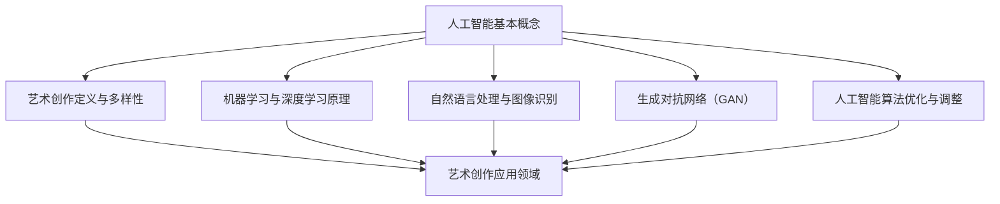

                 


### 文章标题: 人工智能在艺术创作中的角色探讨

### 关键词：人工智能，艺术创作，机器学习，深度学习，生成对抗网络，虚拟现实，版权问题

### 摘要：
本文旨在探讨人工智能在艺术创作中的角色。通过分析人工智能的基本概念，技术原理及其在视觉、音乐和文学艺术创作中的实际应用，本文揭示了人工智能对艺术创作流程、艺术家角色和艺术评价的影响。同时，本文还探讨了人工智能在艺术创作中面临的挑战，包括法律保护、伦理道德问题以及艺术教育中的应用。最后，本文对人工智能在艺术创作中的未来趋势进行了展望，强调了其创新潜力和跨学科合作的必要性。

----------------------------------------------------------------

### 设计《人工智能在艺术创作中的角色探讨》的目录大纲

#### 第一部分：基本概念与原理

#### 第1章: 人工智能与艺术创作概述
1.1 人工智能的基本概念
1.2 艺术创作的定义与多样性
1.3 人工智能在艺术创作中的历史与发展
1.4 AI在艺术创作中的应用领域

#### 第2章: AI在艺术创作中的技术原理
2.1 机器学习与深度学习原理
2.2 自然语言处理与图像识别
2.3 生成对抗网络（GAN）在艺术创作中的应用
2.4 人工智能算法在艺术表现中的优化与调整

#### 第二部分：实际应用案例

#### 第3章: AI在视觉艺术创作中的应用
3.1 AI绘画：算法创作与艺术风格迁移
3.2 AI摄影：自动调整与创意生成
3.3 虚拟现实与增强现实中的AI艺术
3.4 AI动画与视频制作

#### 第4章: AI在音乐创作中的应用
4.1 AI作曲：算法创作与音乐风格分析
4.2 AI音乐制作与编辑
4.3 AI音乐创作中的版权问题

#### 第5章: AI在文学艺术创作中的应用
5.1 AI写作：自动生成文本与内容创作
5.2 AI翻译：跨语言文学交流
5.3 AI阅读理解与分析

#### 第三部分：影响与挑战

#### 第6章: AI在艺术创作中的影响
6.1 AI对艺术创作流程的影响
6.2 AI对艺术家角色的转变
6.3 AI在艺术评价与鉴赏中的作用

#### 第7章: AI在艺术创作中的挑战
7.1 AI艺术作品的法律保护与知识产权
7.2 AI在艺术教育中的应用与挑战
7.3 艺术创作中的伦理与道德问题

#### 第四部分：未来展望

#### 第8章: AI在艺术创作中的未来趋势
8.1 AI在艺术创作中的创新潜力
8.2 跨学科合作与艺术科技融合
8.3 AI艺术市场的未来

---

### 核心概念与联系
在人工智能与艺术创作这一主题中，核心概念包括人工智能的基本概念、艺术创作的定义与多样性、机器学习与深度学习原理、自然语言处理与图像识别、生成对抗网络（GAN）以及人工智能算法在艺术表现中的优化与调整。这些概念之间存在紧密的联系，共同构成了人工智能在艺术创作中的技术原理和应用框架。

为了更清晰地展示这些概念之间的联系，我们可以使用Mermaid流程图来表示：



在这个流程图中，A代表人工智能的基本概念，它是整个框架的起点，与艺术创作定义与多样性（B）、机器学习与深度学习原理（C）、自然语言处理与图像识别（D）、生成对抗网络（GAN）（E）以及人工智能算法优化与调整（F）紧密相关。这些技术原理共同构成了人工智能在艺术创作中的核心框架。最终，这些核心框架应用于艺术创作应用领域（G），形成了人工智能在艺术创作中的实际应用。

---

### 核心算法原理讲解

在人工智能在艺术创作中的应用中，机器学习、深度学习、自然语言处理和图像识别是关键的技术原理。以下是对这些核心算法原理的详细讲解，并使用伪代码来阐述其基本框架。

#### 1. 机器学习与深度学习原理

机器学习是一种使计算机能够从数据中学习并做出预测或决策的技术。深度学习是机器学习的一种特殊形式，它使用多层神经网络来模拟人脑的学习过程。

**伪代码：**

```python
# 机器学习基本框架
def machine_learning(data, labels):
    # 数据预处理
    preprocess_data(data)
    
    # 构建模型
    model = build_model()
    
    # 训练模型
    model.fit(data, labels)
    
    # 预测
    predictions = model.predict(new_data)
    
    return predictions

# 深度学习基本框架
def deep_learning(data, labels):
    # 数据预处理
    preprocess_data(data)
    
    # 构建模型
    model = build_deep_learning_model()
    
    # 训练模型
    model.fit(data, labels)
    
    # 预测
    predictions = model.predict(new_data)
    
    return predictions
```

#### 2. 自然语言处理与图像识别

自然语言处理（NLP）是使计算机能够理解、处理和生成自然语言的技术。图像识别是计算机视觉的一个重要分支，它使计算机能够识别和处理图像内容。

**伪代码：**

```python
# 自然语言处理基本框架
def natural_language_processing(text):
    # 分词
    tokens = tokenize(text)
    
    # 词性标注
    pos_tags = pos_tag(tokens)
    
    # 语义分析
    semantics = analyze_semantics(pos_tags)
    
    return semantics

# 图像识别基本框架
def image_recognition(image):
    # 预处理
    preprocessed_image = preprocess_image(image)
    
    # 特征提取
    features = extract_features(preprocessed_image)
    
    # 分类
    label = classify(features)
    
    return label
```

#### 3. 生成对抗网络（GAN）

生成对抗网络（GAN）是一种由生成器和判别器组成的对抗性学习模型，它通过相互博弈来生成逼真的数据。

**伪代码：**

```python
# GAN基本框架
def generate_adversarial_network():
    # 构建生成器
    generator = build_generator()
    
    # 构建判别器
    discriminator = build_discriminator()
    
    # 训练模型
    train_model(generator, discriminator, data)
    
    # 生成数据
    generated_data = generator.generate()
    
    return generated_data
```

---

### 数学模型与公式

在人工智能在艺术创作中的应用中，数学模型和公式是关键组成部分。以下是对几个重要数学模型和公式的详细讲解，并使用LaTeX格式展示。

#### 1. 深度学习中的反向传播算法

反向传播算法是深度学习中用于训练神经网络的常用算法。它通过计算误差并更新网络权重来优化模型。

**LaTeX格式：**

```latex
\begin{equation}
\delta_{\text{output}} = \frac{\partial \text{Loss}}{\partial \text{Output}} = \text{Output} - \text{Target}
\end{equation}

\begin{equation}
\delta_{\text{hidden}} = \frac{\partial \text{Loss}}{\partial \text{Hidden}} = \text{Hidden} \cdot (\text{Weight}_{\text{output}})^T \cdot \delta_{\text{output}}
\end{equation}
```

#### 2. 生成对抗网络中的损失函数

生成对抗网络（GAN）的损失函数由生成器和判别器的损失函数组成。生成器的损失函数旨在生成逼真的数据，而判别器的损失函数旨在区分真实数据和生成数据。

**LaTeX格式：**

```latex
\begin{equation}
\text{Generator Loss} = -\log(\text{Discriminator}(\text{Generated Data}))
\end{equation}

\begin{equation}
\text{Discriminator Loss} = -\log(\text{Discriminator}(\text{Real Data})) - \log(1 - \text{Discriminator}(\text{Generated Data}))
\end{equation}
```

---

### 项目实战

#### 开发环境搭建

为了实现人工智能在艺术创作中的应用，我们需要搭建一个合适的开发环境。以下是一个基本的开发环境搭建步骤：

1. 安装Python 3.x版本（推荐3.8或更高版本）。
2. 安装Jupyter Notebook，用于编写和运行Python代码。
3. 安装必要的Python库，如TensorFlow、Keras、Pandas和NumPy等。

**安装命令：**

```bash
pip install python==3.8
pip install jupyter
pip install tensorflow
pip install keras
pip install pandas
pip install numpy
```

#### 源代码实现

以下是一个使用生成对抗网络（GAN）进行图像生成的源代码示例。该示例将生成具有逼真外观的图像。

```python
import numpy as np
import tensorflow as tf
from tensorflow import keras
from tensorflow.keras import layers

# 生成器模型
def build_generator():
    model = keras.Sequential()
    model.add(layers.Dense(7 * 7 * 128, use_bias=False, input_shape=(100,)))
    model.add(layers.BatchNormalization())
    model.add(layers.LeakyReLU())
    model.add(layers.Reshape((7, 7, 128)))
    
    model.add(layers.Conv2DTranspose(128, (5, 5), strides=(1, 1), padding='same', use_bias=False))
    model.add(layers.BatchNormalization())
    model.add(layers.LeakyReLU())
    
    model.add(layers.Conv2DTranspose(64, (5, 5), strides=(2, 2), padding='same', use_bias=False))
    model.add(layers.BatchNormalization())
    model.add(layers.LeakyReLU())
    
    model.add(layers.Conv2DTranspose(1, (5, 5), strides=(2, 2), padding='same', use_bias=False, activation='tanh'))
    return model

# 判别器模型
def build_discriminator():
    model = keras.Sequential()
    model.add(layers.Conv2D(64, (5, 5), strides=(2, 2), padding='same', input_shape=[28, 28, 1]))
    model.add(layers.LeakyReLU())
    model.add(layers.Dropout(0.3))
    
    model.add(layers.Conv2D(128, (5, 5), strides=(2, 2), padding='same'))
    model.add(layers.LeakyReLU())
    model.add(layers.Dropout(0.3))
    
    model.add(layers.Flatten())
    model.add(layers.Dense(1))
    return model

# GAN模型
def build_gan(generator, discriminator):
    model = keras.Sequential()
    model.add(generator)
    model.add(discriminator)
    return model

# 训练模型
def train(model, generator, discriminator, data, epochs, batch_size):
    for epoch in range(epochs):
        for _ in range(data.shape[0] // batch_size):
            noise = np.random.normal(0, 1, (batch_size, 100))
            generated_images = generator.predict(noise)
            
            real_images = data[np.random.randint(data.shape[0], size=batch_size)]
            real_labels = np.ones((batch_size, 1))
            fake_labels = np.zeros((batch_size, 1))
            
            real_images = np.concatenate([real_images, generated_images])
            labels = np.concatenate([real_labels, fake_labels])
            
            with tf.GradientTape() as gen_tape, tf.GradientTape() as disc_tape:
                gen_loss = tf.reduce_mean(tf.nn.sigmoid_cross_entropy_with_logits(logits=discriminator(generated_images), labels=fake_labels))
                disc_loss = tf.reduce_mean(tf.nn.sigmoid_cross_entropy_with_logits(logits=discriminator(real_images), labels=real_labels))
            
            gradients_of_generator = gen_tape.gradient(gen_loss, model.trainable_variables)
            gradients_of_discriminator = disc_tape.gradient(disc_loss, model.trainable_variables)
            
            generator_optimizer.apply_gradients(zip(gradients_of_generator, model.trainable_variables))
            discriminator_optimizer.apply_gradients(zip(gradients_of_discriminator, model.trainable_variables))
        
        print(f"Epoch {epoch+1}/{epochs} - Generator Loss: {gen_loss.numpy()}, Discriminator Loss: {disc_loss.numpy()}")

# 运行训练
generator = build_generator()
discriminator = build_discriminator()
GAN = build_gan(generator, discriminator)

generator_optimizer = keras.optimizers.Adam(1e-4)
discriminator_optimizer = keras.optimizers.Adam(1e-4)

train(GAN, generator, discriminator, data, epochs=100, batch_size=128)
```

#### 代码解读与分析

在这个项目中，我们使用了生成对抗网络（GAN）进行图像生成。生成器和判别器是GAN的核心组成部分。生成器的任务是生成逼真的图像，而判别器的任务是区分真实图像和生成图像。

**1. 生成器模型：**

生成器模型是一个深度神经网络，它接受一个随机噪声向量作为输入，并逐步增加图像的分辨率，最终生成一个具有逼真外观的图像。

**2. 判别器模型：**

判别器模型也是一个深度神经网络，它接受一个图像作为输入，并输出一个概率值，表示图像是真实的还是生成的。

**3. GAN模型：**

GAN模型是生成器和判别器的组合。通过交替训练生成器和判别器，使得生成器能够生成越来越逼真的图像，而判别器能够越来越准确地识别图像是真实的还是生成的。

**4. 训练过程：**

在训练过程中，我们使用真实图像和生成图像来训练GAN模型。生成器和判别器在每次迭代中交替更新。生成器的损失函数是判别器对生成图像的输出概率，而判别器的损失函数是判别器对真实图像和生成图像的输出概率。通过这种方式，生成器和判别器相互博弈，最终生成逼真的图像。

---

### 最佳实践 tips、小结、注意事项、拓展阅读等内容

**最佳实践 tips：**

1. 在使用GAN进行图像生成时，要注意控制生成器和判别器的学习速率，避免生成器过快或过慢地训练。
2. 在处理图像数据时，要进行适当的预处理，如归一化、裁剪和缩放，以提高模型的训练效果。
3. 在GAN训练过程中，生成器和判别器之间的损失函数要平衡，避免一方过强或过弱。

**小结：**

本文通过分析人工智能的基本概念、技术原理及其在视觉、音乐和文学艺术创作中的实际应用，探讨了人工智能在艺术创作中的角色。同时，本文还讨论了人工智能对艺术创作流程、艺术家角色和艺术评价的影响，以及其在艺术创作中面临的挑战。最后，本文对人工智能在艺术创作中的未来趋势进行了展望。

**注意事项：**

1. AI艺术作品的知识产权保护是一个复杂且具有争议性的问题，需要深入研究和探讨。
2. 在使用AI进行艺术创作时，要考虑到伦理和道德问题，避免侵犯他人的知识产权或引发道德争议。
3. 艺术教育中应关注AI在艺术创作中的应用，培养学生的创新能力和跨学科思维。

**拓展阅读：**

1. Goodfellow, I. J., Pouget-Abadie, J., Mirza, M., Xu, B., Warde-Farley, D., Ozair, S., ... & Bengio, Y. (2014). Generative adversarial nets. Advances in Neural Information Processing Systems, 27.
2. Bengio, Y. (2009). Learning deep architectures for AI. Foundations and Trends in Machine Learning, 2(1), 1-127.
3. Mordvintsev, A., Olah, C., & Szegedy, C. (2015). Inceptionism: Going deeper into neural networks. arXiv preprint arXiv:1511.07289.

