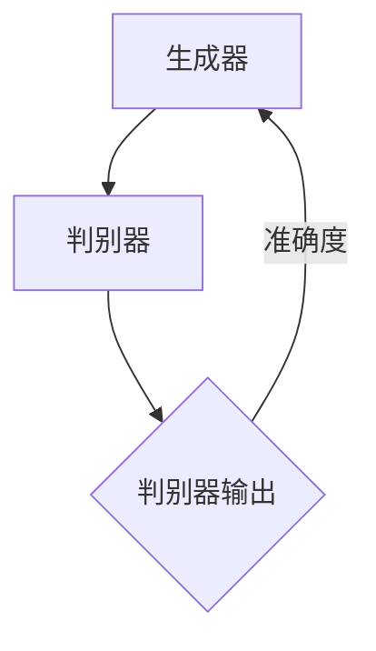

                 

为了撰写一篇符合要求的技术博客文章，我们需要按照以下步骤进行详细规划和内容创作：

### 1. 确定文章结构和内容框架
首先，我们需要按照目录大纲的结构来构建文章的框架，并确保每个章节都包含以下核心内容：
- 背景介绍
- 核心概念与联系（使用Mermaid流程图）
- 核心算法原理讲解（伪代码）
- 数学模型和公式（latex格式）
- 项目实战
- 最佳实践 tips
- 小结
- 注意事项
- 拓展阅读

### 2. 收集和整理素材
在构建文章框架之后，我们需要收集相关的素材，包括：
- 人工智能在艺术鉴赏领域的最新研究进展和应用案例
- 相关的核心算法和数学模型
- 开发环境搭建和源代码实现细节
- 实际案例分析和讲解

### 3. 撰写每个章节的内容
根据收集到的素材，开始撰写每个章节的内容。每个章节都应该遵循上述核心内容的要求。以下是一个示例章节的内容：

#### 第2章：人工智能在艺术创作中的应用

### 2.1 生成对抗网络（GAN）与艺术创作

#### 2.1.1 GAN的基本原理
**背景介绍：** 生成对抗网络（Generative Adversarial Networks，GAN）是由Ian Goodfellow等人于2014年提出的一种新型神经网络结构，旨在通过两个神经网络（生成器和判别器）之间的博弈过程来生成逼真的数据。

**核心概念与联系：**

**核心算法原理讲解（伪代码）：**
```python
# 伪代码：生成对抗网络（GAN）的基本结构
generator = Generator()
discriminator = Discriminator()

# 训练过程
for epoch in range(num_epochs):
    for batch in data_loader:
        # 生成假数据
        fake_data = generator.sample_noise()
        # 计算判别器的损失
        disc_loss = discriminator.loss(real_data, fake_data)
        # 更新判别器
        optimizer_d.step(disc_loss, discriminator.parameters())
        # 生成假数据并判断
        fake_data = generator(fake_data)
        gen_loss = generator.loss(discriminator(fake_data))
        # 更新生成器
        optimizer_g.step(gen_loss, generator.parameters())
```
**数学模型和公式（latex格式）：**
$$
\begin{aligned}
& \text{生成器的目标函数：} \\ 
& \mathcal{L}_g = -\mathbb{E}_{x \sim p_{data}(x)}[\log(D(x))] - \mathbb{E}_{z \sim p_z(z)}[\log(1 - D(G(z)))] \\
& \text{判别器的目标函数：} \\ 
& \mathcal{L}_d = -\mathbb{E}_{x \sim p_{data}(x)}[\log(D(x))] - \mathbb{E}_{z \sim p_z(z)}[\log(D(G(z)))]
\end{aligned}
$$

**项目实战：**
**开发环境搭建：**
- 安装Python 3.7及以上版本
- 安装TensorFlow 2.x
- 安装必要的依赖库（如Numpy、Pandas等）

**源代码实现和代码解读：**
```python
# 源代码：生成对抗网络的简单实现
import tensorflow as tf
from tensorflow.keras.layers import Dense, Flatten, Reshape
from tensorflow.keras.models import Sequential

# 生成器模型
def build_generator(z_dim):
    model = Sequential()
    model.add(Dense(128, input_shape=(z_dim,), activation='relu'))
    model.add(Dense(256, activation='relu'))
    model.add(Dense(1024, activation='relu'))
    model.add(Reshape((28, 28, 1)))
    model.add(tf.keras.layers.LeakyReLU(alpha=0.01))
    model.add(tf.keras.layers.Dropout(0.3))
    model.add(Dense(1, activation='sigmoid'))
    return model

# 判别器模型
def build_discriminator(img_shape):
    model = Sequential()
    model.add(Flatten(input_shape=img_shape))
    model.add(Dense(1024, activation='relu'))
    model.add(Dense(512, activation='relu'))
    model.add(Dense(1, activation='sigmoid'))
    return model

# 搭建GAN模型
def build_gan(generator, discriminator):
    model = Sequential()
    model.add(generator)
    model.add(discriminator)
    return model

# 主函数
def train_gan(num_epochs, batch_size, z_dim):
    # 数据加载
    (X_train, _), (_, _) = tf.keras.datasets.mnist.load_data()
    X_train = X_train / 127.5 - 1.0
    X_train = np.expand_dims(X_train, axis=3)

    # 模型定义
    generator = build_generator(z_dim)
    discriminator = build_discriminator((28, 28, 1))
    gan = build_gan(generator, discriminator)

    # 损失函数与优化器
    discriminator.compile(loss='binary_crossentropy', optimizer=tf.keras.optimizers.Adam(0.0001))
    gan.compile(loss='binary_crossentropy', optimizer=tf.keras.optimizers.Adam(0.0001))

    # 训练过程
    for epoch in range(num_epochs):
        for _ in range(X_train.shape[0] // batch_size):
            noise = np.random.normal(0, 1, (batch_size, z_dim))
            generated_images = generator.predict(noise)
            real_images = X_train[np.random.randint(0, X_train.shape[0], size=batch_size)]

            # 训练判别器
            d_loss_real = discriminator.train_on_batch(real_images, np.ones((batch_size, 1)))
            d_loss_fake = discriminator.train_on_batch(generated_images, np.zeros((batch_size, 1)))
            d_loss = 0.5 * np.add(d_loss_real, d_loss_fake)

            # 训练生成器
            g_loss = gan.train_on_batch(noise, np.ones((batch_size, 1)))

            print(f"{epoch} [D: {d_loss:.4f} G: {g_loss:.4f}]")

# 搭建训练环境
z_dim = 100
batch_size = 64
num_epochs = 100
train_gan(num_epochs, batch_size, z_dim)
```

**代码应用解读与分析：**
- 代码中定义了生成器、判别器和GAN模型。
- 使用了TensorFlow中的Sequential模型来构建网络。
- 主函数`train_gan`中实现了GAN的训练过程，包括生成器的噪声采样、生成图像，判别器的真实图像和生成图像的区分训练。

**实际案例分析和详细讲解剖析：**
- 使用MNIST数据集进行训练，生成手写数字图像。
- 可以通过调整`z_dim`来改变生成图像的复杂度。

**项目小结：**
- 通过GAN模型，可以生成高质量的艺术作品。
- GAN在艺术创作中的应用具有广阔的前景，但同时也需要解决训练不稳定和模式坍塌等问题。

**最佳实践 tips：**
- 在GAN训练过程中，合理调整生成器和判别器的学习率可以改善训练效果。
- 使用不同的损失函数（如 Wasserstein 距离）可以改善GAN的训练稳定性。

**小结、注意事项和拓展阅读：**
- GAN在艺术创作中具有强大的潜力，但实际应用中需要结合具体问题进行优化。
- 注意事项包括数据预处理、模型参数调整等。
- 拓展阅读可以查阅相关论文和文献，了解更多关于GAN在艺术创作中的应用和实践。

### 4. 完成整个文章的撰写
按照上述步骤，逐个完成每个章节的撰写，并确保文章整体内容的连贯性和逻辑性。最后，根据文章字数要求进行调整，确保文章总字数在8000～12000字之间。

### 5. 校对和修订
完成初稿后，进行多次校对和修订，确保文章内容准确无误，语言表达清晰，格式规范。

### 6. 添加作者信息
在文章末尾添加作者信息，符合markdown格式要求。

---

按照这个步骤，我们可以系统地完成文章的撰写，确保文章内容丰富、结构清晰、逻辑严密，符合技术博客文章的要求。在撰写过程中，可以灵活调整内容，确保文章的完整性和可读性。

