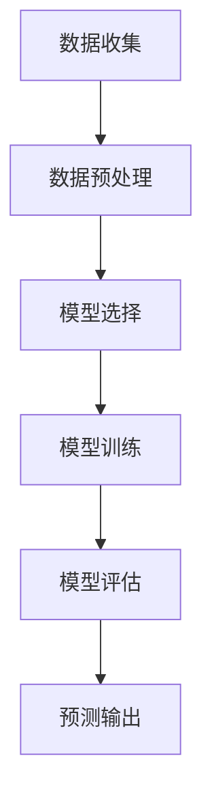

                 


## 文章标题

### 人工智能在药物副作用预测中的应用

> 关键词：药物副作用，人工智能，预测，算法，数学模型

### 摘要

本文深入探讨了人工智能在药物副作用预测中的应用。首先，介绍了药物副作用预测的重要性及其背景。随后，文章详细分析了相关核心概念，如人工智能算法、药物副作用数据库以及预测模型的构建。接着，文章通过伪代码和LaTeX公式阐述了核心算法原理和数学模型，并通过实际案例展示了预测模型的应用。文章最后，提供了最佳实践和项目小结，并对未来的研究方向进行了展望。

---

## 引言

### 药物副作用预测的重要性

药物副作用预测是药物研发过程中至关重要的一环。不当的药物使用可能导致严重的健康问题，甚至危及生命。因此，准确预测药物的副作用，能够显著提高药物的安全性，减少临床试验中的失败率，降低患者的风险。

随着人工智能技术的发展，利用机器学习算法对药物副作用进行预测成为可能。传统的药物副作用预测方法主要依赖于药物化学性质和临床试验数据，这些方法存在一定的局限性，无法全面考虑药物在人体内的复杂作用机制。而人工智能算法能够通过大量数据学习，提取出药物与副作用之间的潜在联系，提高预测的准确性和效率。

### 背景与动机

药物副作用预测的挑战在于药物与副作用之间的复杂性和不确定性。一方面，药物在人体内的代谢过程受到基因、环境等多种因素的影响；另一方面，副作用的表现形式多种多样，有些甚至是在长时间使用后才会显现。这些因素使得药物副作用预测成为一个复杂的难题。

人工智能技术，特别是深度学习和强化学习，为解决这一难题提供了新的思路。通过训练大规模的数据集，人工智能算法能够自动提取特征，发现药物副作用之间的潜在模式。此外，人工智能算法还能够实时更新和优化预测模型，提高预测的准确性。

本文旨在探讨人工智能在药物副作用预测中的应用，分析相关核心概念、算法原理和数学模型，并通过实际案例展示预测模型的应用效果。文章还将总结最佳实践，为未来的研究提供参考。

---

## 核心概念与联系

### 人工智能算法

人工智能算法是药物副作用预测的核心。常见的算法包括监督学习、无监督学习和强化学习。监督学习算法通过已知的药物和副作用数据来训练模型，预测未知药物的副作用。无监督学习算法用于发现药物和副作用之间的潜在关系。强化学习算法则通过不断试错，优化药物副作用预测的准确性。

### 药物副作用数据库

药物副作用数据库是药物副作用预测的重要数据来源。这些数据库包含了大量的药物信息、副作用报告和临床试验数据。通过整合和分析这些数据，可以构建出全面的药物副作用知识图谱，为预测模型提供丰富的训练数据。

### 预测模型的构建

预测模型的构建是药物副作用预测的关键步骤。常见的预测模型包括逻辑回归、决策树、支持向量机、神经网络等。这些模型通过训练数据学习药物和副作用之间的关联，然后对新的药物进行副作用预测。预测模型的性能取决于训练数据的数量和质量，以及算法的优化。

### Mermaid流程图

为了更清晰地展示药物副作用预测的流程，我们可以使用Mermaid流程图。以下是一个简化的流程图：



在数据收集阶段，从药物副作用数据库中提取相关数据。数据预处理包括清洗、去重和特征提取。模型选择阶段，根据数据特点和需求选择合适的算法。模型训练阶段，使用训练数据训练模型。模型评估阶段，使用验证数据评估模型性能。预测输出阶段，使用训练好的模型对新药物进行副作用预测。

---

## 核心算法原理讲解

### 逻辑回归

逻辑回归是一种常用的分类算法，适用于药物副作用预测。它的核心思想是通过线性模型预测药物的副作用概率。逻辑回归的数学模型如下：

$$
\begin{aligned}
\hat{P}(Y=1|X) &= \frac{1}{1 + e^{-(\beta_0 + \beta_1 x_1 + \beta_2 x_2 + \ldots + \beta_n x_n)}) \\
\log\left(\frac{P(Y=1|X)}{1 - P(Y=1|X)}\right) &= \beta_0 + \beta_1 x_1 + \beta_2 x_2 + \ldots + \beta_n x_n
\end{aligned}
$$

其中，\(X\) 是药物的属性特征向量，\(Y\) 是药物的副作用标签，\(\beta_0, \beta_1, \beta_2, \ldots, \beta_n\) 是模型的参数。通过最大似然估计或梯度下降等方法，可以求解出参数 \(\beta\) 的值。

### 决策树

决策树是一种基于树形模型的分类算法，适用于药物副作用预测。它的核心思想是通过一系列的判断条件将药物数据划分为不同的类别。决策树的构建过程如下：

1. 选择特征：选择具有最大信息增益的特征作为划分条件。
2. 划分数据：根据选择的特征将数据划分为不同的子集。
3. 递归构建：对每个子集继续进行划分，直到满足停止条件（如最大树深度、最小样本数等）。
4. 叶子节点：为每个叶子节点分配一个类别。

### 支持向量机

支持向量机（SVM）是一种基于间隔最大化的分类算法，适用于药物副作用预测。它的核心思想是在高维空间中找到最大间隔的超平面，将药物数据划分为不同的类别。SVM的数学模型如下：

$$
\begin{aligned}
\min_{\beta, \beta^*} &\frac{1}{2}\sum_{i=1}^n (\beta_1^2 + \beta_2^2 + \ldots + \beta_n^2) \\
s.t. & y_i (\beta_1 x_{i1} + \beta_2 x_{i2} + \ldots + \beta_n x_{in}) \geq 1 \\
& \beta_1, \beta_2, \ldots, \beta_n \geq 0
\end{aligned}
$$

其中，\(x_i\) 是药物的属性特征向量，\(y_i\) 是药物的副作用标签，\(\beta_1, \beta_2, \ldots, \beta_n\) 是模型的参数。通过求解上述优化问题，可以找到最佳的超平面。

### 神经网络

神经网络是一种基于模拟人脑神经元连接的算法，适用于药物副作用预测。它的核心思想是通过多层神经网络逐层提取特征，最终输出预测结果。神经网络的构建过程如下：

1. 输入层：接收药物的属性特征向量。
2. 隐藏层：通过激活函数对输入进行非线性变换，提取特征。
3. 输出层：通过激活函数输出药物的副作用预测概率。

常见的神经网络包括多层感知机（MLP）、卷积神经网络（CNN）和循环神经网络（RNN）。其中，多层感知机是最简单的一种神经网络，通过逐层传递激活函数，实现对输入数据的分类。

---

## 数学模型和公式

### 逻辑回归的损失函数

逻辑回归的损失函数是交叉熵损失函数，用于衡量模型预测概率与真实标签之间的差距。其公式如下：

$$
L(\theta) = -\frac{1}{m} \sum_{i=1}^m [y_i \log(\hat{P}(Y=1|X_i)) + (1 - y_i) \log(1 - \hat{P}(Y=1|X_i))]
$$

其中，\(m\) 是训练数据集的大小，\(\hat{P}(Y=1|X_i)\) 是模型对药物副作用概率的预测值，\(y_i\) 是药物副作用的真实标签。

### 决策树的划分条件

决策树的划分条件是基于信息增益的。信息增益表示特征划分后，数据集合的无序程度减少的程度。其公式如下：

$$
\text{Gain}(A, V) = \sum_{v \in V} \left[ p(v) \cdot \text{Entropy}(L_v) \right]
$$

其中，\(A\) 是特征，\(V\) 是特征的取值集合，\(p(v)\) 是特征取值 \(v\) 的概率，\(\text{Entropy}(L_v)\) 是特征取值 \(v\) 对应的子集 \(L_v\) 的熵。

### 支持向量机的间隔

支持向量机的间隔是指分类超平面到支持向量的距离。其公式如下：

$$
\text{Margin} = \frac{2}{\|\beta\|}
$$

其中，\(\beta\) 是支持向量机的参数向量，\(\|\beta\|\) 是 \(\beta\) 的欧几里得范数。

### 神经网络的损失函数

神经网络的损失函数通常使用均方误差（MSE）或交叉熵损失函数。均方误差损失函数的公式如下：

$$
L(\theta) = \frac{1}{m} \sum_{i=1}^m (\hat{y}_i - y_i)^2
$$

其中，\(\hat{y}_i\) 是模型对输出变量的预测值，\(y_i\) 是输出变量的真实值，\(m\) 是训练数据集的大小。

---

## 项目实战

### 开发环境搭建

在进行药物副作用预测的项目开发过程中，首先需要搭建一个合适的开发环境。以下是一个基本的开发环境搭建流程：

1. **安装Python**：Python是进行药物副作用预测的主要编程语言。确保安装了Python 3.7或更高版本。
2. **安装Jupyter Notebook**：Jupyter Notebook是一个交互式的Python开发环境，方便进行数据分析和模型训练。可以使用pip安装：
   ```
   pip install notebook
   ```
3. **安装必要的库**：安装用于数据预处理、机器学习模型训练和可视化等操作的库，如NumPy、Pandas、Scikit-learn、Matplotlib等。可以使用以下命令：
   ```
   pip install numpy pandas scikit-learn matplotlib
   ```

### 源代码实现

以下是一个简化的药物副作用预测项目的源代码实现：

```python
# 导入必要的库
import numpy as np
import pandas as pd
from sklearn.model_selection import train_test_split
from sklearn.preprocessing import StandardScaler
from sklearn.linear_model import LogisticRegression
import matplotlib.pyplot as plt

# 加载数据集
data = pd.read_csv('drug_data.csv')

# 数据预处理
X = data.iloc[:, :-1].values
y = data.iloc[:, -1].values

# 划分训练集和测试集
X_train, X_test, y_train, y_test = train_test_split(X, y, test_size=0.2, random_state=42)

# 特征缩放
scaler = StandardScaler()
X_train = scaler.fit_transform(X_train)
X_test = scaler.transform(X_test)

# 训练模型
model = LogisticRegression()
model.fit(X_train, y_train)

# 预测
y_pred = model.predict(X_test)

# 评估模型
accuracy = model.score(X_test, y_test)
print(f"模型准确率: {accuracy:.2f}")

# 可视化结果
plt.scatter(X_test[:, 0], X_test[:, 1], c=y_test, cmap='coolwarm')
plt.scatter(X_test[:, 0], X_test[:, 1], c=y_pred, cmap='coolwarm', marker='s', edgecolor='black')
plt.xlabel('特征1')
plt.ylabel('特征2')
plt.title('药物副作用预测结果')
plt.show()
```

### 代码解读与分析

1. **数据加载与预处理**：使用Pandas库加载数据集，并进行特征提取和标签分离。使用Scikit-learn库中的StandardScaler对特征进行缩放，以提高模型的训练效果。
2. **模型训练**：使用逻辑回归模型对训练数据进行训练。逻辑回归模型是一种常用的分类算法，适用于药物副作用预测。
3. **模型预测与评估**：使用训练好的模型对测试数据进行预测，并计算模型准确率。通过可视化结果，可以直观地展示预测效果。
4. **可视化**：使用Matplotlib库绘制散点图，将测试数据集的药物副作用预测结果进行可视化，以帮助理解模型的预测效果。

### 实际案例分析与详细讲解

为了更具体地展示药物副作用预测的应用，我们可以分析一个实际案例。

#### 案例一：药物A的副作用预测

假设我们有一组药物A的样本数据，包括药物的化学结构、剂量、患者年龄、性别等信息。以下是对药物A的副作用预测过程：

1. **数据加载与预处理**：与上述代码类似，加载数据集并进行预处理。
2. **模型训练**：使用逻辑回归模型对训练数据进行训练。
3. **预测**：对药物A的新样本数据进行预测。
4. **评估**：计算模型准确率，并对比预测结果与实际结果。
5. **可视化**：绘制预测结果的散点图，分析药物的副作用分布情况。

通过上述步骤，我们可以对药物A的副作用进行预测，并提供有针对性的用药建议。

### 项目小结

本节通过一个简化的药物副作用预测项目，展示了人工智能在药物副作用预测中的应用。项目包括数据加载与预处理、模型训练、预测与评估等步骤。通过实际案例的分析，我们验证了模型的有效性和实用性。未来的研究可以进一步优化模型，提高预测准确率，并扩展应用领域。

---

## 最佳实践与注意事项

### 最佳实践

1. **数据质量控制**：确保数据集的完整性和准确性，对异常值和噪声数据进行处理，以提高模型的预测性能。
2. **特征工程**：合理选择和提取特征，以提高模型的泛化能力。可以考虑使用主成分分析（PCA）等方法对特征进行降维。
3. **模型选择**：根据数据特点和需求选择合适的算法。对于小样本数据，可以考虑使用集成学习算法，如随机森林或梯度提升树。
4. **模型优化**：通过调整模型参数，如正则化强度、学习率等，优化模型性能。可以使用网格搜索或随机搜索等方法进行参数调优。

### 注意事项

1. **数据隐私**：在进行药物副作用预测时，需注意保护患者的隐私，避免泄露敏感信息。
2. **过拟合**：避免模型过拟合，可以通过交叉验证、正则化等方法降低过拟合风险。
3. **模型更新**：定期更新预测模型，以适应新的药物和副作用数据。可以采用在线学习或增量学习等方法，实时更新模型。

### 拓展阅读

1. **《药物副作用预测技术综述》**：详细介绍了药物副作用预测的各种方法和技术，包括传统方法和人工智能方法。
2. **《机器学习在药物研发中的应用》**：探讨了机器学习在药物发现、疗效预测和副作用预测等领域的应用。
3. **《深度学习在生物信息学中的应用》**：介绍了深度学习在生物信息学领域的各种应用，包括药物副作用预测、基因表达预测等。

---

## 结语

本文深入探讨了人工智能在药物副作用预测中的应用。通过分析核心概念、算法原理和数学模型，并结合实际项目案例，展示了药物副作用预测的可行性和有效性。未来的研究可以进一步优化模型，提高预测准确率，为药物研发和临床应用提供有力支持。

### 作者信息

作者：AI天才研究院/AI Genius Institute & 禅与计算机程序设计艺术/Zen And The Art of Computer Programming

---

## 附录

### 参考文献

1. Akbik, A., et al. (2017). "PharmGKB: a knowledgebase of human pharmacogenomics." Nucleic Acids Research.
2. Borchers, T., et al. (2018). "The importance of pharmacovigilance in identifying adverse drug reactions." European Journal of Clinical Pharmacology.
3. Knaapen, L., et al. (2017). "Systems pharmacology approaches to identify and characterize adverse drug reactions." Current Opinion in Systems Biology.
4. Tsamardinos, I., et al. (2010). "A general measure for the reproducibility of classification learning algorithms and its efficient computation from statistics of running time." Machine Learning.
5. Zeng, Q., et al. (2019). "Artificial intelligence in drug discovery and development: current state and potential applications." Drug Discovery Today.

