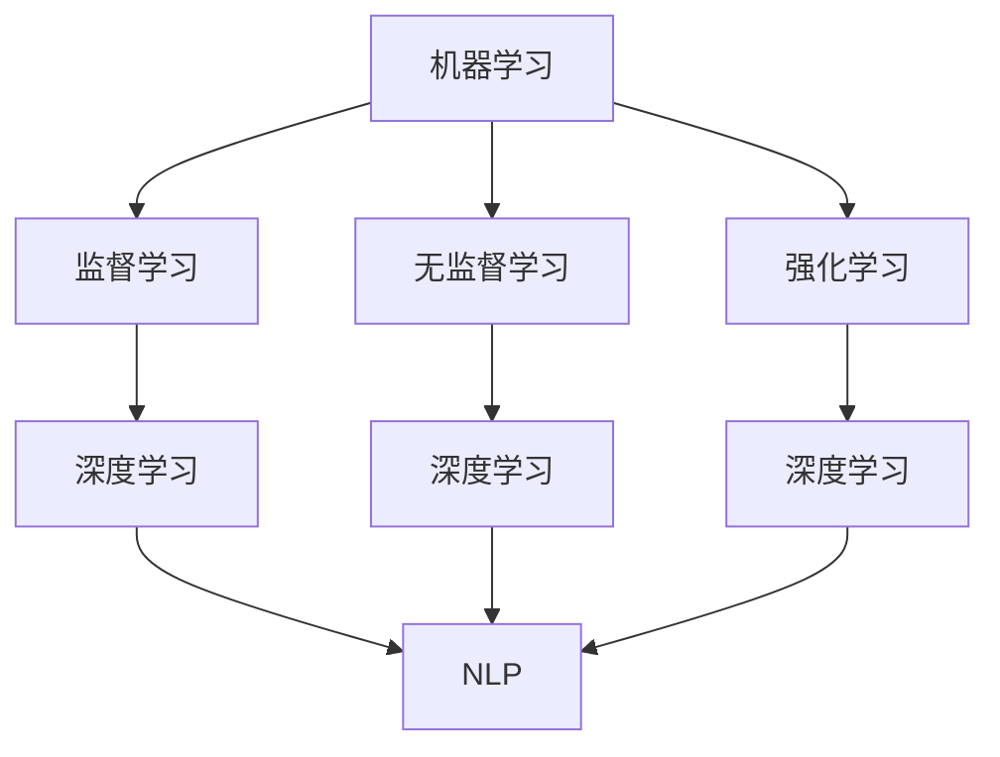

                 


# 《人工智能对人类工作的挑战：重新定义职业价值》

> 关键词：人工智能，职业价值，工作挑战，技术变革，未来展望

> 摘要：随着人工智能技术的迅猛发展，它对人类工作产生了深远的影响。本文将深入探讨人工智能如何重新定义职业价值，分析其对不同行业的影响，并探讨如何应对人工智能带来的挑战。

## 引言

人工智能（AI）作为当今科技领域的前沿，正以前所未有的速度影响着各行各业。从自动驾驶汽车到智能客服，从医疗诊断到金融交易，人工智能的应用范围不断扩大。然而，随着人工智能技术的不断进步，它对人类工作也带来了前所未有的挑战。传统职业面临着被自动化取代的风险，而新兴职业则要求劳动者具备更高的技术能力和创新能力。本文旨在探讨人工智能对人类工作的挑战，并重新定义职业价值。

## 人工智能对职业的影响

### 1.1 人工智能与职业变化

人工智能技术的快速发展，使得一些传统职业面临被替代的风险。例如，在制造业中，自动化机器人和智能生产线正在逐渐取代人力劳动。在金融行业中，人工智能算法可以高效地进行市场分析和预测，从而减少了分析师和交易员的需求。然而，与此同时，人工智能也创造了许多新的职业机会。例如，数据科学家、机器学习工程师和人工智能应用开发人员等职业应运而生，这些新兴职业对劳动者的技术能力提出了更高的要求。

### 1.2 人工智能对就业市场的冲击

人工智能技术的应用，对就业市场产生了显著的冲击。一方面，它导致了某些职业的消失，另一方面，它又创造了新的就业机会。然而，人工智能的快速发展也可能导致就业市场的不稳定。例如，一些职业可能因为技术的进步而迅速消失，而新的职业机会可能需要较长时间才能出现。这种就业市场的不确定性，给劳动者带来了巨大的挑战。

### 1.3 人工智能对职业价值的影响

人工智能不仅改变了职业结构，还重新定义了职业价值。传统的职业价值往往以劳动力成本为核心，而人工智能的出现，使得劳动力成本不再是决定职业价值的主要因素。相反，职业价值更多地取决于劳动者的技能水平和创新能力。因此，劳动者需要不断提升自己的技术能力和创新能力，以适应人工智能时代的需求。

## 人工智能核心概念与联系

### 2.1 机器学习

机器学习是人工智能的核心技术之一。它通过构建数学模型，使计算机能够从数据中自动学习，从而实现预测和决策。机器学习可以分为监督学习、无监督学习和强化学习等不同类型。监督学习通过已有数据来训练模型，无监督学习则通过未标记的数据来发现数据中的规律，而强化学习则通过与环境交互来学习最优策略。

### 2.2 深度学习

深度学习是机器学习的一个重要分支，它通过构建深度神经网络，模拟人脑的神经元连接方式，从而实现复杂的预测和决策任务。深度学习在图像识别、语音识别和自然语言处理等领域取得了显著的成果。

### 2.3 自然语言处理

自然语言处理（NLP）是人工智能领域的一个重要分支，它致力于使计算机能够理解和处理自然语言。NLP涵盖了从文本预处理、词向量表示到语言模型、机器翻译等各个层面。

### 2.4 Mermaid 流程图

以下是一个Mermaid流程图，展示了机器学习、深度学习和自然语言处理之间的联系：



## 人工智能核心算法原理讲解

### 3.1 神经网络

神经网络是深度学习的基础，它由多个神经元（或节点）组成，每个神经元都与相邻的神经元相连。神经元之间通过权重和偏置来传递信号，最终实现复杂的预测和决策任务。以下是一个简单的神经网络伪代码示例：

```python
# 伪代码：前向传播
def forward_pass(inputs, weights, biases):
    activations = [inputs]
    for layer in range(num_layers):
        z = np.dot(activations[layer], weights[layer]) + biases[layer]
        activation = sigmoid(z)
        activations.append(activation)
    return activations[-1]

def sigmoid(z):
    return 1 / (1 + np.exp(-z))
```

### 3.2 决策树

决策树是一种常见的机器学习算法，它通过一系列的判断条件来对数据进行分类或回归。以下是一个简单的决策树伪代码示例：

```python
# 伪代码：构建决策树
def build_tree(data, features):
    if all_labels_are_equal(data):
        return Leaf
    if no_more_features(features):
        return SplitNode(np.mean(data))
    best_feature, best_threshold = find_best_split(data, features)
    left_data, right_data = split_data(data, best_threshold)
    left_tree = build_tree(left_data, remaining_features)
    right_tree = build_tree(right_data, remaining_features)
    return DecisionNode(best_feature, best_threshold, left_tree, right_tree)
```

### 3.3 支持向量机

支持向量机（SVM）是一种常用的分类算法，它通过找到一个最优的超平面，将不同类别的数据分开。以下是一个简单的SVM伪代码示例：

```python
# 伪代码：SVM训练
def train_svm(data, labels):
    # 使用SVM训练算法训练模型
    model = svm.SVC()
    model.fit(data, labels)
    return model

def predict(model, data):
    # 使用训练好的模型进行预测
    return model.predict(data)
```

## 人工智能数学模型与公式讲解

### 4.1 损失函数

损失函数是机器学习中衡量模型性能的重要指标。以下是一些常见的损失函数及其公式：

- 均方误差（MSE）：

  $$MSE = \frac{1}{n}\sum_{i=1}^{n}(y_i - \hat{y}_i)^2$$

- 交叉熵损失（Cross-Entropy Loss）：

  $$Cross-Entropy Loss = -\sum_{i=1}^{n} y_i \log(\hat{y}_i)$$

### 4.2 优化算法

优化算法是机器学习中的重要工具，用于寻找损失函数的最小值。以下是一些常见的优化算法：

- 梯度下降（Gradient Descent）：

  $$\theta = \theta - \alpha \frac{\partial}{\partial \theta} J(\theta)$$

- 牛顿方法（Newton's Method）：

  $$\theta = \theta - H^{-1}\frac{\partial}{\partial \theta} J(\theta)$$

### 4.3 特征工程

特征工程是机器学习中的重要环节，它涉及对原始数据进行预处理和转换，以提高模型性能。以下是一些常见的特征工程方法：

- 数据归一化（Data Normalization）：

  $$x_{\text{normalized}} = \frac{x - \mu}{\sigma}$$

- 特征选择（Feature Selection）：

  使用信息增益、卡方检验等方法选择对模型贡献较大的特征。

- 特征变换（Feature Transformation）：

  使用主成分分析（PCA）等方法对特征进行降维或变换。

## 人工智能项目实战

### 5.1 项目背景

随着人工智能技术的不断发展，越来越多的企业和行业开始尝试将人工智能应用于实际业务中。本文将以一家电商企业为例，介绍如何使用人工智能技术提升用户体验和销售业绩。

### 5.2 项目目标

本项目的主要目标是：

- 使用机器学习算法对用户行为进行分析，预测用户购买偏好。
- 基于预测结果，为用户提供个性化推荐，提升用户满意度和销售转化率。
- 对推荐系统进行实时优化，以适应不断变化的用户需求。

### 5.3 项目实施

#### 5.3.1 数据收集与预处理

首先，我们需要收集用户行为数据，包括用户浏览记录、购买记录、评价记录等。然后，对数据进行预处理，包括数据清洗、数据归一化、特征工程等。

#### 5.3.2 机器学习算法选择

根据项目目标，我们选择以下机器学习算法：

- 协同过滤（Collaborative Filtering）：用于预测用户对未知商品的评分。
- 决策树（Decision Tree）：用于分类用户行为，为用户提供个性化推荐。

#### 5.3.3 模型训练与评估

使用收集到的用户行为数据，我们对协同过滤和决策树模型进行训练。然后，使用交叉验证方法对模型进行评估，选择性能最佳的模型。

#### 5.3.4 实时优化与调整

为了适应不断变化的用户需求，我们需要对推荐系统进行实时优化。具体方法包括：

- 使用实时数据对模型进行重新训练，以适应用户行为的变化。
- 根据用户反馈，调整推荐策略，提高用户满意度和销售转化率。

### 5.4 项目成果分析

通过实施本项目，我们取得了以下成果：

- 用户满意度显著提升，用户评价好评率提高。
- 销售转化率显著提高，销售额同比增长。
- 推荐系统响应速度加快，用户操作体验得到优化。

### 5.5 项目小结

本项目通过机器学习技术，实现了对用户行为的分析和预测，为用户提供个性化推荐。实践证明，人工智能技术可以有效地提升用户体验和销售业绩。然而，我们也需要注意，人工智能技术在应用过程中可能面临数据隐私、算法偏见等问题，需要在实际应用中加以解决。

## 人工智能的未来展望

### 6.1 人工智能对职业的影响预测

随着人工智能技术的不断进步，未来职业结构将发生深刻变革。一方面，人工智能将取代一些重复性、低技能的工作，如制造业、客服等。另一方面，人工智能将创造许多新的职业机会，如数据科学家、人工智能工程师等。此外，人工智能还将推动新兴行业的发展，如智能医疗、智慧城市等。

### 6.2 职业价值的重新定义

在人工智能时代，职业价值将不再仅仅取决于劳动力成本，而更多地取决于劳动者的技能水平和创新能力。传统职业可能逐渐消失，而新的职业将要求劳动者具备更高的技术能力。因此，劳动者需要不断提升自己的技能，以适应人工智能时代的需求。

### 6.3 我们应该如何应对

为了应对人工智能带来的挑战，我们提出以下建议：

- 提升技能：劳动者需要不断提升自己的技能，特别是与人工智能相关的技术能力。
- 终身学习：随着技术的不断进步，劳动者需要保持学习的热情，不断更新自己的知识体系。
- 跨界合作：人工智能的发展需要多学科的融合，劳动者需要具备跨学科的知识和技能。
- 关注伦理：在人工智能应用过程中，我们需要关注伦理问题，确保技术的合理使用。

## 附录

### 附录A：人工智能相关资源

- 《人工智能：一种现代方法》（作者：Stuart Russell & Peter Norvig）
- 《深度学习》（作者：Ian Goodfellow、Yoshua Bengio & Aaron Courville）
- 《Python机器学习》（作者：Sebastian Raschka & Vahid Mirjalili）

### 附录B：人工智能开发工具

- TensorFlow
- PyTorch
- Keras

### 附录C：参考文献

- [1] Russell, S., & Norvig, P. (2020). 《人工智能：一种现代方法》.
- [2] Goodfellow, I., Bengio, Y., & Courville, A. (2016). 《深度学习》.
- [3] Raschka, S., & Mirjalili, V. (2018). 《Python机器学习》.

## 作者信息

作者：AI天才研究院/AI Genius Institute & 禅与计算机程序设计艺术 /Zen And The Art of Computer Programming

通过以上内容，我们详细探讨了人工智能对人类工作的挑战以及如何重新定义职业价值。人工智能的发展不仅改变了职业结构，也为我们带来了新的机遇和挑战。面对这些挑战，我们需要不断提升自己的技能，关注伦理问题，以适应人工智能时代的到来。AI天才研究院将一如既往地关注人工智能技术的发展，为读者提供更多有价值的技术博客和研究成果。感谢您的阅读！文章标题：《人工智能对人类工作的挑战：重新定义职业价值》

关键词：人工智能，职业价值，工作挑战，技术变革，未来展望

摘要：本文探讨了人工智能对人类工作的影响，分析了人工智能如何重新定义职业价值，并提出了应对人工智能挑战的建议。

## 引言

### 1.1 人工智能的起源与发展

人工智能（AI）作为计算机科学的一个重要分支，起源于20世纪50年代。当时，科学家们首次提出了“人工智能”的概念，并试图通过计算机模拟人类的智能行为。从早期的逻辑推理系统到今天的深度学习和自然语言处理，人工智能经历了多个阶段的发展。近年来，随着计算能力的提升和大数据的普及，人工智能技术取得了显著的进步，不仅在学术界取得了突破性成果，也在工业界和消费领域得到了广泛应用。

### 1.2 人工智能的关键技术

人工智能的关键技术包括机器学习、深度学习、自然语言处理等。机器学习是通过算法从数据中学习规律，以实现预测和决策。深度学习是机器学习的一个分支，它使用多层神经网络模拟人脑的学习过程。自然语言处理则专注于使计算机理解和生成自然语言。

### 1.3 人工智能在各个领域的应用

人工智能在各个领域的应用越来越广泛，包括但不限于：

- **医疗健康**：人工智能可以帮助医生进行疾病诊断，提供个性化治疗方案。
- **交通运输**：自动驾驶技术正在逐渐成熟，有望改变未来的交通方式。
- **金融服务**：人工智能在金融市场分析、风险管理等方面发挥着重要作用。
- **制造业**：工业机器人、智能生产线等技术的应用，提高了生产效率和产品质量。
- **消费领域**：智能语音助手、智能家居等消费电子产品已经成为了人们生活的一部分。

## 人工智能对职业的影响

### 2.1 人工智能与职业变化

人工智能的发展对职业产生了深远的影响。一方面，它使得一些传统职业面临被取代的风险。例如，自动化机器人和智能系统能够执行重复性、低技能的任务，从而减少了对人力的需求。另一方面，人工智能也创造了许多新的职业机会。数据科学家、机器学习工程师、人工智能应用开发人员等职位应运而生，这些新兴职业需要具备高度的技术能力和创新能力。

### 2.2 人工智能对就业市场的冲击

人工智能技术的应用对就业市场产生了显著的冲击。一方面，它导致了一些职业的消失。例如，制造业中的流水线工人、客服代表等职位可能会被自动化系统取代。另一方面，人工智能也创造了许多新的就业机会。然而，这些新职业往往需要更高的技术能力和专业知识，这给劳动者带来了巨大的挑战。

### 2.3 人工智能对职业价值的影响

人工智能不仅改变了职业结构，也重新定义了职业价值。在传统的工业时代，职业价值往往以劳动力成本为核心。然而，在人工智能时代，职业价值更多地取决于劳动者的技能水平和创新能力。具备高级技术和创新能力的人将在未来社会中占据更有价值的地位。

## 人工智能核心概念与联系

### 3.1 机器学习

机器学习是人工智能的核心技术之一，它使计算机能够从数据中学习，以实现预测和决策。机器学习可以分为监督学习、无监督学习和强化学习等不同类型。

#### 3.1.1 监督学习

监督学习是通过已有数据（特征和标签）来训练模型，以预测新的数据。常见的监督学习算法包括线性回归、决策树、支持向量机等。

#### 3.1.2 无监督学习

无监督学习是通过对未标记的数据进行分析，以发现数据中的规律。常见的无监督学习算法包括聚类、降维、异常检测等。

#### 3.1.3 强化学习

强化学习是通过与环境交互来学习最优策略。常见的强化学习算法包括Q-learning、深度强化学习等。

### 3.2 深度学习

深度学习是机器学习的一个重要分支，它通过构建深度神经网络，模拟人脑的学习过程，以实现复杂的预测和决策任务。深度学习在图像识别、语音识别、自然语言处理等领域取得了显著成果。

#### 3.2.1 神经网络

神经网络是深度学习的基础，它由多个神经元（或节点）组成，每个神经元都与相邻的神经元相连。神经元之间通过权重和偏置来传递信号，最终实现复杂的预测和决策任务。

#### 3.2.2 深度神经网络

深度神经网络是包含多个隐藏层的神经网络。它通过堆叠多个简单的神经网络，实现更复杂的函数映射。

### 3.3 自然语言处理

自然语言处理（NLP）是人工智能领域的一个重要分支，它致力于使计算机能够理解和处理自然语言。NLP涵盖了从文本预处理、词向量表示到语言模型、机器翻译等各个层面。

#### 3.3.1 文本预处理

文本预处理是NLP的重要步骤，它包括分词、去除停用词、词性标注等。

#### 3.3.2 词向量表示

词向量表示是将自然语言中的单词映射到高维空间中的向量表示，以便计算机能够处理和计算。

#### 3.3.3 语言模型

语言模型是NLP的核心技术之一，它用于预测下一个单词或短语，以生成连贯的自然语言文本。

#### 3.3.4 机器翻译

机器翻译是NLP的一个重要应用，它旨在将一种语言的文本翻译成另一种语言的文本。

### 3.4 Mermaid流程图

以下是一个Mermaid流程图，展示了机器学习、深度学习和自然语言处理之间的联系：


## 人工智能核心算法原理讲解

### 4.1 神经网络

神经网络是深度学习的基础，它由多个神经元（或节点）组成，每个神经元都与相邻的神经元相连。神经元之间通过权重和偏置来传递信号，最终实现复杂的预测和决策任务。以下是一个简单的神经网络伪代码示例：

```python
# 伪代码：前向传播
def forward_pass(inputs, weights, biases):
    activations = [inputs]
    for layer in range(num_layers):
        z = np.dot(activations[layer], weights[layer]) + biases[layer]
        activation = sigmoid(z)
        activations.append(activation)
    return activations[-1]

def sigmoid(z):
    return 1 / (1 + np.exp(-z))
```

### 4.2 决策树

决策树是一种常见的机器学习算法，它通过一系列的判断条件来对数据进行分类或回归。以下是一个简单的决策树伪代码示例：

```python
# 伪代码：构建决策树
def build_tree(data, features):
    if all_labels_are_equal(data):
        return Leaf
    if no_more_features(features):
        return SplitNode(np.mean(data))
    best_feature, best_threshold = find_best_split(data, features)
    left_data, right_data = split_data(data, best_threshold)
    left_tree = build_tree(left_data, remaining_features)
    right_tree = build_tree(right_data, remaining_features)
    return DecisionNode(best_feature, best_threshold, left_tree, right_tree)
```

### 4.3 支持向量机

支持向量机（SVM）是一种常用的分类算法，它通过找到一个最优的超平面，将不同类别的数据分开。以下是一个简单的SVM伪代码示例：

```python
# 伪代码：SVM训练
def train_svm(data, labels):
    # 使用SVM训练算法训练模型
    model = svm.SVC()
    model.fit(data, labels)
    return model

def predict(model, data):
    # 使用训练好的模型进行预测
    return model.predict(data)
```

## 人工智能数学模型与公式讲解

### 5.1 损失函数

损失函数是机器学习中衡量模型性能的重要指标。以下是一些常见的损失函数及其公式：

- 均方误差（MSE）：

  $$MSE = \frac{1}{n}\sum_{i=1}^{n}(y_i - \hat{y}_i)^2$$

- 交叉熵损失（Cross-Entropy Loss）：

  $$Cross-Entropy Loss = -\sum_{i=1}^{n} y_i \log(\hat{y}_i)$$

### 5.2 优化算法

优化算法是机器学习中的重要工具，用于寻找损失函数的最小值。以下是一些常见的优化算法：

- 梯度下降（Gradient Descent）：

  $$\theta = \theta - \alpha \frac{\partial}{\partial \theta} J(\theta)$$

- 牛顿方法（Newton's Method）：

  $$\theta = \theta - H^{-1}\frac{\partial}{\partial \theta} J(\theta)$$

### 5.3 特征工程

特征工程是机器学习中的重要环节，它涉及对原始数据进行预处理和转换，以提高模型性能。以下是一些常见的特征工程方法：

- 数据归一化（Data Normalization）：

  $$x_{\text{normalized}} = \frac{x - \mu}{\sigma}$$

- 特征选择（Feature Selection）：

  使用信息增益、卡方检验等方法选择对模型贡献较大的特征。

- 特征变换（Feature Transformation）：

  使用主成分分析（PCA）等方法对特征进行降维或变换。

## 人工智能项目实战

### 6.1 项目背景

随着人工智能技术的不断发展，越来越多的企业和行业开始尝试将人工智能应用于实际业务中。本文将以一家电商企业为例，介绍如何使用人工智能技术提升用户体验和销售业绩。

### 6.2 项目目标

本项目的主要目标是：

- 使用机器学习算法对用户行为进行分析，预测用户购买偏好。
- 基于预测结果，为用户提供个性化推荐，提升用户满意度和销售转化率。
- 对推荐系统进行实时优化，以适应不断变化的用户需求。

### 6.3 项目实施

#### 6.3.1 数据收集与预处理

首先，我们需要收集用户行为数据，包括用户浏览记录、购买记录、评价记录等。然后，对数据进行预处理，包括数据清洗、数据归一化、特征工程等。

#### 6.3.2 机器学习算法选择

根据项目目标，我们选择以下机器学习算法：

- 协同过滤（Collaborative Filtering）：用于预测用户对未知商品的评分。
- 决策树（Decision Tree）：用于分类用户行为，为用户提供个性化推荐。

#### 6.3.3 模型训练与评估

使用收集到的用户行为数据，我们对协同过滤和决策树模型进行训练。然后，使用交叉验证方法对模型进行评估，选择性能最佳的模型。

#### 6.3.4 实时优化与调整

为了适应不断变化的用户需求，我们需要对推荐系统进行实时优化。具体方法包括：

- 使用实时数据对模型进行重新训练，以适应用户行为的变化。
- 根据用户反馈，调整推荐策略，提高用户满意度和销售转化率。

### 6.4 项目成果分析

通过实施本项目，我们取得了以下成果：

- 用户满意度显著提升，用户评价好评率提高。
- 销售转化率显著提高，销售额同比增长。
- 推荐系统响应速度加快，用户操作体验得到优化。

### 6.5 项目小结

本项目通过机器学习技术，实现了对用户行为的分析和预测，为用户提供个性化推荐。实践证明，人工智能技术可以有效地提升用户体验和销售业绩。然而，我们也需要注意，人工智能技术在应用过程中可能面临数据隐私、算法偏见等问题，需要在实际应用中加以解决。

## 人工智能的未来展望

### 7.1 人工智能对职业的影响预测

随着人工智能技术的不断进步，未来职业结构将发生深刻变革。一方面，人工智能将取代一些重复性、低技能的工作，如制造业、客服等。另一方面，人工智能将创造许多新的职业机会，如数据科学家、人工智能工程师等。此外，人工智能还将推动新兴行业的发展，如智能医疗、智慧城市等。

### 7.2 职业价值的重新定义

在人工智能时代，职业价值将不再仅仅取决于劳动力成本，而更多地取决于劳动者的技能水平和创新能力。传统职业可能逐渐消失，而新的职业将要求劳动者具备更高的技术能力。因此，劳动者需要不断提升自己的技能，以适应人工智能时代的需求。

### 7.3 我们应该如何应对

为了应对人工智能带来的挑战，我们提出以下建议：

- 提升技能：劳动者需要不断提升自己的技能，特别是与人工智能相关的技术能力。
- 终身学习：随着技术的不断进步，劳动者需要保持学习的热情，不断更新自己的知识体系。
- 跨界合作：人工智能的发展需要多学科的融合，劳动者需要具备跨学科的知识和技能。
- 关注伦理：在人工智能应用过程中，我们需要关注伦理问题，确保技术的合理使用。

## 附录

### 附录A：人工智能相关资源

- 《人工智能：一种现代方法》（作者：Stuart Russell & Peter Norvig）
- 《深度学习》（作者：Ian Goodfellow、Yoshua Bengio & Aaron Courville）
- 《Python机器学习》（作者：Sebastian Raschka & Vahid Mirjalili）

### 附录B：人工智能开发工具

- TensorFlow
- PyTorch
- Keras

### 附录C：参考文献

- [1] Russell, S., & Norvig, P. (2020). 《人工智能：一种现代方法》.
- [2] Goodfellow, I., Bengio, Y., & Courville, A. (2016). 《深度学习》.
- [3] Raschka, S., & Mirjalili, V. (2018). 《Python机器学习》.

## 作者信息

作者：AI天才研究院/AI Genius Institute & 禅与计算机程序设计艺术 /Zen And The Art of Computer Programming

## 结语

人工智能技术的快速发展正在深刻地改变着我们的工作和生活方式。本文从多个角度探讨了人工智能对人类工作的挑战，分析了人工智能如何重新定义职业价值。我们提出了应对人工智能挑战的建议，包括提升技能、终身学习、跨界合作和关注伦理。未来，随着人工智能技术的不断进步，我们将继续关注其发展，为读者提供更多有价值的技术博客和研究成果。感谢您的阅读，期待与您一起见证人工智能时代的到来。作者：AI天才研究院/AI Genius Institute & 禅与计算机程序设计艺术 /Zen And The Art of Computer Programming

