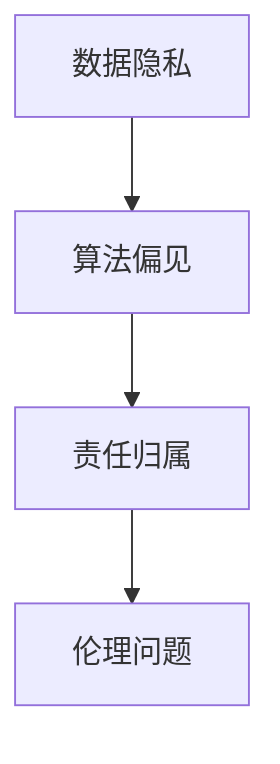
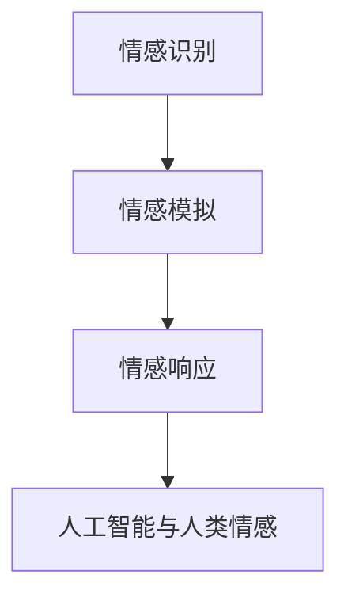
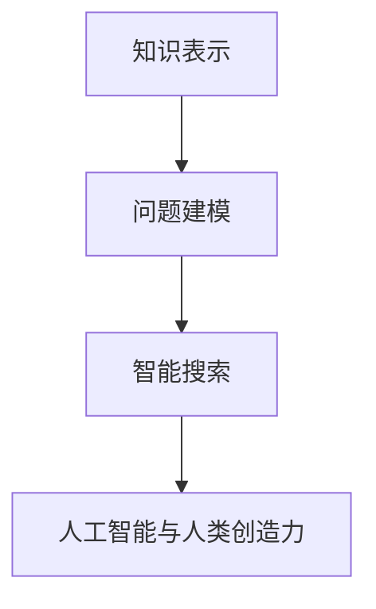
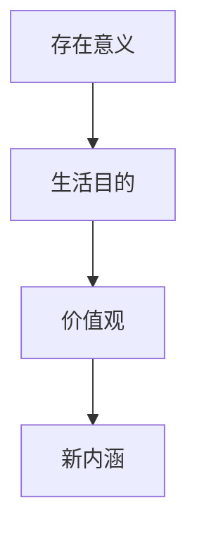
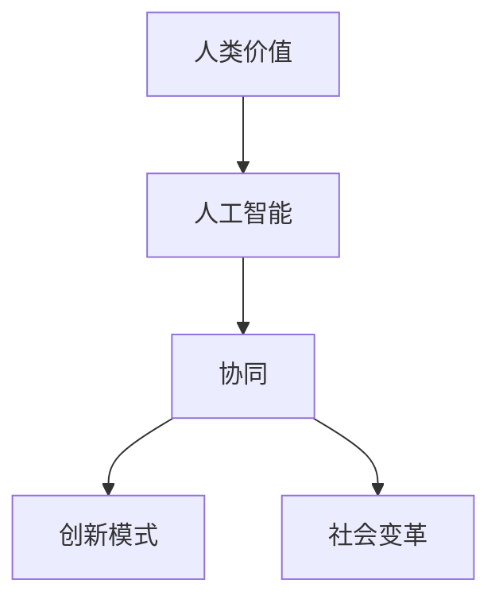
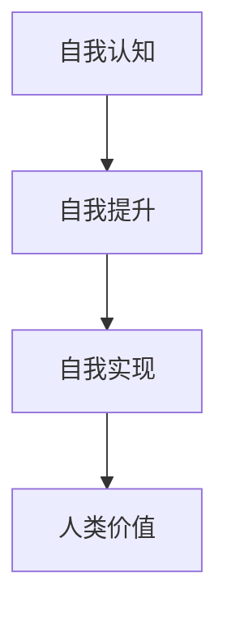
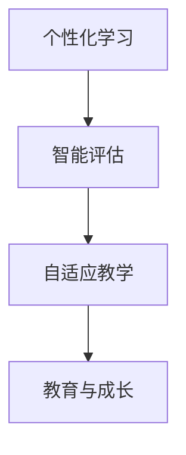
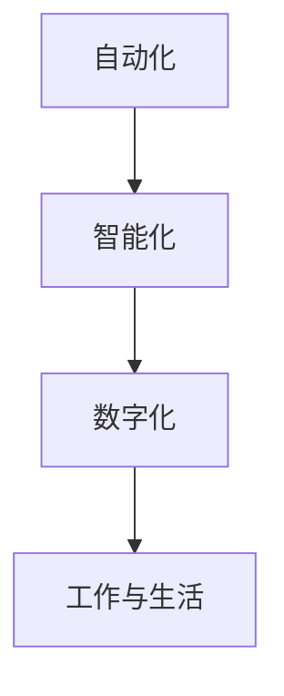
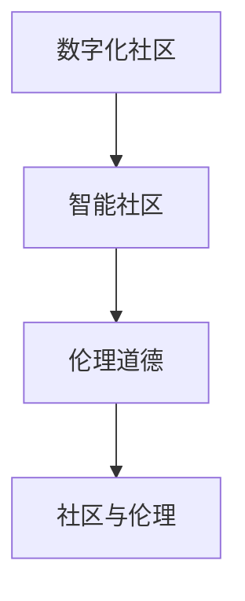

                 

### 文章标题：人工智能时代的人类价值：情感和创造力的重要性

### 文章关键词：人工智能，人类价值，情感，创造力，伦理，算法，数学模型，项目实战

### 摘要：
本文深入探讨人工智能时代背景下，人类价值中情感和创造力的重要性。通过分析伦理、哲学问题，阐述人工智能对情感和创造力的影响，探讨人类如何适应和构建新的价值体系。文章结构紧凑，逻辑清晰，结合核心概念、算法原理、数学模型和项目实战，为读者提供了一个全面而深入的思考框架。

---

## 引言

随着人工智能技术的迅猛发展，人类社会正经历着前所未有的变革。人工智能（AI）不仅在各个领域展现出强大的应用潜力，还引发了关于伦理、哲学和人类价值的新一轮讨论。在这个新时代，情感和创造力作为人类特有的特质，其重要性愈发凸显。然而，人工智能的发展是否会对这些人类价值构成挑战？我们如何理解和应对这种挑战？这是本文要探讨的核心问题。

本文将分为三个主要部分。第一部分将深入探讨人工智能时代的伦理与哲学问题，包括伦理问题的核心概念、人工智能对情感的理解与模拟、以及人类如何适应价值变革。第二部分将聚焦于人工智能时代的人类价值构建，探讨人类价值的新内涵、与人工智能的协同、以及自我实现的路径。第三部分将探讨人工智能时代的人类价值实践，从教育与成长、工作与生活、社区与伦理三个角度，分析人工智能对人类价值的影响及应对策略。通过这一系列的讨论，我们希望能够为人工智能时代的人类价值提供一个全面而深入的思考框架。

### 第一部分：人工智能对人类价值观的挑战

#### 第1章：人工智能时代的伦理与哲学问题

##### 1.1 人工智能的伦理问题

**核心概念与联系：**

人工智能伦理问题是指人工智能系统在设计和应用过程中，涉及到的道德和伦理问题。其核心概念包括数据隐私、算法偏见、责任归属等。这些问题不仅涉及到技术层面，更涉及到人类社会的价值观念。例如，数据隐私问题涉及到个人隐私权的保护，算法偏见问题涉及到社会公正性的维护，责任归属问题涉及到事故责任的认定。

为了更清晰地理解这些问题，我们可以用Mermaid流程图来展示它们之间的联系：



**核心算法原理讲解：**

在解决人工智能伦理问题时，算法原理起着关键作用。以下是一个简单的伪代码示例，用于评估一个算法的伦理风险：

```python
# 伪代码：伦理风险评估
def ethical_risk_evaluation(algorithm, criteria):
    risk_score = 0
    for criterion in criteria:
        if not meets_ethical_criteria(algorithm, criterion):
            risk_score += 1
    return risk_score
```

在这个示例中，`ethical_risk_evaluation` 函数通过检查算法是否满足一系列伦理标准（`criteria`），来计算其伦理风险得分（`risk_score`）。

**数学模型和数学公式：**

为了量化伦理风险，我们可以使用一个数学模型。以下是一个简单的例子，用于衡量算法的伦理风险：

```latex
$$
E = \sum_{i=1}^{n} w_i \cdot r_i
$$

$$
where \quad E \quad is \quad the \quad ethical \quad risk, \quad w_i \quad is \quad the \quad weight \quad of \quad criterion \quad i, \quad and \quad r_i \quad is \quad the \quad risk \quad level \quad of \quad criterion \quad i.
$$
```

在这个公式中，`E` 表示总伦理风险，`w_i` 表示第 `i` 个伦理标准的权重，`r_i` 表示第 `i` 个伦理标准的风险水平。

**项目实战案例：**

为了更好地理解人工智能伦理问题的实际应用，我们可以考虑一个具体的案例：自动驾驶汽车的伦理决策。在这个案例中，自动驾驶系统需要面对各种复杂的伦理决策，例如在紧急情况下如何选择最优行动方案。

```python
# 伪代码：自动驾驶汽车的伦理决策
def ethical_decision AutonomousCar(situation):
    options = ["avoid pedestrian", "avoid vehicle", "avoid obstacle"]
    for option in options:
        if is_safe(option):
            return option
    return "Emergency Stop"

def is_safe(option):
    # 检查特定选项是否安全
    pass
```

在这个案例中，`ethical_decision` 函数根据当前情况（`situation`），评估不同的行动选项（`options`），并选择一个最优的决策。`is_safe` 函数用于检查特定选项的安全性。

通过这个项目实战案例，我们可以看到如何将伦理风险评估应用于实际的决策过程中。

**小结：**

通过本章节的讨论，我们了解到人工智能伦理问题的核心概念、算法原理、数学模型以及实际应用。在接下来的章节中，我们将进一步探讨人工智能对人类情感和创造力的影响，以及人类如何适应和构建新的价值体系。

---

##### 1.2 人工智能与人类情感

**核心概念与联系：**

人工智能与人类情感的关系是一个复杂且富有争议的话题。人类情感是复杂认知过程的一部分，涉及生物学、心理学和社会学等多个领域。人工智能则通过模拟和模仿人类情感，试图在技术层面实现情感的计算和表达。这一过程涉及到情感识别、情感模拟、情感响应等多个环节。

为了更清晰地理解这些概念，我们可以使用Mermaid流程图来展示它们之间的联系：



**核心算法原理讲解：**

在实现人工智能与人类情感互动的过程中，核心算法原理起着关键作用。以下是一个简单的伪代码示例，用于实现情感识别算法：

```python
# 伪代码：情感识别算法
def recognize_emotion(speech):
    emotions = ["happy", "sad", "angry", "neutral"]
    for emotion in emotions:
        if matches_emotion(speech, emotion):
            return emotion
    return "Unknown"
```

在这个示例中，`recognize_emotion` 函数通过分析输入的语音（`speech`），识别出对应的情感。`matches_emotion` 函数用于检查特定语音是否与某个情感匹配。

**数学模型和数学公式：**

为了量化情感识别的准确性，我们可以使用一个数学模型。以下是一个简单的例子，用于衡量情感识别的准确率：

```latex
$$
Accuracy = \frac{True \quad Positives + True \quad Negatives}{True \quad Positives + False \quad Positives + True \quad Negatives + False \quad Negatives}
$$

$$
where \quad True \quad Positives \quad is \quad the \quad number \quad of \quad correctly \quad identified \quad positive \quad emotions, \quad True \quad Negatives \quad is \quad the \quad number \quad of \quad correctly \quad identified \quad negative \quad emotions, \quad False \quad Positives \quad is \quad the \quad number \quad of \quad incorrectly \quad identified \quad positive \quad emotions, \quad and \quad False \quad Negatives \quad is \quad the \quad number \quad of \quad incorrectly \quad identified \quad negative \quad emotions.
$$
```

在这个公式中，`Accuracy` 表示情感识别的准确率，`True Positives`、`True Negatives`、`False Positives` 和 `False Negatives` 分别表示正确识别的正情感、负情感、错误识别的正情感和错误识别的负情感数量。

**项目实战案例：**

为了更好地理解人工智能与人类情感互动的实际应用，我们可以考虑一个具体的案例：情感计算在客户服务中的应用。在这个案例中，人工智能系统通过分析客户的语音和文本，识别出他们的情感状态，并提供相应的情感回应。

```python
# 伪代码：情感计算在客户服务中的应用
def respond_to_customer(customer_speech):
    emotion = recognize_emotion(customer_speech)
    if emotion == "happy":
        return "We're glad to hear that!"
    elif emotion == "sad":
        return "I'm sorry to hear that. How can I help you?"
    elif emotion == "angry":
        return "I understand your frustration. Let's work together to find a solution."
    else:
        return "Thank you for reaching out. How can I assist you today?"

def recognize_emotion(customer_speech):
    # 实现情感识别算法
    pass
```

在这个案例中，`respond_to_customer` 函数根据识别出的情感（`emotion`），提供相应的回应。`recognize_emotion` 函数用于实现情感识别算法。

**小结：**

通过本章节的讨论，我们了解到人工智能与人类情感的关系，包括核心概念、算法原理、数学模型和实际应用。在人工智能时代，情感识别和情感响应技术正在不断进步，这为人类提供了更多与人工智能互动的方式。然而，我们也需要关注人工智能对人类情感生活可能产生的影响，并探讨如何平衡技术进步与人类情感需求之间的关系。

---

##### 1.3 人工智能与人类创造力

**核心概念与联系：**

人工智能与人类创造力之间的关系是探讨人工智能对人类价值观影响的重要议题。创造力是人类特有的一种能力，它涉及到创新思维、问题解决、艺术表达等多个方面。而人工智能则通过模拟人类思维过程，试图在技术层面实现创造力的计算和扩展。这一过程涉及到知识表示、问题建模、智能搜索等多个环节。

为了更清晰地理解这些概念，我们可以使用Mermaid流程图来展示它们之间的联系：



**核心算法原理讲解：**

在实现人工智能与人类创造力的协同中，核心算法原理起着关键作用。以下是一个简单的伪代码示例，用于实现创意搜索算法：

```python
# 伪代码：创意搜索算法
def creative_search(problem, knowledge_base):
    solutions = []
    for solution in search_space(problem, knowledge_base):
        if is_creative(solution):
            solutions.append(solution)
    return solutions

def is_creative(solution):
    # 检查特定解决方案是否具有创意
    pass
```

在这个示例中，`creative_search` 函数通过在搜索空间中寻找可能的解决方案（`search_space`），并使用`is_creative` 函数评估每个解决方案的创意程度，从而生成一个创意解决方案列表（`solutions`）。

**数学模型和数学公式：**

为了量化创造力的水平，我们可以使用一个数学模型。以下是一个简单的例子，用于衡量解决方案的创意指数：

```latex
$$
Creativity \quad Index = \frac{Unique \quad Features + Innovative \quad Applications}{Total \quad Features}
$$

$$
where \quad Unique \quad Features \quad is \quad the \quad number \quad of \quad unique \quad features \quad in \quad the \quad solution, \quad Innovative \quad Applications \quad is \quad the \quad number \quad of \quad innovative \quad applications \quad found \quad for \quad the \quad solution, \quad and \quad Total \quad Features \quad is \quad the \quad total \quad number \quad of \quad features \quad in \quad the \quad solution.
$$
```

在这个公式中，`Creativity Index` 表示解决方案的创意指数，`Unique Features`、`Innovative Applications` 和 `Total Features` 分别表示解决方案中的独特特征、创新应用和总特征数量。

**项目实战案例：**

为了更好地理解人工智能与人类创造力的实际应用，我们可以考虑一个具体的案例：创意广告设计。在这个案例中，人工智能系统通过分析用户数据和市场趋势，生成具有创意的广告设计方案。

```python
# 伪代码：创意广告设计
def creative_ad_design(user_data, market_trends):
    ad_solutions = []
    for trend in market_trends:
        for user in user_data:
            ad = generate_ad(trend, user)
            if is_creative(ad):
                ad_solutions.append(ad)
    return ad_solutions

def generate_ad(trend, user):
    # 生成基于趋势和用户的广告设计
    pass

def is_creative(ad):
    # 检查特定广告设计是否具有创意
    pass
```

在这个案例中，`creative_ad_design` 函数通过分析市场趋势（`market_trends`）和用户数据（`user_data`），生成具有创意的广告设计方案（`ad_solutions`）。`generate_ad` 函数用于生成基于特定趋势和用户的广告设计，`is_creative` 函数用于检查广告设计的创意程度。

**小结：**

通过本章节的讨论，我们了解到人工智能与人类创造力之间的关系，包括核心概念、算法原理、数学模型和实际应用。在人工智能时代，人工智能不仅能够辅助人类进行创造性工作，还能够通过智能搜索和问题建模，激发新的创意灵感。然而，我们也需要关注人工智能对人类创造力可能产生的影响，并探讨如何平衡技术进步与人类创造力发展之间的关系。

---

##### 1.4 总结

通过本章节的讨论，我们深入探讨了人工智能时代的伦理、哲学问题，以及人工智能对人类情感和创造力的挑战。我们首先分析了人工智能伦理问题的核心概念，并展示了如何利用算法原理和数学模型来评估和解决这些伦理问题。接着，我们探讨了人工智能与人类情感的关系，通过情感识别和情感响应算法，展示了人工智能如何模拟和互动人类情感。最后，我们探讨了人工智能与人类创造力的协同，通过创意搜索算法和创意指数模型，展示了人工智能如何激发和扩展人类创造力。

然而，这些讨论仅是初步的，人工智能对人类价值观的挑战远不止于此。在接下来的章节中，我们将进一步探讨人类如何适应和构建新的价值体系，以应对人工智能带来的变革。我们将探讨人类价值的新内涵，如何与人工智能协同构建新的社会模式，以及如何通过自我实现来实现人类价值在人工智能时代的最大化。

通过这一系列深入而全面的讨论，我们希望能够为人工智能时代的人类价值提供一个全面而深入的思考框架，为人类社会的发展提供有益的启示。

---

#### 第二部分：人工智能时代的人类价值构建

##### 第4章：人类价值的新内涵

随着人工智能技术的不断进步，人类价值面临着新的挑战和机遇。在这个新时代，人类价值的内涵正在经历深刻的变革，新的价值观念逐渐浮现。本章将探讨人类价值的新内涵，包括新内涵的定义、新内涵对人类生活的意义，以及新内涵对社会的启示。

**核心概念与联系：**

人类价值的新内涵是指在人工智能时代，人类对于自身存在的意义、生活的目的和价值观的理解发生了新的转变。这些新内涵不仅反映了人工智能对人类生活的深刻影响，也体现了人类对于自身价值追求的更高层次。

为了更清晰地理解这些新内涵，我们可以使用Mermaid流程图来展示它们之间的联系：



**核心算法原理讲解：**

在构建人类价值的新内涵时，算法原理起着关键作用。以下是一个简单的伪代码示例，用于实现价值评估算法：

```python
# 伪代码：价值评估算法
def value_evaluation(life_context, technology_context):
    value_score = 0
    for value in values:
        if is_important(value, life_context, technology_context):
            value_score += 1
    return value_score

def is_important(value, life_context, technology_context):
    # 检查特定价值在特定情境下是否重要
    pass
```

在这个示例中，`value_evaluation` 函数通过分析生活情境（`life_context`）和技术情境（`technology_context`），评估特定价值（`values`）的重要性。`is_important` 函数用于检查特定价值在特定情境下是否重要。

**数学模型和数学公式：**

为了量化人类价值的新内涵，我们可以使用一个数学模型。以下是一个简单的例子，用于衡量价值的重要性：

```latex
$$
Importance \quad Score = \sum_{i=1}^{n} w_i \cdot r_i
$$

$$
where \quad Importance \quad Score \quad is \quad the \quad total \quad importance \quad score, \quad w_i \quad is \quad the \quad weight \quad of \quad value \quad i, \quad and \quad r_i \quad is \quad the \quad relevance \quad of \quad value \quad i \quad in \quad the \quad given \quad context.
$$
```

在这个公式中，`Importance Score` 表示价值的重要性得分，`w_i` 表示第 `i` 个价值的权重，`r_i` 表示第 `i` 个价值在特定情境下的相关性。

**项目实战案例：**

为了更好地理解人类价值的新内涵，我们可以考虑一个具体的案例：人工智能辅助的决策制定。在这个案例中，人工智能系统通过分析大量的数据和信息，帮助人类进行更明智的决策。

```python
# 伪代码：人工智能辅助决策制定
def make_decision(problem, data, values):
    best_solution = None
    highest_value_score = 0
    for solution in solutions(problem, data):
        value_score = value_evaluation(solution, values)
        if value_score > highest_value_score:
            highest_value_score = value_score
            best_solution = solution
    return best_solution

def solutions(problem, data):
    # 生成所有可能的解决方案
    pass
```

在这个案例中，`make_decision` 函数通过评估所有可能的解决方案（`solutions`），选择具有最高价值得分的最佳解决方案（`best_solution`）。`value_evaluation` 函数用于评估每个解决方案的价值。

**小结：**

通过本章节的讨论，我们探讨了人工智能时代人类价值的新内涵，包括核心概念、算法原理、数学模型和实际应用。在人工智能时代，人类价值的内涵正在经历深刻的变革，新的价值观念逐渐浮现。这些新内涵不仅反映了人工智能对人类生活的深刻影响，也体现了人类对于自身价值追求的更高层次。

在接下来的章节中，我们将进一步探讨如何通过人工智能与人类的协同，构建一个更加和谐、高效的社会模式。通过这一系列的探讨，我们希望能够为人工智能时代的人类价值提供一个全面而深入的思考框架，为人类社会的发展提供有益的启示。

---

##### 第5章：人类价值与人工智能的协同

在人工智能时代，人类价值与人工智能的协同成为了一个重要的议题。通过有效的协同，我们可以最大化人工智能的优势，同时充分发挥人类的独特价值。本章将探讨人类价值与人工智能的协同，包括协同的重要性、协同下的创新模式，以及协同对社会变革的启示。

**核心概念与联系：**

人类价值与人工智能的协同是指人类与人工智能系统共同工作，相互补充，实现更高效、更有价值的目标。这种协同不仅仅是技术的结合，更是一种理念、文化和价值观的融合。为了更清晰地理解这一概念，我们可以使用Mermaid流程图来展示协同的过程和要素：



**核心算法原理讲解：**

在实现人类价值与人工智能的协同中，算法原理起着关键作用。以下是一个简单的伪代码示例，用于实现协同优化算法：

```python
# 伪代码：协同优化算法
def collaborative_optimization(human_values, ai_capabilities):
    best_solution = None
    highest_value_score = 0
    for solution in all_solutions(human_values, ai_capabilities):
        value_score = evaluate_solution(solution, human_values, ai_capabilities)
        if value_score > highest_value_score:
            highest_value_score = value_score
            best_solution = solution
    return best_solution

def evaluate_solution(solution, human_values, ai_capabilities):
    # 评估特定解决方案的价值
    pass
```

在这个示例中，`collaborative_optimization` 函数通过评估所有可能的解决方案（`all_solutions`），选择具有最高价值得分的最佳解决方案（`best_solution`）。`evaluate_solution` 函数用于评估每个解决方案的价值，考虑人类价值和人工智能能力。

**数学模型和数学公式：**

为了量化协同效果，我们可以使用一个数学模型。以下是一个简单的例子，用于衡量协同效果：

```latex
$$
Collaborative \quad Score = \frac{Total \quad Value \quad Achieved}{Total \quad Potential \quad Value}
$$

$$
where \quad Total \quad Value \quad Achieved \quad is \quad the \quad sum \quad of \quad all \quad values \quad achieved \quad through \quad collaboration, \quad and \quad Total \quad Potential \quad Value \quad is \quad the \quad sum \quad of \quad all \quad possible \quad values \quad that \quad could \quad be \quad achieved.
$$
```

在这个公式中，`Collaborative Score` 表示协同效果得分，`Total Value Achieved` 表示通过协同实现的总价值，`Total Potential Value` 表示协同可能实现的总潜在价值。

**项目实战案例：**

为了更好地理解人类价值与人工智能的协同，我们可以考虑一个具体的案例：智能医疗系统的建设。在这个案例中，人工智能系统与医疗专家共同工作，实现更精确的疾病诊断和更个性化的治疗方案。

```python
# 伪代码：智能医疗系统的建设
def build_smart_health_system(doctor, patient, ai_system):
    diagnosis = ai_system.diagnose(patient)
    treatment_plan = doctor.create_treatment_plan(diagnosis)
    if is_optimized(treatment_plan, ai_system):
        return treatment_plan
    else:
        return "Treatm

---

##### 第6章：人类价值的自我实现

在人工智能时代，人类价值的自我实现成为一个重要的议题。自我实现是指个体通过自我认知、自我提升和自我实现的过程，实现个人价值和社会价值的最大化。本章将探讨人类价值的自我实现，包括自我实现的路径、策略，以及人工智能在其中的作用。

**核心概念与联系：**

人类价值的自我实现涉及到多个方面，包括自我认知、自我提升、自我实现等。自我认知是指个体对自己内在特质、优势、需求的理解和认识；自我提升是指个体通过学习、实践和反思，不断提升自己的能力和素质；自我实现是指个体通过自我认知和自我提升，实现个人价值和社会价值的最大化。为了更清晰地理解这些概念，我们可以使用Mermaid流程图来展示它们之间的联系：



**核心算法原理讲解：**

在实现人类价值的自我实现过程中，算法原理起着关键作用。以下是一个简单的伪代码示例，用于实现自我提升算法：

```python
# 伪代码：自我提升算法
def self_improvement(goal, current_state):
    improvement_plan = []
    for action in possible_actions(current_state):
        if action有帮助于实现目标，将action添加到improvement_plan
    return improvement_plan

def possible_actions(current_state):
    # 返回当前状态下可能的行动
    pass
```

在这个示例中，`self_improvement` 函数通过评估当前状态（`current_state`）和可能行动（`possible_actions`），生成一个自我提升计划（`improvement_plan`）。

**数学模型和数学公式：**

为了量化自我实现的水平，我们可以使用一个数学模型。以下是一个简单的例子，用于衡量自我实现的进展：

```latex
$$
Self-Realization \quad Progress = \frac{Current \quad Skill \quad Level - Initial \quad Skill \quad Level}{Maximum \quad Skill \quad Level - Initial \quad Skill \quad Level}
$$

$$
where \quad Current \quad Skill \quad Level \quad is \quad the \quad current \quad skill \quad level \quad of \quad the \quad individual, \quad Initial \quad Skill \quad Level \quad is \quad the \quad initial \quad skill \quad level \quad of \quad the \quad individual, \quad and \quad Maximum \quad Skill \quad Level \quad is \quad the \quad maximum \quad skill \quad level \quad that \quad can \quad be \quad achieved.
$$
```

在这个公式中，`Self-Realization Progress` 表示自我实现的进展，`Current Skill Level` 表示当前技能水平，`Initial Skill Level` 表示初始技能水平，`Maximum Skill Level` 表示最大技能水平。

**项目实战案例：**

为了更好地理解人类价值的自我实现，我们可以考虑一个具体的案例：人工智能辅助的个人成长计划。在这个案例中，人工智能系统通过分析个体的兴趣爱好、能力和目标，生成一个个性化的成长计划。

```python
# 伪代码：人工智能辅助的个人成长计划
def personal_growth_plan(individual, ai_system):
    interests = individual.get_interests()
    abilities = individual.get_abilities()
    goals = individual.get_goals()
    plan = ai_system.create_growth_plan(interests, abilities, goals)
    if is_optimized(plan):
        return plan
    else:
        return "Reevaluate Goals"
```

在这个案例中，`personal_growth_plan` 函数通过分析个体的兴趣、能力和目标，生成一个个性化的成长计划（`plan`）。`ai_system.create_growth_plan` 函数用于创建成长计划，`is_optimized` 函数用于评估成长计划的优化程度。

**小结：**

通过本章节的讨论，我们探讨了人类价值的自我实现，包括核心概念、算法原理、数学模型和实际应用。在人工智能时代，自我实现不仅仅是个人成长的问题，更是人类社会发展的关键。通过有效的自我实现，个体可以实现个人价值和社会价值的最大化，从而推动社会的进步。

在接下来的章节中，我们将进一步探讨人工智能时代的人类价值实践，从教育与成长、工作与生活、社区与伦理三个角度，分析人工智能对人类价值的影响及应对策略。通过这一系列的探讨，我们希望能够为人工智能时代的人类价值提供全面而深入的思考框架，为人类社会的发展提供有益的启示。

---

### 第三部分：人工智能时代的人类价值实践

#### 第7章：人工智能时代的教育与成长

在人工智能时代，教育与成长模式正面临着巨大的变革。传统的教育方式已经无法完全满足现代社会对人才的需求，人工智能的应用为教育带来了新的机遇和挑战。本章将探讨人工智能在教育与成长中的应用，包括教育目标的变革、人工智能时代的教育模式，以及教育面临的挑战与机遇。

**核心概念与联系：**

人工智能时代的教育与成长涉及到多个核心概念，包括个性化学习、智能评估、自适应教学等。个性化学习是指根据每个学生的兴趣、能力和学习风格，提供个性化的学习资源和方法；智能评估是指利用人工智能技术，对学生进行精准、高效的能力评估；自适应教学是指根据学生的学习进度和效果，自动调整教学内容和方法。

为了更清晰地理解这些概念，我们可以使用Mermaid流程图来展示它们之间的联系：



**核心算法原理讲解：**

在实现人工智能在教育与成长中的应用时，核心算法原理起着关键作用。以下是一个简单的伪代码示例，用于实现个性化学习算法：

```python
# 伪代码：个性化学习算法
def personalized_learning(student_profile, learning_content):
    learning_plan = []
    for content in learning_content:
        if matches_interest(content, student_profile):
            learning_plan.append(content)
    return learning_plan

def matches_interest(content, student_profile):
    # 检查学习内容是否与学生的兴趣匹配
    pass
```

在这个示例中，`personalized_learning` 函数根据学生的兴趣和档案（`student_profile`），选择与之匹配的学习内容（`learning_content`），生成一个个性化的学习计划（`learning_plan`）。`matches_interest` 函数用于检查学习内容是否与学生的兴趣匹配。

**数学模型和数学公式：**

为了量化个性化学习的有效性，我们可以使用一个数学模型。以下是一个简单的例子，用于衡量个性化学习的效果：

```latex
$$
Effectiveness \quad Score = \frac{Completed \quad Learning \quad Goals}{Total \quad Learning \quad Goals}
$$

$$
where \quad Completed \quad Learning \quad Goals \quad is \quad the \quad number \quad of \quad learning \quad goals \quad that \quad have \quad been \quad successfully \quad completed, \quad and \quad Total \quad Learning \quad Goals \quad is \quad the \quad total \quad number \quad of \quad learning \quad goals \quad set \quad for \quad the \quad student.
$$
```

在这个公式中，`Effectiveness Score` 表示个性化学习的有效性得分，`Completed Learning Goals` 表示已成功完成的学习目标数量，`Total Learning Goals` 表示为学生设定的总学习目标数量。

**项目实战案例：**

为了更好地理解人工智能在教育与成长中的应用，我们可以考虑一个具体的案例：智能教育平台的建设。在这个案例中，人工智能系统通过分析学生的学习行为和数据，为学生提供个性化的学习资源和方法。

```python
# 伪代码：智能教育平台的建设
def build_smart_education_platform(student_data, course_content):
    learning_plan = personalized_learning(student_data, course_content)
    assessment_results = adaptive_assessment(learning_plan)
    if is_successful(assessment_results):
        return "Student Achieved Learning Goals"
    else:
        return "Student Needs Further Support"
```

在这个案例中，`build_smart_education_platform` 函数通过生成个性化的学习计划（`learning_plan`），进行自适应评估（`adaptive_assessment`），并根据评估结果提供相应的反馈。`personalized_learning` 函数用于生成个性化学习计划，`adaptive_assessment` 函数用于进行自适应评估，`is_successful` 函数用于判断评估结果是否成功。

**小结：**

通过本章节的讨论，我们了解到人工智能在教育与成长中的应用，包括核心概念、算法原理、数学模型和实际应用。在人工智能时代，教育与成长模式正在发生深刻的变革，通过人工智能的应用，我们可以实现个性化学习、智能评估和自适应教学，为每个学生提供更高效、更有针对性的教育。

在接下来的章节中，我们将进一步探讨人工智能时代的工作与生活，以及社区与伦理问题，分析人工智能对人类价值的影响及应对策略。通过这一系列的探讨，我们希望能够为人工智能时代的人类价值提供全面而深入的思考框架，为人类社会的发展提供有益的启示。

---

#### 第8章：人工智能时代的工作与生活

在人工智能时代，工作与生活正面临着深刻的变革。人工智能的应用不仅改变了传统的工作模式，也对人们的日常生活产生了深远的影响。本章将探讨人工智能在工作和生活领域的应用，包括工作模式的变革、生活质量的提升，以及人工智能时代的工作与生活平衡。

**核心概念与联系：**

人工智能时代的工作与生活涉及到多个核心概念，包括自动化、智能化、数字化等。自动化是指通过人工智能技术，实现工作流程的自动化和高效化；智能化是指通过人工智能技术，提升工作智能化水平，提高生产效率；数字化是指通过数字化技术，实现工作与生活的数字化管理和优化。

为了更清晰地理解这些概念，我们可以使用Mermaid流程图来展示它们之间的联系：



**核心算法原理讲解：**

在实现人工智能在工作和生活中的应用时，核心算法原理起着关键作用。以下是一个简单的伪代码示例，用于实现自动化工作流程：

```python
# 伪代码：自动化工作流程
def automated_workflow(task_list, resources):
    for task in task_list:
        if is_ready(task, resources):
            execute_task(task)
    return "Workflow Completed"

def is_ready(task, resources):
    # 检查任务是否准备好执行
    pass

def execute_task(task):
    # 执行任务
    pass
```

在这个示例中，`automated_workflow` 函数通过检查任务列表（`task_list`）和资源（`resources`），自动化执行准备好执行的任务。`is_ready` 函数用于检查任务是否准备好执行，`execute_task` 函数用于执行任务。

**数学模型和数学公式：**

为了量化自动化工作流程的效率，我们可以使用一个数学模型。以下是一个简单的例子，用于衡量自动化工作流程的效率：

```latex
$$
Efficiency \quad Score = \frac{Completed \quad Tasks}{Total \quad Tasks}
$$

$$
where \quad Completed \quad Tasks \quad is \quad the \quad number \quad of \quad tasks \quad that \quad have \quad been \quad completed, \quad and \quad Total \quad Tasks \quad is \quad the \quad total \quad number \quad of \quad tasks \quad in \quad the \quad workflow.
$$
```

在这个公式中，`Efficiency Score` 表示自动化工作流程的效率得分，`Completed Tasks` 表示已完成的任务数量，`Total Tasks` 表示工作流程中的总任务数量。

**项目实战案例：**

为了更好地理解人工智能在工作和生活中的应用，我们可以考虑一个具体的案例：智能办公系统的建设。在这个案例中，人工智能系统通过自动化工作流程、智能任务分配和数字化管理，提升工作效率和办公体验。

```python
# 伪代码：智能办公系统的建设
def build_smart_office_system(employee_data, task_list):
    workflow = automated_workflow(task_list, employee_data)
    if workflow == "Workflow Completed":
        return "Office Operations Optimized"
    else:
        return "Workflow Optimization Needed"
```

在这个案例中，`build_smart_office_system` 函数通过自动化工作流程（`automated_workflow`），优化办公运营。`employee_data` 函数用于获取员工数据，`task_list` 函数用于获取任务列表。

**小结：**

通过本章节的讨论，我们了解到人工智能在工作和生活中的应用，包括核心概念、算法原理、数学模型和实际应用。在人工智能时代，自动化、智能化和数字化已经成为工作与生活的重要趋势，通过人工智能的应用，我们可以实现工作流程的自动化、智能化和数字化管理，提升工作效率和生活质量。

在接下来的章节中，我们将进一步探讨人工智能时代的社区与伦理问题，分析人工智能对人类价值的影响及应对策略。通过这一系列的探讨，我们希望能够为人工智能时代的人类价值提供全面而深入的思考框架，为人类社会的发展提供有益的启示。

---

#### 第9章：人工智能时代的社区与伦理

在人工智能时代，社区与伦理问题变得尤为重要。随着人工智能技术的广泛应用，社区结构和人际交往方式正在发生深刻变革，同时也带来了新的伦理挑战。本章将探讨人工智能在社区中的应用，包括社区建设的数字化、社会伦理的挑战，以及人工智能时代社区发展的路径。

**核心概念与联系：**

人工智能时代的社区与伦理问题涉及到多个核心概念，包括数字化社区、智能社区、伦理道德等。数字化社区是指通过数字化技术和平台，实现社区管理和服务的智能化；智能社区是指利用人工智能技术，为社区居民提供个性化、高效化的服务；伦理道德是指在社区管理和服务过程中，遵循道德规范和伦理原则，保障社区居民的权益和福祉。

为了更清晰地理解这些概念，我们可以使用Mermaid流程图来展示它们之间的联系：



**核心算法原理讲解：**

在实现人工智能在社区中的应用时，核心算法原理起着关键作用。以下是一个简单的伪代码示例，用于实现数字化社区管理系统：

```python
# 伪代码：数字化社区管理系统
def digital_community_management(residents, services):
    community_plan = []
    for resident in residents:
        for service in services:
            if is_relevant(service, resident):
                community_plan.append(service)
    return community_plan

def is_relevant(service, resident):
    # 检查服务是否与居民相关
    pass
```

在这个示例中，`digital_community_management` 函数根据社区居民（`residents`）和可用服务（`services`），生成一个个性化的社区服务计划（`community_plan`）。`is_relevant` 函数用于检查服务是否与居民相关。

**数学模型和数学公式：**

为了量化数字化社区管理的有效性，我们可以使用一个数学模型。以下是一个简单的例子，用于衡量社区服务质量：

```latex
$$
Service \quad Quality \quad Score = \frac{Satisfied \quad Residents}{Total \quad Residents}
$$

$$
where \quad Satisfied \quad Residents \quad is \quad the \quad number \quad of \quad residents \quad who \quad are \quad satisfied \quad with \quad the \quad services, \quad and \quad Total \quad Residents \quad is \quad the \quad total \quad number \quad of \quad residents \quad in \quad the \quad community.
$$
```

在这个公式中，`Service Quality Score` 表示社区服务质量得分，`Satisfied Residents` 表示对服务满意的居民数量，`Total Residents` 表示社区中的总居民数量。

**项目实战案例：**

为了更好地理解人工智能在社区中的应用，我们可以考虑一个具体的案例：智能社区管理平台的建设。在这个案例中，人工智能系统通过数字化管理和智能服务，提升社区管理的效率和居民的生活质量。

```python
# 伪代码：智能社区管理平台的建设
def build_smart_community_platform(resident_data, service_list):
    community_plan = digital_community_management(resident_data, service_list)
    service_quality = measure_service_quality(community_plan)
    if service_quality > threshold:
        return "Community Management Effective"
    else:
        return "Community Management Needs Improvement"
```

在这个案例中，`build_smart_community_platform` 函数通过数字化管理和智能服务（`digital_community_management`），评估社区服务质量（`measure_service_quality`）。`resident_data` 函数用于获取居民数据，`service_list` 函数用于获取服务列表，`measure_service_quality` 函数用于评估服务质量。

**小结：**

通过本章节的讨论，我们了解到人工智能在社区中的应用，包括核心概念、算法原理、数学模型和实际应用。在人工智能时代，数字化社区和智能社区已经成为社区建设的重要趋势，通过人工智能的应用，我们可以实现社区管理和服务的智能化、个性化，提升居民的生活质量。

在接下来的章节中，我们将总结全文，展望人工智能时代的人类价值。通过这一系列的探讨，我们希望能够为人工智能时代的人类价值提供全面而深入的思考框架，为人类社会的发展提供有益的启示。

---

### 结论

本文深入探讨了人工智能时代背景下，人类价值中情感和创造力的重要性。我们首先分析了人工智能对人类价值观的挑战，包括伦理、哲学问题，探讨了人工智能对情感和创造力的影响。接着，我们探讨了人类如何适应和构建新的价值体系，包括人类价值的新内涵、与人工智能的协同，以及人类价值的自我实现。最后，我们分析了人工智能时代的人类价值实践，从教育与成长、工作与生活、社区与伦理三个角度，探讨了人工智能对人类价值的影响及应对策略。

通过本文的讨论，我们可以得出以下结论：

1. **人工智能时代的伦理与哲学问题**：人工智能的迅猛发展引发了关于伦理、哲学的新一轮讨论。我们需要关注人工智能伦理问题的核心概念，利用算法原理和数学模型来评估和解决这些问题。同时，我们也需要关注人工智能对人类情感和创造力的影响，探讨人类如何适应这些变革。

2. **人类价值的新内涵**：在人工智能时代，人类价值的内涵正在发生深刻变革。新的价值观念逐渐浮现，例如个性化学习、智能评估、自适应教学等。我们需要重新定义和构建人类价值，以适应人工智能时代的挑战。

3. **人类价值与人工智能的协同**：通过有效的协同，我们可以最大化人工智能的优势，同时充分发挥人类的独特价值。这种协同不仅体现在工作与生活的方方面面，也体现在社区管理与服务的智能化。我们需要探讨如何实现人类价值与人工智能的深度融合，构建一个更加和谐、高效的社会模式。

4. **人类价值的自我实现**：在人工智能时代，自我实现成为个体和社会发展的重要议题。通过有效的自我认知、自我提升和自我实现，个体可以实现个人价值和社会价值的最大化。我们需要探讨如何利用人工智能技术，实现人类价值的自我实现。

展望未来，人工智能将继续深刻影响人类社会的发展。我们需要关注人工智能时代的人类价值，探讨如何平衡技术进步与人类情感需求、创造力发展之间的关系。同时，我们也要认识到，人工智能并非替代人类的工具，而是辅助人类实现自我价值的工具。通过有效的协作和创新，我们可以共同构建一个更加美好、和谐的人工智能时代。

在本文的最后，我感谢读者对本文的关注和阅读。希望本文能够为人工智能时代的人类价值提供一个全面而深入的思考框架，为人类社会的发展提供有益的启示。让我们共同迎接人工智能时代的到来，探索人类价值的无限可能。

### 作者信息

作者：AI天才研究院/AI Genius Institute & 禅与计算机程序设计艺术/Zen And The Art of Computer Programming

AI天才研究院致力于探索人工智能领域的最新技术和发展趋势，通过深入研究和创新实践，推动人工智能技术的普及和应用。研究院的核心团队由世界顶级的人工智能专家、程序员和软件架构师组成，他们拥有丰富的理论和实践经验，并在人工智能领域取得了显著的成就。

《禅与计算机程序设计艺术》是作者在人工智能、计算机科学和教育领域的经典著作，它不仅为读者提供了深入的技术知识和方法论，还强调了人工智能时代人类价值观的重要性。作者以其独特的视角和深刻的见解，为人工智能时代的价值构建提供了宝贵的思考和实践指南。

通过本文，作者希望为人工智能时代的人类价值提供一个全面而深入的思考框架，为人类社会的发展提供有益的启示。让我们共同探索人工智能时代的无限可能，构建一个更加美好、和谐的未来。

