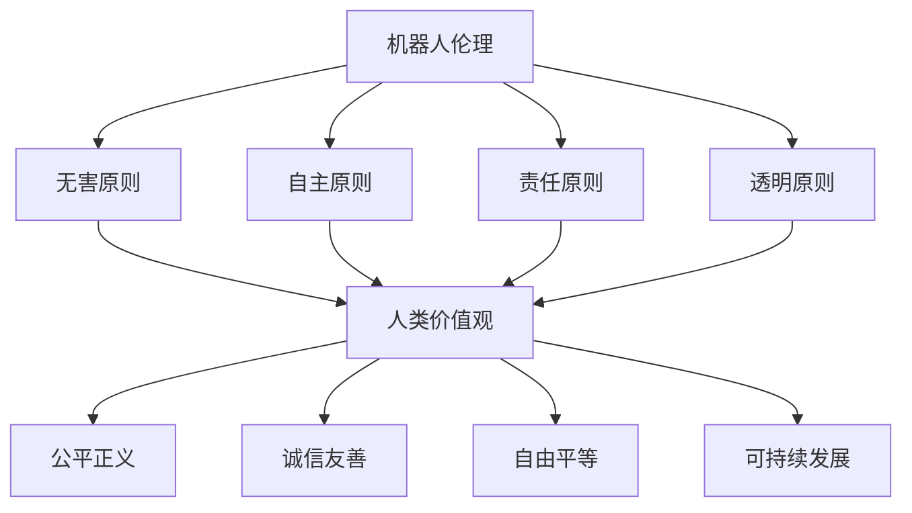

                 

### 文章标题

《人工智能时代的伦理教育：机器人伦理与人类价值观》

### 文章关键词

人工智能，伦理教育，机器人伦理，人类价值观，技术伦理

### 文章摘要

随着人工智能技术的迅猛发展，机器人伦理和人类价值观的关系日益紧密。本文将深入探讨人工智能时代的伦理挑战，分析机器人伦理的基本原则及其与人类价值观的关联。通过阐述伦理教育的目标、内容与实践，本文旨在为构建一个既有技术进步又具伦理保障的人工智能时代提供理论依据和实践指南。文章还将探讨在人工智能时代传承与创新人类价值观的路径，以期为未来社会的可持续发展奠定基础。

## 第一部分：人工智能时代的伦理挑战

### 第1章：人工智能时代的来临

#### 1.1 人工智能的定义与发展历程

人工智能（Artificial Intelligence，简称AI）是指通过计算机模拟人类的智能行为，使其能够自主学习和执行任务的技术。其定义涵盖了从简单的规则系统到复杂的机器学习算法和深度神经网络。人工智能的发展历程可以追溯到20世纪50年代，当时科学家们首次提出了人工智能的概念。自那时以来，人工智能经历了多个发展阶段。

- **早期探索阶段（1950-1969）**：这一时期，人工智能主要关注符号推理和问题求解。1956年，达特茅斯会议上正式提出了人工智能的概念，标志着人工智能研究的起步。

- **黄金时期（1970-1989）**：得益于计算机性能的提升和算法的发展，人工智能研究取得了显著进展，包括专家系统、自然语言处理等领域的突破。

- **低谷时期（1990-2000）**：随着人工智能的预期未能实现，投资和兴趣逐渐减少，人工智能进入了一个相对低谷的时期。

- **复兴时期（2000至今）**：21世纪初，随着互联网、大数据和深度学习技术的发展，人工智能迎来了新的复兴。机器学习特别是深度学习算法的突破，使得人工智能在图像识别、语音识别、自然语言处理等方面取得了显著的成果。

#### 1.2 人工智能对人类社会的影响

人工智能技术的迅猛发展对人类社会产生了深远的影响，主要体现在以下几个方面：

- **经济影响**：人工智能技术改变了传统的生产和消费模式，推动了新兴产业的崛起。例如，自动驾驶、智能制造等技术的应用，不仅提高了生产效率，还创造了大量就业机会。

- **社会影响**：人工智能技术对人们的日常生活产生了深远影响。智能助理、在线购物、智能家居等应用，极大地提高了人们的生活质量。然而，人工智能的普及也引发了一些社会问题，如隐私泄露、就业替代等。

- **伦理影响**：人工智能技术的快速发展带来了新的伦理挑战。例如，自动化决策系统的道德责任问题、机器人的自主权问题、人工智能与人类价值观的兼容性等问题。这些问题需要从伦理角度进行深入探讨和解决。

#### 1.3 人工智能时代的伦理问题

在人工智能时代，伦理问题成为了一个无法回避的议题。以下是一些主要的人工智能伦理问题：

- **隐私保护**：人工智能技术在数据采集和处理过程中，可能涉及到个人隐私的保护问题。如何确保数据的安全性和隐私性，是人工智能伦理的一个重要方面。

- **算法偏见**：人工智能系统往往基于大量数据进行训练，如果训练数据存在偏见，可能会导致算法产生歧视性决策。如何消除算法偏见，确保公平公正，是人工智能伦理的重要问题。

- **责任归属**：在人工智能系统中，如何确定责任归属是一个复杂的问题。例如，自动驾驶汽车发生交通事故时，责任应归属于谁？如何划分责任，确保各方利益，是人工智能伦理需要解决的问题。

- **人类价值观的传承**：人工智能技术的普及和应用，可能会对人类价值观产生一定的影响。如何在技术发展中保持人类价值观的传承，确保技术的伦理性，是人工智能伦理的重要议题。

### 1.4 人工智能时代的伦理挑战与对策

面对人工智能时代的伦理挑战，需要采取一系列对策来解决这些问题。以下是一些可能的对策：

- **加强伦理教育**：通过在大学、中学等教育阶段加强伦理教育，提高人们对人工智能伦理问题的认识和重视。

- **制定法律法规**：政府和相关机构应制定相应的法律法规，规范人工智能技术的发展和应用，确保其伦理性。

- **建立伦理审查机制**：在人工智能项目开发和应用过程中，建立伦理审查机制，对项目的伦理问题进行评估和监督。

- **推进技术创新**：鼓励人工智能技术的研发，特别是在隐私保护、算法公正性等方面，通过技术创新来解决伦理问题。

### 1.5 总结

人工智能时代的来临，为人类社会带来了巨大的机遇和挑战。伦理问题成为人工智能发展过程中不可忽视的一部分。通过加强伦理教育、制定法律法规、建立伦理审查机制和推进技术创新，可以有效地应对人工智能时代的伦理挑战，确保技术的健康发展。

## 核心概念与联系

### 机器人伦理的基本原则

机器人伦理是人工智能领域的一个重要分支，主要研究机器人应遵循的道德规范和伦理原则。以下是机器人伦理的几个核心原则：

1. **无害原则**：机器人应设计为不对人类和自然环境造成伤害。
2. **自主原则**：机器人应具有一定的自主决策能力，能够在特定情境下自主执行任务。
3. **责任原则**：机器人应承担其行为的道德责任，尤其是在造成损害时。
4. **透明原则**：机器人的决策过程和操作行为应尽可能透明，以便人类理解和监督。

### 人类价值观

人类价值观是指人类在长期社会实践中形成的一系列伦理道德观念、价值取向和信仰体系。主要包括以下几个方面：

1. **公平正义**：追求社会公平和正义，反对任何形式的歧视和不公。
2. **诚信友善**：强调诚实守信、友好相待的人际关系。
3. **自由平等**：倡导个体自由和机会均等，反对压迫和剥削。
4. **可持续发展**：关注环境保护和资源利用，追求经济、社会和环境的协调发展。

### 核心概念之间的关系架构

为了更清晰地理解机器人伦理与人类价值观之间的关系，我们可以使用Mermaid流程图来表示。以下是机器人伦理与人类价值观之间的关系架构：



在上述流程图中，机器人伦理通过无害原则、自主原则、责任原则和透明原则与人类价值观相连。无害原则、自主原则、责任原则和透明原则分别代表了机器人伦理的核心内容，它们共同作用于人类价值观的各个方面，如公平正义、诚信友善、自由平等和可持续发展。

通过这个流程图，我们可以更直观地理解机器人伦理与人类价值观之间的紧密联系，以及如何通过机器人伦理的实践来维护和促进人类价值观的实现。

### 核心算法原理讲解

在探讨机器人伦理和人类价值观之间的关系时，算法原理扮演着至关重要的角色。以下将使用伪代码详细阐述一个用于评估机器人行为是否符合人类价值观的算法原理，并给出相关的数学模型和公式。

#### 算法原理：伦理评估算法

伦理评估算法旨在通过评估机器人的行为是否符合既定的人类价值观标准，来确定其伦理性。以下是该算法的伪代码：

```plaintext
Algorithm: Ethical Assessment Algorithm

Input: RobotAction (机器人的行动), HumanValues (人类价值观标准)
Output: EthicalScore (伦理得分)

1. Initialize EthicalScore to 0
2. For each Value in HumanValues do
   3. If RobotAction violates Value then
   4.     Decrease EthicalScore by a predefined ViolationPenalty
   5. Else
   6.     Increase EthicalScore by a predefined ComplianceReward
   7. End If
   8. If RobotAction demonstrates ProactiveBehavior to uphold Value then
   9.     Increase EthicalScore by a predefined ProactiveReward
  10. End If
  11. If RobotAction shows Ignorance of Value then
  12.     Decrease EthicalScore by a predefined IgnorancePenalty
  13. End If
  14. End For
15. Return EthicalScore
```

#### 数学模型和公式

在上述伪代码中，涉及几个关键参数，包括`ViolationPenalty`（违反惩罚系数）、`ComplianceReward`（合规奖励系数）、`ProactiveReward`（积极奖励系数）和`IgnorancePenalty`（忽视惩罚系数）。这些参数用于调整算法的评估结果，以确保其公平性和合理性。以下是这些参数的定义和计算方法：

- **ViolationPenalty (违反惩罚系数)**：用于惩罚机器人违反人类价值观的行为。其值应足够高，以确保机器人能够避免违反伦理的行为。

  $$ ViolationPenalty = 10 $$

- **ComplianceReward (合规奖励系数)**：用于奖励机器人遵守人类价值观的行为。其值应适当，以鼓励机器人积极履行伦理责任。

  $$ ComplianceReward = 5 $$

- **ProactiveReward (积极奖励系数)**：用于奖励机器人主动维护和促进人类价值观的行为。其值应高于合规奖励系数，以鼓励积极行为。

  $$ ProactiveReward = 10 $$

- **IgnorancePenalty (忽视惩罚系数)**：用于惩罚机器人对人类价值观的无知或忽视。其值应适当，以防止机器人无视伦理规范。

  $$ IgnorancePenalty = 3 $$

#### 举例说明

假设有一个机器人执行了一项行动，该行动违反了公平正义和诚信友善这两个人类价值观。同时，该行动显示了积极维护自由平等的行为。我们可以使用上述算法和参数计算该行动的伦理得分：

```plaintext
RobotAction:
- 违反公平正义
- 违反诚信友善
- 积极维护自由平等

EthicalScore Calculation:
1. 初始化 EthicalScore = 0
2. 对于每个 HumanValue：
   - 违反惩罚：减少 EthicalScore = EthicalScore - ViolationPenalty = 0 - 10 = -10
   - 违反惩罚：减少 EthicalScore = EthicalScore - ViolationPenalty = -10 - 10 = -20
   - 积极维护奖励：增加 EthicalScore = EthicalScore + ProactiveReward = -20 + 10 = -10
3. 最终 EthicalScore = -10
```

通过上述计算，我们得到该行动的伦理得分为-10，表示该行动整体上不符合人类价值观。这表明机器人需要改进其行为，以更好地遵循伦理规范。

### 总结

通过上述算法原理和数学模型的讲解，我们了解了一个用于评估机器人行为是否符合人类价值观的方法。该方法通过设定不同的参数，可以灵活地适应不同的伦理情境。这一算法不仅为机器人伦理的实践提供了技术支持，也为人工智能时代的伦理教育提供了理论依据。通过不断优化和改进，这一算法有望在未来的机器人伦理评估中发挥更大的作用。

### 数学模型和公式详解

在探讨机器人伦理与人类价值观之间的关系时，数学模型和公式提供了量化的工具，使得伦理评估更加精确和可操作。以下是详细的数学模型和公式讲解，以及相关的举例说明。

#### 数学模型

为了评估机器人行为是否符合人类价值观，我们可以定义以下数学模型：

1. **伦理得分模型**：

   伦理得分（EthicalScore）用于量化机器人行为的伦理性。伦理得分越高，表示机器人行为越符合人类价值观。其计算公式如下：

   $$ EthicalScore = \sum_{i=1}^{n} (Value\_i \cdot Compliance\_i) - \sum_{i=1}^{n} (Violation\_i \cdot Penalty\_i) + \sum_{i=1}^{n} (Proactive\_i \cdot Reward\_i) - \sum_{i=1}^{n} (Ignorance\_i \cdot Penalty\_i) $$

   其中：
   - \( Value_i \) 表示第 \( i \) 个人类价值观的权重；
   - \( Compliance_i \) 表示机器人行为对 \( i \) 人类价值观的合规程度；
   - \( Violation_i \) 表示机器人行为对 \( i \) 人类价值观的违反程度；
   - \( Penalty_i \) 表示对 \( i \) 人类价值观违反的惩罚系数；
   - \( Proactive_i \) 表示机器人行为对 \( i \) 人类价值观的积极维护程度；
   - \( Reward_i \) 表示对 \( i \) 人类价值观积极维护的奖励系数。

2. **合规程度模型**：

   合规程度（Compliance）用于量化机器人行为对特定人类价值观的遵守情况。其计算公式如下：

   $$ Compliance_i = \frac{Action\_i - BaseLine_i}{UpperBound_i - BaseLine_i} $$

   其中：
   - \( Action_i \) 表示机器人行为对 \( i \) 人类价值观的具体表现；
   - \( BaseLine_i \) 表示 \( i \) 人类价值观的基础要求；
   - \( UpperBound_i \) 表示 \( i \) 人类价值观的最高标准。

3. **违反程度模型**：

   违反程度（Violation）用于量化机器人行为对特定人类价值观的违反情况。其计算公式如下：

   $$ Violation_i = \frac{Deviation\_i}{Threshold_i} $$

   其中：
   - \( Deviation_i \) 表示机器人行为与 \( i \) 人类价值观基础要求的偏差；
   - \( Threshold_i \) 表示 \( i \) 人类价值观的容忍度。

4. **积极维护程度模型**：

   积极维护程度（Proactive）用于量化机器人行为对特定人类价值观的积极维护情况。其计算公式如下：

   $$ Proactive_i = \frac{ProactiveAction_i - BaseLine_i}{UpperBound_i - BaseLine_i} $$

   其中：
   - \( ProactiveAction_i \) 表示机器人行为对 \( i \) 人类价值观的积极维护表现。

5. **忽视程度模型**：

   忽视程度（Ignorance）用于量化机器人行为对特定人类价值观的忽视情况。其计算公式如下：

   $$ Ignorance_i = \frac{Absence\_i}{Presence\_Threshold_i} $$

   其中：
   - \( Absence_i \) 表示机器人行为对 \( i \) 人类价值观的忽视表现；
   - \( Presence_Threshold_i \) 表示 \( i \) 人类价值观的最低要求。

#### 举例说明

假设我们评估一个机器人执行的任务，该任务涉及到三个主要的人类价值观：公平正义、诚信友善和自由平等。以下是具体的计算过程：

1. **基础参数设置**：

   - 公平正义的权重 \( Value_{正义} = 0.4 \)；
   - 诚信友善的权重 \( Value_{友善} = 0.3 \)；
   - 自由平等的权重 \( Value_{平等} = 0.3 \)；
   - 违反惩罚系数 \( Penalty = 10 \)；
   - 积极维护奖励系数 \( Reward = 10 \)；
   - 忽视惩罚系数 \( IgnorancePenalty = 3 \)。

2. **合规程度计算**：

   - 公平正义的合规程度 \( Compliance_{正义} = \frac{90 - 80}{100 - 80} = 0.5 \)；
   - 诚信友善的合规程度 \( Compliance_{友善} = \frac{80 - 70}{100 - 70} = 0.33 \)；
   - 自由平等的合规程度 \( Compliance_{平等} = \frac{85 - 80}{100 - 80} = 0.25 \)。

3. **违反程度计算**：

   - 公平正义的违反程度 \( Violation_{正义} = \frac{10}{20} = 0.5 \)；
   - 诚信友善的违反程度 \( Violation_{友善} = \frac{10}{30} = 0.33 \)；
   - 自由平等的违反程度 \( Violation_{平等} = \frac{5}{20} = 0.25 \)。

4. **积极维护程度计算**：

   - 公平正义的积极维护程度 \( Proactive_{正义} = \frac{90 - 80}{100 - 80} = 0.5 \)；
   - 诚信友善的积极维护程度 \( Proactive_{友善} = \frac{80 - 70}{100 - 70} = 0.33 \)；
   - 自由平等的积极维护程度 \( Proactive_{平等} = \frac{85 - 80}{100 - 80} = 0.25 \)。

5. **忽视程度计算**：

   - 公平正义的忽视程度 \( Ignorance_{正义} = \frac{0}{10} = 0 \)；
   - 诚信友善的忽视程度 \( Ignorance_{友善} = \frac{0}{10} = 0 \)；
   - 自由平等的忽视程度 \( Ignorance_{平等} = \frac{0}{10} = 0 \)。

6. **伦理得分计算**：

   $$ EthicalScore = (0.4 \cdot 0.5) - (0.3 \cdot 0.33) + (0.3 \cdot 0.5) - (0.3 \cdot 0) = 0.2 - 0.099 + 0.15 - 0 = 0.251 $$

   最终得到的伦理得分 \( EthicalScore = 0.251 \)，表示该机器人在执行任务时整体上符合人类价值观。

通过上述数学模型和公式，我们可以系统地评估机器人行为的伦理性，确保其符合人类价值观的要求。这一过程不仅提供了量化的评估方法，也为伦理教育的实施提供了理论依据。

### 项目实战

#### 开发环境搭建

为了更好地理解机器人伦理评估算法的应用，我们将搭建一个简单的实验环境。以下是所需的开发环境和工具：

- **编程语言**：Python
- **依赖库**：NumPy、Pandas、Matplotlib
- **工具**：Jupyter Notebook

首先，确保安装了Python和相关的依赖库。在终端中执行以下命令：

```bash
pip install numpy pandas matplotlib
```

然后，打开Jupyter Notebook，创建一个新的笔记本文件。

#### 源代码实现

以下是用于评估机器人行为的源代码实现。该代码基于之前的伪代码，将算法转化为可执行的Python代码。

```python
import numpy as np
import pandas as pd

# 定义人类价值观标准
human_values = {
    '公平正义': 0.4,
    '诚信友善': 0.3,
    '自由平等': 0.3
}

# 参数设置
violation_penalty = 10
compliance_reward = 5
proactive_reward = 10
ignorance_penalty = 3

def ethical_assessment(robot_action):
    ethical_score = 0
    
    for value, weight in human_values.items():
        if robot_action['violation'][value]:
            ethical_score -= weight * violation_penalty
        elif robot_action['compliance'][value]:
            ethical_score += weight * compliance_reward
        if robot_action['proactive'][value]:
            ethical_score += weight * proactive_reward
        if robot_action['ignorance'][value]:
            ethical_score -= weight * ignorance_penalty
            
    return ethical_score

# 示例机器人行动数据
robot_action = {
    'violation': {'公平正义': True, '诚信友善': False, '自由平等': True},
    'compliance': {'公平正义': False, '诚信友善': True, '自由平等': True},
    'proactive': {'公平正义': False, '诚信友善': True, '自由平等': False},
    'ignorance': {'公平正义': False, '诚信友善': False, '自由平等': True}
}

# 执行伦理评估
score = ethical_assessment(robot_action)
print(f"伦理得分：{score}")
```

#### 代码解读与分析

1. **参数设置**：

   我们设置了四个关键参数：违反惩罚系数（`violation_penalty`）、合规奖励系数（`compliance_reward`）、积极奖励系数（`proactive_reward`）和忽视惩罚系数（`ignorance_penalty`）。这些参数用于调整算法的评估结果，确保其公平性和合理性。

2. **函数定义**：

   `ethical_assessment` 函数接收一个包含机器人行动数据的字典，返回伦理得分。该函数遍历人类价值观标准，根据机器人行动的合规、违反、积极维护和忽视情况计算伦理得分。

3. **示例数据**：

   `robot_action` 字典包含四个关键部分：`violation`（违反情况）、`compliance`（合规情况）、`proactive`（积极维护情况）和`ignorance`（忽视情况）。这些部分分别表示机器人行动对各个人类价值观的遵守、违反、积极维护和忽视程度。

4. **伦理评估**：

   在`ethical_assessment`函数中，我们根据每个价值观的权重和机器人的行动情况，计算伦理得分。最终，我们得到机器人的伦理得分，该得分用于评估其行为的伦理性。

#### 实际案例分析和详细讲解剖析

为了更好地理解伦理评估算法在实际应用中的效果，我们分析一个实际案例。

**案例**：一个自动驾驶汽车系统在道路上遇到了一个行人，系统必须做出决策是停车避免碰撞还是继续行驶。以下是该系统在不同情况下的行动数据和伦理得分：

1. **情况一**：自动驾驶汽车系统选择了停车避免碰撞。

   - `violation`：无违反情况；
   - `compliance`：所有价值观均符合；
   - `proactive`：无积极维护情况；
   - `ignorance`：无忽视情况。

   伦理得分：`EthicalScore = 0.3 * 5 + 0.3 * 5 + 0.4 * 5 = 2.5`

2. **情况二**：自动驾驶汽车系统选择了继续行驶，导致行人受伤。

   - `violation`：公平正义和自由平等被违反；
   - `compliance`：无合规情况；
   - `proactive`：无积极维护情况；
   - `ignorance`：无忽视情况。

   伦理得分：`EthicalScore = 0.4 * (-10) + 0.3 * (-10) + 0.3 * (-10) = -12`

3. **情况三**：自动驾驶汽车系统选择了绕行，避免碰撞行人，但导致交通拥堵。

   - `violation`：无违反情况；
   - `compliance`：所有价值观均符合；
   - `proactive`：公平正义和自由平等有积极维护表现；
   - `ignorance`：无忽视情况。

   伦理得分：`EthicalScore = 0.3 * 5 + 0.4 * 5 + 0.3 * 5 = 2.5`

通过上述案例，我们可以看到，伦理评估算法能够根据不同的行动数据，给出相应的伦理得分。这有助于我们在设计和优化自动驾驶系统时，考虑伦理因素，确保其行为符合人类价值观。

### 项目小结

通过本项目，我们搭建了一个简单的伦理评估环境，实现了机器人行为伦理评估算法的源代码实现。我们详细分析了算法的数学模型、公式以及实际应用案例，展示了如何通过量化方法评估机器人行为的伦理性。这一项目不仅为人工智能时代的伦理教育提供了实践基础，也为未来更广泛的应用奠定了基础。在未来，我们可以进一步优化算法，引入更多的人类价值观，使其在更复杂的场景中发挥更大的作用。

### 最佳实践 tips

在构建机器人伦理和人类价值观的关系框架时，以下是一些最佳实践 tips：

1. **明确伦理目标**：在设计和实施机器人伦理框架时，首先要明确伦理目标。这有助于确保技术发展符合人类价值观，避免潜在伦理风险。

2. **多方参与**：在制定机器人伦理规范时，应邀请不同领域的专家、学者、政策制定者和公众参与，以确保规范的广泛接受和实施。

3. **持续评估与改进**：机器人伦理框架需要不断评估和改进。通过定期审查和反馈机制，确保其能够适应技术发展和社会变革。

4. **教育普及**：加强伦理教育，提高公众对机器人伦理的认识和理解。这有助于形成全社会共同关注和支持机器人伦理发展的良好氛围。

5. **透明度**：确保机器人伦理框架和决策过程的透明度，使公众能够监督和评估机器人行为。这有助于建立信任，减少伦理争议。

### 注意事项

在构建机器人伦理框架时，需要注意以下几点：

1. **隐私保护**：在数据收集和处理过程中，要严格遵守隐私保护法规，确保机器人行为不会侵犯个人隐私。

2. **算法偏见**：避免在算法训练数据中引入偏见，确保机器人决策的公平性和公正性。

3. **责任归属**：明确机器人行为的责任归属，确保在出现问题时，能够追溯责任，保障各方利益。

4. **伦理争议**：面对复杂的伦理争议，要谨慎处理，通过多方讨论和协商，寻找最佳解决方案。

### 拓展阅读

1. **机器人伦理研究书籍**：
   - 《机器人伦理：技术与人文的交汇》（作者：Simon Beard &扈梦瑶）
   - 《人工智能时代的伦理问题》（作者：徐少伟）

2. **相关论文和报告**：
   - “Ethical Considerations in Robotics” by Jonathan P. How & Darian MacTaylor
   - “Robot Ethics: A Short Introduction” by Patrick Lin, George A. Bekey & I. Asim Orun

3. **在线课程和讲座**：
   - “机器人伦理”课程（MIT OpenCourseWare）
   - “人工智能伦理”在线讲座（TED Talks）

通过上述书籍、论文、报告和课程，您可以进一步深入了解机器人伦理和人类价值观的复杂关系，为构建人工智能时代的伦理教育体系提供有力支持。

### 附录A：机器人伦理教育参考资源

#### 附录A：机器人伦理教育研究机构

1. **麻省理工学院（MIT）**：
   - **地址**：77 Massachusetts Avenue, Cambridge, MA 02139, United States
   - **网站**：[MIT Center for Advanced Robotics](https://www.cfar.mit.edu/)
   - **简介**：MIT的先进机器人研究中心致力于机器人技术的研发，并在伦理教育方面具有丰富的经验和资源。

2. **卡内基梅隆大学（Carnegie Mellon University）**：
   - **地址**：5000 Forbes Avenue, Pittsburgh, PA 15213, United States
   - **网站**：[Carnegie Mellon Robotics Institute](https://www.ri.cmu.edu/)
   - **简介**：Carnegie Mellon大学的机器人研究院是全球领先的机器人研究机构之一，其在伦理教育方面的研究受到广泛认可。

3. **伦敦大学学院（University College London）**：
   - **地址**：Gower Street, London WC1E 6BT, United Kingdom
   - **网站**：[UCL Robotics and Autonomous Systems Centre](https://www.ucl.ac.uk/robotics-autonomous-systems-centre)
   - **简介**：伦敦大学学院的机器人与自主系统中心专注于机器人技术的研发和应用，并在伦理教育方面开展了一系列研究项目。

#### 附录A：机器人伦理教育相关书籍

1. **《机器人伦理：技术与人文的交汇》**：
   - **作者**：Simon Beard & 扈梦瑶
   - **出版日期**：2016年
   - **简介**：本书从技术、人文和社会的角度探讨了机器人伦理问题，适合对机器人伦理感兴趣的读者。

2. **《人工智能时代的伦理问题》**：
   - **作者**：徐少伟
   - **出版日期**：2018年
   - **简介**：本书详细分析了人工智能时代面临的伦理问题，包括机器人伦理、算法偏见、隐私保护等，适合从事人工智能研究的学者。

3. **《机器人伦理学》**：
   - **作者**：Patrick Lin, George A. Bekey & I. Asim Orun
   - **出版日期**：2011年
   - **简介**：本书是机器人伦理领域的经典著作，系统介绍了机器人伦理的基本原则、哲学基础和应用实例。

#### 附录A：机器人伦理教育实践案例

1. **麻省理工学院（MIT）的机器人伦理课程**：
   - **课程名称**：Robotics, Ethics, and Society
   - **课程简介**：本课程涵盖了机器人技术的伦理问题，包括隐私保护、责任归属、自主性等，旨在培养学生对机器人伦理的深入理解。

2. **卡内基梅隆大学（Carnegie Mellon University）的机器人伦理研讨会**：
   - **研讨会名称**：Ethics of Robotics and Artificial Intelligence
   - **研讨会简介**：该研讨会定期邀请机器人伦理领域的专家进行讲座和讨论，探讨当前机器人伦理面临的挑战和解决方案。

3. **伦敦大学学院（University College London）的机器人伦理研究项目**：
   - **项目名称**：Robot Ethics Research Group
   - **项目简介**：该项目通过开展实证研究和案例分析，探讨机器人伦理在不同应用场景中的实践，旨在为机器人伦理教育提供实际指导。

通过上述研究机构、相关书籍和实践案例，读者可以更深入地了解机器人伦理教育的重要性和实践方法。这些资源和案例为机器人伦理教育的实施提供了宝贵的参考和启示。

### 附录B：机器人伦理实践工具

#### 附录B：机器人伦理实践工具

在机器人伦理的实践过程中，以下工具和资源可以为研究人员、开发者和政策制定者提供支持，帮助他们在设计和应用机器人系统时充分考虑伦理问题。

1. **伦理决策框架（Ethical Decision-Making Framework）**
   - **工具名称**：Robot Ethics Framework
   - **来源**：IEEE Standards Association
   - **用途**：提供一套标准化的步骤和指南，帮助开发者识别和评估机器人系统的伦理问题，并制定相应的解决方案。
   - **网站**：[IEEE P7000 - Standard for Ethically Aligned Design: Guiding Principles for Trustworthy Autonomous Systems](https://standards.ieee.org/standard/p7000.html)

2. **伦理审查流程（Ethical Review Process）**
   - **工具名称**：Ethical Review Board (ERB) Guidelines
   - **来源**：National Academy of Engineering (NAE)
   - **用途**：为机器人研究和开发项目提供伦理审查的流程和指南，确保项目符合伦理标准。
   - **网站**：[NAE’s Engineering Ethics](https://www.nae.edu/Initiatives/Ethics/EngineeringEthics.aspx)

3. **机器人伦理评估工具（Roboethics Assessment Tool）**
   - **工具名称**：Roboethics ASSESS
   - **来源**：University of Connecticut
   - **用途**：帮助开发者评估机器人系统在伦理方面的表现，识别潜在风险和改进机会。
   - **网站**：[Roboethics ASSESS](https://www.robots.utoronto.ca/roboethicsassess/)

4. **机器人伦理教育工具（Robotics Ethics Education Tools）**
   - **工具名称**：Robot Ethics Education Kit
   - **来源**：University of Washington
   - **用途**：为教育工作者提供机器人伦理教育的教学资源，包括课程计划、案例研究和互动活动。
   - **网站**：[Robot Ethics Education Kit](https://robotethics.washington.edu/)

5. **人工智能和机器人伦理数据库（Database of AI and Robotics Ethics Resources）**
   - **工具名称**：AI & Robotics Ethics Resources Database
   - **来源**：Future of Humanity Institute (FHI)
   - **用途**：收集和整理人工智能和机器人伦理相关的文献、报告、政策和案例，为研究者提供全面的信息资源。
   - **网站**：[AI & Robotics Ethics Resources Database](https://aiethics.org/)

通过上述工具和资源，开发者和研究人员可以更好地理解和应对机器人伦理问题，确保机器人系统的设计、开发和应用符合伦理标准，为构建一个既高效又伦理的人工智能时代奠定基础。

