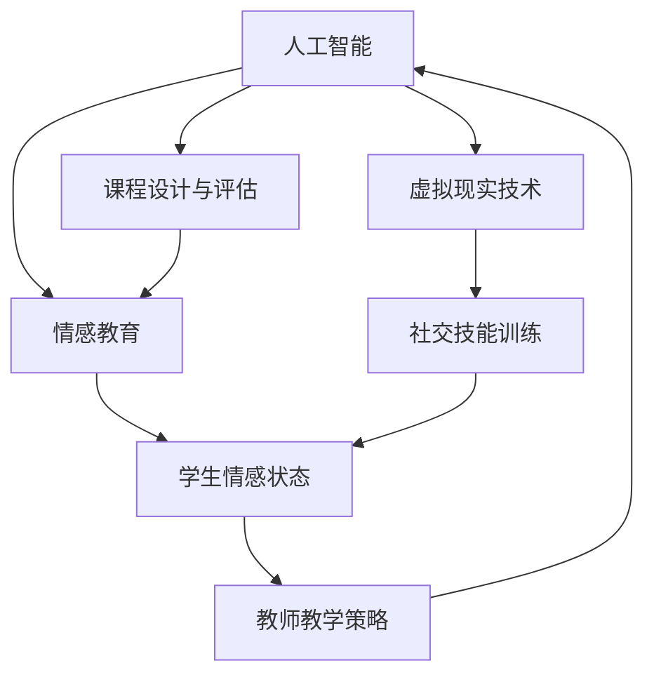
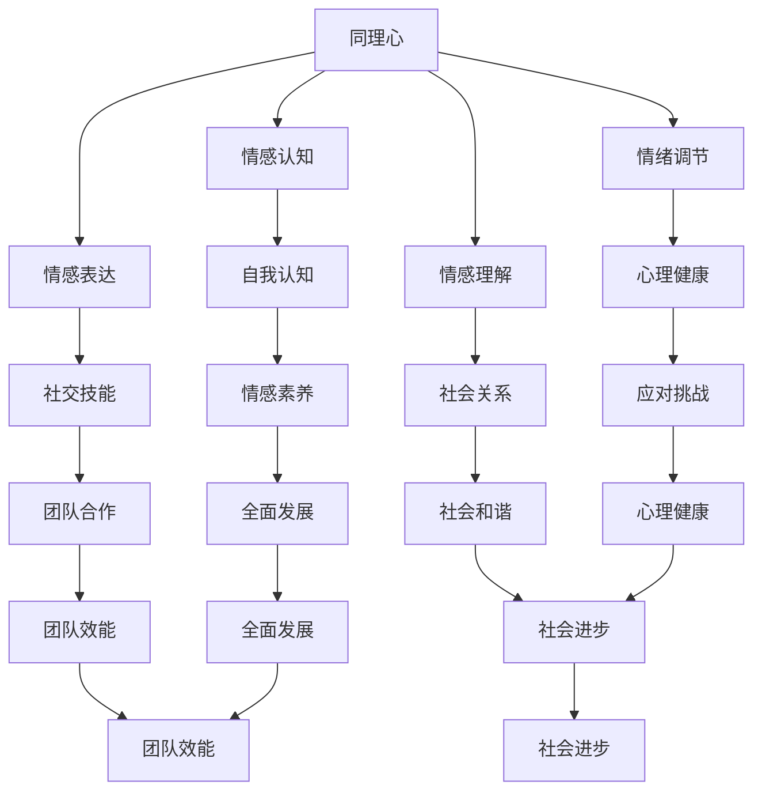
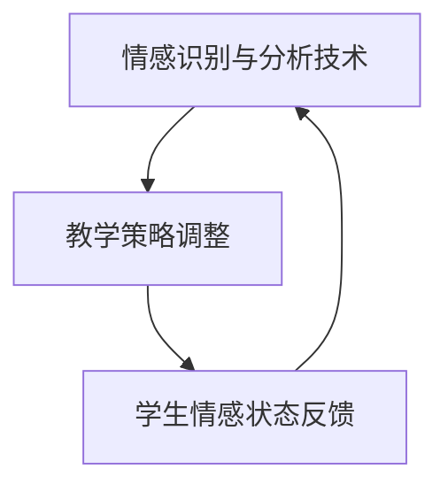
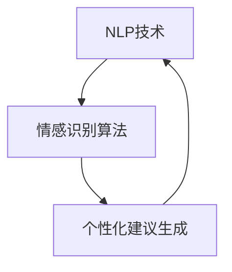
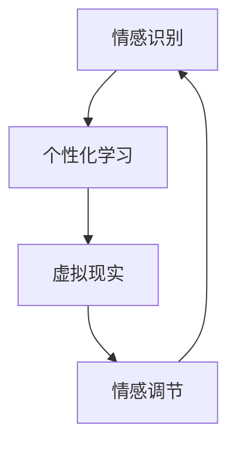

                 


### 第1章 引言：AI时代的情感教育变革

#### 1.1 什么是情感教育
情感教育是指通过有目的、有计划的教育活动，帮助学生识别、理解和调节自己的情绪，提高与他人建立情感联系的能力，进而促进个体全面发展。其核心在于培养学生的情感素养，包括情绪认知、情感表达、情绪调节和情感理解等。

情感教育的目标不仅在于使学生具备良好的情感状态，更重要的是培养他们的同理心和社交技能，使其能够在复杂多变的社会环境中保持心理健康，形成积极的人生观和价值观。

#### 1.2 同理心在情感教育中的核心地位
同理心是一种重要的情感素养，指的是个体能够感知并理解他人的情绪、需求和感受，从而做出相应的情感反应。同理心在情感教育中占据核心地位，因为它是人际交往和社会和谐的重要基础。

同理心的培养有助于学生建立健康的人际关系，增强团队合作能力，提高社会适应能力。同时，同理心的培养也有助于学生发展自我认知，理解自己的情感和行为，从而实现个人成长。

#### 1.3 情感教育与人工智能的互动关系
随着人工智能（AI）技术的快速发展，情感教育与AI的互动关系日益密切。AI技术在情感教育中的应用，不仅提供了新的教育手段和工具，也为情感教育的研究提供了新的视角和方法。

首先，AI技术可以通过情感识别和分析，帮助教师更好地了解学生的情感状态，从而提供个性化的教育支持。例如，通过面部表情识别技术，教师可以实时监测学生的情绪变化，及时调整教学策略，提高教学效果。

其次，AI技术可以辅助学生进行情感调节和社交技能训练。例如，虚拟现实（VR）技术可以创造一个安全的学习环境，让学生在模拟的社交场景中练习同理心和社交技能，从而提高其实际应用能力。

此外，AI技术还可以帮助教师进行情感教育课程的设计和评估。通过大数据分析和机器学习算法，教师可以了解学生的学习需求和情感状态，从而设计更加有效的教育课程，并进行教学效果的评估和反馈。

总之，人工智能与情感教育的结合，不仅丰富了情感教育的手段和工具，也为情感教育的研究和实践提供了新的思路和方法。在未来的教育发展中，如何更好地利用AI技术，培养具有同理心和社交技能的学生，将是一个重要的课题。

### 1.4 情感教育与人工智能的互动关系图解

为了更好地理解情感教育与人工智能的互动关系，我们使用Mermaid流程图来展示它们之间的关联。



在这个流程图中，AI技术与情感教育相互促进，形成了一个良性循环。AI通过分析学生情感状态，为教师提供反馈，帮助教师调整教学策略，从而优化课程设计和评估。同时，AI技术也通过虚拟现实等技术，为学生提供情感调节和社交技能训练的机会，进一步提升学生的情感素养。

### 第2章 同理心的重要性

#### 2.1 同理心的定义与意义

同理心，又称共情，是指个体能够设身处地地理解并感受他人的情绪、需求和感受。这种能力不仅包括情感上的共鸣，还涉及到认知上的理解和行为上的响应。同理心是一种复杂的社会技能，它要求个体不仅要识别他人的情绪，还要理解这些情绪背后的原因，并做出适当的反应。

同理心的意义在于它是个体与他人建立深层情感联系的基础。一个具有同理心的人能够更好地理解他人的情感状态，从而在人际交往中表现出更高的亲和力和协作能力。同理心不仅有助于建立和谐的人际关系，还能促进个体的自我认知和情感发展。

#### 2.2 同理心在情感教育中的角色

在情感教育中，同理心扮演着至关重要的角色。首先，同理心是培养情感素养的核心。通过同理心的培养，学生能够更好地识别和理解自己的情感，同时也更容易理解和尊重他人的情感。这种能力有助于学生在复杂的社会环境中保持心理健康，形成积极的人际交往模式。

其次，同理心是促进社会和谐的重要力量。一个具备同理心的人更容易与他人建立信任和合作，从而推动社会关系的和谐发展。在多元化、复杂化的社会背景下，同理心的培养对于构建包容性社会、减少冲突和促进社会稳定具有重要意义。

#### 2.3 传统教育中同理心培养的方法与挑战

传统教育中，同理心的培养主要通过以下几种方法：

1. **情感教育课程**：通过专门的情感教育课程，教授学生情感认知、表达和调节的技能。这些课程通常包括角色扮演、情感故事分享和情感反思等活动，旨在提高学生的同理心。

2. **互动式教学**：通过小组讨论、合作学习和课堂互动等方式，鼓励学生之间的情感交流和相互理解。这种教学方式有助于学生通过实际互动，体验和理解他人的情感状态。

3. **教师示范**：教师通过自身的言行示范，向学生传达同理心的重要性。教师的关爱和耐心可以帮助学生树立正确的情感态度，培养同理心。

然而，传统教育在同理心培养方面也存在一些挑战：

1. **教育资源的限制**：由于教育资源的限制，很多学校难以开设专门的情感教育课程，导致同理心的培养缺乏系统性和针对性。

2. **教学方法的单一性**：传统教育中，同理心的培养主要依赖于教师的示范和课堂互动，缺乏多样化和个性化的教学手段，难以满足不同学生的需求。

3. **社会环境的影响**：现代社会竞争激烈，学业压力较大，学生在情感表达和调节方面可能面临更多的挑战。此外，家庭和社会环境的影响也可能削弱学生对同理心的培养。

#### 2.4 AI技术在同理心培养中的应用

随着人工智能技术的不断发展，AI在同理心培养中的应用逐渐成为可能。以下是一些AI技术在同理心培养中的应用：

1. **情感识别技术**：AI可以通过面部表情识别、语音分析和生理信号监测等技术，实时识别学生的情感状态。这种技术可以帮助教师及时了解学生的情感需求，从而提供个性化的情感支持。

2. **虚拟现实技术**：通过虚拟现实（VR）技术，学生可以在模拟的社交环境中练习同理心和社交技能。这种技术提供了一个安全、可控的学习环境，有助于学生通过实践提高同理心。

3. **个性化学习平台**：AI可以分析学生的学习行为和情感状态，为学生提供个性化的学习内容和情感支持。这种平台可以根据学生的需求，设计针对性的同理心培养方案，提高教育的有效性。

总之，AI技术在同理心培养中的应用，为传统教育提供了新的方法和工具。通过AI技术，我们可以更加精准和高效地培养同理心，为学生的全面发展提供有力支持。

### 2.5 同理心培养的重要性与影响

同理心的重要性不仅体现在个人层面上，还对社会和道德发展产生深远影响。

#### 个人层面

1. **情感素养提升**：同理心的培养有助于个体更好地理解和管理自己的情感，提高情感素养。

2. **社交能力增强**：同理心使个体更容易与他人建立情感联系，增强社交能力，促进良好的人际关系。

3. **心理健康保障**：具备同理心的人能够更好地应对生活中的压力和挑战，保持心理健康。

#### 社会层面

1. **社会和谐**：同理心有助于构建包容性社会，减少冲突和歧视，促进社会和谐。

2. **团队合作**：同理心是团队合作的重要基础，有助于建立信任和协作，提高团队效能。

3. **社会参与**：同理心使个体更愿意参与社会活动和公益事业，推动社会进步。

#### 道德发展

1. **道德认知**：同理心的培养有助于个体形成正确的道德观念，理解并尊重他人的权利和尊严。

2. **道德行为**：同理心使个体更倾向于做出道德选择，避免伤害他人，促进正义和公平。

总之，同理心的培养对于个人和社会都具有重要意义。通过情感教育和AI技术的结合，我们可以更好地培养同理心，促进个体全面发展和社会进步。

### 2.6 同理心培养的核心概念联系与教育架构

为了更好地理解同理心培养的核心概念及其在教育中的具体应用，我们使用Mermaid流程图来展示各概念之间的关系和教育架构。



在这个流程图中，同理心（A）作为核心概念，与其他情感认知（B）、情感表达（C）、情绪调节（D）、情感理解（E）等子概念紧密相连，共同构成一个完整的教育架构。这个架构不仅涵盖了个人层面的情感素养（J）、心理健康（H）和社交技能（G），还延伸到社会层面的社会和谐（M）、团队合作（K）和道德发展（I）。通过这个架构，我们可以清晰地看到同理心培养在教育中的整体作用和具体实施路径。

### 第3章 当前情感教育的现状

#### 3.1 情感教育的现状分析

当前，情感教育在全球范围内逐渐受到重视，但实际实施情况却存在较大差异。在一些发达国家和地区，如美国、英国和加拿大，情感教育已经纳入中小学课程体系，形成了较为完善的教育体系。这些地区的教育政策鼓励学校开展情感教育，提供丰富的教学资源和专业培训，以帮助学生发展情感素养和社交技能。

然而，在其他国家和地区，情感教育的开展程度相对较低。部分原因是由于教育资源不足，教师缺乏情感教育的专业知识和技能。此外，传统教育模式侧重于知识传授，忽视了对学生情感和社交能力的培养，导致情感教育的地位和影响力有限。

#### 3.2 AI在情感教育中的角色

随着人工智能技术的快速发展，AI在情感教育中的应用逐渐成为可能。首先，AI技术可以提供情感识别和分析工具，帮助教师实时了解学生的情感状态。例如，通过面部表情识别技术，AI可以分析学生的情绪变化，为教师提供反馈，从而调整教学策略，提高教学效果。

其次，AI技术可以辅助学生进行情感调节和社交技能训练。例如，虚拟现实（VR）技术可以创造一个安全的学习环境，让学生在模拟的社交场景中练习同理心和社交技能。这种技术提供了丰富的互动体验，有助于学生在实际应用中提高情感素养。

此外，AI还可以用于情感教育课程的设计和评估。通过大数据分析和机器学习算法，AI可以分析学生的学习行为和情感状态，为教师提供个性化的教育建议。同时，AI可以自动化评估学生的学习成果，帮助教师了解课程的有效性，并进行及时的调整和优化。

总之，AI技术在情感教育中的应用，为传统教育模式带来了新的变革。通过AI技术，我们可以更加精准和高效地培养学生的情感素养和社交技能，为他们的全面发展提供有力支持。

### 3.3 AI技术在情感教育中的具体应用

AI技术在情感教育中的应用，不仅改变了传统的教育方式，还为情感教育的深化提供了新的途径。以下是一些AI技术在情感教育中的具体应用案例：

#### 1. 情感识别与分析

情感识别与分析是AI在情感教育中最早且最为广泛应用的技术之一。通过面部表情识别、语音分析和生理信号监测等技术，AI可以实时识别学生的情感状态。

- **面部表情识别**：通过摄像头或屏幕捕捉学生的面部表情，AI算法可以识别出不同情绪，如快乐、悲伤、愤怒等。这种技术有助于教师了解学生的情绪反应，从而及时调整教学策略。

- **语音分析**：通过分析学生的语音，AI可以识别出情感倾向，如音调、节奏和语速等。这种技术可以帮助教师了解学生的情感状态，特别是在无法直接观察学生表情的情况下。

- **生理信号监测**：通过穿戴设备，如智能手环和智能手表，AI可以监测学生的生理信号，如心率、呼吸和皮肤电反应等。这些信号与情感状态密切相关，AI可以通过分析这些数据，提供更全面的情感识别结果。

#### 2. 虚拟现实（VR）技术

虚拟现实技术为情感教育提供了一个沉浸式的学习环境，让学生能够在模拟的社交场景中练习同理心和社交技能。

- **模拟社交互动**：在VR环境中，学生可以参与各种社交互动，如角色扮演、团队协作和冲突解决等。通过这些互动，学生可以感受到他人的情感状态，提高同理心和社交技能。

- **情感体验**：VR技术可以创造丰富的情感体验，如通过虚拟情境让学生体验他人的情感困境，从而增强情感理解和共鸣。这种体验有助于学生更好地理解情感，培养同理心。

- **安全的学习环境**：在VR环境中，学生可以在一个安全、无风险的环境中练习社交技能，减少实际社交中的恐惧和焦虑。这种环境有助于学生克服社交障碍，提高社交能力。

#### 3. 个性化学习平台

个性化学习平台利用AI技术分析学生的学习行为和情感状态，为每个学生提供个性化的学习内容和情感支持。

- **学习行为分析**：通过监测学生的学习行为，如学习时长、学习内容和互动方式等，AI可以了解学生的学习需求和情感状态。这种分析有助于教师为学生提供针对性的教育支持。

- **情感支持**：基于对学生的情感状态分析，个性化学习平台可以提供情感支持，如情感故事、放松练习和心理辅导等。这种支持有助于学生调节情绪，提高学习效果。

- **个性化学习内容**：AI可以根据学生的学习情况和情感状态，推荐适合的学习内容和任务。这种个性化推荐有助于学生更有效地学习，提高学习兴趣和动力。

总之，AI技术在情感教育中的应用，为传统教育模式带来了革命性的变化。通过情感识别与分析、VR技术和个性化学习平台等，AI为情感教育提供了新的方法和工具，有助于更好地培养学生的情感素养和社交技能。

### 3.4 情感教育与人工智能技术的结合案例分析

为了更好地理解情感教育与人工智能技术结合的实际效果，以下我们通过几个具体案例进行分析。

#### 案例一：智能情感课堂

在一个中学的智能情感课堂中，教师使用面部表情识别技术来监测学生的情绪变化。每次上课时，教师都会在教室的每个角落安装摄像头，AI系统会实时分析学生的面部表情，将其情绪状态（如开心、沮丧、紧张等）记录下来。这些数据会通过无线网络实时传输到教师终端，教师可以根据这些信息调整教学策略，例如，对于表现出紧张或不开心的学生，教师可能会提供额外的情感支持或调整教学内容的难度。

- **实施过程**：教师首先接受了相关的培训，了解如何使用AI系统监测学生的情绪变化。在上课过程中，教师会根据AI系统提供的反馈，采取不同的教学方法，例如，当有学生表现出沮丧时，教师会安排一些轻松的互动活动来缓解学生的情绪。

- **效果评估**：通过几个学期的实践，智能情感课堂的学生在情感素养和社交技能方面表现出显著提高。学生的课堂参与度、互动频率和成绩都有所提升，教师也反馈说，通过AI系统的辅助，他们能够更好地了解学生的情感状态，从而提供更有针对性的教育支持。

#### 案例二：虚拟现实情感教育平台

在一个大学的心理学课程中，教师引入了虚拟现实（VR）情感教育平台，用于培养学生的同理心和社交技能。该平台提供了一个模拟的社交场景，学生可以在VR环境中与其他虚拟人物互动，例如，参与辩论、团队合作或解决冲突等。

- **实施过程**：学生通过VR设备进入虚拟环境，进行一系列预设的社交互动任务。在每次任务完成后，系统会提供反馈，指出学生在互动中表现出的优点和需要改进的地方。教师会根据这些反馈，安排额外的练习和辅导，帮助学生提高同理心和社交技能。

- **效果评估**：通过这个VR平台，学生在同理心和社交技能方面得到了显著提升。学生的反馈表明，通过虚拟环境中的互动，他们能够更自然地表达情感，理解他人的感受，并在实际社交中表现得更加自信和有效。教师也发现，学生在课堂上的参与度和互动性显著提高，学习效果得到明显改善。

#### 案例三：个性化学习平台

在一个小学的个性化学习项目中，教师引入了基于AI的个性化学习平台，用于帮助学生进行情感调节和学习内容优化。平台通过分析学生的日常学习行为和情感状态，为学生提供个性化的学习建议和情感支持。

- **实施过程**：学生每天通过平板电脑记录自己的学习行为和情感状态，例如，完成作业的时间、感到快乐或沮丧的时刻等。平台会根据这些数据，为学生推荐合适的学习内容和调节情感的练习。教师也会根据平台提供的反馈，调整教学计划和教学方法。

- **效果评估**：通过个性化学习平台，学生的学习积极性和情感状态得到了显著改善。学生在完成作业的时间和质量方面都有所提高，同时，他们在面对学习压力时，能够更有效地进行情感调节，保持积极的心态。教师也反馈说，个性化学习平台为他们提供了更多的教育支持，帮助他们更好地了解学生的需求和情感状态。

这些案例表明，AI技术在情感教育中的应用，不仅提供了新的教育方法和工具，还显著提高了教育的效果和效率。通过AI技术，教育者可以更加精准地了解学生的情感状态，提供个性化的教育支持，从而帮助学生更好地发展情感素养和社交技能。

### 3.5 AI在情感教育中的应用现状与未来发展趋势

#### 应用现状

当前，AI在情感教育中的应用已经取得了显著进展。通过情感识别与分析技术，教师可以实时了解学生的情感状态，从而调整教学策略，提高教学效果。虚拟现实（VR）技术的引入，为学生提供了一个沉浸式的学习环境，有助于他们更好地培养同理心和社交技能。个性化学习平台的普及，使得教育更加符合学生的个性化需求，提高了学生的学习积极性和效果。

然而，AI在情感教育中的应用仍存在一些局限性。首先，技术的成熟度和普及程度相对较低，很多学校和教育机构尚未全面引入AI技术。其次，AI系统的准确性和可靠性仍需提高，特别是在复杂情感识别方面。此外，AI在教育中的伦理问题，如数据隐私和保护、算法偏见等，也引起了广泛关注。

#### 未来发展趋势

展望未来，AI在情感教育中的应用将呈现以下发展趋势：

1. **技术的进一步成熟**：随着AI技术的不断发展，情感识别与分析技术将更加精准和高效，能够更好地满足教育需求。VR技术和个性化学习平台也将继续优化，提供更丰富的教育资源和更高效的学习体验。

2. **跨学科融合**：情感教育与心理学、教育学、计算机科学等领域的深度融合，将推动情感教育理论体系的完善，为AI在教育中的应用提供更坚实的理论基础。

3. **伦理规范的建设**：随着AI在教育中的应用日益广泛，伦理问题将受到更多关注。未来，需要建立完善的伦理规范和法律法规，确保AI在教育中的公平、透明和安全。

4. **大规模应用**：随着技术的普及和成本的降低，AI将在更广泛的教育场景中应用，覆盖从幼儿园到大学的各个教育阶段，为更多的学生提供个性化的情感教育支持。

总之，AI技术在情感教育中的应用具有巨大的潜力。通过技术的不断进步和跨学科融合，AI将为情感教育的深入发展提供新的动力，帮助学生更好地发展情感素养和社交技能，促进他们的全面发展。

### 第4章 AI赋能下的情感教育方法

#### 4.1 情感识别与分析技术的原理与应用

情感识别与分析技术是AI赋能情感教育的重要工具，其核心在于通过数据分析和机器学习模型，准确识别和解析个体的情感状态。以下是这一技术的原理和具体应用：

##### 原理

1. **数据采集**：情感识别与分析技术首先需要收集大量的情感数据。这些数据可以来源于多种渠道，包括面部表情、语音、生理信号等。

2. **特征提取**：通过算法对采集到的数据进行分析，提取出与情感状态相关的特征。例如，面部表情识别技术可以提取出眼部、嘴部等部位的表情特征；语音分析技术可以提取出音调、节奏等特征。

3. **情感分类**：利用机器学习算法，如支持向量机（SVM）、深度神经网络（DNN）等，将提取到的特征进行分类，识别出具体的情感状态，如快乐、悲伤、愤怒等。

4. **模型训练与优化**：通过不断训练和优化模型，提高其识别准确率和泛化能力。这通常需要大量标注数据和使用复杂的算法进行迭代。

##### 应用

1. **学生情感状态监测**：在课堂环境中，教师可以利用情感识别与分析技术，实时监测学生的情感状态。例如，通过面部表情识别，教师可以了解学生的情绪变化，及时调整教学节奏和内容，提高学生的参与度和学习效果。

2. **个性化学习支持**：情感识别与分析技术还可以为个性化学习提供支持。通过分析学生的学习行为和情感状态，AI系统可以为学生推荐合适的学习内容和情感调节策略，帮助他们更好地应对学习压力。

3. **情感咨询与辅导**：在心理咨询和辅导领域，AI技术可以辅助专业人员进行情感识别和分析。通过分析个体的情感数据，AI系统可以提供个性化的建议和干预方案，提高咨询和辅导的针对性和有效性。

#### 4.2 虚拟现实（VR）技术在情感教育中的应用

虚拟现实（VR）技术为情感教育提供了一个全新的平台，通过创造沉浸式的学习环境，帮助学生更好地理解情感、培养同理心和社交技能。以下是VR技术在情感教育中的应用：

##### 应用场景

1. **模拟社交情境**：VR技术可以模拟各种社交情境，如团队合作、公共演讲、冲突解决等。学生在这些情境中可以与他人互动，体验不同的情感反应，从而提高同理心和社交技能。

2. **情感体验**：通过VR技术，学生可以进入虚拟的情感体验场景，如观看他人经历的悲伤或快乐时刻。这种体验有助于学生更好地理解情感，培养情感共鸣。

3. **安全的学习环境**：VR技术提供了一个安全、无风险的学习环境，学生可以在这里自由探索和尝试，减少实际社交中的恐惧和焦虑。这种环境有助于学生克服社交障碍，提高社交能力。

##### 具体案例

- **案例一：同理心培养**：在一个小学的VR课程中，学生通过VR设备进入一个虚拟的社区，扮演不同的角色，与虚拟人物互动。课程设计了一系列任务，如帮助邻居解决问题、参加社区活动等。通过这些互动，学生学会了如何理解他人的情感，培养同理心。

- **案例二：社交技能训练**：在一个中学的心理课程中，教师使用VR技术创建了一个模拟的职场环境，学生在这里进行面试、会议和团队合作等社交活动。通过这些活动，学生学会了如何表达自己的观点、倾听他人意见，并有效地解决问题，从而提高社交技能。

#### 4.3 人工智能辅导系统

人工智能辅导系统是AI赋能情感教育的又一重要工具，通过个性化的学习支持和情感分析，为学生提供全面的学习指导和情感支持。以下是这种系统的基本原理和应用：

##### 基本原理

1. **学习行为分析**：AI系统通过收集和分析学生的学习行为数据，如学习时长、学习内容、互动频率等，了解学生的学习习惯和需求。

2. **情感状态分析**：AI系统利用情感识别与分析技术，实时监测学生的情感状态，如焦虑、沮丧、兴奋等，为提供情感支持提供依据。

3. **个性化学习建议**：基于对学习行为和情感状态的分析，AI系统可以为学生提供个性化的学习建议，如调整学习计划、推荐合适的练习材料等。

4. **情感支持**：AI系统还可以提供情感支持，如推荐放松练习、情感故事等，帮助学生调节情绪，提高学习效果。

##### 应用

1. **个性化学习计划**：在学生遇到学习困难时，AI辅导系统可以为其制定个性化的学习计划，提供针对性的辅导资源，帮助学生克服学习障碍。

2. **情感调节**：对于情感波动较大的学生，AI辅导系统可以通过情感支持，如放松练习、情感故事等，帮助学生调节情绪，保持积极的学习心态。

3. **学习效果评估**：AI辅导系统可以自动评估学生的学习成果，为教师提供反馈，帮助教师了解学生的学习状况，调整教学策略。

##### 具体案例

- **案例一：学习困难辅导**：在一个初中班级中，教师引入了AI辅导系统，用于帮助学生克服数学学习中的困难。系统通过分析学生的学习数据，为学生提供了个性化的辅导建议，如推荐额外的练习题、视频讲解等。学生在系统的帮助下，数学成绩显著提高。

- **案例二：情感调节支持**：在一个高中班级中，教师使用AI辅导系统为压力较大的学生提供情感支持。系统通过分析学生的情感状态，提供了放松练习、情感故事等支持，帮助学生缓解学习压力，保持积极心态。

#### 4.4 AI赋能下的情感教育方法总结

AI赋能下的情感教育方法，通过情感识别与分析技术、VR技术和人工智能辅导系统等，为传统教育模式带来了新的变革。这些方法不仅提高了教育的个性化程度，还有效地促进了学生的情感发展和社交能力。

- **个性化学习**：AI技术可以分析学生的学习行为和情感状态，提供个性化的学习建议和支持，满足不同学生的需求。
- **情感监测与支持**：通过情感识别与分析技术，教育者可以实时了解学生的情感状态，提供针对性的情感支持，帮助学生调节情绪，提高学习效果。
- **沉浸式学习体验**：VR技术为学生提供了一个沉浸式的学习环境，通过模拟社交情境和情感体验，帮助学生更好地理解情感，培养同理心和社交技能。

总之，AI赋能下的情感教育方法为传统教育模式注入了新的活力，为学生的全面发展提供了有力支持。

### 第5章 案例研究：AI情感教育的实践探索

#### 5.1 案例一：智能情感课堂

**背景介绍**

智能情感课堂项目是在某所中学发起的一项创新教育实验，旨在通过引入AI技术，提升学生的情感素养和社交技能。项目主要利用面部表情识别、语音分析和生理信号监测等技术，实时监测学生的情感状态，并据此调整教学策略。

**核心概念与联系**

在这一案例中，核心概念包括情感识别与分析技术、教学策略调整和学生情感状态反馈。以下使用Mermaid流程图展示这些概念之间的联系：



在这个流程图中，情感识别与分析技术（A）通过实时监测学生的情感状态，为教师提供反馈，教师根据这些反馈调整教学策略（B），从而更好地满足学生的情感需求。这一过程形成了一个反馈循环，确保教学始终贴近学生的情感状态。

**核心算法原理讲解**

1. **情感识别算法**：面部表情识别算法利用计算机视觉技术，通过摄像头捕捉学生的面部图像，分析图像中的关键特征（如眼部、嘴部动作），判断学生的情感状态。常见的算法包括HOG（Histogram of Oriented Gradients）和CNN（Convolutional Neural Networks）。

伪代码示例：
```python
import cv2
import dlib
import numpy as np

# 加载预训练的模型
detector = dlib.get_frontal_face_detector()
predictor = dlib.shape_predictor('shape_predictor_68_face_landmarks.dat')

# 摄像头捕获视频帧
cap = cv2.VideoCapture(0)

while True:
    ret, frame = cap.read()
    if not ret:
        break
    
    # 人脸检测
    faces = detector(frame)
    
    for face in faces:
        # 获取人脸关键点坐标
        landmarks = predictor(frame, face)
        landmarks = np.array([[p.x, p.y] for p in landmarks.parts()])

        # 情感识别
        emotion_score = emotion_recognition(landmarks)
        
        # 输出情感状态
        print(f"Student emotion: {emotion_score}")

    cv2.imshow('Video', frame)
    if cv2.waitKey(1) & 0xFF == ord('q'):
        break

cap.release()
cv2.destroyAllWindows()
```

2. **教学策略调整算法**：教师根据情感识别结果，调整教学策略。这一过程涉及决策树、规则引擎等算法，以实现个性化教学。

伪代码示例：
```python
def adjust_strategy(current_emotion):
    if current_emotion == "happy":
        return "增加互动活动"
    elif current_emotion == "sad":
        return "提供情感支持"
    elif current_emotion == "angry":
        return "调整教学节奏"
    else:
        return "维持当前策略"
```

**数学模型和公式**

在情感识别过程中，可以使用情感评分模型来量化学生的情感状态。以下是一个简单的线性回归模型，用于预测学生的情感状态：

$$
\hat{y} = \beta_0 + \beta_1 \cdot x_1 + \beta_2 \cdot x_2 + \cdots + \beta_n \cdot x_n
$$

其中，$\hat{y}$为预测的情感状态，$x_1, x_2, \cdots, x_n$为特征变量，$\beta_0, \beta_1, \beta_2, \cdots, \beta_n$为模型的参数。

**举例说明**

在一个课堂上，通过面部表情识别技术，系统检测到学生的面部表情显示为“开心”。根据教学策略调整算法，教师决定增加互动活动，以提高学生的参与度和积极性。例如，教师可以组织小组讨论、角色扮演等互动活动，让学生在轻松愉快的氛围中学习。

#### 5.2 案例二：基于AI的情感咨询

**背景介绍**

基于AI的情感咨询系统是一个在线平台，旨在为用户提供情感支持和咨询服务。该平台利用自然语言处理（NLP）技术和情感识别算法，分析用户的情感状态，并提供相应的建议和干预方案。

**核心概念与联系**

在本案例中，核心概念包括自然语言处理、情感识别和个性化建议。以下使用Mermaid流程图展示这些概念之间的联系：



在这个流程图中，NLP技术（A）用于处理用户的语言输入，情感识别算法（B）分析用户的情感状态，个性化建议生成（C）根据分析结果为用户提供建议。这一过程形成一个闭环，确保用户得到实时、个性化的情感支持。

**核心算法原理讲解**

1. **情感分析算法**：基于NLP技术，情感分析算法通过文本分析，识别出文本中的情感倾向。常见的算法包括文本分类、情感极性分析等。

伪代码示例：
```python
from textblob import TextBlob

def sentiment_analysis(text):
    blob = TextBlob(text)
    if blob.sentiment.polarity > 0:
        return "正面"
    elif blob.sentiment.polarity < 0:
        return "负面"
    else:
        return "中性"
```

2. **个性化建议生成算法**：根据情感分析结果，系统生成个性化的建议。这通常涉及决策树、规则引擎等算法，以实现精准建议。

伪代码示例：
```python
def generate_suggestion(sentiment):
    if sentiment == "负面":
        return "尝试做一些放松的活动，如深呼吸、瑜伽等"
    elif sentiment == "正面":
        return "保持积极心态，继续努力"
    else:
        return "与朋友或家人分享你的感受，寻求支持"
```

**数学模型和公式**

情感分析过程中，可以使用情感极性模型来量化文本的情感倾向。以下是一个简单的线性回归模型，用于预测文本的情感极性：

$$
\hat{polarity} = \beta_0 + \beta_1 \cdot word\_count + \beta_2 \cdot positive\_words + \beta_3 \cdot negative\_words
$$

其中，$\hat{polarity}$为预测的情感极性，$word\_count$为文本中的词汇总数，$positive\_words$和$negative\_words$分别为文本中的正面词汇和负面词汇数量，$\beta_0, \beta_1, \beta_2, \beta_3$为模型的参数。

**举例说明**

用户在平台上输入了一段文字：“我最近感到非常焦虑，不知道该怎么办。”系统通过情感分析算法识别出文本的情感极性为“负面”。根据个性化建议生成算法，系统为用户提供了建议：“尝试做一些放松的活动，如深呼吸、瑜伽等，帮助缓解焦虑。”

#### 5.3 案例三：AI驱动的情感教育平台

**背景介绍**

AI驱动的情感教育平台是一个综合性在线教育平台，旨在为学生提供全方位的情感教育支持。平台结合了情感识别、个性化学习、虚拟现实等技术，提供包括情感认知、情感表达和情感调节在内的多种功能。

**核心概念与联系**

在本案例中，核心概念包括情感识别、个性化学习、虚拟现实和情感调节。以下使用Mermaid流程图展示这些概念之间的联系：



在这个流程图中，情感识别（A）用于实时监测学生的情感状态，个性化学习（B）根据学生的情感需求提供学习内容，虚拟现实（C）为学生提供一个沉浸式的学习环境，情感调节（D）帮助学生调节情绪，形成一个闭环，确保学生得到全面的教育支持。

**核心算法原理讲解**

1. **情感识别算法**：利用面部表情识别、语音分析和生理信号监测等技术，实时监测学生的情感状态。

2. **个性化学习算法**：通过分析学生的学习行为和情感状态，推荐合适的学习内容和情感调节策略。

3. **虚拟现实算法**：利用VR技术，创造沉浸式的学习环境，帮助学生更好地理解情感和培养同理心。

4. **情感调节算法**：通过自然语言处理、放松练习和心理辅导等技术，帮助学生调节情绪，提高学习效果。

**数学模型和公式**

情感识别过程中，可以使用情感状态预测模型来量化学生的情感状态。以下是一个简单的多分类模型，用于预测学生的情感状态：

$$
\hat{emotion} = \text{softmax}(\beta_0 + \beta_1 \cdot x_1 + \beta_2 \cdot x_2 + \cdots + \beta_n \cdot x_n)
$$

其中，$\hat{emotion}$为预测的情感状态，$\text{softmax}$函数用于将预测结果转换为概率分布，$x_1, x_2, \cdots, x_n$为特征变量，$\beta_0, \beta_1, \beta_2, \cdots, \beta_n$为模型的参数。

**举例说明**

在一个课堂上，通过情感识别算法，系统检测到学生的情感状态为“焦虑”。平台根据这一结果，为学生推荐了放松练习和情感调节课程，同时通过VR技术，提供了一个沉浸式的学习环境，帮助学生更好地理解和调节情绪。通过这一综合支持，学生逐渐缓解了焦虑，学习效果得到了显著提升。

### 5.4 案例研究总结

以上三个案例分别展示了AI在情感教育中的不同应用场景和实现方式。无论是智能情感课堂、基于AI的情感咨询还是AI驱动的情感教育平台，AI技术都为传统教育模式注入了新的活力，为学生的情感发展和社交能力提供了有力支持。通过情感识别与分析、个性化学习和虚拟现实等技术的结合，AI不仅提高了教育的个性化和有效性，还促进了学生的全面发展。未来，随着AI技术的不断进步，情感教育将在更广泛的范围内得到应用，为教育改革带来新的机遇。

### 第6章 挑战与未来展望

#### 6.1 AI在情感教育中面临的挑战

尽管AI技术在情感教育中展现了巨大潜力，但其应用仍面临诸多挑战：

1. **技术成熟度**：当前，AI在情感识别、分析等方面的技术尚未完全成熟，准确性和可靠性仍有待提高。特别是在复杂情感识别和多语言环境下，AI技术的表现仍需进一步优化。

2. **数据隐私与安全**：AI在情感教育中需要大量个人数据，如面部表情、语音和生理信号等。这些数据的收集、存储和处理过程中，如何确保数据隐私和安全，避免数据泄露和滥用，是一个重要问题。

3. **算法偏见**：AI算法在训练过程中可能受到数据集偏差的影响，导致算法产生偏见。这种偏见可能加剧社会不平等，影响教育的公平性。

4. **教育资源的分配**：AI技术的引入需要相应的硬件设备和软件支持，这可能导致教育资源分配不均。特别是在经济落后的地区，学校可能难以负担这些成本。

#### 6.2 未来发展方向

为了克服上述挑战，未来情感教育的发展可以采取以下方向：

1. **技术优化与创新**：继续深化AI技术在情感识别、分析和教育应用方面的研究，提高技术的成熟度和可靠性。例如，通过开发更先进的算法和优化现有技术，提高复杂情感识别和多语言处理的能力。

2. **伦理规范与法规建设**：建立完善的AI伦理规范和法律法规，确保数据隐私和安全。例如，制定数据收集和使用的标准，明确数据所有权和使用权，防止数据滥用。

3. **教育资源均衡分配**：通过政策支持和资金投入，确保AI技术在情感教育中的公平应用。例如，政府可以提供资金支持，帮助经济落后地区引入AI教育技术，缩小教育差距。

4. **跨学科融合**：推动情感教育、心理学、计算机科学等学科的深度融合，形成更加综合和系统的情感教育理论体系。这有助于提高AI在教育中的科学性和有效性。

5. **持续教育**：对教师和教育工作者进行持续的AI技术培训，提高他们对AI技术的理解和应用能力。这有助于确保教育者能够充分利用AI技术，为学生提供高质量的情感教育。

#### 6.3 未来展望

随着AI技术的不断进步和应用，情感教育将迎来新的发展机遇。未来，AI将不仅提高教育的个性化和有效性，还将深化教育的人文关怀，促进学生的全面发展。通过技术的优化和创新，教育者将能够更好地了解学生的情感需求，提供更加精准和有效的教育支持。同时，伦理规范和法规的完善，将确保AI技术在情感教育中的安全性和公平性，为教育改革注入新的动力。

总之，未来情感教育将在AI技术的赋能下，实现更加个性化、智能化和人性化的教育模式，为学生的全面发展提供有力支持。

### 第7章 结论

#### 7.1 文章核心观点总结

本文围绕“人工智能时代的情感教育：培养同理心的重要性”这一主题，详细探讨了AI在情感教育中的应用及其对教育变革的深远影响。文章的核心观点包括：

1. **同理心在情感教育中的核心地位**：同理心是培养情感素养和社会和谐的重要基础。
2. **传统教育方法的局限**：传统教育在同理心培养方面存在资源和方法的限制。
3. **AI技术在情感教育中的应用**：AI技术通过情感识别与分析、虚拟现实和个性化学习平台，为情感教育提供了新的手段和工具。
4. **AI赋能下的情感教育方法**：智能情感课堂、基于AI的情感咨询和AI驱动的情感教育平台等，展示了AI在情感教育中的实际应用效果。
5. **未来发展方向**：通过技术优化、伦理规范建设、教育资源均衡分配和跨学科融合，情感教育将迎来更加智能化和人性化的发展。

#### 7.2 对未来情感教育的展望

展望未来，情感教育将在人工智能的赋能下，迎来新的发展机遇。以下是几个方面的展望：

1. **技术推动教育变革**：随着AI技术的不断进步，情感教育将更加个性化和智能化，为学生的全面发展提供有力支持。
2. **伦理规范的完善**：通过建立完善的AI伦理规范和法律法规，确保数据隐私和安全，防止算法偏见，促进教育公平。
3. **跨学科融合**：情感教育、心理学、计算机科学等学科的深度融合，将形成更加科学和系统的情感教育理论体系。
4. **持续教育**：对教师和教育工作者进行持续的AI技术培训，提高他们的技术应用能力，确保教育者能够充分利用AI技术，为学生提供高质量的情感教育。

总之，未来情感教育将在AI技术的推动下，实现更加智能化和人性化的教育模式，为学生的全面发展和社会进步作出重要贡献。

---

**作者：** AI天才研究院/AI Genius Institute & 禅与计算机程序设计艺术 /Zen And The Art of Computer Programming

