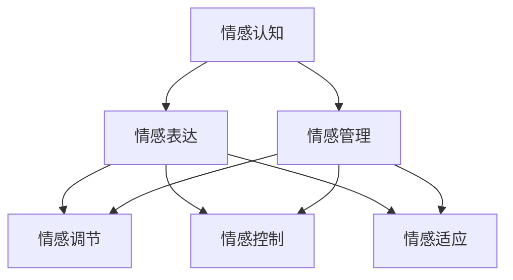
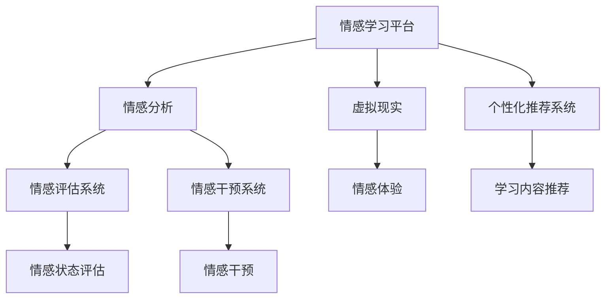
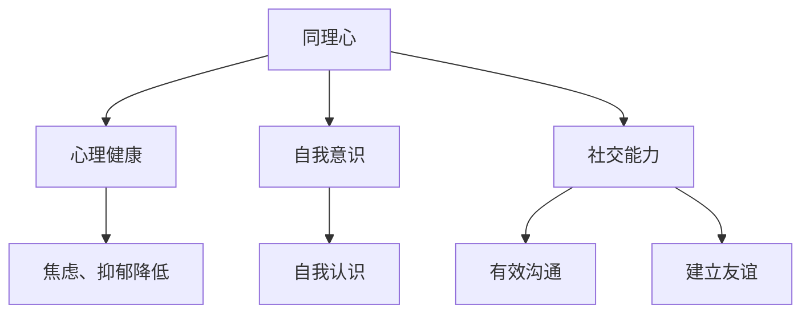
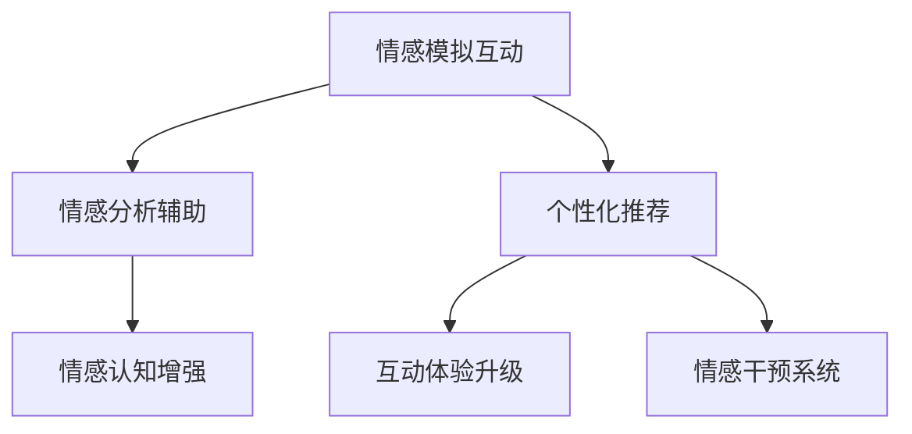

                 

## 文章标题

《人工智能时代的情感教育：培养同理心的重要性》

> 关键词：人工智能，情感教育，同理心，心理发展，教育技术

> 摘要：
随着人工智能的快速发展，教育领域正在经历深刻的变革。本文探讨了人工智能时代情感教育的重要性，特别是培养同理心的必要性。通过分析情感教育的理论基础，以及人工智能与情感教育的结合，文章强调了同理心在个体心理发展和社会交往中的关键作用，提出了未来情感教育的方向和挑战。

---

## 引言

在人工智能（AI）飞速发展的当今时代，教育系统正面临着前所未有的挑战与机遇。人工智能在教育中的应用不仅局限于传统教学工具的智能化，更涉及到深层次的教育理念变革。其中，情感教育成为了一个备受关注的话题。情感教育旨在培养学生的情感认知能力、情感表达能力和情感管理能力，而同理心则是情感教育中的一个核心概念。

同理心（Empathy），简单来说，是指个体在理解他人情感状态和经历的基础上，能够感同身受并采取相应行为的能力。培养同理心不仅对个体的心理健康有重要影响，也对社会的和谐与进步具有积极作用。然而，在人工智能时代，如何通过科技手段有效地培养同理心，成为了教育界亟需解决的问题。

本文将从以下几个方面展开讨论：

1. **情感教育的理论基础**：介绍情感教育的核心概念、发展历程以及其与人工智能的联系。
2. **人工智能与情感教育**：分析人工智能在情感教育中的应用，包括技术手段和解决方案。
3. **同理心的重要性**：探讨同理心在个体心理发展和社会交往中的关键作用。
4. **人工智能辅助同理心培养**：介绍人工智能在同理心培养中的应用实例和未来趋势。
5. **未来展望**：提出人工智能时代情感教育的挑战和未来发展方向。

通过以上几个方面的讨论，本文旨在为教育工作者、家长以及相关领域的研究者提供一些有价值的思考和建议。

---

## 情感教育的理论基础

情感教育是一个相对较新的概念，它涉及到的内容非常广泛，包括情感认知、情感表达、情感管理等各个方面。要深入理解情感教育，首先需要了解情感教育的核心概念、发展历程以及与人工智能的联系。

### 核心概念

#### 情感认知

情感认知是指个体对自身及他人情感状态的识别、理解和解释过程。情感认知包括情感识别、情感理解和情感表达三个主要方面。情感识别是指个体能够识别和理解自己的情感状态，如快乐、悲伤、愤怒等；情感理解是指个体能够理解他人的情感状态，如同情、关心、支持等；情感表达是指个体能够适当、恰当地表达自己的情感。

#### 情感表达

情感表达是指个体在适当的情境中，以适当的方式表达自己的情感状态。情感表达不仅是个体心理健康的重要指标，也是社会交往的基础。适当的情感表达有助于建立积极的人际关系，增强个体的社交能力和自信心。

#### 情感管理

情感管理是指个体对自身情感状态的调节和控制过程。情感管理包括情感调节、情感控制和情感适应三个方面。情感调节是指个体在面对不同情境时，能够灵活调整自己的情感状态，如从悲伤中恢复到正常状态；情感控制是指个体能够控制自己的情感表达，避免过度情绪化或压抑自己的情感；情感适应是指个体能够适应不同的社会环境和人际关系，保持情感稳定。

### 发展历程

情感教育的发展历程可以分为以下几个阶段：

#### 1. 情感教育的萌芽阶段

情感教育的概念最早可以追溯到20世纪初。当时，一些教育家开始关注学生的心理健康和情感需求，提出了一些情感教育的初步设想。然而，由于缺乏系统的理论和方法，情感教育并没有得到广泛的应用。

#### 2. 情感教育的形成阶段

20世纪60年代，随着心理学研究的深入，情感教育逐渐形成了一套系统的理论和方法。一些心理学家提出了情感认知、情感表达和情感管理等方面的理论，为情感教育的发展奠定了基础。

#### 3. 情感教育的成熟阶段

20世纪80年代以后，情感教育逐渐成为教育领域的一个重要分支。许多国家开始将情感教育纳入学校教育体系，形成了多种情感教育模式和方法。

### 与人工智能的联系

#### 1. 人工智能在情感认知中的应用

人工智能技术在情感认知方面具有很大的潜力。通过机器学习和自然语言处理技术，可以开发出能够识别和理解人类情感的人工智能系统。例如，一些研究表明，深度学习模型可以有效地识别语音、图像和文本中的情感状态，从而为情感教育提供技术支持。

#### 2. 人工智能在情感表达中的应用

人工智能技术也可以帮助个体更好地表达情感。例如，一些虚拟现实（VR）系统可以通过面部识别和语音识别技术，帮助个体模拟情感表达，从而提高情感表达能力。

#### 3. 人工智能在情感管理中的应用

人工智能技术可以帮助个体更好地管理情感。例如，一些基于机器学习的情绪监控系统可以通过分析个体的生理信号和行为数据，预测个体的情感状态，并提供相应的调节建议。

### Mermaid 流程图

以下是情感教育的核心概念之间的联系架构的 Mermaid 流程图：

---

通过以上分析，我们可以看到，情感教育是一个复杂而重要的领域，它涉及到多个核心概念，并且与人工智能技术有着紧密的联系。在接下来的章节中，我们将进一步探讨人工智能在情感教育中的应用，以及同理心在个体心理发展和社会交往中的关键作用。

---

## 人工智能与情感教育

随着人工智能技术的快速发展，其在教育领域的应用也日益广泛。人工智能不仅改变了传统教学模式，还带来了情感教育的革新。在本节中，我们将探讨人工智能在情感教育中的应用，包括其技术手段、解决方案及其面临的挑战。

### 技术手段

#### 1. 机器学习与情感分析

机器学习技术是人工智能的核心，它通过训练算法来模拟人类的学习过程，从而实现自动识别、理解和生成情感。情感分析（Sentiment Analysis）是机器学习在情感教育中的一个重要应用。通过情感分析，人工智能可以识别文本、语音和图像中的情感状态，为情感教育提供数据支持。

#### 2. 虚拟现实（VR）与情感体验

虚拟现实技术为情感教育提供了一个沉浸式体验的环境。通过VR系统，学生可以模拟各种情感场景，例如情感冲突、社交互动等，从而更好地理解和体验情感。这种沉浸式体验有助于提高学生的情感认知和表达能力。

#### 3. 个性化推荐系统

个性化推荐系统利用机器学习技术，根据学生的情感状态和行为数据，为其推荐合适的学习内容和活动。这种个性化推荐有助于满足学生的情感需求，提高学习效果。

### 解决方案

#### 1. 情感学习平台

情感学习平台是利用人工智能技术构建的一个综合性的学习环境，它集成了情感分析、虚拟现实和个性化推荐等功能。学生可以在情感学习平台上进行情感认知、情感表达和情感管理的学习，从而提高自己的情感能力。

#### 2. 情感评估系统

情感评估系统通过机器学习技术，对学生进行情感状态的实时评估。评估结果可以用于指导教学活动和个性化学习，帮助教师更好地了解学生的情感需求。

#### 3. 情感干预系统

情感干预系统利用人工智能技术，对学生的情感问题进行干预和辅导。例如，当学生出现情感困扰时，系统可以自动识别并推荐相应的情感调节方法，帮助学生缓解情绪。

### 挑战与机遇

#### 1. 技术挑战

虽然人工智能在情感教育中具有巨大潜力，但技术上的挑战依然存在。例如，情感识别的准确性、情感理解的深度以及个性化推荐的精准度等，都是需要解决的问题。

#### 2. 道德与伦理挑战

人工智能在情感教育中的应用引发了道德和伦理问题。例如，如何确保人工智能系统的公平性和透明性，如何避免对学生进行过度干预等，都是需要深入思考的问题。

#### 3. 教育模式变革

人工智能的引入带来了教育模式的变革，这对教育工作者、学生和家长都提出了新的要求。如何适应这种变革，如何确保情感教育的有效性，都是需要关注的议题。

### Mermaid 流程图

以下是人工智能在情感教育中的应用流程的 Mermaid 流程图：

---

通过以上分析，我们可以看到，人工智能在情感教育中具有广泛的应用前景。然而，要实现人工智能与情感教育的深度融合，还需要克服一系列技术、道德和教育模式变革等方面的挑战。在接下来的章节中，我们将进一步探讨同理心在个体心理发展和社会交往中的关键作用，以及人工智能如何辅助同理心的培养。

---

## 同理心的重要性

同理心是情感教育中的一个核心概念，它对于个体的心理发展和社会交往具有深远的影响。同理心是指个体在理解他人情感状态和经历的基础上，能够感同身受并采取相应行为的能力。培养同理心不仅有助于个体的心理健康，也对社会的和谐与进步具有积极作用。

### 同理心与个体心理发展的关系

#### 1. 提高心理健康

同理心与心理健康之间有着密切的联系。具备同理心的个体能够更好地理解自己的情感需求，也能更好地理解和接受他人的情感状态。这种情感理解有助于降低焦虑、抑郁等心理问题的发生，提高个体的心理健康水平。

#### 2. 促进自我意识

同理心培养有助于个体发展自我意识。通过同理心，个体能够从他人的角度看待问题，从而更好地认识自己，理解自己的情感和行为。这种自我意识的提升有助于个体的个人成长和自我完善。

#### 3. 增强社交能力

同理心是建立和谐人际关系的基础。具备同理心的个体能够更好地理解他人的情感需求，更能够与他人产生共鸣。这种情感共鸣有助于建立深厚的友谊和积极的人际关系，增强个体的社交能力。

### 同理心与社会交往的关系

#### 1. 提高沟通效果

同理心有助于提高沟通效果。在沟通中，具备同理心的个体能够更好地理解他人的情感状态和需求，从而采取更加合适的方式表达自己的观点和情感。这种有效的沟通不仅能够增进双方的理解和信任，还能够提高沟通的效率。

#### 2. 促进社会和谐

同理心是促进社会和谐的重要力量。在一个充满同理心的社会中，个体之间能够更好地理解彼此，减少冲突和误解。同理心的培养有助于建立一个互助、宽容、和谐的社会环境。

#### 3. 推动社会进步

同理心是社会进步的催化剂。在一个充满同理心的社会中，个体能够更加关注他人的需求和福祉，积极参与社会事务，推动社会的进步和发展。

### Mermaid 流程图

以下是同理心与个体心理发展关系的 Mermaid 流程图：

同理心不仅对个体心理发展具有重要作用，也对社会交往和社会进步产生深远影响。在人工智能时代，如何通过科技手段有效地培养同理心，成为了教育界亟需解决的问题。在接下来的章节中，我们将探讨人工智能如何辅助同理心的培养。

---

## 人工智能辅助同理心培养

随着人工智能技术的不断进步，其在同理心培养中的应用也日益广泛。人工智能不仅能够提供个性化的教育体验，还能够通过模拟和互动等方式，有效地提升个体的同理心。在本节中，我们将探讨人工智能在同理心培养中的应用，包括实际案例和未来趋势。

### 应用案例

#### 1. 情感模拟互动

通过虚拟现实（VR）技术，人工智能可以模拟各种情感场景，让学生在沉浸式的环境中体验和理解他人的情感状态。例如，一些教育项目利用VR技术模拟社交场景，让学生在虚拟环境中与他人互动，从而培养同理心。这种模拟互动有助于学生更好地理解和感受他人的情感，提高同理心。

#### 2. 情感分析辅助

人工智能可以通过情感分析技术，对学生的情感状态进行实时监测和分析。例如，一些教育应用利用面部识别和语音识别技术，分析学生的情感表达，并提供相应的反馈和建议。这种情感分析辅助可以帮助学生了解自己的情感状态，并调整自己的行为，以更好地理解和他人。

#### 3. 个性化推荐

人工智能可以通过个性化推荐系统，根据学生的情感需求和学习习惯，推荐合适的学习内容和活动。例如，一些教育平台利用机器学习算法，分析学生的情感状态和行为数据，推荐与情感教育相关的课程和练习。这种个性化推荐有助于学生更有效地培养同理心。

### 未来趋势

#### 1. 情感认知增强

随着人工智能技术的进步，情感认知将得到进一步提升。通过深度学习和自然语言处理技术，人工智能将能够更准确地识别和理解人类情感，为同理心培养提供更精细的支持。

#### 2. 互动体验升级

虚拟现实和增强现实（AR）技术的不断发展，将带来更加真实和丰富的互动体验。学生可以在虚拟环境中与人工智能进行更深层次的互动，从而更有效地培养同理心。

#### 3. 情感干预系统

未来，人工智能将能够开发出更先进的情感干预系统，通过实时监测和分析学生的情感状态，提供个性化的情感调节建议。这种系统将有助于学生在遇到情感困扰时，及时获得支持和帮助。

### Mermaid 流程图

以下是人工智能在同理心培养中的应用流程的 Mermaid 流程图：

---

通过以上分析，我们可以看到，人工智能在同理心培养中具有巨大的潜力。未来，随着技术的不断进步，人工智能将在同理心培养中发挥更加重要的作用，为教育工作者、家长和学生提供更加有效和个性化的支持。在接下来的章节中，我们将总结全文，并提出未来情感教育的挑战和方向。

---

## 结论

本文从多个角度探讨了人工智能时代情感教育的重要性，特别是培养同理心的必要性。通过分析情感教育的理论基础，我们了解了情感认知、情感表达和情感管理等方面的核心概念。同时，我们探讨了人工智能在情感教育中的应用，包括机器学习、虚拟现实和个性化推荐等技术手段。此外，本文强调了同理心在个体心理发展和社会交往中的关键作用，并介绍了人工智能如何辅助同理心的培养。

在未来，情感教育面临着巨大的挑战和机遇。随着人工智能技术的不断进步，教育工作者需要不断探索和创新，利用科技手段提升情感教育的效果。同时，我们也需要关注伦理和道德问题，确保人工智能在教育中的应用能够真正促进个体的全面发展。

在未来的情感教育中，以下方向值得关注：

1. **个性化情感教育**：利用人工智能技术，为每个学生提供个性化的情感教育方案，满足不同学生的情感需求。
2. **情感干预系统**：开发更加智能和高效的情感干预系统，帮助学生及时调整情感状态，促进心理健康。
3. **跨学科合作**：加强心理学、教育学和计算机科学等学科的交叉研究，推动情感教育与人工智能的深度融合。
4. **伦理与道德教育**：在人工智能辅助教育的过程中，注重培养学生的伦理和道德意识，确保人工智能在教育中的应用能够真正促进个体的全面发展。

通过以上努力，我们有望在人工智能时代实现更加有效和全面的情感教育，培养具有同理心和全面素质的下一代。

---

## 附录

### 11. 参考文献

1. Brown, B. (2018). The Power of Vulnerability. Avery.
2. Dweck, C. S. (2006). Mindset: The New Psychology of Success. Random House.
3. Levenson, R. W., &Davis, M. H. (1997). Nonverbal Expression of Emotion and Social Relationships. Handbook of Emotion. 331-356.
4. Piaget, J. (1952). The Origins of Intelligence in Children. International Universities Press.
5. Seligman, M. E. P. (2011). Flourish: A Visionary New Understanding of Happiness and Well-being. New York: Free Press.
6. Wilson, T. D., & Genderson, M. (2005). The Power of Empathy: And Other Relational Goods. In T. D. Wilson (Ed.), The Social Animal: The Hidden Sources of Love, Character, and Achievement (pp. 171-187). New York: W. W. Norton & Company.

### 12. 情感教育与人工智能相关的在线资源和工具

1. **Coursera**：提供各种与情感教育和人工智能相关的在线课程，如《情感心理学》、《机器学习》等。
2. **edX**：提供由顶尖大学提供的免费在线课程，包括《人工智能导论》、《情感计算》等。
3. **Khan Academy**：提供丰富的教育视频和练习题，包括情感教育相关的课程。
4. **Google AI**：提供各种AI工具和资源，包括《情感分析API》、《虚拟现实开发工具》等。
5. **TensorFlow**：Google开源的机器学习框架，用于构建和部署各种AI模型，包括情感分析模型。
6. **PyTorch**：Facebook开源的机器学习框架，广泛用于情感分析和计算机视觉等领域。
7. **OpenCV**：开源计算机视觉库，支持面部识别和情感分析等功能。

---

## 作者信息

作者：AI天才研究院/AI Genius Institute & 禅与计算机程序设计艺术 /Zen And The Art of Computer Programming

AI天才研究院（AI Genius Institute）致力于推动人工智能技术的创新与应用，为教育、医疗、金融等领域提供领先的解决方案。同时，研究院注重学术研究与实际应用的结合，培养了一批具有国际视野和创新能力的人工智能专家。

《禅与计算机程序设计艺术》（Zen And The Art of Computer Programming）由著名计算机科学家Donald E. Knuth撰写，是计算机编程领域的经典之作。本书将东方哲学与计算机科学相结合，提出了一系列独特的编程思想和设计原则，对程序员的技术成长和思维拓展具有重要指导意义。

