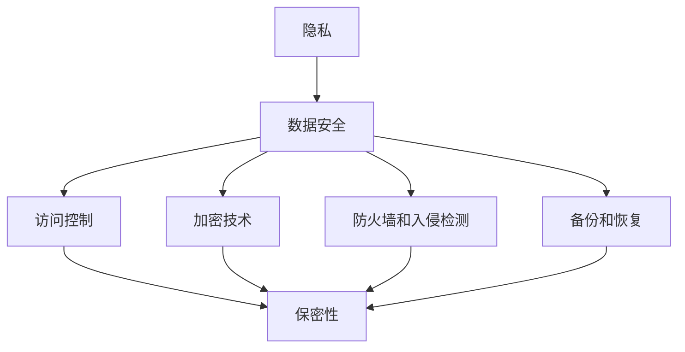

                 


### 文章标题
《人工智能时代的隐私保护：个人数据安全的新挑战》

### 关键词
隐私保护、人工智能、数据安全、隐私计算、同态加密、加密技术

### 摘要
在人工智能迅速发展的背景下，个人数据安全面临着前所未有的挑战。本文将探讨人工智能时代隐私保护的核心问题，分析隐私与数据安全的基本概念，介绍隐私保护的技术手段，探讨人工智能与隐私保护的关联，并阐述隐私保护在法律法规和实际应用中的重要性。通过深入剖析核心算法原理和实践案例，本文旨在为读者提供一个全面、系统的隐私保护指南。

---

# 引言

随着人工智能（AI）技术的飞速发展，个人数据的收集、存储和使用变得越来越普遍。人工智能依赖于大量数据来训练模型，提高其准确性和性能。然而，这也带来了隐私保护的新挑战。个人数据被视为宝贵的资源，其泄露或滥用可能导致严重的后果，包括身份盗窃、隐私侵犯和经济损失。

在人工智能时代，隐私保护不仅仅是技术问题，更是一个法律、伦理和社会问题。随着越来越多的数据被收集和存储，数据泄露事件也频繁发生。例如，2017年的Facebook剑桥分析事件暴露了数百万用户的个人信息被不当使用。这类事件引起了公众对隐私保护的广泛关注，也促使各国政府和组织加强隐私保护法规的制定和执行。

本文将围绕人工智能时代的隐私保护展开讨论，首先介绍隐私与数据安全的基本概念，然后分析人工智能对隐私的影响，探讨隐私保护的技术手段，并分析隐私保护的法律法规和实际应用。最后，我们将总结面临的挑战和未来的发展趋势，为隐私保护提供一些最佳实践和展望。

## 背景介绍

隐私保护的重要性在人工智能时代被进一步凸显，原因如下：

1. **数据依赖性**：人工智能系统依赖于大量数据来训练和优化其模型。这些数据往往包含用户的个人信息，如姓名、地址、电话号码、社交媒体活动等。数据的依赖性使得隐私保护成为一个至关重要的问题。

2. **数据泄露风险**：随着数据收集和存储的增加，数据泄露的风险也随之增加。数据泄露可能导致个人隐私被滥用，甚至导致经济损失和社会问题。例如，未经授权访问用户数据、数据泄露和黑客攻击等都可能对个人隐私造成严重威胁。

3. **隐私侵犯**：人工智能系统在使用个人数据时，可能无意中侵犯用户的隐私。例如，通过分析社交媒体数据来预测个人偏好、情感状态或健康状况，这可能导致用户隐私的泄露。

4. **伦理和社会问题**：随着人工智能技术的发展，隐私侵犯的问题引起了公众的广泛关注。人们担忧，人工智能系统可能会被用来进行监控、歧视和操纵。这些问题不仅涉及个人隐私，还涉及伦理和社会公平性。

5. **法律法规的挑战**：各国政府和组织对隐私保护日益重视，制定了一系列法律法规来规范数据收集、存储和使用。然而，这些法律法规在应对快速发展的技术挑战时，往往显得滞后和不足。例如，GDPR（欧盟通用数据保护条例）在保护个人数据方面做出了许多创新，但其在全球范围内的适用性仍然是一个挑战。

总之，隐私保护在人工智能时代不仅是技术问题，还涉及法律、伦理和社会问题。随着技术的不断发展，隐私保护面临的挑战日益复杂，需要多方共同努力来解决。

## 核心概念与联系

隐私保护和数据安全是两个密切相关但有所区别的核心概念。理解这两个概念之间的关系，对于解决人工智能时代的隐私保护问题至关重要。

### 隐私

隐私通常被定义为个人对其个人信息的控制权，包括谁可以访问、使用和共享这些信息。隐私的定义涉及多个方面，包括信息的保密性、完整性、可用性和可访问性。以下是隐私的主要特征：

1. **保密性**：确保个人信息不会被未授权的个人或组织访问。
2. **完整性**：确保个人信息不会被未经授权的修改或篡改。
3. **可用性**：确保个人信息在需要时可以被授权的个人或组织访问。
4. **可访问性**：确保个人信息可以被授权的个人或组织在适当的情况下访问。

### 数据安全

数据安全则更侧重于保护数据免受未经授权的访问、使用、披露、破坏、修改或破坏。数据安全的目的是确保数据的保密性、完整性和可用性。以下是数据安全的主要特征：

1. **访问控制**：通过身份验证和授权机制，确保只有授权用户可以访问数据。
2. **加密技术**：使用加密算法来保护数据的保密性和完整性。
3. **防火墙和入侵检测**：通过设置防火墙和入侵检测系统，防止外部攻击和数据泄露。
4. **备份和恢复**：定期备份数据，确保在数据丢失或损坏时可以恢复。

### 隐私与数据安全的关系

隐私与数据安全是相互依赖的，隐私保护依赖于数据安全技术的实施。例如，加密技术可以确保数据的保密性，访问控制可以确保只有授权用户可以访问数据。以下是一个简化的Mermaid流程图，展示了隐私保护和数据安全之间的关系：



在这个流程图中，隐私（A）依赖于数据安全（B），而数据安全则通过多种技术手段（C、D、E、F）来实现保密性（G）。这些技术手段共同确保个人数据的隐私和保护。

总之，隐私保护和数据安全是人工智能时代隐私保护的两个核心概念，它们相互关联、相互支持。理解这两个概念之间的关系，对于设计有效的隐私保护策略至关重要。

## 核心算法原理讲解

在人工智能时代，隐私保护的关键技术包括数据加密、隐私计算和同态加密。以下是对这些技术的核心算法原理讲解，以及相应的伪代码和数学模型。

### 数据加密

数据加密是保护数据隐私的基本手段，通过将数据转换为不可读的密文，确保数据在传输和存储过程中的安全。最常用的加密算法是AES（高级加密标准）和RSA（Rivest-Shamir-Adleman）。

#### AES加密算法

AES是一种对称加密算法，使用128、192或256位密钥对数据进行加密和解密。以下是AES加密的伪代码：

```plaintext
function AES_Encrypt(plaintext, key):
    // 初始化加密密钥
    cipher_key = InitializeCipherKey(key)
    // 进行加密迭代
    ciphertext = EncryptIteration(plaintext, cipher_key)
    return ciphertext
```

#### RSA加密算法

RSA是一种非对称加密算法，使用一对密钥（公钥和私钥）进行加密和解密。以下是RSA加密的伪代码：

```plaintext
function RSA_Encrypt(plaintext, public_key):
    // 使用公钥加密数据
    ciphertext = EncryptWithPublicKey(plaintext, public_key)
    return ciphertext
```

### 隐私计算

隐私计算是指在数据处理过程中保护数据隐私的技术，包括安全多方计算（SMPC）、差分隐私和同态加密。以下是隐私计算的基本原理和伪代码。

#### 安全多方计算（SMPC）

安全多方计算允许多个参与方在不泄露各自私有数据的情况下共同计算结果。以下是SMPC的伪代码：

```plaintext
function SecureTwoPartyComputation(A, B):
    // 分享秘密共享方案
    A SharesData(A_data)
    B SharesData(B_data)
    // 计算共享数据的和
    result = ComputeSharedSum(A_data, B_data)
    return result
```

#### 差分隐私

差分隐私是一种在数据分析中保护个人隐私的技术，通过引入噪声来隐藏数据的真实分布。以下是差分隐私的伪代码：

```plaintext
function DifferentialPrivacy(Data, Alpha):
    // 添加噪声
    noisy_data = AddNoise(Data, Alpha)
    // 进行分析
    result = AnalyzeData(noisy_data)
    return result
```

### 同态加密

同态加密允许在加密数据上直接执行计算，而不需要解密数据。这种加密方式特别适用于云计算环境，以下是同态加密的伪代码：

```plaintext
function HomomorphicEncryption(plaintext, key):
    // 将数据加密
    ciphertext = EncryptData(plaintext, key)
    // 在密文中进行计算
    result = ComputeInCipherSpace(ciphertext)
    // 解密结果
    decrypted_result = DecryptData(result, key)
    return decrypted_result
```

### 数学模型和公式

隐私保护和数据安全中的数学模型和公式主要用于描述加密算法和隐私计算中的算法性能。以下是几个关键的数学模型和公式：

#### 加密算法性能

加密算法的性能通常用比特长度和加密速度来衡量。加密算法的安全性随着比特长度的增加而增强，但也会导致加密速度的降低。

$$\text{Performance} = \frac{\text{BitLength}}{\text{EncryptionSpeed}}$$

#### 安全多方计算性能

安全多方计算的性能受参与方数量和通信成本的影响。性能优化通常涉及减少通信次数和计算复杂度。

$$\text{Performance} = \frac{\text{TotalCommunication}}{\text{TotalComputation}}$$

#### 差分隐私性能

差分隐私的性能通过ε参数来衡量，ε值越小，隐私保护越强，但可能会影响数据分析的准确性。

$$\text{Privacy} = \epsilon$$

#### 同态加密性能

同态加密的性能受加密算法的复杂度和计算能力的影响。优化同态加密算法的目标是减少计算复杂度和提高加密速度。

$$\text{Performance} = \frac{\text{EncryptionComplexity}}{\text{DecryptionComplexity}}$$

通过上述核心算法原理讲解、伪代码和数学模型，我们可以更好地理解隐私保护的技术手段。这些技术不仅为保护个人数据提供了强有力的工具，也为人工智能时代的隐私保护提供了理论基础。

## 隐私保护的技术手段

在人工智能时代，隐私保护面临诸多挑战，需要采用一系列先进的技术手段来应对。以下介绍几种关键的技术手段：数据加密、隐私计算、同态加密和安全多方计算。

### 数据加密

数据加密是保护数据隐私的基本手段，通过将数据转换为不可读的密文，确保数据在传输和存储过程中的安全。常用的加密算法包括AES（高级加密标准）和RSA（Rivest-Shamir-Adleman）。

1. **AES加密**：
   AES是一种对称加密算法，使用128、192或256位密钥对数据进行加密和解密。其优点是加密速度快，适合大规模数据的加密处理。以下是AES加密的伪代码：

   ```plaintext
   function AES_Encrypt(plaintext, key):
       // 初始化加密密钥
       cipher_key = InitializeCipherKey(key)
       // 进行加密迭代
       ciphertext = EncryptIteration(plaintext, cipher_key)
       return ciphertext
   ```

2. **RSA加密**：
   RSA是一种非对称加密算法，使用一对密钥（公钥和私钥）进行加密和解密。公钥用于加密，私钥用于解密。以下是RSA加密的伪代码：

   ```plaintext
   function RSA_Encrypt(plaintext, public_key):
       // 使用公钥加密数据
       ciphertext = EncryptWithPublicKey(plaintext, public_key)
       return ciphertext
   ```

### 隐私计算

隐私计算是指在进行数据处理时保护数据隐私的技术，包括安全多方计算（SMPC）、差分隐私和同态加密。

1. **安全多方计算（SMPC）**：
   安全多方计算允许多个参与方在不泄露各自私有数据的情况下共同计算结果。其关键在于共享秘密方案和通信协议的设计。以下是SMPC的伪代码：

   ```plaintext
   function SecureTwoPartyComputation(A, B):
       // 分享秘密共享方案
       A SharesData(A_data)
       B SharesData(B_data)
       // 计算共享数据的和
       result = ComputeSharedSum(A_data, B_data)
       return result
   ```

2. **差分隐私**：
   差分隐私是一种在数据分析中保护个人隐私的技术，通过引入噪声来隐藏数据的真实分布。其核心在于ε参数的设计，ε值越小，隐私保护越强，但可能会影响数据分析的准确性。以下是差分隐私的伪代码：

   ```plaintext
   function DifferentialPrivacy(Data, Alpha):
       // 添加噪声
       noisy_data = AddNoise(Data, Alpha)
       // 进行分析
       result = AnalyzeData(noisy_data)
       return result
   ```

3. **同态加密**：
   同态加密允许在加密数据上直接执行计算，而不需要解密数据。这种加密方式特别适用于云计算环境。以下是同态加密的伪代码：

   ```plaintext
   function HomomorphicEncryption(plaintext, key):
       // 将数据加密
       ciphertext = EncryptData(plaintext, key)
       // 在密文中进行计算
       result = ComputeInCipherSpace(ciphertext)
       // 解密结果
       decrypted_result = DecryptData(result, key)
       return decrypted_result
   ```

### 同态加密

同态加密是一种在加密数据上进行计算的方法，不需要解密数据。这使得它在处理敏感数据时具有显著优势，特别是在云计算环境中。同态加密的核心在于对数据加密后进行算术操作，确保结果的正确性和数据的隐私。

1. **算术同态加密**：
   算术同态加密允许在加密数据上执行基本的算术运算，如加法和乘法。例如，对于加密的数字a和b，可以计算出它们在密文空间中的和或积。以下是算术同态加密的伪代码：

   ```plaintext
   function HomomorphicAdd(ciphertext_a, ciphertext_b, key):
       // 将密文a和密文b相加
       ciphertext_sum = AddCipherTexts(ciphertext_a, ciphertext_b)
       // 解密结果
       decrypted_result = DecryptData(ciphertext_sum, key)
       return decrypted_result

   function HomomorphicMultiply(ciphertext_a, ciphertext_b, key):
       // 将密文a和密文b相乘
       ciphertext_product = MultiplyCipherTexts(ciphertext_a, ciphertext_b)
       // 解密结果
       decrypted_result = DecryptData(ciphertext_product, key)
       return decrypted_result
   ```

2. **基于格的同态加密**：
   基于格的同态加密是现代加密领域的一种重要进展，它允许在加密数据上执行更复杂的操作，如线性变换和深度神经网络计算。基于格的同态加密具有较高的安全性，并且能够处理大规模数据。以下是基于格的同态加密的伪代码：

   ```plaintext
   function LatticeBasedHomomorphicEncryption(plaintext, key):
       // 将明文加密为格上的向量
       lattice_vector = EncryptToLattice(plaintext, key)
       // 在格上进行计算
       result_vector = ComputeInLattice(lattice_vector)
       // 解密结果
       decrypted_result = DecryptFromLattice(result_vector, key)
       return decrypted_result
   ```

通过这些技术手段，隐私保护在人工智能时代得到了有效实施。数据加密、隐私计算、同态加密和安全多方计算共同构成了一个强大的隐私保护体系，为个人数据安全提供了坚实保障。

## 隐私保护的法律法规

隐私保护不仅仅是一个技术问题，也是一个法律问题。随着人工智能技术的发展，个人数据的收集、存储和使用变得越来越普遍，各国政府和国际组织也逐步制定了一系列隐私保护法律法规，以规范数据收集和使用行为，保护个人隐私。

### 全球隐私保护法律框架

在全球范围内，以下几个地区的隐私保护法律法规具有代表性：

1. **欧盟的GDPR（通用数据保护条例）**：
   GDPR是欧洲最具影响力的隐私保护法规，自2018年5月25日生效。GDPR规定了个人数据的处理原则、用户权利和数据控制者的义务，强调用户对个人数据的控制权。GDPR的核心原则包括合法性、公平性、透明性、数据最小化、数据完整性、保密性和责任性。

2. **美国的CCPA（加利福尼亚州消费者隐私法案）**：
   CCPA是美国的州级隐私保护法案，于2020年1月1日生效。CCPA赋予加州居民更多的数据控制权，包括访问、删除和拒绝出售个人信息等权利。CCPA还规定了企业的数据保护义务，并对违反规定的企业实施严厉的罚款。

3. **中国的个人信息保护法（PIPL）**：
   中国的个人信息保护法（PIPL）于2021年11月1日正式实施。PIPL明确了个人信息的定义和处理原则，规定了个人信息处理者的义务和用户的权利。PIPL强调个人信息的合法、正当、必要原则，并设立了一整套数据处理规范。

### 国际隐私保护标准与认证

除了国家和地区的法律法规，国际隐私保护标准与认证也为隐私保护提供了重要参考。以下是一些重要的国际隐私保护标准和认证：

1. **ISO/IEC 27001**：
   ISO/IEC 27001是国际标准化组织（ISO）和国际电工委员会（IEC）发布的关于信息安全管理的国际标准。它提供了一个全面的信息安全管理框架，帮助企业建立、实施、维护和持续改进信息安全管理系统。

2. **ISO/IEC 29100**：
   ISO/IEC 29100是关于隐私信息管理的国际标准，提供了隐私信息管理系统的设计和实施指南。该标准涵盖了隐私保护的全过程，包括隐私策略、隐私风险评估、隐私保护和隐私响应。

3. **隐私盾牌（Privacy Shield）**：
   隐私盾牌是一个旨在解决欧盟和美国之间数据转移问题的框架。它允许企业从欧盟向美国传输个人数据，同时遵守GDPR的要求。隐私盾牌于2016年推出，但由于一些法律争议，其有效性在2020年被暂停。

### 中国隐私保护法律体系

在中国，隐私保护的法律体系主要包括《网络安全法》、《个人信息保护法》和《数据安全法》。以下是这些法律的核心内容：

1. **《网络安全法》**：
   《网络安全法》于2017年6月1日正式实施，是中国网络安全领域的基础性法律。它规定了网络运营者的网络安全义务，包括网络安全风险评估、数据安全保护、网络监测和事件应对等。

2. **《个人信息保护法》**：
   《个人信息保护法》于2021年11月1日正式实施，是中国个人信息保护领域的重要法律。它明确了个人信息的定义和处理原则，规定了个人信息处理者的义务和用户的权利，包括知情权、决定权、访问权和删除权。

3. **《数据安全法》**：
   《数据安全法》于2021年9月1日正式实施，旨在加强数据安全保护，规范数据处理活动。它规定了数据安全保护的基本要求和原则，包括数据安全风险评估、数据安全防护、数据安全事件应对等。

通过这些隐私保护法律法规的制定和实施，各国政府和国际组织正在努力建立全面、系统的隐私保护框架，以应对人工智能时代的数据安全挑战。然而，隐私保护法律的制定和执行仍面临诸多挑战，需要在实践中不断完善和调整。

## 隐私保护的实际应用

隐私保护技术在各个领域得到了广泛应用，尤其是在医疗、金融和互联网领域。以下分别探讨这些领域中隐私保护的具体应用。

### 医疗领域

在医疗领域，个人健康数据的安全性和隐私保护至关重要。隐私保护技术可以帮助医疗机构在保证数据共享和访问的同时，确保患者隐私不被泄露。

1. **匿名化处理**：
   匿名化处理是医疗数据隐私保护的基本方法之一。通过删除或替换个人识别信息，如姓名、地址和电话号码，可以降低数据泄露的风险。匿名化处理技术包括K-anonymity和l-diversity等。

2. **同态加密**：
   同态加密技术在医疗数据隐私保护中具有显著优势。它允许在加密数据上进行计算和分析，从而避免了数据在传输和存储过程中的泄露风险。例如，同态加密可以用于医疗影像分析，确保患者在数据共享过程中的隐私得到保护。

3. **隐私计算**：
   隐私计算技术如安全多方计算（SMPC）和差分隐私，可以用于医疗数据的联合分析。医疗机构可以在不泄露各自数据的情况下，共同进行疾病预测和诊断。例如，多家医院可以使用SMPC技术共享患者数据，共同开发新的医疗算法。

### 金融领域

金融领域的数据隐私保护面临着巨大的挑战，因为金融交易数据涉及大量的敏感信息，如账户余额、交易记录和身份信息。隐私保护技术在金融领域的应用包括以下几个方面：

1. **加密技术**：
   加密技术是金融数据隐私保护的基础。通过使用AES和RSA等加密算法，可以确保金融交易数据在传输和存储过程中的安全。例如，HTTPS协议使用TLS/SSL加密技术，保护网上银行交易的安全性。

2. **同态加密**：
   同态加密在金融领域具有广泛应用。它可以用于大数据分析，帮助金融机构在确保数据隐私的同时，发现潜在的风险和欺诈行为。例如，同态加密可以用于分析信用卡交易数据，识别异常交易模式。

3. **隐私计算**：
   隐私计算技术在金融领域可以帮助金融机构进行数据共享和联合分析。例如，多个金融机构可以使用安全多方计算技术，共享客户数据，共同开发风险评估模型，同时保护各自数据的隐私。

### 互联网领域

互联网领域的数据隐私保护主要集中在用户个人信息的保护，如浏览历史、购物记录和社交媒体活动等。以下是一些具体的隐私保护应用：

1. **数据脱敏**：
   数据脱敏技术通过删除或替换敏感信息，降低数据泄露的风险。例如，在数据分析过程中，可以使用伪名替换真实用户名，从而保护用户隐私。

2. **隐私计算**：
   隐私计算技术可以帮助互联网公司在不泄露用户隐私的情况下，进行个性化推荐和广告投放。例如，使用差分隐私技术，可以对用户数据进行匿名化处理，同时保留数据分析的准确性。

3. **区块链技术**：
   区块链技术通过分布式账本和加密算法，提供了一种去中心化的数据存储和共享方式。它可以在确保数据隐私的同时，提高数据的透明度和可追溯性。例如，区块链可以用于记录用户数据的使用和访问权限，从而保护用户隐私。

通过在医疗、金融和互联网领域的广泛应用，隐私保护技术为个人数据安全提供了强有力的保障。随着技术的不断进步，隐私保护将在更多领域中发挥关键作用。

## 隐私保护的挑战与未来展望

在人工智能时代，隐私保护面临着诸多挑战，同时也展现出了巨大的发展潜力。以下是当前隐私保护面临的主要挑战和未来展望。

### 挑战

1. **技术挑战**：
   隐私保护技术的复杂性不断增加，特别是在处理大规模数据和高维数据时，传统加密算法和隐私计算技术的性能和效率面临挑战。例如，同态加密在处理复杂数学运算时，计算复杂度较高，影响了其在实际应用中的实用性。

2. **法律挑战**：
   隐私保护法律法规的滞后性和地域差异性，使得隐私保护在跨国数据和跨境数据传输中面临困难。不同国家和地区的隐私保护法律框架存在差异，导致数据合规性管理复杂。

3. **伦理挑战**：
   隐私侵犯和数据分析可能引发伦理问题，例如，数据歧视和隐私操纵。人工智能系统在处理个人数据时，可能无意中侵犯用户隐私，引发伦理争议。

4. **安全挑战**：
   隐私保护技术的安全漏洞和攻击手段层出不穷，例如，量子计算可能对现有加密算法构成威胁，网络攻击和数据泄露事件也不断发生。

### 未来展望

1. **技术创新**：
   未来隐私保护技术的发展将依赖于新型算法和技术的突破。例如，基于量子计算的加密算法和隐私计算技术，有望提供更高的安全性和效率。

2. **跨学科融合**：
   隐私保护需要跨学科的合作，结合计算机科学、数学、法律和伦理学等多领域的知识，共同研究和解决隐私保护问题。

3. **法律法规的完善**：
   随着技术的进步，隐私保护法律法规也将逐步完善，以应对新的挑战。全球范围内，隐私保护法律的统一和协调将成为趋势。

4. **数据伦理的重视**：
   数据伦理将得到更多关注，隐私保护不仅在技术上，也在伦理和社会层面得到重视，推动建立更加公正和透明的人工智能生态系统。

总之，隐私保护在人工智能时代既是挑战也是机遇。通过技术创新、跨学科合作和法律法规的完善，隐私保护将迎来新的发展，为个人数据安全提供坚实保障。

## 最佳实践与未来趋势

在人工智能时代，隐私保护的最佳实践和技术创新至关重要。以下是一些具体的建议，以应对隐私保护面临的挑战：

### 最佳实践

1. **数据最小化原则**：
   在收集和处理个人数据时，遵循数据最小化原则，只收集必要的个人信息，减少数据泄露的风险。

2. **加密技术**：
   使用强加密算法对敏感数据进行加密，确保数据在传输和存储过程中的安全。建议使用AES和RSA等成熟可靠的加密算法。

3. **隐私计算**：
   采用隐私计算技术，如安全多方计算和差分隐私，在数据处理和分析过程中保护个人隐私。

4. **同态加密**：
   在云计算和大数据分析中，应用同态加密技术，允许在加密数据上进行计算，确保数据隐私的同时，提高数据处理效率。

5. **数据脱敏**：
   对敏感数据进行脱敏处理，如使用K-anonymity和l-diversity等技术，降低数据泄露风险。

### 未来趋势

1. **量子计算加密**：
   随着量子计算的发展，量子加密技术将提供更高的安全性能，有望成为隐私保护的重要手段。

2. **区块链技术**：
   区块链技术将在隐私保护中发挥更大作用，通过分布式账本和加密算法，提供透明、安全和不可篡改的数据存储和共享方式。

3. **人工智能与隐私保护**：
   未来，人工智能将与隐私保护技术深度融合，开发出更加智能、高效的隐私保护解决方案。

4. **全球隐私保护法规**：
   随着隐私保护意识的提升，全球范围内隐私保护法律法规将逐步统一和协调，提高数据合规性和跨国数据流通的安全性。

总之，隐私保护在人工智能时代既是挑战也是机遇。通过最佳实践和持续的技术创新，我们可以更好地应对隐私保护的新挑战，为个人数据安全提供坚实保障。

## 小结

本文围绕人工智能时代的隐私保护进行了深入探讨。首先，介绍了隐私保护在人工智能时代的背景和重要性，分析了隐私与数据安全的基本概念及其关系。接着，详细阐述了隐私保护的核心技术手段，包括数据加密、隐私计算、同态加密和安全多方计算。随后，探讨了隐私保护的法律法规以及其在医疗、金融和互联网领域的实际应用。最后，分析了隐私保护面临的挑战和未来趋势，并提出了最佳实践建议。

隐私保护不仅是技术问题，还涉及法律、伦理和社会问题。随着人工智能技术的发展，隐私保护的重要性将日益凸显。通过技术创新、跨学科合作和法律法规的完善，我们有望构建一个更加安全、透明和公平的人工智能生态系统，为个人数据安全提供坚实保障。

## 注意事项与拓展阅读

在实施隐私保护策略时，需要特别注意以下几个方面：

1. **数据收集与使用权限**：确保在收集和使用个人数据时，遵守法律法规和用户同意。

2. **加密算法的安全性**：选择可靠的加密算法，并定期更新密钥，以防止加密被破解。

3. **数据隐私审计**：定期进行数据隐私审计，识别潜在的隐私风险，并采取相应的改进措施。

4. **用户知情权与控制权**：确保用户对其个人数据的知情权和控制权，提供透明且易于理解的数据使用政策。

5. **多方合作**：隐私保护需要多方合作，包括技术专家、法律顾问和用户代表，共同制定和实施隐私保护策略。

拓展阅读方面，读者可以参考以下资源：

- GDPR官方网站：[https://gdpr.eu/](https://gdpr.eu/)
- CCPA官方网站：[https://www.ccpa.ca.gov/](https://www.ccpa.ca.gov/)
- ISO/IEC 27001标准：[https://www.iso.org/standard/61963.html](https://www.iso.org/standard/61963.html)
- 区块链技术指南：[https://www.ibm.com/support/knowledgecenter/en/us/com.ibm.swg.ecm.asciibook/blockchainbasics.html](https://www.ibm.com/support/knowledgecenter/en/us/com.ibm.swg.ecm.asciibook/blockchainbasics.html)
- 量子计算与加密技术：[https://quantumcomputation.ibm.com/](https://quantumcomputation.ibm.com/)

通过这些资源，读者可以进一步了解隐私保护的最新进展和最佳实践。

