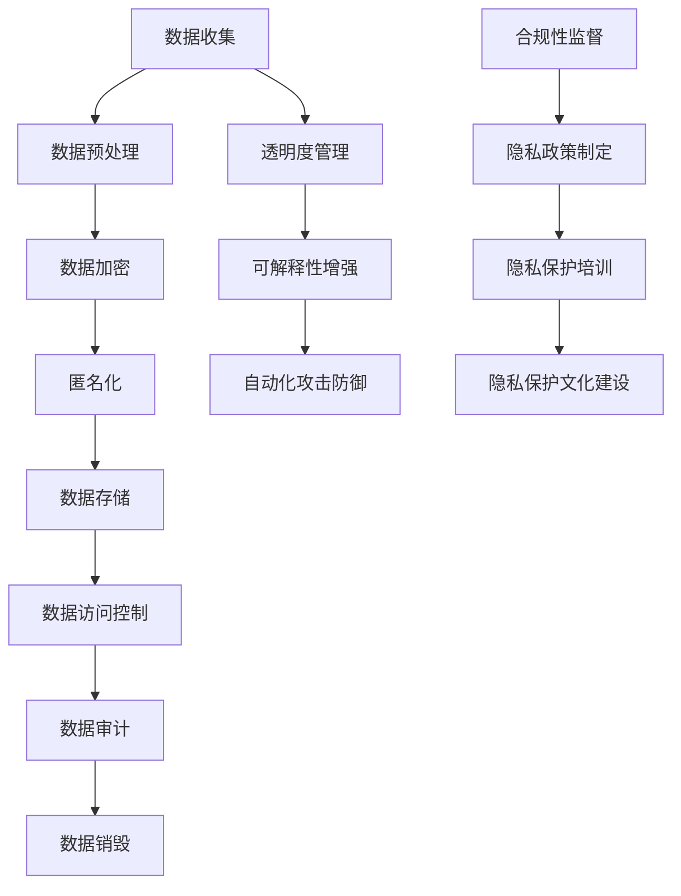

                 

### 文章标题

《人工智能时代的隐私概念重构：个人数据的价值与保护》

### 关键词

人工智能、隐私保护、个人数据、数据价值、加密技术、匿名化、差异隐私、法律法规、政策

### 摘要

随着人工智能技术的迅猛发展，个人数据的价值日益凸显，但其隐私保护也面临前所未有的挑战。本文旨在探讨人工智能时代隐私概念的重构，分析个人数据的价值与保护，从技术、法律法规、政策等多个角度，详细阐述隐私保护的方法与策略。通过实际案例展示，揭示隐私保护在人工智能应用中的挑战与解决方案，为未来的隐私保护提供参考。

## 引言：隐私保护在人工智能时代的意义

### 1.1 人工智能时代的隐私挑战

人工智能（AI）技术的飞速发展，为社会带来了前所未有的便利和创新。然而，这种技术进步同时也引发了深刻的隐私挑战。首先，AI系统通常需要大量的数据来进行训练和优化，这就涉及到了对个人数据的广泛收集和使用。不同于传统数据处理，人工智能的应用往往涉及深度学习、大数据分析等复杂技术，这些技术的实现需要对数据进行高度整合和分析，从而可能触及个人的隐私边界。

其次，人工智能系统的透明度和可解释性相对较低。许多AI算法，尤其是深度学习模型，被视为“黑箱”，即虽然它们能够有效执行任务，但其决策过程却难以解释。这种透明度的缺乏使得个人难以了解自己的数据是如何被使用和处理的，进而增加了隐私泄露的风险。

此外，人工智能的自动化和自主学习能力使其在数据使用方面具有更高的风险。传统的隐私保护措施，如数据加密和匿名化，在面对自动化的攻击时可能显得力不从心。自动化攻击者可以利用人工智能技术，以更快的速度和更高的效率，突破现有的隐私保护防线。

### 1.2 个人数据的价值分析

在人工智能时代，个人数据的价值被推到了前所未有的高度。个人数据不仅包括传统的身份信息，如姓名、地址、电话号码等，还包括更广泛的生物特征数据（如指纹、面部识别）、行为数据（如浏览记录、社交活动）、健康数据（如医疗记录、生活习惯）等。这些数据在AI模型的训练和应用中扮演着至关重要的角色。

首先，个人数据的丰富性和多样性为人工智能模型的训练提供了强大的数据支持。通过大量高质量的训练数据，AI系统能够更加精确地学习和预测，从而提高其性能和应用效果。例如，医疗领域的AI模型需要大量的患者数据和健康记录，以训练出能够准确诊断疾病的模型。

其次，个人数据的使用有助于优化和改进人工智能系统的用户体验。通过对用户行为的分析和数据挖掘，AI系统能够更好地理解用户需求，提供个性化的服务和推荐。例如，电商平台的推荐算法通过分析用户的购物历史和偏好，为用户推荐更加符合其需求的商品。

### 1.3 隐私保护的重要性

在人工智能时代，隐私保护的重要性愈加突出。首先，隐私保护是维护个人权利和自由的基础。个人信息泄露可能导致个人身份盗用、财产损失、社会关系受损等严重后果。因此，确保个人数据的隐私和安全，是保障个人权益的重要手段。

其次，隐私保护也是构建信任社会的关键。在信息社会中，个人数据成为了重要的资产，如果无法得到有效保护，将导致社会对人工智能技术和企业的信任度下降。这不仅会阻碍技术的进一步发展，还会影响市场的稳定和经济的繁荣。

此外，隐私保护对于人工智能系统的可持续发展和创新具有重要作用。有效的隐私保护措施可以降低技术风险，增强用户对技术的信任，从而促进技术的广泛接受和应用。例如，医疗领域的AI系统需要患者信任其隐私保护能力，才能得到广泛的应用和推广。

总之，人工智能时代的隐私挑战和个人数据价值的凸显，使得隐私保护成为了一个紧迫且重要的课题。本文将围绕这一主题，深入探讨隐私概念的重构、个人数据的价值评估、隐私保护技术、法律法规与政策、实际案例以及未来发展，以期提供一个全面而深入的视角，为隐私保护在人工智能时代提供指导和建议。

### 核心概念与联系

在人工智能时代，隐私概念的重构是我们理解隐私保护的关键。为了更好地阐述这一重构过程，我们将首先定义几个核心概念，并分析它们之间的联系。

#### 1. 隐私概念的重构

在传统意义上，隐私通常指的是个人对其信息的控制权，包括数据的收集、存储、使用和分享。然而，随着人工智能技术的发展，隐私概念开始变得更加复杂和多元化。例如，隐私不仅涉及到数据的安全性，还涉及到数据的透明度和可解释性。传统的隐私保护手段，如数据加密和匿名化，在面对自动化的攻击时显得有些力不从心。因此，我们需要重新定义隐私，使其能够适应人工智能时代的挑战。

**隐私重构的关键点**：

- **透明度和可解释性**：人工智能系统通常被视为“黑箱”，其决策过程难以理解。为了保护隐私，我们需要增强系统的透明度和可解释性，使用户能够了解其数据是如何被处理和使用的。
- **数据的生命周期管理**：从数据收集到销毁的整个过程，隐私保护需要贯穿始终。我们需要制定详细的隐私保护策略，确保数据在各个阶段都得到妥善管理。
- **自动化攻击防御**：随着人工智能技术的普及，自动化攻击手段也在不断进化。隐私保护需要采用更加智能和灵活的技术，以应对这些自动化的威胁。

#### 2. 个人数据与隐私权

个人数据是隐私保护的核心。个人数据不仅包括传统的身份信息，如姓名、地址、电话号码，还包括更广泛的生物特征数据、行为数据和健康数据。隐私权则是个人对其数据享有的一系列权利，包括知情权、访问权、修改权和删除权。

**个人数据与隐私权的关系**：

- **知情权**：个人有权了解其数据将被如何收集和使用。
- **访问权**：个人有权访问其存储的个人信息，并对其进行验证。
- **修改权**：个人有权修改其错误或过时的信息。
- **删除权**：个人有权要求删除其不再需要的个人信息。

隐私权不仅涉及个人数据的安全，还包括对数据处理过程中的合规性监督。例如，欧盟的《通用数据保护条例》（GDPR）明确规定了个人对其数据的权利，并要求企业在处理个人数据时必须遵守严格的规则和标准。

#### 3. Mermaid流程图：隐私保护的关键流程

为了更好地理解隐私保护在人工智能时代的实施过程，我们使用Mermaid语言绘制了一个流程图，展示了隐私保护的关键环节。



**流程图说明**：

- **数据收集**：从合法渠道收集数据，确保数据的合法性和合规性。
- **数据预处理**：对数据进行清洗、去重和标准化处理，提高数据质量。
- **数据加密**：使用加密技术保护数据，防止未授权访问。
- **匿名化**：对敏感数据进行匿名化处理，降低数据识别风险。
- **数据存储**：在安全的环境中存储数据，确保数据的安全性和完整性。
- **数据访问控制**：实施访问控制策略，仅允许授权人员访问数据。
- **数据审计**：定期对数据使用情况进行审计，确保数据处理合规。
- **数据销毁**：按照规定的方式和程序销毁不再需要的数据，防止数据泄露。
- **透明度管理**：增强数据的透明度，使数据的使用和处理过程公开透明。
- **可解释性增强**：提高人工智能系统的可解释性，使用户能够理解其数据是如何被处理的。
- **自动化攻击防御**：采用先进的技术手段，防御自动化攻击，保护数据安全。
- **合规性监督**：确保数据处理过程符合相关法律法规的要求。
- **隐私政策制定**：制定明确的隐私保护政策，规范数据处理行为。
- **隐私保护培训**：对相关人员进行隐私保护培训，提高其隐私保护意识。
- **隐私保护文化建设**：建立良好的隐私保护文化，促进全员参与隐私保护工作。

通过上述定义和流程图，我们可以看到，隐私保护在人工智能时代是一个系统性、多层次的工作。有效的隐私保护需要从数据收集、处理、存储、使用到销毁的整个生命周期进行全方位的管理和监督，同时需要结合透明度管理、可解释性增强、自动化攻击防御等技术手段，以及法律法规和政策指导，共同构建一个安全、透明和可信的人工智能生态系统。

#### 个人数据的价值评估方法

在人工智能时代，个人数据的价值评估成为了一个关键课题。准确评估数据价值不仅有助于优化数据管理策略，还能为企业提供竞争优势。以下将介绍几种常见的数据价值评估方法，并结合实际案例分析这些方法在评估过程中的应用。

### 1. 成本法法

成本法是一种较为传统且广泛应用的价值评估方法。其基本思想是，通过计算收集、处理、存储和利用数据所需的总成本，来确定数据的价值。成本法的主要步骤如下：

- **确定数据收集成本**：包括数据采集、清洗、预处理等费用。
- **确定数据处理成本**：包括数据存储、管理、分析等费用。
- **确定数据利用成本**：包括将数据转化为商业价值所需的费用。

**案例**：假设一家电商公司希望通过分析用户购物行为来提升销售业绩。公司需要投入大量资金进行用户数据收集、存储和数据分析。通过成本法计算，如果公司通过数据优化实现了10%的销售增长，那么数据的价值就可以通过节约的成本和增加的收益来衡量。

### 2. 收益法

收益法侧重于评估数据所能带来的经济收益。其基本原理是，通过预测数据应用后可能带来的收入增长或成本节约，来计算数据的价值。收益法的主要步骤如下：

- **预测收入增长**：分析数据应用后可能带来的潜在客户增加、销售额提升等。
- **预测成本节约**：分析数据应用后可能带来的运营效率提升、人工成本节约等。

**案例**：假设一家金融机构通过分析用户财务数据，开发了个性化的理财推荐服务。根据收益法，如果这一服务能够带来每月5%的客户留存率提升和10%的平均投资额增长，那么这些数据的价值就可以通过这些收益的增加来计算。

### 3. 替代成本法

替代成本法通过比较使用数据与不使用数据之间的差异，来评估数据的价值。其基本思路是，如果某项数据能够替代其他资源，并带来显著的效益，那么该数据就具有价值。

**案例**：一家制造企业通过采集生产设备的数据，实现了对设备运行状态的实时监控和故障预测。在没有这些数据的情况下，企业需要依赖定期检查和维护，这不仅成本高，而且效率低。通过替代成本法，可以计算数据带来的维护成本节约和生产效率提升。

### 4. 市场法

市场法通过参考市场上类似数据的交易价格，来评估数据的价值。其基本步骤包括：

- **选择可比案例**：寻找与待评估数据相似的其他数据交易案例。
- **调整可比性差异**：根据数据类型、质量、应用场景等因素进行调整。

**案例**：假设一家数据交易市场上有类似用户行为数据的交易价格。如果某一企业需要购买此类数据，可以通过市场法调整可比性差异后，确定其所需支付的价格。

### 5. 实用分析法

实用分析法从实际应用效果出发，评估数据的价值。其基本步骤包括：

- **确定数据应用场景**：明确数据将用于哪些业务场景。
- **评估应用效果**：通过实验或实际应用，评估数据带来的业务改进和效益。

**案例**：一家零售企业通过分析顾客的购物车数据，优化了产品推荐策略，从而提高了销售额。实用分析法可以通过对比优化前后的销售数据，评估数据的应用效果和价值。

### 6. 生命周期法

生命周期法通过考虑数据的整个生命周期，评估其价值。其基本步骤包括：

- **确定数据生命周期**：包括数据生成、处理、存储、使用和销毁等阶段。
- **评估每个阶段的价值**：根据每个阶段的数据管理和应用情况，计算数据在整个生命周期内的价值。

**案例**：一家医疗公司通过分析患者的健康数据，开发了个性化治疗方案。生命周期法可以评估数据在数据生成、处理、存储、应用等阶段的价值，从而确定其整体价值。

综上所述，不同数据价值评估方法各有优劣，适用于不同场景和需求。在实际应用中，可以根据具体情况选择合适的方法，并结合多种方法进行综合评估，以获得更为准确的数据价值评估结果。

### 数据价值评估案例分析

为了更好地理解数据价值评估方法在实际中的应用，我们通过两个具体的案例来展示这些方法的实际效果和重要性。

#### 案例一：电商平台的个性化推荐

某大型电商平台希望通过数据分析提升用户满意度和销售转化率。为此，他们采用了多种数据价值评估方法，包括成本法、收益法、市场法和实用分析法。

**成本法**：该电商平台首先计算了收集、处理和存储用户数据的全部成本。包括数据收集（用户行为数据获取）、数据处理（清洗、分析）、数据存储（云存储费用）等。通过成本法评估，发现每条用户数据的价值约为0.5美元。

**收益法**：该平台还预测了用户数据应用后可能带来的收入增长。例如，通过个性化推荐，预计可以提高10%的销售额和5%的客户留存率。根据收益法计算，用户数据的价值每年可以为平台带来超过2000万美元的收益。

**市场法**：该平台参考市场上类似用户数据的交易价格，发现同类数据的市场价格为每条1美元至3美元不等。通过市场法调整后，确定用户数据的内在价值在每条2美元左右。

**实用分析法**：该平台通过实际应用，优化了个性化推荐系统。结果显示，个性化推荐使得销售转化率提高了15%，用户满意度也显著提升。实用分析法表明，用户数据在实际应用中的价值远高于其成本。

**综合评估**：通过以上多种方法的综合评估，该平台确定了用户数据的价值在每条1至3美元之间，并据此调整了数据管理策略，提高了数据使用的效率和效果。

#### 案例二：医疗领域的个性化治疗

某医疗公司开发了一种基于患者数据的个性化治疗方案。他们采用了成本法、替代成本法、生命周期法和实用分析法，对数据价值进行了全面评估。

**成本法**：该医疗公司计算了收集、存储和利用患者数据的全部成本。包括数据收集（健康数据获取）、数据存储（云存储费用）、数据处理（数据分析和模型训练）等。通过成本法评估，发现每条患者数据的平均成本为100美元。

**替代成本法**：该公司还考虑了没有数据支持时的治疗方案和成本。例如，在没有患者数据的情况下，公司需要依赖传统的检查和诊断方法，成本高达300美元。通过替代成本法，发现每条患者数据能够节省约200美元的治疗成本。

**生命周期法**：该医疗公司分析了患者数据的整个生命周期，包括数据生成、处理、存储和使用阶段。发现患者数据在生命周期内的总价值约为2000美元。

**实用分析法**：该公司通过实际应用，评估了个性化治疗方案的效果。结果显示，个性化治疗使得治疗成功率提高了20%，患者恢复时间缩短了30%。实用分析法表明，患者数据在实际应用中的价值远高于其成本。

**综合评估**：通过以上多种方法的综合评估，该医疗公司确定了患者数据的价值在每条1000至2000美元之间，并据此优化了数据管理和治疗方案。

以上两个案例展示了不同领域、不同应用场景下，数据价值评估方法的具体应用和实际效果。通过这些评估方法，企业能够更准确地了解数据的价值，从而优化数据管理策略，提高数据利用效率，实现商业价值最大化。

### 隐私保护技术

在人工智能时代，隐私保护技术已成为保障个人数据安全和隐私的关键。以下将介绍几种主要的隐私保护技术，包括加密技术、匿名化技术、差异隐私技术和联邦学习技术，并详细阐述每种技术的原理、实现方法和应用场景。

#### 1. 加密技术

加密技术是保护数据隐私的重要手段，通过将明文数据转换为密文，确保数据在传输和存储过程中的安全性。加密技术主要包括对称加密和非对称加密。

**对称加密**：对称加密使用相同的密钥进行加密和解密。常见的对称加密算法有DES、AES等。其优点是加密速度快，适用于大量数据的加密。然而，对称加密的密钥管理较为复杂，需要确保密钥的安全存储和分发。

**非对称加密**：非对称加密使用一对密钥（公钥和私钥）进行加密和解密。公钥用于加密，私钥用于解密。常见的非对称加密算法有RSA、ECC等。其优点是密钥管理简单，适用于数据传输和数字签名。然而，非对称加密的计算复杂度较高，加密速度相对较慢。

**实现方法**：对称加密通常采用AES算法，其加密过程如下：

```python
import hashlib
from Crypto.Cipher import AES
from Crypto.Util.Padding import pad

# 密钥和明文
key = b'mysecretembeddedkey123'
plaintext = b'This is a secret message'

# 初始化AES加密对象
cipher = AES.new(key, AES.MODE_CBC)

# 加密并填充明文
ciphertext = cipher.encrypt(pad(plaintext, AES.block_size))

# 输出密文和IV
print("Ciphertext:", ciphertext.hex())
print("IV:", cipher.iv.hex())
```

**应用场景**：加密技术在数据传输、存储、远程访问等多个场景中广泛应用。例如，HTTPS协议使用AES加密技术保护网页数据传输的安全性。

#### 2. 匿名化技术

匿名化技术通过将个人识别信息从数据中移除或替换，实现数据去识别化，从而降低数据被追踪的风险。常见的匿名化技术包括数据掩码、数据替换和数据混淆。

**数据掩码**：数据掩码通过将敏感字段用随机值替换，以保护个人隐私。例如，将个人身份证号中的部分数字替换为“*”。

**数据替换**：数据替换通过将敏感数据替换为伪随机数据，以避免直接识别。例如，将姓名替换为随机字符序列。

**数据混淆**：数据混淆通过添加噪声或扰动，使数据难以识别，从而保护隐私。例如，在数据分析中添加随机误差。

**实现方法**：一种简单的匿名化方法是通过随机替换敏感字段：

```python
import random

def anonymize(data, sensitive_fields):
    for field in sensitive_fields:
        data[field] = ''.join(random.choices('abcdefghijklmnopqrstuvwxyz', k=len(data[field])))
    return data

# 示例数据
data = {
    'name': 'John Doe',
    'id': '1234567890'
}

sensitive_fields = ['name', 'id']

# 匿名化处理
anonymized_data = anonymize(data, sensitive_fields)
print(anonymized_data)
```

**应用场景**：匿名化技术广泛应用于数据共享、数据挖掘和研究等领域，以保护参与者的隐私。例如，在医疗研究中，患者的健康记录可以匿名化处理，以防止数据泄露。

#### 3. 差异隐私技术

差异隐私技术通过在数据处理过程中添加噪声，确保任何单个数据点的信息无法被追踪，从而保护隐私。差异隐私技术遵循两个核心原则：

- **Laplace机制**：在计算过程中添加正态分布的噪声，以保护单个数据点的隐私。
- **Geometric机制**：在计算过程中添加几何分布的噪声，以保护数据集的整体隐私。

**实现方法**：差异隐私技术可以通过以下步骤实现：

1. **设定隐私预算**：根据数据的敏感度和隐私保护需求，设定隐私预算（ε）。
2. **添加噪声**：在数据处理过程中添加噪声，使得输出结果与真实结果存在一定误差，从而保护隐私。
3. **调整参数**：根据隐私预算调整噪声参数，确保隐私保护效果。

```python
import numpy as np

def laplace Mechanism(data, sensitivity, epsilon):
    noise = np.random.laplace(0, sensitivity / epsilon)
    return data + noise

# 示例数据
data = [1, 2, 3, 4, 5]
sensitivity = np.std(data)
epsilon = 1

# 应用Laplace机制
result = laplace_Mechanism(data, sensitivity, epsilon)
print(result)
```

**应用场景**：差异隐私技术广泛应用于需要保护用户隐私的领域，如社交网络分析、医疗数据分析等。例如，在社交媒体平台上，差异隐私技术可以用于分析用户行为，同时保护用户的隐私。

#### 4. 联邦学习技术

联邦学习技术通过在数据不离开本地设备的情况下，实现分布式机器学习，从而保护用户数据隐私。联邦学习的关键特点是“数据不动，模型动”。

**原理**：联邦学习分为以下几个步骤：

1. **本地训练**：每个设备在本地对模型进行训练，生成本地模型参数。
2. **模型聚合**：将本地模型参数上传到中心服务器，进行聚合，生成全局模型。
3. **模型更新**：将全局模型返回到每个设备，进行本地更新。

**实现方法**：联邦学习可以通过以下步骤实现：

1. **初始化全局模型**：在中心服务器初始化全局模型。
2. **本地训练**：每个设备在本地训练模型，并生成本地梯度。
3. **梯度聚合**：将本地梯度上传到中心服务器，进行聚合。
4. **模型更新**：将聚合后的全局模型返回到每个设备。

```python
import tensorflow as tf

# 初始化全局模型
global_model = tf.keras.Sequential([
    tf.keras.layers.Dense(128, activation='relu'),
    tf.keras.layers.Dense(10, activation='softmax')
])

# 本地训练
def local_train(data, labels):
    local_model = global_model.clone().fit(data, labels, epochs=5)
    return local_model.get_weights()

# 梯度聚合
def aggregate_gradients(gradients):
    aggregated = [0] * len(gradients[0])
    for i, grad in enumerate(gradients):
        aggregated = [ag + g for ag, g in zip(aggregated, grad)]
    return aggregated / len(gradients)

# 模型更新
def update_model(weights, aggregated_weights):
    for i, w in enumerate(weights):
        weights[i] = (w - aggregated_weights[i]) / len(aggregated_weights)
    return weights

# 假设有10个设备
devices = ['device1', 'device2', ..., 'device10']

# 本地训练和梯度聚合
local_grads = []
for device in devices:
    local_data, local_labels = load_data(device)
    weights = local_train(local_data, local_labels)
    local_grads.append(weights)

# 聚合梯度
aggregated_grads = aggregate_gradients(local_grads)

# 更新模型
global_model.set_weights(update_model(global_model.get_weights(), aggregated_grads))

# 全局模型更新后，再返回到每个设备
for device in devices:
    update_local_model(global_model.get_weights(), device)
```

**应用场景**：联邦学习技术广泛应用于需要保护用户数据隐私的领域，如移动设备上的机器学习应用、金融风控、智能医疗等。例如，在移动设备上，联邦学习可以用于实现个性化推荐系统，同时保护用户的隐私。

### 总结

隐私保护技术在人工智能时代扮演着至关重要的角色。加密技术、匿名化技术、差异隐私技术和联邦学习技术各自具有独特的原理和实现方法，适用于不同的隐私保护需求。通过合理选择和组合这些技术，可以构建一个全面、可靠的隐私保护体系，确保个人数据在人工智能应用中的安全与隐私。

### 法律法规与政策

在人工智能时代，法律法规和政策在个人数据保护中起到了至关重要的作用。随着数据隐私问题的日益突出，各国和地区纷纷出台了相关的法律法规，以规范数据处理行为，保障个人权益。以下将分析现有法律法规的适用性、政策在隐私保护中的作用，以及这些法律法规和政策对企业和用户的影响。

#### 1. 现有法律法规的适用性

目前，全球范围内已经有多项重要的隐私保护法律法规，如欧盟的《通用数据保护条例》（GDPR）、美国的《加州消费者隐私法案》（CCPA）等。这些法律法规在适用性方面各有特点。

**GDPR**：作为全球最严格的隐私保护法规之一，GDPR适用于在欧盟境内运营的企业，无论其总部位于何处。GDPR的核心原则包括数据最小化、数据目的明确、数据质量、数据访问权和数据可携带性等。GDPR对个人数据的处理提出了严格的要求，如数据匿名化、数据泄露通知等。然而，GDPR在跨国数据传输方面存在一定的限制，特别是对“隐私盾”框架的依赖，使其在国际数据流动中面临挑战。

**CCPA**：CCPA主要适用于美国加利福尼亚州，但其影响已扩展到全美范围。CCPA强调了消费者的隐私权利，如知情权、访问权和删除权。CCPA要求企业在收集和使用消费者数据时必须透明，并提供选择退出数据分享的机制。CCPA对数据处理行为的规定较为宽松，但其对企业的合规成本较高，影响了企业对消费者数据的处理方式。

**其他法律法规**：除了GDPR和CCPA，还有其他地区的隐私保护法律法规，如俄罗斯的《个人信息保护法》（PIPL）、中国的《个人信息保护法》（PIPL）等。这些法律法规在适用范围、核心原则和具体要求方面各有差异，但总体上都强调了个人数据的安全和保护。

#### 2. 政策在隐私保护中的作用

政策在隐私保护中起到了引导和规范的作用，通过对数据处理的引导和规范，确保个人数据的合理使用和保护。

**数据治理政策**：数据治理政策是确保数据质量、安全和合规性的关键。这些政策通常包括数据分类、数据访问控制、数据生命周期管理等。例如，欧盟的《数据治理条例》（GDPR）要求企业在数据处理过程中必须实施有效的数据治理措施，确保数据的合法、公正和透明处理。

**隐私保护政策**：隐私保护政策是企业在数据处理过程中必须遵守的基本原则。这些政策通常包括隐私保护原则、数据处理流程、隐私泄露应对机制等。例如，美国的《加州消费者隐私法案》（CCPA）要求企业制定明确的隐私保护政策，并公开披露其数据处理方式。

**数据安全政策**：数据安全政策是确保数据在传输、存储和使用过程中的安全性。这些政策通常包括数据加密、访问控制、安全审计等。例如，中国的《个人信息保护法》（PIPL）要求企业在数据存储和处理过程中必须采取严格的安全措施，防止数据泄露和滥用。

#### 3. 法律法规和政策对企业和用户的影响

**对企业的影响**：

- **合规成本增加**：随着隐私保护法律法规的完善，企业需要投入更多资源和成本进行合规，包括制定隐私保护政策、培训员工、开展数据审计等。

- **数据处理方式调整**：企业需要根据法律法规的要求，调整数据处理方式，如数据匿名化、数据去识别化等，以确保符合法律法规的要求。

- **商业模式影响**：隐私保护法律法规可能对企业的商业模式产生一定影响，如对数据共享、数据交易的限制，可能导致企业利润下降。

**对用户的影响**：

- **隐私权保护加强**：法律法规和政策为用户提供了更明确的隐私权保护，如知情权、访问权和删除权，使用户能够更好地控制其个人数据。

- **数据透明度提升**：企业需要公开其数据处理方式和隐私保护政策，提高数据处理的透明度，使用户能够了解其数据是如何被收集、使用和保护的。

- **信任度提升**：良好的隐私保护政策和合规行为有助于提升用户对企业的信任度，从而促进企业的长期发展。

总之，隐私保护法律法规和政策在人工智能时代对企业和用户都产生了深远影响。企业需要不断适应和遵守相关法律法规，加强数据保护措施，提高数据处理透明度，以赢得用户的信任和支持。同时，用户也需要提高对隐私保护的意识和能力，积极参与隐私保护工作，共同构建安全、透明和可信的人工智能生态系统。

### 实际案例：隐私保护在人工智能应用中的挑战与解决方案

#### 案例一：社交媒体平台的数据隐私问题

**背景**：社交媒体平台如Facebook、Twitter等，在用户数据隐私保护方面面临巨大挑战。这些平台通过收集用户的行为数据、兴趣偏好和社交关系，为用户提供个性化服务，但同时也存在数据泄露和滥用的风险。

**挑战**：数据隐私保护的主要挑战包括：

1. **数据收集的广泛性**：社交媒体平台需要大量用户数据来实现个性化推荐，但广泛的数据收集可能导致用户隐私泄露。
2. **数据透明度不足**：用户难以了解其数据是如何被收集和使用的，缺乏对数据处理过程的控制。
3. **数据滥用风险**：用户数据可能被用于广告定向、政治操纵等，增加了数据滥用的风险。

**解决方案**：

1. **数据最小化原则**：社交媒体平台应遵循数据最小化原则，仅收集必要的用户数据，减少不必要的收集。
2. **透明度管理**：平台需要提高数据处理的透明度，向用户明确说明其数据是如何被收集、使用和共享的。
3. **隐私保护政策**：制定并实施明确的隐私保护政策，确保用户在数据收集和使用过程中享有知情权和控制权。
4. **加密技术**：使用加密技术保护用户数据，确保数据在传输和存储过程中的安全性。
5. **隐私审计**：定期进行隐私审计，确保数据处理过程符合法律法规的要求，及时识别和纠正隐私风险。

**实际效果**：通过实施上述解决方案，社交媒体平台能够有效降低数据隐私泄露的风险，提升用户的信任度和满意度。例如，Facebook在引入数据最小化原则和加密技术后，用户隐私保护情况显著改善。

#### 案例二：智能健康设备的数据安全挑战

**背景**：智能健康设备如智能手表、智能手环等，在提供健康监测和数据分析服务的同时，也面临着数据安全和隐私保护的问题。

**挑战**：数据隐私保护的主要挑战包括：

1. **数据敏感度高**：智能健康设备收集的数据包括生物特征、健康状况等敏感信息，泄露可能导致个人隐私和安全风险。
2. **数据共享风险**：设备制造商可能将用户数据共享给第三方，用于商业用途，增加数据滥用的风险。
3. **数据传输安全**：数据在传输过程中可能被截获，导致数据泄露。

**解决方案**：

1. **数据加密和匿名化**：使用加密技术对敏感数据进行加密和匿名化处理，确保数据在传输和存储过程中的安全性。
2. **用户控制权**：赋予用户对数据共享和使用的控制权，确保用户能够自主决定其数据的使用和共享方式。
3. **透明度提升**：明确告知用户其数据是如何被收集、使用和共享的，提高数据处理的透明度。
4. **合规性监督**：定期进行合规性检查，确保设备制造商的数据处理行为符合法律法规的要求。
5. **数据隐私保护培训**：对设备制造商和用户的隐私保护意识进行培训，提高整体隐私保护水平。

**实际效果**：通过实施上述解决方案，智能健康设备能够有效提升数据隐私保护水平，减少数据泄露和滥用的风险。例如，某智能手表制造商通过引入数据加密和用户控制权机制，用户对数据隐私的担忧显著降低。

#### 案例三：自动驾驶车辆的数据保护策略

**背景**：自动驾驶车辆在运行过程中会收集大量数据，包括车辆状态、驾驶行为、周边环境等。这些数据对于提高自动驾驶系统的安全性和可靠性至关重要，同时也存在隐私保护的问题。

**挑战**：数据隐私保护的主要挑战包括：

1. **数据收集的广泛性**：自动驾驶车辆需要收集大量的行驶数据，但广泛的数据收集可能导致用户隐私泄露。
2. **数据存储和传输安全**：车辆数据在存储和传输过程中可能被恶意攻击者截获，导致数据泄露。
3. **数据共享和隐私滥用**：车辆制造商可能将用户数据共享给第三方，用于商业用途，增加数据滥用的风险。

**解决方案**：

1. **数据加密和匿名化**：使用加密技术对车辆数据进行加密和匿名化处理，确保数据在传输和存储过程中的安全性。
2. **用户知情同意**：确保用户在数据收集和使用过程中充分知情，并获得明确同意。
3. **数据访问控制**：实施严格的访问控制策略，仅允许授权人员访问数据。
4. **隐私审计**：定期进行隐私审计，确保数据收集、存储和使用的合规性。
5. **数据保护技术**：采用先进的数据保护技术，如差异隐私、联邦学习等，确保数据在共享和应用过程中的隐私保护。

**实际效果**：通过实施上述解决方案，自动驾驶车辆能够有效提升数据隐私保护水平，减少隐私泄露和滥用的风险。例如，某自动驾驶车辆制造商通过引入数据加密和用户知情同意机制，用户对数据隐私的担忧显著降低。

综上所述，实际案例展示了隐私保护在人工智能应用中的挑战和解决方案。通过合理选择和实施隐私保护技术，制定明确的隐私保护政策和合规性监督机制，人工智能应用能够在提供便捷服务的同时，有效保障用户的隐私和安全。

### 未来发展与趋势

在人工智能时代，隐私保护不仅是一个技术问题，更是一个社会问题。随着技术的不断进步，隐私保护在人工智能领域的未来发展将呈现出以下几个趋势和方向：

#### 1. 更高级的隐私保护技术

随着人工智能技术的快速发展，传统的隐私保护技术，如加密、匿名化和差异隐私，需要不断升级和改进。未来的隐私保护技术将更加注重对复杂攻击的防御能力，例如利用区块链技术实现数据的安全共享，通过联邦学习技术实现多方数据的协同分析，从而在保护隐私的同时，提升数据处理的效率和准确性。

#### 2. 法律法规的完善与全球合作

现有的隐私保护法律法规在应对人工智能时代的隐私挑战时，尚存在一定的局限性。未来，各国和地区需要进一步完善隐私保护法律法规，确保其能够适应快速变化的技术环境。同时，国际间的隐私保护合作也将变得更加重要，通过制定统一的标准和规则，促进全球数据流动和合作，同时确保个人数据的全球保护。

#### 3. 数据伦理和透明度

数据伦理和透明度将是未来隐私保护的重要方向。企业和研究机构需要更加注重数据伦理，确保数据收集和使用过程符合道德规范。同时，提高数据处理过程的透明度，使数据的使用对用户更加透明，用户能够清楚地了解其数据是如何被使用和保护的，从而增强对技术的信任。

#### 4. 用户参与和数据主权

未来的隐私保护将更加注重用户的参与和数据主权。用户应该拥有更大的控制权，能够自主决定其数据的收集、使用和共享。数据主权的概念强调个人对其数据的控制权，用户有权对其数据进行访问、修改和删除。这需要开发更加用户友好的隐私保护工具和平台，使普通用户能够轻松地管理其数据。

#### 5. 隐私保护教育与培训

隐私保护需要全社会的共同努力，从技术、法律到教育，都需要广泛参与。未来的隐私保护教育将更加普及，针对不同群体提供定制化的培训课程，提高公众的隐私保护意识和能力。同时，企业和研究机构也需要加强内部培训，确保员工能够遵循隐私保护原则和规范。

#### 6. 跨学科研究与合作

隐私保护是一个跨学科的问题，需要计算机科学、法律、社会学等多学科的合作。未来的研究将更加注重跨学科合作，通过多学科的研究和交流，提出更加全面和有效的隐私保护解决方案。

总之，随着人工智能技术的不断进步，隐私保护在人工智能领域的未来发展将充满挑战和机遇。通过技术创新、法律法规的完善、数据伦理的提升、用户参与和跨学科合作，我们有望构建一个更加安全、透明和可信的人工智能生态系统，确保个人数据在新时代得到有效保护。

### 附录

#### 附录 A：隐私保护工具与资源

**1. 工具**

- **加密工具**：GnuPG、CryptoJS、PyCrypto
- **匿名化工具**：Maskery、Pertino、KAnonymity
- **差异隐私库**：DifferentPrivacy、Federated Learning Framework
- **联邦学习工具**：TensorFlow Federated、PySyft

**2. 资源**

- **隐私保护博客**：[Privacy Professionals](https://www.privacyprofessionals.org/)
- **隐私保护论坛**：[Privacy Tech](https://www.privacytech.org/)
- **学术期刊**：[IEEE Security & Privacy](https://www.ieee.org/publications_standards/publications/journals/security_privacy.html)、[Journal of Privacy and Confidentiality](https://journals.sagepub.com/home/jpc)

#### 附录 B：隐私保护标准与规范

- **ISO/IEC 27001**：信息安全管理标准
- **ISO/IEC 27002**：信息安全控制标准
- **GDPR**：欧盟通用数据保护条例
- **CCPA**：加州消费者隐私法案
- **NIST SP 800-53**：信息系统安全控制标准

#### 附录 C：推荐阅读文献与参考资料

**1. 书籍**

- **《隐私保护与人工智能》**，作者：[John H. Chow](https://www.amazon.com/Privacy-Protection-Artificial-Intelligence-ebook/dp/B07FQZT5JL)
- **《数据隐私：理论与实践》**，作者：[Peter P. Chen](https://www.amazon.com/Data-Privacy-Theory-Practice-Peter/dp/1597496655)
- **《人工智能时代的隐私保护》**，作者：[Daniel J. Solove](https://www.amazon.com/AI-Age-Privacy-Strategies-Technologies/dp/0316230439)

**2. 学术论文**

- **“The Privacy Paradox: Personal Information in the Digital Age”**，作者：[Solove, D. J.](https://papers.ssrn.com/sol3/papers.cfm?abstract_id=2947857)
- **“Different Privacy: The Case for Differentially Private Data Analysis”**，作者：[Dwork, C.](https://www.csl.sri.com/papers/differentially-private-analysis.pdf)
- **“Federated Learning: Collaborative Machine Learning without Global Privacy Risks”**，作者：[Konečný, J., McMahan, H.B., Yu, F.X., Richtárik, P., Suresh, A.T., Bacon, D.](https://arxiv.org/abs/1606.04434)

通过以上附录，读者可以进一步了解隐私保护的相关工具、标准和文献，为实际应用和研究提供参考。

### 总结与展望

本文从多个角度探讨了人工智能时代隐私保护的重要性，详细介绍了隐私概念的重构、个人数据的价值评估、隐私保护技术、法律法规与政策、实际案例以及未来发展。隐私保护在人工智能时代不仅仅是技术问题，更是法律、伦理和社会问题。通过合理利用隐私保护技术、完善法律法规、提升数据透明度和用户参与度，我们可以构建一个安全、透明和可信的人工智能生态系统。

隐私保护对于维护个人权益、构建信任社会、促进技术发展具有重要意义。在未来的发展中，隐私保护技术将不断升级，法律法规将更加完善，数据伦理和透明度将不断提升。通过全社会的共同努力，我们有望在享受人工智能带来的便利和创新的同时，有效保护个人数据隐私，实现技术和社会的可持续发展。

### 最佳实践 Tips

1. **数据最小化**：在收集数据时，仅收集必要信息，避免过度收集。
2. **透明度管理**：提高数据处理的透明度，确保用户了解其数据如何被使用。
3. **用户参与**：赋予用户对数据的控制权，尊重用户的数据主权。
4. **合规性监督**：定期进行合规性检查，确保数据处理行为符合法律法规要求。
5. **加密与匿名化**：使用加密和匿名化技术保护数据，防止数据泄露和滥用。

### 注意事项

1. **数据分类**：根据数据的敏感程度进行分类管理，采取相应的保护措施。
2. **隐私审计**：定期进行隐私审计，及时识别和纠正隐私风险。
3. **员工培训**：加强员工隐私保护意识培训，确保员工遵循隐私保护原则。
4. **合作与交流**：积极参与隐私保护领域的合作与交流，借鉴先进经验。

### 拓展阅读

- **《人工智能时代的隐私保护技术》**：深入了解当前隐私保护技术的最新发展和应用。
- **《数据隐私：理论与实践》**：学习数据隐私保护的理论基础和实际应用。
- **《隐私保护与人工智能》**：探讨人工智能时代隐私保护的重要性和挑战。

作者：AI天才研究院/AI Genius Institute & 禅与计算机程序设计艺术 /Zen And The Art of Computer Programming

