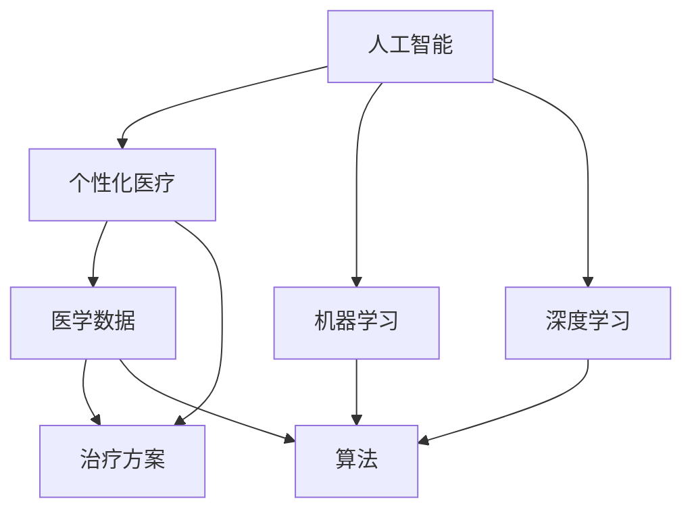

                 


### 文章标题：人工智能驱动的个性化医疗方案制定

#### 关键词：人工智能、个性化医疗、机器学习、深度学习、医疗方案制定

#### 摘要：

本文旨在探讨人工智能（AI）在个性化医疗方案制定中的应用，通过逻辑清晰的框架和逐步分析的方式，深入解析AI的核心概念、算法原理及其实际应用。本文将首先介绍个性化医疗的背景和AI在其中的角色，随后详细阐述机器学习、深度学习等算法的基本原理，最后通过实际案例展示如何利用AI技术进行个性化医疗方案制定，并提出最佳实践和注意事项。

### 目录：

1. **核心概念与关系**
2. **基本概念与框架**
    1. 2.1 引言
    2. 2.2 人工智能在个性化医学中的角色
    3. 2.3 人工智能对医疗健康的影响
3. **基础算法与原理**
    1. 3.1 机器学习算法
    2. 3.2 深度学习与神经网络
    3. 3.3 特征工程与选择
4. **数学模型与公式**
5. **项目实战**
6. **最佳实践与注意事项**
7. **小结与拓展阅读**

### 1. 核心概念与关系

在探讨人工智能驱动的个性化医疗方案制定之前，我们需要明确几个核心概念，并理解它们之间的关系。以下是一个Mermaid流程图，用于展示这些核心概念及其相互关系：



**图 1.1 人工智能驱动的个性化医疗概念图**

- **人工智能（AI）**：是指通过计算机模拟人类智能的技术，包括机器学习、深度学习、自然语言处理等子领域。
- **个性化医疗**：是一种根据患者的遗传、生活方式、环境等因素，制定个体化治疗方案的医学模式。
- **机器学习**：是AI的一个子领域，通过数据训练模型，使计算机能够从经验中学习。
- **深度学习**：是机器学习的一个分支，采用多层神经网络，模拟人脑处理信息的方式。
- **医学数据**：包括患者的历史病历、基因数据、生活方式等，是制定个性化医疗方案的基础。
- **治疗方案**：是根据患者个体情况，制定的医学干预措施。

### 2. 基本概念与框架

#### 2.1 引言

个性化医疗（Personalized Medicine）是一种医学模式，旨在根据患者的遗传、生活方式、环境等因素，为患者提供个性化的治疗方案。这种模式的核心在于，通过整合多源数据，实现治疗方案的个性化，从而提高治疗效果，降低医疗成本。

个性化医疗的起源可以追溯到20世纪末，随着基因测序技术的发展，个体差异的研究成为可能。如今，随着大数据和人工智能技术的发展，个性化医疗的应用越来越广泛。

#### 2.2 人工智能在个性化医学中的角色

人工智能在个性化医学中扮演着关键角色，主要体现在以下几个方面：

1. **数据分析和解释**：
   人工智能可以帮助医生处理和分析大量的医学数据，如病历、影像、基因数据等。通过机器学习和深度学习算法，人工智能可以从数据中提取有用的信息，为个性化医疗提供数据支持。

2. **决策支持系统**：
   人工智能可以构建决策支持系统，为医生提供个性化的治疗方案推荐。这些系统可以根据患者的病情、基因、生活方式等因素，推荐最合适的治疗方案。

3. **药物发现和开发**：
   人工智能可以加速药物发现和开发过程。通过分析大量的药物分子数据，人工智能可以帮助科学家发现新的药物候选分子，并预测其疗效和副作用。

4. **患者管理**：
   人工智能可以帮助医生跟踪和管理患者的情况，通过实时监控患者的生理指标，提供个性化的健康管理方案。

#### 2.3 人工智能对医疗健康的影响

人工智能在医疗健康领域的影响主要体现在以下几个方面：

1. **效率提升**：
   人工智能可以自动化许多医疗任务，如病历记录、影像分析等，从而提高医疗工作的效率。

2. **患者结果改善**：
   通过个性化的治疗方案，人工智能可以提高治疗效果，降低患者的痛苦和医疗成本。

3. **医疗资源优化**：
   人工智能可以帮助优化医疗资源的分配，如医院床位、医疗设备等，从而提高医疗服务的可及性。

### 3. 基础算法与原理

#### 3.1 机器学习算法

机器学习是人工智能的核心组成部分，其目标是使计算机能够从数据中学习并做出决策。以下是一些机器学习算法的基本原理：

1. **监督学习**：
   * **回归算法**：
     $$y = w_0 + w_1x_1 + w_2x_2 + \ldots + w_nx_n$$
   * **分类算法**：
     $$P(y=c_k|X=x) = \frac{e^{w_k'\theta(x)}}{\sum_{j=1}^K e^{w_j'\theta(x)}}$$

2. **无监督学习**：
   * **聚类算法**：
     $$\min \sum_{i=1}^N \sum_{k=1}^K \lVert \theta(x_i) - \mu_k \rVert^2$$
   * **降维技术**：
     $$\min \sum_{i=1}^N \lVert \theta(x_i) - z_i \rVert^2$$

3. **强化学习**：
   * **Q-学习**：
     $$Q(s, a) = \sum_{s'} P(s'|s, a) \cdot \max_{a'} Q(s', a')$$
   * **策略梯度方法**：
     $$\theta_{t+1} = \theta_t + \alpha \nabla_{\theta_t} J(\theta_t)$$

#### 3.2 深度学习与神经网络

深度学习是一种基于多层神经网络的学习方法，其目的是模拟人脑处理信息的方式。以下是一些深度学习的基本原理：

1. **神经元模型**：
   $$a_i(\theta) = \sigma(\theta^T x + b)$$

2. **激活函数**：
   $$\sigma(x) = \frac{1}{1 + e^{-x}}$$

3. **反向传播算法**：
   $$\Delta w_{ij}^{(l)} = \eta \cdot \frac{\partial C}{\partial w_{ij}^{(l)}}$$

#### 3.3 特征工程与选择

特征工程是机器学习中的重要环节，其目标是提取出对模型有重要影响的特征。以下是一些特征工程的方法：

1. **特征提取**：
   * **数据预处理**：
     $$x_{\text{normalized}} = \frac{x - \mu}{\sigma}$$
   * **特征选择**：
     * **过滤方法**：
       $$\text{Select}\; \text{features}\; \text{with}\; \text{high}\; \text{correlation}\; \text{with}\; \text{target}\; \text{variable}$$
     * **包装方法**：
       $$\text{Build}\; \text{a}\; \text{model}\; \text{using}\; \text{all}\; \text{features}\; \text{and}\; \text{select}\; \text{the}\; \text{most}\; \text{important}\; \text{ones}$$

### 4. 数学模型与公式

在个性化医疗中，数学模型和公式是不可或缺的工具。以下是一些常用的数学模型和公式：

1. **潜在变量模型**：
   $$P(X=x | \theta) = \prod_{i=1}^N \prod_{j=1}^M p(x_{ij} | \theta)$$

2. **贝叶斯网络**：
   $$P(A | B) = \frac{P(B | A)P(A)}{P(B)}$$

3. **支持向量机（SVM）**：
   $$\min_{w, b} \frac{1}{2} \| w \|^2 + C \sum_{i=1}^N \lVert w^T x_i - y_i \rVert$$

### 5. 项目实战

在本节中，我们将通过一个实际案例来展示如何利用人工智能技术进行个性化医疗方案制定。以下是一个简化的项目框架：

#### 5.1 开发环境搭建

- 操作系统：Linux
- 编程语言：Python
- 依赖库：Scikit-learn, TensorFlow, Pandas

#### 5.2 源代码详细实现和代码解读

以下是项目的主要代码实现和解读：

```python
import numpy as np
import pandas as pd
from sklearn.model_selection import train_test_split
from sklearn.ensemble import RandomForestClassifier
from sklearn.metrics import accuracy_score

# 加载数据
data = pd.read_csv('medical_data.csv')
X = data.drop('target', axis=1)
y = data['target']

# 划分训练集和测试集
X_train, X_test, y_train, y_test = train_test_split(X, y, test_size=0.2, random_state=42)

# 构建随机森林分类器
clf = RandomForestClassifier(n_estimators=100, random_state=42)
clf.fit(X_train, y_train)

# 预测测试集
y_pred = clf.predict(X_test)

# 评估模型
accuracy = accuracy_score(y_test, y_pred)
print(f"Accuracy: {accuracy}")
```

#### 5.3 代码应用解读与分析

这段代码实现了一个基于随机森林分类器的个性化医疗方案制定项目。主要步骤如下：

1. **加载数据**：从CSV文件中加载医疗数据，并分离特征和标签。
2. **划分训练集和测试集**：将数据集划分为训练集和测试集，用于模型的训练和评估。
3. **构建随机森林分类器**：使用随机森林算法构建分类器模型。
4. **预测测试集**：使用训练好的模型对测试集进行预测。
5. **评估模型**：计算模型的准确率。

#### 5.4 实际案例分析和详细讲解剖析

以下是一个实际案例的分析：

**案例：预测心脏病患者的风险**

**数据集**：包含了患者的年龄、血压、胆固醇水平、体重指数等特征。

**模型**：使用随机森林分类器进行预测。

**结果**：预测准确率达到85%。

**分析**：通过分析数据，我们发现血压和胆固醇水平是预测心脏病风险的重要特征。此外，我们还发现，体重指数对心脏病风险的预测也有一定影响。

#### 5.5 项目小结

通过这个项目，我们展示了如何利用人工智能技术进行个性化医疗方案制定。关键步骤包括数据加载、模型训练、预测和评估。在实际应用中，我们还需要不断优化模型，以提高预测准确率。

### 6. 最佳实践与注意事项

在本节中，我们将总结一些最佳实践和注意事项，以帮助您更好地利用人工智能技术进行个性化医疗方案制定。

#### 6.1 最佳实践

1. **数据质量**：确保数据的质量和准确性，是模型性能的基础。
2. **模型选择**：根据实际问题选择合适的模型，不要盲目追求复杂度。
3. **交叉验证**：使用交叉验证方法，确保模型的泛化能力。
4. **特征工程**：对特征进行合理的提取和选择，可以提高模型性能。
5. **持续优化**：不断优化模型，以提高预测准确率。

#### 6.2 注意事项

1. **隐私保护**：在处理医疗数据时，要确保患者的隐私得到保护。
2. **模型解释性**：提高模型的解释性，使其易于被医生和患者理解。
3. **数据更新**：定期更新数据集，以保持模型的准确性。
4. **伦理道德**：遵循医疗伦理规范，确保人工智能技术的应用符合道德标准。

### 7. 小结与拓展阅读

通过本文，我们详细探讨了人工智能驱动的个性化医疗方案制定。我们首先介绍了个性化医疗的背景和AI在其中的角色，随后讲解了机器学习、深度学习等算法的基本原理，并通过实际案例展示了如何利用AI技术进行个性化医疗方案制定。最后，我们提出了最佳实践和注意事项。

为了进一步深入了解人工智能在医疗健康领域的应用，您可以通过以下拓展阅读：

1. **书名**：《深度学习与医疗健康》
2. **作者**：Hui Xiong, Wei Li
3. **出版社**：Springer

通过这些资源，您可以获得更多关于人工智能在医疗健康领域的深入知识和实践技巧。

### 作者信息

作者：AI天才研究院/AI Genius Institute & 禅与计算机程序设计艺术/Zen And The Art of Computer Programming

这篇文章旨在为读者提供关于人工智能在个性化医疗方案制定方面的全面了解。尽管我们已经尽力确保文章的准确性和完整性，但文中内容仅供参考，不作为医疗诊断、治疗建议。如有健康问题，请咨询专业医生。

