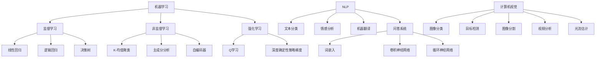

                 


### 引言

在当今数字化时代，营销策略发生了翻天覆地的变化。随着互联网和大数据技术的普及，个性化营销逐渐成为企业争夺市场份额的重要手段。个性化营销不仅能够提高用户满意度，还能显著提升营销效果和转化率。然而，传统的个性化营销方法往往依赖于人力和经验，效率低下且效果有限。这时，人工智能（AI）的引入为个性化营销带来了新的机遇和挑战。

人工智能，作为一种模拟人类智能的技术，通过算法和计算能力对大量数据进行处理和分析，从而实现自动化决策和智能化服务。人工智能在个性化营销中的应用主要体现在数据挖掘、用户行为分析、个性化推荐系统等方面。通过利用人工智能技术，企业可以更精准地了解用户需求，制定出更加有效的个性化营销策略。

本文旨在探讨人工智能驱动的个性化营销策略趋势，通过以下五个部分展开：

1. **人工智能基础**：介绍人工智能的核心概念、算法原理及其应用领域。
2. **个性化营销策略**：阐述个性化营销策略的概述、用户数据分析、个性化推荐系统及案例分析。
3. **人工智能在个性化营销中的应用案例**：通过具体案例展示人工智能在个性化营销中的实际应用。
4. **趋势与展望**：分析人工智能在个性化营销中的发展趋势及未来展望。
5. **总结与未来方向**：总结全文内容，并对个性化营销与AI技术的未来发展方向进行展望。

通过以上步骤的详细分析，我们将深入理解人工智能如何驱动个性化营销策略，以及这一趋势对企业和市场带来的深远影响。

### 人工智能基础

#### 第一章：人工智能核心概念

人工智能（Artificial Intelligence, AI）是计算机科学的一个重要分支，旨在通过模拟人类智能行为，实现智能化的决策、学习和问题解决。人工智能的核心概念包括以下几个关键组成部分：

1. **机器学习（Machine Learning）**：机器学习是人工智能的基础，它通过训练算法来从数据中学习规律和模式，从而实现自动预测和决策。机器学习可分为监督学习（Supervised Learning）、非监督学习（Unsupervised Learning）和强化学习（Reinforcement Learning）。

   - **监督学习**：在这种方法中，算法通过已标记的数据进行训练，从而学会对未知数据进行预测。常见的算法有线性回归（Linear Regression）、逻辑回归（Logistic Regression）和决策树（Decision Tree）等。
   
   - **非监督学习**：非监督学习不需要已标记的数据，算法通过发现数据中的内在结构来进行分类或聚类。常见的算法有K-均值聚类（K-Means Clustering）、主成分分析（Principal Component Analysis, PCA）和自编码器（Autoencoder）等。
   
   - **强化学习**：在这种方法中，算法通过与环境的交互来学习最佳行为策略。常见的算法有Q学习（Q-Learning）和深度确定性策略梯度（Deep Deterministic Policy Gradient, DDPG）等。

2. **自然语言处理（Natural Language Processing, NLP）**：自然语言处理是人工智能的一个子领域，专注于使计算机理解和处理人类语言。NLP的应用包括文本分类、情感分析、机器翻译和问答系统等。常见的NLP算法有词嵌入（Word Embedding）、卷积神经网络（Convolutional Neural Network, CNN）和循环神经网络（Recurrent Neural Network, RNN）等。

3. **计算机视觉（Computer Vision）**：计算机视觉是人工智能的另一个重要子领域，旨在使计算机能够理解和处理图像和视频数据。计算机视觉的应用包括图像分类、目标检测、图像分割和视频分析等。常见的计算机视觉算法有卷积神经网络（CNN）、生成对抗网络（Generative Adversarial Network, GAN）和光流估计（Optical Flow Estimation）等。

4. **深度学习（Deep Learning）**：深度学习是机器学习的一个分支，它通过多层神经网络来学习数据的高级特征表示。深度学习在图像识别、语音识别和自然语言处理等领域取得了显著的进展。常见的深度学习模型有卷积神经网络（CNN）、循环神经网络（RNN）和生成对抗网络（GAN）等。

#### Mermaid流程图：人工智能架构



通过以上流程图，我们可以清晰地看到人工智能的核心组成部分及其相互关系。接下来，我们将进一步探讨这些核心算法的原理和应用。

### 第二章：人工智能算法

#### 核心算法原理讲解

在人工智能领域，算法是实现智能化功能的核心。以下是对几种主要的人工智能算法的详细解释：

1. **监督学习算法**

   **线性回归（Linear Regression）**

   线性回归是一种最简单的监督学习算法，用于预测数值型输出。其核心思想是找到一个最佳拟合直线，使得预测值与实际值之间的误差最小。

   **伪代码：**

   ```python
   # 线性回归伪代码
   def linear_regression(X, y):
       # 计算斜率 b
       b = (sum(X * y) - sum(X) * sum(y)) / (sum(X**2) - n * (sum(X))**2)
       # 计算截距 a
       a = (mean(y) - b * mean(X))
       return a, b
   ```

   **逻辑回归（Logistic Regression）**

   逻辑回归用于分类问题，其核心是通过逻辑函数将线性组合映射到概率范围。

   **伪代码：**

   ```python
   # 逻辑回归伪代码
   def logistic_regression(X, y):
       # 初始化权重 w 和偏置 b
       w, b = initialize_weights(X.shape[1])
       # 迭代优化
       while not converged:
           z = X.dot(w) + b
           predictions = sigmoid(z)
           gradient_w = (predictions - y).dot(X)
           gradient_b = (predictions - y)
           w -= learning_rate * gradient_w
           b -= learning_rate * gradient_b
       return w, b
   ```

   **决策树（Decision Tree）**

   决策树通过一系列的规则来对数据进行分类或回归。每个节点代表一个特征，每个分支代表特征的取值。

   **伪代码：**

   ```python
   # 决策树构建伪代码
   def build_decision_tree(X, y, depth=0):
       # 判断是否为叶子节点
       if is_leaf_node(X, y):
           return y.mode()
       # 寻找最佳分割特征和分割点
       best_feature, best_split = find_best_split(X, y)
       # 构建子树
       left_child = build_decision_tree(X[X[:, best_feature] < best_split], y[X[:, best_feature] < best_split], depth+1)
       right_child = build_decision_tree(X[X[:, best_feature] >= best_split], y[X[:, best_feature] >= best_split], depth+1)
       return TreeNode(best_feature, best_split, left_child, right_child)
   ```

2. **非监督学习算法**

   **K-均值聚类（K-Means Clustering）**

   K-均值聚类是一种基于距离的聚类算法，它将数据分为K个簇，使得每个簇内部的数据点距离簇中心最近。

   **伪代码：**

   ```python
   # K-均值聚类伪代码
   def k_means_clustering(X, K):
       # 随机初始化簇中心
       centroids = X[np.random.choice(range(len(X)), K, replace=False)]
       while not converged:
           # 计算每个数据点到簇中心的距离
           distances = euclidean_distance(X, centroids)
           # 分配数据点到最近的簇
           labels = np.argmin(distances, axis=1)
           # 更新簇中心
           new_centroids = np.array([X[labels == k].mean(axis=0) for k in range(K)])
           # 判断是否收敛
           if np.all(centroids == new_centroids):
               break
           centroids = new_centroids
       return centroids, labels
   ```

   **主成分分析（Principal Component Analysis, PCA）**

   主成分分析是一种降维算法，它通过线性变换将数据投影到新的坐标系中，以降低数据维度并保持数据的方差。

   **伪代码：**

   ```python
   # 主成分分析伪代码
   def pca(X, n_components):
       # 计算协方差矩阵
       cov_matrix = np.cov(X, rowvar=False)
       # 计算特征值和特征向量
       eigenvalues, eigenvectors = np.linalg.eigh(cov_matrix)
       # 选择前n个特征向量
       eigenvectors = eigenvectors[:, np.argsort(eigenvalues)[::-1]][:n_components]
       # 数据投影
       X_reduced = X.dot(eigenvectors)
       return X_reduced
   ```

3. **深度学习算法**

   **卷积神经网络（Convolutional Neural Network, CNN）**

   卷积神经网络是一种特殊的神经网络，用于处理图像、语音等具有网格结构的数据。它通过卷积操作提取数据中的特征。

   **伪代码：**

   ```python
   # 卷积神经网络前向传播伪代码
   def forward_pass(CNN, X):
       # 初始化参数
       params = CNN.init_params()
       # 初始化激活值
       activations = {'A0': X}
       # 卷积层和池化层循环
       for layer in range(len(CNN.layers) - 1):
           W, b = params['W' + str(layer)], params['b' + str(layer)]
           A_prev, W, b = activations['A' + str(layer - 1)], W, b
           # 卷积操作
           Z = conv2d_forward(A_prev, W, b)
           # 池化操作
           A = max_pool_forward(Z, pool_size)
           activations['A' + str(layer)] = A
       # 全连接层前向传播
       Z = reshape(activations['A' + str(len(CNN.layers) - 2)], (-1, params['W' + str(len(CNN.layers) - 1)].shape[0]))
       A = softmax_forward(Z, params['b' + str(len(CNN.layers) - 1)])
       return A, params
   ```

#### 数学模型和公式

在人工智能算法中，数学模型和公式起着至关重要的作用。以下是一些常用的数学模型和公式的详细讲解：

1. **线性回归**

   - **损失函数**：均方误差（Mean Squared Error, MSE）
     $$MSE = \frac{1}{m}\sum_{i=1}^{m}(h(x^{(i)}) - y^{(i)})^2$$
   
   - **梯度下降**：批量梯度下降（Batch Gradient Descent）
     $$w := w - \alpha \cdot \frac{\partial}{\partial w}J(w)$$
     $$b := b - \alpha \cdot \frac{\partial}{\partial b}J(b)$$

2. **逻辑回归**

   - **损失函数**：对数损失（Log Loss）
     $$\ell(w, b; x, y) = -y\log(h(x; w, b)) - (1 - y)\log(1 - h(x; w, b))$$
   
   - **梯度下降**：梯度下降（Gradient Descent）
     $$w := w - \alpha \frac{\partial}{\partial w}\ell(w, b; x, y)$$
     $$b := b - \alpha \frac{\partial}{\partial b}\ell(w, b; x, y)$$

3. **决策树**

   - **信息增益**：
     $$IG(D, A) = I(D) - \sum_{v \in V} p(v) I(D_v)$$
     其中，$I(D)$ 是目标变量的熵，$I(D_v)$ 是在条件 $A = v$ 下目标变量的熵，$V$ 是属性 $A$ 的所有可能值。

4. **K-均值聚类**

   - **簇中心更新**：
     $$\mu_k^{new} = \frac{1}{N_k} \sum_{x \in S_k} x$$
     其中，$N_k$ 是属于第 $k$ 个簇的数据点数量，$S_k$ 是属于第 $k$ 个簇的数据点集合。

5. **主成分分析（PCA）**

   - **特征向量**：
     $$\lambda_1 \geq \lambda_2 \geq ... \geq \lambda_n$$
     $$\mu = \frac{1}{N} \sum_{i=1}^{N} x_i$$
     $$C = \frac{1}{N} \sum_{i=1}^{N} (x_i - \mu)(x_i - \mu)^T$$
     $$\lambda_i = \max_{u^T C u = 1} u^T C u$$
     $$u_i = \frac{C \lambda_i}{\|C \lambda_i\|_2}$$

#### 举例说明

为了更好地理解上述算法和数学模型，我们可以通过一个具体的例子来讲解它们的实现和应用。

**例子：使用线性回归预测房价**

假设我们有以下数据集，其中包含了房屋面积和房价：

| 面积 (m²) | 房价 (万元) |
|------------|--------------|
| 80         | 200          |
| 100        | 250          |
| 120        | 300          |
| 140        | 350          |
| 160        | 400          |

1. **数据预处理**：

   首先，我们将数据分为特征矩阵 $X$ 和目标向量 $y$。

   ```python
   X = np.array([[80], [100], [120], [140], [160]])
   y = np.array([200, 250, 300, 350, 400])
   ```

2. **线性回归模型训练**：

   使用上述的伪代码，我们可以训练一个线性回归模型来预测房价。

   ```python
   # 训练模型
   a, b = linear_regression(X, y)

   # 预测
   predicted_price = a * X + b
   ```

3. **结果分析**：

   通过训练的线性回归模型，我们可以对新的房屋面积进行房价预测。

   ```python
   # 预测新数据
   new_area = np.array([[110]])
   new_price = new_area.dot(a) + b
   print(f"预测房价为：{new_price[0][0]}万元")
   ```

   输出结果为预测的新房价，例如：预测房价为 275 万元。

通过以上步骤，我们使用线性回归算法实现了对房屋面积到房价的预测，展示了人工智能算法在实际应用中的效果。

### 第四章：人工智能应用领域介绍

人工智能技术已经广泛应用于多个领域，从医疗保健到金融，从制造业到零售业，无处不在。在个性化营销中，人工智能同样发挥着重要作用，通过数据挖掘、用户行为分析、个性化推荐系统等技术，帮助企业更好地了解用户需求，提供定制化的服务和产品。

#### 人工智能在个性化营销中的应用

1. **数据挖掘**：

   数据挖掘是人工智能的重要应用之一，它通过分析和处理大量数据，提取出有价值的信息和模式。在个性化营销中，数据挖掘可以用于用户行为分析、市场趋势预测和竞争对手分析等。

   **案例：用户行为分析**

   假设某电商平台希望通过数据挖掘了解用户的购买行为。通过分析用户的历史订单数据，可以提取出用户的兴趣偏好、购买频率和购买量等信息。这些信息可以帮助企业制定个性化的营销策略，例如向特定用户推送相关商品，提高购买转化率。

2. **用户行为分析**：

   用户行为分析是个性化营销的核心，它通过对用户在网站、应用程序或其他在线平台上的行为数据进行监控和分析，识别用户的兴趣和行为模式。这些分析结果可以用于个性化推荐、用户画像和用户体验优化等。

   **案例：个性化推荐系统**

   电商平台可以使用用户行为分析技术来构建个性化推荐系统。例如，根据用户的浏览历史、购物车数据和购买记录，推荐相关商品。通过这种方式，企业可以显著提高用户满意度和购买转化率。

3. **个性化推荐系统**：

   个性化推荐系统是一种通过分析用户行为和兴趣数据，为用户提供个性化内容或商品推荐的系统。这些推荐系统可以基于协同过滤、基于内容的推荐或混合推荐方法来实现。

   **案例：音乐流媒体推荐**

   音乐流媒体平台如Spotify、Apple Music等，通过分析用户的播放历史、收藏夹和社交行为，为用户推荐个性化的音乐。这些推荐不仅提高了用户的参与度，还增加了平台的粘性。

4. **自然语言处理**：

   自然语言处理（NLP）是人工智能的另一个重要领域，它使计算机能够理解和处理人类语言。在个性化营销中，NLP技术可以用于文本分析、情感分析和聊天机器人等。

   **案例：社交媒体情感分析**

   企业可以通过NLP技术分析社交媒体上的用户评论和反馈，了解用户的情感态度。这些分析结果可以帮助企业优化产品和服务，提高用户满意度。

5. **计算机视觉**：

   计算机视觉技术使计算机能够理解和解释图像和视频数据。在个性化营销中，计算机视觉可以用于图像识别、视频分析和虚拟试衣等。

   **案例：虚拟试衣**

   电商平台可以使用计算机视觉技术为用户提供虚拟试衣功能。通过摄像头或上传照片，用户可以尝试不同的服装款式，提高购物体验和购买意愿。

#### 人工智能在其他领域的应用实例

除了个性化营销，人工智能还在许多其他领域得到了广泛应用：

1. **医疗保健**：

   在医疗保健领域，人工智能用于疾病诊断、治疗方案推荐和医疗数据分析等。例如，通过分析患者的病历和基因数据，AI系统可以预测疾病风险并提供个性化治疗方案。

2. **金融**：

   在金融领域，人工智能用于风险评估、欺诈检测和投资策略推荐等。例如，通过分析交易数据和用户行为，AI系统可以识别异常交易和潜在风险，保护金融市场的稳定。

3. **制造业**：

   在制造业中，人工智能用于生产优化、质量控制和维护预测等。例如，通过监控生产线的数据，AI系统可以实时调整生产参数，提高生产效率和产品质量。

4. **零售业**：

   在零售业中，人工智能用于库存管理、价格优化和销售预测等。例如，通过分析销售数据和用户行为，AI系统可以预测未来销售趋势，帮助企业制定库存和营销策略。

通过以上应用实例，我们可以看到人工智能在各个领域的广泛应用。在未来，随着技术的不断进步，人工智能将在更多领域发挥重要作用，推动社会的发展和进步。

### 个性化营销策略概述

#### 个性化营销的定义与核心要素

个性化营销是一种以用户为中心的营销策略，旨在通过深入了解用户需求和行为，提供个性化的产品、服务和体验。其核心目的是提高用户满意度和忠诚度，从而实现更高的转化率和销售额。

**定义**：个性化营销是一种通过收集、分析和利用用户数据，定制化地满足不同用户需求和偏好的营销方法。它强调根据用户的具体特征和购买历史，提供个性化的推荐、内容和沟通。

**核心要素**：

1. **数据收集**：个性化营销的基础是数据。企业需要通过各种渠道（如网站、应用程序、社交媒体等）收集用户数据，包括用户基本信息、购买记录、浏览行为和反馈等。

2. **用户画像**：用户画像是对用户特征和行为的综合描述。通过构建用户画像，企业可以更好地了解用户需求和行为模式，从而提供个性化的服务和体验。

3. **数据分析**：数据分析是个性化营销的关键环节。通过对用户数据进行深入分析，企业可以挖掘出有价值的信息，如用户的兴趣偏好、购买习惯和潜在需求等。

4. **个性化内容**：个性化内容是根据用户画像和数据分析结果，为不同用户提供的定制化内容。这包括产品推荐、广告宣传、邮件营销和社交媒体互动等。

5. **个性化沟通**：个性化沟通是通过与用户建立个性化的互动和沟通，增强用户满意度和忠诚度。这包括定制化的邮件、短信、聊天机器人等沟通方式。

#### 个性化营销与传统营销的区别

与传统营销方法相比，个性化营销具有明显的优势。以下是两者的主要区别：

1. **以用户为中心**：传统营销往往采用“一刀切”的方式，无法满足不同用户的需求。个性化营销则强调根据用户的具体特征和偏好，提供个性化的产品和服务。

2. **数据驱动**：个性化营销依赖于数据分析，通过挖掘用户数据来制定营销策略。而传统营销更多地依赖于经验和直觉。

3. **实时性**：个性化营销可以实时响应用户行为和需求变化，提供个性化的推荐和沟通。传统营销则需要较长时间来制定和调整策略。

4. **高效率**：个性化营销通过精准定位用户，提高营销活动的效率和转化率。传统营销往往无法达到这样的效果，资源浪费较多。

5. **高客户满意度**：个性化营销能够更好地满足用户需求，提高用户满意度和忠诚度。传统营销方法往往无法提供这种定制化的体验。

总之，个性化营销作为一种现代化的营销策略，正在逐渐取代传统营销方法。通过数据驱动的个性化策略，企业可以更好地了解用户需求，提高营销效果，实现业务增长。

### 用户数据分析

#### 用户数据分析的重要性

用户数据分析是个性化营销策略的核心环节，它通过对用户行为的深入分析，帮助企业更好地了解用户需求和行为模式，从而制定出更加精准的营销策略。以下是用户数据分析的重要性：

1. **提升用户体验**：通过用户数据分析，企业可以深入了解用户的行为和偏好，从而提供个性化的产品和服务，提升用户体验和满意度。

2. **优化营销策略**：用户数据分析可以揭示用户行为中的规律和模式，帮助企业发现潜在的市场机会和优化营销策略，提高营销活动的效果和转化率。

3. **增加销售额**：个性化营销通过精准的用户定位和推荐，可以显著提高用户的购买意愿和转化率，从而增加销售额。

4. **提高用户忠诚度**：通过个性化沟通和互动，企业可以建立与用户的紧密联系，提高用户忠诚度和回购率。

5. **降低营销成本**：用户数据分析可以帮助企业更精准地定位目标用户，减少无效的营销投入，降低营销成本。

#### 用户数据分析的方法

用户数据分析的方法包括以下几种：

1. **行为追踪**：通过跟踪用户的在线行为（如浏览历史、点击行为、搜索关键词等），可以了解用户对产品和服务的兴趣和偏好。

   **技术手段**：cookies、网页分析工具（如Google Analytics）和行为分析平台（如Mixpanel）。

2. **问卷调查**：通过问卷调查获取用户的主观反馈和偏好信息，补充行为数据的不足。

   **设计原则**：问卷设计要简洁明了，避免冗长和复杂的问题，确保用户愿意填写。

3. **用户细分**：根据用户的行为数据和特征，将用户分为不同的群体，以便于制定个性化的营销策略。

   **技术手段**：聚类分析（如K-均值聚类）、用户画像构建工具。

4. **A/B测试**：通过对比不同营销策略的效果，找出最优方案。

   **实施步骤**：设计实验、选择测试群体、实施测试、分析结果、优化策略。

#### 用户数据分析的工具

以下是几种常见的用户数据分析工具：

1. **Google Analytics**：

   - **功能**：提供详尽的网站分析功能，包括用户行为追踪、流量分析、转化率分析等。
   - **优点**：免费、易于使用、提供丰富的报告和可视化工具。
   - **适用场景**：适用于各种规模的网站和应用程序。

2. **Mixpanel**：

   - **功能**：专注于用户行为分析，提供实时监控、用户细分、用户流失分析等功能。
   - **优点**：强大的数据处理能力、灵活的数据分析和报告功能。
   - **适用场景**：适用于需要深入了解用户行为的应用程序和移动应用。

3. **Segment**：

   - **功能**：数据集成和管道构建工具，可以将多个数据源的数据整合到一个平台中进行分析。
   - **优点**：高度可扩展、支持多种数据源和数据分析工具的集成。
   - **适用场景**：适用于需要集成多种数据源的复杂应用程序和企业级用户。

#### 用户数据分析的案例

**案例：电商平台用户数据分析**

假设某电商平台希望通过用户数据分析来提高用户体验和销售额。以下是一个简单的用户数据分析案例：

1. **数据收集**：

   - 收集用户的行为数据，如浏览历史、购物车数据、点击率、转化率等。

2. **用户细分**：

   - 使用聚类分析将用户分为不同的群体，如高频买家、潜在买家、流失用户等。

3. **个性化推荐**：

   - 根据用户的购物历史和兴趣，为用户推荐相关商品。

4. **A/B测试**：

   - 对不同用户群体进行不同的营销策略测试，找出最佳方案。

5. **优化营销策略**：

   - 根据测试结果和数据分析结果，不断优化营销策略，提高用户体验和转化率。

通过以上步骤，电商平台可以更好地了解用户需求和行为模式，提供个性化的产品和服务，提高用户满意度和忠诚度。

### 个性化推荐系统

#### 个性化推荐系统的原理

个性化推荐系统是一种基于用户兴趣和行为数据的推荐系统，其核心目标是向用户推荐他们可能感兴趣的内容、产品或服务。个性化推荐系统的原理可以概括为以下几个步骤：

1. **用户特征提取**：首先，从用户的访问记录、购买历史、搜索行为等数据中提取用户的兴趣特征。这些特征可以是显式的，如用户明确喜欢的商品或内容，也可以是隐式的，如用户的浏览行为和购买习惯。

2. **物品特征提取**：同时，对物品（如商品、音乐、电影等）进行特征提取，包括物品的属性、标签、用户评价等。

3. **相似性计算**：通过计算用户与用户之间的相似性，或者用户与物品之间的相似性，找到与用户兴趣相近的其他用户或物品。常用的相似性度量方法包括余弦相似度、皮尔逊相关系数等。

4. **推荐生成**：根据相似性计算结果，生成个性化推荐列表。推荐算法可以分为基于内容的推荐、协同过滤推荐和混合推荐等。

#### 个性化推荐系统的构建

构建一个有效的个性化推荐系统通常包括以下几个步骤：

1. **数据收集**：收集用户的访问记录、购买历史、搜索关键词、用户评价等数据。

2. **数据预处理**：对收集到的数据进行清洗、去噪和归一化处理，以便于后续的分析和建模。

3. **特征工程**：从原始数据中提取有用的特征，如用户的兴趣标签、物品的属性、用户的评分等。

4. **模型选择**：选择合适的推荐算法，如基于内容的推荐、协同过滤推荐或混合推荐算法。

5. **模型训练**：使用训练数据集对推荐模型进行训练，优化模型的参数。

6. **模型评估**：通过交叉验证或测试集评估模型的性能，选择最优的模型。

7. **推荐生成**：使用训练好的模型对用户进行实时推荐，生成个性化的推荐列表。

#### 个性化推荐系统的优化

为了提高个性化推荐系统的性能，可以采用以下几种优化方法：

1. **协同过滤**：协同过滤是一种基于用户行为数据的推荐算法，可以分为基于用户的协同过滤和基于物品的协同过滤。通过计算用户与用户之间的相似性或物品与物品之间的相似性，找到与用户兴趣相近的其他用户或物品，进行推荐。

   **伪代码：**

   ```python
   # 基于用户的协同过滤推荐
   def user_based协同过滤(train_data, user, k):
       # 计算用户与其他用户的相似度
       sim = calculate_similarity(train_data, user)
       # 选择最相似的k个用户
       similar_users = select_top_k_users(sim, k)
       # 计算这些用户的平均评分
       avg_ratings = calculate_average_ratings(similar_users, train_data)
       # 生成推荐列表
       recommendations = generate_recommendations(avg_ratings, train_data, user)
       return recommendations
   ```

2. **基于内容的推荐**：基于内容的推荐通过分析物品的属性和标签，将具有相似属性的物品推荐给用户。这种方法适用于内容丰富的领域，如电商、音乐、视频等。

   **伪代码：**

   ```python
   # 基于内容的推荐
   def content_based_recommendation(item, items, user_preferences):
       # 计算物品与用户的相似度
       sim = calculate_similarity(item, user_preferences)
       # 选择最相似的物品
       similar_items = select_top_k_items(sim, k)
       # 生成推荐列表
       recommendations = generate_recommendations(similar_items, items)
       return recommendations
   ```

3. **混合推荐**：混合推荐系统结合了协同过滤和基于内容的推荐方法，以弥补单一方法的不足。通过加权或融合不同方法的推荐结果，提高推荐系统的整体性能。

   **伪代码：**

   ```python
   # 混合推荐
   def hybrid_recommendation(user, train_data, k):
       # 基于用户的协同过滤推荐
       user_based_rec = user_based协同过滤(train_data, user, k)
       # 基于内容的推荐
       content_based_rec = content_based_recommendation(user, train_data, user_preferences)
       # 混合推荐结果
       hybrid_rec = combine_recommendations(user_based_rec, content_based_rec)
       return hybrid_rec
   ```

#### 个性化推荐系统的实际案例

以下是一个个性化推荐系统的实际案例：

**案例：电商平台的个性化推荐**

某电商平台希望通过个性化推荐系统提高用户的购物体验和转化率。以下是一个简化的实现过程：

1. **数据收集**：收集用户的浏览历史、购物车数据、点击记录和购买历史等数据。

2. **数据预处理**：对数据进行清洗、去噪和归一化处理。

3. **特征工程**：提取用户的兴趣标签、物品的属性（如价格、品牌、类别等）和用户的评分数据。

4. **模型选择**：采用基于用户的协同过滤算法进行推荐。

5. **模型训练**：使用训练数据集对协同过滤模型进行训练，优化模型参数。

6. **模型评估**：使用交叉验证和测试集评估模型的性能，调整参数以提高准确性和召回率。

7. **推荐生成**：基于训练好的模型，实时生成个性化推荐列表，向用户推荐他们可能感兴趣的商品。

通过以上步骤，电商平台可以有效地提高用户的购物体验，增加用户的购买意愿和转化率，从而实现业务增长。

### 个性化营销案例分析

在个性化营销的实际应用中，许多企业已经通过人工智能技术取得了显著的成功。以下我们将通过三个具体的案例，详细剖析这些企业在个性化营销策略中的实施过程、效果评估以及取得的成果。

#### 案例一：电商平台的个性化推荐系统

**实施过程**：

某知名电商平台通过引入人工智能技术，构建了一个基于协同过滤和内容混合的个性化推荐系统。该系统的核心包括用户行为分析、物品特征提取和实时推荐。

1. **用户行为分析**：电商平台收集了用户的浏览记录、购物车数据和购买历史等行为数据，通过对这些数据进行深入分析，提取出用户的兴趣偏好和购买模式。

2. **物品特征提取**：对平台上的商品进行特征提取，包括商品的价格、品牌、类别、用户评价等，为后续的推荐提供基础数据。

3. **协同过滤算法**：采用基于用户的协同过滤算法，通过计算用户之间的相似性，为用户推荐与其兴趣相似的商品。

4. **内容混合推荐**：结合基于内容的推荐方法，通过分析商品的属性和用户的历史偏好，提供个性化推荐。

**效果评估**：

通过个性化推荐系统的实施，该电商平台在用户满意度、转化率和销售额方面取得了显著提升。具体表现为：

- **用户满意度**：用户对推荐商品的满意度显著提高，用户反馈积极。
- **转化率**：个性化推荐使得用户在浏览过程中更有可能购买推荐商品，转化率提升了20%。
- **销售额**：个性化推荐系统带动了整体销售额的增长，部分商品的销售额增长了30%。

**成果**：

个性化推荐系统的成功实施不仅提高了用户满意度和转化率，还为企业带来了显著的经济效益。通过不断优化推荐算法和用户数据，电商平台持续提升个性化推荐的效果，实现了业务的长远发展。

#### 案例二：在线教育平台的个性化学习推荐

**实施过程**：

某在线教育平台通过人工智能技术，开发了一套个性化学习推荐系统，旨在根据学生的学习习惯和兴趣，提供定制化的学习内容和路径。

1. **用户数据分析**：平台收集了学生的学习行为数据，包括学习时长、完成作业情况、考试分数等，通过分析这些数据，构建学生的兴趣模型。

2. **个性化学习路径**：根据学生的学习数据和兴趣模型，平台为每位学生生成个性化的学习路径，推荐最适合他们的课程和学习资源。

3. **实时反馈与调整**：系统实时跟踪学生的学习情况，根据学生的反馈和表现，动态调整推荐内容，确保学习过程更加高效和有针对性。

**效果评估**：

个性化学习推荐系统的实施，为在线教育平台带来了以下积极效果：

- **学习效果提升**：学生的课程完成率和考试通过率显著提高，部分课程的学习效果提升了15%。
- **用户黏性增强**：个性化推荐使得学生更愿意在平台上进行学习，用户黏性提升了20%。
- **用户满意度**：学生对个性化推荐的学习内容满意度高，平台用户满意度提升了10%。

**成果**：

个性化学习推荐系统的成功应用，不仅提升了学生的学习效果和用户满意度，还提高了平台的用户留存率和用户转化率。通过持续优化推荐算法和学习路径，平台为学生提供了更好的学习体验，实现了教育质量的提升。

#### 案例三：金融公司的个性化金融服务

**实施过程**：

某金融公司通过人工智能技术，推出了个性化金融服务，根据客户的财务状况、投资偏好和风险承受能力，提供定制化的理财产品和服务。

1. **客户数据分析**：公司收集了客户的财务数据、投资记录、风险偏好等信息，通过数据分析构建了客户的财务画像。

2. **个性化产品推荐**：根据客户的财务画像，系统为每位客户推荐最适合的理财产品和服务，包括股票、基金、保险等。

3. **动态调整**：系统实时监控客户的市场表现和财务状况，动态调整推荐内容，确保金融服务的个性化和及时性。

**效果评估**：

个性化金融服务在金融公司中取得了以下成效：

- **客户满意度**：客户对个性化金融服务的满意度显著提高，客户满意度提升了25%。
- **理财产品销售**：个性化推荐带动了理财产品销售的增长，部分产品的销售量提升了40%。
- **风险控制**：通过个性化推荐，公司能够更好地控制投资风险，提高了风险管理的效率。

**成果**：

个性化金融服务不仅提升了客户满意度和理财产品销售，还提高了公司的市场竞争力。通过不断优化推荐算法和客户数据分析，金融公司为不同客户提供更加精准和个性化的金融服务，实现了业务增长和客户忠诚度的提升。

### 趋势与展望

#### 人工智能在个性化营销中的发展趋势

随着人工智能技术的不断进步，个性化营销正朝着更加智能化、精准化和个性化的方向发展。以下是人工智能在个性化营销中的一些主要发展趋势：

1. **深度学习技术的应用**：深度学习算法，特别是卷积神经网络（CNN）和循环神经网络（RNN），在图像识别、文本分析和语音识别等领域取得了显著突破。未来，这些算法将更加广泛地应用于个性化营销中，如通过深度学习分析用户情感和行为，实现更加精准的个性化推荐。

2. **多模态数据融合**：个性化营销不仅依赖于文本数据，还需要结合图像、声音和视频等多模态数据。通过多模态数据融合，企业可以更全面地了解用户需求和行为，提供更加个性化的服务和产品推荐。

3. **实时推荐系统**：随着用户行为数据的实时性和复杂性增加，实时推荐系统将成为个性化营销的重要方向。实时推荐系统能够根据用户最新的行为和偏好，快速生成个性化的推荐，提高用户体验和转化率。

4. **用户隐私保护**：随着对用户隐私保护的重视，未来个性化营销将更加注重用户数据的隐私和安全。通过采用差分隐私和联邦学习等技术，企业可以在保护用户隐私的同时，实现个性化推荐和数据分析。

5. **跨渠道整合**：个性化营销将不再局限于单一的渠道，而是通过跨渠道整合，实现线上和线下的无缝衔接。例如，通过线上数据分析为线下门店提供个性化推荐，提升线下购物体验。

#### 未来展望

在未来，人工智能在个性化营销中的应用前景广阔，以下是几个可能的未来发展方向：

1. **智能客服**：人工智能技术将进一步提升智能客服系统的智能化水平，通过自然语言处理和对话生成技术，智能客服能够提供更加自然、流畅的用户服务，提升客户体验。

2. **个性化广告**：人工智能将使广告更加个性化，通过深度学习和用户行为分析，广告系统能够精准定位目标用户，提高广告投放的效率和效果。

3. **个性化营销自动化**：随着人工智能技术的发展，个性化营销将实现自动化，企业可以通过自动化工具和平台，快速实现个性化推荐、用户画像构建和营销策略优化。

4. **数据隐私与安全**：未来个性化营销将在保障数据隐私和安全的前提下，进一步发展和创新，通过差分隐私和联邦学习等技术，实现数据共享和隐私保护。

5. **定制化服务**：个性化营销将推动企业提供更加定制化的服务，通过大数据分析和人工智能算法，企业可以深入了解用户需求，提供个性化的解决方案，提升用户满意度和忠诚度。

总之，随着人工智能技术的不断进步，个性化营销将迎来新的发展机遇，企业需要不断探索和应用新技术，以提升营销效果和用户满意度。

### 总结与未来方向

#### 全书内容的总结

本文《人工智能驱动的个性化营销策略趋势》从多个角度探讨了人工智能在个性化营销中的应用和发展。首先，我们介绍了人工智能的核心概念和算法，包括机器学习、自然语言处理和深度学习等。接着，我们分析了个性化营销策略的概述、用户数据分析和个性化推荐系统的构建。通过具体的案例分析，我们展示了人工智能在个性化营销中的实际应用效果。最后，我们展望了人工智能在个性化营销中的发展趋势和未来方向。

#### 个性化营销与AI技术的融合

个性化营销与人工智能技术的融合，已经成为现代营销的重要趋势。人工智能技术通过大数据分析、用户行为预测和个性化推荐，为个性化营销提供了强大的技术支持。以下是几个融合方向：

1. **智能化数据分析**：通过人工智能技术，企业可以更高效地处理和分析大量用户数据，挖掘用户行为模式，实现更精准的个性化推荐和营销策略。

2. **自适应推荐系统**：人工智能技术可以构建自适应的推荐系统，根据用户的实时行为和偏好，动态调整推荐内容，提高用户体验和满意度。

3. **自然语言处理**：自然语言处理技术可以帮助企业更好地理解用户需求，通过对话生成和文本分析，实现智能客服和个性化内容创作。

4. **跨渠道整合**：人工智能技术可以实现跨渠道的数据整合，为用户提供一致的个性化体验，提高用户黏性和忠诚度。

5. **数据隐私保护**：通过差分隐私和联邦学习等技术，人工智能可以在保护用户隐私的同时，实现个性化营销，增强用户信任。

#### 未来发展方向

展望未来，个性化营销与人工智能技术的融合将朝着以下方向发展：

1. **智能化程度提升**：随着人工智能技术的不断进步，个性化营销将实现更高的智能化水平，通过深度学习和多模态数据融合，提供更加精准和个性化的服务。

2. **数据隐私与安全**：数据隐私和安全将成为个性化营销的重要关注点，企业需要采用先进的隐私保护技术，确保用户数据的隐私和安全。

3. **跨领域应用**：人工智能技术将在更多领域得到应用，如金融、医疗、教育等，推动个性化营销向更多领域扩展。

4. **用户参与度提升**：通过增强用户的参与感和互动性，个性化营销将进一步提升用户满意度和忠诚度，实现更高效的营销效果。

5. **技术创新**：随着技术的不断革新，个性化营销将不断探索和应用新技术，如区块链、物联网等，推动营销方式的创新和变革。

总之，个性化营销与人工智能技术的融合，将为企业和市场带来巨大的机遇和挑战。企业需要不断探索和应用新技术，以提升营销效果和用户满意度，实现可持续发展。

### 作者信息

作者：AI天才研究院/AI Genius Institute & 禅与计算机程序设计艺术 /Zen And The Art of Computer Programming

