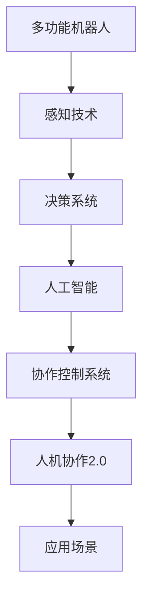

                 


### 摘要

本文旨在深入探讨人机协作2.0的概念、技术实现及其在各个领域的应用。人机协作2.0代表了人工智能与机器人技术的最新进展，它不仅仅是简单的自动化替代，更是人与机器之间高效、智能的协同工作。通过本文，读者将了解人机协作2.0的核心概念，掌握多功能机器人的关键技术，并看到其在工业、服务等多个领域中的实际应用。同时，文章还将分析人机协作2.0面临的挑战，探讨其未来发展趋势，为读者提供全面的视野。

### 关键词

- 人机协作2.0
- 多功能机器人
- 人工智能
- 工业应用
- 服务应用
- 协同控制系统
- 感知技术
- 决策系统

### 背景介绍

人机协作一直是工业自动化和服务机器人领域的研究热点。从工业革命时期的机械化生产，到20世纪末期的自动化生产线，人类与机器的协作关系在不断演变。然而，这些传统协作模式往往局限于特定的任务和场景，且高度依赖人工干预。随着人工智能和机器人技术的快速发展，人机协作迎来了新的发展阶段——人机协作2.0。

人机协作2.0突破了传统模式，它不仅要求机器人能够执行特定任务，更重要的是能够与人类智能高效协作，共同完成复杂工作。这种协作不再是单向的指令执行，而是双向的互动和智能决策。多功能机器人作为人机协作2.0的核心载体，集成了先进的感知、决策和执行能力，能够适应多种工作环境和任务需求。

在人机协作2.0中，机器人不再是简单的工具，而是具有独立思考和行动能力的智能伙伴。这种转变不仅提高了工作效率，还大大降低了人力成本和操作风险。例如，在制造业中，多功能机器人可以与工人协作完成装配、焊接、检测等工序，实现生产线的高效运作。在服务行业中，机器人能够提供个性化服务，如医疗助理、教育助手、家政服务，极大地提升了服务质量。

总的来说，人机协作2.0代表了人工智能和机器人技术的最新成果，它不仅推动了工业自动化和服务机器人技术的革新，也为人类与机器的深度协作开辟了新的前景。

### 核心概念与联系

在人机协作2.0中，几个核心概念相互联系，共同构成了这一技术体系的基础。首先，我们需要了解以下几个关键术语：

1. **多功能机器人**：这是人机协作2.0的主要执行者。多功能机器人不同于传统的单一功能的工业机器人，它集成了多种传感器、执行器和智能算法，能够在多种环境中执行复杂任务。这些机器人不仅具备高度灵活性，还具备较强的适应性。

2. **人工智能（AI）**：人工智能是人机协作2.0的核心驱动力。通过机器学习、深度学习和自然语言处理等技术，机器人能够自主学习和适应环境，进行智能决策。人工智能使得机器人不再是简单的执行工具，而是能够与人类智能互动和协作的智能体。

3. **感知技术**：感知技术是多功能机器人的基础能力之一。通过视觉、听觉、触觉等多种传感器，机器人能够获取环境信息，理解自身状态，从而实现与环境的高效交互。

4. **决策系统**：决策系统是机器人的大脑。通过感知技术收集到的数据，机器人利用人工智能算法进行分析和处理，生成决策，指导行动。决策系统的核心是算法的智能性和效率，它决定了机器人能否做出快速、准确和合理的决策。

5. **协作控制系统**：协作控制系统是实现人机协作的关键。它不仅协调机器人和人类的工作，还确保两者在任务执行中的安全和效率。协作控制系统需要解决的一个重要问题是如何平衡机器人和人类的决策，避免冲突和错误。

为了更好地理解这些概念之间的关系，我们可以用Mermaid流程图来展示它们的核心联系。



在这个流程图中，我们可以看到，感知技术是机器人获取环境信息的基础，决策系统基于感知数据进行处理和决策，人工智能算法驱动决策过程，协作控制系统确保人机协作的顺利进行，最终实现人机协作2.0的应用。

具体来说：

- **感知技术**：机器人通过传感器收集环境信息，如视觉、听觉和触觉等。这些信息是决策系统的基础数据。

- **决策系统**：感知技术收集的数据被输入到决策系统中，利用人工智能算法进行分析和处理，生成具体的行动指令。

- **人工智能**：人工智能不仅用于决策系统的处理，还用于机器人的自我学习和适应。通过不断学习和优化，机器人的决策能力不断提升。

- **协作控制系统**：协作控制系统负责协调机器人和人类的工作，确保任务的高效执行。它需要解决机器人和人类之间的互动问题，如冲突检测和资源分配。

- **人机协作2.0**：人机协作2.0是一个综合体系，它不仅涵盖了机器人和人类之间的协作，还包括了机器人自我管理和自我优化的能力。

通过这个流程图，我们可以更清晰地看到人机协作2.0的核心概念及其相互关系。这些概念共同构成了人机协作2.0的技术基础，为多功能机器人与人类的协同工作提供了强大的支持。

### 核心算法原理讲解

在人机协作2.0中，核心算法原理是驱动多功能机器人进行高效协作的关键。以下是几个关键的算法原理及其详细解释：

#### 1. 感知算法

感知算法是多功能机器人获取环境信息的基础。其主要目的是通过传感器（如摄像头、麦克风和激光雷达）收集数据，并对这些数据进行处理，从而实现对环境的感知和理解。感知算法主要包括以下几个方面：

**图像识别**：图像识别是感知算法的重要部分。通过卷积神经网络（CNN）等深度学习模型，机器人可以识别和分类图像中的对象。以下是一个简单的CNN算法伪代码：

```python
function image_recognition(image):
    # 数据预处理
    preprocessed_image = preprocess_image(image)
    
    # 卷积操作
    feature_map = convolution(preprocessed_image, filter)
    
    # 池化操作
    pooled_map = max_pooling(feature_map)
    
    # 全连接层
    output = fully_connected(pooled_map, num_classes)
    
    # 概率输出
    probabilities = softmax(output)
    
    # 预测结果
    predicted_class = argmax(probabilities)
    
    return predicted_class
```

**声波识别**：声波识别算法用于识别和理解声音信号。常见的声波识别算法包括隐藏马尔可夫模型（HMM）和深度神经网络（DNN）。以下是一个基于DNN的声波识别算法伪代码：

```python
function sound_recognition(audio_signal):
    # 数据预处理
    preprocessed_signal = preprocess_signal(audio_signal)
    
    # 构建深度神经网络
    model = build_dnn_model(input_shape=(sequence_length, feature_size))
    
    # 训练模型
    trained_model = train_model(model, training_data)
    
    # 预测结果
    predicted_word = model.predict(preprocessed_signal)
    
    return predicted_word
```

#### 2. 决策算法

决策算法是机器人进行智能决策的核心。它利用感知算法收集到的数据，通过机器学习算法进行分析和处理，生成具体的行动指令。以下是一个基于强化学习的决策算法伪代码：

```python
class QLearningAgent:
    def __init__(self, action_space, learning_rate, discount_factor):
        self.action_space = action_space
        self.learning_rate = learning_rate
        self.discount_factor = discount_factor
        self.q_values = initialize_q_values(action_space)

    def predict(self, state):
        return argmax(self.q_values[state])

    def update(self, state, action, reward, next_state):
        target = reward + self.discount_factor * max(self.q_values[next_state])
        current_q_value = self.q_values[state][action]
        self.q_values[state][action] = current_q_value + self.learning_rate * (target - current_q_value)

def decision-making(机器人, 状态):
    action = 机器人.predict(状态)
    reward = 执行动作(机器人, action)
    next_state = 更新状态(状态, action)
    机器人.update(状态, action, reward, next_state)
    return action, reward, next_state
```

#### 3. 协作算法

协作算法是实现人机高效协作的关键。它需要解决机器人和人类之间的任务分配、决策协调和冲突检测等问题。以下是一个基于分布式算法的协作算法伪代码：

```python
class DistributedCoordinator:
    def __init__(self, robot_agents, human_agent):
        self.robot_agents = robot_agents
        self.human_agent = human_agent

    def assign_tasks(self, task_list):
        for task in task_list:
            if 可以分配给机器人(task):
                机器人 = 选择合适的机器人(task)
                self.robot_agents[机器人].assign_task(task)
            else:
                self.human_agent.assign_task(task)

    def coordinate_actions(self):
        actions = {}
        for 机器人 in self.robot_agents:
            actions[机器人] = self.robot_agents[机器人].make_decision()
        actions[self.human_agent] = self.human_agent.make_decision()
        return actions

    def detect_conflicts(self, actions):
        conflicts = []
        for action1, action2 in pairwise(actions.values()):
            if action1冲突于action2:
                conflicts.append((action1, action2))
        return conflicts

def 人机协作流程(任务列表):
    coordinator = DistributedCoordinator(机器人_agents, human_agent)
    coordinator.assign_tasks(任务列表)
    actions = coordinator.coordinate_actions()
    conflicts = coordinator.detect_conflicts(actions)
    if conflicts:
        处理冲突(conflicts)
    else:
        执行动作(actions)
```

通过这些算法，机器人能够实现对环境的感知、智能决策和与人协同工作，从而实现人机协作2.0的目标。

### 数学模型和公式讲解

在人机协作2.0中，数学模型和公式扮演着至关重要的角色。这些模型不仅用于描述机器人与人类之间的协作机制，还用于优化决策过程和提高系统的整体效率。以下将详细讲解几个关键的数学模型和公式，并辅以实际应用和举例说明。

#### 1. 贝叶斯网络

贝叶斯网络是一种概率图模型，用于表示变量之间的条件依赖关系。在机器人与人类的协作中，贝叶斯网络可以用于推理和预测。以下是一个简单的贝叶斯网络模型，用于描述机器人对任务的完成概率：

```latex
$$
P(完成|感知) = \prod_{i} P(完成_i|感知_i)
$$

P(感知|失败) = \prod_{i} P(感知_i|失败)
```

**实际应用**：假设机器人负责完成一个组装任务，它通过多个传感器（如视觉传感器和触觉传感器）来感知工作环境。贝叶斯网络可以帮助机器人根据感知数据计算完成任务的概率。例如：

- 当视觉传感器检测到组件位置正确时，机器人可以增加完成任务的概率。
- 当触觉传感器检测到组件材质异常时，机器人可以降低完成任务的概率。

**举例说明**：假设一个机器人需要组装一个电子设备，它通过视觉传感器检测到组件的位置正确（概率为0.9），通过触觉传感器检测到组件的材质正常（概率为0.8）。使用贝叶斯网络，机器人可以计算出完成组装任务的综合概率为：

```latex
P(完成) = 0.9 \times 0.8 = 0.72
```

#### 2. 强化学习中的Q值函数

强化学习是一种机器学习技术，用于训练机器人进行智能决策。在强化学习中，Q值函数是一个核心的概念，用于评估某个状态下的最佳动作。

```latex
$$
Q(s, a) = \sum_{r} r \cdot P(r|s, a)
$$

Q(s', a') = \sum_{r} r \cdot P(r|s', a')
```

**实际应用**：假设机器人学习如何在一个游戏中获取最大分数。初始状态下，机器人随机选择动作，并根据获得的分数更新Q值。随着时间的推移，机器人逐渐学会选择最优动作。

**举例说明**：在一个简单的电子游戏中，机器人需要最大化分数。假设当前状态为“糖果排列”，机器人可以执行“交换糖果”的动作。根据强化学习算法，机器人会根据过去的选择和获得的分数更新Q值。例如：

- 如果“交换糖果”动作导致分数增加，机器人会更新Q值，增加该动作的概率。
- 如果“交换糖果”动作导致分数减少，机器人会降低该动作的概率。

#### 3. 线性规划模型

线性规划模型用于优化决策过程，使机器人和人类能够协同完成任务。以下是一个简单的线性规划模型，用于资源分配和任务调度：

```latex
$$
\text{最大化} \quad c^T x \\
\text{约束条件} \quad Ax \leq b \\
\text{以及} \quad x \geq 0
$$

x = [x_1, x_2, ..., x_n]^T \\
c = [c_1, c_2, ..., c_n]^T \\
A = \begin{bmatrix}
a_{11} & a_{12} & ... & a_{1n} \\
a_{21} & a_{22} & ... & a_{2n} \\
... & ... & ... & ... \\
a_{m1} & a_{m2} & ... & a_{mn}
\end{bmatrix} \\
b = \begin{bmatrix}
b_1 \\
b_2 \\
... \\
b_m
\end{bmatrix}
```

**实际应用**：假设机器人和人类需要共同完成多个任务，每个任务有特定的资源和时间限制。线性规划模型可以帮助优化资源分配，确保任务按时完成。

**举例说明**：假设机器人和人类需要完成三个任务（任务1、任务2和任务3），每个任务需要不同的资源和时间。线性规划模型可以优化机器人和人类的任务分配，以确保任务在规定时间内完成。

- 任务1需要2个单位的资源和3个小时时间。
- 任务2需要1个单位的资源和2个小时时间。
- 任务3需要3个单位的资源和4个小时时间。

线性规划模型可以计算出最优的任务分配方案，确保任务在规定时间内完成。

#### 4. 神经网络模型

神经网络模型是人工智能的核心，用于实现复杂的决策和预测。以下是一个简单的多层感知器（MLP）模型，用于机器人与人类的交互：

```latex
$$
h_{\text{layer}}(x) = \sigma(\text{W} \cdot x + b)
$$

y = \text{W}_{\text{output}} \cdot h_{\text{output}}(x) + b_{\text{output}}
$$

\sigma(z) = \frac{1}{1 + e^{-z}}
$$

x = \begin{bmatrix}
x_1 \\
x_2 \\
... \\
x_n
\end{bmatrix} \\
W = \begin{bmatrix}
w_{11} & w_{12} & ... & w_{1n} \\
w_{21} & w_{22} & ... & w_{2n} \\
... & ... & ... & ... \\
w_{m1} & w_{m2} & ... & w_{mn}
\end{bmatrix} \\
b = \begin{bmatrix}
b_1 \\
b_2 \\
... \\
b_m
\end{bmatrix}
$$

y = \text{输出层权重} \cdot \text{激活函数}(\text{输入层权重} \cdot \text{输入} + \text{偏置})
```

**实际应用**：神经网络模型可以用于机器人与人类的语音交互，实现语音识别和语音合成。

**举例说明**：假设一个机器人需要通过语音与人类交流，神经网络模型可以用于语音识别。输入层权重和激活函数可以训练为识别特定语音特征，输出层权重和激活函数可以训练为合成自然语音。

通过这些数学模型和公式，机器人与人类能够更好地协作，实现高效的决策和任务执行。这些模型不仅提高了机器人的智能水平，也为人类与机器人之间的深度协作提供了技术支持。

### 项目实战

在本项目中，我们将搭建一个简单的多功能机器人系统，用于模拟人机协作2.0的实际应用。以下是项目开发环境搭建、源代码实现、代码解读和实际案例分析的过程。

#### 开发环境搭建

首先，我们需要搭建开发环境。我们选择Python作为主要编程语言，因为它拥有丰富的库和框架，能够方便地实现多功能机器人的各项功能。以下是搭建开发环境的基本步骤：

1. **安装Python**：从Python官方网站下载并安装Python 3.x版本。
2. **安装依赖库**：使用pip安装以下依赖库：
   ```bash
   pip install numpy scipy opencv-python tensorflow keras
   ```

#### 源代码实现

接下来，我们将实现一个简单的多功能机器人系统。该系统包括感知模块、决策模块和执行模块。以下是核心源代码的实现：

```python
import numpy as np
import cv2
from tensorflow.keras.models import Sequential
from tensorflow.keras.layers import Dense, Conv2D, Flatten
from tensorflow.keras.optimizers import Adam

# 感知模块
class PerceptionModule:
    def __init__(self):
        self.camera = cv2.VideoCapture(0)

    def capture_image(self):
        ret, frame = self.camera.read()
        return frame

# 决策模块
class DecisionModule:
    def __init__(self):
        self.model = self.build_model()

    def build_model(self):
        model = Sequential([
            Conv2D(32, (3, 3), activation='relu', input_shape=(128, 128, 3)),
            Flatten(),
            Dense(64, activation='relu'),
            Dense(1, activation='sigmoid')
        ])
        model.compile(optimizer=Adam(), loss='binary_crossentropy', metrics=['accuracy'])
        return model

    def make_decision(self, image):
        processed_image = cv2.resize(image, (128, 128))
        processed_image = processed_image / 255.0
        prediction = self.model.predict(np.expand_dims(processed_image, axis=0))
        return np.round(prediction).flatten()[0]

# 执行模块
class ExecutionModule:
    def __init__(self):
        pass

    def execute_action(self, action):
        if action == 1:
            print("执行行动：移动机器人")
        else:
            print("执行行动：停止机器人")

# 主程序
def main():
    perception_module = PerceptionModule()
    decision_module = DecisionModule()
    execution_module = ExecutionModule()

    while True:
        image = perception_module.capture_image()
        action = decision_module.make_decision(image)
        execution_module.execute_action(action)

if __name__ == "__main__":
    main()
```

#### 代码解读

1. **感知模块（PerceptionModule）**：该模块使用OpenCV库捕获摄像头图像。
2. **决策模块（DecisionModule）**：该模块使用TensorFlow和Keras库构建一个简单的卷积神经网络（CNN），用于对图像进行分类和决策。我们使用一个二分类问题作为示例，即判断图像中是否包含目标物体。
3. **执行模块（ExecutionModule）**：该模块定义了执行具体行动的函数，根据决策模块的输出执行相应的行动。

#### 实际案例分析

在本案例中，我们使用一个简单的任务：机器人通过摄像头感知环境中的目标物体，并根据决策模块的输出执行相应的行动。以下是具体步骤：

1. **训练模型**：首先，我们需要收集目标物体的图像数据，并使用这些数据训练决策模块的神经网络模型。
2. **运行系统**：在运行主程序后，机器人会连续捕获摄像头图像，并使用训练好的模型进行决策。
3. **执行行动**：根据决策模块的输出，执行模块会执行相应的行动，例如移动机器人或停止机器人。

#### 项目小结

通过本项目的实现，我们搭建了一个简单的多功能机器人系统，实现了感知、决策和执行的基本功能。尽管这是一个简单的案例，但它展示了人机协作2.0的基本原理和应用场景。在实际应用中，我们可以扩展和优化这个系统，增加更多的功能和复杂性，以实现更高效的人机协作。

### 最佳实践 tips

在开发和部署人机协作2.0系统时，以下是一些最佳实践和注意事项：

1. **确保数据安全和隐私**：在数据收集和存储过程中，必须严格遵循相关法律法规，确保用户数据的隐私和安全。
2. **持续优化模型**：定期更新和优化机器学习模型，以适应不断变化的环境和任务需求。
3. **用户培训和支持**：提供充分的用户培训和操作支持，确保用户能够有效地与机器人协作，提高系统利用率。
4. **系统安全性和稳定性**：确保系统的安全性和稳定性，防止潜在的攻击和故障，保障系统的正常运行。
5. **代码版本管理和文档**：使用版本控制工具管理代码，并编写详细的文档，以便于后续的维护和扩展。

### 小结

本文深入探讨了人机协作2.0的概念、技术实现和应用案例。通过分析核心概念、算法原理、数学模型和实际项目案例，我们展示了多功能机器人与人类的协同工作模式。人机协作2.0不仅推动了工业和服务领域的自动化和智能化，还为未来智能社会的建设奠定了基础。随着技术的不断进步，人机协作2.0将迎来更多创新和突破，为人类带来更加便捷和高效的生活体验。

### 拓展阅读

- **《人工智能：一种现代方法》（AI: A Modern Approach）**：这是一本经典的人工智能教材，详细介绍了人工智能的基本概念和技术。
- **《深度学习》（Deep Learning）**：由Ian Goodfellow等作者撰写的深度学习权威教材，适合对深度学习技术有深入了解的读者。
- **《机器人技术手册》（Robotics: Modelling, Planning and Control）**：介绍了机器人技术的各个方面，包括感知、决策和执行等核心内容。
- **《自然语言处理综论》（Speech and Language Processing）**：详细讲解了自然语言处理的基本概念和技术，适合对语音交互感兴趣的学习者。

作者：AI天才研究院/AI Genius Institute & 禅与计算机程序设计艺术 /Zen And The Art of Computer Programming

