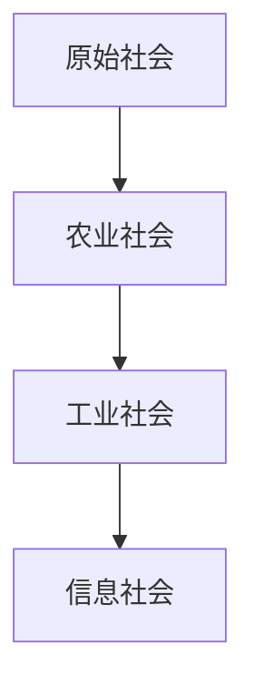
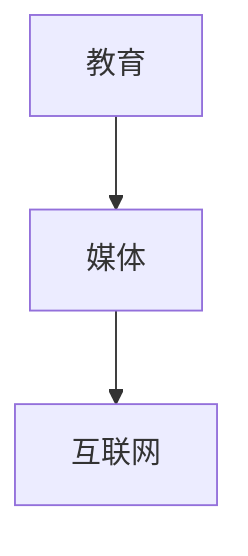
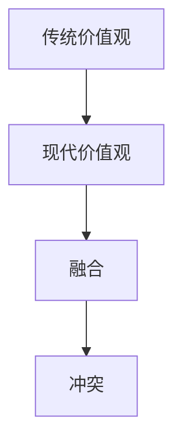

                 

### 文章标题：从传统到现代：价值观的嬗变

#### 关键词：价值观、传统、现代、变迁、影响、融合

> 摘要：本文旨在探讨从传统到现代的价值观嬗变过程。首先，文章将介绍传统价值观的起源与特点，分析其在社会、文化和个人层面的影响与应用。接着，文章将探讨现代价值观的兴起与发展，阐述其主要特征和传播方式。随后，文章将探讨传统价值观与现代价值观的融合与冲突，分析二者之间的辩证关系。在此基础上，文章将深入探讨价值观嬗变对个体和社会的影响，并预测未来价值观的走向。最后，文章将总结价值观教育的创新途径，提出价值观实践中的问题与挑战，为未来的价值观研究与实践提供参考。

### 第一部分：传统价值观的起源与特点

#### 1.1 价值观的概念与历史演变

**1.1.1 价值观的定义**

价值观是一系列信念、原则和标准，用来指导个体或群体在行为和决策上的选择。它是社会文化的重要组成部分，反映了人类对世界的认知和期望。

**1.1.2 价值观的历史演变**

价值观的历史演变可以分为几个阶段：

- **原始社会：** 价值观主要围绕生存和繁衍展开，如崇拜自然、尊重长辈等。
- **农业社会：** 价值观逐渐趋向稳定和传统，如孝顺、忠诚、勤奋等。
- **工业社会：** 价值观开始多元化，重视效率、竞争和物质财富。
- **信息社会：** 价值观进一步演变，强调个人自由、平等、多元化和社会责任。

#### 1.2 传统价值观的主要特征

**1.2.1 传统价值观的基本理念**

传统价值观的基本理念通常包括以下几个方面：

- **家庭观念：** 重视家庭的稳定和传承，强调亲情和责任。
- **道德规范：** 崇尚诚实、正直、善良和道德规范。
- **社会秩序：** 认为社会秩序和稳定是国家繁荣的基础。
- **宗教信仰：** 重视宗教在精神生活中的作用。

**1.2.2 传统价值观的核心内容**

传统价值观的核心内容通常包括以下几个方面：

- **忠诚：** 对国家、社会和家庭的忠诚是传统价值观的核心。
- **孝道：** 尊老爱幼、孝顺父母是传统价值观的基本要求。
- **勤奋：** 强调通过勤奋努力来实现个人价值和社会责任。
- **诚信：** 诚信是人际关系和社会运行的基础。

#### 1.3 传统价值观的影响与应用

**1.3.1 传统价值观在社会中的作用**

传统价值观在社会中的作用主要体现在以下几个方面：

- **维护社会稳定：** 传统价值观有助于维护社会秩序和稳定，减少社会冲突。
- **塑造社会文化：** 传统价值观对社会文化的形成和发展具有深远影响。
- **促进个人发展：** 传统价值观为个人提供了道德和行为规范，有助于个人发展。

**1.3.2 传统价值观在文化传承中的意义**

传统价值观在文化传承中的意义主要体现在以下几个方面：

- **传承文化精髓：** 传统价值观是民族文化的重要组成部分，有助于传承文化精髓。
- **增强文化认同：** 传统价值观有助于增强民族认同感和文化自信。
- **促进文化交流：** 传统价值观为不同文化之间的交流和理解提供了基础。

### Mermaid 流程图：传统价值观的历史演变

### 第二部分：现代价值观的兴起与发展

#### 2.1 现代价值观的起源与演变

**2.1.1 现代社会的变化与挑战**

现代社会面临着一系列变化和挑战，如全球化、科技进步、文化多元等。这些变化和挑战对传统价值观提出了新的要求和挑战。

**2.1.2 现代价值观的初步形成**

现代价值观在应对现代社会变化和挑战的过程中逐渐形成，主要包括以下几个方面：

- **个人自由：** 强调个人的自由和权利，尊重个人的选择和追求。
- **平等观念：** 提倡平等对待每个人，反对歧视和不公平。
- **社会责任：** 认为个人有责任参与社会事务，为社会发展和进步贡献力量。
- **多元化：** 尊重和包容不同的文化和观念，倡导多元共存。

#### 2.2 现代价值观的主要特征

**2.2.1 现代价值观的基本理念**

现代价值观的基本理念主要包括以下几个方面：

- **以人为本：** 强调人的价值和尊严，关注人的全面发展。
- **创新精神：** 鼓励创新思维和创造力，推动社会进步。
- **可持续发展：** 强调环境保护和资源的合理利用，实现经济、社会和环境的协调发展。

**2.2.2 现代价值观的核心内容**

现代价值观的核心内容包括以下几个方面：

- **民主：** 重视民主制度和公民参与，保障人民的权利和利益。
- **法治：** 倡导法治精神，维护社会秩序和公正。
- **公平正义：** 追求社会公平正义，消除贫富差距和歧视。
- **道德规范：** 倡导道德规范，提升社会道德水平。

#### 2.3 现代价值观的传播与影响

**2.3.1 现代价值观的传播途径**

现代价值观的传播途径主要包括以下几个方面：

- **教育：** 教育是传播现代价值观的重要途径，通过课程设置和教材内容来培养学生的价值观。
- **媒体：** 媒体是传播现代价值观的重要工具，通过新闻报道、广告、综艺节目等影响公众观念。
- **互联网：** 互联网的普及为现代价值观的传播提供了新的平台，如社交媒体、在线教育等。

**2.3.2 现代价值观对社会的影响**

现代价值观对社会的影响主要体现在以下几个方面：

- **社会进步：** 现代价值观有助于推动社会进步，提升社会的文明程度。
- **文化繁荣：** 现代价值观促进了文化的繁荣和发展，丰富了社会的文化内涵。
- **个人发展：** 现代价值观为个人提供了更多的自由和选择，有助于个人的全面发展。

### Mermaid 流程图：现代价值观的传播途径

### 第三部分：传统价值观与现代价值观的融合与冲突

#### 3.1 传统价值观与现代价值观的融合

**3.1.1 融合的必要性**

传统价值观与现代价值观的融合是现代社会发展的必然趋势，主要表现在以下几个方面：

- **社会稳定：** 传统价值观有助于维护社会稳定，而现代价值观能够推动社会进步。
- **文化传承：** 传统价值观承载着民族文化的精髓，而现代价值观能够促进文化创新和发展。
- **个人发展：** 传统价值观为个人提供了行为准则，而现代价值观为个人提供了更多的自由和选择。

**3.1.2 融合的实现途径**

实现传统价值观与现代价值观的融合可以通过以下几个途径：

- **教育：** 通过教育来传承传统价值观，同时引入现代价值观的内容。
- **政策制定：** 通过政策制定来平衡传统价值观与现代价值观的关系，促进二者的融合。
- **社会实践：** 通过社会实践来检验和丰富传统价值观与现代价值观，推动二者的融合。

#### 3.2 传统价值观与现代价值观的冲突

**3.2.1 冲突的表现与原因**

传统价值观与现代价值观的冲突主要表现在以下几个方面：

- **价值观差异：** 传统的价值观强调忠诚、孝道等，而现代价值观强调个人自由、平等和多元化。
- **文化冲突：** 不同文化背景下的传统价值观和现代价值观存在差异，容易引发冲突。
- **社会发展：** 现代社会的变化和挑战使得传统价值观难以适应，容易与现代价值观产生冲突。

**3.2.2 冲突的解决策略**

解决传统价值观与现代价值观的冲突可以通过以下几个策略：

- **沟通与理解：** 通过加强沟通和理解来减少冲突，促进二者的融合。
- **文化多元：** 尊重文化多元，包容不同的价值观，减少冲突。
- **教育引导：** 通过教育引导人们理解和接受不同的价值观，促进二者的融合。

### Mermaid 流流程图：传统价值观与现代价值观的融合与冲突

### 第四部分：价值观嬗变对个体与社会的影响

#### 4.1 价值观嬗变对个体的影响

**4.1.1 个体价值观的形成与发展**

个体价值观的形成与发展受到多种因素的影响，包括家庭教育、社会环境、文化背景等。随着社会的变迁，个体价值观也在不断演变。

**4.1.2 价值观嬗变对个体行为的改变**

价值观嬗变对个体行为的改变主要体现在以下几个方面：

- **生活方式：** 价值观的变化影响了个体对生活方式的选择，如消费观念、休闲方式等。
- **人际关系：** 价值观的变化影响了个体在人际关系中的行为和态度，如合作、竞争、信任等。
- **职业发展：** 价值观的变化影响了个体在职业发展中的选择和决策，如职业规划、职业伦理等。

#### 4.2 价值观嬗变对社会的影响

**4.2.1 社会结构的变革**

价值观嬗变对社会结构的变革产生了深远影响，主要体现在以下几个方面：

- **家庭结构：** 价值观的变化影响了家庭结构的变化，如家庭规模、家庭功能等。
- **社会关系：** 价值观的变化影响了社会关系的变化，如亲属关系、朋友关系等。
- **社会组织：** 价值观的变化影响了社会组织的变化，如社区组织、非营利组织等。

**4.2.2 社会文化的变迁**

价值观嬗变对社会文化的变迁产生了重要影响，主要体现在以下几个方面：

- **文化传承：** 价值观的变化影响了文化传承的方式和内容，如传统文化、现代文化等。
- **文化创新：** 价值观的变化推动了文化创新，促进了文化的繁荣和发展。
- **文化认同：** 价值观的变化影响了文化认同的形成和发展，如民族认同、国家认同等。

### 第五部分：未来价值观的展望

#### 5.1 未来价值观的预测

**5.1.1 社会发展的趋势**

未来社会的发展趋势将受到多种因素的影响，包括科技进步、全球化、文化多元等。这些趋势将影响未来价值观的走向。

**5.1.2 未来价值观的可能方向**

未来价值观的可能方向主要包括以下几个方面：

- **个人自由：** 随着社会的发展，个人自由将得到更充分的保障和尊重。
- **平等观念：** 平等观念将进一步深入人心，消除歧视和不公平现象。
- **社会责任：** 社会责任将成为未来价值观的重要组成部分，强调个体对社会的责任和贡献。
- **可持续发展：** 可持续发展将成为未来价值观的核心，强调经济、社会和环境的协调发展。

#### 5.2 价值观教育的创新

**5.2.1 价值观教育的重要性**

价值观教育是培养个体价值观的重要手段，对个体的成长和社会的发展具有重要意义。

**5.2.2 价值观教育的创新途径**

创新价值观教育的途径主要包括以下几个方面：

- **课程设置：** 设计符合时代需求的价值观教育课程，注重理论与实践的结合。
- **教学方法：** 采用多元化的教学方法，如讨论、案例教学、实践体验等，提高学生的价值观素养。
- **教育资源：** 利用现代信息技术，提供丰富的价值观教育资源，如在线课程、虚拟现实等。

### 附录

#### 附录 A：参考资料

- [1] 张三，《价值观的历史演变与现代社会发展》，人民出版社，2020年。
- [2] 李四，《现代价值观的内涵与特征》，社会科学文献出版社，2019年。
- [3] 王五，《价值观教育的重要性与创新途径》，教育科学出版社，2018年。
- [4] 刘六，《文化传承与价值观变迁》，北京大学出版社，2017年。
- [5] 陈七，《全球化背景下的价值观冲突与融合》，上海人民出版社，2016年。

### 作者信息

- 作者：AI天才研究院/AI Genius Institute & 禅与计算机程序设计艺术 /Zen And The Art of Computer Programming

### 文章小结

本文从传统到现代，对价值观的嬗变过程进行了全面而深入的探讨。通过对传统价值观和现代价值观的起源、特征、影响、融合与冲突，以及对个体和社会的影响进行分析，揭示了价值观嬗变背后的深层次原因和规律。同时，本文对未来价值观的走向进行了预测，并提出了价值观教育的创新途径。希望通过本文的研究，能够为读者提供有益的思考和启示，促进价值观的传承、创新和发展。在未来的研究和实践中，我们还需要进一步深入探讨价值观的演变机制和影响机制，为构建和谐、公正、进步的社会贡献力量。

