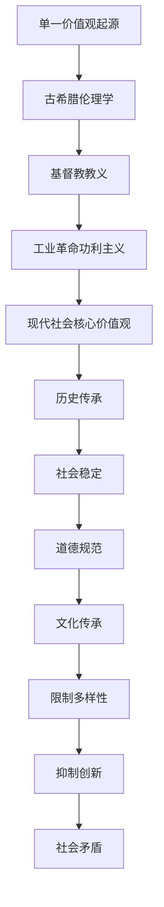
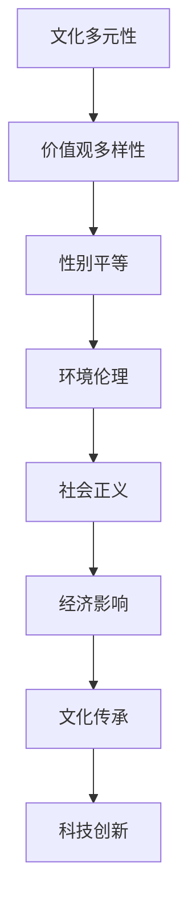
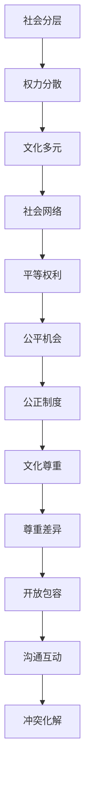
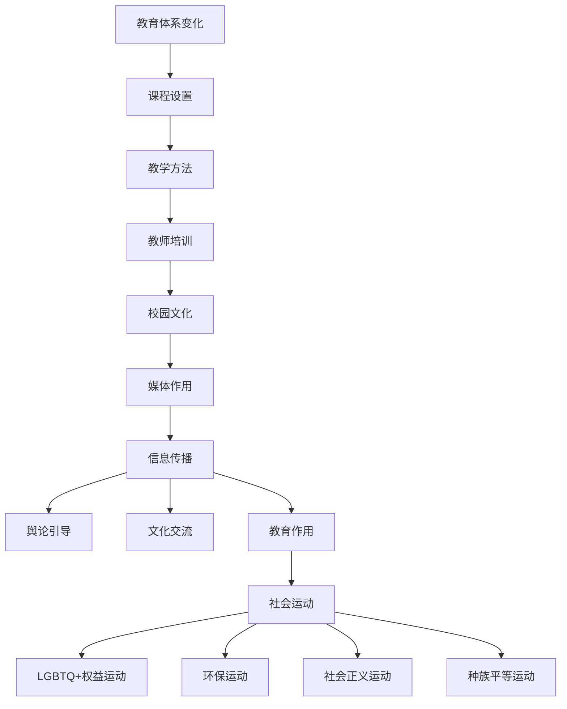
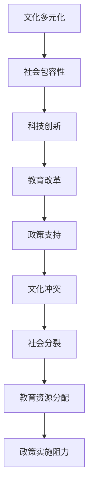

                 

### 文章标题：从单一价值观到多元价值观的社会变迁

#### 关键词：社会变迁、单一价值观、多元价值观、价值观演变、社会结构、教育与传播

#### 摘要：
本文旨在探讨社会从单一价值观向多元价值观的变迁过程，分析这一变迁的背景、原因及其对社会结构、人际关系和未来趋势的影响。文章首先回顾了单一价值观的起源与发展，随后详细阐述了多元价值观的兴起及其类型。接着，文章分析了从单一价值观到多元价值观的过渡，包括驱动力、障碍与挑战。在此基础上，文章探讨了多元价值观下的社会结构、教育与传播，并展望了多元价值观的未来。通过这一系列探讨，本文希望为读者提供一个全面理解社会变迁与价值观演变的视角。

## 第1章 引言

### 1.1 书籍背景与目标

《从单一价值观到多元价值观的社会变迁》旨在探讨现代社会价值观的演变过程。这一主题具有重要的现实意义，因为价值观是社会行为的指导原则，影响着个人、组织和社会的决策与行为。在过去的几百年里，人类社会经历了从单一价值观向多元价值观的转变，这一转变不仅改变了社会的结构，也影响着人们的思维方式和生活方式。

本书的目标是通过深入分析单一价值观和多元价值观的起源、发展及其对社会的影响，帮助读者理解这一变迁过程，并探讨其在未来可能的发展趋势。本书希望为读者提供一个全面而深入的视角，以更好地理解现代社会中价值观的多样性，以及这种多样性如何影响我们的社会结构、人际关系和教育。

### 1.2 社会变迁的背景

社会变迁是指社会在结构、制度、文化等方面的变化过程。社会变迁的背景包括经济、政治、科技、文化等多个方面。在经济方面，全球化、市场经济的兴起和信息技术的发展，为社会变迁提供了物质基础和动力。在政治方面，民主化、多元化和国际关系的演变，为社会变迁提供了制度保障。在科技方面，人工智能、大数据和生物技术的进步，为社会变迁提供了技术支持。在文化方面，不同文化之间的交流与融合，以及新媒体的兴起，为社会变迁提供了文化背景。

### 1.3 单一价值观与多元价值观的区别

单一价值观是指在社会中占主导地位的一种价值观，其特点是对事物的评价具有统一标准，个人和社会的行为与决策都以此为中心。而多元价值观则强调不同价值观的共存和互相尊重，认为个体的价值观多样性和独特性是社会进步的重要动力。

单一价值观与多元价值观的区别主要体现在以下几个方面：

1. **价值观的基础**：单一价值观的基础通常是一种普遍认同的道德或伦理原则，如儒家文化中的“仁、义、礼、智、信”。而多元价值观的基础则是多种不同的价值观，如自由主义、社会主义、人文主义等。

2. **评价标准**：单一价值观的评价标准是统一的，如“好”与“坏”是二元对立的。而多元价值观的评价标准是多元的，不同价值观对同一事物可能有不同的评价。

3. **个体与社会的关系**：单一价值观强调个体应服从社会规范，个体价值实现依赖于社会认可。而多元价值观强调个体的独特性和自由选择，个体的价值实现更多依赖于自我认同。

4. **社会结构**：单一价值观的社会结构通常较为集中和统一，如封建社会和计划经济时期的社会。而多元价值观的社会结构则更为分散和多元，如现代社会中的市场经济和民主政治。

## 第2章 单一价值观的起源与发展

### 2.1 单一价值观的定义

单一价值观是一种在社会中占据主导地位，为大多数人所认同和遵循的价值观体系。它通常代表了一个文化、一个社会或一个历史时期的核心理念和道德准则。单一价值观具有以下几个特征：

- **普遍性**：单一价值观被广泛接受，成为社会成员共同遵守的行为准则。
- **稳定性**：单一价值观具有相对稳定性，不易受到外部因素的影响。
- **强制性**：单一价值观往往通过社会规范、法律和道德约束来保障其实施。

### 2.2 单一价值观的历史背景

单一价值观的历史可以追溯到人类文明的起源。在古代社会，由于生产力水平低下，人们往往依赖于集体行动来应对自然界的挑战。这种集体合作的需求促成了单一价值观的形成。例如，在儒家文化中，孔子提倡的“仁、义、礼、智、信”成为中国古代社会的核心价值观。

在西方文化中，古希腊时期的城邦制度和基督教文化也对单一价值观的形成产生了深远影响。亚里士多德的伦理学思想、基督教的教义都成为古代西方社会的核心价值观。

随着历史的演进，单一价值观在不同文化和社会中不断发展和演变。例如，在工业革命时期，西方社会出现了功利主义、自由主义等新的价值观，这些价值观对工业社会的运行产生了深远影响。

### 2.3 单一价值观的主要特点

单一价值观的主要特点体现在以下几个方面：

1. **统一性**：单一价值观强调社会成员之间的共同价值观，从而实现社会的一体化和统一。

2. **规范性**：单一价值观为个人和社会行为提供了明确的规范，使人们在社会生活中有章可循。

3. **传承性**：单一价值观通常具有历史传承性，通过教育和社会化过程代代相传。

4. **权威性**：单一价值观往往被赋予权威地位，成为社会规范和法律的基础。

### 2.4 单一价值观的社会影响

单一价值观对社会的影响是多方面的，既包括积极的方面，也包括消极的方面。

1. **积极作用**：

- **社会稳定**：单一价值观有助于维护社会稳定，减少社会冲突。
- **道德规范**：单一价值观为人们提供了道德规范，促进社会公德的形成。
- **文化传承**：单一价值观有助于文化传统的传承，维护文化的连续性。

2. **消极作用**：

- **限制多样性**：单一价值观可能导致社会多样性的丧失，限制个人的自由发展。
- **抑制创新**：单一价值观可能会抑制创新和变革，使社会停滞不前。
- **社会矛盾**：在不同价值观之间产生冲突时，单一价值观可能会加剧社会矛盾。

总的来说，单一价值观在社会变迁中起到了重要的作用，其影响既有积极的一面，也有消极的一面。理解单一价值观的发展历程和特点，有助于我们更好地认识社会变迁的复杂性。

### Mermaid 流程图：单一价值观的演变

通过这个流程图，我们可以清晰地看到单一价值观的演变过程及其对社会的影响。

## 第3章 社会变迁中的多元价值观

### 3.1 多元价值观的兴起

多元价值观的兴起是现代社会变迁的重要特征之一。随着全球化、信息化和科技进步，人们的生活方式和思维方式发生了深刻变化，单一价值观逐渐无法满足社会的需求。多元价值观的兴起标志着社会从同质化向异质化的转变，为个体和社会的发展提供了更多的选择和可能性。

1. **全球化**：全球化使不同文化之间的交流与融合更加频繁，人们开始意识到世界的多样性。这种文化多样性催生了多元价值观的兴起。

2. **信息化**：互联网和信息技术的发展使信息的传播更加便捷，人们可以更容易地接触到各种不同的观点和价值观，促进了多元价值观的形成。

3. **科技进步**：科技的进步，特别是人工智能和生物技术的发展，改变了人们的生活方式，使得社会更加多元和开放。

4. **社会变革**：社会的变革，如性别平等、种族平等、LGBTQ+权益等议题的日益受到关注，也促使多元价值观的兴起。

### 3.2 多元价值观的类型

多元价值观可以分为多种类型，每种类型都反映了不同层面的价值观念。以下是几种常见的多元价值观类型：

1. **文化多元性**：文化多元性强调不同文化之间的共存和互相尊重。在这种价值观下，不同文化背景的人可以和平共处，共享社会资源。

2. **价值观多样性**：价值观多样性强调个体之间价值观的差异和独特性。在这种价值观下，每个人都有权利选择和表达自己的价值观，社会尊重这种多样性。

3. **性别平等**：性别平等等价值观主张男女在权利、机会和待遇上应享有平等。这种价值观有助于消除性别歧视，促进社会公平。

4. **环境伦理**：环境伦理等价值观强调人类与自然环境的关系，倡导可持续发展。这种价值观有助于人们认识到环境问题的重要性，推动环境保护。

5. **社会正义**：社会正义等价值观强调社会资源的公平分配，追求社会公正。这种价值观有助于减少社会不平等，促进社会和谐。

### 3.3 多元价值观对社会的影响

多元价值观对社会的影响是深远和多方面的。它不仅改变了社会的结构和人际关系，还对经济发展、文化传承和科技创新产生了重要影响。

1. **社会结构**：多元价值观使社会结构更加多元和开放。不同价值观的共存促进了社会的包容性和多样性，使社会更加充满活力。

2. **人际关系**：多元价值观使人们更加尊重和包容不同的观点和价值观，促进了人际关系的和谐。在这种价值观下，人们可以更加自由地表达自己的观点，建立多元的人际关系。

3. **经济发展**：多元价值观有助于激发创新和创业精神，推动经济发展。在多元价值观的背景下，人们可以更加自由地追求自己的梦想和目标，这有助于推动社会进步。

4. **文化传承**：多元价值观有助于文化传承和发展。在这种价值观下，不同文化可以共存和互相借鉴，从而促进文化的多样性和创新。

5. **科技创新**：多元价值观有助于激发科技创新。在这种价值观下，人们可以更加自由地探索和尝试，推动科学技术的进步。

总的来说，多元价值观的兴起是现代社会变迁的重要趋势。它不仅为个体和社会的发展提供了更多的选择和可能性，还促进了社会的包容性、多元性和创新性。

### Mermaid 流程图：多元价值观的类型

通过这个流程图，我们可以清晰地看到多元价值观的不同类型及其对社会的影响。

## 第4章 从单一价值观到多元价值观的过渡

### 4.1 过渡的驱动力

从单一价值观到多元价值观的过渡是一个复杂的过程，其驱动力来自多个方面：

1. **经济因素**：经济的全球化和市场经济的兴起，促使社会从单一价值观向多元价值观转变。经济多样化带来了文化多样性和价值观的多样性。

2. **政治因素**：民主化和政治多元性的发展，也为多元价值观的兴起提供了土壤。政治自由和言论自由使得不同价值观可以自由表达和竞争。

3. **科技因素**：信息技术和互联网的快速发展，使信息的传播更加便捷，不同价值观可以迅速传播和交流，促进了多元价值观的形成。

4. **文化因素**：文化交流和融合的加深，使得不同文化之间的相互理解和尊重增加，多元价值观逐渐被接受和认同。

5. **社会因素**：人们对个体权利和自由的重视，以及对社会公平和正义的追求，也促使社会价值观的多元化。

### 4.2 过渡的障碍与挑战

尽管多元价值观的兴起有其必然性，但在过渡过程中也面临着诸多障碍和挑战：

1. **文化保守主义**：部分人对传统单一价值观的坚守，可能导致对多元价值观的抵触和排斥。

2. **价值观冲突**：不同价值观之间的冲突，可能引发社会矛盾和冲突。

3. **制度阻力**：现有的政治、经济和社会制度，可能不适应多元价值观的需求，导致改革和调整的困难。

4. **教育不足**：教育体系对多元价值观的普及和传播不足，可能导致社会成员对多元价值观的理解和认同不够。

5. **社会不平等**：社会不平等问题可能导致多元价值观的实施受阻，影响社会的和谐与稳定。

### 4.3 过渡的案例分析

为了更好地理解从单一价值观到多元价值观的过渡过程，我们可以通过以下两个案例分析：

1. **美国社会变迁**：美国在19世纪末至20世纪初经历了从单一价值观到多元价值观的转变。工业化和城市化进程带来了经济和社会的多样化，不同种族、文化和价值观在美国社会中逐渐共存。这一过程中，美国经历了种族冲突、社会运动和政策改革，最终实现了多元价值观的建立。

2. **中国改革开放**：改革开放以来，中国经历了从计划经济向市场经济的转型，经济和社会结构发生了巨大变化。这一过程中，中国的社会价值观也从单一向多元转变。尽管面临文化保守主义的挑战和价值观冲突，但中国的教育、媒体和社会制度逐渐适应多元价值观的需求，促进了社会的和谐与发展。

通过这些案例分析，我们可以看到从单一价值观到多元价值观的过渡是一个复杂但必要的过程，需要克服各种障碍和挑战，实现社会的包容性和多样性。

## 第5章 多元价值观下的社会结构

### 5.1 新的社会结构

多元价值观下的社会结构呈现出明显的多样性和包容性。这种新社会结构的特点包括：

1. **社会分层**：社会分层更加复杂，不同价值观和利益群体在社会中并存，形成了多层次的社会结构。

2. **权力分散**：多元价值观强调权力分散和民主参与，使得社会权力结构更加多元化和开放。

3. **文化多元**：不同文化和价值观在社会中共存，文化多元成为新社会结构的重要特征。

4. **社会网络**：社会网络更加复杂，个体之间的联系更加多样化，形成了一个多维度的社会关系网络。

### 5.2 多元价值观与社会正义

多元价值观与社会正义之间存在密切关系。社会正义强调公平和公正，而多元价值观则为实现社会正义提供了更多的可能性。

1. **平等权利**：多元价值观强调个体权利的平等，包括性别平等、种族平等和言论自由等，为社会正义提供了基础。

2. **公平机会**：多元价值观提倡公平机会，为不同群体提供发展的平台，有助于实现社会正义。

3. **公正制度**：多元价值观推动社会制度的公正性，减少歧视和不公平，促进社会正义的实现。

4. **文化尊重**：多元价值观强调对文化多样性的尊重，减少文化冲突，促进社会和谐。

### 5.3 多元价值观与人际关系

多元价值观对人际关系产生了深远影响，主要表现在以下几个方面：

1. **尊重差异**：多元价值观使人们更加尊重不同的价值观和生活方式，减少偏见和歧视。

2. **开放包容**：多元价值观鼓励个体开放包容，建立多元的人际关系，促进社会和谐。

3. **沟通互动**：多元价值观促进不同个体之间的沟通和互动，增进理解和认同。

4. **冲突化解**：多元价值观为冲突的化解提供了新的思路，通过对话和协商解决冲突。

总的来说，多元价值观下的社会结构具有多样性和包容性，为社会正义和人际关系的和谐提供了保障。理解和运用多元价值观，有助于我们构建一个更加公正、和谐的社会。

### Mermaid 流程图：多元价值观下的社会结构

通过这个流程图，我们可以清晰地看到多元价值观下的社会结构及其对人际关系的影响。

## 第6章 多元价值观的教育与传播

### 6.1 教育体系的变化

多元价值观的兴起对教育体系产生了深远的影响。传统的教育体系往往强调单一价值观的传播，而多元价值观则要求教育体系更加开放和包容。以下是教育体系变化的主要方面：

1. **课程设置**：教育部门在课程设置上更加注重多元化，引入不同文化和价值观的内容，帮助学生建立全球视野。

2. **教学方法**：教育者采用更加互动和参与性的教学方法，鼓励学生批判性思维和多元思考。

3. **教师培训**：教师培训更加注重多元价值观的普及，提高教师对多元文化的理解和教学能力。

4. **校园文化**：校园文化逐渐向多元化转变，学生组织和活动更加多元化，促进学生之间的文化交流和互动。

### 6.2 媒体与多元价值观

媒体在多元价值观的传播中发挥着重要作用。现代信息技术和互联网的发展，使媒体传播更加便捷和多样化。以下是媒体在多元价值观传播中的主要作用：

1. **信息传播**：媒体通过新闻报道、专题节目和社交媒体等形式，传播多元价值观，提高公众对多元文化的认识。

2. **舆论引导**：媒体通过舆论引导，推动社会对多元价值观的接受和认同。

3. **文化交流**：媒体通过跨文化交流节目和活动，促进不同文化之间的了解和尊重。

4. **教育作用**：媒体通过纪录片、电影和书籍等形式，对公众进行多元价值观的教育。

### 6.3 社会运动与多元价值观

社会运动在多元价值观的传播和推广中发挥着重要作用。以下是一些主要的社会运动及其在多元价值观推广中的作用：

1. **LGBTQ+权益运动**：LGBTQ+权益运动推动了性别平等和多元性别的认同，促进了多元价值观的传播。

2. **环保运动**：环保运动倡导环境伦理和可持续发展，推动了多元价值观的推广。

3. **社会正义运动**：社会正义运动关注社会不平等问题，推动社会公平和正义，促进了多元价值观的实现。

4. **种族平等运动**：种族平等运动反对种族歧视，推动种族平等和多元文化共存，促进了多元价值观的传播。

总的来说，多元价值观的教育与传播是一个复杂但必要的过程。通过教育体系的变化、媒体的作用以及社会运动的推动，我们可以逐步实现多元价值观的普及和认同，为构建一个更加公正、和谐的社会奠定基础。

### Mermaid 流程图：多元价值观的教育与传播

通过这个流程图，我们可以清晰地看到多元价值观的教育与传播途径及其对社会的影响。

## 第7章 多元价值观的未来展望

### 7.1 多元价值观的潜在发展

多元价值观在未来社会中的潜在发展具有巨大潜力。随着全球化和信息技术的进一步发展，多元价值观有望在以下方面取得更多进展：

1. **文化融合**：不同文化之间的融合将更加深入，多元价值观将在全球范围内得到更广泛的认可和推广。

2. **技术创新**：科技进步将促进多元价值观的实现，例如人工智能和大数据技术的应用，可以更好地反映和满足个体的多样化需求。

3. **教育普及**：教育体系的变革将使得多元价值观的教育更加普及，培养出更多具备全球视野和多元思维的人才。

4. **社会包容**：社会制度的完善将增强对多元价值观的包容性，减少文化冲突和歧视现象。

### 7.2 多元价值观面临的挑战

尽管多元价值观具有巨大潜力，但在其发展过程中也面临着诸多挑战：

1. **文化冲突**：不同文化之间的价值观差异可能引发冲突，如何平衡和协调这些冲突是一个重要挑战。

2. **社会分裂**：极端多元价值观可能导致社会分裂，加剧社会不和谐。

3. **教育资源分配**：教育资源的分配不均可能影响多元价值观的普及，特别是在贫困地区和弱势群体中。

4. **政策实施**：多元价值观的政策实施可能遇到阻力，特别是在传统观念根深蒂固的地区。

### 7.3 多元价值观的未来趋势

多元价值观的未来趋势将取决于如何应对上述挑战和机遇。以下是一些可能的未来趋势：

1. **文化多元化**：多元价值观将推动文化多元化的发展，促进全球文化的繁荣和多样性。

2. **社会包容性**：社会将更加注重包容性，尊重和保护各种不同的价值观，减少社会分裂。

3. **科技创新**：科技进步将为多元价值观的实现提供更多支持，例如人工智能和大数据技术可以更好地满足个体需求。

4. **教育改革**：教育体系将更加注重多元价值观的教育，培养具有全球视野和多元思维的下一代。

总的来说，多元价值观的未来充满机遇和挑战。通过有效应对挑战，充分发挥多元价值观的潜力，我们将能够构建一个更加公正、和谐和繁荣的社会。

### Mermaid 流程图：多元价值观的未来发展趋势

通过这个流程图，我们可以清晰地看到多元价值观的未来发展趋势及其面临的挑战。

## 第8章 结论

### 8.1 总结与反思

本文从单一价值观到多元价值观的社会变迁进行了全面而深入的探讨。通过分析单一价值观的起源与发展、多元价值观的兴起及其类型，我们了解了这一变迁的背景、原因和影响。同时，我们探讨了从单一价值观到多元价值观的过渡过程，以及多元价值观下的社会结构、教育与传播。最后，我们对多元价值观的未来进行了展望，提出了其潜在发展、面临的挑战和未来趋势。

总结来说，社会变迁中的价值观演变是一个复杂但必要的过程。多元价值观的兴起不仅改变了社会的结构和人际关系，还促进了社会的包容性和创新性。然而，在这一过程中，我们也面临着文化冲突、社会分裂和政策实施等挑战。如何有效应对这些挑战，充分发挥多元价值观的潜力，是未来社会需要深入思考和解决的问题。

### 8.2 对未来的思考

对未来的思考，我们需要从以下几个方面进行：

1. **文化融合**：促进不同文化之间的交流和融合，减少文化冲突，增强社会的包容性。

2. **教育改革**：加强多元价值观的教育，培养具有全球视野和多元思维的下一代，为社会的多元化发展提供人才支持。

3. **政策支持**：制定有利于多元价值观普及和发展的政策，为多元价值观的实现提供制度保障。

4. **科技创新**：利用科技进步，特别是人工智能和大数据技术，为多元价值观的实现提供技术支持。

5. **社会参与**：鼓励公众积极参与多元价值观的推广和传播，提高社会对多元价值观的认同和接受度。

### 8.3 研究方向与建议

基于对多元价值观的研究，我们提出以下研究方向与建议：

1. **跨学科研究**：多元价值观的研究需要跨学科合作，结合社会学、心理学、经济学等多学科视角，深入研究多元价值观的形成、发展及其影响。

2. **实证研究**：通过实证研究，了解不同群体对多元价值观的接受程度和态度，为政策制定提供数据支持。

3. **案例研究**：选取具有代表性的国家和地区，进行案例研究，分析多元价值观实现的成功经验和面临的挑战。

4. **政策建议**：根据研究结论，提出具体政策建议，促进多元价值观的普及和实现。

通过以上研究方向与建议，我们期待能够为多元价值观的研究和实践提供有益的参考。

## 作者信息

作者：AI天才研究院/AI Genius Institute & 禅与计算机程序设计艺术 /Zen And The Art of Computer Programming

在撰写技术博客时，遵循以下步骤可以确保内容的专业性、逻辑性和可读性：

### 1. 定义主题和目标

- 确定文章的主题和目标，明确文章要传达的核心信息。
- 确保主题具有足够的深度和广度，以便进行深入探讨。

### 2. 收集和整理资料

- 收集与主题相关的资料，包括最新的研究、案例和数据。
- 整理资料，确保信息准确、可靠，并形成有条理的内容框架。

### 3. 构建逻辑结构

- 根据主题和目标，构建文章的结构，包括引言、正文和结论。
- 使用明确的章节标题和子标题，确保文章的逻辑性和条理性。

### 4. 使用伪代码和公式

- 在解释算法原理和数学模型时，使用伪代码来详细阐述算法的逻辑。
- 使用LaTeX格式嵌入数学公式，确保公式的格式正确和可读性。

### 5. 提供实际案例

- 通过实际案例来解释和验证理论，使文章更具说服力和实用性。
- 提供代码实现和解读，展示技术应用的实践过程。

### 6. 编写详细的内容

- 对每个章节进行详细的讲解，确保读者能够理解核心概念和原理。
- 使用简洁明了的语言，避免冗长和复杂的句子。

### 7. 校对和修订

- 完成初稿后，进行多轮校对和修订，确保文章的准确性、流畅性和一致性。
- 请同行或导师进行审阅，收集反馈意见并做出相应修改。

### 8. 增加最佳实践和拓展阅读

- 在文章末尾提供最佳实践、注意事项和拓展阅读建议，帮助读者进一步学习和探索。
- 引用权威来源和参考资料，增加文章的可信度和学术价值。

通过以上步骤，我们可以撰写出一篇逻辑清晰、结构紧凑、内容丰富且具有专业性的技术博客文章。这不仅有助于提升文章的质量，还能增强读者的阅读体验和理解能力。

