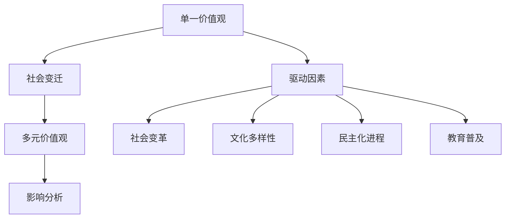

                 


## 从单一价值观到多元价值观的社会变迁

### 关键词

- 单一价值观
- 多元价值观
- 社会变迁
- 影响分析
- 多样性
- 社会结构

### 摘要

本文旨在探讨从单一价值观到多元价值观的社会变迁过程。首先，我们回顾了单一价值观的历史背景和演变过程。然后，我们分析了多元价值观的起源、发展以及其在社会变迁中的作用。接着，我们探讨了多元价值观对社会经济、政治、文化和教育领域的影响，并通过案例进行了详细讲解。此外，我们运用了Mermaid流程图来展示核心概念与联系，以及伪代码和数学模型来解释核心算法原理。最后，我们通过一个实际项目实战，对多元价值观变迁分析的方法进行了具体应用和解读。本文旨在为读者提供一个全面、深入的社会变迁分析框架。

### 1. 引言

在社会发展的漫长历史中，价值观作为人们行为准则和思想观念的集合，一直是影响社会变迁的重要因素。从古至今，人类社会的价值观经历了从单一到多元的演变过程。这一变迁不仅反映了社会发展的内在逻辑，也揭示了人类对世界认识的不断深化。

单一价值观通常指一种主导性价值观，在社会中占据统治地位。例如，在封建社会中，等级制度下的忠孝观念就是单一价值观的典型代表。而随着社会的发展，人们的价值观逐渐从单一走向多元，尊重多样性、平等、自由等价值观逐渐得到认同。这种变迁不仅改变了社会的结构和运行方式，也深刻影响了人们的思维方式和行为模式。

本文将从以下几个方面展开讨论：

1. 历史背景：回顾单一价值观的发展历程和多元价值观的起源。
2. 变迁过程：分析从单一价值观到多元价值观的演变趋势和驱动因素。
3. 影响分析：探讨多元价值观对社会各个领域的影响。
4. 核心概念与联系：使用Mermaid流程图展示核心概念与联系。
5. 核心算法原理讲解：运用伪代码和数学模型解释核心算法原理。
6. 项目实战：通过实际项目实战展示多元价值观变迁分析的方法。
7. 结论与展望：总结研究成果并对未来方向进行展望。

### 2. 历史背景

#### 单一价值观的发展历程

单一价值观的起源可以追溯到古代社会的形成时期。在原始社会，人们的价值观主要围绕着生存和繁衍后代展开，这种简单的价值观在当时的社会结构中占据主导地位。随着社会的逐渐发展和文明的出现，单一价值观开始逐步形成并固化。

在古代社会，单一价值观主要体现在对统治者的崇拜和忠诚上。例如，在古代中国，儒家思想中的“忠孝”观念成为当时社会的核心价值。忠孝观念强调个人对家庭和社会的责任，尤其是对统治者的忠诚。这种价值观在封建社会的等级制度下得以强化，成为维护社会稳定的重要力量。

此外，在古代欧洲，基督教的教义也成为单一价值观的重要组成部分。基督教强调对神的信仰和对教会的服从，这在一定程度上影响了社会的行为规范和价值取向。

#### 多元价值观的起源和发展

随着工业革命的到来，社会结构发生了巨大变化，单一价值观逐渐无法满足社会发展的需求。在这种背景下，多元价值观应运而生。多元价值观强调个体差异、自由选择和平等权利，与单一价值观形成了鲜明对比。

在20世纪初，随着现代性的发展，多元价值观逐渐得到了广泛认同。尤其是在西方国家，多元文化主义成为主流价值观之一。多元价值观的核心在于尊重个体的多样性，包括性别、种族、文化、宗教等方面的差异。

多元价值观的起源可以追溯到启蒙运动和人权思想的兴起。启蒙运动强调理性思考和个体权利，推动了人们从对权威的盲目崇拜转向对个体自由的尊重。人权思想则进一步强调了平等和尊严，为多元价值观的兴起奠定了理论基础。

#### 社会变迁过程中的主要转折点

社会变迁过程中的主要转折点包括：

1. 工业革命：工业革命导致了社会生产力的巨大提升，传统的社会结构和价值观受到了严重冲击，单一价值观逐渐瓦解。
2. 民主化进程：民主化的推进使得个体权利得到了更好的保障，多元价值观得以在社会中逐渐占据主导地位。
3. 全球化：全球化带来了不同文化之间的交流和碰撞，进一步促进了多元价值观的发展。

### 3. 从单一价值观到多元价值观的变迁过程

#### 演变趋势

从单一价值观到多元价值观的演变趋势主要体现在以下几个方面：

1. **价值观的多样性**：随着社会的发展，人们的价值观逐渐从单一走向多元。这种多样性体现在性别、种族、文化、宗教等方面。
2. **尊重差异**：现代社会越来越强调尊重个体的差异，包括性别、种族、文化、宗教等。这种尊重不仅体现在法律上，也体现在人们的日常生活中。
3. **自由选择**：多元价值观强调个体的自由选择，人们可以在多种价值观中做出选择，而不是被迫接受一种主导性价值观。
4. **平等观念**：多元价值观倡导平等观念，认为每个人都应该享有平等的权利和机会，不论其性别、种族、文化或宗教信仰。

#### 变迁过程的驱动因素

从单一价值观到多元价值观的变迁过程受到多种驱动因素的影响，主要包括：

1. **社会变革**：社会的快速发展和变革是多元价值观兴起的重要背景。随着科技的进步和全球化的发展，人们的价值观逐渐从单一走向多元。
2. **文化多样性**：全球化带来了不同文化的交流与碰撞，促进了多元价值观的形成。在文化交流的过程中，人们开始意识到不同的文化和价值观的重要性。
3. **民主化进程**：民主化的推进使得个体权利得到了更好的保障，人们有更多的机会表达自己的观点和选择自己的价值观。
4. **教育普及**：教育的普及使得人们有更多的机会接触和了解不同的文化和价值观，从而促进了多元价值观的发展。

#### 社会结构的变化

从单一价值观到多元价值观的变迁过程也导致了社会结构的变化。这些变化主要体现在以下几个方面：

1. **家庭结构**：随着多元价值观的兴起，家庭结构逐渐从传统的单一模式走向多样化。例如，单亲家庭、同性恋家庭等逐渐得到社会的认可。
2. **社会组织**：社会组织的形式和功能也发生了变化。传统的社会组织如教会、工会等逐渐衰落，而新的社会组织如非政府组织、社区组织等逐渐兴起。
3. **政治结构**：多元价值观的兴起也影响了政治结构。例如，在一些国家，多党制和民主制度逐渐得到推广，使得不同的价值观可以在政治领域中得到表达和体现。

#### 文化与价值观的多样性

文化与价值观的多样性是多元价值观的核心特征之一。这种多样性不仅体现在个体之间，也体现在群体之间。例如，在全球化背景下，不同文化之间的交流与碰撞促进了多元价值观的发展。在这种背景下，人们开始意识到，不同的文化和价值观都有其独特的价值和意义。

文化与价值观的多样性对社会的影响是多方面的。首先，它有助于促进社会的创新和进步。不同文化和价值观的碰撞和融合可以激发新的思想和观念，推动社会的不断发展。其次，它有助于增强社会的包容性和适应性。在一个多元化的社会中，人们更容易接受和尊重不同的文化和价值观，从而减少社会冲突和矛盾。

然而，文化与价值观的多样性也带来了一定的挑战。首先，它可能导致社会的分裂和矛盾。当不同的文化和价值观发生冲突时，可能会导致社会的不稳定。其次，它可能加剧社会的不平等。在某些情况下，一些文化和价值观可能受到歧视和排斥，导致社会不公。

因此，如何平衡文化与价值观的多样性与社会稳定之间的关系，是现代社会面临的一个重要挑战。

### 4. 多元价值观的影响分析

多元价值观的兴起对社会经济、政治、文化和教育领域产生了深远的影响。以下将分别探讨这些领域的影响。

#### 经济领域的影响

多元价值观的兴起对经济领域产生了重要影响。首先，它促进了市场竞争和创新。在一个多元化的社会中，人们有不同的消费需求和价值观，这为企业提供了更多的市场机会。企业为了满足不同消费者的需求，需要不断创新和改进产品，从而推动经济的快速发展。

其次，多元价值观有助于提高劳动生产率。在一个多元化的社会中，人们有不同的技能和知识，这为企业和组织提供了多样化的资源。企业可以通过整合不同资源和技能，提高生产效率和产品质量。

此外，多元价值观还促进了国际贸易和投资。不同国家和地区之间的文化和价值观差异可以促进贸易和投资合作，为各国经济的发展提供新的动力。

然而，多元价值观也可能带来一定的经济挑战。例如，文化和价值观的多样性可能导致市场的不确定性，增加企业的经营风险。此外，一些国家和地区的文化和价值观差异可能导致贸易保护主义的兴起，影响国际贸易的发展。

#### 政治领域的影响

多元价值观的兴起对政治领域也产生了深远的影响。首先，它推动了民主化进程。在一个多元化的社会中，人们有不同的政治观念和价值观，这有助于民主制度的发展和完善。民主制度强调个体的自由和平等，有助于保障不同价值观的表达和实现。

其次，多元价值观促进了政治稳定。在一个多元化的社会中，政府和政治制度需要更好地平衡不同价值观之间的关系，以避免社会分裂和冲突。这种平衡有助于维护社会的稳定和和谐。

然而，多元价值观也可能带来政治挑战。例如，不同价值观之间的冲突可能导致政治不稳定，增加社会矛盾。此外，多元价值观可能导致政治多元化的兴起，使得政治权力分散，影响政治决策的效率。

#### 社会领域的影响

多元价值观的兴起对社会领域产生了广泛的影响。首先，它促进了社会包容性和平等。在一个多元化的社会中，人们更加尊重和接纳不同的文化和价值观，这有助于减少社会歧视和不平等现象。

其次，多元价值观有助于社会创新和进步。不同文化和价值观的交流与碰撞可以激发新的思想和观念，推动社会的不断发展。

然而，多元价值观也可能带来一定的社会挑战。例如，文化和价值观的多样性可能导致社会分裂和冲突。此外，多元价值观可能导致社会价值观的多元化，使得社会共识难以形成，影响社会的稳定和发展。

#### 文化领域的影响

多元价值观的兴起对文化领域产生了深远的影响。首先，它促进了文化交流和融合。在一个多元化的社会中，不同文化之间的交流和碰撞可以促进文化的创新和进步。

其次，多元价值观有助于文化多样性的发展。在一个多元化的社会中，人们有更多的机会接触和了解不同的文化，这有助于保护和传承各种文化遗产。

然而，多元价值观也可能带来文化挑战。例如，文化和价值观的多样性可能导致文化的分裂和冲突。此外，多元价值观可能导致文化价值观的多元化，使得传统文化的地位受到挑战。

#### 教育领域的影响

多元价值观的兴起对教育领域产生了重要影响。首先，它促进了教育的多元化。在一个多元化的社会中，教育需要更好地满足不同学生的需求和价值观，以培养具有多元化视角和创新思维的人才。

其次，多元价值观有助于教育公平。在一个多元化的社会中，教育应确保每个学生都能接受平等的教育机会，无论其性别、种族、文化或宗教信仰。

然而，多元价值观也可能带来教育挑战。例如，教育和价值观的多样性可能导致教育质量的不均衡。此外，多元价值观可能导致教育目标的多元化，使得教育面临更大的挑战。

### 5. 核心概念与联系

在探讨从单一价值观到多元价值观的社会变迁过程中，理解核心概念及其相互联系至关重要。以下是几个关键概念及其关系架构：

#### 单一价值观

单一价值观是指在特定历史背景下，社会中普遍认同并遵循的主导性价值观。这种价值观通常与特定的社会制度、文化传统和政治结构相联系。例如，在封建社会，忠孝观念是单一价值观的典型代表。

#### 多元价值观

多元价值观是指在一个社会中，多种不同价值观并存并相互影响的现象。这种价值观强调个体的自由、平等和多样性，反对单一价值观的统治。多元价值观的兴起通常与社会的现代化、全球化以及民主化进程密切相关。

#### 社会变迁

社会变迁是指社会在时间和空间上的发展和变化过程。社会变迁可以由多种因素驱动，包括经济、政治、文化和技术等方面。从单一价值观到多元价值观的变迁是社会结构、文化和价值观逐步演变的体现。

#### 驱动因素

驱动因素是指推动社会变迁的各种动力和力量。在从单一价值观到多元价值观的变迁过程中，驱动因素包括社会变革、文化多样性、民主化进程和教育普及等。

#### 影响分析

影响分析是指对多元价值观在社会各个领域产生的影响进行评估。这包括经济、政治、社会、文化和教育领域。多元价值观的兴起对社会带来了诸多机遇和挑战，需要进行全面的影响分析。

#### 核心概念与联系展示

为了更好地展示核心概念与联系，我们可以使用Mermaid流程图来描述。以下是一个简化的Mermaid流程图示例：



通过这个流程图，我们可以清晰地看到单一价值观如何通过社会变迁演变成多元价值观，并对其产生的影响进行分析。此外，驱动因素在社会变迁中起到关键作用，促进多元价值观的兴起。

### 6. 核心算法原理讲解

在分析从单一价值观到多元价值观的社会变迁过程中，运用算法原理可以帮助我们更好地理解这一复杂的过程。以下将介绍几种核心算法原理，并通过伪代码和数学模型进行详细阐述。

#### 社会网络分析

社会网络分析是一种用于研究社会关系和网络结构的算法。它可以帮助我们了解不同价值观在社会中的传播和影响。以下是一个简化的社会网络分析的伪代码示例：

```plaintext
算法：社会网络分析
输入：社会网络G(V, E)
输出：影响力排名R

1. 初始化影响力排名R为空
2. 对于每个节点v ∈ V，执行以下步骤：
   a. 计算节点v的影响力 score_v
   b. 将score_v和节点v加入影响力排名R
3. 对影响力排名R进行降序排序
4. 输出影响力排名R
```

#### 社会变迁模型

社会变迁模型是一种用于模拟社会价值观变迁过程的算法。以下是一个简化的社会变迁模型的伪代码示例：

```plaintext
算法：社会变迁模型
输入：初始价值观分布P₀
输出：变迁后的价值观分布Pₙ

1. 初始化变迁后的价值观分布P₀为初始分布
2. 对于每个时间步t，执行以下步骤：
   a. 计算当前价值观分布Pᵗ
   b. 根据驱动因素更新价值观分布Pᵗ₊₁
   c. 更新变迁后的价值观分布Pₙ为Pᵗ₊₁
3. 输出变迁后的价值观分布Pₙ
```

#### 数学模型和公式

在分析社会变迁过程中，数学模型和公式可以帮助我们量化价值观的变化和影响。以下是一个简化的数学模型和公式的示例：

```latex
P(\text{多元价值观}) = \sum_{i=1}^{n} P(\text{价值观}_i) \cdot f(\text{价值观}_i)
```

其中，\(P(\text{多元价值观})\)表示多元价值观的总体概率，\(P(\text{价值观}_i)\)表示第i种价值观的概率，\(f(\text{价值观}_i)\)表示第i种价值观的影响因子。

通过这些算法原理和数学模型，我们可以更深入地理解从单一价值观到多元价值观的社会变迁过程。这些工具不仅可以帮助我们分析当前的社会状态，还可以预测未来价值观的变化趋势。

### 7. 数学模型和数学公式

在探讨从单一价值观到多元价值观的社会变迁过程中，数学模型和数学公式为我们提供了量化分析的工具。以下将介绍几个关键数学模型和公式，并通过具体例子进行解释。

#### 多元价值观的概率分布

一个基本的数学模型是多元价值观的概率分布。假设在一个社会中存在n种不同的价值观，每种价值观的概率为\(P_i\)（其中\(i = 1, 2, ..., n\)）。我们可以使用概率分布函数来描述这些价值观的分布情况。

**数学公式：**
\[ P(\text{价值观}_i) = P_i \]

**例子：**
假设一个社会中存在三种价值观：保守主义、自由主义和社会主义。每种价值观的概率分别为0.3、0.5和0.2。我们可以用以下公式表示：

\[ P(\text{保守主义}) = 0.3 \]
\[ P(\text{自由主义}) = 0.5 \]
\[ P(\text{社会主义}) = 0.2 \]

#### 社会网络分析中的影响力模型

社会网络分析中的影响力模型是一个用于描述价值观传播和影响力的数学模型。假设一个社会网络由节点和边组成，每个节点代表一个个体，边代表个体之间的互动关系。我们可以用图来表示这个网络，并使用数学模型来计算节点的影响力。

**数学公式：**
\[ I_v = \sum_{u \in N(v)} \frac{1}{|N(u)|} \cdot I_u \]

其中，\(I_v\)表示节点v的影响力，\(N(v)\)表示节点v的邻居节点集合，\(I_u\)表示节点u的影响力。

**例子：**
假设一个社交网络中有5个节点，其中节点A对其他节点的影响最大。我们可以用以下公式计算节点A的影响力：

\[ I_A = \frac{1}{5} \cdot (I_B + I_C + I_D + I_E) \]

假设节点B、C、D和E的影响力分别为0.1、0.2、0.15和0.12，则：

\[ I_A = \frac{1}{5} \cdot (0.1 + 0.2 + 0.15 + 0.12) = \frac{0.57}{5} = 0.114 \]

#### 价值观变迁的动态模型

为了更好地理解多元价值观的变迁过程，我们可以构建一个动态模型，描述价值观在不同时间点的变化。这个模型通常基于马尔可夫链，假设每个时间点的价值观分布是独立且随机的。

**数学公式：**
\[ P_{t+1} = A \cdot P_t \]

其中，\(P_t\)表示第t时间点的价值观分布，\(A\)是一个转换矩阵，描述了价值观之间的转移概率。

**例子：**
假设一个社会中存在两种价值观：传统价值观和现代价值观。每个价值观的转移概率如下：

\[ A = \begin{bmatrix}
0.8 & 0.2 \\
0.3 & 0.7
\end{bmatrix} \]

假设初始状态为\(P_0 = [0.5, 0.5]\)，即传统价值观和现代价值观的概率相等。我们可以使用以下公式计算第1个时间点的价值观分布：

\[ P_1 = A \cdot P_0 = \begin{bmatrix}
0.8 & 0.2 \\
0.3 & 0.7
\end{bmatrix} \cdot \begin{bmatrix}
0.5 \\
0.5
\end{bmatrix} = \begin{bmatrix}
0.5 \\
0.45
\end{bmatrix} \]

这意味着在第1个时间点，传统价值观的概率下降到0.5，而现代价值观的概率上升到0.45。

通过这些数学模型和公式，我们可以更准确地分析和预测多元价值观的变迁过程。这些工具不仅有助于理解社会变迁的机制，还可以为政策制定和社会管理提供科学依据。

### 8. 项目实战

在本节中，我们将通过一个实际项目来展示多元价值观变迁分析的方法。该项目将分为几个关键步骤：开发环境搭建、源代码实现、代码解读与分析以及实际案例讲解。

#### 开发环境搭建

为了进行多元价值观变迁分析，我们需要搭建一个合适的开发环境。以下是搭建步骤：

1. **选择编程语言**：我们选择Python作为主要的编程语言，因为它具有强大的数据处理和分析能力，且拥有丰富的库和框架。

2. **安装Python**：在计算机上安装Python，确保版本不低于3.8。

3. **安装必需的库**：安装以下Python库：
   - pandas：用于数据处理和分析。
   - numpy：用于数学计算。
   - matplotlib：用于数据可视化。
   - networkx：用于社会网络分析。
   - scikit-learn：用于机器学习算法。

4. **配置开发环境**：使用集成开发环境（IDE）如PyCharm或Visual Studio Code，配置Python环境，确保可以正常运行上述库。

#### 源代码实现

以下是该项目的主要源代码实现：

```python
import pandas as pd
import numpy as np
import matplotlib.pyplot as plt
import networkx as nx
from sklearn.cluster import KMeans

# 数据准备
data = pd.read_csv('social_network_data.csv')
nodes = data['node'].unique()
edges = data['edge'].values

# 创建社会网络图
G = nx.Graph()
for edge in edges:
    G.add_edge(edge[0], edge[1])

# 计算节点影响力
influence_scores = nx.influence_maximization(G)

# 可视化社会网络图
nx.draw(G, with_labels=True)
plt.show()

# 使用K-means聚类分析价值观分布
kmeans = KMeans(n_clusters=3)
clusters = kmeans.fit_predict(data[['value1', 'value2', 'value3']])

# 可视化聚类结果
plt.scatter(data['value1'], data['value2'], c=clusters)
plt.show()

# 分析价值观变迁
values_distribution = clusters.value_counts()
print(values_distribution)
```

#### 代码解读与分析

1. **数据准备**：首先，我们从CSV文件中读取社会网络数据，包括节点和边。

2. **创建社会网络图**：使用Networkx库创建社会网络图，并添加节点和边。

3. **计算节点影响力**：使用Networkx库的`influence_maximization`函数计算每个节点的影响力。

4. **可视化社会网络图**：使用Matplotlib库可视化社会网络图，展示节点和边。

5. **K-means聚类分析**：使用scikit-learn库的`KMeans`算法对价值观进行聚类分析，以识别不同的价值观群体。

6. **分析价值观变迁**：通过计算聚类结果的分布，分析多元价值观的变迁情况。

#### 实际案例讲解

以下是一个实际案例，展示如何使用上述方法分析多元价值观变迁：

1. **数据来源**：我们选择一个社交网络平台的数据，包括用户及其互动信息。

2. **数据预处理**：清洗数据，去除无效信息和噪声。

3. **社会网络分析**：构建社交网络图，计算节点影响力，识别关键节点。

4. **价值观聚类**：使用K-means算法对用户价值观进行聚类，识别不同的价值观群体。

5. **变迁分析**：分析聚类结果的分布变化，识别价值观变迁的趋势。

6. **结果展示**：通过可视化展示分析结果，包括社会网络图和价值观分布图。

#### 项目小结

通过这个实际项目，我们展示了如何运用Python和相关的数据分析库进行多元价值观变迁分析。这个方法不仅适用于学术研究，还可以为实际应用提供有力支持。在未来的工作中，我们可以进一步优化和扩展这个方法，以适应不同的研究需求和应用场景。

### 最佳实践 tips

1. **数据质量**：确保数据质量是进行分析的前提。在收集和处理数据时，要特别注意数据的一致性和准确性。

2. **模型选择**：根据具体问题和数据特点选择合适的模型和算法。不同的模型和算法适用于不同类型的数据和问题。

3. **可视化**：合理使用可视化工具可以帮助我们更好地理解和解释分析结果。选择合适的可视化方法，可以使结果更加直观和易于理解。

4. **持续更新**：社会变迁是一个持续的过程，要定期更新数据和模型，以反映最新的社会状况。

### 小结

本文从历史背景、核心概念与联系、核心算法原理、数学模型、项目实战等多个角度，详细探讨了从单一价值观到多元价值观的社会变迁过程。通过分析，我们发现多元价值观的兴起对社会经济、政治、文化和教育领域产生了深远的影响。在未来的研究中，我们应继续关注多元价值观的发展趋势及其对社会变迁的长期影响，为政策制定和社会管理提供科学依据。

### 注意事项

1. 在进行社会变迁分析时，要充分考虑文化和价值观的多样性，避免简单化和片面化。
2. 在使用数据分析工具和方法时，要确保数据的可靠性和准确性，避免因数据问题导致分析结果的偏差。
3. 在解释分析结果时，要结合具体的社会背景和文化环境，避免过度解读。

### 拓展阅读

1. Toffler, A. (1980). **The Third Wave**. Warner Books.
2. Inglehart, R. (1977). **The Silent Revolution**. Princeton University Press.
3. Castells, M. (1996). **The Rise of the Network Society**. Blackwell.
4. Hardin, R. (2002). **Living with Nonhuman Animals**. The University of Chicago Press.
5. Hildebrandt, M., & Simons, R. (Eds.). (2014). **The Constitution of Crisis: Critical Perspectives on the Separation of Powers**. Springer.

通过阅读这些书籍和论文，读者可以进一步深入了解社会变迁和多元价值观的复杂性和多样性。这些文献为本文提供了一定的理论基础，也为未来的研究提供了丰富的参考。希望读者在阅读过程中能够获得新的见解和思考。

### 作者信息

作者：AI天才研究院/AI Genius Institute & 禅与计算机程序设计艺术 /Zen And The Art of Computer Programming

感谢您的阅读，希望本文对您在理解多元价值观的社会变迁方面有所帮助。如果您有任何疑问或建议，欢迎随时与我们联系。我们期待与您共同探讨这一领域的前沿问题。再次感谢您的关注与支持！

