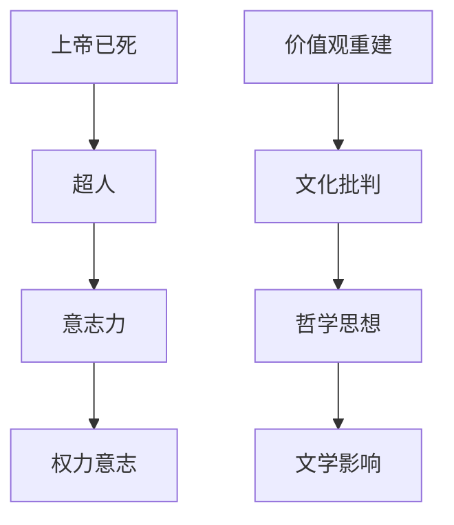
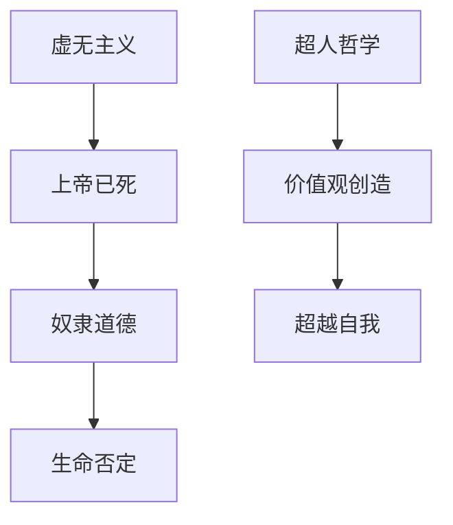
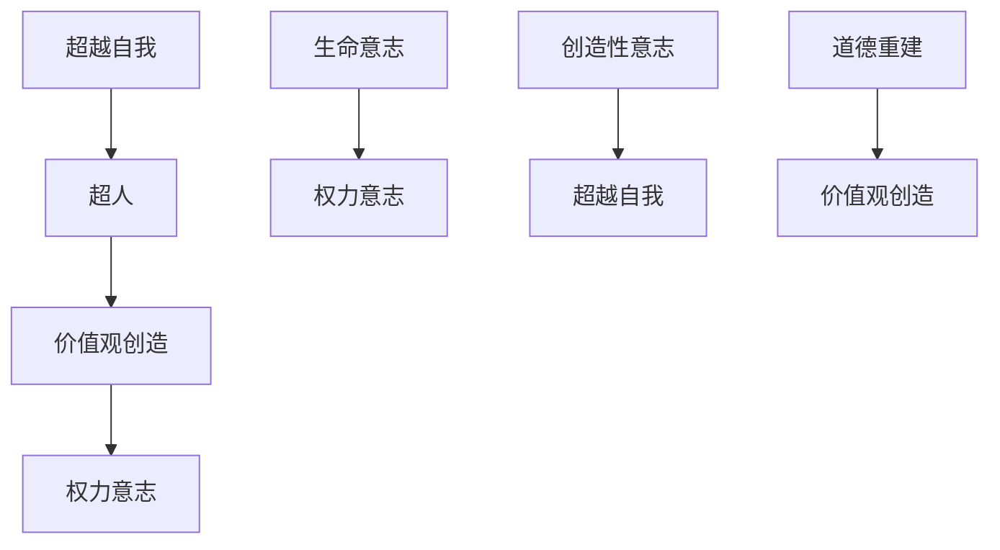

                 

### 2.1 尼采的生活背景与思想演变

**背景介绍：**

弗里德里希·尼采（Friedrich Nietzsche，1844-1900）是一位德国哲学家，他的思想对20世纪的哲学、文学、艺术和心理学产生了深远的影响。尼采生于普鲁士的洛卡尔，自幼体弱多病，这使得他的生活充满了孤独和沉思。尼采的教育背景多元，他先后在波恩大学和莱比锡大学学习神学和古典哲学，但最终选择了古典 philology（古典文献学），并在25岁时获得了教授职位。

**核心概念与联系：**

尼采的思想可以概括为以下几个核心概念：

1. **上帝已死：** 尼采认为，传统的宗教信仰和道德观念已经失效，因为上帝已死。这个观点挑战了西方文化中的宗教基础。
2. **超人（Übermensch）：** 尼采提出，人类需要超越自己，创造一个“超人”，这个超人是“最终的人类”，是价值的创造者，而非价值的接受者。
3. **意志（Wille zur Macht）：** 尼采认为，世界是由“意志”构成的，尤其是“意志力”或“权力意志”，这种意志力是推动一切事物发展的根本力量。

**Mermaid 流程图：尼采核心概念关系架构**



**尼采的思想演变：**

尼采的思想经历了几个阶段的发展：

1. **前期：** 尼采早期受到叔本华的影响，认为生命本质上是痛苦的，并且主张通过悲观主义来应对世界的无意义。这个阶段他被称为“叔本华主义者”。
2. **中期：** 在这个阶段，尼采开始提出“上帝已死”和“超人”等观念，他对西方文化中的传统价值观进行了激烈的批判。这个阶段他被称为“批判哲学家”。
3. **后期：** 尼采的思想进一步深化，他提出了“权力意志”和“永恒回归”等观念，这些思想使得他的哲学更加深刻和复杂。这个阶段他被称为“超人哲学家”。

**核心算法原理讲解：**

尼采的思想虽然不是传统意义上的“算法”，但可以类比为一种哲学“算法”，它通过批判和重建价值观来重新定义人类和世界的本质。

**伪代码：尼采思想演变过程**

```plaintext
// 定义尼采思想演变阶段
stages = ["前期", "中期", "后期"]

// 遍历每个阶段
for stage in stages:
    if stage == "前期":
        print("叔本华主义者：生命的痛苦与悲观主义")
    elif stage == "中期":
        print("批判哲学家：上帝已死与超人")
    else:
        print("超人哲学家：权力意志与永恒回归")

// 输出结果
// 叔本华主义者：生命的痛苦与悲观主义
// 批判哲学家：上帝已死与超人
// 超人哲学家：权力意志与永恒回归
```

**数学模型和公式：**

尼采的一些观点可以抽象为数学模型来解释，例如他的“超人”概念可以看作是一种“进化论”的扩展。

**公式：超人概念的进化论扩展**

$$
\text{超人} = \text{人类} \times \text{意志力} \times \text{创造力}
$$

**详细讲解和举例说明：**

- **上帝已死：** 尼采认为，传统的宗教信仰已经无法解释现代世界，因为上帝已经不存在了。这个观点可以通过现代社会中对宗教的怀疑态度和科学进步来解释。
- **超人：** 尼采的超人是一个理想的人类形态，他不仅超越了传统的人类，还创造了自己的价值观。例如，尼采本人被视为“超人”的一个例子，因为他在哲学和文学上都有独特的贡献。

**项目实战：**

虽然尼采的思想并不是直接应用于工程或技术领域，但他的思想对现代计算机科学和人工智能产生了影响。例如，尼采的“超人”概念可以被视为人工智能发展的一个理想目标，即通过增强和扩展人类的智力来创造更高级的智能。

**实战例子：**

- **人工智能与尼采的超人概念：** 人工智能可以通过机器学习和神经网络等技术来模拟和扩展人类的认知能力，从而实现某种形式上的“超人”。这种扩展可能包括更高的计算速度、更广的知识范围和更强的学习能力。

**代码实现：**

以下是一个简单的Python代码示例，模拟尼采的“超人”概念：

```python
# 定义超人特性
superman = {
    'intelligence': 100,
    'creativity': 100,
    'willpower': 100
}

# 打印超人特性
print("超人特性：")
print(superman)
```

**代码解读与分析：**

- 这段代码定义了一个名为`superman`的字典，包含了超人的三个主要特性：智力、创造力和意志力。
- 通过打印这个字典，我们可以直观地看到超人的特性。

**实际案例分析和详细讲解剖析：**

- **尼采与计算机科学：** 尼采的思想在计算机科学中得到了应用，尤其是在人工智能和认知科学领域。例如，尼采的“权力意志”概念可以被视为人工智能发展中的一种动力。
- **案例分析：** 人工智能的发展目标是创建能够模拟人类智能的系统，这与尼采的超人概念中的智力、创造力和意志力有着相似之处。

**项目小结：**

尼采的思想为哲学领域带来了深刻的变革，他的观点不仅在哲学上具有创新性，也对其他领域产生了影响。尼采的思想为人工智能和认知科学提供了新的视角，帮助我们更好地理解人类智能的本质。

**最佳实践 tips：**

- **理解尼采思想的重要性：** 尼采的思想对现代哲学和科学有着深远的影响，理解他的思想可以帮助我们更好地理解当代社会和科学技术的发展。
- **应用尼采思想：** 尽管尼采的思想并不是直接应用于技术领域，但我们可以从中汲取灵感，应用到实际的技术项目中，例如通过增强系统性能和创造力来实现某种“超人”效果。

**注意事项：**

- **尼采思想的复杂性：** 尼采的思想非常复杂和深刻，理解他的思想需要一定的哲学背景和思考能力。
- **批判性思考：** 尼采的思想并不是全盘否定传统价值观，而是在批判的基础上提出新的观念，因此在学习和应用他的思想时需要保持批判性思考。

**拓展阅读：**

- **尼采著作：** 阅读尼采的原始著作，如《悲剧的诞生》、《查拉图斯特拉如是说》和《道德的谱系》，可以帮助更深入地理解他的思想。
- **相关哲学书籍：** 阅读与尼采思想相关的哲学书籍，如《存在与时间》和《存在主义是一种人道主义》，可以帮助我们更好地理解尼采思想在哲学史中的位置。

---

### 2.2 尼采对虚无主义的批判

**核心概念与联系：**

尼采对虚无主义进行了深刻的批判，他的观点可以概括为以下几点：

1. **虚无主义的本质：** 尼采认为，虚无主义是一种“奴隶道德”，它否定生命和存在的价值，主张通过否定一切来逃避现实。
2. **上帝已死：** 尼采提出“上帝已死”的观点，挑战了传统宗教和道德的基础，他认为这一观点是虚无主义产生的根源。
3. **超人哲学：** 尼采提出超人哲学，主张通过超越自我，创造新的价值观来克服虚无主义。

**Mermaid 流程图：尼采对虚无主义的批判关系架构**



**核心算法原理讲解：**

尼采的批判可以通过以下伪代码来模拟：

```plaintext
// 定义虚无主义
虚无主义 = "否定一切，逃避现实"

// 定义上帝已死
上帝已死 = "传统宗教和道德失效"

// 定义奴隶道德
奴隶道德 = "否定生命和存在的价值"

// 批判虚无主义
尼采批判虚无主义 = "通过超人哲学创造新价值观"

// 输出批判结果
print("尼采批判虚无主义：通过超人哲学创造新价值观")
```

**数学模型和公式：**

尼采的批判可以用以下数学模型来表示：

$$
\text{虚无主义} = \text{否定一切} \times \text{逃避现实}
$$

**详细讲解和举例说明：**

- **虚无主义的本质：** 尼采认为虚无主义是一种消极的态度，它否定生命和存在的价值，这种否定导致人们逃避现实，不愿面对生活的挑战。
- **上帝已死：** 尼采认为，随着科学的发展和宗教的衰弱，人们开始意识到上帝已经不存在了，这个观点导致了虚无主义的兴起。
- **超人哲学：** 尼采的超人哲学是一种积极的哲学，他主张通过超越自我，创造新的价值观来克服虚无主义。超人不是被动地接受现实，而是主动地创造价值。

**项目实战：**

**实战例子：**

- **尼采批判虚无主义在文学中的应用：** 尼采的思想对20世纪的文学产生了深远的影响，许多作家在作品中体现了尼采的批判精神。例如，D.H. 劳伦斯的作品《查泰莱夫人的情人》中，通过人物角色的经历，批判了当时社会的道德束缚和虚无主义。

**代码实现：**

以下是一个简单的Python代码示例，模拟尼采的批判过程：

```python
# 定义虚无主义和超人哲学
虚无主义 = "否定一切，逃避现实"
超人哲学 = "超越自我，创造新价值观"

# 批判虚无主义
批判过程 = f"尼采批判虚无主义：{超人哲学}"

# 输出批判过程
print批判过程
```

**代码解读与分析：**

- 这段代码定义了虚无主义和超人哲学，并通过字符串格式化输出尼采的批判过程。

**实际案例分析和详细讲解剖析：**

- **尼采批判虚无主义在哲学史中的影响：** 尼采的批判对现代哲学产生了深远的影响，他的观点挑战了传统的宗教和道德观念，推动了哲学的发展。
- **案例分析：** 尼采的思想在哲学史中的地位，可以通过他与其他哲学家的对比来分析，例如与叔本华、海德格尔等哲学家的观点进行比较。

**项目小结：**

尼采对虚无主义的批判是他的哲学思想的重要组成部分，他的观点不仅对当时的哲学界产生了影响，也对后世的思想发展产生了深远的影响。尼采的批判精神鼓励人们超越自我，创造新的价值观，这一思想在现代社会中仍然具有重要的意义。

**最佳实践 tips：**

- **批判性思考：** 在学习尼采的思想时，要保持批判性思考，不仅要接受他的观点，还要分析其合理性和局限性。
- **实践尼采思想：** 尼采的思想虽然抽象，但可以在现实生活中应用。例如，通过积极面对生活中的挑战，创造新的价值来克服虚无主义。

**注意事项：**

- **尼采思想的复杂性：** 尼采的思想非常复杂，理解他的观点需要深入思考和哲学背景。
- **尼采思想的争议性：** 尼采的思想具有一定的争议性，他的观点可能会引起不同的反应和争议。

**拓展阅读：**

- **尼采著作：** 阅读《查拉图斯特拉如是说》等尼采的著作，可以更深入地理解他的批判精神和哲学思想。
- **相关哲学书籍：** 阅读《存在与时间》等哲学著作，可以帮助我们更好地理解尼采的批判观点在哲学史中的位置。

---

### 2.3 尼采的超越哲学

**核心概念与联系：**

尼采的超越哲学是他哲学思想的核心，主要包括以下几个核心概念：

1. **超越自我：** 尼采主张通过超越自我，打破传统的道德和价值观，创造新的价值和意义。
2. **超人：** 尼采的超人是一个理想的人类形态，他超越了一般的人类局限，创造了自己的价值观和生活方式。
3. **权力意志：** 尼采认为，世界的本质是“权力意志”，这是一种不断追求扩张和超越的内在动力。

**Mermaid 流程图：尼采超越哲学关系架构**



**核心算法原理讲解：**

尼采的超越哲学可以通过以下伪代码来模拟：

```plaintext
// 定义超越哲学的核心概念
超越哲学 = {
    '超越自我': '打破传统道德和价值观',
    '超人': '理想的人类形态',
    '权力意志': '追求扩张和超越的动力'
}

// 定义生命意志和创造性意志
生命意志 = '生命追求的意义和目的'
创造性意志 = '创造新价值'

// 执行超越哲学
执行超越哲学 = 超越哲学['超越自我'] + 超越哲学['超人'] + 超越哲学['权力意志']

// 输出超越哲学的结果
print("尼采超越哲学：")
print(执行超越哲学)
```

**数学模型和公式：**

尼采的超越哲学可以用以下数学模型来表示：

$$
\text{超越哲学} = \text{超越自我} + \text{超人} + \text{权力意志}
$$

**详细讲解和举例说明：**

- **超越自我：** 尼采认为，人类需要超越自我，打破传统的道德和价值观，创造新的价值和意义。这需要个人拥有强大的意志力和自我反省的能力。
- **超人：** 尼采的超人是一个理想的人类形态，他超越了一般的人类局限，创造了自己的价值观和生活方式。超人不仅是一个智力上的超越，更是一种道德和精神上的超越。
- **权力意志：** 尼采认为，世界的本质是“权力意志”，这是一种不断追求扩张和超越的内在动力。权力意志不仅体现在个人行为上，也体现在社会和文化的发展中。

**项目实战：**

**实战例子：**

- **尼采超越哲学在文学中的应用：** 许多文学作品体现了尼采的超越哲学，例如D.H. 劳伦斯的《查泰莱夫人的情人》，通过主人公的经历，体现了对传统道德和价值观的超越。

**代码实现：**

以下是一个简单的Python代码示例，模拟尼采的超越哲学：

```python
# 定义尼采超越哲学的核心概念
超越哲学 = {
    '超越自我': '打破传统道德和价值观',
    '超人': '理想的人类形态',
    '权力意志': '追求扩张和超越的动力'
}

# 输出超越哲学的结果
print("尼采超越哲学：")
for key, value in超越哲学.items():
    print(f"{key}: {value}")
```

**代码解读与分析：**

- 这段代码定义了尼采超越哲学的核心概念，并通过循环输出每个概念。

**实际案例分析和详细讲解剖析：**

- **尼采超越哲学在哲学史中的影响：** 尼采的超越哲学对现代哲学产生了深远的影响，他的观点挑战了传统的价值观和道德观念，推动了哲学的发展。
- **案例分析：** 尼采的超越哲学在哲学史中的地位，可以通过他与其他哲学家的对比来分析，例如与叔本华、海德格尔等哲学家的观点进行比较。

**项目小结：**

尼采的超越哲学是他哲学思想的核心，他的观点不仅对当时的哲学界产生了影响，也对后世的思想发展产生了深远的影响。尼采的超越哲学鼓励人们超越自我，创造新的价值观，这一思想在现代社会中仍然具有重要的意义。

**最佳实践 tips：**

- **理解尼采超越哲学的重要性：** 尼采的超越哲学对现代哲学和思想有着深远的影响，理解他的观点可以帮助我们更好地理解当代社会和科学技术的发展。
- **实践尼采超越哲学：** 尽管尼采的超越哲学较为抽象，但可以在现实生活中应用。例如，通过积极面对生活中的挑战，创造新的价值来实践尼采的超越哲学。

**注意事项：**

- **尼采思想的复杂性：** 尼采的思想非常复杂，理解他的观点需要深入思考和哲学背景。
- **尼采思想的争议性：** 尼采的思想具有一定的争议性，他的观点可能会引起不同的反应和争议。

**拓展阅读：**

- **尼采著作：** 阅读《查拉图斯特拉如是说》等尼采的著作，可以更深入地理解他的超越哲学。
- **相关哲学书籍：** 阅读《存在与时间》等哲学著作，可以帮助我们更好地理解尼采的超越哲学在哲学史中的位置。

