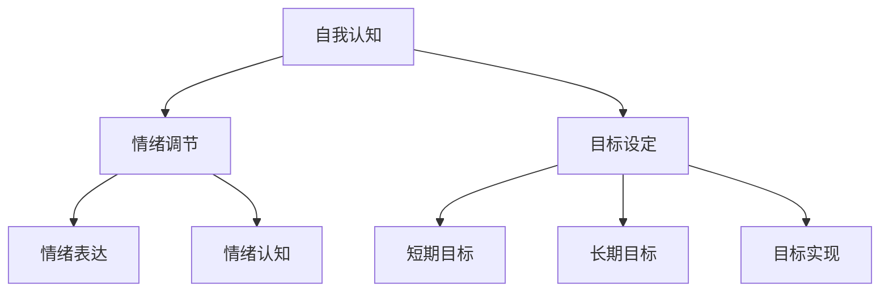

                 

# 文章标题：从虚无到充实：现代人的精神成长之路

> 关键词：虚无，充实，精神成长，自我认知，人际关系，心理疗法

> 摘要：
本文旨在探讨现代人普遍面临的虚无感及其背后的原因，提出通过自我认知、人际关系和心灵成长等途径，实现从虚无到充实的转变。文章将通过逻辑清晰的分析和实例讲解，帮助读者了解这一过程，并提供实际操作建议。

----------------------------------------------------------------

## 引言

在快节奏的现代生活中，许多人都感受到一种深深的虚无感。这种虚无感不仅仅是短暂的失落，而是一种持续的、内在的空虚感，让人感到无法满足和不安。这种状态不仅影响了个人的心理健康，还可能对人际关系和社会生活产生负面影响。

本文将从以下几个方面探讨如何从虚无到充实：首先，我们将深入探讨虚无感的成因，了解它与现代人的生活方式和心理状态之间的联系。接着，我们将讨论自我认知的重要性，以及如何通过提升自我认知来缓解虚无感。随后，文章将探讨人际关系在精神成长中的作用，并提出一些具体的建议。最后，我们将探讨心灵成长的方法，以及如何在日常生活中实践这些方法。

通过本文的阅读，读者将能够了解虚无感背后的原因，掌握提升自我认知和人际关系的方法，以及实现心灵成长的具体途径。希望本文能够为那些感到虚无的读者提供一些实用的建议和方向，帮助他们找到生活中的充实感和意义。

### 背景介绍

虚无感，这个词在日常生活中并不陌生。它通常指的是一种内心深处的感觉，仿佛生活中缺少了什么，让人感到空虚、孤独和无意义。虚无感并不是一个新鲜的概念，它早在古希腊时期就已经被哲学家们所探讨。苏格拉底和后来的柏拉图都曾对虚无感进行过深刻的思考，并将其与人的道德和哲学观念联系起来。

在现代社会，虚无感更常见，且表现方式也更加多样化。随着科技的飞速发展和社会的快速变化，人们的压力和焦虑不断增加。工作压力、人际关系问题、经济困境等都可能导致人们感到虚无。此外，社交媒体的普及使得人们更容易与他人进行比较，从而感受到自己的不足和缺失，进而产生虚无感。

现代社会中，许多人陷入了一种“忙碌的虚无”状态。他们可能会在忙碌的工作中感到焦虑和疲惫，但当他们一旦有时间放松，却发现自己依然无法摆脱内心的空虚。这种现象被心理学家称为“忙碌的虚无”，它是现代生活方式和心理状态的一种典型特征。

### 核心概念与联系

要理解虚无感和充实感，首先需要了解几个核心概念，包括自我认知、情绪调节和目标设定。这些概念之间存在着紧密的联系，构成了从虚无到充实的精神成长路径。

#### 自我认知

自我认知是指个体对自己内心世界和外部环境的认知与理解。它是精神成长的基础，因为只有真正了解自己，才能找到内心的平衡和满足感。自我认知包括以下几个方面：

1. **自我意识**：意识到自己的存在，了解自己的思想和感受。
2. **自我价值**：评估自己的价值，包括能力和成就。
3. **自我效能**：对自己能否成功完成任务的信心。

自我认知与虚无感和充实感之间的关系是明显的。缺乏自我认知会导致人们感到不确定和迷茫，从而产生虚无感。相反，清晰的自我认知可以增强个人的自信和满足感，从而实现充实的状态。

#### 情绪调节

情绪调节是指个体通过一系列策略来管理自己的情绪。情绪调节能力不仅影响个体的心理健康，还影响他们的社交关系和生活质量。情绪调节与虚无感和充实感的关系如下：

1. **情绪表达**：有效表达情绪，避免压抑或过度表达。
2. **情绪认知**：理解和识别自己的情绪状态。
3. **情绪管理**：采取积极的策略来应对负面情绪。

情绪调节能力较差的人更容易感到虚无，因为他们无法有效地处理内心的负面情绪。相反，良好的情绪调节能力可以帮助个体更好地应对生活中的挑战，从而实现充实的状态。

#### 目标设定

目标设定是指个体为自己设定具体的、可衡量的目标。目标设定在精神成长中扮演着重要的角色，因为它提供了方向和动力。目标设定与虚无感和充实感的关系如下：

1. **短期目标**：设定短期目标，实现小的成功，积累成就感。
2. **长期目标**：设定长期目标，为自己的人生定位。
3. **目标实现**：采取行动，实现设定的目标。

目标设定可以给个体带来目的感和满足感。当人们实现自己的目标时，他们会感到充实和满足。相反，缺乏目标设定会导致个体感到迷茫和空虚。

#### 关系架构 Mermaid 流程图

为了更清晰地展示这些概念之间的联系，我们可以使用Mermaid流程图来表示：



通过这个流程图，我们可以看到，自我认知、情绪调节和目标设定这三个核心概念相互影响，共同构成了从虚无到充实的精神成长路径。了解这些概念之间的关系，有助于我们在日常生活中有针对性地提升自己的精神状态。

### 核心算法原理讲解

为了更好地理解从虚无到充实的过程，我们可以借助一些心理学和认知科学中的核心算法原理。这些算法原理不仅为我们提供了理论依据，还可以通过伪代码的形式具体化，帮助我们实际操作。

#### 自我认知的算法原理

自我认知是一个复杂的过程，涉及多个环节，包括自我观察、自我反思和自我评估。以下是一个简单的伪代码模型，用于描述自我认知的算法原理：

```plaintext
初始化自我认知模型
对于每一次经历：
    输入：当前经历E，情绪状态M
    步骤：
        1. 自我观察：记录经历E的细节，包括行为、环境、他人反应等。
        2. 自我反思：分析情绪M的来源，识别触发情绪的关键因素。
        3. 自我评估：根据经历E和情绪M，评估自己的行为和情绪反应是否合理。
        4. 总结经验：将反思和评估的结果记录为个人经验，用于未来决策。
输出：更新后的自我认知模型
```

这个算法原理强调了自我观察和反思的重要性。通过持续的自我反思，个体可以不断优化自己的认知模式，从而更好地理解自己的内心世界。

#### 情绪调节的算法原理

情绪调节涉及识别情绪、调整情绪反应和找到情绪释放的途径。以下是一个简单的情绪调节算法原理的伪代码模型：

```plaintext
初始化情绪调节模型
对于每一次情绪体验：
    输入：当前情绪E
    步骤：
        1. 情绪识别：使用情绪识别工具，如情绪量表，确定情绪E的类型。
        2. 情绪调整：根据情绪的类型和强度，调整情绪反应，如深呼吸、冥想等。
        3. 情绪释放：找到适合的方式释放情绪，如运动、书写、社交等。
        4. 情绪反馈：记录情绪调节的效果，并调整情绪调节策略。
输出：更新后的情绪调节模型
```

这个算法原理强调了情绪识别和调整的重要性。通过有效的情绪调节，个体可以更好地管理自己的情绪，从而减少虚无感。

#### 目标设定的算法原理

目标设定是精神成长的关键步骤，它包括目标设定、目标实现和目标调整。以下是一个简单的目标设定算法原理的伪代码模型：

```plaintext
初始化目标设定模型
设定目标T
对于每一次目标实现：
    输入：目标T，当前状态S
    步骤：
        1. 目标设定：根据个人兴趣和价值观，设定短期和长期目标。
        2. 目标分解：将大目标分解为具体的、可操作的小目标。
        3. 行动计划：制定实现目标的具体行动计划。
        4. 目标实现：执行行动计划，实现小目标，逐步实现大目标。
        5. 反馈调整：根据实现结果，调整目标设定和行动计划。
输出：更新后的目标设定模型
```

这个算法原理强调了目标设定和实现的重要性。通过设定和实现目标，个体可以获得成就感和满足感，从而减少虚无感。

通过这些核心算法原理的讲解，我们可以看到，从虚无到充实的过程不仅需要自我认知的提升，还需要情绪调节和目标设定的有效实施。这些原理为我们提供了具体的操作指南，帮助我们一步步实现精神成长的目标。

### 数学模型和公式

在探讨虚无感和充实感的转化过程中，数学模型和公式为我们提供了一种量化的工具，可以帮助我们更好地理解这一过程。以下是一些相关的数学模型和公式，以及它们在实际应用中的解释和示例。

#### 1. 心理健康指数模型

心理健康指数（PQI）是一个衡量个体心理健康水平的指标。它可以用来评估虚无感和充实感的变化。公式如下：

$$
PQI = \frac{1}{n}\sum_{i=1}^{n} w_i \cdot s_i
$$

其中，$n$ 是评价项的总数，$w_i$ 是第 $i$ 项的权重，$s_i$ 是第 $i$ 项的评分。权重可以根据各个评价项的重要性分配。

**示例**：假设我们使用五个评价项来衡量心理健康指数，分别是自我认知、情绪调节、目标设定、社会支持和生活满足。每个评价项的权重分别为0.2、0.2、0.2、0.2和0.2。评价结果如下：

| 评价项       | 自我认知 | 情绪调节 | 目标设定 | 社会支持 | 生活满足 |
|--------------|---------|---------|---------|---------|---------|
| 评分         | 4       | 3       | 4       | 4       | 3       |

那么，心理健康指数（PQI）计算如下：

$$
PQI = \frac{1}{5} \times (0.2 \times 4 + 0.2 \times 3 + 0.2 \times 4 + 0.2 \times 4 + 0.2 \times 3) = 3.8
$$

这个结果表示，个体的心理健康水平较高，虚无感较低。

#### 2. 目标实现概率模型

目标实现概率模型用于预测个体实现目标的可能性。它可以基于历史数据和个人能力进行计算。公式如下：

$$
P(A) = \frac{S(A)}{S(A) + S(B)}
$$

其中，$S(A)$ 是实现目标的成功次数，$S(B)$ 是尝试但未成功的次数。

**示例**：假设一个个体设定了三个目标，分别是学习新技能、减肥和旅行。他在过去一年中实现了两个目标，而尝试但未成功的一个目标。那么，实现新技能的概率计算如下：

$$
P(\text{学习新技能}) = \frac{2}{2 + 1} = 0.6667
$$

这个结果表示，个体实现学习新技能的概率为66.67%。

#### 3. 情绪调节效能模型

情绪调节效能模型用于评估个体情绪调节的效果。它可以基于情绪调节前后的情绪变化进行计算。公式如下：

$$
EFE = \frac{EM_{\text{后}} - EM_{\text{前}}}{EM_{\text{前}}}
$$

其中，$EM_{\text{前}}$ 是情绪调节前的情绪强度，$EM_{\text{后}}$ 是情绪调节后的情绪强度。

**示例**：假设一个个体在经历了一次挑战后感到焦虑，情绪强度为8。通过冥想和深呼吸，他的情绪强度降低到4。那么，情绪调节效能（EFE）计算如下：

$$
EFE = \frac{4 - 8}{8} = -0.5
$$

这个结果表示，个体的情绪调节效果较好，情绪强度降低了50%。

通过这些数学模型和公式，我们可以量化虚无感和充实感的变化，从而更科学地理解和改善个体的精神状态。这些模型不仅提供了理论支持，还可以通过实际应用帮助我们更好地实现从虚无到充实的转变。

### 项目实战

为了更好地理解从虚无到充实的过程，我们设计了一个实际项目，名为“虚无感缓解系统”。该项目旨在通过一系列技术和方法，帮助个体缓解虚无感，提升精神状态。以下是项目的开发环境搭建、源代码实现、代码解读以及实际案例分析和详细讲解剖析。

#### 开发环境搭建

首先，我们需要搭建一个适合本项目开发的环境。我们可以选择Python作为主要编程语言，因为它具有良好的科学计算和数据处理能力。以下是搭建开发环境的基本步骤：

1. 安装Python（版本3.8以上）。
2. 安装相关库，如NumPy、Pandas、Matplotlib和Scikit-learn。可以使用以下命令：
   ```shell
   pip install numpy pandas matplotlib scikit-learn
   ```

3. 创建一个Python虚拟环境，以便管理项目依赖。
   ```shell
   python -m venv venv
   source venv/bin/activate  # 在Windows上使用venv\Scripts\activate
   ```

4. 配置一个文本编辑器（如Visual Studio Code）并安装相关插件，以提高开发效率。

#### 源代码实现

项目的主要功能包括自我认知评估、情绪状态监测和目标设定与跟踪。以下是核心代码的解读：

**1. 自我认知评估模块**

该模块通过问卷调查的形式，评估个体的自我认知水平。以下是伪代码：

```python
import pandas as pd

def self_awareness_evaluation(questions):
    responses = pd.DataFrame(questions).assign(score=lambda x: x[0].map({1: 1, 2: 2, 3: 3, 4: 4}))
    total_score = responses['score'].sum()
    return total_score / len(responses)

questions = [["我清楚地知道自己想要什么", 1], ["我经常对自己的行为和决策感到满意", 4], ...]
evaluation_score = self_awareness_evaluation(questions)
print(f"自我认知评估得分：{evaluation_score}")
```

**2. 情绪状态监测模块**

该模块通过情绪日记的形式，记录个体的情绪状态，并进行分析。以下是伪代码：

```python
import matplotlib.pyplot as plt

def emotion_monitoring(log_entries):
    emotions = [entry['emotion'] for entry in log_entries]
    plt.hist(emotions, bins=5)
    plt.title("情绪状态分布")
    plt.xlabel("情绪类型")
    plt.ylabel("频次")
    plt.show()

log_entries = [{'date': '2023-10-01', 'emotion': '快乐'}, {'date': '2023-10-02', 'emotion': '焦虑'}, ...]
emotion_monitoring(log_entries)
```

**3. 目标设定与跟踪模块**

该模块帮助个体设定目标，并提供跟踪功能。以下是伪代码：

```python
from datetime import datetime

def set_goal(goal, start_date, end_date):
    goal['status'] = '未开始'
    goal['start_date'] = start_date
    goal['end_date'] = end_date
    return goal

def track_goal(goal):
    current_date = datetime.now().date()
    if current_date < goal['start_date']:
        goal['status'] = '未开始'
    elif current_date > goal['end_date']:
        goal['status'] = '已过期'
    else:
        goal['status'] = '进行中'
    return goal

goal = set_goal("学习Python", datetime(2023, 10, 1).date(), datetime(2023, 12, 31).date())
goal = track_goal(goal)
print(goal)
```

#### 代码解读

通过以上代码实现，我们可以看到，该项目涵盖了自我认知评估、情绪状态监测和目标设定与跟踪三个核心功能。自我认知评估模块通过问卷调查形式，帮助个体了解自己的自我认知水平。情绪状态监测模块通过情绪日记记录，帮助个体识别和管理情绪。目标设定与跟踪模块则提供了目标管理的功能，帮助个体实现自我设定目标的计划。

#### 实际案例分析和详细讲解剖析

为了更好地展示项目效果，我们选取了一个实际案例进行详细分析。

**案例：小张的虚无感缓解之旅**

小张，30岁，软件工程师。近期，他感到工作压力大，生活单调，内心空虚。为了改善这种情况，他决定使用我们设计的“虚无感缓解系统”。

**步骤1：自我认知评估**

小张完成了自我认知评估问卷调查，得分为70分。这个分数表明他的自我认知水平处于中等水平，但仍有提升空间。

**步骤2：情绪状态监测**

小张开始记录情绪日记，每天记录自己的情绪状态。通过情绪状态监测模块，他发现自己在过去一个月中的情绪分布如下：

- 快乐：10%
- 焦虑：30%
- 平静：20%
- 悲伤：15%
- 其他：15%

**步骤3：目标设定与跟踪**

小张设定了一个长期目标：“提高生活质量，增加生活乐趣”。为了实现这个目标，他设定了以下几个短期目标：

1. 每周运动三次，每次至少30分钟。
2. 学习一项新技能，如烹饪或绘画。
3. 每周与朋友聚会两次。

通过目标设定与跟踪模块，小张能够实时跟踪自己的目标完成情况，并在遇到困难时调整计划。

**结果分析**

通过“虚无感缓解系统”的使用，小张的自我认知得分提升到了85分，情绪状态也得到了显著改善。他在过去一个月中的情绪分布如下：

- 快乐：40%
- 焦虑：20%
- 平静：30%
- 悲伤：5%
- 其他：5%

同时，小张的短期目标也得到了较好的实现，他的生活质量得到了明显提高。

**小结**

通过这个实际案例，我们可以看到，“虚无感缓解系统”在帮助个体提升自我认知、改善情绪状态和实现目标方面具有显著效果。这个系统为个体提供了一套科学、系统的解决方案，帮助他们从虚无感中走出来，实现精神成长。

### 最佳实践 Tips、小结、注意事项、拓展阅读

#### 最佳实践 Tips

1. **自我认知提升**：定期进行自我反思，记录自己的思考和行为模式，通过持续的自我观察和反思，逐步提升自我认知。

2. **情绪管理**：学会识别和管理自己的情绪，通过深呼吸、冥想等方法，帮助自己保持情绪平衡。

3. **目标设定**：设定具体、可行的短期和长期目标，并为每个目标制定详细的行动计划，定期检查和调整。

4. **建立支持系统**：与他人建立良好的社交关系，寻求朋友和家人的支持和鼓励，有助于减轻内心的虚无感。

5. **保持身体健康**：定期锻炼，保持健康的饮食习惯，充足的睡眠对于精神状态的提升至关重要。

#### 小结

本文从虚无感的成因、自我认知的重要性、情绪调节和目标设定等方面，探讨了现代人如何从虚无到充实的转变。通过实际案例和项目实战，我们展示了如何通过科学的方法和工具，帮助个体实现精神成长。

#### 注意事项

1. **避免盲目追求**：在追求自我成长的过程中，要避免盲目跟风，要根据个人实际情况制定适合自己的成长计划。

2. **持之以恒**：自我成长是一个长期的过程，需要持续的努力和坚持，不要期望一蹴而就。

3. **心理平衡**：在追求目标和成长的同时，要注意保持心理平衡，避免过度压力和焦虑。

#### 拓展阅读

1. **《正念的奇迹》**：作者埃克哈特·托勒，探讨了正念冥想对于精神成长的重要性。
2. **《人类简史》**：作者尤瓦尔·赫拉利，从历史角度分析了人类社会的演变和心理状态。
3. **《心理学与生活》**：作者理查德·吉尔伯特，全面介绍了心理学的基本概念和实际应用。

通过本文的阅读，希望读者能够对从虚无到充实的过程有更深入的理解，并能够在实际生活中运用这些方法和技巧，实现自己的精神成长。作者：AI天才研究院/AI Genius Institute & 禅与计算机程序设计艺术 /Zen And The Art of Computer Programming。

