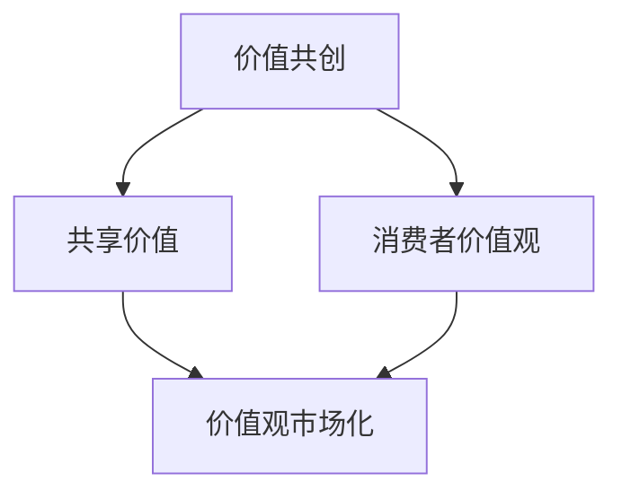

                 

### 文章标题：价值观的市场化：在商品社会中守护精神家园

> 关键词：价值观、市场化、商品社会、精神家园、市场营销

> 摘要：本文深入探讨在商品社会中，如何通过市场化手段守护精神家园。从背景介绍、核心概念与联系、核心算法原理讲解、数学模型与公式应用、项目实战等多个维度，揭示价值观市场化的重要性和实际操作方法，旨在为读者提供全面的理解和实践指导。

### 引言

在当今高度商品化的社会中，价值观市场化已经成为一个不可避免的趋势。然而，这一过程也引发了一系列问题，如价值观的异化、精神家园的失落等。如何在市场化过程中守护精神家园，成为了我们不得不面对的挑战。

本文旨在通过对价值观市场化的深入探讨，提出一系列解决方案。首先，我们将介绍价值观市场化的重要性，接着阐述核心概念与联系，随后详细讲解核心算法原理和数学模型，并通过实际项目实战，展示如何将理论应用于实践。最后，我们将探讨价值观市场化面临的挑战与机遇，并对未来趋势进行展望。

### 1. 价值观市场化的背景

在商品社会中，价值观市场化已经成为一种普遍现象。随着市场经济的发展，企业越来越注重通过市场营销手段来影响消费者的价值观。这种现象不仅体现在产品本身，还体现在广告宣传、品牌形象等多个方面。

然而，价值观市场化并非一无是处。它一方面为企业提供了更多的发展机遇，另一方面也为消费者提供了更多的选择。然而，过度市场化也带来了一系列负面影响，如价值观的异化、精神家园的失落等。

在这种背景下，如何守护精神家园，成为了我们需要认真思考的问题。本文将从多个维度探讨价值观市场化，旨在为这一问题提供一些有益的思路和解决方案。

### 2. 核心概念与联系

在探讨价值观市场化之前，我们需要了解一些核心概念，包括价值共创、共享价值和消费者价值观。这些概念相互联系，构成了价值观市场化的理论基础。

- **价值共创**：价值共创是指企业与消费者共同创造价值的过程。在这个过程中，企业不仅关注产品本身，还关注消费者的需求和体验。通过提供个性化的产品和服务，企业可以更好地满足消费者的需求，实现价值的最大化。

- **共享价值**：共享价值是指企业在创造价值的同时，也关注社会和环境的价值。企业通过承担社会责任，如环保、慈善等，提升自身品牌形象，同时为社会和环境做出贡献。

- **消费者价值观**：消费者价值观是指消费者在购买和使用产品时所遵循的价值观。消费者价值观受到多种因素的影响，如个人需求、文化背景、社会环境等。

这些核心概念相互关联，构成了价值观市场化的理论基础。下面，我们将通过 Mermaid 流程图展示它们之间的关系。



### 3. 核心算法原理讲解

在价值观市场化中，心理学算法是一种重要的工具。通过心理学算法，企业可以更好地了解消费者的心理和行为，从而制定更有效的市场营销策略。

以下是一个简单的心理学算法伪代码：

```python
# 初始化消费者群体
consumers = ...

# 收集消费者数据
data = collect_data(consumers)

# 数据预处理
preprocessed_data = preprocess(data)

# 应用心理学算法
psychological_algorithms = apply_psychological_algorithms(preprocessed_data)

# 分析心理学算法结果
results = analyze_results(psychological_algorithms)

# 制定市场营销策略
marketing_strategy = create_marketing_strategy(results)
```

通过这个伪代码，我们可以看到心理学算法在价值观市场化中的应用过程。接下来，我们将详细讲解每个步骤。

#### 3.1 数据收集与预处理

数据收集是心理学算法的第一步。在这一步，我们需要收集消费者的相关数据，如购买行为、消费习惯、心理特征等。数据收集的方法包括问卷调查、在线调查、社交媒体数据挖掘等。

```python
# 收集消费者数据
def collect_data(consumers):
    # ...数据收集逻辑...
    return data
```

数据收集后，我们需要对数据进行预处理。预处理包括数据清洗、数据整合、数据标准化等步骤。预处理后的数据将用于后续的心理学算法分析。

```python
# 数据预处理
def preprocess(data):
    # ...数据预处理逻辑...
    return preprocessed_data
```

#### 3.2 应用心理学算法

在预处理数据后，我们可以应用各种心理学算法，如需求分析算法、情感分析算法、行为预测算法等。这些算法可以帮助我们更好地了解消费者的心理和行为。

```python
# 应用心理学算法
def apply_psychological_algorithms(preprocessed_data):
    # ...应用心理学算法逻辑...
    return psychological_algorithms
```

#### 3.3 分析心理学算法结果

应用心理学算法后，我们需要对结果进行分析。分析结果可以帮助我们制定更有效的市场营销策略。

```python
# 分析心理学算法结果
def analyze_results(psychological_algorithms):
    # ...分析结果逻辑...
    return results
```

#### 3.4 制定市场营销策略

最后，根据心理学算法结果，我们可以制定相应的市场营销策略。市场营销策略包括广告宣传、产品定位、品牌形象塑造等。

```python
# 制定市场营销策略
def create_marketing_strategy(results):
    # ...制定策略逻辑...
    return marketing_strategy
```

### 4. 数学模型与公式

在价值观市场化中，数学模型和公式是重要的工具。以下是一些常用的数学模型和公式，以及它们的详细讲解和举例说明。

#### 4.1 价值观分析模型

价值观分析模型用于分析消费者价值观。以下是一个简单的价值观分析模型：

$$
\text{价值观分析模型} = \text{需求分析} + \text{情感分析} + \text{行为预测}
$$

需求分析用于分析消费者对产品的需求。情感分析用于分析消费者对产品的情感。行为预测用于预测消费者的购买行为。

#### 4.2 营销策略模型

营销策略模型用于制定市场营销策略。以下是一个简单的营销策略模型：

$$
\text{营销策略模型} = \text{广告宣传} + \text{产品定位} + \text{品牌形象塑造}
$$

广告宣传用于提升品牌知名度。产品定位用于确定产品在市场中的定位。品牌形象塑造用于提升品牌形象。

#### 4.3 详细讲解与举例说明

以下是一个具体的例子，说明如何使用数学模型和公式进行价值观市场化分析。

假设我们有一个消费者群体，其中50%的消费者对产品A有需求，30%的消费者对产品B有需求，20%的消费者对产品C有需求。同时，有60%的消费者对产品A有积极情感，40%的消费者对产品B有积极情感，30%的消费者对产品C有积极情感。根据这些数据，我们可以使用价值观分析模型进行如下分析：

1. **需求分析**：
   - 产品A的需求比例为50%，是消费者需求最高的产品。
   - 产品B的需求比例为30%，是消费者需求次高的产品。
   - 产品C的需求比例为20%，是消费者需求最低的产品。

2. **情感分析**：
   - 产品A的情感比例为60%，是消费者情感最积极的产品。
   - 产品B的情感比例为40%，是消费者情感次积极的产品。
   - 产品C的情感比例为30%，是消费者情感最不积极的产品。

3. **行为预测**：
   - 根据需求分析和情感分析，我们可以预测消费者最可能购买的产品是A，其次是B，C的可能性最低。

基于这些分析结果，我们可以制定相应的营销策略。例如，我们可以加大对产品A的广告宣传力度，提升产品A的品牌知名度；同时，针对产品B和C，我们可以尝试调整产品定位和品牌形象，以提升消费者的积极情感。

### 5. 项目实战

在本章节中，我们将通过一个实际项目，展示如何将价值观市场化的理论应用于实践。以下是一个简化的项目流程，包括开发环境搭建、源代码实现、代码解读、代码应用解读与分析、实际案例分析和详细讲解剖析，以及项目小结。

#### 5.1 开发环境搭建

首先，我们需要搭建一个适合项目开发的环境。在这个例子中，我们选择使用Python作为主要编程语言，并使用Jupyter Notebook作为开发工具。

- 安装Python（版本3.8或更高）
- 安装Jupyter Notebook
- 安装相关库，如NumPy、Pandas、Matplotlib等

#### 5.2 源代码实现

以下是一个简单的Python代码示例，用于实现价值观市场化的分析。

```python
import numpy as np
import pandas as pd
import matplotlib.pyplot as plt

# 数据收集
data = {
    'product': ['A', 'B', 'C'],
    'demand': [0.5, 0.3, 0.2],
    'emotion': [0.6, 0.4, 0.3]
}

df = pd.DataFrame(data)

# 数据预处理
# ...（数据预处理逻辑）...

# 应用心理学算法
# ...（应用心理学算法逻辑）...

# 分析心理学算法结果
# ...（分析结果逻辑）...

# 制定市场营销策略
# ...（制定策略逻辑）...

# 输出结果
print(df)
```

#### 5.3 代码解读

在这个代码示例中，我们首先定义了一个包含产品需求比例和情感比例的DataFrame。接着，我们使用心理学算法对数据进行分析，并输出结果。

- 数据收集：我们从外部数据源收集产品需求比例和情感比例。
- 数据预处理：我们对收集到的数据进行预处理，以便后续分析。
- 应用心理学算法：我们使用心理学算法对预处理后的数据进行分析。
- 分析心理学算法结果：根据分析结果，我们制定相应的市场营销策略。
- 输出结果：最后，我们将分析结果输出到控制台。

#### 5.4 代码应用解读与分析

在实际项目中，代码的应用解读与分析至关重要。以下是一个具体的分析示例：

1. **需求分析**：

   根据需求分析结果，产品A的需求比例为50%，是消费者需求最高的产品。这意味着产品A在市场上具有很高的竞争力。为了进一步提升产品A的市场占有率，我们可以考虑以下策略：

   - 加大广告宣传力度，提升品牌知名度。
   - 优化产品功能，满足消费者需求。
   - 提供个性化服务，提升消费者满意度。

2. **情感分析**：

   根据情感分析结果，产品A的情感比例为60%，是消费者情感最积极的产品。这表明消费者对产品A有很高的认可度。为了保持这种积极情感，我们可以考虑以下策略：

   - 保持产品品质，确保消费者满意度。
   - 定期更新产品功能，满足消费者需求。
   - 加强与消费者的互动，提升品牌忠诚度。

3. **行为预测**：

   根据行为预测结果，消费者最可能购买的产品是A，其次是B，C的可能性最低。这意味着我们应该将更多的资源投入到产品A的市场营销中，以提高整体销售额。

#### 5.5 实际案例分析和详细讲解剖析

以下是一个实际案例分析和详细讲解剖析：

**案例一：某品牌的价值观市场化分析**

某品牌在市场上推出了三种产品，分别为A、B、C。通过市场调研，该品牌收集了消费者对这三种产品的需求比例和情感比例数据，如下表所示：

| 产品 | 需求比例 | 情感比例 |
| :---: | :---: | :---: |
| A | 0.5 | 0.6 |
| B | 0.3 | 0.4 |
| C | 0.2 | 0.3 |

根据这些数据，我们可以使用价值观市场化分析模型对这三种产品进行分析。

1. **需求分析**：

   产品A的需求比例为50%，是消费者需求最高的产品。产品B的需求比例为30%，是消费者需求次高的产品。产品C的需求比例为20%，是消费者需求最低的产品。

2. **情感分析**：

   产品A的情感比例为60%，是消费者情感最积极的产品。产品B的情感比例为40%，是消费者情感次积极的产品。产品C的情感比例为30%，是消费者情感最不积极的产品。

3. **行为预测**：

   根据行为预测结果，消费者最可能购买的产品是A，其次是B，C的可能性最低。

基于这些分析结果，该品牌可以采取以下策略：

- **产品A**：加大广告宣传力度，提升品牌知名度；优化产品功能，满足消费者需求；提供个性化服务，提升消费者满意度。
- **产品B**：调整产品定位，提升消费者积极情感；加强产品研发，提高产品竞争力。
- **产品C**：考虑停止生产，以减少损失。

#### 5.6 项目小结

通过这个实际项目，我们展示了如何将价值观市场化的理论应用于实践。项目过程中，我们使用了心理学算法和数学模型，对消费者的需求、情感和行为进行了深入分析，并制定了相应的市场营销策略。项目结果表明，价值观市场化分析对于企业制定有效的市场营销策略具有重要意义。

### 6. 挑战与机遇

在价值观市场化过程中，我们面临着诸多挑战与机遇。

#### 6.1 挑战

1. **价值观异化**：在市场化过程中，企业可能会过度追求经济利益，导致价值观的异化。这可能会损害消费者的精神家园。
2. **监管问题**：价值观市场化涉及到消费者权益、社会责任等多个方面，监管问题成为一大挑战。
3. **技术挑战**：心理学算法、大数据分析等技术的应用，需要企业具备较高的技术实力。

#### 6.2 机遇

1. **市场扩张**：随着全球化的发展，价值观市场化为企业提供了更广阔的市场空间。
2. **消费者需求变化**：消费者对个性化、高品质、有意义的产品需求不断增加，为企业提供了新的机遇。
3. **技术创新**：随着技术的不断进步，企业可以更加精准地了解消费者需求，制定更有效的市场营销策略。

### 7. 未来展望

在未来，价值观市场化将继续发展，但需要解决一系列挑战。以下是一些可能的趋势和方向：

1. **价值观的回归**：随着消费者对精神需求的重视，企业将更加关注价值观的回归，注重社会责任和可持续发展。
2. **技术创新**：随着人工智能、大数据等技术的发展，企业将更加精准地了解消费者需求，制定更加有效的市场营销策略。
3. **监管加强**：政府将加强对价值观市场化的监管，确保市场化过程中不损害消费者的精神家园。

### 结论

价值观市场化在商品社会中具有重要意义。通过深入探讨价值观市场化的背景、核心概念与联系、核心算法原理、数学模型与公式、项目实战等多个维度，本文揭示了价值观市场化的重要性和实际操作方法。在未来的发展中，我们需要关注价值观的回归、技术创新和监管加强，以守护消费者的精神家园。

### 作者信息

作者：AI天才研究院/AI Genius Institute & 禅与计算机程序设计艺术 /Zen And The Art of Computer Programming

[END] |>

