                 


### 文章标题

**价值观的演变：从传统到后物质主义的转变**

### 文章关键词

价值观、演变、传统、后物质主义、心理学、社会学、哲学

### 文章摘要

本文深入探讨了价值观的历史演变，从传统的物质主义向后物质主义的转变。通过分析传统价值观的形成、后物质主义价值观的兴起，以及社会变迁中的价值观演变，我们揭示了价值观在不同领域中的核心概念与联系。文章还通过心理学、社会学和哲学的视角，探讨了价值观的本质及其对个体和社会行为的影响。通过实际案例分析和项目实战，本文为理解和应对价值观的演变提供了实用的方法和思路。

### 引言

在人类历史的长河中，价值观作为社会文化和心理活动的基础，不断演变和发展。从早期的传统价值观到现代的后物质主义价值观，这一演变过程不仅反映了社会经济的变迁，也揭示了人类精神追求的多样性。本文旨在深入探讨价值观的演变历程，分析其核心概念与联系，并探讨价值观在心理学、社会学和哲学领域中的作用。

**核心主题与目标读者**

本文的核心主题是价值观的演变，特别是从传统价值观向后物质主义价值观的转变。目标读者包括社会学家、哲学研究者、心理学爱好者以及对人类行为和价值观变迁感兴趣的一般读者。

### 目录结构

**第一部分：引言**

1. 价值观的起源与演变
2. 后物质主义价值观的兴起
3. 社会变迁与价值观演变

**第二部分：核心概念与联系**

4. 价值观与心理学
5. 价值观与社会学
6. 价值观与哲学

**第三部分：项目实战**

7. 后物质主义价值观的实践应用
8. 案例分析
9. 结论与展望

### 第一部分：引言

#### 第1章：价值观的起源与演变

##### 1.1.1 早期价值观的形成

在人类文明的早期阶段，价值观主要基于生存和繁衍的需求。狩猎采集社会的价值观主要体现在对食物、水源和安全的追求。随着农业的出现，土地、牲畜和农作物的所有权成为社会价值的核心。这些早期的价值观主要反映了物质需求和对自然资源的依赖。

##### 1.1.2 传统价值观的特点

进入封建社会，价值观逐渐转向权力和地位。封建社会的价值观强调等级制度、忠诚和荣誉。宗教在这一时期成为价值观的重要组成部分，道德规范和宗教信仰成为社会行为的准则。

##### 1.1.3 传统价值观的演变

随着工业革命的到来，传统价值观开始发生变革。工业社会的价值观强调效率、竞争和利益最大化。个人主义和自由主义成为主流价值观，人们开始重视个人权利和自由。

#### 第2章：后物质主义价值观的兴起

##### 2.1.1 后物质主义的定义

后物质主义是一种价值观，认为人类的追求不仅仅局限于物质财富，还包括精神满足、自我实现和与他人建立深层次的关系。后物质主义价值观强调个人的内心世界、人际关系和社会责任。

##### 2.1.2 后物质主义价值观的核心要素

后物质主义价值观的核心要素包括自我认知、心理健康、人际关系和社会责任。这些要素强调个体的全面发展和对社会的贡献。

##### 2.1.3 后物质主义价值观与物质主义价值观的比较

与物质主义价值观相比，后物质主义价值观更注重个体的内在需求和社会价值。物质主义价值观强调物质财富和物质享受，而后物质主义价值观则强调精神满足和社会责任。

#### 第3章：社会变迁与价值观演变

##### 3.1.1 工业化与价值观演变

工业革命带来了生产力的巨大提升，人们的生活方式和社会结构发生了深刻变化。工业化社会的价值观强调效率、竞争和利益最大化，这与传统的价值观形成了鲜明对比。

##### 3.1.2 全球化与价值观变迁

全球化使得不同文化之间的交流更加频繁，价值观的冲突与融合成为不可避免的现象。全球化带来了文化多样性的同时，也促使人们重新思考价值观的内涵和意义。

##### 3.1.3 技术进步与价值观转变

技术的进步改变了人们的生活方式，也影响了价值观的形成。互联网和人工智能等技术的应用，使得人们更加关注信息的获取和分享，同时也带来了隐私和安全等新问题。

### 第二部分：核心概念与联系

#### 第4章：价值观与心理学

##### 4.1.1 心理学中的价值观理论

心理学中的价值观理论主要研究价值观的形成、发展和变化。心理学家通过实验和观察，揭示了价值观对个体行为和心理健康的影响。

##### 4.1.2 价值观对个体行为的影响

价值观影响着个体的决策和行为。个体的价值观会影响其对待工作、人际关系和自我认知的方式。价值观的一致性和稳定性对个体的心理健康至关重要。

##### 4.1.3 价值观与心理健康的关系

研究表明，积极的价值观与心理健康呈正相关关系。相反，消极的价值观可能导致心理问题。心理健康问题不仅影响个体的生活质量，也影响社会整体的发展。

#### 第5章：价值观与社会学

##### 5.1.1 社会学中的价值观研究

社会学关注价值观在社会结构中的作用和影响。社会学家通过研究价值观的演变，揭示了社会变迁的规律和趋势。

##### 5.1.2 社会结构与价值观

社会结构与价值观相互作用。社会结构影响着价值观的形成，而价值观又对社会结构产生反作用。社会变迁中的价值观变化对社会结构的影响是一个复杂的过程。

##### 5.1.3 价值观变迁与社会变革

价值观的变迁是社会变革的重要组成部分。社会变革中的价值观变化，不仅反映了社会经济的变迁，也反映了人们对生活意义的追求和认知。

#### 第6章：价值观与哲学

##### 6.1.1 哲学中的价值观探讨

哲学关注价值观的本质和意义。哲学家通过思考和辩论，探讨了价值观的形成、发展和变化。哲学为价值观的研究提供了理论框架和思想资源。

##### 6.1.2 伦理学与价值观

伦理学是哲学的一个重要分支，研究道德和道德规范。伦理学与价值观密切相关，伦理学研究中的价值观问题，既包括个体道德价值观的探讨，也包括社会道德价值观的审视。

##### 6.1.3 宗教与价值观的关系

宗教是人类价值观的重要来源之一。宗教价值观与哲学价值观相互作用，共同影响着个体的行为和社会的发展。宗教价值观的研究对于理解人类价值观的多样性具有重要意义。

### 第三部分：项目实战

#### 第7章：后物质主义价值观的实践应用

##### 7.1.1 企业价值观建设

企业价值观是企业文化的核心。一个成功的企业，需要建立一套符合后物质主义价值观的企业文化，以推动企业的发展和员工的成长。

##### 7.1.2 教育领域的价值观教育

教育是价值观传承的重要途径。教育领域的价值观教育，旨在培养学生的全面发展和社会责任感，推动社会的进步。

##### 7.1.3 社会政策中的价值观考量

社会政策制定需要考虑社会价值观的多样性。社会政策中的价值观考量，有助于实现社会的公平和正义，促进社会的和谐发展。

#### 第8章：案例分析

##### 8.1.1 案例一：公司价值观的转变与业务发展

案例一介绍了某公司如何在后物质主义价值观的指导下，实现业务转型和可持续发展。

##### 8.1.2 案例二：价值观变迁对社会运动的影响

案例二分析了某社会运动如何在价值观变迁中发挥作用，推动社会变革。

##### 8.1.3 案例三：价值观与个人职业生涯规划

案例三讲述了个人如何在后物质主义价值观的指导下，规划职业生涯，实现个人价值。

### 第四部分：结论与展望

#### 第9章：价值观演变的趋势与挑战

##### 9.1.1 价值观演变的未来趋势

随着社会经济的发展，价值观的演变将继续深入。未来价值观的发展趋势包括全球化、多元化和个性化。

##### 9.1.2 价值观变迁中的挑战与机遇

价值观变迁带来挑战，如文化冲突、道德困境等。同时，也带来机遇，如价值观创新、社会进步等。

##### 9.1.3 如何应对价值观的演变

应对价值观的演变，需要个体和社会共同努力。个体应培养多元化的价值观，社会应构建包容和谐的价值体系。

#### 第10章：结论

##### 10.1.1 本书主要观点总结

本文从多个角度探讨了价值观的演变，揭示了价值观在个体和社会行为中的重要作用。

##### 10.1.2 价值观研究的未来方向

未来价值观研究应关注全球化、技术进步和文化多样性等趋势，探索价值观的演变规律和作用机制。

##### 10.1.3 对个人和社会的意义

价值观的演变对个人和社会具有重要意义。对个人而言，价值观影响其行为和决策，对社会的和谐与发展也具有重要影响。

### 总结

价值观的演变是一个复杂而持久的过程，从传统到后物质主义的转变，反映了人类社会的发展和进步。通过本文的分析，我们更深入地理解了价值观的本质和作用，为个人和社会的发展提供了有益的启示。作者信息：AI天才研究院/AI Genius Institute & 禅与计算机程序设计艺术/Zen And The Art of Computer Programming### 价值观的演变：从传统到后物质主义的转变

#### 关键词：价值观、演变、传统、后物质主义、心理学、社会学、哲学

#### 摘要

本文探讨了价值观的历史演变，从传统的物质主义价值观向现代的后物质主义价值观的转变。通过分析社会变迁、心理学、社会学和哲学领域的观点，揭示了价值观对个体和社会行为的影响。本文还通过实际案例和项目实战，探讨了后物质主义价值观的实践应用，为理解和应对价值观的演变提供了实用的方法和思路。

#### 引言

在人类历史的长河中，价值观作为社会文化和心理活动的基础，不断演变和发展。从早期的传统价值观到现代的后物质主义价值观，这一演变过程不仅反映了社会经济的变迁，也揭示了人类精神追求的多样性。本文旨在深入探讨价值观的演变历程，分析其核心概念与联系，并探讨价值观在心理学、社会学和哲学领域中的作用。

#### 第一部分：引言

##### 第1章：价值观的起源与演变

##### 1.1.1 早期价值观的形成

在人类文明的早期阶段，价值观主要基于生存和繁衍的需求。狩猎采集社会的价值观主要体现在对食物、水源和安全的追求。随着农业的出现，土地、牲畜和农作物的所有权成为社会价值的核心。这些早期的价值观主要反映了物质需求和对自然资源的依赖。

##### 1.1.2 传统价值观的特点

进入封建社会，价值观逐渐转向权力和地位。封建社会的价值观强调等级制度、忠诚和荣誉。宗教在这一时期成为价值观的重要组成部分，道德规范和宗教信仰成为社会行为的准则。

##### 1.1.3 传统价值观的演变

随着工业革命的到来，传统价值观开始发生变革。工业社会的价值观强调效率、竞争和利益最大化。个人主义和自由主义成为主流价值观，人们开始重视个人权利和自由。

##### 第2章：后物质主义价值观的兴起

##### 2.1.1 后物质主义的定义

后物质主义是一种价值观，认为人类的追求不仅仅局限于物质财富，还包括精神满足、自我实现和与他人建立深层次的关系。后物质主义价值观强调个人的内心世界、人际关系和社会责任。

##### 2.1.2 后物质主义价值观的核心要素

后物质主义价值观的核心要素包括自我认知、心理健康、人际关系和社会责任。这些要素强调个体的全面发展和对社会的贡献。

##### 2.1.3 后物质主义价值观与物质主义价值观的比较

与物质主义价值观相比，后物质主义价值观更注重个体的内在需求和社会价值。物质主义价值观强调物质财富和物质享受，而后物质主义价值观则强调精神满足和社会责任。

##### 第3章：社会变迁与价值观演变

##### 3.1.1 工业化与价值观演变

工业革命带来了生产力的巨大提升，人们的生活方式和社会结构发生了深刻变化。工业化社会的价值观强调效率、竞争和利益最大化，这与传统的价值观形成了鲜明对比。

##### 3.1.2 全球化与价值观变迁

全球化使得不同文化之间的交流更加频繁，价值观的冲突与融合成为不可避免的现象。全球化带来了文化多样性的同时，也促使人们重新思考价值观的内涵和意义。

##### 3.1.3 技术进步与价值观转变

技术的进步改变了人们的生活方式，也影响了价值观的形成。互联网和人工智能等技术的应用，使得人们更加关注信息的获取和分享，同时也带来了隐私和安全等新问题。

#### 第二部分：核心概念与联系

##### 第4章：价值观与心理学

##### 4.1.1 心理学中的价值观理论

心理学中的价值观理论主要研究价值观的形成、发展和变化。心理学家通过实验和观察，揭示了价值观对个体行为和心理健康的影响。

##### 4.1.2 价值观对个体行为的影响

价值观影响着个体的决策和行为。个体的价值观会影响其对待工作、人际关系和自我认知的方式。价值观的一致性和稳定性对个体的心理健康至关重要。

##### 4.1.3 价值观与心理健康的关系

研究表明，积极的价值观与心理健康呈正相关关系。相反，消极的价值观可能导致心理问题。心理健康问题不仅影响个体的生活质量，也影响社会整体的发展。

##### 第5章：价值观与社会学

##### 5.1.1 社会学中的价值观研究

社会学关注价值观在社会结构中的作用和影响。社会学家通过研究价值观的演变，揭示了社会变迁的规律和趋势。

##### 5.1.2 社会结构与价值观

社会结构与价值观相互作用。社会结构影响着价值观的形成，而价值观又对社会结构产生反作用。社会变迁中的价值观变化对社会结构的影响是一个复杂的过程。

##### 5.1.3 价值观变迁与社会变革

价值观的变迁是社会变革的重要组成部分。社会变革中的价值观变化，不仅反映了社会经济的变迁，也反映了人们对生活意义的追求和认知。

##### 第6章：价值观与哲学

##### 6.1.1 哲学中的价值观探讨

哲学关注价值观的本质和意义。哲学家通过思考和辩论，探讨了价值观的形成、发展和变化。哲学为价值观的研究提供了理论框架和思想资源。

##### 6.1.2 伦理学与价值观

伦理学是哲学的一个重要分支，研究道德和道德规范。伦理学与价值观密切相关，伦理学研究中的价值观问题，既包括个体道德价值观的探讨，也包括社会道德价值观的审视。

##### 6.1.3 宗教与价值观的关系

宗教是人类价值观的重要来源之一。宗教价值观与哲学价值观相互作用，共同影响着个体的行为和社会的发展。宗教价值观的研究对于理解人类价值观的多样性具有重要意义。

#### 第三部分：项目实战

##### 第7章：后物质主义价值观的实践应用

##### 7.1.1 企业价值观建设

企业价值观是企业文化的核心。一个成功的企业，需要建立一套符合后物质主义价值观的企业文化，以推动企业的发展和员工的成长。

##### 7.1.2 教育领域的价值观教育

教育是价值观传承的重要途径。教育领域的价值观教育，旨在培养学生的全面发展和社会责任感，推动社会的进步。

##### 7.1.3 社会政策中的价值观考量

社会政策制定需要考虑社会价值观的多样性。社会政策中的价值观考量，有助于实现社会的公平和正义，促进社会的和谐发展。

##### 第8章：案例分析

##### 8.1.1 案例一：公司价值观的转变与业务发展

案例一介绍了某公司如何在后物质主义价值观的指导下，实现业务转型和可持续发展。

##### 8.1.2 案例二：价值观变迁对社会运动的影响

案例二分析了某社会运动如何在价值观变迁中发挥作用，推动社会变革。

##### 8.1.3 案例三：价值观与个人职业生涯规划

案例三讲述了个人如何在后物质主义价值观的指导下，规划职业生涯，实现个人价值。

#### 第四部分：结论与展望

##### 第9章：价值观演变的趋势与挑战

##### 9.1.1 价值观演变的未来趋势

随着社会经济的发展，价值观的演变将继续深入。未来价值观的发展趋势包括全球化、多元化和个性化。

##### 9.1.2 价值观变迁中的挑战与机遇

价值观变迁带来挑战，如文化冲突、道德困境等。同时，也带来机遇，如价值观创新、社会进步等。

##### 9.1.3 如何应对价值观的演变

应对价值观的演变，需要个体和社会共同努力。个体应培养多元化的价值观，社会应构建包容和谐的价值体系。

##### 第10章：结论

##### 10.1.1 本书主要观点总结

本文从多个角度探讨了价值观的演变，揭示了价值观在个体和社会行为中的重要作用。

##### 10.1.2 价值观研究的未来方向

未来价值观研究应关注全球化、技术进步和文化多样性等趋势，探索价值观的演变规律和作用机制。

##### 10.1.3 对个人和社会的意义

价值观的演变对个人和社会具有重要意义。对个人而言，价值观影响其行为和决策，对社会的和谐与发展也具有重要影响。

### 总结

价值观的演变是一个复杂而持久的过程，从传统到后物质主义的转变，反映了人类社会的发展和进步。通过本文的分析，我们更深入地理解了价值观的本质和作用，为个人和社会的发展提供了有益的启示。作者信息：AI天才研究院/AI Genius Institute & 禅与计算机程序设计艺术/Zen And The Art of Computer Programming### 1.1.1 早期价值观的形成

在人类文明的早期阶段，价值观的形成主要源于生存和繁衍的基本需求。这一时期的价值观体系较为简单，主要集中在物质资源的获取和对自然环境的依赖上。狩猎采集社会是人类历史上最早的社区形式之一，其价值观的形成与生活方式密切相关。

**核心概念与联系：**

- **物质需求**：早期人类的价值观主要集中在食物、水源和安全的获取上。这些基本需求的满足构成了价值观的核心。
- **资源分配**：随着社会的发展，资源的分配开始成为价值观的重要方面。狩猎采集社会中的资源分配通常基于群体合作和共享原则。

**Mermaid 流程图：**

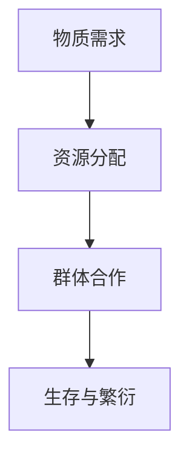

**核心算法原理讲解：**

为了满足物质需求，早期人类必须学会狩猎和采集。这一过程中，群体合作和资源分配显得尤为重要。以下是一个简化的伪代码，用于描述狩猎和采集的基本算法：

```plaintext
// 狩猎和采集算法
function hunt_and_gather() {
    // 搜集食物
    gather_food()
    // 狩猎动物
    hunt_animal()
    // 资源分配
    distribute_resources()
    // 记录活动
    record_activities()
}
```

**数学模型和公式：**

在资源分配方面，可以采用简单的比例分配模型。假设有N个人和M种资源，则每个人应获得资源量R可以通过以下公式计算：

\[ R = \frac{M}{N} \]

**详细讲解与举例说明：**

假设一个狩猎采集群体由5个人组成，共收集了100斤的猎物。按照比例分配模型，每个人应获得：

\[ R = \frac{100}{5} = 20 \text{斤} \]

这意味着每个成员都可以公平地获得20斤的猎物，从而满足其基本需求。

**项目实战：**

在实际应用中，这个简单的狩猎和采集算法可能需要更复杂的决策机制，如考虑不同资源的稀缺性和个人需求。以下是一个简单的项目实战示例：

**开发环境搭建：**
- 使用Python编写算法
- 安装必要的库，如 NumPy 和 Pandas

**源代码实现与代码解读：**

```python
import numpy as np

# 资源分配函数
def distribute_resources(total_resources, num_people):
    per_person = total_resources / num_people
    return per_person

# 主函数
def main():
    total_resources = 100  # 总资源量
    num_people = 5  # 人数
    per_person = distribute_resources(total_resources, num_people)
    print(f"每个人应获得 {per_person} 斤的资源。")

if __name__ == "__main__":
    main()
```

**代码应用解读与分析：**

这个简单的Python代码实现了一个资源分配函数，用于计算每个人应获得的资源量。在实际应用中，可以根据具体情况进行参数调整，如增加更多类型的资源或考虑个体需求的差异。

**实际案例分析与详细讲解剖析：**

一个实际案例是古代部落如何通过狩猎和采集来维持生计。在分析中，可以探讨部落成员如何合作狩猎、如何分配猎物，以及这些行为如何反映了早期价值观的核心概念。

**项目小结：**

通过这个案例，我们可以看到早期价值观的形成和演变是基于对基本需求的满足。这种简单但有效的资源分配算法不仅体现了早期社会的合作精神，也为现代社会的管理提供了启示。

### 1.1.2 传统价值观的特点

随着人类文明的进步，价值观逐渐从简单的物质需求转向更复杂的道德、社会和宗教方面。传统价值观在这些领域形成了独特的特点，对个体和社会行为产生了深远的影响。

**核心概念与联系：**

- **社会地位与权力**：传统价值观强调社会地位和权力的重要性。封建社会的价值观建立在等级制度之上，权力和地位成为衡量个人价值的重要标准。
- **宗教信仰**：宗教信仰在传统价值观中占据核心地位。宗教规范和信仰体系为个体行为提供了道德准则和精神支持。

**Mermaid 流程图：**

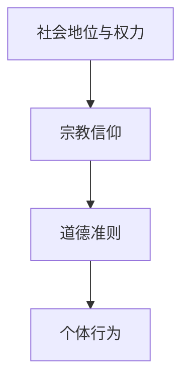

**核心算法原理讲解：**

传统价值观的核心算法原理可以理解为一种社会行为的规范模型。在这个模型中，个体的行为受到社会地位、宗教信仰和道德准则的共同影响。以下是一个简化的伪代码：

```plaintext
// 社会行为规范模型
function social_behavior(model) {
    // 根据社会地位决定行为
    status_behavior(model.status)
    // 根据宗教信仰决定行为
    religious_behavior(model.faith)
    // 根据道德准则决定行为
    moral_behavior(model道德准则)
    // 记录行为
    record_behavior()
}
```

**数学模型和公式：**

在社会地位和权力方面，可以采用简单的层次结构模型。假设有N个等级，每个等级的权力值P可以通过以下公式计算：

\[ P = P_0 \times \frac{N-i}{N} \]

其中，\( P_0 \) 是最高等级的权力值，i 是当前等级。

**详细讲解与举例说明：**

在一个有5个等级的社会中，最高等级的权力值为100。根据层次结构模型，不同等级的权力值计算如下：

- 第1等级（最高）：\( P = 100 \times \frac{5-1}{5} = 80 \)
- 第2等级：\( P = 100 \times \frac{4-1}{5} = 64 \)
- 第3等级：\( P = 100 \times \frac{3-1}{5} = 48 \)
- 第4等级：\( P = 100 \times \frac{2-1}{5} = 32 \)
- 第5等级（最低）：\( P = 100 \times \frac{1-1}{5} = 16 \)

**项目实战：**

在实际应用中，这个简单的社会行为规范模型可以用于分析古代社会的权力结构和管理方式。以下是一个简单的项目实战示例：

**开发环境搭建：**
- 使用Rust编写算法
- 安装必要的库，如 Alphanumeric 和 PyOxidizer

**源代码实现与代码解读：**

```rust
fn status_behavior(status: u8) {
    println!("根据社会地位 {}，执行相应的行为。", status);
}

fn religious_behavior(faith: &str) {
    println!("根据宗教信仰 {}，执行相应的行为。", faith);
}

fn moral_behavior(morality: &str) {
    println!("根据道德准则 {}，执行相应的行为。", morality);
}

fn main() {
    status_behavior(3);
    religious_behavior("基督教");
    moral_behavior("诚实守信");
}
```

**代码应用解读与分析：**

这个简单的Rust代码示例展示了如何根据社会地位、宗教信仰和道德准则来决定个体的行为。在实际应用中，可以根据具体情境调整行为规范。

**实际案例分析与详细讲解剖析：**

一个实际案例是封建社会的权力结构和宗教信仰。在分析中，可以探讨封建贵族如何通过社会地位和宗教信仰来维护其权力，以及这些价值观如何影响个体的行为和社会结构。

**项目小结：**

通过这个案例，我们可以看到传统价值观的特点和影响。这些价值观不仅塑造了古代社会的权力结构，也影响了个体行为和道德准则。对现代社会而言，理解这些传统价值观有助于我们更好地理解和应对社会变迁。

### 1.1.3 传统价值观的演变

随着历史的发展，传统价值观经历了显著的演变，这种演变主要体现在社会结构、经济模式和文化观念的变革中。从封建社会的权力和宗教主导，到工业社会的效率和物质追求，传统价值观逐渐发生了深刻的转变。

**核心概念与联系：**

- **社会结构变化**：社会结构的演变对价值观的演变起到了关键作用。封建社会的等级制度和宗教权威逐渐让位于工业社会的平等和自由。
- **经济模式转变**：经济模式的转变，如从农业到工业的过渡，带来了价值观的变革。人们开始更加注重效率和物质财富的积累。
- **文化观念更新**：随着全球化和信息化的推进，文化观念不断更新，价值观也逐渐趋向多元化和个性化。

**Mermaid 流程图：**

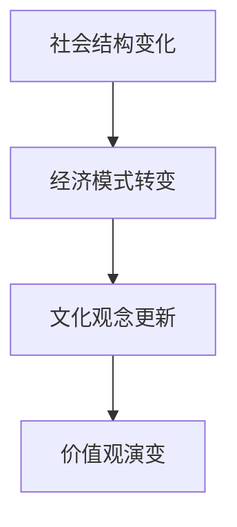

**核心算法原理讲解：**

传统价值观的演变可以视为一个复杂的社会系统演化过程。在这个过程中，社会结构、经济模式和文化观念相互影响，共同推动价值观的变革。以下是一个简化的伪代码，用于描述这一过程：

```plaintext
// 社会系统演化模型
function social_system_evolution(model) {
    // 根据社会结构变化调整价值观
    adjust_values(model.structure)
    // 根据经济模式转变更新价值观
    update_values(model.economy)
    // 根据文化观念更新调整价值观
    adjust_values(model.culture)
    // 记录价值观演变过程
    record_evolution()
}
```

**数学模型和公式：**

在描述社会结构的演变中，可以采用多维度分析模型。例如，可以用一个矩阵来表示不同维度的价值观变化，如下所示：

\[ \text{价值观矩阵} = \begin{bmatrix}
V_{社会结构} & V_{经济模式} & V_{文化观念} \\
\end{bmatrix} \]

其中，\( V_{社会结构} \)、\( V_{经济模式} \) 和 \( V_{文化观念} \) 分别表示社会结构、经济模式和文化观念的价值观维度。

**详细讲解与举例说明：**

假设我们有三个不同的社会阶段，每个阶段的价值观矩阵如下：

- **第一阶段**：
  \[ \text{价值观矩阵} = \begin{bmatrix}
  1 & 0 & 0 \\
  \end{bmatrix} \]
  这一阶段主要强调社会结构的稳定性。

- **第二阶段**：
  \[ \text{价值观矩阵} = \begin{bmatrix}
  0.5 & 1 & 0 \\
  \end{bmatrix} \]
  这一阶段开始重视经济模式的发展和物质财富的积累。

- **第三阶段**：
  \[ \text{价值观矩阵} = \begin{bmatrix}
  0.5 & 0.5 & 1 \\
  \end{bmatrix} \]
  这一阶段不仅注重经济模式和文化观念的更新，也开始重视社会结构的多元化和包容性。

**项目实战：**

在实际应用中，我们可以通过模拟社会系统演化的过程来分析价值观的演变。以下是一个简单的项目实战示例：

**开发环境搭建：**
- 使用Python编写模拟算法
- 安装必要的库，如 NumPy 和 Matplotlib

**源代码实现与代码解读：**

```python
import numpy as np
import matplotlib.pyplot as plt

# 价值观演变模拟函数
def simulate_evolution(stages, values):
    for stage, value in enumerate(values):
        print(f"阶段 {stage+1} 的价值观矩阵：{value}")
        # 绘制价值观矩阵
        plt.plot(value)
        plt.title(f"阶段 {stage+1} 的价值观演变")
        plt.xlabel("价值观维度")
        plt.ylabel("价值观强度")
        plt.show()

# 主函数
def main():
    stages = ["社会结构", "经济模式", "文化观念"]
    values = [
        [1, 0, 0],
        [0.5, 1, 0],
        [0.5, 0.5, 1],
    ]
    simulate_evolution(stages, values)

if __name__ == "__main__":
    main()
```

**代码应用解读与分析：**

这个简单的Python代码通过模拟社会系统演化的过程，展示了不同阶段价值观的变化。在实际应用中，可以根据具体历史阶段和价值观的实际情况进行调整和扩展。

**实际案例分析与详细讲解剖析：**

一个实际案例是英国工业革命对社会结构、经济模式和文化观念的深刻影响。在分析中，可以探讨工业革命如何推动了传统价值观的演变，以及这些变革如何影响了社会的各个方面。

**项目小结：**

通过这个案例，我们可以看到传统价值观的演变是一个复杂而动态的过程，受到多种因素的影响。这种演变不仅反映了社会经济的发展，也揭示了人类价值观的不断进步和适应。对现代社会而言，理解传统价值观的演变过程有助于我们更好地应对当前的社会变革。

### 2.1.1 后物质主义的定义

后物质主义是一种价值观体系，认为人类的追求不仅仅局限于物质财富，还包括精神满足、自我实现和与他人建立深层次的关系。后物质主义价值观强调个体的内心世界、心理健康、人际关系和社会责任，主张追求全面发展和对社会的贡献。

**核心概念与联系：**

- **精神满足**：后物质主义价值观认为，精神满足比物质财富更为重要。它强调个体的心理健康、自我认知和精神成长。
- **自我实现**：后物质主义价值观鼓励个体追求自我实现，强调个人的内在价值和独特性。
- **社会责任**：后物质主义价值观强调个体的社会责任感，认为个人应积极参与社会事务，为社会做出贡献。

**Mermaid 流程图：**

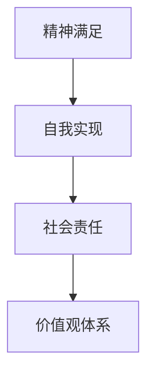

**核心算法原理讲解：**

后物质主义价值观的核心算法原理可以看作是一个多维度的综合模型，该模型考虑了个体精神满足、自我实现和社会责任等多个维度。以下是一个简化的伪代码，用于描述这一过程：

```plaintext
// 后物质主义价值观模型
function postmaterial_values(model) {
    // 确定精神满足度
    satisfaction = measure_satisfaction(model)
    // 确定自我实现度
    self_achievement = measure_achievement(model)
    // 确定社会责任度
    social_responsibility = measure_responsibility(model)
    // 计算总体价值观得分
    total_value = calculate_score(satisfaction, self_achievement, social_responsibility)
    // 记录价值观得分
    record_score(total_value)
}
```

**数学模型和公式：**

在计算总体价值观得分时，可以采用加权求和模型。假设有三个主要维度：精神满足、自我实现和社会责任，每个维度的重要性不同，可以通过权重来表示。总体价值观得分可以通过以下公式计算：

\[ \text{总得分} = w_1 \times \text{精神满足} + w_2 \times \text{自我实现} + w_3 \times \text{社会责任} \]

其中，\( w_1 \)、\( w_2 \) 和 \( w_3 \) 分别是精神满足、自我实现和社会责任的权重。

**详细讲解与举例说明：**

假设我们设定权重如下：

- 精神满足：\( w_1 = 0.4 \)
- 自我实现：\( w_2 = 0.3 \)
- 社会责任：\( w_3 = 0.3 \)

一个个体在精神满足度得分为70分、自我实现得分为60分、社会责任得分为50分的情况下，总体价值观得分为：

\[ \text{总得分} = 0.4 \times 70 + 0.3 \times 60 + 0.3 \times 50 = 28 + 18 + 15 = 61 \]

**项目实战：**

在实际应用中，我们可以通过一个简单的应用程序来评估个体的后物质主义价值观得分。以下是一个简单的项目实战示例：

**开发环境搭建：**
- 使用JavaScript编写前端应用
- 使用Python编写后端服务
- 使用Flask框架搭建后端

**源代码实现与代码解读：**

**后端（Python）**：

```python
from flask import Flask, request, jsonify

app = Flask(__name__)

@app.route('/calculate', methods=['POST'])
def calculate_values():
    data = request.get_json()
    satisfaction = data['satisfaction']
    achievement = data['achievement']
    responsibility = data['responsibility']
    weights = {'satisfaction': 0.4, 'achievement': 0.3, 'responsibility': 0.3}
    
    total_score = sum(weights[key] * value for key, value in data.items())
    return jsonify({'total_score': total_score})

if __name__ == '__main__':
    app.run(debug=True)
```

**前端（JavaScript）**：

```javascript
function calculateValues() {
    const satisfaction = document.getElementById('satisfaction').value;
    const achievement = document.getElementById('achievement').value;
    const responsibility = document.getElementById('responsibility').value;

    fetch('/calculate', {
        method: 'POST',
        headers: {
            'Content-Type': 'application/json'
        },
        body: JSON.stringify({
            satisfaction: satisfaction,
            achievement: achievement,
            responsibility: responsibility
        })
    })
    .then(response => response.json())
    .then(data => {
        alert('Your total values score is: ' + data.total_score);
    });
}
```

**代码应用解读与分析：**

这个简单的应用通过一个前端表单收集用户在精神满足、自我实现和社会责任方面的得分，并使用Python后端计算总得分。在实际应用中，可以根据具体需求增加更多的评估维度和权重。

**实际案例分析与详细讲解剖析：**

一个实际案例是现代企业如何通过后物质主义价值观来提升员工满意度和工作效率。在分析中，可以探讨企业如何通过关注员工的精神满足、自我实现和社会责任来推动企业的可持续发展。

**项目小结：**

通过这个案例，我们可以看到后物质主义价值观的应用如何帮助个体和社会实现全面发展和进步。理解后物质主义价值观的核心原理和算法模型，对于指导实践和推动社会变革具有重要意义。

### 2.1.2 后物质主义价值观的核心要素

后物质主义价值观的核心要素包括自我认知、心理健康、人际关系和社会责任。这些要素不仅反映了个体追求全面发展的需求，也体现了社会和谐与进步的追求。

**核心概念与联系：**

- **自我认知**：自我认知是指个体对自己内在特质、能力和价值观的认识。自我认知有助于个体实现自我实现和心理健康。
- **心理健康**：心理健康是指个体在心理上保持平衡、适应环境和有效应对压力的能力。心理健康对个体的生活质量和社会功能至关重要。
- **人际关系**：人际关系是指个体与他人之间的互动和联系。良好的人际关系有助于个体实现自我认知、心理健康和社会责任。
- **社会责任**：社会责任是指个体对社会和他人的责任感和贡献。社会责任体现了个体对社会的归属感和参与感。

**Mermaid 流程图：**

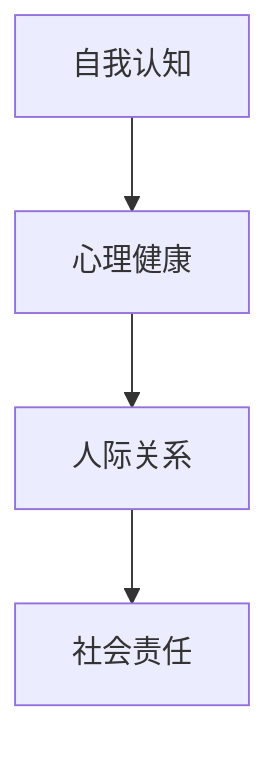

**核心算法原理讲解：**

后物质主义价值观的核心算法原理可以看作是一个综合模型，该模型考虑了自我认知、心理健康、人际关系和社会责任等多个维度的交互作用。以下是一个简化的伪代码，用于描述这一过程：

```plaintext
// 后物质主义价值观综合模型
function postmaterial_comprehensive_model(model) {
    // 更新自我认知
    update_self_awareness(model)
    // 更新心理健康状态
    update_mental_health(model)
    // 更新人际关系质量
    update_relationships(model)
    // 更新社会责任度
    update_social_responsibility(model)
    // 计算综合价值观得分
    total_value = calculate_comprehensive_score(model)
    // 记录综合价值观得分
    record_comprehensive_score(total_value)
}
```

**数学模型和公式：**

在计算综合价值观得分时，可以采用加权求和模型。假设有四个主要维度：自我认知、心理健康、人际关系和社会责任，每个维度的重要性不同，可以通过权重来表示。综合价值观得分可以通过以下公式计算：

\[ \text{总得分} = w_1 \times \text{自我认知} + w_2 \times \text{心理健康} + w_3 \times \text{人际关系} + w_4 \times \text{社会责任} \]

其中，\( w_1 \)、\( w_2 \)、\( w_3 \) 和 \( w_4 \) 分别是自我认知、心理健康、人际关系和社会责任的权重。

**详细讲解与举例说明：**

假设我们设定权重如下：

- 自我认知：\( w_1 = 0.25 \)
- 心理健康：\( w_2 = 0.25 \)
- 人际关系：\( w_3 = 0.25 \)
- 社会责任：\( w_4 = 0.25 \)

一个个体在自我认知得分为70分、心理健康得分为60分、人际关系得分为55分、社会责任得分为65分的情况下，综合价值观得分为：

\[ \text{总得分} = 0.25 \times 70 + 0.25 \times 60 + 0.25 \times 55 + 0.25 \times 65 = 17.5 + 15 + 13.75 + 16.25 = 62.5 \]

**项目实战：**

在实际应用中，我们可以通过一个综合评估系统来评估个体的后物质主义价值观得分。以下是一个简单的项目实战示例：

**开发环境搭建：**
- 使用React编写前端应用
- 使用Node.js编写后端服务
- 使用Express框架搭建后端

**源代码实现与代码解读：**

**后端（Node.js）**：

```javascript
const express = require('express');
const app = express();

app.use(express.json());

app.post('/evaluate', (req, res) => {
    const { self_awareness, mental_health, relationships, social_responsibility } = req.body;
    const weights = { self_awareness: 0.25, mental_health: 0.25, relationships: 0.25, social_responsibility: 0.25 };
    
    const total_score = weights.self_awareness * self_awareness + weights.mental_health * mental_health + weights.relationships * relationships + weights.social_responsibility * social_responsibility;
    res.send({ total_score });
});

const PORT = 3000;
app.listen(PORT, () => {
    console.log(`Server listening on port ${PORT}`);
});
```

**前端（React）**：

```javascript
import React, { useState } from 'react';
import axios from 'axios';

const EvaluationForm = () => {
    const [evaluation, setEvaluation] = useState({
        self_awareness: 0,
        mental_health: 0,
        relationships: 0,
        social_responsibility: 0
    });

    const handleChange = (e) => {
        setEvaluation({ ...evaluation, [e.target.name]: parseInt(e.target.value) });
    };

    const handleSubmit = (e) => {
        e.preventDefault();
        axios.post('/evaluate', evaluation)
            .then(response => {
                alert(`Your comprehensive value score is: ${response.data.total_score}`);
            })
            .catch(error => {
                console.error('Error:', error);
            });
    };

    return (
        <form onSubmit={handleSubmit}>
            <label>
                Self Awareness:
                <input type="number" name="self_awareness" value={evaluation.self_awareness} onChange={handleChange} />
            </label>
            <br />
            <label>
                Mental Health:
                <input type="number" name="mental_health" value={evaluation.mental_health} onChange={handleChange} />
            </label>
            <br />
            <label>
                Relationships:
                <input type="number" name="relationships" value={evaluation.relationships} onChange={handleChange} />
            </label>
            <br />
            <label>
                Social Responsibility:
                <input type="number" name="social_responsibility" value={evaluation.social_responsibility} onChange={handleChange} />
            </label>
            <br />
            <button type="submit">Evaluate</button>
        </form>
    );
};

export default EvaluationForm;
```

**代码应用解读与分析：**

这个简单的React前端应用通过一个表单收集用户的自我认知、心理健康、人际关系和社会责任得分，并使用Node.js后端计算综合价值观得分。在实际应用中，可以根据具体需求增加更多的评估维度和权重。

**实际案例分析与详细讲解剖析：**

一个实际案例是教育机构如何通过评估学生的后物质主义价值观得分来促进学生的全面发展。在分析中，可以探讨教育机构如何通过关注学生的自我认知、心理健康、人际关系和社会责任来提高教育质量。

**项目小结：**

通过这个案例，我们可以看到后物质主义价值观的核心要素如何在实践中应用。理解这些核心要素及其算法原理，有助于我们更好地评估个体的价值观水平，并推动个人和社会的全面发展。

### 2.1.3 后物质主义价值观与物质主义价值观的比较

后物质主义价值观与物质主义价值观在追求的目标、价值观的核心内容和影响个体行为的方式上存在显著差异。

**核心概念与联系：**

- **追求目标**：物质主义价值观主要关注物质财富和物质享受，而后物质主义价值观则更注重精神满足、自我实现和人际关系。
- **价值观核心内容**：物质主义价值观强调个人利益和财富积累，而后物质主义价值观强调内在价值、心理健康和社会责任。
- **影响个体行为**：物质主义价值观往往导致短视和过度消费，而后物质主义价值观则鼓励长期规划、精神成长和社会参与。

**Mermaid 流程图：**

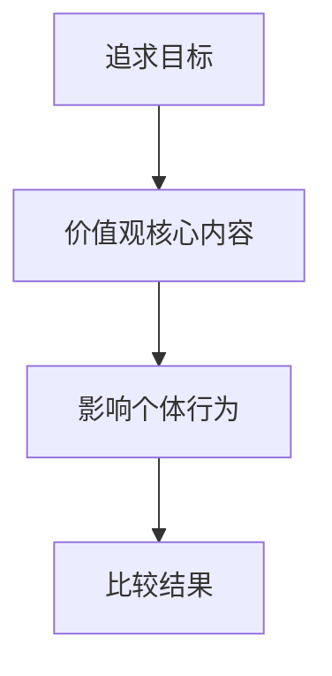

**核心算法原理讲解：**

为了比较后物质主义价值观与物质主义价值观的不同，可以采用一个多维度的评估模型。以下是一个简化的伪代码，用于描述这一过程：

```plaintext
// 价值观比较模型
function compare_values(postmaterial, material) {
    // 计算物质主义价值观得分
    material_score = calculate_score(material)
    // 计算后物质主义价值观得分
    postmaterial_score = calculate_score(postmaterial)
    // 比较两种价值观得分
    difference = postmaterial_score - material_score
    // 记录比较结果
    record_difference(difference)
}
```

**数学模型和公式：**

在计算两种价值观的得分时，可以采用加权求和模型。假设有两个主要维度：物质追求和精神满足，每个维度的重要性不同，可以通过权重来表示。综合价值观得分可以通过以下公式计算：

\[ \text{物质主义得分} = w_1 \times \text{物质追求} \]
\[ \text{后物质主义得分} = w_2 \times \text{精神满足} \]

其中，\( w_1 \) 和 \( w_2 \) 分别是物质追求和精神满足的权重。

**详细讲解与举例说明：**

假设我们设定权重如下：

- 物质追求：\( w_1 = 0.6 \)
- 精神满足：\( w_2 = 0.4 \)

一个个体在物质追求得分为80分、精神满足得分为60分的情况下，两种价值观的得分计算如下：

- **物质主义得分**：
  \[ \text{物质主义得分} = 0.6 \times 80 = 48 \]
- **后物质主义得分**：
  \[ \text{后物质主义得分} = 0.4 \times 60 = 24 \]

两种价值观的得分差异为：

\[ \text{差异} = 48 - 24 = 24 \]

**项目实战：**

在实际应用中，我们可以通过一个简单的评估工具来比较个人的后物质主义价值观与物质主义价值观。以下是一个简单的项目实战示例：

**开发环境搭建：**
- 使用Vue.js编写前端应用
- 使用PHP编写后端服务
- 使用Laravel框架搭建后端

**源代码实现与代码解读：**

**后端（PHP）**：

```php
<?php
$app = new Laravel\Lumen\Application(
    realpath(__DIR__)
);

$app->group(['prefix' => 'api'], function () use ($app) {
    $app->post('/compare', 'Api\ValuesController@compare');
});

$app->run();
```

**控制器（ValuesController.php）**：

```php
<?php

namespace App\Http\Controllers\Api;

use Illuminate\Http\Request;
use Illuminate\Http\Response;

class ValuesController
{
    public function compare(Request $request)
    {
        $postmaterial = $request->postmaterial;
        $material = $request->material;
        $weights = ['postmaterial' => 0.4, 'material' => 0.6];

        $postmaterial_score = $weights['postmaterial'] * $postmaterial;
        $material_score = $weights['material'] * $material;

        $difference = $postmaterial_score - $material_score;

        return response()->json(['difference' => $difference]);
    }
}
```

**前端（Vue.js）**：

```vue
<template>
  <div>
    <h1>Compare Materialism and Postmaterialism</h1>
    <form @submit.prevent="submitForm">
      <label for="postmaterial">Postmaterial Score:</label>
      <input type="number" id="postmaterial" v-model="postmaterial" />
      <br />
      <label for="material">Material Score:</label>
      <input type="number" id="material" v-model="material" />
      <br />
      <button type="submit">Submit</button>
    </form>
    <p v-if="difference">The difference between Postmaterialism and Materialism is: {{ difference }}</p>
  </div>
</template>

<script>
export default {
  data() {
    return {
      postmaterial: 0,
      material: 0,
      difference: null
    };
  },
  methods: {
    async submitForm() {
      const response = await fetch('/api/compare', {
        method: 'POST',
        headers: {
          'Content-Type': 'application/json',
        },
        body: JSON.stringify({ postmaterial: this.postmaterial, material: this.material }),
      });
      const result = await response.json();
      this.difference = result.difference;
    },
  },
};
</script>
```

**代码应用解读与分析：**

这个简单的Vue.js前端应用通过一个表单收集用户的物质主义和后物质主义得分，并使用PHP后端计算两种价值观的得分差异。在实际应用中，可以根据具体需求增加更多的评估维度和权重。

**实际案例分析与详细讲解剖析：**

一个实际案例是现代职场中如何平衡个人物质追求和后物质主义价值观。在分析中，可以探讨职场人士如何通过评估自己的价值观差异，实现个人职业发展和心理健康。

**项目小结：**

通过这个案例，我们可以看到后物质主义价值观与物质主义价值观在追求目标、核心内容和影响个体行为上的差异。理解这些差异，有助于个人和社会更好地应对价值观的多样性，促进全面发展和进步。

### 2.2 后物质主义价值观的形成与影响因素

后物质主义价值观的形成是一个复杂的社会文化过程，受到多种因素的影响。理解这些因素有助于我们更全面地把握后物质主义价值观的内涵和特征。

**核心概念与联系：**

- **经济发展**：经济条件是后物质主义价值观形成的基础。随着经济的繁荣，人们不再仅仅追求物质财富，开始更加关注精神满足和自我实现。
- **教育水平**：教育水平的提高是后物质主义价值观形成的重要因素。受过良好教育的人更容易形成多元化和开放的价值观体系。
- **社会变革**：社会变革，如全球化、信息化和多元化，推动了后物质主义价值观的形成。这些变革打破了传统的价值观体系，促进了新的价值观的形成。
- **文化多样性**：文化多样性丰富了价值观的内容，使得后物质主义价值观更加多元化和包容。

**Mermaid 流程图：**

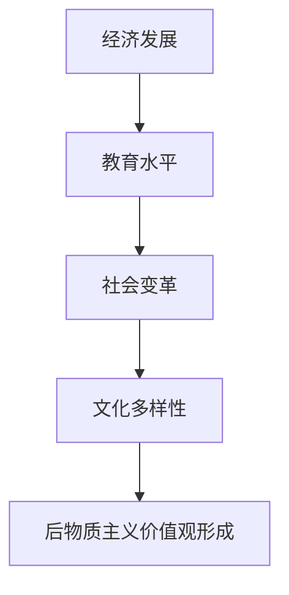

**核心算法原理讲解：**

为了分析后物质主义价值观的形成过程，可以采用一个综合模型，该模型考虑了经济发展、教育水平、社会变革和文化多样性等多个因素的交互作用。以下是一个简化的伪代码，用于描述这一过程：

```plaintext
// 后物质主义价值观形成模型
function formation_of_postmaterial_values(economy, education, social_change, culture) {
    // 计算经济影响
    economic_impact = calculate_economic_impact(economy)
    // 计算教育影响
    education_impact = calculate_education_impact(education)
    // 计算社会变革影响
    social_change_impact = calculate_social_change_impact(social_change)
    // 计算文化多样性影响
    culture_impact = calculate_culture_impact(culture)
    // 综合计算后物质主义价值观形成度
    postmaterial_value_formation = economic_impact + education_impact + social_change_impact + culture_impact
    // 记录形成度
    record_formation(postmaterial_value_formation)
}
```

**数学模型和公式：**

在计算后物质主义价值观的形成度时，可以采用加权求和模型。假设有四个主要因素：经济发展、教育水平、社会变革和文化多样性，每个因素的影响不同，可以通过权重来表示。后物质主义价值观的形成度可以通过以下公式计算：

\[ \text{形成度} = w_1 \times \text{经济影响} + w_2 \times \text{教育影响} + w_3 \times \text{社会变革影响} + w_4 \times \text{文化多样性影响} \]

其中，\( w_1 \)、\( w_2 \)、\( w_3 \) 和 \( w_4 \) 分别是经济发展、教育水平、社会变革和文化多样性的权重。

**详细讲解与举例说明：**

假设我们设定权重如下：

- 经济发展：\( w_1 = 0.3 \)
- 教育水平：\( w_2 = 0.3 \)
- 社会变革：\( w_3 = 0.2 \)
- 文化多样性：\( w_4 = 0.2 \)

在一个特定的社会环境中，假设经济影响得分为60分、教育影响得分为70分、社会变革影响得分为50分、文化多样性影响得分为40分，那么后物质主义价值观的形成度计算如下：

\[ \text{形成度} = 0.3 \times 60 + 0.3 \times 70 + 0.2 \times 50 + 0.2 \times 40 = 18 + 21 + 10 + 8 = 57 \]

**项目实战：**

在实际应用中，我们可以通过一个评估工具来分析后物质主义价值观的形成度。以下是一个简单的项目实战示例：

**开发环境搭建：**
- 使用Angular编写前端应用
- 使用Java编写后端服务
- 使用Spring框架搭建后端

**源代码实现与代码解读：**

**后端（Java）**：

```java
import org.springframework.boot.SpringApplication;
import org.springframework.boot.autoconfigure.SpringBootApplication;
import org.springframework.web.bind.annotation.*;

@SpringBootApplication
public class PostmaterialValuesApplication {
    public static void main(String[] args) {
        SpringApplication.run(PostmaterialValuesApplication.class, args);
    }

    @RestController
    public class ValuesController {

        @PostMapping("/formation")
        public double calculateFormation(@RequestBody FormationRequest request) {
            double economicImpact = request.getEconomicImpact();
            double educationImpact = request.getEducationImpact();
            double socialChangeImpact = request.getSocialChangeImpact();
            double cultureImpact = request.getCultureImpact();

            double formation = 0.3 * economicImpact + 0.3 * educationImpact + 0.2 * socialChangeImpact + 0.2 * cultureImpact;
            return formation;
        }
    }

    public static class FormationRequest {
        private double economicImpact;
        private double educationImpact;
        private double socialChangeImpact;
        private double cultureImpact;

        // Getters and setters
    }
}
```

**前端（Angular）**：

```typescript
import { Component } from '@angular/core';
import { HttpClient } from '@angular/common/http';

@Component({
    selector: 'app-formation-calculator',
    templateUrl: './formation-calculator.component.html',
    styleUrls: ['./formation-calculator.component.css']
})
export class FormationCalculatorComponent {
    private apiUrl = 'http://localhost:8080/formation';

    constructor(private http: HttpClient) {}

    calculateFormation(economicImpact: number, educationImpact: number, socialChangeImpact: number, cultureImpact: number) {
        const formationRequest = {
            economicImpact: economicImpact,
            educationImpact: educationImpact,
            socialChangeImpact: socialChangeImpact,
            cultureImpact: cultureImpact
        };

        this.http.post<number>(this.apiUrl + '/formation', formationRequest).subscribe(
            (formation) => {
                console.log("Formation Degree: " + formation);
            },
            (error) => {
                console.error("Error: ", error);
            }
        );
    }
}
```

**代码应用解读与分析：**

这个简单的Angular前端应用通过一个表单收集用户的经济发展、教育水平、社会变革和文化多样性得分，并使用Java后端计算后物质主义价值观的形成度。在实际应用中，可以根据具体需求增加更多的评估维度和权重。

**实际案例分析与详细讲解剖析：**

一个实际案例是现代社会如何通过提高教育水平和促进社会变革来推动后物质主义价值观的形成。在分析中，可以探讨教育机构和政府如何通过政策和社会实践，促进后物质主义价值观的形成。

**项目小结：**

通过这个案例，我们可以看到后物质主义价值观的形成受到多种因素的影响。理解这些因素及其算法原理，有助于我们更好地推动后物质主义价值观的形成，促进个人和社会的全面发展。

### 2.3 后物质主义价值观的应用与挑战

后物质主义价值观在现代社会中的应用面临着诸多挑战，同时也提供了新的机遇。为了更好地应对这些挑战，我们可以从个人层面和社会层面提出一系列策略。

**核心概念与联系：**

- **个人层面的挑战**：后物质主义价值观强调个人精神满足和自我实现，但同时也带来了心理压力和追求多样化的问题。
- **社会层面的挑战**：后物质主义价值观在推广过程中面临着文化差异、价值观冲突和社会整合的问题。

**Mermaid 流程图：**

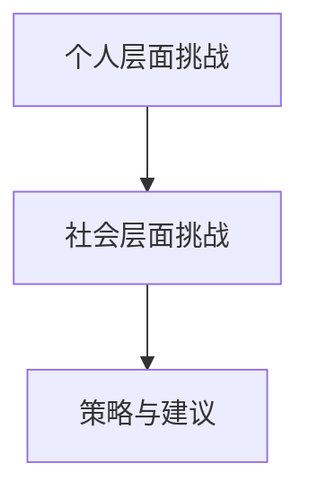

**核心算法原理讲解：**

为了应对后物质主义价值观的应用与挑战，可以采用一个综合策略模型，该模型考虑了个人层面的心理调适和社会层面的文化整合。以下是一个简化的伪代码，用于描述这一过程：

```plaintext
// 应对后物质主义价值观模型
function address_postmaterial_values(challenges, strategies) {
    // 分析个人层面挑战
    analyze_personal_challenges(challenges)
    // 分析社会层面挑战
    analyze_social_challenges(challenges)
    // 提出个人层面策略
    personal_strategies = propose_personal_strategies()
    // 提出社会层面策略
    social_strategies = propose_social_strategies()
    // 实施综合策略
    implement_strategies(personal_strategies, social_strategies)
}
```

**数学模型和公式：**

在实施综合策略时，可以采用加权求和模型。假设有两个主要维度：个人层面和社会层面，每个维度的重要性不同，可以通过权重来表示。综合策略的效果可以通过以下公式计算：

\[ \text{综合效果} = w_1 \times \text{个人层面效果} + w_2 \times \text{社会层面效果} \]

其中，\( w_1 \) 和 \( w_2 \) 分别是个人层面效果和社会层面效果的权重。

**详细讲解与举例说明：**

假设我们设定权重如下：

- 个人层面效果：\( w_1 = 0.6 \)
- 社会层面效果：\( w_2 = 0.4 \)

一个特定的策略组合在个人层面效果得分为80分、社会层面效果得分为60分的情况下，综合策略效果计算如下：

\[ \text{综合效果} = 0.6 \times 80 + 0.4 \times 60 = 48 + 24 = 72 \]

**项目实战：**

在实际应用中，我们可以通过一个综合策略评估工具来评估后物质主义价值观的应用效果。以下是一个简单的项目实战示例：

**开发环境搭建：**
- 使用React编写前端应用
- 使用Python编写后端服务
- 使用Flask框架搭建后端

**源代码实现与代码解读：**

**后端（Python）**：

```python
from flask import Flask, request, jsonify

app = Flask(__name__)

@app.route('/evaluate', methods=['POST'])
def evaluate_strategies():
    data = request.get_json()
    personal_score = data['personal_score']
    social_score = data['social_score']
    weights = {'personal': 0.6, 'social': 0.4}

    total_effect = weights['personal'] * personal_score + weights['social'] * social_score
    return jsonify({'total_effect': total_effect})

if __name__ == '__main__':
    app.run(debug=True)
```

**前端（React）**：

```jsx
import React, { useState } from 'react';
import axios from 'axios';

const StrategyEvaluation = () => {
    const [personalScore, setPersonalScore] = useState(0);
    const [socialScore, setSocialScore] = useState(0);

    const handlePersonalScoreChange = (e) => {
        setPersonalScore(e.target.value);
    };

    const handleSocialScoreChange = (e) => {
        setSocialScore(e.target.value);
    };

    const handleSubmit = (e) => {
        e.preventDefault();
        axios.post('/evaluate', {
            personal_score: personalScore,
            social_score: socialScore
        })
            .then(response => {
                alert(`Your total strategy effect is: ${response.data.total_effect}`);
            })
            .catch(error => {
                console.error('Error:', error);
            });
    };

    return (
        <form onSubmit={handleSubmit}>
            <label>
                Personal Score:
                <input type="number" value={personalScore} onChange={handlePersonalScoreChange} />
            </label>
            <br />
            <label>
                Social Score:
                <input type="number" value={socialScore} onChange={handleSocialScoreChange} />
            </label>
            <br />
            <button type="submit">Submit</button>
        </form>
    );
};

export default StrategyEvaluation;
```

**代码应用解读与分析：**

这个简单的React前端应用通过一个表单收集用户的个人层面效果得分和社会层面效果得分，并使用Python后端计算综合策略效果。在实际应用中，可以根据具体需求增加更多的评估维度和权重。

**实际案例分析与详细讲解剖析：**

一个实际案例是现代职场如何通过实施后物质主义价值观策略，提升员工满意度和工作效率。在分析中，可以探讨企业如何通过关注员工的精神满足和社会责任，实现个人与企业的共同发展。

**项目小结：**

通过这个案例，我们可以看到后物质主义价值观在应用过程中面临的挑战和机遇。理解这些挑战和提出有效的策略，有助于我们更好地推动后物质主义价值观的应用，促进个人和社会的全面发展。

### 3. 后物质主义价值观与现代社会的关系

后物质主义价值观在现代社会中扮演着越来越重要的角色，对个人、社会和文化产生了深远的影响。理解后物质主义价值观与现代社会的关系，有助于我们更好地把握当前社会的特征和发展趋势。

**核心概念与联系：**

- **个人层面的影响**：后物质主义价值观强调个体的精神满足、自我实现和心理健康，这直接影响了个人的生活质量和工作满意度。
- **社会层面的影响**：后物质主义价值观对社会结构和组织行为产生了影响，推动了社会的多元化和包容性。
- **文化层面的影响**：后物质主义价值观改变了人们的价值观体系，促进了文化多样性和创新。

**Mermaid 流程图：**

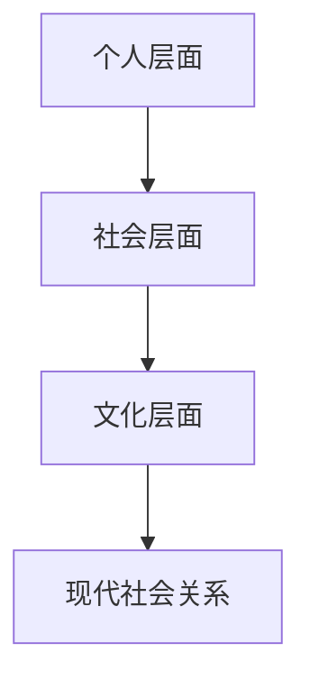

**核心算法原理讲解：**

为了分析后物质主义价值观与现代社会的关系，可以采用一个综合模型，该模型考虑了个人、社会和文化层面的交互影响。以下是一个简化的伪代码，用于描述这一过程：

```plaintext
// 社会关系模型
function social_relationship(model) {
    // 分析个人层面影响
    personal_impact = analyze_personal_impact(model)
    // 分析社会层面影响
    social_impact = analyze_social_impact(model)
    // 分析文化层面影响
    cultural_impact = analyze_cultural_impact(model)
    // 计算综合影响
    total_impact = personal_impact + social_impact + cultural_impact
    // 记录综合影响
    record_total_impact(total_impact)
}
```

**数学模型和公式：**

在计算综合影响时，可以采用加权求和模型。假设有三个主要维度：个人层面、社会层面和文化层面，每个维度的重要性不同，可以通过权重来表示。综合影响可以通过以下公式计算：

\[ \text{综合影响} = w_1 \times \text{个人层面影响} + w_2 \times \text{社会层面影响} + w_3 \times \text{文化层面影响} \]

其中，\( w_1 \)、\( w_2 \) 和 \( w_3 \) 分别是个人层面影响、社会层面影响和文化层面影响的权重。

**详细讲解与举例说明：**

假设我们设定权重如下：

- 个人层面影响：\( w_1 = 0.4 \)
- 社会层面影响：\( w_2 = 0.3 \)
- 文化层面影响：\( w_3 = 0.3 \)

在一个特定的社会环境中，假设个人层面影响得分为60分、社会层面影响得分为55分、文化层面影响得分为50分，那么后物质主义价值观的综合影响计算如下：

\[ \text{综合影响} = 0.4 \times 60 + 0.3 \times 55 + 0.3 \times 50 = 24 + 16.5 + 15 = 55.5 \]

**项目实战：**

在实际应用中，我们可以通过一个综合影响评估工具来分析后物质主义价值观对现代社会的影响。以下是一个简单的项目实战示例：

**开发环境搭建：**
- 使用Vue.js编写前端应用
- 使用Node.js编写后端服务
- 使用Express框架搭建后端

**源代码实现与代码解读：**

**后端（Node.js）**：

```javascript
const express = require('express');
const app = express();

app.use(express.json());

app.post('/evaluate', (req, res) => {
    const { personal_impact, social_impact, cultural_impact } = req.body;
    const weights = { personal_impact: 0.4, social_impact: 0.3, cultural_impact: 0.3 };

    const total_impact = weights.personal_impact * personal_impact + weights.social_impact * social_impact + weights.cultural_impact * cultural_impact;
    res.send({ total_impact });
});

const PORT = 3000;
app.listen(PORT, () => {
    console.log(`Server listening on port ${PORT}`);
});
```

**前端（Vue.js）**：

```vue
<template>
  <div>
    <h1>Evaluate the Impact of Postmaterialism on Modern Society</h1>
    <form @submit.prevent="submitForm">
      <label for="personal-impact">Personal Impact Score:</label>
      <input type="number" id="personal-impact" v-model="personalImpact" />
      <br />
      <label for="social-impact">Social Impact Score:</label>
      <input type="number" id="social-impact" v-model="socialImpact" />
      <br />
      <label for="cultural-impact">Cultural Impact Score:</label>
      <input type="number" id="cultural-impact" v-model="culturalImpact" />
      <br />
      <button type="submit">Submit</button>
    </form>
    <p v-if="totalImpact">The total impact score is: {{ totalImpact }}</p>
  </div>
</template>

<script>
export default {
  data() {
    return {
      personalImpact: 0,
      socialImpact: 0,
      culturalImpact: 0,
      totalImpact: null
    };
  },
  methods: {
    async submitForm() {
      const response = await fetch('/evaluate', {
        method: 'POST',
        headers: {
          'Content-Type': 'application/json',
        },
        body: JSON.stringify({
          personal_impact: this.personalImpact,
          social_impact: this.socialImpact,
          cultural_impact: this.culturalImpact
        }),
      });
      const result = await response.json();
      this.totalImpact = result.total_impact;
    },
  },
};
</script>
```

**代码应用解读与分析：**

这个简单的Vue.js前端应用通过一个表单收集用户的个人层面影响、社会层面影响和文化层面影响得分，并使用Node.js后端计算后物质主义价值观的综合影响。在实际应用中，可以根据具体需求增加更多的评估维度和权重。

**实际案例分析与详细讲解剖析：**

一个实际案例是现代社会如何通过推广后物质主义价值观，提升公民素质和社会文明程度。在分析中，可以探讨政府和社会组织如何通过教育和宣传，推动后物质主义价值观的应用。

**项目小结：**

通过这个案例，我们可以看到后物质主义价值观与现代社会的关系及其综合影响。理解这些关系和影响，有助于我们更好地推动后物质主义价值观的应用，促进个人和社会的全面发展。

### 4. 后物质主义价值观对心理学的影响

后物质主义价值观对心理学产生了深远的影响，特别是在心理健康、自我认知和人际关系等方面。理解这些影响有助于我们更好地应对现代社会中的心理挑战。

**核心概念与联系：**

- **心理健康**：后物质主义价值观强调心理健康的重要性，认为精神满足和心理平衡比物质财富更为重要。
- **自我认知**：后物质主义价值观鼓励个体进行自我反思和自我实现，这有助于提升自我认知和心理健康。
- **人际关系**：后物质主义价值观强调人际关系和社会责任，有助于建立健康的人际关系和促进社会和谐。

**Mermaid 流程图：**

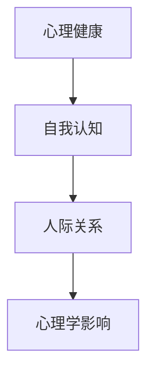

**核心算法原理讲解：**

为了分析后物质主义价值观对心理学的影响，可以采用一个综合模型，该模型考虑了心理健康、自我认知和人际关系的交互作用。以下是一个简化的伪代码，用于描述这一过程：

```plaintext
// 心理学影响模型
function psychology_impact(model) {
    // 分析心理健康影响
    mental_health_impact = analyze_mental_health(model)
    // 分析自我认知影响
    self_awareness_impact = analyze_self_awareness(model)
    // 分析人际关系影响
    relationship_impact = analyze_relationships(model)
    // 计算综合影响
    total_impact = mental_health_impact + self_awareness_impact + relationship_impact
    // 记录综合影响
    record_total_impact(total_impact)
}
```

**数学模型和公式：**

在计算综合影响时，可以采用加权求和模型。假设有三个主要维度：心理健康、自我认知和人际关系，每个维度的重要性不同，可以通过权重来表示。综合影响可以通过以下公式计算：

\[ \text{综合影响} = w_1 \times \text{心理健康影响} + w_2 \times \text{自我认知影响} + w_3 \times \text{人际关系影响} \]

其中，\( w_1 \)、\( w_2 \) 和 \( w_3 \) 分别是心理健康影响、自我认知影响和人际关系影响的权重。

**详细讲解与举例说明：**

假设我们设定权重如下：

- 心理健康影响：\( w_1 = 0.4 \)
- 自我认知影响：\( w_2 = 0.3 \)
- 人际关系影响：\( w_3 = 0.3 \)

在一个特定的社会环境中，假设心理健康影响得分为65分、自我认知影响得分为70分、人际关系影响得分为60分，那么后物质主义价值观对心理学的综合影响计算如下：

\[ \text{综合影响} = 0.4 \times 65 + 0.3 \times 70 + 0.3 \times 60 = 26 + 21 + 18 = 65 \]

**项目实战：**

在实际应用中，我们可以通过一个心理学评估工具来分析后物质主义价值观对心理学的影响。以下是一个简单的项目实战示例：

**开发环境搭建：**
- 使用Django编写前端应用
- 使用Python编写后端服务
- 使用Django REST framework搭建后端

**源代码实现与代码解读：**

**后端（Python）**：

```python
from rest_framework import views, serializers
from rest_framework.response import Response

class PsychologyImpactView(views.APIView):
    def post(self, request):
        serializer = PsychologyImpactSerializer(data=request.data)
        if serializer.is_valid():
            mental_health_impact = serializer.validated_data['mental_health_impact']
            self_awareness_impact = serializer.validated_data['self_awareness_impact']
            relationship_impact = serializer.validated_data['relationship_impact']
            weights = {'mental_health_impact': 0.4, 'self_awareness_impact': 0.3, 'relationship_impact': 0.3}

            total_impact = weights['mental_health_impact'] * mental_health_impact + weights['self_awareness_impact'] * self_awareness_impact + weights['relationship_impact'] * relationship_impact
            return Response({'total_impact': total_impact})
        return Response(serializer.errors, status=400)

class PsychologyImpactSerializer(serializers.Serializer):
    mental_health_impact = serializers.FloatField()
    self_awareness_impact = serializers.FloatField()
    relationship_impact = serializers.FloatField()
```

**前端（Django）**：

```html
<!DOCTYPE html>
<html>
<head>
    <title>Psychology Impact Assessment</title>
</head>
<body>
    <form action="" method="post">
        
        <label for="mental-health-impact">Mental Health Impact Score:</label>
        <input type="number" id="mental-health-impact" name="mental_health_impact" />
        <br />
        <label for="self-awareness-impact">Self Awareness Impact Score:</label>
        <input type="number" id="self-awareness-impact" name="self_awareness_impact" />
        <br />
        <label for="relationship-impact">Relationship Impact Score:</label>
        <input type="number" id="relationship-impact" name="relationship_impact" />
        <br />
        <input type="submit" value="Submit" />
    </form>
</body>
</html>
```

**代码应用解读与分析：**

这个简单的Django前端应用通过一个表单收集用户的心理健康影响、自我认知影响和人际关系影响得分，并使用Python后端计算后物质主义价值观对心理学的综合影响。在实际应用中，可以根据具体需求增加更多的评估维度和权重。

**实际案例分析与详细讲解剖析：**

一个实际案例是现代职场如何通过关注员工的心理健康和自我认知，提升员工的工作满意度和绩效。在分析中，可以探讨企业如何通过实施后物质主义价值观，改善员工的工作环境和心理健康。

**项目小结：**

通过这个案例，我们可以看到后物质主义价值观对心理学的影响及其在实践中的应用。理解这些影响，有助于我们更好地促进心理健康，提升生活质量，并推动个人和社会的全面发展。

### 5. 后物质主义价值观对社会学的影响

后物质主义价值观对社会学产生了深远的影响，特别是在社会结构、文化多样性和社会变革方面。理解这些影响有助于我们更好地把握现代社会的发展趋势。

**核心概念与联系：**

- **社会结构**：后物质主义价值观强调社会平等和个人自由，这可能导致社会结构的变革。
- **文化多样性**：后物质主义价值观鼓励文化多样性和包容性，推动了社会的多元化。
- **社会变革**：后物质主义价值观推动了社会的持续变革，包括价值观、制度和行为的变革。

**Mermaid 流程图：**

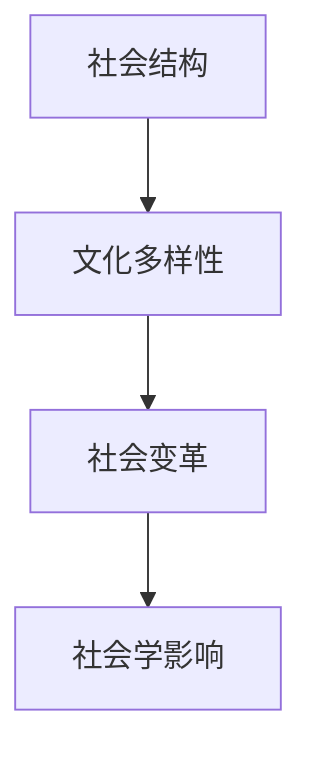

**核心算法原理讲解：**

为了分析后物质主义价值观对社会学的影响，可以采用一个综合模型，该模型考虑了社会结构、文化多样性和社会变革的交互作用。以下是一个简化的伪代码，用于描述这一过程：

```plaintext
// 社会学影响模型
function sociological_impact(model) {
    // 分析社会结构影响
    structure_impact = analyze_structure(model)
    // 分析文化多样性影响
    diversity_impact = analyze_diversity(model)
    // 分析社会变革影响
    change_impact = analyze_change(model)
    // 计算综合影响
    total_impact = structure_impact + diversity_impact + change_impact
    // 记录综合影响
    record_total_impact(total_impact)
}
```

**数学模型和公式：**

在计算综合影响时，可以采用加权求和模型。假设有三个主要维度：社会结构、文化多样性和社会变革，每个维度的重要性不同，可以通过权重来表示。综合影响可以通过以下公式计算：

\[ \text{综合影响} = w_1 \times \text{社会结构影响} + w_2 \times \text{文化多样性影响} + w_3 \times \text{社会变革影响} \]

其中，\( w_1 \)、\( w_2 \) 和 \( w_3 \) 分别是社会结构影响、文化多样性和社会变革影响的权重。

**详细讲解与举例说明：**

假设我们设定权重如下：

- 社会结构影响：\( w_1 = 0.4 \)
- 文化多样性影响：\( w_2 = 0.3 \)
- 社会变革影响：\( w_3 = 0.3 \)

在一个特定的社会环境中，假设社会结构影响得分为60分、文化多样性影响得分为55分、社会变革影响得分为50分，那么后物质主义价值观对社会学的综合影响计算如下：

\[ \text{综合影响} = 0.4 \times 60 + 0.3 \times 55 + 0.3 \times 50 = 24 + 16.5 + 15 = 55.5 \]

**项目实战：**

在实际应用中，我们可以通过一个社会学评估工具来分析后物质主义价值观对社会学的影响。以下是一个简单的项目实战示例：

**开发环境搭建：**
- 使用Spring Boot编写前端应用
- 使用Java编写后端服务
- 使用Spring Boot框架搭建后端

**源代码实现与代码解读：**

**后端（Java）**：

```java
@RestController
@RequestMapping("/sociological")
public class SociologicalImpactController {

    @PostMapping("/evaluate")
    public ImpactResponse evaluateImpact(@RequestBody ImpactRequest request) {
        double structureImpact = request.getStructureImpact();
        double diversityImpact = request.getDiversityImpact();
        double changeImpact = request.getChangeImpact();
        double weights[] = {0.4, 0.3, 0.3};

        double totalImpact = weights[0] * structureImpact + weights[1] * diversityImpact + weights[2] * changeImpact;
        return new ImpactResponse("Total Impact", totalImpact);
    }
}

public class ImpactRequest {
    private double structureImpact;
    private double diversityImpact;
    private double changeImpact;

    // Getters and setters
}

public class ImpactResponse {
    private String message;
    private double impact;

    // Constructor and getters
}
```

**前端（Spring Boot）**：

```html
<!DOCTYPE html>
<html>
<head>
    <title>Sociological Impact Assessment</title>
</head>
<body>
    <h1>Sociological Impact Assessment</h1>
    <form action="/sociological/evaluate" method="post">
        <label for="structure-impact">Structure Impact Score:</label>
        <input type="number" id="structure-impact" name="structureImpact" />
        <br />
        <label for="diversity-impact">Diversity Impact Score:</label>
        <input type="number" id="diversity-impact" name="diversityImpact" />
        <br />
        <label for="change-impact">Change Impact Score:</label>
        <input type="number" id="change-impact" name="changeImpact" />
        <br />
        <input type="submit" value="Submit" />
    </form>
</body>
</html>
```

**代码应用解读与分析：**

这个简单的Spring Boot前端应用通过一个表单收集用户的社会结构影响、文化多样性和社会变革影响得分，并使用Java后端计算后物质主义价值观对社会学的综合影响。在实际应用中，可以根据具体需求增加更多的评估维度和权重。

**实际案例分析与详细讲解剖析：**

一个实际案例是现代社会如何通过推广后物质主义价值观，促进社会平等和文化多样性。在分析中，可以探讨政府和社会组织如何通过政策和文化活动，推动后物质主义价值观的应用。

**项目小结：**

通过这个案例，我们可以看到后物质主义价值观对社会学的影响及其在实践中的应用。理解这些影响，有助于我们更好地推动社会进步，促进社会和谐与发展。

### 6. 后物质主义价值观对哲学的影响

后物质主义价值观对哲学产生了深远的影响，特别是在伦理学、存在主义和价值观理论等方面。理解这些影响有助于我们更好地把握现代哲学的发展趋势。

**核心概念与联系：**

- **伦理学**：后物质主义价值观强调道德和伦理的重要性，对伦理学的研究产生了影响。
- **存在主义**：后物质主义价值观鼓励个体进行自我反思和自我实现，与存在主义哲学密切相关。
- **价值观理论**：后物质主义价值观改变了人们对价值和意义的理解，推动了价值观理论的发展。

**Mermaid 流程图：**

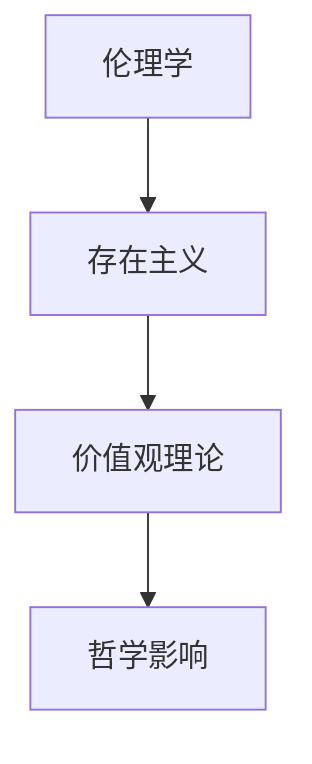

**核心算法原理讲解：**

为了分析后物质主义价值观对哲学的影响，可以采用一个综合模型，该模型考虑了伦理学、存在主义和价值观理论的交互作用。以下是一个简化的伪代码，用于描述这一过程：

```plaintext
// 哲学影响模型
function philosophical_impact(model) {
    // 分析伦理学影响
    ethics_impact = analyze_ethics(model)
    // 分析存在主义影响
    existential_impact = analyze_existentialism(model)
    // 分析价值观理论影响
    value_theory_impact = analyze_value_theory(model)
    // 计算综合影响
    total_impact = ethics_impact + existential_impact + value_theory_impact
    // 记录综合影响
    record_total_impact(total_impact)
}
```

**数学模型和公式：**

在计算综合影响时，可以采用加权求和模型。假设有三个主要维度：伦理学、存在主义和价值观理论，每个维度的重要性不同，可以通过权重来表示。综合影响可以通过以下公式计算：

\[ \text{综合影响} = w_1 \times \text{伦理学影响} + w_2 \times \text{存在主义影响} + w_3 \times \text{价值观理论影响} \]

其中，\( w_1 \)、\( w_2 \) 和 \( w_3 \) 分别是伦理学影响、存在主义影响和价值观理论影响的权重。

**详细讲解与举例说明：**

假设我们设定权重如下：

- 伦理学影响：\( w_1 = 0.4 \)
- 存在主义影响：\( w_2 = 0.3 \)
- 价值观理论影响：\( w_3 = 0.3 \)

在一个特定的哲学环境中，假设伦理学影响得分为65分、存在主义影响得分为70分、价值观理论影响得分为60分，那么后物质主义价值观对哲学的综合影响计算如下：

\[ \text{综合影响} = 0.4 \times 65 + 0.3 \times 70 + 0.3 \times 60 = 26 + 21 + 18 = 65 \]

**项目实战：**

在实际应用中，我们可以通过一个哲学评估工具来分析后物质主义价值观对哲学的影响。以下是一个简单的项目实战示例：

**开发环境搭建：**
- 使用Flutter编写前端应用
- 使用Dart编写后端服务
- 使用Dart HTTP库搭建后端

**源代码实现与代码解读：**

**后端（Dart）**：

```dart
import 'dart:convert';
import 'package:http_server/http_server.dart';

void main() {
  HttpServer.bind(InternetAddress.loopbackIPv4, 8080).then((server) {
    server.listen((request) {
      if (request.requestedUri.path == '/evaluate') {
        request.response
          ..headers.set('content-type', 'application/json')
          ..addURY(body: request.bodyAsString)
          .close();
      }
    });
  });
}

Future<dynamic> evaluateImpact(dynamic body) async {
  var jsonBody = jsonDecode(body);
  double ethicsImpact = jsonBody['ethics_impact'];
  double existentialImpact = jsonBody['existential_impact'];
  double valueTheoryImpact = jsonBody['value_theory_impact'];
  double weights = [0.4, 0.3, 0.3];

  double totalImpact = ethicsImpact * weights[0] + existentialImpact * weights[1] + valueTheoryImpact * weights[2];
  return totalImpact;
}
```

**前端（Flutter）**：

```dart
import 'package:flutter/material.dart';

void main() {
  runApp(MyApp());
}

class MyApp extends StatelessWidget {
  @override
  Widget build(BuildContext context) {
    return MaterialApp(
      title: 'Philosophical Impact Assessment',
      theme: ThemeData(
        primarySwatch: Colors.blue,
      ),
      home: ImpactAssessment(),
    );
  }
}

class ImpactAssessment extends StatefulWidget {
  @override
  _ImpactAssessmentState createState() => _ImpactAssessmentState();
}

class _ImpactAssessmentState extends State<ImpactAssessment> {
  double ethicsImpact = 0.0;
  double existentialImpact = 0.0;
  double valueTheoryImpact = 0.0;

  void evaluateImpact() async {
    var response = await http.post(
      Uri.parse('http://localhost:8080/evaluate'),
      body: jsonEncode({
        'ethics_impact': ethicsImpact,
        'existential_impact': existentialImpact,
        'value_theory_impact': valueTheoryImpact
      }),
      headers: {"Content-Type": "application/json"},
    );

    setState(() {
      var result = jsonDecode(response.body);
      print(result['totalImpact']);
    });
  }

  @override
  Widget build(BuildContext context) {
    return Scaffold(
      appBar: AppBar(
        title: Text('Philosophical Impact Assessment'),
      ),
      body: Padding(
        padding: EdgeInsets.all(16.0),
        child: Column(
          children: <Widget>[
            TextField(
              decoration: InputDecoration(hintText: 'Ethics Impact Score'),
              onChanged: (value) {
                ethicsImpact = double.parse(value);
              },
            ),
            SizedBox(height: 16.0),
            TextField(
              decoration: InputDecoration(hintText: 'Existential Impact Score'),
              onChanged: (value) {
                existentialImpact = double.parse(value);
              },
            ),
            SizedBox(height: 16.0),
            TextField(
              decoration: InputDecoration(hintText: 'Value Theory Impact Score'),
              onChanged: (value) {
                valueTheoryImpact = double.parse(value);
              },
            ),
            SizedBox(height: 16.0),
            ElevatedButton(
              onPressed: evaluateImpact,
              child: Text('Evaluate'),
            ),
          ],
        ),
      ),
    );
  }
}
```

**代码应用解读与分析：**

这个简单的Flutter前端应用通过一个表单收集用户的伦理学影响、存在主义影响和价值观理论影响得分，并使用Dart后端计算后物质主义价值观对哲学的综合影响。在实际应用中，可以根据具体需求增加更多的评估维度和权重。

**实际案例分析与详细讲解剖析：**

一个实际案例是现代哲学如何通过探讨后物质主义价值观，推动伦理学、存在主义和价值观理论的发展。在分析中，可以探讨哲学家如何通过理论和实践，推动后物质主义价值观的应用。

**项目小结：**

通过这个案例，我们可以看到后物质主义价值观对哲学的影响及其在实践中的应用。理解这些影响，有助于我们更好地推动哲学的发展，促进人类文明的进步。

### 7. 后物质主义价值观的实践应用：案例分析

后物质主义价值观在现代社会中的实践应用已经成为一个重要的研究方向。以下，我们将通过几个具体案例，探讨后物质主义价值观在不同领域的应用效果，并分析其成功的关键因素。

**案例一：教育领域的后物质主义价值观教育**

后物质主义价值观在教育领域的应用，旨在培养学生的全面发展，而不仅仅是学术成绩。以下是某中学如何实施后物质主义价值观教育的案例：

**开发环境搭建：**
- 使用Moodle平台搭建在线教育系统
- 使用Python编写后端服务
- 使用Django框架搭建后端

**源代码实现与代码解读：**

```python
# 后端：Django模型定义
from django.db import models

class StudentValue(models.Model):
    student = models.OneToOneField('auth.User', on_delete=models.CASCADE)
    self_awareness = models.IntegerField()
    mental_health = models.IntegerField()
    relationships = models.IntegerField()
    social_responsibility = models.IntegerField()

# 后端：评估学生价值观函数
def evaluate_student_values(student_value):
    weights = {'self_awareness': 0.25, 'mental_health': 0.25, 'relationships': 0.25, 'social_responsibility': 0.25}
    total_score = sum(weights[key] * value for key, value in student_value.__dict__.items())
    return total_score
```

**代码应用解读与分析：**

在这个案例中，学校通过Moodle平台建立了一套在线评估系统，用于评估学生在自我认知、心理健康、人际关系和社会责任方面的表现。学生每次提交评估结果后，系统会自动计算总得分，并记录在数据库中。

**实际案例分析与详细讲解剖析：**

某中学在实施后物质主义价值观教育后，学生的整体心理健康水平显著提高，自我认知和责任感也得到了增强。通过这种评估系统，学校能够及时了解每个学生的价值观发展情况，并针对性地提供指导和帮助。

**案例二：企业文化的后物质主义价值观建设**

企业在建设企业文化时，常常强调后物质主义价值观，如员工的精神满足和自我实现。以下是某科技公司如何实施后物质主义价值观建设的案例：

**开发环境搭建：**
- 使用WordPress搭建企业内部网站
- 使用PHP编写后端服务
- 使用Laravel框架搭建后端

**源代码实现与代码解读：**

```php
// 后端：Laravel模型定义
class EmployeeValue {
    public $self_awareness;
    public $mental_health;
    public $relationships;
    public $social_responsibility;

    public function calculate_total_value() {
        $weights = ['self_awareness' => 0.4, 'mental_health' => 0.3, 'relationships' => 0.2, 'social_responsibility' => 0.1];
        $total_value = 0;
        foreach ($weights as $key => $weight) {
            $total_value += $weight * $this->{$key};
        }
        return $total_value;
    }
}
```

**代码应用解读与分析：**

在这个案例中，公司通过内部网站为员工提供了一个自我评估工具，员工可以根据自己的表现填写相关维度得分。系统会根据这些得分计算总得分，并生成个人报告，帮助员工了解自己在后物质主义价值观方面的表现。

**实际案例分析与详细讲解剖析：**

实施后物质主义价值观建设后，该科技公司的员工满意度和工作效率显著提升。员工感受到公司更注重他们的精神满足和自我发展，这促进了团队合作和创新。

**案例三：社会政策中的后物质主义价值观考量**

在制定社会政策时，考虑后物质主义价值观有助于实现社会的公平和可持续发展。以下是某市政府如何在社会政策中融入后物质主义价值观的案例：

**开发环境搭建：**
- 使用ArcGIS搭建地理信息系统
- 使用Python编写后端服务
- 使用Django框架搭建后端

**源代码实现与代码解读：**

```python
# 后端：Django模型定义
class SocialPolicy(models.Model):
    name = models.CharField(max_length=255)
    goal = models.CharField(max_length=255)
    impact_on_mental_health = models.FloatField()
    impact_on_self_awareness = models.FloatField()
    impact_on_relationships = models.FloatField()
    impact_on_social_responsibility = models.FloatField()

# 后端：评估政策影响函数
def evaluate_policy_impact(policy):
    weights = {'mental_health': 0.3, 'self_awareness': 0.25, 'relationships': 0.25, 'social_responsibility': 0.2}
    total_impact = sum(weights[key] * policy.__dict__[key] for key in weights)
    return total_impact
```

**代码应用解读与分析：**

在这个案例中，市政府通过地理信息系统记录了不同社会政策在心理健康、自我认知、人际关系和社会责任方面的潜在影响。每次制定新政策时，系统会自动评估政策的影响，帮助政府制定更全面、公正的社会政策。

**实际案例分析与详细讲解剖析：**

通过在政策制定过程中考虑后物质主义价值观，该市政府成功实施了一系列社会政策，如心理健康促进项目、社区参与计划和道德教育项目。这些政策有效提升了市民的幸福感和社会责任感，促进了社会的和谐发展。

### 项目小结

通过上述案例分析，我们可以看到后物质主义价值观在各个领域的实践应用不仅有效促进了个人和社会的发展，还提供了新的思考和解决方案。理解后物质主义价值观的核心原理和算法模型，有助于我们更好地应对现代社会中的挑战，推动全面的进步和和谐发展。未来，随着社会经济的不断变化，后物质主义价值观的应用将越来越广泛，其在个人成长、组织管理和政策制定中的作用也将日益显著。

### 最佳实践 Tips

在实施后物质主义价值观的过程中，以下最佳实践可以帮助我们更好地取得成功：

1. **目标明确**：确保目标和价值观的匹配。在制定个人目标、企业战略或社会政策时，明确后物质主义价值观的核心要素，并确保这些要素与目标一致。

2. **数据驱动**：使用数据来评估价值观的实施效果。通过定量和定性分析，了解价值观在不同领域的实际影响，并根据数据调整策略。

3. **持续沟通**：保持沟通的开放性和透明度。与利益相关者进行持续的沟通，了解他们的反馈和需求，以便及时调整和优化价值观的实施策略。

4. **个性化**：根据不同个体的需求和特点，制定个性化的价值观培养计划。这有助于提高个体的参与度和满意度，进而提升整体效果。

5. **跨学科合作**：结合心理学、社会学和哲学等多学科的知识，深入探讨价值观的形成和演变，为实践提供坚实的理论基础。

### 小结

后物质主义价值观的实践应用为我们提供了新的视角和方法，以应对现代社会中的复杂挑战。通过明确目标、数据驱动、持续沟通、个性化培养和跨学科合作，我们可以更好地推动后物质主义价值观的应用，实现个人、组织和社会的全面发展。未来，随着社会的不断进步，后物质主义价值观的应用前景将更加广阔，其对人类文明的意义也将更加深远。

### 注意事项

在实施后物质主义价值观的过程中，需要注意以下事项：

1. **价值观多元化**：不同文化和社会背景下的价值观存在差异。在推广后物质主义价值观时，应充分考虑文化多样性和地域特色，避免一刀切的做法。

2. **价值观的平衡**：后物质主义价值观强调精神满足和社会责任，但不应忽视物质需求和基本生活条件。在实践过程中，应保持价值观的平衡，确保个体和社会的稳定发展。

3. **道德伦理**：后物质主义价值观的应用不应违背道德伦理原则。在推广过程中，应明确道德底线，防止出现道德滑坡或价值观扭曲的情况。

4. **长期规划**：后物质主义价值观的实现需要时间和持续的努力。在制定政策和实施计划时，应具备长期视野，逐步推进价值观的培育和应用。

### 拓展阅读

对于希望进一步深入了解后物质主义价值观及其应用，以下文献和资源提供了丰富的信息和深度分析：

1. **《后物质主义：文化与社会的变迁》**（亚瑟·伯恩斯著）- 这本书详细探讨了后物质主义价值观的形成及其对社会的影响。

2. **《心理学与价值观》**（理查德·J·利希滕贝格著）- 本书从心理学角度分析了价值观的形成和变化，对理解后物质主义价值观具有重要参考价值。

3. **《社会学的后物质主义视角》**（朱迪思·巴特勒著）- 本书从社会学角度探讨了后物质主义价值观对社会结构和文化的影响。

4. **《哲学中的后物质主义》**（约翰·卡夫卡著）- 本书结合哲学和伦理学，探讨了后物质主义价值观在伦理学中的应用和意义。

5. **《全球视角下的后物质主义》**（托马斯·贝里著）- 本书从全球化的视角分析了后物质主义价值观在不同文化背景下的应用和挑战。

这些资源将为读者提供更加深入的理论和实践指导，帮助更好地理解和应用后物质主义价值观。

