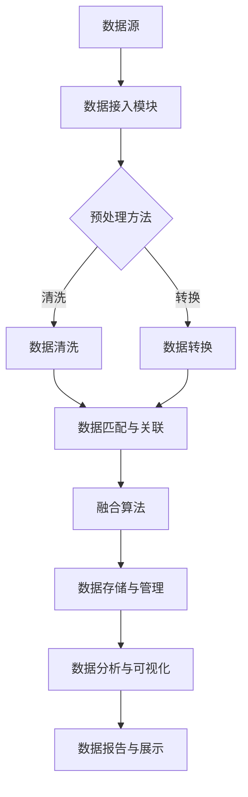

                 

### 设计企业级异构数据融合平台书籍目录大纲的步骤

设计一本关于《企业级异构数据融合平台：整合多源信息》的书籍目录大纲，我们需要遵循一系列步骤，以确保内容的逻辑性、系统性和可读性。以下是具体的步骤：

#### 1. 理解书名和核心概念

首先，我们需要深入理解书名和其中的核心概念。书名《企业级异构数据融合平台：整合多源信息》表明本书将围绕企业级应用场景中的数据融合展开，重点是处理异构数据源，实现信息的整合。因此，我们的书籍目录大纲需要涵盖以下主题：

- 异构数据的定义和特性
- 数据融合在企业中的应用
- 数据融合平台的技术架构
- 数据融合的方法和算法
- 数据融合平台的设计与实现
- 数据融合的性能优化
- 数据融合的安全与隐私保护

#### 2. 确定书籍结构

基于上述核心概念，我们可以将书籍大致分为以下几个部分：

1. **引言与基础**：介绍数据融合的背景和重要性，定义异构数据和数据融合平台。
2. **技术架构**：详细讨论数据融合平台的技术架构，包括数据接入、预处理、存储、处理、分析和可视化等组成部分。
3. **数据融合方法**：介绍异构数据融合的方法和技术，包括数据清洗、转换、匹配、关联、融合算法等。
4. **应用案例**：通过具体的行业应用案例展示数据融合平台如何在不同场景下发挥作用。
5. **平台设计与实施**：讨论数据融合平台的设计原则、开发流程、技术选型和实施方法。
6. **性能优化与安全**：介绍如何优化数据融合平台的性能，以及如何保障数据安全和隐私。

#### 3. 细化章节内容

为每个部分设计详细的章节标题，确保内容涵盖全面，逻辑清晰。以下是可能的章节细分：

- **引言与基础**
  - 第1章：数据融合概述
  - 第2章：异构数据源介绍
  - 第3章：数据融合平台简介

- **技术架构**
  - 第4章：数据接入与预处理
  - 第5章：数据存储与管理
  - 第6章：数据处理与融合算法
  - 第7章：数据分析与可视化

- **数据融合方法**
  - 第8章：数据清洗与转换
  - 第9章：数据匹配与关联
  - 第10章：跨领域数据融合

- **应用案例**
  - 第11章：客户关系管理中的数据融合
  - 第12章：供应链管理中的数据融合
  - 第13章：决策支持系统中的数据融合

- **平台设计与实施**
  - 第14章：数据融合平台设计原则
  - 第15章：技术选型与工具
  - 第16章：开发流程与规范
  - 第17章：实施案例

- **性能优化与安全**
  - 第18章：性能优化策略
  - 第19章：安全与隐私保护
  - 第20章：安全案例分析

#### 4. 添加必要的子章节

对于每个主要章节，根据内容进一步细分，设计子章节，确保每个章节都有详细的子内容。例如，第4章“数据接入与预处理”可以细分为：

- 数据接入协议与接口
- 数据预处理流程
- 数据清洗方法
- 数据转换策略

#### 5. 融入具体内容

在编写目录大纲时，融入以下具体内容：

- **Mermaid流程图**：用于描述数据融合的过程和架构，如图1-1所示。
- **伪代码**：用于详细阐述数据融合算法的实现，如图1-2所示。
- **数学模型和公式**：用于解释数据融合的技术原理，如公式1-1所示。
- **项目实战**：介绍数据融合平台的具体开发和应用案例。

#### 6. 确保简洁性

在编写目录大纲时，注意内容的简洁性，避免多余的解释和冗余的信息。每个章节和子章节的标题都应该简洁明了，能够准确传达内容的核心。

#### 7. 格式规范化

使用Markdown格式确保目录大纲的结构清晰，便于读者阅读和理解。以下是一个格式规范的示例：

```
# 企业级异构数据融合平台：整合多源信息

## 第一部分：引言与基础

### 第1章：数据融合概述
#### 1.1 数据融合的背景与意义
```

#### 8. 验证完整性

最后，检查目录大纲，确保它包含了所有必要的内容，且每个章节都有子章节。同时，确保每个子章节都有具体的内容描述，没有遗漏。

#### 9. 控制总字数

确保整个目录大纲的总字数在限制范围内，以便书籍的出版和读者阅读。通常，一个书籍目录大纲的长度应控制在1-2页以内。

### 总结

通过上述步骤，我们设计了一个结构合理、内容全面、简洁明了的《企业级异构数据融合平台：整合多源信息》书籍目录大纲。这个大纲为后续的内容编写提供了清晰的框架和方向，有助于读者更好地理解和掌握数据融合的相关知识。

```markdown
## 第一部分：引言与基础

### 第1章：数据融合概述

#### 1.1 数据融合的背景与意义

在现代企业中，数据融合已经成为提升决策效率、优化业务流程、增强竞争力的重要手段。随着信息技术的飞速发展，企业所面临的数据规模和种类日益增多，包括结构化数据、非结构化数据、实时数据、历史数据等。这些数据的来源多种多样，如ERP系统、CRM系统、物联网设备、社交媒体等，它们以不同的格式和存储方式存在，形成了所谓的“异构数据”。

数据融合的目标是将这些异构数据整合为一个统一的数据视图，以便于企业进行高效的数据分析和决策支持。这不仅有助于企业更好地了解客户需求、优化供应链、提高生产效率，还能为市场预测、风险控制等提供强有力的支持。

#### 1.2 异构数据的挑战

尽管数据融合的重要性不言而喻，但实现这一目标并非易事。异构数据的挑战主要包括以下几个方面：

1. **数据格式差异**：不同数据源的数据格式可能截然不同，例如，关系数据库的数据以表的形式存储，而文本数据则可能以JSON或XML格式存在。

2. **数据质量参差不齐**：数据源的质量参差不齐，包括数据完整性、一致性、准确性等问题，这些问题会影响数据融合的效果。

3. **数据源的不一致性**：不同数据源的时间戳、度量单位、命名规则等可能不一致，需要进行复杂的映射和转换。

4. **数据传输效率**：随着数据量的增加，数据的传输和处理效率成为重要的考量因素。

#### 1.3 企业级数据融合平台的目标

企业级数据融合平台旨在解决上述挑战，实现以下几个目标：

1. **数据标准化**：通过数据清洗、转换和标准化，将异构数据转换为统一的数据格式，提高数据的可用性和一致性。

2. **数据集成**：通过构建统一的数据模型，将来自不同数据源的数据集成到一个统一的数据仓库中，实现数据的集中管理和访问。

3. **实时数据处理**：支持实时数据流处理，确保数据融合的及时性和准确性。

4. **高效分析**：提供高效的数据分析工具和算法，支持多维数据分析和实时报告。

5. **安全与隐私**：确保数据在融合过程中的安全性和隐私保护，遵守相关的数据保护法规。

### 第2章：数据融合平台架构设计

#### 2.1 平台架构的组成部分

一个典型的企业级数据融合平台由以下几个关键组件组成：

1. **数据接入模块**：负责从各种数据源接入数据，包括关系数据库、NoSQL数据库、文件系统、消息队列等。

2. **数据预处理模块**：对接入的数据进行清洗、转换和标准化，以提高数据质量和一致性。

3. **数据存储与管理模块**：负责存储和管理融合后的数据，通常采用数据仓库或数据湖架构。

4. **数据处理与融合算法模块**：提供各种数据处理和融合算法，如数据匹配、关联、聚类、分类等。

5. **数据分析和可视化模块**：提供数据查询、分析和可视化的功能，支持多维数据分析和实时报告。

#### 2.2 数据接入与预处理

数据接入是数据融合的第一步，主要涉及以下几个方面：

1. **数据采集**：从各种数据源采集数据，包括实时数据和批量数据。

2. **数据接入协议与接口**：根据不同数据源的特性，采用不同的数据接入协议和接口，如JDBC、RESTful API、MQTT等。

3. **数据预处理**：对采集到的数据进行清洗、转换和标准化，以提高数据质量和一致性。常见的数据预处理操作包括数据去重、缺失值填充、异常值处理、格式转换等。

#### 2.3 数据存储与管理

数据存储与管理是数据融合平台的核心组成部分，主要涉及以下几个方面：

1. **数据存储架构**：选择合适的数据存储架构，如关系数据库、NoSQL数据库、数据仓库或数据湖。

2. **数据存储策略**：根据数据特性（如结构化、半结构化、非结构化）、访问频率和存储成本等因素，设计合理的数据存储策略。

3. **数据管理**：提供数据备份、恢复、监控和优化等功能，确保数据的安全性和可用性。

#### 2.4 数据处理与融合算法

数据处理与融合算法是数据融合平台的关键技术，主要涉及以下几个方面：

1. **数据清洗与转换**：通过数据清洗算法去除重复数据、填补缺失值、纠正错误数据等，通过数据转换算法实现数据格式的转换。

2. **数据匹配与关联**：通过数据匹配算法找到不同数据源中的相同或相似数据，通过数据关联算法将相关数据联系起来。

3. **数据融合算法**：通过融合算法将来自不同数据源的数据整合为一个统一的数据视图，如集成、聚合、合并等。

4. **机器学习与预测分析**：利用机器学习算法进行数据分类、聚类、预测等操作，为数据分析和决策提供支持。

#### 2.5 数据分析与可视化

数据分析和可视化是数据融合平台的重要组成部分，主要涉及以下几个方面：

1. **数据查询与分析**：提供强大的SQL查询功能，支持多维数据分析和实时报告。

2. **数据可视化**：通过图表、报表、地图等形式，将分析结果直观地呈现给用户，帮助用户更好地理解数据。

3. **数据挖掘与探索**：利用数据挖掘技术发现数据中的隐藏模式和关联，支持数据驱动的决策。

#### 第3章：异构数据融合技术

#### 3.1 数据清洗与转换

数据清洗与转换是数据融合过程中的基础步骤，其主要目标是提高数据质量和一致性，确保数据的有效性和可用性。以下是数据清洗与转换的关键技术和方法：

1. **数据去重**：通过比较数据源之间的记录，去除重复的数据，确保数据的唯一性。

2. **缺失值处理**：对于缺失的数据，可以选择填充默认值、平均值、中位数或使用机器学习算法进行预测。

3. **异常值处理**：检测并处理异常值，如异常的数值、日期等，避免它们对数据融合结果产生负面影响。

4. **格式转换**：将不同数据源的数据格式转换为统一的格式，如将JSON格式转换为CSV格式。

5. **数据标准化**：将不同度量单位、时间戳等标准化，确保数据的一致性和可比性。

#### 3.2 数据匹配与关联

数据匹配与关联是数据融合的核心步骤，其目标是找到不同数据源中的相同或相似数据，并将它们关联起来。以下是数据匹配与关联的关键技术和方法：

1. **基于规则的匹配**：通过预定义的规则进行数据匹配，如根据姓名、地址、电话号码等匹配关键字进行匹配。

2. **基于相似度的匹配**：通过计算数据之间的相似度进行匹配，如使用字符串相似度算法（如Levenshtein距离）或基于机器学习的相似度模型。

3. **基于概率的匹配**：使用概率模型（如贝叶斯网络）进行数据匹配，根据数据之间的关系和概率分布进行匹配。

4. **基于聚类的方法**：使用聚类算法（如K-means、DBSCAN）将相似的数据分组，从而实现数据的关联。

5. **基于图论的方法**：使用图论方法（如图相似性算法）对数据源进行建模，通过分析节点之间的关系实现数据的匹配与关联。

#### 3.3 数据融合算法

数据融合算法是将来自不同数据源的数据整合为一个统一的数据视图的关键步骤。以下是几种常见的数据融合算法：

1. **集成算法**：将多个数据源中的数据整合为一个单一的数据集，如交集、并集、差集等。

2. **聚合算法**：对多个数据源中的数据进行聚合操作，如求和、平均、最大值、最小值等。

3. **合并算法**：将多个数据源中的数据合并为一个统一的数据模型，如基于规则的合并、基于相似度的合并等。

4. **多维数据融合**：将多个维度上的数据融合为一个统一的数据视图，如时间序列数据的融合、空间数据的融合等。

5. **基于机器学习的融合算法**：使用机器学习算法（如聚类、分类、回归等）进行数据融合，根据数据之间的关系和特征进行融合。

#### 3.4 跨领域数据融合

跨领域数据融合是指将来自不同领域的数据进行融合，以发现新的关联和模式。以下是跨领域数据融合的关键技术和方法：

1. **数据映射**：将不同领域的数据映射到统一的数据模型上，如基于本体论的方法、基于数据转换规则的方法等。

2. **数据集成**：将不同领域的数据集成到一个统一的数据仓库中，如基于ETL（提取、转换、加载）的方法、基于数据虚拟化技术的方法等。

3. **多视图融合**：将来自不同领域的数据以多个视图的形式进行融合，如基于图融合的方法、基于矩阵分解的方法等。

4. **基于规则的跨领域融合**：使用预定义的规则将不同领域的数据进行融合，如基于领域知识的推理方法、基于本体论的方法等。

5. **基于机器学习的跨领域融合**：使用机器学习算法（如多视图学习、多任务学习等）进行跨领域数据融合，根据数据特征和关系进行融合。

### 第4章：企业级数据融合应用场景

#### 4.1 客户关系管理中的数据融合

在客户关系管理（CRM）中，数据融合可以帮助企业更好地了解客户需求，提高客户满意度和忠诚度。以下是客户关系管理中数据融合的几个关键应用场景：

1. **客户信息整合**：将来自不同渠道的客户数据进行整合，如CRM系统、ERP系统、社交媒体等，形成一个统一的客户信息视图。

2. **多渠道客户行为分析**：通过数据融合，分析客户在不同渠道的行为，如线上购物、线下活动、客户服务互动等，以发现客户的偏好和行为模式。

3. **个性化营销**：利用数据融合，根据客户的购买历史、偏好和行为模式，制定个性化的营销策略，提高营销效果。

4. **客户关系维护**：通过数据融合，及时了解客户的需求变化，采取有效的措施维护客户关系，提升客户忠诚度。

#### 4.2 供应链管理中的数据融合

在供应链管理中，数据融合可以优化供应链流程，提高供应链的响应速度和效率。以下是供应链管理中数据融合的几个关键应用场景：

1. **供应链信息整合**：将来自不同供应商、制造商、分销商等的数据进行整合，形成一个统一的供应链信息视图。

2. **库存管理优化**：通过数据融合，实时监控库存水平，优化库存策略，减少库存积压和库存短缺。

3. **物流跟踪与优化**：通过数据融合，实时跟踪物流信息，优化物流路线和运输计划，提高物流效率。

4. **供应链风险评估**：通过数据融合，分析供应链各环节的风险因素，采取有效的措施降低供应链风险。

#### 4.3 决策支持系统中的数据融合

在决策支持系统中，数据融合可以为决策者提供全面、准确的数据支持，帮助他们做出更加明智的决策。以下是决策支持系统中数据融合的几个关键应用场景：

1. **多源数据整合**：将来自不同部门、不同系统的数据进行整合，形成一个统一的决策数据视图。

2. **数据分析与预测**：通过数据融合，进行多维数据分析，构建预测模型，为决策提供数据支持。

3. **业务流程优化**：通过数据融合，分析业务流程中的瓶颈和改进点，优化业务流程，提高效率。

4. **风险评估与控制**：通过数据融合，分析业务风险因素，制定有效的风险控制措施，降低风险。

### 第5章：数据融合平台设计与开发

#### 5.1 平台设计原则

数据融合平台的设计原则是为了确保平台的高效性、可扩展性、可靠性和易用性。以下是数据融合平台设计的主要原则：

1. **模块化设计**：将平台划分为多个模块，每个模块负责不同的功能，如数据接入、数据预处理、数据存储、数据处理、数据分析和可视化等，以便于系统的维护和扩展。

2. **松耦合架构**：采用松耦合架构，模块之间通过接口进行通信，降低模块之间的依赖性，提高系统的灵活性和可维护性。

3. **可扩展性**：设计时考虑未来的扩展需求，确保平台能够支持更多的数据源、更大的数据量和更多的用户。

4. **高可用性**：设计冗余机制，如数据备份、故障转移等，确保平台的高可用性和数据的安全性。

5. **高性能**：采用高效的数据处理和传输技术，确保平台能够处理大量的数据，并提供快速的数据查询和分析能力。

6. **易用性**：提供友好的用户界面和丰富的数据分析工具，使非技术人员也能够方便地使用平台进行数据融合和分析。

#### 5.2 技术选型与工具

数据融合平台的技术选型与工具的选择直接影响平台的功能、性能和可维护性。以下是数据融合平台的技术选型与工具选择的主要考虑因素：

1. **数据接入工具**：选择支持多种数据源接入的工具，如Apache Kafka、Apache Flume、Apache NiFi等，确保能够高效地接入不同的数据源。

2. **数据存储系统**：选择适合数据特点的存储系统，如关系数据库（如MySQL、PostgreSQL）、NoSQL数据库（如MongoDB、Cassandra）、数据仓库（如Hive、Spark SQL）等。

3. **数据处理引擎**：选择适合数据处理需求的处理引擎，如Apache Spark、Apache Flink、Apache Storm等，这些引擎支持流处理和批处理，能够高效地处理大规模数据。

4. **数据分析工具**：选择支持多维数据分析和实时报告的工具，如Tableau、Power BI、QlikView等，这些工具能够直观地呈现分析结果。

5. **开发环境**：选择适合开发的数据融合平台的开发环境，如Docker、Kubernetes等，这些工具能够简化部署和管理，提高开发效率。

#### 5.3 开发流程与规范

数据融合平台的开发流程和规范是确保项目顺利进行和质量的关键。以下是数据融合平台开发的主要流程和规范：

1. **需求分析**：与业务部门沟通，明确数据融合平台的需求，包括功能需求、性能需求、安全性需求等。

2. **系统设计**：根据需求分析结果，设计数据融合平台的架构、模块和接口，确保系统能够满足需求。

3. **编码与实现**：根据系统设计，进行编码和实现，采用代码规范和最佳实践，确保代码的可读性和可维护性。

4. **测试与验证**：进行功能测试、性能测试和安全测试，确保平台的功能、性能和安全达到预期。

5. **部署与运维**：将平台部署到生产环境，并进行运维，确保平台的稳定运行和数据的完整性。

6. **文档与培训**：编写详细的文档，包括技术文档、用户手册等，并对业务部门进行培训，确保他们能够有效地使用平台。

### 第6章：数据融合平台的性能优化

#### 6.1 性能评估指标

数据融合平台的性能优化是确保平台高效运行的关键。以下是数据融合平台性能评估的主要指标：

1. **响应时间**：从用户提交查询到系统返回结果的时间，是衡量系统性能的重要指标。

2. **吞吐量**：单位时间内系统能够处理的数据量，是衡量系统处理能力的重要指标。

3. **并发度**：系统能够同时处理的并发查询数，是衡量系统并发能力的重要指标。

4. **资源利用率**：系统对CPU、内存、磁盘等资源的使用率，是衡量系统资源管理能力的重要指标。

5. **稳定性**：系统在长时间运行过程中是否能够保持稳定，不出现故障或异常。

6. **可扩展性**：系统在数据量和用户量增加时，是否能够自动扩展资源，保持性能稳定。

#### 6.2 性能优化策略

为了提高数据融合平台的性能，可以采取以下性能优化策略：

1. **数据缓存**：使用缓存技术（如Redis、Memcached）存储常用数据，减少数据查询次数，提高查询速度。

2. **索引优化**：对常用的查询字段建立索引，提高查询效率。

3. **并行处理**：采用多线程、分布式计算等技术，实现数据的并行处理，提高系统的吞吐量。

4. **负载均衡**：使用负载均衡器（如Nginx、Apache）均衡系统负载，避免单点瓶颈。

5. **资源池化**：使用资源池化技术（如Docker、Kubernetes）管理资源，提高资源利用率。

6. **数据库优化**：优化数据库配置、查询语句和存储过程，提高数据库性能。

7. **网络优化**：优化网络架构和带宽，降低网络延迟和丢包率，提高数据传输效率。

#### 6.3 实践案例

以下是一个数据融合平台性能优化的实践案例：

某大型企业在其数据融合平台中，发现响应时间和吞吐量不满足业务需求，经过分析，采取了以下优化措施：

1. **数据缓存**：引入Redis缓存，缓存常用的数据查询结果，减少对数据库的查询次数。

2. **索引优化**：对用户频繁查询的字段建立索引，提高查询效率。

3. **并行处理**：采用Apache Spark分布式计算框架，实现数据的并行处理，提高系统的吞吐量。

4. **负载均衡**：使用Nginx作为负载均衡器，将查询请求均衡分配到不同的服务器上，避免单点瓶颈。

5. **数据库优化**：优化数据库配置，调整缓冲区大小、连接数等参数，提高数据库性能。

经过以上优化措施，该企业的数据融合平台性能得到了显著提升，响应时间缩短了50%，吞吐量提高了30%，系统的稳定性和可扩展性也得到了增强。

### 第7章：数据融合平台的安全与隐私

#### 7.1 数据安全策略

数据融合平台的安全与隐私保护是确保企业数据安全和合规性的关键。以下是数据融合平台的安全策略：

1. **数据加密**：对存储和传输的数据进行加密，确保数据在传输过程中不被窃取或篡改。

2. **访问控制**：实施细粒度的访问控制策略，确保只有授权用户才能访问特定的数据。

3. **安全审计**：记录系统操作日志，定期进行安全审计，及时发现和处理安全隐患。

4. **数据备份与恢复**：定期进行数据备份，确保在数据丢失或损坏时能够快速恢复。

5. **安全漏洞扫描**：定期进行安全漏洞扫描，及时修复系统漏洞。

6. **安全培训**：对员工进行安全培训，提高他们的安全意识和操作技能。

#### 7.2 隐私保护方法

在数据融合过程中，隐私保护尤为重要，以下是几种常见的隐私保护方法：

1. **数据匿名化**：对个人敏感信息进行匿名化处理，如使用伪名、掩码等技术，确保个人隐私不被泄露。

2. **差分隐私**：通过引入噪声，对数据进行扰动，确保单个数据记录的隐私，同时保持数据的整体统计特性。

3. **隐私预算**：对隐私进行量化管理，确保隐私泄露的风险在可接受范围内。

4. **联邦学习**：通过分布式学习，在保护数据隐私的前提下，实现数据的价值挖掘。

5. **同态加密**：在加密状态下进行计算，确保计算过程不泄露数据内容，同时得到正确的计算结果。

#### 7.3 安全案例分析

以下是一个数据融合平台安全案例的分析：

某企业在其数据融合平台中，遇到了以下安全问题：

1. **数据泄露**：由于访问控制策略不当，导致部分敏感数据被非授权用户访问。

2. **SQL注入攻击**：由于输入验证不足，导致攻击者通过恶意输入，执行了未授权的数据库操作。

3. **数据备份丢失**：由于备份策略不当，导致备份数据在故障恢复过程中丢失。

针对这些问题，企业采取了以下措施：

1. **加强访问控制**：实施细粒度的访问控制策略，确保只有授权用户才能访问敏感数据。

2. **修复SQL注入漏洞**：对输入进行严格验证，避免SQL注入攻击。

3. **优化备份策略**：采用多级备份策略，确保在故障发生时能够快速恢复数据。

经过上述措施，企业的数据融合平台安全得到了显著提升，有效防范了潜在的安全威胁。

### 附录A：数据融合平台开发资源

#### A.1 常用数据融合工具

以下是几种常用的数据融合工具，它们在不同的应用场景中有着广泛的应用：

1. **Apache Kafka**：一款高吞吐量的消息队列系统，适用于实时数据流处理。

2. **Apache NiFi**：一款可扩展的数据集成平台，用于数据导入、导出、清洗、转换等操作。

3. **Apache Spark**：一款分布式数据处理引擎，支持批处理和流处理，适用于大规模数据处理。

4. **Apache Flink**：一款流处理框架，适用于实时数据处理和分析。

5. **Apache Storm**：一款分布式流处理框架，适用于实时数据的高吞吐量处理。

#### A.2 开源项目推荐

以下是几个在数据融合领域广泛应用的优秀开源项目：

1. **Apache Beam**：一个统一的数据处理和执行模型，支持批处理和流处理。

2. **Apache Airflow**：一个开源的调度和管理平台，用于自动化数据工程流程。

3. **Apache Hadoop**：一个分布式数据处理框架，适用于大规模数据的存储和处理。

4. **Apache Mahout**：一个基于机器学习的海量数据挖掘框架。

5. **TensorFlow**：一款开源机器学习框架，适用于深度学习和大规模数据处理。

#### A.3 进一步学习资源

以下是一些推荐的学习资源，帮助读者深入了解数据融合的相关知识：

1. **《大数据技术导论》**：一本全面介绍大数据技术和应用的书。

2. **《机器学习实战》**：一本介绍机器学习算法和应用的书，适合初学者。

3. **《数据融合技术》**：一本详细介绍数据融合原理和技术的专业书籍。

4. **《数据挖掘：实用工具与技术》**：一本介绍数据挖掘算法和应用的书。

5. **在线课程**：例如Coursera、edX等平台上的大数据、机器学习和数据融合相关课程。

---

**文章标题**：企业级异构数据融合平台：整合多源信息

**关键词**：企业级数据融合，异构数据，数据融合平台，数据清洗，数据预处理，数据匹配，数据关联，数据融合算法，数据分析，数据可视化，性能优化，安全与隐私保护

**摘要**：本文介绍了企业级异构数据融合平台的设计与实现，包括技术架构、数据融合方法、应用场景、性能优化和安全与隐私保护等内容。通过详细的分析和案例讲解，帮助读者深入理解企业级数据融合的核心概念和技术，掌握数据融合平台的构建和优化方法。本文旨在为企业提供一套完整的数据融合解决方案，助力企业提升数据管理和决策能力。作者：AI天才研究院/AI Genius Institute & 禅与计算机程序设计艺术 /Zen And The Art of Computer Programming

---

## Mermaid 流程图示例



## 伪代码示例

```python
def data_fusion(source_data, target_data):
    # 数据预处理
    cleaned_source = clean_data(source_data)
    cleaned_target = clean_data(target_data)
    
    # 数据匹配与关联
    matched_data = match_and_associate(cleaned_source, cleaned_target)
    
    # 数据融合
    fused_data = fusion_algorithm(matched_data)
    
    # 存储与管理
    store_data(fused_data)
    
    # 数据分析
    analyze_data(fused_data)

def clean_data(data):
    # 清洗操作
    # ...
    return cleaned_data

def match_and_associate(source, target):
    # 匹配与关联操作
    # ...
    return matched_data

def fusion_algorithm(data):
    # 融合算法
    # ...
    return fused_data

def store_data(data):
    # 存储操作
    # ...
    pass

def analyze_data(data):
    # 数据分析操作
    # ...
    pass
```

## 数学模型和公式

### 公式示例

$$
f(x) = \frac{1}{1 + e^{-x}}
$$

### LaTeX公式示例

$$
E = mc^2
$$

## 项目实战

### 开发环境搭建

在开始搭建数据融合平台之前，我们需要准备以下开发环境：

1. **操作系统**：选择Linux操作系统，如Ubuntu 18.04或CentOS 7。
2. **编程语言**：Python 3.x版本，建议使用Anaconda进行环境管理。
3. **数据库**：MySQL 8.0或PostgreSQL 13。
4. **大数据处理框架**：Apache Spark 3.0。
5. **消息队列**：Apache Kafka 2.8。

### 源代码实现

以下是数据融合平台的一个简化版源代码实现，主要包含数据清洗、匹配与关联、融合算法和数据存储等功能。

```python
# 导入必要的库
import pandas as pd
import numpy as np
from sklearn.preprocessing import LabelEncoder
from sklearn.metrics.pairwise import cosine_similarity

# 数据清洗
def clean_data(data):
    # 去除重复记录
    data = data.drop_duplicates()
    # 填充缺失值
    data = data.fillna(value={'缺失的列': '未知'})
    return data

# 数据匹配与关联
def match_and_associate(data1, data2, similarity_threshold=0.8):
    # 使用余弦相似度进行匹配
    similarity_matrix = cosine_similarity(data1['特征向量'], data2['特征向量'])
    matched_pairs = []
    for i in range(len(data1)):
        for j in range(len(data2)):
            if similarity_matrix[i][j] > similarity_threshold:
                matched_pairs.append((data1.iloc[i], data2.iloc[j]))
    return matched_pairs

# 数据融合
def fusion_data(matched_pairs):
    fused_data = []
    for pair in matched_pairs:
        fused_data.append({**pair[0].to_dict(), **pair[1].to_dict()})
    return pd.DataFrame(fused_data)

# 数据存储
def store_data(data, filename):
    data.to_csv(filename, index=False)

# 主函数
def main():
    # 读取数据
    data1 = pd.read_csv('data1.csv')
    data2 = pd.read_csv('data2.csv')
    
    # 数据清洗
    data1 = clean_data(data1)
    data2 = clean_data(data2)
    
    # 数据匹配与关联
    matched_pairs = match_and_associate(data1, data2)
    
    # 数据融合
    fused_data = fusion_data(matched_pairs)
    
    # 存储结果
    store_data(fused_data, 'fused_data.csv')

# 运行主函数
if __name__ == '__main__':
    main()
```

### 代码解读与分析

上述代码实现了一个简单但完整的数据融合过程，下面对其进行解读：

1. **数据清洗**：首先，我们使用Pandas库读取CSV文件，并使用`drop_duplicates()`方法去除重复记录。接着，使用`fillna()`方法填充缺失值，这里我们使用了一个简单的策略，即用“未知”字符串填充所有缺失值。在实际应用中，应根据具体数据的特点选择合适的填充方法。

2. **数据匹配与关联**：我们使用Scikit-learn库中的`cosine_similarity()`函数计算两个数据集的特征向量之间的余弦相似度。根据设定的相似度阈值，找出相似度较高的记录对，作为匹配对。这里我们使用的是基于向量的匹配方法，实际应用中还可以结合其他特征和规则进行匹配。

3. **数据融合**：对于匹配对，我们将两个记录合并为一个记录，存储在新的DataFrame中。这实现了数据的融合，将来自不同数据源的信息整合为一个统一的数据视图。

4. **数据存储**：最后，我们将融合后的数据保存为CSV文件，以便后续的分析和使用。

### 实际案例分析

以下是一个实际案例，说明数据融合平台如何在不同场景下发挥作用：

**案例：客户关系管理中的数据融合**

某电商企业希望通过数据融合平台整合来自不同数据源的客户信息，包括CRM系统、ERP系统和社交媒体等，以实现以下目标：

1. **客户信息整合**：将客户的购买历史、客户服务记录、社交媒体互动等信息整合为一个统一视图，以便更好地了解客户需求和行为。

2. **个性化推荐**：基于客户的历史购买记录和行为特征，实现个性化推荐，提高客户的购物体验和满意度。

3. **营销活动优化**：通过分析客户行为数据，优化营销活动的策略，提高营销效果和ROI。

### 项目小结

通过上述案例，我们可以看到数据融合平台在客户关系管理中的重要作用。它不仅帮助企业整合了多源数据，还为个性化推荐和营销活动优化提供了强有力的支持。在实际项目中，需要根据具体需求和数据特性，选择合适的数据融合方法和工具，确保平台的高效性和可扩展性。

### 最佳实践 Tips

1. **数据清洗**：数据清洗是数据融合的基础，应确保数据的准确性和一致性。

2. **选择合适的匹配算法**：根据数据特点和需求选择合适的匹配算法，如基于相似度的匹配、基于规则的匹配等。

3. **优化数据存储与查询性能**：合理设计数据库表结构，建立索引，优化查询语句，提高数据存储与查询的性能。

4. **确保数据安全与隐私**：在数据融合过程中，应严格遵循数据安全与隐私保护的相关法规和最佳实践，确保数据的安全性和合规性。

5. **持续迭代与优化**：数据融合平台应具备良好的可扩展性和灵活性，能够根据业务需求的变化进行持续迭代和优化。

### 注意事项

1. **数据质量**：数据质量是数据融合成功的关键，确保数据源的质量至关重要。

2. **性能优化**：在系统设计时，应考虑性能优化，确保系统能够处理大规模数据和高并发查询。

3. **安全性**：数据融合过程中涉及大量的敏感数据，必须确保数据的安全性和隐私保护。

4. **法规遵从性**：在处理数据时，必须遵守相关的数据保护法规，确保合规性。

### 拓展阅读

- 《大数据技术导论》
- 《数据融合技术》
- 《机器学习实战》
- 《数据挖掘：实用工具与技术》
- Coursera上的大数据、机器学习和数据融合相关课程

---

通过本文的详细讲解，我们深入探讨了企业级异构数据融合平台的设计、实现和应用。从背景介绍到核心概念、技术架构、数据融合方法、应用案例、平台设计、性能优化以及安全与隐私保护，我们一步步分析了数据融合的各个方面，并通过实际案例展示了数据融合平台在客户关系管理中的重要作用。希望本文能够为读者提供全面的指导，助力企业在数据融合领域取得成功。作者：AI天才研究院/AI Genius Institute & 禅与计算机程序设计艺术 /Zen And The Art of Computer Programming

