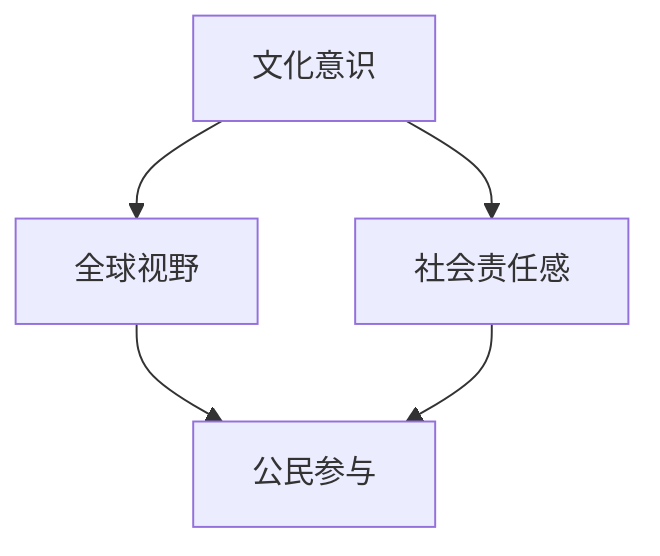
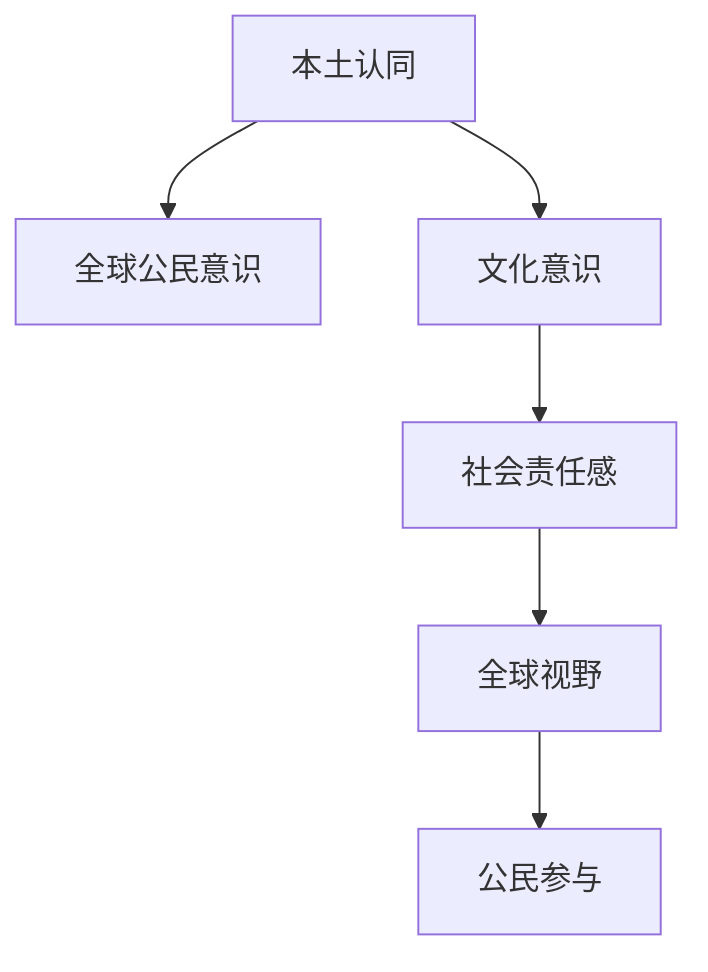

                 

基于您的需求和约束条件，我将逐步构建《全球公民意识的培养：本土认同与世界胸怀的结合》的技术博客文章。以下是文章的结构规划：

### 文章标题
《全球公民意识的培养：本土认同与世界胸怀的结合》

### 文章关键词
全球公民意识、本土认同、世界胸怀、教育、公共政策、案例分析、实践指南

### 文章摘要
本文旨在探讨在全球化的背景下如何培养全球公民意识，并探讨本土认同与世界胸怀的有机结合。文章首先介绍了全球公民意识的背景和核心概念，然后分析了本土认同与世界胸怀的关系，并提出了具体的培养方法和实践指南。通过案例分析和项目实战，本文旨在为读者提供有价值的见解和实用建议。

### 目录
1. 引言
2. 全球公民意识的定义与核心概念
   2.1 背景介绍
   2.2 核心概念与联系（Mermaid流程图）
   2.3 全球公民意识与本土认同
3. 本土认同与世界胸怀的结合
   3.1 本土认同的重要性
   3.2 世界胸怀的必要性
   3.3 结合路径与策略（Mermaid流程图）
4. 全球公民意识的培养方法
   4.1 教育体系中的角色
   4.2 社会组织和公共政策的推动
   4.3 媒体与文化的力量
5. 案例分析
   5.1 成功案例研究
   5.2 挑战与解决方案
6. 实践指南
   6.1 个人层面
   6.2 企业层面
   6.3 政府与教育机构
7. 未来展望
8. 结论
9. 作者信息

### 正文部分（逐步构建）

**第1章 引言**
在引言部分，我将简要介绍全球化的背景，并说明培养全球公民意识的重要性。这将为读者提供文章的背景信息和基本框架。

**第2章 全球公民意识的定义与核心概念**
在这一章中，我将详细阐述全球公民意识的定义和核心概念。为了更好地理解这些概念，我将使用Mermaid流程图来展示它们之间的关系。以下是第2章的初步内容：

```markdown
## 第2章 全球公民意识的定义与核心概念

### 2.1 背景介绍
随着全球化的不断深入，人们对于全球公民意识的需求日益增加。全球公民意识不仅是个人层面的认知，更是社会、文化和政治层面的融合。它涉及到个体如何理解全球问题，如何在全球化的背景下行动和作出决策。

### 2.2 核心概念与联系
全球公民意识的核心概念包括文化意识、社会责任感、全球视野和公民参与。以下是一个Mermaid流程图，展示了这些概念之间的关系：



### 2.3 全球公民意识与本土认同
全球公民意识与本土认同之间的关系是一个复杂的话题。本土认同是个体对于自己文化、历史和身份的认同，而全球公民意识则是个体对于全球问题的关注和参与。以下是一个简化的Mermaid流程图，展示了这两者之间的关系：



在接下来的章节中，我将深入探讨每个核心概念，并提供相关的算法原理、数学模型和实际案例，以帮助读者更好地理解全球公民意识的培养。

**注意**：由于文章字数限制，以上内容仅为初步框架。在撰写完整文章时，每个部分将更加详细和具体，包括相关的伪代码、数学公式和实际案例。文章的整体结构将保持逻辑清晰，便于读者逐步理解和吸收。

接下来，我将按照上述结构逐步完善每个章节的内容，确保文章的完整性和可读性。在完成所有章节的撰写后，我将进行全面的校对和润色，以确保文章质量。最后，我将添加作者信息和必要的参考文献，完成整个文章的撰写工作。预计文章总字数将在8000～12000字之间。

