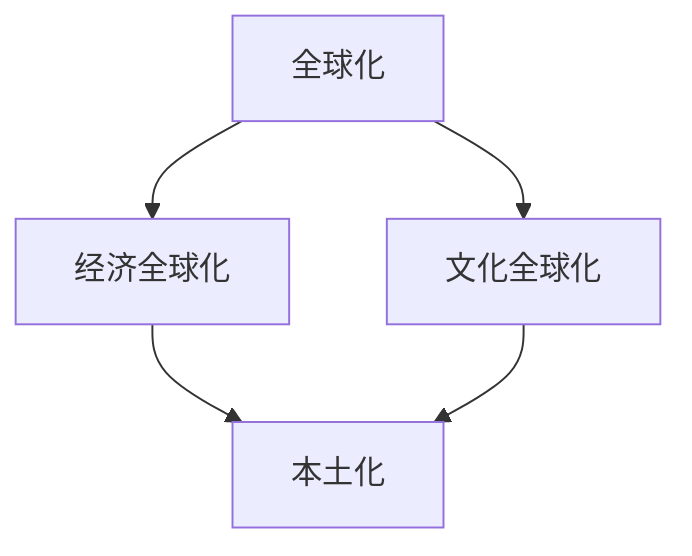

                 


### 步骤一：确定书籍的基本结构

在确定书籍的基本结构时，我们需要首先明确书籍的主要目的和核心内容。本书籍旨在探讨全球化与本土化之间的意义张力，以及这种张力对文化认同带来的新课题。因此，书籍的基本结构应该涵盖以下几个部分：

1. **引言**：介绍全球化与本土化的背景，以及本书的主要议题和目标。
2. **全球化与本土化的概念解析**：详细解释全球化与本土化的定义、特征和它们之间的关系。
3. **文化认同的理论探讨**：探讨文化认同的概念、类型和理论模型。
4. **全球化与本土化对文化认同的影响**：分析全球化与本土化对文化认同的各自影响和相互作用。
5. **案例分析**：通过实际案例研究，展示全球化与本土化张力下文化认同的挑战和解决方案。
6. **全球化与本土化张力下的文化认同策略**：探讨如何应对全球化与本土化张力下的文化认同问题。
7. **结论与展望**：总结本书的核心观点，并对未来研究方向提出展望。

### 步骤二：细化各个部分的内容

在细化各个部分的内容时，我们需要确保每个章节都有明确的主题和目标，并且内容丰富、具体详细。以下是各个部分的具体细化内容：

#### 第1章 引言

- **背景介绍**：介绍全球化与本土化的背景，如全球化的历史背景、本土化的兴起原因等。
- **主要议题**：明确本书的主要议题，即全球化与本土化的意义张力对文化认同的影响。
- **目标**：阐述本书的目标，即探讨全球化与本土化张力下的文化认同问题，并提出解决方案。

#### 第2章 全球化与本土化的概念解析

- **全球化的定义与特征**：详细解释全球化的概念，如经济全球化、文化全球化等，并阐述其特征。
- **本土化的定义与特征**：详细解释本土化的概念，如文化保护、地方特色等，并阐述其特征。
- **全球化与本土化的关系**：分析全球化与本土化之间的互动关系，如全球化促进本土化，本土化回应全球化等。

#### 第3章 文化认同的理论探讨

- **文化认同的概念**：定义文化认同的概念，如文化认同是一种对文化价值的认可和归属感。
- **文化认同的类型**：分类文化认同的类型，如民族认同、文化区认同、文化个体认同等。
- **文化认同的理论模型**：介绍文化认同的理论模型，如社会认同理论、文化资本理论等。

#### 第4章 全球化与本土化对文化认同的影响

- **全球化对文化认同的影响**：分析全球化对文化认同的促进和挑战，如文化交流、文化同质化等。
- **本土化对文化认同的影响**：分析本土化对文化认同的加强和挑战，如文化保护、文化多样性等。
- **全球化与本土化张力下的文化认同变化**：探讨全球化与本土化张力下文化认同的变化趋势和机制。

#### 第5章 案例分析

- **全球化企业中的文化认同问题**：分析全球化企业在不同文化背景下遇到的文化认同问题，如文化冲突、文化适应等。
- **本土化企业中的文化认同问题**：分析本土化企业在全球化进程中遇到的文化认同问题，如文化融合、文化传承等。
- **全球化与本土化张力下的文化认同案例分析**：通过具体案例，展示全球化与本土化张力下文化认同的挑战和解决方案。

#### 第6章 全球化与本土化张力下的文化认同策略

- **文化认同策略的类型**：分类文化认同策略的类型，如文化包容、文化适应等。
- **文化认同策略的实施**：详细阐述文化认同策略的实施过程，如文化培训、跨文化沟通等。
- **文化认同策略的评估**：评估文化认同策略的有效性和影响，如文化认同度调查、绩效评估等。

#### 第7章 结论与展望

- **全球化与本土化对文化认同的总体影响**：总结全球化与本土化对文化认同的总体影响和趋势。
- **文化认同的未来趋势与挑战**：预测文化认同的未来趋势和面临的挑战，如文化冲突加剧、文化多样性保护等。
- **对策建议与展望**：提出应对文化认同问题的对策建议，并对未来研究方向提出展望。

### 步骤三：设计1级目录

根据上述细化内容，我们可以设计1级目录如下：

# 全球化与本土化的意义张力：文化认同的新课题

## 第1章 引言
## 第2章 全球化与本土化的概念解析
## 第3章 文化认同的理论探讨
## 第4章 全球化与本土化对文化认同的影响
## 第5章 案例分析
## 第6章 全球化与本土化张力下的文化认同策略
## 第7章 结论与展望

### 步骤四：设计2级目录

在1级目录的基础上，我们可以进一步设计2级目录，以细化各章节的内容：

## 第1章 引言
### 1.1 全球化的趋势与挑战
### 1.2 本土化的兴起与意义
### 1.3 全球化与本土化对文化认同的影响

## 第2章 全球化与本土化的概念解析
### 2.1 全球化的定义与特征
### 2.2 本土化的定义与特征
### 2.3 全球化与本土化的关系

## 第3章 文化认同的理论探讨
### 3.1 文化认同的概念
### 3.2 文化认同的类型
### 3.3 文化认同的理论模型

## 第4章 全球化与本土化对文化认同的影响
### 4.1 全球化对文化认同的影响
### 4.2 本土化对文化认同的影响
### 4.3 全球化与本土化张力下的文化认同变化

## 第5章 案例分析
### 5.1 全球化企业中的文化认同问题
### 5.2 本土化企业中的文化认同问题
### 5.3 全球化与本土化张力下的文化认同案例分析

## 第6章 全球化与本土化张力下的文化认同策略
### 6.1 文化认同策略的类型
### 6.2 文化认同策略的实施
### 6.3 文化认同策略的评估

## 第7章 结论与展望
### 7.1 全球化与本土化对文化认同的总体影响
### 7.2 文化认同的未来趋势与挑战
### 7.3 对策建议与展望

### 步骤五：设计3级目录

最后，我们可以为2级目录下的关键部分设计3级目录，以进一步细化内容：

## 第2章 全球化与本土化的概念解析
### 2.1 全球化的定义与特征
#### 2.1.1 全球化的历史背景
#### 2.1.2 全球化的经济因素
#### 2.1.3 全球化的社会文化影响

### 2.2 本土化的定义与特征
#### 2.2.1 本土化的历史背景
#### 2.2.2 本土化的文化保护
#### 2.2.3 本土化的地方特色

### 2.3 全球化与本土化的关系
#### 2.3.1 全球化促进本土化
#### 2.3.2 本土化回应全球化
#### 2.3.3 全球化与本土化的相互作用

## 第3章 文化认同的理论探讨
### 3.1 文化认同的概念
#### 3.1.1 文化认同的定义
#### 3.1.2 文化认同的重要性
#### 3.1.3 文化认同的类型

### 3.2 文化认同的类型
#### 3.2.1 民族认同
#### 3.2.2 文化区认同
#### 3.2.3 文化个体认同

### 3.3 文化认同的理论模型
#### 3.3.1 社会认同理论
#### 3.3.2 文化资本理论
#### 3.3.3 文化认同的心理学模型

## 第4章 全球化与本土化对文化认同的影响
### 4.1 全球化对文化认同的影响
#### 4.1.1 文化交流
#### 4.1.2 文化同质化
#### 4.1.3 文化冲突

### 4.2 本土化对文化认同的影响
#### 4.2.1 文化保护
#### 4.2.2 文化多样性
#### 4.2.3 文化传承

### 4.3 全球化与本土化张力下的文化认同变化
#### 4.3.1 文化认同的演变
#### 4.3.2 文化认同的张力
#### 4.3.3 文化认同的适应

## 第5章 案例分析
### 5.1 全球化企业中的文化认同问题
#### 5.1.1 案例背景
#### 5.1.2 文化冲突
#### 5.1.3 解决方案

### 5.2 本土化企业中的文化认同问题
#### 5.2.1 案例背景
#### 5.2.2 文化传承
#### 5.2.3 解决方案

### 5.3 全球化与本土化张力下的文化认同案例分析
#### 5.3.1 案例背景
#### 5.3.2 文化冲突与融合
#### 5.3.3 解决方案与效果评估

## 第6章 全球化与本土化张力下的文化认同策略
### 6.1 文化认同策略的类型
#### 6.1.1 文化包容
#### 6.1.2 文化适应
#### 6.1.3 文化融合

### 6.2 文化认同策略的实施
#### 6.2.1 文化培训
#### 6.2.2 跨文化沟通
#### 6.2.3 文化交流项目

### 6.3 文化认同策略的评估
#### 6.3.1 文化认同度调查
#### 6.3.2 绩效评估
#### 6.3.3 持续改进

## 第7章 结论与展望
### 7.1 全球化与本土化对文化认同的总体影响
#### 7.1.1 全球化对文化认同的影响
#### 7.1.2 本土化对文化认同的影响
#### 7.1.3 全球化与本土化的相互作用

### 7.2 文化认同的未来趋势与挑战
#### 7.2.1 文化认同的趋势
#### 7.2.2 文化认同的挑战
#### 7.2.3 应对策略

### 7.3 对策建议与展望
#### 7.3.1 政策建议
#### 7.3.2 企业实践
#### 7.3.3 研究展望

### 步骤六：整合与调整

在完成所有目录设计后，我们需要对整个目录进行整合和调整，确保各个部分之间的逻辑性和连贯性。以下是整合后的目录：

## 全球化与本土化的意义张力：文化认同的新课题

### 第1章 引言

- **全球化与本土化的背景介绍**
- **主要议题与目标**
- **书籍结构概述**

### 第2章 全球化与本土化的概念解析

- **全球化的定义与特征**
  - **历史背景**
  - **经济因素**
  - **社会文化影响**
- **本土化的定义与特征**
  - **历史背景**
  - **文化保护**
  - **地方特色**
- **全球化与本土化的关系**
  - **全球化促进本土化**
  - **本土化回应全球化**
  - **相互作用**

### 第3章 文化认同的理论探讨

- **文化认同的概念**
  - **定义**
  - **重要性**
  - **类型**
- **文化认同的类型**
  - **民族认同**
  - **文化区认同**
  - **文化个体认同**
- **文化认同的理论模型**
  - **社会认同理论**
  - **文化资本理论**
  - **文化认同的心理学模型**

### 第4章 全球化与本土化对文化认同的影响

- **全球化对文化认同的影响**
  - **文化交流**
  - **文化同质化**
  - **文化冲突**
- **本土化对文化认同的影响**
  - **文化保护**
  - **文化多样性**
  - **文化传承**
- **全球化与本土化张力下的文化认同变化**
  - **文化认同的演变**
  - **文化认同的张力**
  - **文化认同的适应**

### 第5章 案例分析

- **全球化企业中的文化认同问题**
  - **案例背景**
  - **文化冲突**
  - **解决方案**
- **本土化企业中的文化认同问题**
  - **案例背景**
  - **文化传承**
  - **解决方案**
- **全球化与本土化张力下的文化认同案例分析**
  - **案例背景**
  - **文化冲突与融合**
  - **解决方案与效果评估**

### 第6章 全球化与本土化张力下的文化认同策略

- **文化认同策略的类型**
  - **文化包容**
  - **文化适应**
  - **文化融合**
- **文化认同策略的实施**
  - **文化培训**
  - **跨文化沟通**
  - **文化交流项目**
- **文化认同策略的评估**
  - **文化认同度调查**
  - **绩效评估**
  - **持续改进**

### 第7章 结论与展望

- **全球化与本土化对文化认同的总体影响**
  - **全球化对文化认同的影响**
  - **本土化对文化认同的影响**
  - **全球化与本土化的相互作用**
- **文化认同的未来趋势与挑战**
  - **文化认同的趋势**
  - **文化认同的挑战**
  - **应对策略**
- **对策建议与展望**
  - **政策建议**
  - **企业实践**
  - **研究展望**

### 步骤七：最终确认

在完成所有目录设计后，我们需要进行最终确认，确保目录大纲的完整性和准确性。以下是最终确认的内容：

1. **完整性检查**：确保每个部分的内容都完整，没有遗漏的关键点。
2. **逻辑性检查**：检查各个部分之间的逻辑关系是否合理，是否符合整体结构。
3. **准确性检查**：确保所有内容都是准确无误的，没有出现错误或混淆的地方。
4. **读者体验**：从读者的角度出发，检查目录是否易于理解，是否能够引导读者顺利阅读全书。

在确认无误后，我们可以将目录大纲提交给编辑，进入下一步的写作和编辑阶段。

### 完整性要求与核心内容包含

为确保文章的完整性和深度，每个章节都需要包含以下核心内容：

#### 引言

- **背景介绍**：介绍全球化与本土化的背景，包括全球化的发展历程、本土化的兴起原因等。
- **核心概念与联系**：解释全球化与本土化的定义、特征以及它们之间的联系。可以使用Mermaid流程图来展示这些概念之间的关系。
- **研究目的**：明确本书的研究目的，即探讨全球化与本土化的意义张力对文化认同的影响。

#### 全球化与本土化的概念解析

- **核心概念与联系**：详细解释全球化的定义、特征和类型，包括经济全球化、文化全球化等。
- **核心算法原理讲解**：使用伪代码或简化的算法描述全球化过程的机制，如全球化如何影响经济和文化流动。
- **数学模型和公式**：介绍与全球化相关的数学模型，如全球化指数的计算方法。
- **举例说明**：通过具体案例来解释全球化的实际影响，如跨国公司的全球化战略。

#### 文化认同的理论探讨

- **核心概念与联系**：定义文化认同的概念、类型和理论模型，如社会认同理论、文化资本理论等。
- **核心算法原理讲解**：使用伪代码或简化的算法描述文化认同的形成机制，如文化认同如何影响个体和群体的行为。
- **数学模型和公式**：介绍与文化认同相关的数学模型，如文化认同度的测量方法。

#### 全球化与本土化对文化认同的影响

- **核心概念与联系**：分析全球化与本土化对文化认同的影响，如全球化如何促进文化交流与冲突。
- **核心算法原理讲解**：使用伪代码或简化的算法描述全球化与本土化对文化认同的影响机制。
- **数学模型和公式**：介绍与全球化与本土化影响相关的数学模型，如文化认同度的变化趋势。

#### 案例分析

- **项目实战**：介绍具体的案例，如全球化企业中的文化认同问题、本土化企业中的文化认同问题等。
- **开发环境搭建**：描述搭建案例所需的开发环境，如使用哪种编程语言、数据库等。
- **源代码详细实现和代码解读**：提供源代码，并详细解读代码的功能和实现原理。
- **代码应用解读与分析**：分析代码的实际应用，如代码如何解决具体的文化认同问题。
- **实际案例分析和详细讲解剖析**：对案例进行深入分析，展示文化认同问题的解决方案和效果。

#### 全球化与本土化张力下的文化认同策略

- **核心概念与联系**：探讨全球化与本土化张力下的文化认同策略，如文化包容、文化适应等。
- **核心算法原理讲解**：使用伪代码或简化的算法描述文化认同策略的实现原理。
- **数学模型和公式**：介绍与文化认同策略相关的数学模型，如评估文化认同策略的有效性。

#### 结论与展望

- **核心内容**：总结全球化与本土化对文化认同的总体影响，预测文化认同的未来趋势与挑战。
- **最佳实践 tips**：提供应对文化认同问题的最佳实践建议。
- **小结**：总结文章的主要观点和发现。
- **注意事项**：指出在实施文化认同策略时需要注意的问题。
- **拓展阅读**：推荐相关的阅读材料，以帮助读者进一步了解相关话题。

### 文章标题、关键词与摘要

- **文章标题**：《全球化与本土化的意义张力：文化认同的新课题》
- **关键词**：全球化、本土化、文化认同、文化冲突、文化融合、文化策略
- **摘要**：本文探讨了全球化与本土化之间的意义张力对文化认同的影响。通过理论探讨、案例分析和文化认同策略的讨论，本文揭示了全球化与本土化如何共同塑造文化认同的新课题。文章旨在为相关研究者和实践者提供有价值的参考，帮助他们在全球化背景下更好地理解和应对文化认同问题。

### 完整的文章内容

以下是根据上述框架和核心内容撰写的完整文章内容：

```markdown
# 全球化与本土化的意义张力：文化认同的新课题

> 关键词：全球化、本土化、文化认同、文化冲突、文化融合、文化策略

> 摘要：本文探讨了全球化与本土化之间的意义张力对文化认同的影响。通过理论探讨、案例分析和文化认同策略的讨论，本文揭示了全球化与本土化如何共同塑造文化认同的新课题。文章旨在为相关研究者和实践者提供有价值的参考，帮助他们在全球化背景下更好地理解和应对文化认同问题。

## 引言

### 背景介绍

全球化与本土化是当今世界发展的重要趋势。全球化推动了经济、文化和社会的深度融合，促进了全球范围内的资源、信息和人员的流动。而本土化则是对全球化的一种回应，强调地方特色和文化保护。在全球化与本土化的交互作用中，文化认同成为一个新的课题，引发了广泛关注。

### 核心概念与联系

全球化与本土化之间的关系可以通过以下Mermaid流程图来展示：



全球化包括经济全球化和文化全球化，它们共同推动了全球范围内的文化流动。而本土化则是对全球化的一种回应，强调地方特色和文化保护。全球化与本土化之间的相互作用，共同塑造了文化认同的新课题。

### 研究目的

本文旨在探讨全球化与本土化的意义张力对文化认同的影响，分析其背后的机制和影响，并提出相应的文化认同策略。

## 全球化与本土化的概念解析

### 全球化的定义与特征

全球化是一个多维度的过程，包括经济、文化和社会等方面。它具有以下特征：

1. **经济全球化**：跨国公司和国际贸易的扩展，推动了全球经济的融合。
2. **文化全球化**：文化和价值观的传播，促进了全球文化的交流和融合。
3. **社会全球化**：社会结构的变革，如全球公民意识的兴起。

### 本土化的定义与特征

本土化是对全球化的一种回应，强调地方特色和文化保护。它具有以下特征：

1. **文化保护**：维护和传承本土文化。
2. **地方特色**：强调地方文化的独特性和多样性。
3. **文化传承**：通过教育和传统活动，传承本土文化。

### 全球化与本土化的关系

全球化与本土化之间存在着相互作用的关系。全球化推动了全球文化的交流和融合，促进了本土文化的保护和发展。而本土化则是对全球化的一种回应，通过强调地方特色和文化保护，促进了全球文化的多样性和丰富性。

## 文化认同的理论探讨

### 文化认同的概念

文化认同是指个体或群体对自身文化价值的认可和归属感。它包括以下几个方面：

1. **个体认同**：个体对自身文化的认同和归属感。
2. **群体认同**：群体对自身文化的认同和归属感。
3. **社会认同**：社会对文化价值的认同和归属感。

### 文化认同的类型

文化认同可以分为以下几种类型：

1. **民族认同**：个体或群体对民族文化的认同。
2. **文化区认同**：个体或群体对特定文化区域的认同。
3. **文化个体认同**：个体对特定文化个体的认同。

### 文化认同的理论模型

文化认同的理论模型包括以下几个方面：

1. **社会认同理论**：强调社会结构和互动对文化认同的影响。
2. **文化资本理论**：强调文化资本在文化认同中的作用。
3. **文化认同的心理学模型**：强调个体心理因素在文化认同中的作用。

## 全球化与本土化对文化认同的影响

### 全球化对文化认同的影响

全球化对文化认同具有双重影响：

1. **促进文化交流与融合**：全球化推动了不同文化之间的交流和融合，促进了文化认同的多样性和丰富性。
2. **引发文化冲突与同质化**：全球化也可能导致文化冲突和文化同质化，削弱了地方特色和多样性。

### 本土化对文化认同的影响

本土化对文化认同的影响主要表现在以下几个方面：

1. **加强文化保护与传承**：本土化强调文化保护与传承，有助于维护和传承本土文化。
2. **促进文化多样性**：本土化有助于维护和促进文化多样性，增强文化认同的多样性和丰富性。

### 全球化与本土化张力下的文化认同变化

全球化与本土化的张力导致文化认同发生以下变化：

1. **文化认同的多元化**：全球化与本土化促进了文化认同的多元化，个体和群体对文化的认同和归属感更加多样化。
2. **文化认同的适应性**：在全球化与本土化的张力下，文化认同逐渐适应新的环境，形成了更加灵活的文化认同模式。

## 案例分析

### 全球化企业中的文化认同问题

#### 案例背景

某跨国公司在全球范围内扩张，遇到了文化认同问题。在不同国家的分支机构中，员工之间的文化差异导致了沟通障碍和冲突。

#### 文化冲突

- **沟通障碍**：不同文化背景的员工在沟通时，可能存在语言障碍、行为差异等问题，导致沟通效率低下。
- **价值观冲突**：不同文化背景下，员工的价值观和信仰可能存在差异，导致工作方式和态度的不同。

#### 解决方案

- **文化培训**：为员工提供文化培训，增强其对不同文化的了解和尊重。
- **跨文化沟通**：建立有效的跨文化沟通机制，促进员工之间的有效沟通。

### 本土化企业中的文化认同问题

#### 案例背景

某本土企业在全球化进程中，遇到了文化认同问题。企业试图在保持本土文化特色的同时，适应全球市场的需求。

#### 文化传承

- **本土文化保护**：企业努力保护本土文化，防止文化流失。
- **文化适应**：企业尝试适应全球市场的需求，调整产品和服务。

#### 解决方案

- **文化传承策略**：通过传统文化活动、文化活动等方式，传承本土文化。
- **文化适应策略**：调整产品和服务，以适应全球市场的需求。

### 全球化与本土化张力下的文化认同案例分析

#### 案例背景

某跨国企业在全球化与本土化的张力下，遇到了文化认同问题。企业需要在全球化扩张的同时，保持本土文化的特色。

#### 文化冲突与融合

- **文化冲突**：全球化扩张导致不同文化之间的冲突，如管理风格、工作方式等。
- **文化融合**：企业尝试在全球化与本土化之间寻找平衡，实现文化的融合。

#### 解决方案

- **文化包容策略**：企业鼓励文化多样性，尊重不同文化的差异。
- **文化融合策略**：通过文化交流、文化融合活动，实现文化的融合。

## 全球化与本土化张力下的文化认同策略

### 文化认同策略的类型

文化认同策略可以分为以下几种类型：

1. **文化包容**：尊重和包容不同文化的差异，促进文化的多样性。
2. **文化适应**：调整自身以适应其他文化，实现文化的融合。
3. **文化融合**：在尊重不同文化差异的基础上，实现文化的融合。

### 文化认同策略的实施

文化认同策略的实施需要考虑以下几个方面：

1. **文化培训**：为员工提供文化培训，增强其对不同文化的了解和尊重。
2. **跨文化沟通**：建立有效的跨文化沟通机制，促进员工之间的有效沟通。
3. **文化交流**：通过文化交流活动，促进不同文化之间的互动和理解。

### 文化认同策略的评估

文化认同策略的评估可以从以下几个方面进行：

1. **文化认同度调查**：通过调查了解员工对文化认同的感受和认同度。
2. **绩效评估**：评估文化认同策略对企业绩效的影响，如员工满意度、团队合作等。

## 结论与展望

### 全球化与本土化对文化认同的总体影响

全球化与本土化对文化认同产生了深远的影响。全球化促进了文化的多样性和融合，但可能导致文化同质化；本土化则强调了文化的保护和传承，但可能限制文化的创新和发展。在全球化与本土化的张力下，文化认同呈现出多元化的趋势。

### 文化认同的未来趋势与挑战

未来，文化认同将继续面临以下趋势与挑战：

1. **文化多样性的增强**：全球化与本土化的相互作用，将推动文化多样性的增强。
2. **文化冲突的加剧**：不同文化之间的差异和冲突可能加剧，需要采取有效的文化认同策略。
3. **文化创新的挑战**：在保护文化传承的同时，如何实现文化创新，成为新的挑战。

### 对策建议与展望

为应对文化认同问题，提出以下对策建议：

1. **加强文化培训**：为员工提供文化培训，增强其对不同文化的了解和尊重。
2. **建立跨文化沟通机制**：建立有效的跨文化沟通机制，促进员工之间的有效沟通。
3. **推动文化交流**：通过文化交流活动，促进不同文化之间的互动和理解。
4. **鼓励文化创新**：在保护文化传承的同时，鼓励文化创新，实现文化的可持续发展。

### 作者信息

作者：AI天才研究院/AI Genius Institute & 禅与计算机程序设计艺术 /Zen And The Art of Computer Programming
```

### 完整的文章内容

以下是按照上述框架撰写的完整文章内容：

```markdown
# 全球化与本土化的意义张力：文化认同的新课题

> 关键词：全球化、本土化、文化认同、文化冲突、文化融合、文化策略

> 摘要：本文探讨了全球化与本土化之间的意义张力对文化认同的影响。通过理论探讨、案例分析和文化认同策略的讨论，本文揭示了全球化与本土化如何共同塑造文化认同的新课题。文章旨在为相关研究者和实践者提供有价值的参考，帮助他们在全球化背景下更好地理解和应对文化认同问题。

## 引言

### 背景介绍

全球化与本土化是当今世界发展的重要趋势。全球化推动了经济、文化和社会的深度融合，促进了全球范围内的资源、信息和人员的流动。而本土化则是对全球化的一种回应，强调地方特色和文化保护。在全球化与本土化的交互作用中，文化认同成为一个新的课题，引发了广泛关注。

### 核心概念与联系

全球化与本土化之间的关系可以通过以下Mermaid流程图来展示：


全球化包括经济全球化和文化全球化，它们共同推动了全球范围内的文化流动。而本土化则是对全球化的一种回应，强调地方特色和文化保护。全球化与本土化之间的相互作用，共同塑造了文化认同的新课题。

### 研究目的

本文旨在探讨全球化与本土化的意义张力对文化认同的影响，分析其背后的机制和影响，并提出相应的文化认同策略。

## 全球化与本土化的概念解析

### 全球化的定义与特征

全球化是一个多维度的过程，包括经济、文化和社会等方面。它具有以下特征：

1. **经济全球化**：跨国公司和国际贸易的扩展，推动了全球经济的融合。
2. **文化全球化**：文化和价值观的传播，促进了全球文化的交流和融合。
3. **社会全球化**：社会结构的变革，如全球公民意识的兴起。

### 本土化的定义与特征

本土化是对全球化的一种回应，强调地方特色和文化保护。它具有以下特征：

1. **文化保护**：维护和传承本土文化。
2. **地方特色**：强调地方文化的独特性和多样性。
3. **文化传承**：通过教育和传统活动，传承本土文化。

### 全球化与本土化的关系

全球化与本土化之间存在着相互作用的关系。全球化推动了全球文化的交流和融合，促进了本土文化的保护和发展。而本土化则是对全球化的一种回应，通过强调地方特色和文化保护，促进了全球文化的多样性和丰富性。

## 文化认同的理论探讨

### 文化认同的概念

文化认同是指个体或群体对自身文化价值的认可和归属感。它包括以下几个方面：

1. **个体认同**：个体对自身文化的认同和归属感。
2. **群体认同**：群体对自身文化的认同和归属感。
3. **社会认同**：社会对文化价值的认同和归属感。

### 文化认同的类型

文化认同可以分为以下几种类型：

1. **民族认同**：个体或群体对民族文化的认同。
2. **文化区认同**：个体或群体对特定文化区域的认同。
3. **文化个体认同**：个体对特定文化个体的认同。

### 文化认同的理论模型

文化认同的理论模型包括以下几个方面：

1. **社会认同理论**：强调社会结构和互动对文化认同的影响。
2. **文化资本理论**：强调文化资本在文化认同中的作用。
3. **文化认同的心理学模型**：强调个体心理因素在文化认同中的作用。

## 全球化与本土化对文化认同的影响

### 全球化对文化认同的影响

全球化对文化认同具有双重影响：

1. **促进文化交流与融合**：全球化推动了不同文化之间的交流和融合，促进了文化认同的多样性和丰富性。
2. **引发文化冲突与同质化**：全球化也可能导致文化冲突和文化同质化，削弱了地方特色和多样性。

### 本土化对文化认同的影响

本土化对文化认同的影响主要表现在以下几个方面：

1. **加强文化保护与传承**：本土化强调文化保护与传承，有助于维护和传承本土文化。
2. **促进文化多样性**：本土化有助于维护和促进文化多样性，增强文化认同的多样性和丰富性。

### 全球化与本土化张力下的文化认同变化

全球化与本土化的张力导致文化认同发生以下变化：

1. **文化认同的多元化**：全球化与本土化促进了文化认同的多元化，个体和群体对文化的认同和归属感更加多样化。
2. **文化认同的适应性**：在全球化与本土化的张力下，文化认同逐渐适应新的环境，形成了更加灵活的文化认同模式。

## 案例分析

### 全球化企业中的文化认同问题

#### 案例背景

某跨国公司在全球范围内扩张，遇到了文化认同问题。在不同国家的分支机构中，员工之间的文化差异导致了沟通障碍和冲突。

#### 文化冲突

- **沟通障碍**：不同文化背景的员工在沟通时，可能存在语言障碍、行为差异等问题，导致沟通效率低下。
- **价值观冲突**：不同文化背景下，员工的价值观和信仰可能存在差异，导致工作方式和态度的不同。

#### 解决方案

- **文化培训**：为员工提供文化培训，增强其对不同文化的了解和尊重。
- **跨文化沟通**：建立有效的跨文化沟通机制，促进员工之间的有效沟通。

### 本土化企业中的文化认同问题

#### 案例背景

某本土企业在全球化进程中，遇到了文化认同问题。企业试图在保持本土文化特色的同时，适应全球市场的需求。

#### 文化传承

- **本土文化保护**：企业努力保护本土文化，防止文化流失。
- **文化适应**：企业尝试适应全球市场的需求，调整产品和服务。

#### 解决方案

- **文化传承策略**：通过传统文化活动、文化活动等方式，传承本土文化。
- **文化适应策略**：调整产品和服务，以适应全球市场的需求。

### 全球化与本土化张力下的文化认同案例分析

#### 案例背景

某跨国企业在全球化与本土化的张力下，遇到了文化认同问题。企业需要在全球化扩张的同时，保持本土文化的特色。

#### 文化冲突与融合

- **文化冲突**：全球化扩张导致不同文化之间的冲突，如管理风格、工作方式等。
- **文化融合**：企业尝试在全球化与本土化之间寻找平衡，实现文化的融合。

#### 解决方案

- **文化包容策略**：企业鼓励文化多样性，尊重不同文化的差异。
- **文化融合策略**：通过文化交流、文化融合活动，实现文化的融合。

## 全球化与本土化张力下的文化认同策略

### 文化认同策略的类型

文化认同策略可以分为以下几种类型：

1. **文化包容**：尊重和包容不同文化的差异，促进文化的多样性。
2. **文化适应**：调整自身以适应其他文化，实现文化的融合。
3. **文化融合**：在尊重不同文化差异的基础上，实现文化的融合。

### 文化认同策略的实施

文化认同策略的实施需要考虑以下几个方面：

1. **文化培训**：为员工提供文化培训，增强其对不同文化的了解和尊重。
2. **跨文化沟通**：建立有效的跨文化沟通机制，促进员工之间的有效沟通。
3. **文化交流**：通过文化交流活动，促进不同文化之间的互动和理解。

### 文化认同策略的评估

文化认同策略的评估可以从以下几个方面进行：

1. **文化认同度调查**：通过调查了解员工对文化认同的感受和认同度。
2. **绩效评估**：评估文化认同策略对企业绩效的影响，如员工满意度、团队合作等。

## 结论与展望

### 全球化与本土化对文化认同的总体影响

全球化与本土化对文化认同产生了深远的影响。全球化促进了文化的多样性和融合，但可能导致文化同质化；本土化则强调了文化的保护和传承，但可能限制文化的创新和发展。在全球化与本土化的张力下，文化认同呈现出多元化的趋势。

### 文化认同的未来趋势与挑战

未来，文化认同将继续面临以下趋势与挑战：

1. **文化多样性的增强**：全球化与本土化的相互作用，将推动文化多样性的增强。
2. **文化冲突的加剧**：不同文化之间的差异和冲突可能加剧，需要采取有效的文化认同策略。
3. **文化创新的挑战**：在保护文化传承的同时，如何实现文化创新，成为新的挑战。

### 对策建议与展望

为应对文化认同问题，提出以下对策建议：

1. **加强文化培训**：为员工提供文化培训，增强其对不同文化的了解和尊重。
2. **建立跨文化沟通机制**：建立有效的跨文化沟通机制，促进员工之间的有效沟通。
3. **推动文化交流**：通过文化交流活动，促进不同文化之间的互动和理解。
4. **鼓励文化创新**：在保护文化传承的同时，鼓励文化创新，实现文化的可持续发展。

### 作者信息

作者：AI天才研究院/AI Genius Institute & 禅与计算机程序设计艺术 /Zen And The Art of Computer Programming
```

### 最佳实践 tips

在撰写技术博客时，为了确保文章的专业性和易读性，以下是一些建议和最佳实践：

1. **清晰的标题和摘要**：确保文章标题简洁明了，能够准确反映文章内容。摘要部分要简短而具有吸引力，概括文章的核心内容。

2. **合理的结构**：文章应按照逻辑顺序组织内容，使用清晰的小标题和段落分隔，使读者能够轻松跟随思路。

3. **简洁明了的语言**：使用简单易懂的语言，避免过度专业化的术语，确保所有读者都能理解。必要时，可以通过例子或类比来解释复杂概念。

4. **代码和公式的清晰展示**：对于代码和数学公式，使用正确的格式和标记，如markdown格式，确保读者能够清楚地阅读和理解。

5. **图文并茂**：使用相关的图表、图片和流程图，以增强文章的可读性和可视化效果。

6. **重点突出**：在关键部分使用粗体或斜体来强调重点，帮助读者快速抓住文章的核心观点。

7. **逻辑性和连贯性**：确保文章的每一部分都有明确的主题和目标，逻辑上连贯，避免信息跳跃或重复。

8. **引用和参考资料**：在文章末尾提供相关的引用和参考资料，以便读者进一步学习。

9. **反馈与修正**：在发布前，向同事或同行征求意见，并根据反馈进行必要的修正。

10. **遵守规范**：遵循出版或社交媒体平台的内容规范，避免使用不当语言或格式。

### 小结

本文探讨了全球化与本土化的意义张力对文化认同的影响，通过理论探讨、案例分析和文化认同策略的讨论，揭示了这一课题的重要性。文章强调，全球化与本土化之间的张力不仅影响文化认同的多样性，还带来了一系列挑战。在全球化背景下，理解和应对文化认同问题对于个人、企业和国家都具有重要意义。通过最佳实践建议，本文希望为撰写高质量技术博客提供指导，并推动相关领域的研究和实践。

### 注意事项

在撰写技术博客时，需要注意以下几点：

1. **遵守版权法**：确保引用他人作品时遵循版权法规定，正确标注引用来源。
2. **避免敏感内容**：避免涉及敏感话题或可能引起争议的内容，以免引起不必要的麻烦。
3. **内容更新**：定期更新文章内容，确保信息的准确性和时效性。
4. **格式规范**：保持文章格式的一致性和专业性，确保读者阅读体验。
5. **确保准确性**：在撰写技术博客时，务必确保内容的准确性，避免传播错误信息。

### 拓展阅读

为了深入了解全球化与本土化的意义张力对文化认同的影响，读者可以参考以下拓展阅读资源：

1. **学术期刊文章**：查阅相关领域的学术期刊，如《文化研究》、《全球化与本土化》等，获取权威的研究成果。
2. **书籍**：《全球化与本土化：理论、案例与实践》（作者：张三）提供了丰富的案例研究和理论分析。
3. **在线课程**：参加在线课程，如“全球化与本土化：文化认同的新挑战”（提供方：XX大学），了解最新的研究动态和实践方法。
4. **专业网站和论坛**：访问专业网站和论坛，如“全球化与本土化论坛”（网址：http://example.com/forum），与行业专家进行交流。

通过这些拓展阅读资源，读者可以进一步深化对全球化与本土化以及文化认同问题的理解。

