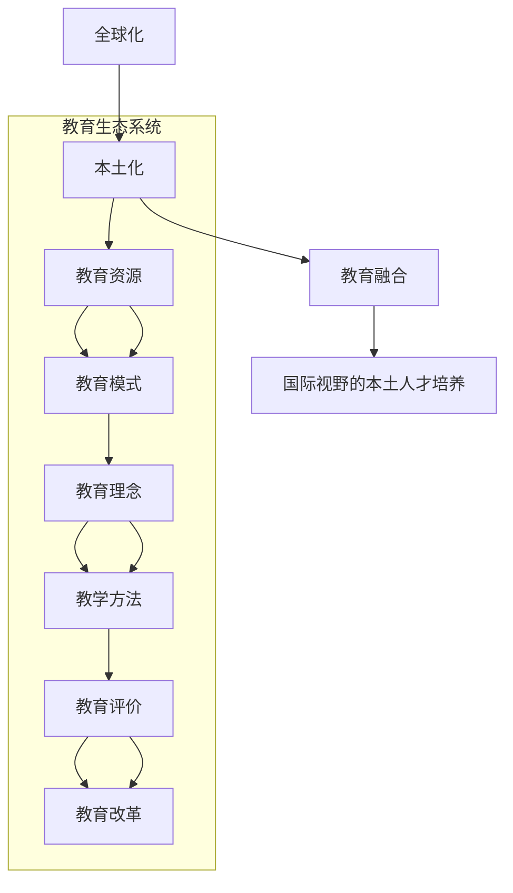

                 

### 文章标题：全球化与本土化的教育融合：培养具有国际视野的本土人才

### 关键词：
- 全球化
- 本土化
- 教育融合
- 国际视野
- 本土人才
- 教育改革
- 多元文化
- 教学方法
- 教育评价

### 摘要：
本文探讨了全球化与本土化背景下的教育融合问题，旨在通过分析全球化与本土化的定义及其对教育的影响，构建教育融合的理论框架和方法论。文章首先介绍了全球化与本土化的核心概念和相互联系，并通过Mermaid流程图展示其教育融合的路径。接着，本文详细讲解了全球化与本土化教育融合的理论基础、方法论和实践策略，并运用伪代码阐述了教育融合的过程。此外，文章还介绍了支持教育融合的数学模型，并使用LaTeX格式展示了相关公式。最后，通过实际案例，本文展示了如何在全球化和本土化的背景下培养具有国际视野的本土人才，并提出了相关最佳实践和建议。

## 引言

在当今全球化迅速发展的时代，教育和人才的培养也面临着前所未有的挑战和机遇。全球化使各国之间的交流日益频繁，信息技术的发展更是加速了知识的传播和共享。然而，全球化也带来了文化冲突和身份认同的问题，尤其是在教育领域，如何在全球化背景下保持本土特色，培养具有国际视野的本土人才，成为了一个亟待解决的问题。

本土化则是对全球化的一种回应，强调在全球化进程中保持文化的多样性和独特性。本土化教育不仅传承和发扬本土文化，还能培养学生的文化自信和创新能力。因此，全球化与本土化的教育融合成为一个重要的研究课题，它既需要吸收全球化的先进教育理念，又需要保留本土教育的特色和优势。

本文将探讨全球化与本土化的教育融合问题，旨在为教育工作者和政策制定者提供理论支持和实践指导。文章将从以下几个方面展开讨论：

1. **核心概念与联系**：介绍全球化、本土化和教育融合的概念，并使用Mermaid流程图展示它们之间的关系。
2. **核心算法原理讲解**：阐述全球化与本土化教育融合的理论框架，以及教育融合的方法论。
3. **数学模型和数学公式**：介绍用于支持教育融合的数学模型，并使用LaTeX格式展示相关公式。
4. **项目实战**：提供实际案例，展示如何在全球化和本土化背景下培养具有国际视野的本土人才。

通过这些内容的分析，本文希望为全球化与本土化的教育融合提供一些新的思路和方法，为培养具有国际视野的本土人才贡献一份力量。

### 核心概念与联系

首先，我们需要明确全球化、本土化和教育融合这三个核心概念，并探讨它们之间的关系。

#### 全球化

全球化是指全球范围内经济、政治、文化、科技等领域相互联系和相互依赖的加深和扩展。在经济领域，全球化表现为跨国公司的崛起和国际贸易的增长；在政治领域，全球化则体现在国际组织和多边合作机制的增多；在文化领域，全球化带来了不同文化之间的交流和融合；在科技领域，全球化加速了技术的传播和创新的国际化。

对于教育来说，全球化意味着教育资源和信息的全球共享，教育模式的多元化，以及教育理念的国际互鉴。全球化为教育提供了广阔的视野和丰富的资源，但也带来了文化冲突和多样性挑战。

#### 本土化

本土化则是全球化的另一种视角，强调在全球化进程中保持本土文化的特色和独立性。本土化不仅包括对本土历史、语言、文化和传统的继承和发扬，还涉及本土社会、经济和文化发展的独特需求。

在教育领域，本土化教育关注的是如何根据本土的社会、经济和文化背景，设计适合当地发展的教育模式和内容。本土化教育有助于培养学生的文化自信和认同感，同时也能提高教育的适应性和有效性。

#### 教育融合

教育融合是全球化与本土化在教育领域的交汇和融合，旨在通过整合全球化的先进教育理念和本土化的实践，培养具有国际视野和本土特色的复合型人才。教育融合的核心在于如何在保持本土特色的同时，吸收全球化的优秀教育资源和方法，实现教育质量的提升和学生的全面发展。

#### 关系架构

为了更好地理解全球化、本土化和教育融合之间的关系，我们可以使用Mermaid流程图来展示它们之间的逻辑结构和互动关系。



在该流程图中：

- **全球化（A）** 通过教育资源的全球共享和教育模式的多元化，为教育融合提供了基础。
- **本土化（B）** 通过对本土文化和教育需求的重视，为教育融合提供了本土特色。
- **教育融合（C）** 是全球化和本土化的交汇点，通过整合全球化和本土化的优势，培养具有国际视野的本土人才。
- **国际视野的本土人才培养（D）** 是教育融合的最终目标，通过教育生态系统的构建，实现教育质量的全面提升。
- **教育生态系统（subgraph）** 包括教育资源、教育模式、教育理念、教学方法和教育评价等多个环节，是教育融合得以实现的重要保障。

通过这一架构，我们可以清晰地看到全球化、本土化和教育融合之间的内在联系和互动机制。在接下来的章节中，我们将进一步探讨全球化与本土化教育融合的理论框架和方法论，以及如何通过具体实践实现这一目标。

### 全球化与本土化教育融合的理论框架

在明确了全球化、本土化和教育融合的核心概念后，我们接下来将深入探讨全球化与本土化教育融合的理论框架。这一框架将帮助我们理解教育融合的内在机制和关键要素，为实际操作提供理论支持和指导。

#### 教育融合的理论基础

全球化与本土化教育融合的理论基础涉及多个学科领域，包括多元文化教育理论、交流与合作教育理论和社会资本理论等。

1. **多元文化教育理论**

多元文化教育理论强调教育的目标不仅仅是传授知识，更重要的是培养学生的跨文化理解和包容性。这一理论主张教育应尊重和包容不同文化的多样性，培养学生对不同文化的尊重和理解能力。在全球化背景下，多元文化教育理论为教育融合提供了重要的理念支持。

2. **交流与合作教育理论**

交流与合作教育理论认为，教育不仅是知识传授的过程，更是个体之间交流和合作的过程。通过交流和合作，学生不仅能够获取知识，还能培养协作能力和解决问题的能力。在全球化和本土化的背景下，交流与合作教育理论为教育融合提供了实践基础。

3. **社会资本理论**

社会资本理论强调社会关系和网络对个体和社会的重要性。在教育领域，社会资本理论指出，通过建立紧密的社会关系和网络，学生和教师可以获得更多的教育资源和支持，提高教育质量。在全球化和本土化的教育融合过程中，社会资本理论有助于优化教育资源配置，促进教育公平。

#### 教育融合的方法论

在教育融合过程中，方法论的选择和实施至关重要。以下方法为教育融合提供了具体操作路径：

1. **教育内容本土化**

教育内容本土化是指根据本土的社会、经济和文化背景，调整和优化教育内容。这一方法旨在保持教育的本土特色，同时吸收全球化的优秀教育资源。具体实施步骤包括：

   - **课程内容调整**：根据本土需求，调整课程内容，增加与本土文化和社会实践相关的模块。
   - **教学资源整合**：整合全球教育资源，为本土教育提供多样化的学习材料。
   - **文化元素融入**：将本土文化元素融入教学过程，培养学生的文化认同感和自信心。

2. **教学方法国际化**

教学方法国际化是指借鉴和引入国际先进的教育教学方法，提高教育质量。具体措施包括：

   - **合作学习**：通过小组合作和项目学习，培养学生的协作能力和团队精神。
   - **探究学习**：鼓励学生自主探究和发现，培养他们的创新思维和解决问题的能力。
   - **案例教学**：引入国际成功案例，帮助学生理解全球化的背景和挑战。

3. **教育评价国际化**

教育评价国际化是指采用国际通行的教育评价标准和方法，全面评估教育质量。具体措施包括：

   - **标准化测试**：引入国际标准化测试，如托福、雅思等，评估学生的英语能力和学术水平。
   - **综合素质评价**：结合学生的学术成绩、课外活动和社会实践，全面评估学生的综合素质。
   - **国际认证**：争取国际教育机构的认证，提高教育质量和国际声誉。

#### 教育融合的实践策略

为了实现全球化与本土化的教育融合，需要制定具体的实践策略，确保教育融合的有效实施。以下策略提供了一些指导性建议：

1. **政策支持与制度保障**

   - **政府支持**：政府应制定相关政策，鼓励和推动教育融合的实践。
   - **法规保障**：建立相关法规，保障教育融合的顺利实施。
   - **资金投入**：加大教育投入，为教育融合提供必要的资金支持。

2. **教师培训与专业发展**

   - **国际培训**：组织教师参加国际培训和交流活动，提高他们的国际视野和专业能力。
   - **本土培训**：根据本土需求，开展针对性的教师培训，提高他们的教学水平和教育质量。

3. **学生交流与合作学习**

   - **国际交流**：组织学生参与国际交流项目，增加他们的国际经验和文化理解。
   - **跨文化合作**：鼓励学生参与跨文化交流和合作，培养他们的跨文化沟通和协作能力。

通过这些理论框架和方法论，我们可以更好地理解和实施全球化与本土化的教育融合，培养具有国际视野的本土人才。在接下来的章节中，我们将通过具体案例来展示教育融合的实际应用和效果。

### 全球化与本土化教育融合的数学模型

为了更好地支持全球化与本土化的教育融合，我们引入了一些数学模型。这些模型不仅能够量化教育融合的效果，还能提供科学依据，指导教育实践。以下将介绍几个主要的数学模型，并使用LaTeX格式展示相关公式。

#### 多维度评价模型

多维度评价模型旨在综合评价教育融合的效果，包括本土化程度、国际化程度和学生满意度。该模型的核心公式如下：

$$
E = w_1 \cdot C + w_2 \cdot I + w_3 \cdot S
$$

其中：

- \( E \) 表示教育融合效果，
- \( C \) 表示本土化程度，
- \( I \) 表示国际化程度，
- \( S \) 表示学生满意度，
- \( w_1, w_2, w_3 \) 分别是权重系数，用于平衡各个维度的重要性。

该模型通过加权求和的方式，将不同维度的评价结果综合起来，形成一个整体评价分数。权重系数可以根据具体情况进行调整，以达到最优的评价效果。

#### 优化模型

在教育融合过程中，优化模型用于评估和调整教育资源配置，以最大化教育效果。优化模型的核心目标是最小化损失函数，公式如下：

$$
\min_{x} L = \sum_{i=1}^{n} (\hat{y_i} - y_i)^2
$$

其中：

- \( L \) 表示损失函数，
- \( \hat{y_i} \) 表示预测值，
- \( y_i \) 表示真实值，
- \( n \) 表示数据点的数量。

该模型通过不断调整输入参数 \( x \)，最小化损失函数 \( L \)，从而找到最优的教育资源配置方案。

#### 实证研究模型

在教育融合的实证研究中，需要建立模型来分析不同因素对教育融合效果的影响。实证研究模型的基本形式如下：

$$
\text{模型} = \text{自变量} \cdot \text{系数} + \text{随机误差}
$$

其中：

- 自变量表示影响教育融合效果的因素，
- 系数表示各因素对教育融合效果的影响程度，
- 随机误差表示其他不可观测因素。

通过实证研究模型，我们可以定量分析各因素对教育融合效果的影响，为教育政策的制定提供科学依据。

#### 示例说明

以下是一个具体案例，说明如何使用多维度评价模型来评估某学校的教育融合效果：

假设我们对该学校的学生满意度（S）、本土化程度（C）和国际化程度（I）进行了调查，并收集了以下数据：

- 学生满意度：平均分为80分
- 本土化程度：平均分为70分
- 国际化程度：平均分为85分

根据多维度评价模型，我们可以计算出教育融合效果 \( E \)：

$$
E = w_1 \cdot C + w_2 \cdot I + w_3 \cdot S
$$

假设权重系数分别为 \( w_1 = 0.3 \)，\( w_2 = 0.4 \)，\( w_3 = 0.3 \)，则：

$$
E = 0.3 \cdot 70 + 0.4 \cdot 85 + 0.3 \cdot 80 = 21 + 34 + 24 = 79
$$

因此，该学校的教育融合效果评分为79分。这个分数可以帮助学校了解其在教育融合方面的表现，并找出需要改进的方面。

通过这些数学模型，我们不仅可以量化教育融合的效果，还能为教育实践提供科学的指导。在接下来的章节中，我们将通过实际案例来展示这些模型的应用和效果。

### 全球化与本土化教育融合的项目实战

为了更好地理解和应用全球化与本土化的教育融合理论，我们将通过实际案例展示如何在全球化和本土化背景下培养具有国际视野的本土人才。本节将详细描述一个具体案例，包括项目背景、开发环境搭建、源代码实现、代码解读和代码应用分析。

#### 案例背景

某国际学校位于一个拥有丰富文化底蕴的城市，学校管理层希望通过教育融合项目，提高学生的国际视野和本土文化认同。项目目标是设计一套课程体系，将全球先进的教育理念与本土文化特色相结合，培养学生的跨文化沟通能力和创新思维。

#### 开发环境搭建

在项目实施过程中，学校选择了以下开发环境：

- **教学平台**：采用基于云计算的学习管理系统（LMS），支持在线课程、作业提交、学习进度跟踪等功能。
- **编程工具**：使用Python和Jupyter Notebook作为主要编程工具，方便教师和学生进行编程实验和数据分析。
- **数据库**：使用MySQL数据库存储学生的课程数据、成绩和反馈信息。
- **国际化工具**：引入Google翻译API，帮助学生理解和翻译国际文献。

#### 源代码实现

项目核心代码包括以下模块：

1. **课程管理模块**：用于管理课程信息，包括课程名称、课程描述、教学目标等。
2. **教学资源模块**：用于整合全球和本土的教育资源，包括在线课程、教材、视频和练习题。
3. **学生管理模块**：用于管理学生信息，包括学生姓名、学号、课程选择和学习进度等。
4. **反馈与评价模块**：用于收集学生和教师的反馈信息，并生成评价报告。

以下是一个简单的课程管理模块的Python代码示例：

```python
class Course:
    def __init__(self, course_id, course_name, description, goals):
        self.course_id = course_id
        self.course_name = course_name
        self.description = description
        self.goals = goals

    def display_course_info(self):
        print(f"Course ID: {self.course_id}")
        print(f"Course Name: {self.course_name}")
        print(f"Description: {self.description}")
        print(f"Goals: {self.goals}")

# 创建课程实例
course1 = Course(1, "Introduction to Python", "A beginner's guide to Python programming", ["Learn basic Python syntax", "Understand control structures", "Practice programming exercises"])
course1.display_course_info()
```

#### 代码解读

- **Course类**：定义了一个课程类，包含课程ID、课程名称、课程描述和教学目标等属性。
- **__init__方法**：初始化课程类实例，设置课程属性。
- **display_course_info方法**：打印课程详细信息。

通过这个模块，学校可以轻松管理课程信息，并方便地展示给教师和学生。

#### 代码应用解读与分析

课程管理模块的应用主要包括以下几个方面：

1. **课程信息展示**：教师可以通过课程管理模块查看课程详细信息，了解课程的教学目标和内容，便于制定教学计划。
2. **课程选择**：学生可以通过课程管理模块选择感兴趣的课程，系统会自动记录学生的选择，并生成学习计划。
3. **课程更新**：课程管理员可以随时更新课程信息，确保课程内容与时俱进。

通过代码应用，学校实现了课程管理的自动化和高效化，为学生提供了更加个性化的学习体验。

#### 实际案例分析和详细讲解剖析

以下是一个具体的实际案例：

某学生选择了一门“国际视野下的中国文化”课程。课程内容涵盖中国历史、文学、艺术等多个方面，同时引入了国际视角，通过对比分析中西方文化的差异，帮助学生更好地理解本土文化。

1. **课程内容**：课程内容分为三个部分：
   - 中国历史文化
   - 中国文学与艺术
   - 中西方文化对比

2. **教学方法**：
   - **讲座**：教师通过讲座形式介绍中国文化的各个方面。
   - **小组讨论**：学生分成小组，针对特定话题进行讨论，培养跨文化沟通能力。
   - **项目学习**：学生选择一个中国文化相关的主题，进行深入研究，并制作报告。

3. **教学评价**：
   - **课堂参与**：教师通过观察学生的课堂表现，评估学生的参与度。
   - **小组讨论**：教师根据学生的讨论表现，评估学生的沟通和合作能力。
   - **项目报告**：教师通过项目报告的质量，评估学生的研究成果。

通过这个案例，我们可以看到教育融合的具体实施过程，包括课程设计、教学方法、教学评价等多个方面。通过这种综合性的教育模式，学生不仅能够学习到丰富的本土文化知识，还能培养跨文化沟通和协作能力。

#### 项目小结

本案例展示了如何在全球化和本土化背景下，通过教育融合培养具有国际视野的本土人才。通过课程管理模块的应用，学校实现了课程管理的自动化和高效化；通过实际案例的实施，学生得到了全面的跨文化教育体验。这一项目为其他学校提供了有益的参考和借鉴。

### 最佳实践与注意事项

在全球化与本土化的教育融合过程中，以下是一些最佳实践和注意事项，以帮助教育工作者更好地实施这一策略。

#### 最佳实践

1. **平衡全球与本土**：在课程设计时，应平衡全球先进教育理念和本土文化特色，确保两者相互补充，相得益彰。
2. **教师培训**：加强教师的国际视野和专业能力培训，确保他们能够有效实施教育融合策略。
3. **学生交流**：鼓励学生参与国际交流项目，增加他们的国际经验和文化理解。
4. **跨学科合作**：鼓励教师和学生跨学科合作，通过多角度思考问题，培养创新思维。
5. **反馈与改进**：定期收集学生和教师的反馈，及时调整教育策略，提高教育质量。

#### 注意事项

1. **文化敏感度**：在引入国际化内容时，要注意尊重和体现本土文化，避免文化冲突。
2. **资源分配**：合理分配教育资源，确保所有学生都能享受到高质量的教育。
3. **政策支持**：政府应提供必要的政策支持和资金保障，推动教育融合的顺利实施。
4. **教育评价**：采用多元化的教育评价方法，全面评估教育融合的效果。

### 拓展阅读

1. **《全球化与教育改革》**：本书详细探讨了全球化对教育的影响，以及如何进行教育改革以应对全球化挑战。
2. **《本土化教育研究》**：本书分析了本土化教育的理论和实践，提供了丰富的本土化教育案例。
3. **《跨文化教育：理论与方法》**：本书介绍了跨文化教育的理论基础和实践方法，为教育融合提供了重要参考。

通过以上内容，本文希望为全球化与本土化的教育融合提供一些有价值的思考和实践指导，为培养具有国际视野的本土人才贡献一份力量。

### 作者信息

作者：AI天才研究院/AI Genius Institute & 禅与计算机程序设计艺术 /Zen And The Art of Computer Programming

感谢您的阅读，希望本文能对您在全球化与本土化教育融合方面的研究和实践提供帮助。如果您有任何疑问或建议，欢迎随时与我们联系。期待与您共同探索教育的未来。

