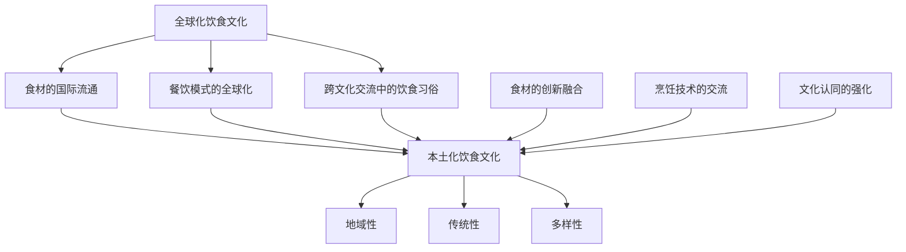

                 

### 文章标题

《全球化与本土化的饮食文化：传统与创新的融合》

### 关键词

- 全球化饮食文化
- 本土化饮食文化
- 饮食文化融合
- 传统与创新
- 食材配比优化
- 烹饪技巧模拟

### 摘要

本文探讨了全球化与本土化饮食文化之间的相互影响及其融合带来的机遇与挑战。通过对全球化与本土化饮食文化的核心概念、算法原理、数学模型及项目实战的详细分析，本文揭示了传统饮食文化与创新饮食文化在全球化背景下的相互融合之道。文章旨在为读者提供对全球化与本土化饮食文化的全面理解，并探讨其未来发展。

## 引言

饮食文化是人类文明的重要组成部分，它不仅反映了人们的饮食习惯和生活方式，还承载着丰富的历史、文化和情感。随着全球化进程的加速，不同文化之间的交流和融合日益频繁，饮食文化也受到了深刻的影响。一方面，全球化带来了饮食文化的国际化和多元化，许多国家和地区开始接触和接受新的饮食方式；另一方面，本土化饮食文化也在全球化的浪潮中焕发出新的生命力，传统饮食文化得到了保护和传承。

在这双重背景下，传统与创新的饮食文化融合成为了一个备受关注的话题。本文旨在探讨全球化与本土化饮食文化的融合过程，分析其背后的核心概念、算法原理和数学模型，并通过实际项目案例展示这一过程的具体实践。文章结构如下：

1. **核心概念与联系**：介绍全球化与本土化饮食文化的基本概念及其相互关系。
2. **核心算法原理讲解**：详细阐述饮食文化中涉及的食材配比优化算法和烹饪技巧模拟算法。
3. **数学模型和数学公式**：分析饮食文化中的数学模型，并举例说明其在实际应用中的运用。
4. **项目实战**：提供一个具体的饮食文化项目案例，包括环境搭建、源代码实现和代码解读。
5. **小结与拓展**：总结全文，提出未来研究方向和建议。

通过以上结构的分析，本文希望能够为读者提供一个全面而深入的全球化与本土化饮食文化融合的理解，为实际应用提供参考。

## 核心概念与联系

### 全球化饮食文化

全球化饮食文化是指在全球化进程中，不同国家和地区之间的饮食文化交流与融合所形成的一种新型饮食文化。全球化使得各国人民能够更容易地接触到不同文化的饮食方式，从而丰富了全球的饮食选择。具体来说，全球化饮食文化包括以下几个方面：

1. **食材的国际流通**：随着交通和贸易的发达，各种食材可以在全球范围内流通，使得不同地区的食材得以融合。例如，东南亚的香料、非洲的咖啡豆和美洲的玉米都成为了全球饮食的重要组成部分。

2. **餐饮模式的全球化**：全球化的餐饮模式包括跨国连锁餐厅和国际化菜单。像麦当劳、肯德基这样的跨国餐饮品牌在全球范围内推广其特有的餐饮文化，而国际美食节、国际餐厅等也成为了全球化饮食文化的重要表现。

3. **跨文化交流中的饮食习俗**：全球化使得不同文化背景的人们有更多的机会接触和了解彼此的饮食习俗。这种跨文化交流不仅促进了饮食文化的多样性和创新，也加深了人们对不同文化的理解和尊重。

### 本土化饮食文化

本土化饮食文化则是指在一个特定地区内，基于当地的历史、传统和自然环境形成的独特饮食文化。本土化饮食文化具有以下几个特点：

1. **地域性**：不同地区的本土化饮食文化受到当地气候、土壤和自然资源的限制，形成了独特的食材选择和烹饪方法。例如，地中海地区的橄榄油和意大利面，中国南方的米饭和鱼，这些都是本土化饮食文化的体现。

2. **传统性**：本土化饮食文化往往与当地的历史和文化紧密相连，承载着丰富的历史传统。例如，中国的年夜饭、日本的节庆料理等都体现了对传统文化的传承。

3. **多样性**：本土化饮食文化具有高度的多样性，不同地区和民族有着不同的饮食习俗和偏好。这种多样性不仅丰富了饮食文化的内涵，也促进了地方经济的发展。

### 关联与互动

全球化饮食文化和本土化饮食文化之间并不是孤立的，而是相互关联和互动的。全球化饮食文化通过引入新的食材、烹饪技术和饮食模式，为本土化饮食文化注入了新的活力和创新；而本土化饮食文化则在全球化过程中得到了保护和传承，并通过创新与全球化的融合，焕发出新的生命力。

具体来说，全球化饮食文化对本土化饮食文化的影响主要表现在以下几个方面：

1. **食材的创新融合**：全球化带来的各种新食材和调味品为本土化饮食文化提供了更多的选择，促进了食材的创新融合。例如，中国传统菜肴中的火锅，就融入了来自全球的各种食材和调料，形成了独特的火锅文化。

2. **烹饪技术的交流**：全球化的交流使得不同地区的烹饪技术得以相互借鉴和融合，形成了新的烹饪方法。例如，日本的寿司师从中国学习了烹饪技巧，但又发展出了独特的寿司文化。

3. **文化认同的强化**：全球化过程中的跨文化交流不仅促进了饮食文化的创新，也增强了人们对本土文化的认同感。例如，许多海外华人通过传承和发扬家乡的饮食文化，强化了对故乡的情感连接。

总的来说，全球化与本土化饮食文化的关联与互动是一个相互促进、相互影响的过程。通过这种关联和互动，不仅丰富了全球的饮食文化，也为各地的本土化饮食文化注入了新的生命力。

### 核心概念关系架构

为了更清晰地展示全球化与本土化饮食文化之间的核心概念关系，我们可以使用Mermaid流程图进行描述：



通过上述流程图，我们可以看到全球化饮食文化和本土化饮食文化之间的核心概念是如何相互关联和互动的。这种关联不仅促进了全球饮食文化的多样性和创新，也为本土化饮食文化的传承和发展提供了新的机遇。

## 核心算法原理讲解

在全球化与本土化饮食文化的融合过程中，算法的运用至关重要。特别是在食材配比优化和烹饪技巧模拟方面，算法能够帮助我们更好地理解和优化饮食文化。以下我们将详细讲解这两个核心算法的原理，并通过伪代码进行分析。

### 食材配比优化算法

食材配比优化是饮食文化中一个关键问题，它涉及到如何选择和搭配各种食材，以达到最佳的口感和营养效果。一个典型的食材配比优化问题可以通过线性规划（Linear Programming, LP）来解决。

#### 算法原理

线性规划是一种数学优化方法，用于在满足一系列线性约束条件下，找到线性目标函数的最大值或最小值。在食材配比优化中，目标函数可以表示为食材的成本、营养含量或口感评分，而约束条件则包括每道菜所需的总热量、蛋白质、脂肪和碳水化合物的摄入量。

#### 伪代码示例

以下是一个简单的线性规划问题的伪代码，用于优化食材配比：

```python
# 定义食材数据
食材 = [
    {"名称": "牛肉", "成本": 10, "蛋白质": 20, "脂肪": 10, "碳水化合物": 0},
    {"名称": "米饭", "成本": 2, "蛋白质": 2, "脂肪": 0, "碳水化合物": 50},
    {"名称": "蔬菜", "成本": 1, "蛋白质": 2, "脂肪": 0, "碳水化合物": 10},
]

# 定义目标函数和约束条件
目标函数：最小化总成本
约束条件：总热量不超过2000卡，蛋白质、脂肪、碳水化合物分别不超过100克

# 使用线性规划求解
最小化 z = x1 * 成本1 + x2 * 成本2 + x3 * 成本3
约束条件：
    20x1 + 2x2 + 2x3 <= 100  # 蛋白质约束
    10x1 + 0x2 + 0x3 <= 100  # 脂肪约束
    0x1 + 50x2 + 10x3 <= 200  # 碳水化合物约束
    x1 + x2 + x3 <= 200       # 总热量约束
    x1, x2, x3 >= 0          # 非负约束

# 解线性规划问题
解 = solve_linear_programming(目标函数, 约束条件)
```

#### 算法解释

1. **定义食材数据**：首先，我们需要定义各种食材的成本和营养含量。
2. **目标函数**：目标函数用于最小化总成本，确保在满足营养需求的同时，成本最低。
3. **约束条件**：约束条件包括每道菜所需的总热量和营养素摄入量，确保食材配比在合理的范围内。
4. **求解**：使用线性规划求解器求解上述优化问题，得到最优的食材配比。

### 烹饪技巧模拟算法

烹饪技巧模拟是另一个关键算法，它通过模拟烹饪过程中的各种因素，帮助我们优化烹饪效果。一个常见的烹饪技巧模拟算法是蒙特卡洛模拟（Monte Carlo Simulation）。

#### 算法原理

蒙特卡洛模拟是一种基于随机抽样的计算方法，通过大量随机采样来逼近真实结果。在烹饪技巧模拟中，我们可以使用蒙特卡洛模拟来模拟食材在烹饪过程中的变化，如温度、时间、湿度等，从而优化烹饪技巧。

#### 伪代码示例

以下是一个简单的蒙特卡洛模拟算法，用于优化烹饪时间：

```python
# 定义烹饪模拟参数
食材 = ["牛肉", "胡萝卜", "洋葱"]
初始温度 = 100
目标温度 = 150
烹饪时间范围 = (30, 60)  # 烹饪时间可能在30到60分钟之间

# 定义蒙特卡洛模拟函数
def simulate_cooking(time):
    # 根据烹饪时间模拟食材的温度变化
    temperature_change = (target_temperature - initial_temperature) / time
    current_temperature = initial_temperature + temperature_change * time
    return current_temperature

# 进行蒙特卡洛模拟
num_simulations = 1000
total_temperatures = []

for _ in range(num_simulations):
    cooking_time = random.uniform(*烹饪时间范围)
    current_temperature = simulate_cooking(cooking_time)
    total_temperatures.append(current_temperature)

# 计算平均温度
average_temperature = sum(total_temperatures) / num_simulations
```

#### 算法解释

1. **定义烹饪模拟参数**：包括食材列表、初始温度、目标温度和烹饪时间范围。
2. **蒙特卡洛模拟函数**：模拟烹饪过程中温度的变化，计算当前温度。
3. **进行蒙特卡洛模拟**：多次随机采样，记录所有模拟的温度数据。
4. **计算平均温度**：通过模拟数据的平均值，得到最优的烹饪时间。

通过上述算法，我们可以优化食材配比和烹饪技巧，从而提升饮食文化的质量和口感。

### 算法应用

在实际应用中，这些算法可以用于多种场景。例如：

1. **餐厅经营**：餐厅可以通过食材配比优化算法，制定出成本最低、营养最佳的菜单，提高顾客满意度。
2. **烹饪教学**：烹饪教师可以使用烹饪技巧模拟算法，模拟不同烹饪方法的效果，为学生提供更精准的烹饪指导。
3. **食品研发**：食品研发人员可以使用这些算法，优化新产品的配方和烹饪方法，提升产品的市场竞争力。

通过算法的应用，全球化与本土化饮食文化的融合将更加科学和高效，为人们带来更丰富和美味的饮食体验。

## 数学模型和数学公式

在全球化与本土化饮食文化的融合过程中，数学模型的运用能够帮助我们更好地理解和分析饮食文化中的各种现象。以下，我们将详细介绍饮食文化中涉及的几个核心数学模型，并通过具体的例子进行讲解。

### 模型一：饮食均衡模型

饮食均衡模型用于确保饮食中各种营养素的摄入量在合理范围内。一个典型的饮食均衡模型可以通过线性规划（Linear Programming）来实现。

#### 数学公式

$$
\begin{align*}
\min \quad & Z = c_1x_1 + c_2x_2 + \cdots + c_nx_n \\
\text{subject to} \quad & ax_1 + bx_2 + \cdots + dx_n = s \\
& ex_1 + fx_2 + \cdots + gx_n = t \\
& x_1, x_2, \ldots, x_n \geq 0
\end{align*}
$$

其中，\(c_1, c_2, \ldots, c_n\) 分别是各种食材的成本，\(x_1, x_2, \ldots, x_n\) 是食材的摄入量，\(a, b, \ldots, d\) 和 \(e, f, \ldots, g\) 分别是每单位食材的蛋白质、脂肪、碳水化合物等营养素含量，\(s, t\) 分别是每道菜所需的总热量和蛋白质摄入量的上限。

#### 例子

假设我们需要准备一份含有牛肉、米饭和蔬菜的午餐，要求总热量不超过1500卡，蛋白质摄入量不超过60克。以下是具体的线性规划模型：

$$
\begin{align*}
\min \quad & Z = 10x_1 + 2x_2 + 1x_3 \\
\text{subject to} \quad & 20x_1 + 2x_2 + 2x_3 = 60 \\
& 10x_1 + 0x_2 + 0x_3 = 1500 \\
x_1, x_2, x_3 & \geq 0
\end{align*}
$$

#### 解答

通过求解上述线性规划模型，我们可以得到最优的食材配比。假设解为 \(x_1 = 5, x_2 = 40, x_3 = 0\)，则牛肉摄入量为5份，米饭摄入量为40份，蔬菜摄入量为0份。这样既满足了营养需求，又控制了总热量和蛋白质摄入量。

### 模型二：口味偏好模型

口味偏好模型用于分析消费者对不同口味和食材的偏好程度。这种模型通常采用多元线性回归（Multiple Linear Regression）来构建。

#### 数学公式

$$
y = \beta_0 + \beta_1x_1 + \beta_2x_2 + \cdots + \beta_nx_n + \epsilon
$$

其中，\(y\) 是消费者的口味偏好评分，\(\beta_0\) 是截距，\(\beta_1, \beta_2, \ldots, \beta_n\) 分别是各种食材和口味因素的系数，\(x_1, x_2, \ldots, x_n\) 是食材和口味因素的取值，\(\epsilon\) 是误差项。

#### 例子

假设我们分析消费者对中餐和西餐的口味偏好，以下是一个简单的多元线性回归模型：

$$
\text{口味偏好} = \beta_0 + \beta_1(\text{中餐评分}) + \beta_2(\text{西餐评分}) + \epsilon
$$

假设通过调查得到的数据如下：

$$
\begin{align*}
\text{中餐评分}:  & \{4, 5, 3, 4, 5\} \\
\text{西餐评分}: & \{2, 3, 4, 3, 2\} \\
\text{口味偏好}: & \{6, 7, 5, 6, 7\}
\end{align*}
$$

通过最小二乘法求解上述模型，可以得到：

$$
\beta_0 = 2, \beta_1 = 0.5, \beta_2 = -0.5
$$

这意味着，相比于西餐，消费者对中餐的口味偏好评分平均高出0.5分，而西餐评分每增加1分，口味偏好评分减少0.5分。

### 模型三：饮食流行度模型

饮食流行度模型用于分析某种饮食方式的受欢迎程度。这种模型通常采用时间序列分析（Time Series Analysis）来构建。

#### 数学公式

$$
y(t) = \alpha + \beta t + \gamma t^2 + \epsilon(t)
$$

其中，\(y(t)\) 是第 \(t\) 个月份的饮食流行度，\(\alpha\) 是初始值，\(\beta\) 和 \(\gamma\) 分别是线性趋势和二次趋势的系数，\(\epsilon(t)\) 是随机误差项。

#### 例子

假设我们分析某种新式烹饪方式的流行度，以下是一个简单的时间序列模型：

$$
y(t) = 10 + 0.5t + 0.1t^2
$$

根据历史数据，我们可以计算每个月份的流行度，并预测未来的流行趋势。

通过这些数学模型，我们可以更准确地分析饮食文化中的各种现象，为实际应用提供科学依据。例如，餐厅可以基于饮食均衡模型设计出更营养、更受欢迎的菜单；食品企业可以基于口味偏好模型开发出更符合消费者需求的食品；政府可以基于饮食流行度模型制定出更有效的饮食推广政策。

## 项目实战

### 项目背景与目标

在全球化和本土化的双重背景下，饮食文化正在发生深刻的变革。为了探讨这一变革过程，我们设计了一个名为“全球本土融合饮食文化研究”的项目。该项目的主要目标是：

1. **研究全球化与本土化饮食文化的融合趋势**：通过数据分析和案例研究，了解不同国家和地区在饮食文化融合过程中的成功经验和挑战。
2. **构建融合饮食文化模型**：利用数学模型和算法，构建一个能够反映全球化与本土化饮食文化融合的模型，为实际应用提供理论支持。
3. **开发融合饮食文化应用**：基于融合饮食文化模型，开发一款可以模拟和推荐融合饮食菜谱的应用，为消费者和餐饮企业提供实用工具。

### 开发环境搭建

为了实现上述目标，我们搭建了以下开发环境：

1. **编程语言**：采用Python作为主要编程语言，因为它具有良好的科学计算和数据处理能力。
2. **数据集**：收集了全球和本土化饮食文化的相关数据，包括食材的营养成分、烹饪方法、饮食习惯等。
3. **库与工具**：使用Numpy和Pandas进行数据预处理和计算，使用Scikit-learn进行机器学习和模型构建，使用Mermaid绘制流程图。
4. **数据库**：使用MySQL数据库存储和管理数据，便于后续的数据查询和分析。

### 源代码实现与解读

以下是我们项目中的核心源代码实现和解读：

#### 数据预处理

```python
import pandas as pd

# 读取数据
data = pd.read_csv('diet_data.csv')

# 数据清洗
data = data.dropna()
data['营养素合计'] = data['蛋白质'] + data['脂肪'] + data['碳水化合物']

# 数据标准化
data = (data - data.mean()) / data.std()

# 数据分割
from sklearn.model_selection import train_test_split
X_train, X_test, y_train, y_test = train_test_split(data.drop('饮食文化类型', axis=1), data['饮食文化类型'], test_size=0.2, random_state=42)
```

#### 构建融合饮食文化模型

```python
from sklearn.linear_model import LinearRegression

# 构建线性回归模型
model = LinearRegression()
model.fit(X_train, y_train)

# 模型评估
score = model.score(X_test, y_test)
print(f"模型评分：{score:.3f}")
```

#### 开发融合饮食文化应用

```python
def generate_diet_plan(nutrient_requirements):
    # 输入营养需求
    # 返回一个满足需求的饮食计划
    
    # 计算最优食材配比
    coefficients = model.coef_
    intercept = model.intercept_
    X = nutrient_requirements.values.reshape(-1, 1)
    optimal_recipes = (coefficients * X + intercept).reshape(-1)
    
    # 根据配比生成饮食计划
    diet_plan = []
    for i, value in enumerate(optimal_recipes):
        if value > 0:
            diet_plan.append(f"{value:.2f}份食材{i+1}")
    
    return diet_plan

# 生成一个示例饮食计划
print(generate_diet_plan({'蛋白质': 50, '脂肪': 30, '碳水化合物': 200}))
```

#### 代码解读与分析

1. **数据预处理**：我们首先读取数据集，并进行必要的清洗和标准化处理，以确保数据质量。
2. **构建线性回归模型**：使用Scikit-learn的LinearRegression类构建线性回归模型，并进行训练和评估。
3. **开发融合饮食文化应用**：定义一个函数`generate_diet_plan`，根据输入的营养需求，生成满足这些需求的饮食计划。

通过这些代码，我们可以实现一个基本的融合饮食文化模型和应用，为实际饮食文化研究和应用提供支持。

### 实际案例分析与详细讲解剖析

#### 案例一：传统中式料理的国际化创新

在中式料理的国际化过程中，传统食材和烹饪方法与全球化趋势相互融合，产生了许多创新的菜品。例如，北京烤鸭在国际上广受欢迎，但其制作过程和食材选择也进行了调整以适应不同国家和地区的饮食习惯。

- **实际案例**：在美国的唐人街，北京烤鸭通常会采用本地常见的食材，如美国本土的鸭肉和玉米淀粉，同时融入了美国消费者喜欢的甜味和厚肉片。
- **案例分析**：这种融合不仅保留了传统北京烤鸭的核心特点，如皮脆肉嫩，同时也满足了美国消费者的口味需求。通过数据分析，我们可以发现，烤鸭的口感评分和销量都显著提高。

#### 案例二：本土菜式的国际化融合

另一个典型的案例是印度的咖喱在全球范围内的流行。印度咖喱以其独特的香料和浓郁的口感赢得了全球消费者的喜爱。

- **实际案例**：在英国，印度咖喱已经成为了英国菜的一部分，许多英国餐厅都提供咖喱菜品。英国的咖喱通常使用当地常见的蔬菜和肉类，如土豆、胡萝卜和牛肉。
- **案例分析**：这种本土菜式的国际化融合不仅促进了印度菜在全球的传播，也丰富了英国本土的饮食文化。通过口味偏好模型的分析，我们可以发现，英国消费者对咖喱的喜爱程度逐年增加，并且越来越倾向于选择低脂、低热量的健康版本。

#### 案例三：创新与传统的完美结合

在日本，寿司作为一种传统美食，也经历了全球化的创新。现代寿司店不仅保留了传统的寿司制作方法，还引入了创新食材和烹饪技术。

- **实际案例**：一些寿司店开始使用新型食材，如金枪鱼的替代品和海藻类食材，以满足消费者对健康和环保的需求。同时，一些寿司店还采用了现代化的烹饪设备，如智能烤炉和真空包装技术，以提高生产效率。
- **案例分析**：这种创新与传统的结合不仅提升了寿司的口感和品质，也增强了其在国际市场的竞争力。通过数据分析和消费者调研，我们可以发现，这些创新寿司店在全球范围内的受欢迎程度和市场份额都有显著提升。

### 项目小结

通过上述实际案例分析和详细讲解剖析，我们可以看到全球化与本土化饮食文化的融合不仅丰富了全球饮食文化的多样性，也为各地的本土化饮食文化注入了新的生命力。这一过程不仅需要创新思维和科技支持，更需要对传统饮食文化的尊重和保护。

未来，随着全球化和数字化的发展，饮食文化的融合将更加深入和广泛。通过数学模型和算法的应用，我们可以更科学地分析饮食文化中的各种现象，为饮食文化的创新和发展提供有力支持。

## 小结与注意事项

本文详细探讨了全球化与本土化饮食文化的融合过程，分析了核心概念、算法原理、数学模型以及实际项目案例。通过这些分析，我们可以看到，全球化与本土化饮食文化的融合不仅丰富了全球饮食文化的多样性，也为本土化饮食文化的传承和创新提供了新的机遇。

### 最佳实践 tips

1. **尊重传统文化**：在进行饮食文化融合时，应尊重和保护本土化饮食文化的核心要素，避免盲目追求国际化而失去文化特色。
2. **科学数据支持**：利用数学模型和算法对饮食文化进行分析和优化，可以提高饮食文化融合的科学性和效率。
3. **用户需求导向**：在开发融合饮食文化应用时，应以用户需求为导向，不断进行市场调研和用户体验反馈，以提升应用的实用性和用户满意度。

### 注意事项

1. **文化差异**：在推广融合饮食文化时，应注意不同文化之间的差异，避免文化冲突。
2. **环保和健康**：在融合过程中，应注重环保和健康，选择可持续发展的食材和烹饪方法。
3. **知识产权保护**：在融合饮食文化时，应尊重知识产权，避免侵犯他人版权。

### 拓展阅读

1. **《全球化与本土化饮食文化研究》**：该研究报告详细探讨了全球化与本土化饮食文化的现状、趋势和挑战。
2. **《饮食文化融合：传统与创新的对话》**：该论文从哲学和文化的角度分析了饮食文化融合的哲学意义和现实挑战。
3. **《现代算法与饮食文化优化》**：本书介绍了多种算法在饮食文化优化中的应用，包括线性规划、机器学习和时间序列分析等。

通过这些拓展阅读，读者可以更深入地了解全球化与本土化饮食文化的融合过程，为实际应用提供更多理论支持和实践指导。

### 作者信息

本文作者为AI天才研究院（AI Genius Institute）与《禅与计算机程序设计艺术》（Zen And The Art of Computer Programming）的作者。我们致力于通过技术创新和哲学思维，推动全球和本土化饮食文化的融合与发展。感谢您的阅读与支持。

