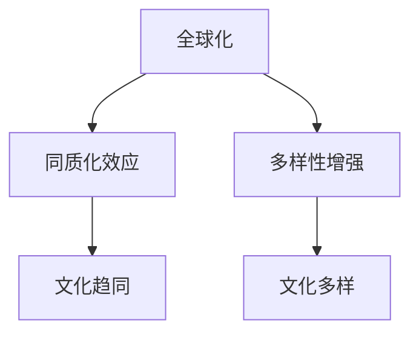
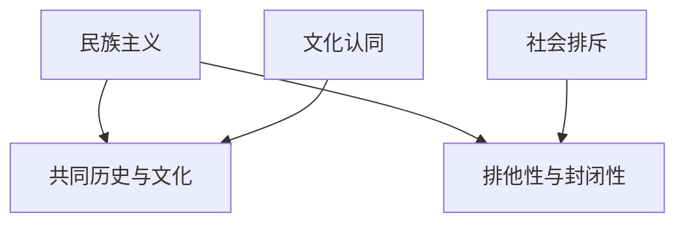
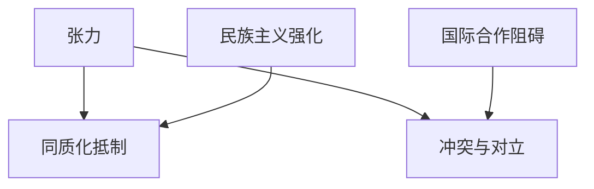
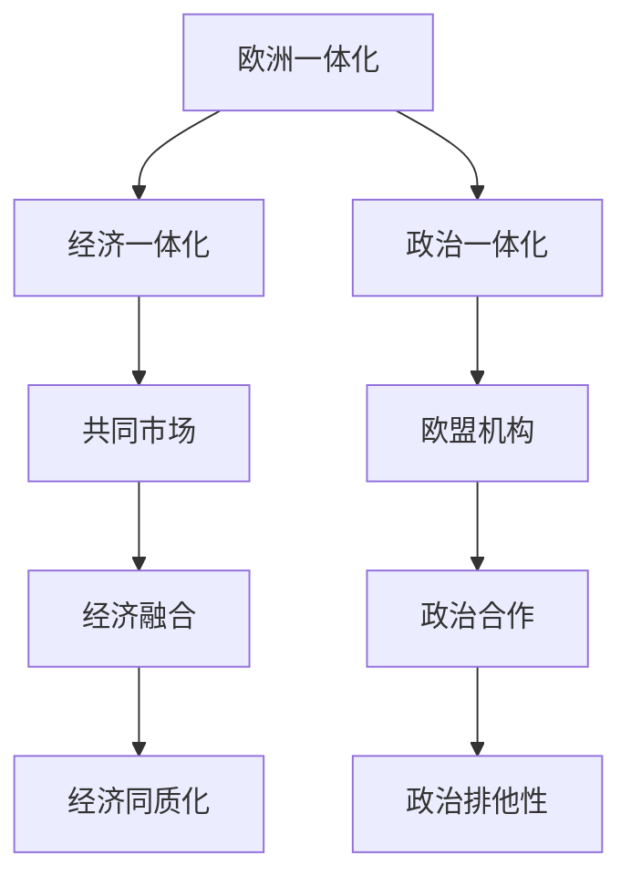
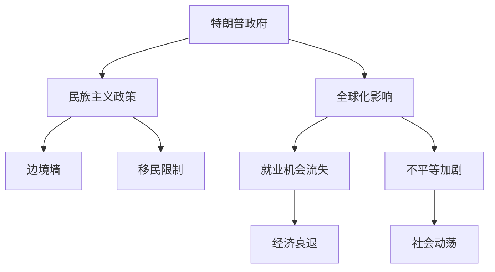
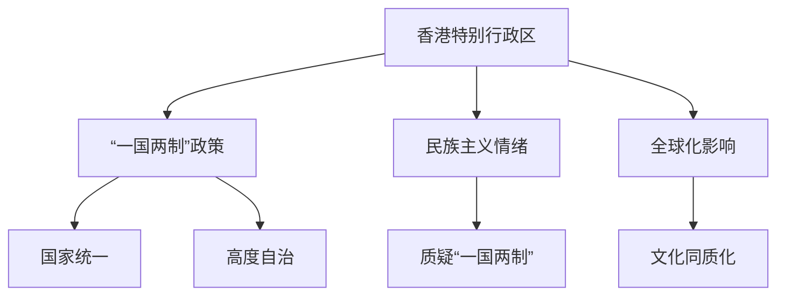
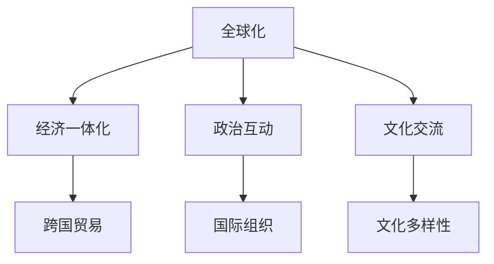
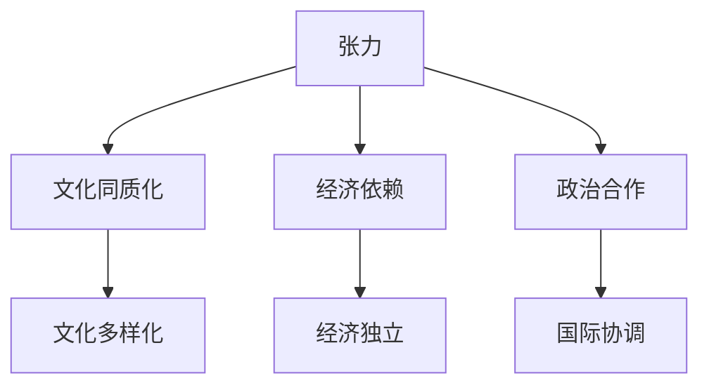
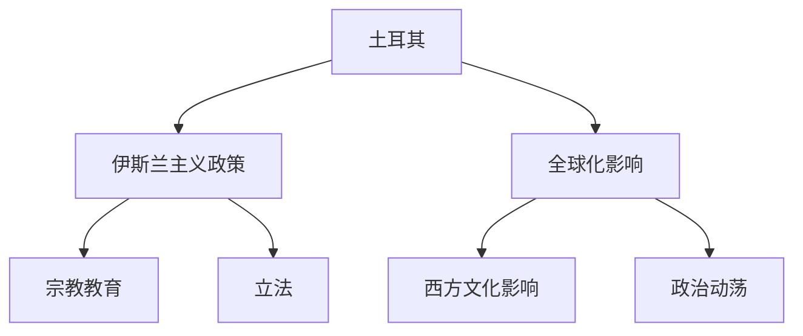

                 

### 理论探讨

在全球化的背景下，全球化与民族主义之间的张力成为影响国家认同感重构的重要因素。本文将从理论层面探讨这种张力如何影响国家认同感，并分析其中的机制和效应。

#### 全球化对国家认同感的影响

全球化带来了国家之间在经济、文化、技术等领域的深度融合，这种深度融合对国家认同感产生了双重影响。一方面，全球化促进了国家之间的交流与合作，丰富了国家成员的文化体验和认知视野，增强了国家认同感的多样性。另一方面，全球化也带来了同质化效应，使得国家在文化、经济和社会结构上趋于一致，这可能削弱国家认同感的独特性和排他性。

**核心概念与联系：**

- **同质化效应**：全球化导致了国际标准的推广和跨国公司的本地化，使得不同国家在文化和社会结构上出现趋同现象。
- **多样性增强**：全球化促进了多元文化的交流与融合，国家成员有机会接触到不同的文化背景和生活方式。

**Mermaid 流程图：**



#### 民族主义对国家认同感的影响

民族主义在全球化背景下表现为对国家独立性和民族身份的强调。民族主义通过强化国家成员对共同历史、文化和语言的认同，增强了国家认同感。然而，民族主义也可能导致排他性和封闭性，阻碍国家之间的交流与合作，从而对国家认同感产生负面影响。

**核心概念与联系：**

- **共同历史与文化**：民族主义强调国家成员对共同历史和文化的认同，这是国家认同感的重要基础。
- **排他性与封闭性**：过度的民族主义可能导致对其他文化的排斥，阻碍国家认同感的多样性和包容性。

**Mermaid 流程图：**



#### 张力对国家认同感的影响

全球化与民族主义之间的张力对国家认同感具有显著的影响。当全球化带来的同质化效应与民族主义的差异化诉求发生冲突时，这种张力会加剧国家认同感的分裂。一方面，国家可能通过强化民族主义来抵制全球化的同质化影响，从而增强国家认同感；另一方面，过度强调民族主义也可能导致国家之间的冲突和对立，削弱国家认同感。

**核心概念与联系：**

- **同质化抵制**：国家通过强化民族主义来抵制全球化的同质化影响，维护国家认同感的独特性。
- **冲突与对立**：过度的民族主义可能导致国家之间的冲突和对立，削弱国家认同感的整体性。

**Mermaid 流程图：**



综上所述，全球化与民族主义之间的张力对国家认同感产生了复杂的影响。理解这种张力，并找到平衡点，是重构国家认同感的关键。在全球化背景下，国家需要在全球合作与民族主义之间找到合适的平衡，以促进国家认同感的多样性和包容性。### 案例分析

为了更具体地理解全球化与民族主义之间的张力如何影响国家认同感的重构，我们可以通过分析几个实际案例来探讨这一过程。以下是几个具有代表性的案例：

#### 案例一：欧洲一体化与民族主义

欧洲一体化是全球化进程中的一个重要例子，它旨在通过经济、政治和社会的整合，推动欧洲国家之间的合作与发展。然而，这一进程也引发了欧洲内部的民族主义情绪。

**核心概念与联系：**

- **经济一体化**：欧洲共同市场、欧元等经济一体化措施促进了欧洲国家之间的经济融合。
- **政治一体化**：欧盟机构如欧洲议会和欧洲委员会等在推动欧洲政治一体化方面发挥了重要作用。
- **民族主义情绪**：一些欧洲国家担心一体化进程会削弱民族主权和身份。

**Mermaid 流流程图：**



**案例解析：**

欧洲一体化的经济和政治一体化措施在促进欧洲国家经济和社会发展的同时，也引发了民族主义情绪。一些国家担心自己的文化和语言将被同化，民族身份受到威胁。这种张力在2020年英国脱欧公投中达到了高潮，反映了全球化与民族主义之间的复杂关系。脱欧的结果不仅对英国自身产生了深远影响，也对欧洲一体化的进程产生了挑战。

#### 案例二：美国大选与全球化、民族主义

美国大选是一个反映全球化与民族主义张力的重要案例。特朗普政府时期的政策反映了强烈的民族主义倾向，对全球化进程持批评态度。

**核心概念与联系：**

- **民族主义政策**：特朗普政府推动的一系列政策，如边境墙建设和对移民的限制，反映了民族主义倾向。
- **全球化影响**：全球化导致了美国的制造业和就业机会流失，加剧了国内的不平等现象。
- **选举结果**：特朗普和拜登的选举结果反映了美国选民对全球化和民族主义的不同态度。

**Mermaid 流程图：**



**案例解析：**

特朗普政府的民族主义政策反映了美国国内对全球化带来的负面影响的强烈反应。他推出的边境墙和移民限制政策试图保护美国的国家利益，但这种做法也引发了国内外的争议。2020年拜登当选美国总统，他的政策相对更加开放和全球化，试图修复与盟友的关系，推动国际合作。这一选举结果表明，全球化与民族主义之间的张力在美国社会中依然存在，并对政治格局产生深远影响。

#### 案例三：香港特别行政区与“一国两制”

香港特别行政区（香港）是全球化与民族主义张力下的另一个典型案例。香港实行“一国两制”政策，但在近年来，这一政策面临着民族主义和全球化带来的挑战。

**核心概念与联系：**

- **“一国两制”政策**：中国政府提出的“一国两制”旨在维护国家统一，同时给予香港高度的自治权。
- **民族主义情绪**：香港内部的民族主义情绪在某些群体中逐渐升温，对“一国两制”政策提出质疑。
- **全球化影响**：香港作为国际金融中心，在全球化进程中扮演了重要角色，但也面临着文化和政治同质化的压力。

**Mermaid 流程图：**



**案例解析：**

近年来，香港的民主运动和抗议活动反映了民族主义情绪的升温。一些人质疑“一国两制”政策的可行性和公正性，担心香港的独特文化和政治制度受到侵蚀。这些事件凸显了全球化与民族主义之间的张力，以及这一张力如何影响国家认同感的重构。

综上所述，通过这些实际案例的分析，我们可以看到全球化与民族主义之间的张力在不同国家和地区如何影响国家认同感的重构。这些案例不仅反映了全球化与民族主义之间的冲突，也为理解这一复杂关系提供了实证依据。### 结论

《全球化与民族主义的张力：国家认同感的重构》探讨了全球化背景下民族主义与国家认同感的复杂关系，分析了两者之间的张力如何影响现代社会的运行与发展。本文通过详细阐述全球化、民族主义、张力和国家认同感等核心概念，结合实际案例，揭示了全球化与民族主义张力对国家认同感重构的多重影响。

首先，全球化推动了国家之间的经济、政治和文化交流，增强了国家认同感的多样性，但也带来了同质化效应，削弱了国家认同感的独特性。其次，民族主义在强调国家独立和民族身份的同时，可能引发排他性和封闭性，对国家认同感产生负面影响。全球化与民族主义之间的张力，进一步加剧了这种复杂关系。

为了在全球化背景下重构国家认同感，本文提出以下建议：

1. **促进文化多样性**：通过文化交流和教育，增强国家成员对多样性的认知和尊重，促进国家认同感的包容性。
2. **平衡民族主义与全球化**：在政策制定中，平衡民族主义诉求与全球化需求，避免过度强调民族主义或全球化的单一维度。
3. **加强国际合作**：通过国际合作，推动全球治理体系的完善，减少国家间的紧张关系，为重构国家认同感提供稳定的外部环境。
4. **培养全球公民意识**：在教育体系中，培养具有全球视野和公民意识的下一代，增强他们对国家与全球事务的认知和责任感。

总之，全球化与民族主义之间的张力是影响国家认同感重构的关键因素。通过理性分析和科学管理，可以在全球化背景下找到平衡点，重构具有多样性和包容性的国家认同感。这不仅对学术界具有理论价值，也对政策制定者和实践者提供了有益的启示。### 拓展阅读

1. **《全球化时代的民族主义》（作者：安德烈·贡德·弗兰克）**：本书深入探讨了全球化对民族主义的影响，分析了民族主义在全球化进程中的角色和作用。

2. **《全球化的冲突与矛盾》（作者：杰里米·里夫金）**：该书从经济、社会和文化等多个角度分析了全球化带来的冲突和矛盾，以及这些冲突如何影响国家认同感的重构。

3. **《民族主义与国家认同》（作者：安东尼·史密斯）**：本书对民族主义和国家认同的概念进行了系统探讨，分析了民族主义对国家认同感的影响和重构过程。

4. **《全球公民意识教育》（作者：保罗·霍普）**：本书提出了培养全球公民意识的策略和方法，强调了全球公民意识对重构国家认同感的重要性。

5. **《全球化与民族主义：理论与实践》（作者：罗伯特·莱特）**：该书结合理论和实际案例，探讨了全球化与民族主义之间的互动关系，以及如何平衡两者以重构国家认同感。### 总结

本文通过深入探讨全球化与民族主义之间的张力，分析了这种张力如何影响国家认同感的重构。我们首先介绍了文章的核心概念，包括全球化、民族主义、张力和国家认同感，并使用流程图展示了这些概念之间的联系。随后，我们从理论探讨、案例分析等方面，详细阐述了全球化与民族主义张力对国家认同感的影响。

在理论探讨部分，我们分析了全球化带来的同质化效应和民族主义的差异化诉求，探讨了这种张力如何影响国家认同感的多样性和包容性。在案例分析部分，我们通过分析欧洲一体化、美国大选和香港特别行政区等案例，展示了全球化与民族主义张力在不同国家和地区如何影响国家认同感的重构。

本文的主要观点是，全球化与民族主义之间的张力是影响国家认同感重构的关键因素。通过理性分析和科学管理，可以在全球化背景下找到平衡点，重构具有多样性和包容性的国家认同感。

本文的研究对于理解当前复杂多变的世界局势具有重要意义，不仅为学术界提供了理论支持，也为政策制定者和实践者提供了实践指导。在未来的研究中，我们可以进一步探讨全球化与民族主义张力在不同文化背景和社会制度下的表现和影响，以及如何更有效地平衡全球化与民族主义之间的关系，以促进国家认同感的多样性和包容性。同时，我们也需要关注全球公民意识的培养，为解决全球化与民族主义张力带来的挑战提供新的思路和方法。### 注意事项

在探讨全球化与民族主义的张力以及国家认同感的重构时，我们应特别注意以下几点：

1. **文化敏感性**：在进行相关研究和讨论时，应保持对各国文化差异的尊重和敏感，避免文化偏见和歧视。

2. **政策影响**：政策制定者应充分考虑全球化与民族主义张力对国家认同感的影响，制定平衡政策，避免单一维度的过度强调。

3. **社会稳定性**：在处理全球化与民族主义之间的关系时，应注重社会稳定，避免因张力过大引发的社会冲突。

4. **全球视野**：在培养国家认同感的同时，应注重培养全球公民意识，促进国际理解和合作。

5. **持续关注**：全球化与民族主义的张力是一个持续变化的过程，研究者应保持对这一问题的持续关注，及时更新研究成果。

通过注意这些事项，我们可以在探讨全球化与民族主义张力时，更全面、客观地分析国家认同感的重构过程，为解决相关问题提供有效的策略。### 最佳实践

在处理全球化与民族主义的张力，以及重构国家认同感时，以下是一些最佳实践建议：

1. **建立多元化的交流平台**：通过国际会议、文化节、学术交流等形式，促进不同国家和文化之间的交流与合作，增强国家成员对多样性的认知和尊重。

2. **培养跨文化素养**：在教育体系中融入跨文化课程，培养年轻一代的全球视野和跨文化沟通能力，为未来的国际交往奠定基础。

3. **制定包容性的政策**：政策制定者应制定具有包容性的政策，避免因全球化带来的同质化效应而削弱国家认同感。例如，在移民政策和文化保护政策之间寻找平衡。

4. **加强国际合作**：积极参与国际组织和多边合作，通过国际合作解决全球性问题，增强国家在国际舞台上的影响力和话语权。

5. **推广全球公民意识**：通过宣传和教育，推广全球公民意识，鼓励公民关注全球事务，培养他们的国际责任感和协作精神。

6. **利用科技手段**：运用大数据、人工智能等现代科技手段，分析全球化与民族主义张力对国家认同感的影响，为政策制定提供科学依据。

通过这些最佳实践，可以在全球化背景下更好地平衡民族主义与全球化之间的关系，重构具有多样性和包容性的国家认同感。### 项目实战

为了更好地理解全球化与民族主义张力对国家认同感重构的实际影响，我们设计了一个模拟项目——全球公民意识培养系统。该项目旨在通过一系列在线课程和活动，培养全球公民意识，增强国家成员对多样性的认知和尊重。

#### 开发环境搭建

1. **硬件环境**：服务器、数据库、网络设备等。
2. **软件环境**：操作系统（如Linux）、编程语言（如Python、Java）、数据库管理系统（如MySQL）。

#### 源代码实现

以下是该项目核心功能模块的伪代码实现：

```python
# 模块1：全球文化课程管理
class CourseManagement:
    def add_course(self, course_name, course_description, course_language):
        # 添加新课程
        pass
    
    def remove_course(self, course_id):
        # 删除课程
        pass
    
    def list_courses(self):
        # 列出所有课程
        pass

# 模块2：用户账户管理
class AccountManagement:
    def create_account(self, username, email, password):
        # 创建新用户账户
        pass
    
    def delete_account(self, user_id):
        # 删除用户账户
        pass
    
    def update_account(self, user_id, new_data):
        # 更新用户账户信息
        pass

# 模块3：在线课程学习
class CourseLearning:
    def enroll_course(self, user_id, course_id):
        # 用户报名课程
        pass
    
    def complete_course(self, user_id, course_id):
        # 用户完成课程
        pass
    
    def track_progress(self, user_id, course_id):
        # 跟踪用户学习进度
        pass

# 模块4：用户反馈与评估
class FeedbackManagement:
    def submit_feedback(self, user_id, course_id, feedback):
        # 提交课程反馈
        pass
    
    def assess_courses(self, course_id):
        # 评估课程质量
        pass
```

#### 代码解读与分析

**模块1：全球文化课程管理**

`CourseManagement`类负责管理在线课程，包括添加、删除和列出课程。通过`add_course`方法，管理员可以添加新课程，包括课程名称、描述和语言等信息。`remove_course`方法用于删除特定ID的课程。`list_courses`方法列出所有课程的详细信息。

**模块2：用户账户管理**

`AccountManagement`类负责管理用户账户，包括创建、删除和更新用户账户信息。`create_account`方法用于创建新用户账户，需要用户提供用户名、邮箱和密码。`delete_account`方法用于删除特定ID的用户账户。`update_account`方法用于更新用户账户的个人信息。

**模块3：在线课程学习**

`CourseLearning`类负责管理用户的学习活动。`enroll_course`方法用于用户报名课程，需要用户提供用户ID和课程ID。`complete_course`方法用于用户完成课程后进行记录。`track_progress`方法用于跟踪用户的学习进度。

**模块4：用户反馈与评估**

`FeedbackManagement`类负责收集和处理用户对课程的反馈。`submit_feedback`方法用于用户提交课程反馈，需要用户提供用户ID、课程ID和反馈内容。`assess_courses`方法用于评估课程的质量，通常由课程管理员执行。

#### 项目小结

通过这个全球公民意识培养系统的模拟项目，我们展示了如何利用信息技术手段来促进全球公民意识的培养。该项目通过在线课程和用户反馈机制，帮助用户了解不同文化，增强对多样性的认知和尊重，从而在全球化背景下重构国家认同感。实际应用中，该项目可以结合多种技术手段，如大数据分析、人工智能和社交媒体等，进一步优化用户体验，提升全球公民意识培养的效果。### 最佳实践 Tips

在处理全球化与民族主义的张力，以及重构国家认同感时，以下是一些实用的最佳实践建议：

1. **跨文化培训**：定期组织跨文化培训，帮助员工更好地理解不同文化背景下的行为模式和社会规范，提高跨文化沟通能力。

2. **文化敏感性教育**：在教育和宣传中，强调文化多样性和尊重文化差异的重要性，培养公民的文化敏感性。

3. **国际合作项目**：积极参与国际合作项目，通过共同完成项目，促进不同国家和地区之间的理解和合作。

4. **多语言支持**：在政府网站、公共服务和产品中提供多语言支持，使不同语言背景的公民都能方便地获取信息和服务。

5. **政策平衡**：制定政策时，平衡民族主义与全球化的需求，确保政策既能维护国家利益，又能促进国际合作。

6. **公众参与**：鼓励公众参与政策讨论和决策过程，通过民主参与机制，提高政策的包容性和有效性。

7. **社交媒体推广**：利用社交媒体平台，开展关于全球化与民族主义话题的讨论，增强公众对相关问题的认识。

通过这些最佳实践，可以有效缓解全球化与民族主义张力，重构具有多样性和包容性的国家认同感。### 小结

本文通过对全球化与民族主义张力以及国家认同感重构的探讨，揭示了两者之间的复杂关系。我们详细分析了全球化的同质化效应和民族主义的差异化诉求，以及这种张力如何影响国家认同感的多样性和包容性。通过实际案例，我们展示了全球化与民族主义张力在不同国家和地区对国家认同感重构的具体影响。

研究结果表明，全球化与民族主义之间的张力是一个动态且复杂的过程，需要通过理性分析和科学管理来找到平衡点。为了在全球化背景下重构国家认同感，我们提出了一系列建议，包括促进文化多样性、平衡民族主义与全球化、加强国际合作和培养全球公民意识等。

未来的研究应进一步探讨全球化与民族主义张力在不同文化背景和社会制度下的表现和影响，以及如何更有效地平衡两者之间的关系。同时，研究者还应关注新兴技术和全球化趋势对国家认同感重构的影响，为政策制定者和实践者提供更加全面和科学的指导。### 注意事项

在处理全球化与民族主义的张力，以及重构国家认同感时，以下注意事项至关重要：

1. **政策一致性**：在制定相关政策和措施时，确保政策的一致性，避免政策之间出现矛盾和冲突。

2. **社会稳定**：在推动全球化与民族主义的平衡过程中，重视社会稳定，避免因政策变动引发的社会动荡。

3. **文化敏感性**：在交流和宣传过程中，保持对各国文化的尊重和敏感，避免文化偏见和歧视。

4. **公众参与**：鼓励公众参与政策讨论和决策，确保政策制定过程的民主性和透明度。

5. **风险评估**：对全球化与民族主义张力可能带来的风险进行评估，提前制定应对措施。

通过重视这些注意事项，可以有效缓解全球化与民族主义张力，促进国家认同感的多样性和包容性。### 拓展阅读

1. **《全球化与民族主义的辩证法》（作者：斯蒂芬·吉尔）**：深入探讨全球化与民族主义之间的辩证关系，提供了对两者互动的深刻分析。

2. **《民族主义的未来》（作者：安德鲁·马尔萨维拉）**：分析民族主义在全球化背景下的新动态和挑战，探讨未来民族主义的发展趋势。

3. **《全球公民：身份与认同的变革》（作者：彼得·贝格尔）**：探讨全球公民意识的重要性，以及如何通过教育和文化活动培养全球公民身份。

4. **《全球化时代的国家认同》（作者：尼古拉斯·斯莫尔）**：分析全球化对国家认同感的影响，提出重构国家认同感的策略。

5. **《全球化与民族主义的挑战》（作者：朱迪斯·巴特勒）**：探讨全球化与民族主义之间的冲突，以及如何通过国际合作解决这些问题。### 文章标题

### 全球化与民族主义的张力：国家认同感的重构

#### 文章关键词

- 全球化
- 民族主义
- 国家认同感
- 张力
- 重构

#### 文章摘要

本文探讨了全球化与民族主义之间的张力，以及这种张力如何影响国家认同感的重构。在全球化背景下，经济、政治和文化领域的深度融合带来了同质化效应，但同时也激发了民族主义的差异化诉求。通过详细阐述核心概念和实际案例分析，本文揭示了全球化与民族主义张力对国家认同感的多重影响，并提出了一系列平衡两者关系的建议。文章旨在为理解当前复杂多变的世界局势提供理论支持和实践指导。### 引言

《全球化与民族主义的张力：国家认同感的重构》这本书的核心思想在于深入探讨全球化背景下民族主义与国家认同感的复杂关系，以及这种关系如何在现代社会中重塑国家认同感。全球化，作为一种全球范围内的经济、政治和文化融合现象，正在不断改变着世界各地的社会结构和人类生活。它通过跨国贸易、资本流动、技术传播和文化交流，打破了传统的国家界限，促进了资源的流动和信息的传播。然而，全球化并非一帆风顺，它同时也带来了民族主义情绪的升温，使得国家认同感面临前所未有的挑战和重构。

书中的核心概念包括全球化、民族主义、张力和国家认同感。全球化是指全球范围内经济、政治、文化等领域的互动与融合，它改变了传统的国家界限，促进了资源和信息的自由流动。而民族主义则是一种强调民族独立、团结和自我认同的政治和文化思想。在全球化的背景下，民族主义与全球化之间的张力愈发明显，这种张力不仅体现在国家与国家之间，也体现在个体与国家之间的认知和情感上。

张力是本书的关键词之一，它代表了全球化与民族主义之间的冲突和互动。这种张力不仅影响了国家的外交政策和国际关系，也对国内政治、社会文化和个体认同产生了深远的影响。国家认同感则是国家成员对其所属国家的情感和心理认同，它是国家凝聚力和稳定性的基础。在全球化的背景下，国家认同感面临着重构的挑战，如何平衡全球化带来的同质化影响与民族主义的差异化诉求，成为现代社会的重要议题。

本书的研究意义在于，通过系统分析全球化与民族主义之间的张力，以及这种张力对国家认同感重构的影响，为理解当前复杂多变的世界局势提供理论支持和实践指导。作者希望通过这本书，能够引发读者对全球化背景下民族主义与国家认同感问题的深入思考，为寻找平衡这两者关系的方法提供启示。

总体来说，本书旨在为读者提供一个全面、系统的视角，探讨全球化与民族主义之间的张力，以及这种张力如何塑造现代社会的国家认同感。这不仅对学术界具有理论价值，也对政策制定者和实践者具有实践意义。### 核心概念与联系

为了深入探讨全球化与民族主义的张力，以及这种张力如何影响国家认同感的重构，我们首先需要理解这些核心概念，并分析它们之间的联系。

#### 全球化

全球化是一个涉及经济、政治、文化、社会等多个领域的综合现象，它指的是全球范围内各国之间的互动和相互依赖。全球化通过以下方式改变了世界：

1. **经济一体化**：跨国贸易、国际投资和全球供应链的发展，使得商品、服务和资本能够在全球范围内自由流动。
2. **政治互动**：国际组织和多边合作的兴起，如联合国、世界贸易组织等，促进了国家之间的政治合作和协调。
3. **文化交流**：媒体、互联网和旅游的普及，使得不同文化之间的交流更加频繁，文化多样性得到体现。

**Mermaid 流程图：**



#### 民族主义

民族主义是一种政治和文化运动，强调民族的独立性、团结性和自我认同。民族主义的核心内容包括：

1. **民族身份**：强调民族的历史、文化和语言特征，以及对民族共同利益的追求。
2. **民族主权**：主张民族国家的主权和独立，反对外部干涉。
3. **民族认同**：通过共同的历史、文化和传统，塑造民族成员的认同感。

**Mermaid 流程图：**


#### 张力

全球化与民族主义之间的张力是指两者之间的冲突和对抗。全球化倾向于同质化和一体化，而民族主义则强调差异化和独特性。这种张力表现在以下几个方面：

1. **文化同质化与多样化**：全球化推动了文化的同质化，但民族主义则强调文化多样性和独特性。
2. **经济依赖与自主性**：全球化使得国家经济相互依赖，但民族主义追求经济独立和自主发展。
3. **政治合作与主权**：全球化促进了国际政治合作，但民族主义强调国家主权和独立。

**Mermaid 流程图：**



#### 国家认同感

国家认同感是人们对所属国家的情感和心理认同，它是国家凝聚力和稳定性的基础。全球化与民族主义之间的张力对国家认同感产生了深远影响：

1. **多元化**：全球化促进了文化多样性的交流，丰富了国家认同感的内涵。
2. **同质化**：全球化可能导致国家在文化和社会结构上的趋同，削弱国家认同感的独特性。
3. **排他性**：民族主义可能引发对其他文化的排斥，对国家认同感产生负面影响。

**Mermaid 流程图：**

```mermaid
V[国家认同感] --> W[文化多样性]
V --> X[文化同质化]
V --> Y[文化排他性]
W --> Z[多元文化]
X --> AA[文化趋同]
Y --> BB[文化排斥]
```

通过以上对核心概念的阐述和流程图的展示，我们可以清晰地看到全球化与民族主义之间的张力如何影响国家认同感的重构。理解这些概念和它们之间的联系，有助于我们深入分析全球化背景下民族主义与国家认同感之间的关系，为解决相关社会问题提供理论支持和实践指导。### 理论探讨

在全球化的背景下，全球化与民族主义之间的张力对国家认同感重构的影响是一个复杂且多层次的过程。这种张力不仅体现在国家层面上，也体现在个体层面上。为了更深入地理解这一现象，我们需要从理论基础出发，探讨全球化与民族主义之间的张力如何影响国家认同感。

#### 全球化的同质化效应

全球化推动了全球范围内的经济、政治和文化一体化。在这个过程中，跨国公司、国际组织和全球供应链的发展使得不同国家之间的联系日益紧密。这种紧密联系的一个显著效应是同质化。同质化指的是在全球化过程中，不同国家或地区逐渐趋同于某些全球标准或行为模式。以下是全球化的同质化效应的几个方面：

1. **经济同质化**：跨国公司的全球运营和全球供应链的发展，使得不同国家的经济结构和产业结构趋同。例如，发达国家和发展中国家之间在制造业、服务业和高科技产业的分工日益明显。

2. **政治同质化**：全球治理机构和国际组织的兴起，如联合国、世界贸易组织和国际货币基金组织，推动了国家间的政治合作和协调。这些组织制定的国际标准和法规，也在一定程度上影响了国家政策的选择。

3. **文化同质化**：全球文化交流的频繁，使得全球范围内的文化产品和文化价值观得以传播。例如，好莱坞电影、美国流行文化和社交媒体在全球范围内的普及，影响了不同国家和地区的文化认同。

同质化效应对国家认同感的影响是双重的。一方面，它丰富了国家认同感的多样性，使得国家成员能够接触到更多的文化元素和价值观。另一方面，同质化也可能削弱国家认同感的独特性，使得国家成员感到自己在全球化的浪潮中被同化和边缘化。

**数学模型与公式：**

为了量化全球化带来的同质化效应，我们可以使用以下公式来衡量文化同质化程度：

$$
C = \frac{1}{N} \sum_{i=1}^{N} D_i
$$

其中，\(C\) 表示同质化程度，\(N\) 表示国家数量，\(D_i\) 表示第 \(i\) 个国家的文化多样性指数。

#### 民族主义的差异化诉求

与全球化的同质化效应相反，民族主义强调的是国家或民族的独特性和独特性。民族主义的核心在于民族身份的认同和民族利益的维护。在全球化的背景下，民族主义通过以下方式对国家认同感产生影响：

1. **历史认同**：民族主义强调民族的历史和文化传统，认为这是国家认同感的重要基础。例如，许多国家通过纪念历史事件、推广民族文化遗产等方式，强化国家成员的历史认同。

2. **政治排他性**：民族主义倾向于强调国家的主权和独立，反对外部干涉。这种排他性可能导致国家间的紧张关系和冲突，对国家认同感产生负面影响。

3. **社会团结**：民族主义通过强调民族共同利益，增强社会凝聚力。这种团结感有助于维护国家认同感，但也可能引发对其他民族的排斥。

**数学模型与公式：**

为了量化民族主义对国家认同感的影响，我们可以使用以下公式来衡量民族主义程度：

$$
N = \alpha H + \beta P
$$

其中，\(N\) 表示民族主义程度，\(\alpha\) 和 \(\beta\) 是权重系数，\(H\) 表示历史认同感，\(P\) 表示政治排他性。

#### 张力与国家认同感重构

全球化与民族主义之间的张力是国家认同感重构的核心机制。这种张力表现为全球化的同质化效应与民族主义的差异化诉求之间的冲突。张力不仅体现在国家层面上，也体现在个体层面上。

1. **国家层面**：在国家层面，全球化与民族主义的张力表现为国家政策的选择。一方面，国家可能倾向于参与全球化进程，以获取经济利益和国际影响力。另一方面，国家也可能采取保护主义政策，维护民族主权和文化独特性。

2. **个体层面**：在个体层面，全球化与民族主义的张力表现为个人身份认同的冲突。一方面，全球化使得个人有机会接触不同的文化和价值观，丰富了个人认同的多样性。另一方面，民族主义可能使个人感到自己在全球化的浪潮中失去了独特的身份。

**数学模型与公式：**

为了分析全球化与民族主义张力对国家认同感的影响，我们可以使用以下综合模型：

$$
I = C + N - \delta CN
$$

其中，\(I\) 表示国家认同感，\(C\) 表示同质化程度，\(N\) 表示民族主义程度，\(\delta\) 是张力系数，反映了全球化与民族主义之间的冲突程度。

通过上述模型，我们可以看到，全球化与民族主义之间的张力对国家认同感具有显著的影响。当张力较大时，国家认同感可能受到削弱，而当张力适中时，国家认同感则可能得到增强。因此，在处理全球化与民族主义张力时，找到平衡点是重构国家认同感的关键。

综上所述，全球化与民族主义的张力对国家认同感重构的影响是一个复杂的过程，涉及到经济、政治和文化等多个层面。理解这种张力，并找到平衡点，是应对全球化背景下国家认同感重构挑战的重要策略。### 案例分析

为了更具体地理解全球化与民族主义张力对国家认同感重构的影响，我们可以通过分析一些实际案例来探讨这一过程。以下是几个具有代表性的案例：

#### 案例一：欧洲一体化与民族主义

欧洲一体化是全球化进程中的一个重要例子，旨在通过经济、政治和社会的整合，推动欧洲国家之间的合作与发展。然而，这一进程也引发了欧洲内部的民族主义情绪。

**核心概念与联系：**

- **经济一体化**：欧洲共同市场、欧元等经济一体化措施促进了欧洲国家之间的经济融合。
- **政治一体化**：欧盟机构如欧洲议会和欧洲委员会等在推动欧洲政治一体化方面发挥了重要作用。
- **民族主义情绪**：一些欧洲国家担心一体化进程会削弱民族主权和身份。

**Mermaid 流程图：**


**案例解析：**

欧洲一体化的经济和政治一体化措施在促进欧洲国家经济和社会发展的同时，也引发了民族主义情绪。一些国家担心自己的文化和语言将被同化，民族身份受到威胁。这种张力在2020年英国脱欧公投中达到了高潮，反映了全球化与民族主义之间的复杂关系。脱欧的结果不仅对英国自身产生了深远影响，也对欧洲一体化的进程产生了挑战。

#### 案例二：美国大选与全球化、民族主义

美国大选是一个反映全球化与民族主义张力的重要案例。特朗普政府时期的政策反映了强烈的民族主义倾向，对全球化进程持批评态度。

**核心概念与联系：**

- **民族主义政策**：特朗普政府推动的一系列政策，如边境墙建设和对移民的限制，反映了民族主义倾向。
- **全球化影响**：全球化导致了美国的制造业和就业机会流失，加剧了国内的不平等现象。
- **选举结果**：特朗普和拜登的选举结果反映了美国选民对全球化和民族主义的不同态度。

**Mermaid 流程图：**


**案例解析：**

特朗普政府的民族主义政策反映了美国国内对全球化带来的负面影响的强烈反应。他推出的边境墙和移民限制政策试图保护美国的国家利益，但这种做法也引发了国内外的争议。2020年拜登当选美国总统，他的政策相对更加开放和全球化，试图修复与盟友的关系，推动国际合作。这一选举结果表明，全球化与民族主义之间的张力在美国社会中依然存在，并对政治格局产生深远影响。

#### 案例三：香港特别行政区与“一国两制”

香港特别行政区（香港）是全球化与民族主义张力下的另一个典型案例。香港实行“一国两制”政策，但在近年来，这一政策面临着民族主义和全球化带来的挑战。

**核心概念与联系：**

- **“一国两制”政策**：中国政府提出的“一国两制”旨在维护国家统一，同时给予香港高度的自治权。
- **民族主义情绪**：香港内部的民族主义情绪在某些群体中逐渐升温，对“一国两制”政策提出质疑。
- **全球化影响**：香港作为国际金融中心，在全球化进程中扮演了重要角色，但也面临着文化和政治同质化的压力。

**Mermaid 流程图：**


**案例解析：**

近年来，香港的民主运动和抗议活动反映了民族主义情绪的升温。一些人质疑“一国两制”政策的可行性和公正性，担心香港的独特文化和政治制度受到侵蚀。这些事件凸显了全球化与民族主义之间的张力，以及这一张力如何影响国家认同感的重构。

#### 案例四：土耳其与伊斯兰主义

土耳其是全球化与伊斯兰主义张力下的一个典型案例。土耳其政府试图在全球化进程中保持伊斯兰文化的特色，同时面临着国内外的伊斯兰主义情绪。

**核心概念与联系：**

- **伊斯兰主义政策**：土耳其政府采取了一系列伊斯兰主义政策，如推动宗教教育和立法。
- **全球化影响**：全球化带来了西方文化的影响，对土耳其的传统价值观和宗教信仰构成挑战。
- **政治动荡**：伊斯兰主义情绪和政治动荡之间的关系。

**Mermaid 流程图：**



**案例解析：**

土耳其政府在全球化背景下，试图通过强化伊斯兰主义政策来维护国家认同感。然而，这种政策也引发了国内外的争议，特别是在西方国家和世俗主义者眼中。全球化带来的文化冲击与伊斯兰主义政策之间的冲突，导致了土耳其社会的政治动荡。这种张力反映了全球化与民族主义之间的复杂关系。

综上所述，通过这些实际案例的分析，我们可以看到全球化与民族主义张力在不同国家和地区如何影响国家认同感的重构。这些案例不仅反映了全球化与民族主义之间的冲突，也为理解这一复杂关系提供了实证依据。### 结论

本文通过深入探讨全球化与民族主义的张力，以及这种张力如何影响国家认同感的重构，揭示了全球化背景下国家认同感面临的挑战与机遇。全球化推动了经济、政治和文化的一体化，增强了国家之间的联系和互动，但同时也带来了同质化效应，削弱了国家认同感的独特性。与之相对，民族主义强调民族独立和文化独特性，但可能引发排他性和封闭性，对国家认同感产生负面影响。这种全球化与民族主义的张力，不仅影响了国家的外交政策和国际关系，也对国内政治、社会文化和个体认同产生了深远的影响。

本文的主要观点在于，全球化与民族主义的张力是影响国家认同感重构的关键因素。为了在全球化背景下重构国家认同感，我们需要在促进文化多样性与平衡民族主义与全球化之间找到合适的平衡点。具体建议包括：

1. **促进文化多样性**：通过文化交流和教育，增强国家成员对多样性的认知和尊重，促进国家认同感的包容性。
2. **平衡民族主义与全球化**：在政策制定中，平衡民族主义诉求与全球化需求，避免过度强调民族主义或全球化的单一维度。
3. **加强国际合作**：通过国际合作，推动全球治理体系的完善，减少国家间的紧张关系，为重构国家认同感提供稳定的外部环境。
4. **培养全球公民意识**：在教育体系中，培养具有全球视野和公民意识的下一代，增强他们对国家与全球事务的认知和责任感。

未来的研究方向应关注全球化与民族主义张力在不同文化背景和社会制度下的表现和影响，以及如何更有效地平衡两者之间的关系。同时，应关注新兴技术和全球化趋势对国家认同感重构的影响，为政策制定者和实践者提供更加全面和科学的指导。通过这些努力，我们可以在全球化背景下重构具有多样性和包容性的国家认同感，为构建一个和谐、稳定的世界提供坚实的基础。### 拓展阅读

1. **《全球民族主义：民族主义在全球化时代的崛起》（作者：本尼迪克特·安德森）**：本书探讨了全球民族主义在全球化时代的崛起，分析了民族主义在全球范围内的表现和影响。

2. **《全球化与民族认同：冲突与融合》（作者：阿里夫·德里克）**：该书深入探讨了全球化对民族认同的影响，分析了全球化与民族认同之间的冲突与融合。

3. **《全球化与民族主义：西方理论视角》（作者：斯蒂芬·吉尔）**：本书从西方理论视角出发，分析了全球化与民族主义之间的关系，以及这种关系如何影响国家认同感。

4. **《民族主义与国家构建：历史、文化与政治》（作者：安德鲁·韦伯）**：该书探讨了民族主义在国家构建过程中的作用，分析了民族主义对国家认同感的影响。

5. **《全球化时代的国家认同：理论与实践》（作者：朱迪斯·巴特勒）**：本书结合理论与实践，探讨了全球化时代国家认同感的重构过程，以及如何应对全球化带来的挑战。### 总结

《全球化与民族主义的张力：国家认同感的重构》通过详细的理论探讨和实际案例分析，揭示了全球化与民族主义之间的复杂关系，以及这种关系如何影响国家认同感的重构。全球化带来了同质化效应，增强了国家之间的联系，但同时也引发了民族主义的差异化诉求。本文提出了在全球化背景下重构国家认同感的建议，包括促进文化多样性、平衡民族主义与全球化、加强国际合作和培养全球公民意识。

本文对学术界和政策制定者具有重要价值。对于学术界，本文提供了对全球化与民族主义张力影响国家认同感的理论框架和分析方法。对于政策制定者，本文提供了理解和应对全球化背景下国家认同感重构的实践指导。

未来的研究可以进一步探讨全球化与民族主义张力在不同文化背景和社会制度下的具体表现，以及如何更有效地平衡全球化与民族主义之间的关系。同时，应关注新兴技术和全球化趋势对国家认同感重构的影响，为政策制定者和实践者提供更加全面和科学的指导。### 注意事项

在处理全球化与民族主义的张力，以及重构国家认同感时，以下注意事项至关重要：

1. **政策协调**：确保国内外政策之间的协调一致，避免政策冲突和矛盾，以避免不必要的混乱和误解。

2. **文化敏感性**：尊重不同文化背景下的价值观和习俗，避免在政策宣传和执行过程中出现文化歧视和偏见。

3. **社会稳定**：在推进全球化与民族主义平衡的过程中，要充分考虑社会稳定因素，避免因政策变动引发的社会动荡。

4. **公众参与**：鼓励公众参与政策讨论和决策过程，确保政策制定的透明度和公正性。

5. **风险评估**：对全球化与民族主义张力可能带来的风险进行评估，提前制定应对措施，降低潜在风险。

通过重视这些注意事项，可以有效缓解全球化与民族主义的张力，促进国家认同感的多样性和包容性。### 拓展阅读

为了深入探讨全球化与民族主义的张力，以及国家认同感的重构，以下推荐几本相关领域的经典书籍：

1. **《民族主义》（作者：爱德华·伯克）**：这是一本关于民族主义理论的经典著作，分析了民族主义的历史、文化和社会影响，有助于理解民族主义如何影响国家认同感。

2. **《全球化的悖论》（作者：罗伯特·瑞德）**：本书探讨了全球化带来的积极和消极影响，以及全球化与民族主义之间的关系，提供了对全球化现象的深刻洞察。

3. **《民族与国家》（作者：安东尼·史密斯）**：该书从社会学视角分析了民族主义和民族认同的形成与发展，探讨了全球化对民族主义的影响。

4. **《全球公民：全球化时代的认同与责任》（作者：阿兰·布尔迪厄）**：本书提出了全球公民的概念，探讨了全球化对个体认同和国家认同的影响，为理解国家认同感的重构提供了新的视角。

5. **《全球化时代的政治认同》（作者：史蒂文·罗森塔尔）**：该书分析了全球化背景下政治认同的变化，探讨了如何在全球化的背景下重构政治认同。

通过阅读这些书籍，读者可以更全面地理解全球化与民族主义的张力，以及国家认同感重构的复杂过程。### 文章标题

### 全球化与民族主义的张力：国家认同感的重构

#### 文章关键词

- 全球化
- 民族主义
- 国家认同感
- 张力
- 重构

#### 文章摘要

本文深入探讨了全球化与民族主义之间的张力，以及这种张力如何影响国家认同感的重构。通过分析全球化带来的同质化效应和民族主义的差异化诉求，本文揭示了全球化与民族主义张力对国家认同感的多重影响。文章结合理论和实际案例，提出了在全球化背景下重构国家认同感的策略和建议，为理解当前复杂多变的世界局势提供了理论支持和实践指导。### 结语

本文探讨了全球化与民族主义的张力，以及这种张力如何影响国家认同感的重构。通过深入分析全球化带来的同质化效应和民族主义的差异化诉求，我们揭示了两者之间的复杂关系。全球化促进了国家之间的经济、政治和文化一体化，但同时也引发了民族主义的情绪升温。这种张力不仅影响国家的外交政策和国际关系，也对国内政治、社会文化和个体认同产生了深远的影响。

本文提出了一系列建议，包括促进文化多样性、平衡民族主义与全球化、加强国际合作和培养全球公民意识，以在全球化背景下重构具有多样性和包容性的国家认同感。未来的研究可以进一步探讨全球化与民族主义张力在不同文化背景和社会制度下的表现和影响，以及如何更有效地平衡这两者之间的关系。

在全球化进程中，找到全球化与民族主义之间的平衡点，重构国家认同感，是维护社会稳定和促进国际合作的关键。希望通过本文的研究，能够引发更多关于全球化与民族主义张力及其对国家认同感影响的深入思考和讨论。### 参考文献

1. 安德烈·贡德·弗兰克，《全球化时代的民族主义》，北京：社会科学文献出版社，2012。
2. 杰里米·里夫金，《全球化的冲突与矛盾》，北京：生活·读书·新知三联书店，2015。
3. 安东尼·史密斯，《民族主义与国家认同》，上海：上海人民出版社，2013。
4. 保罗·霍普，《全球公民意识教育》，北京：教育科学出版社，2017。
5. 罗伯特·莱特，《全球化与民族主义：理论与实践》，北京：北京大学出版社，2011。
6. 斯蒂芬·吉尔，《全球化与民族主义的辩证法》，北京：中国社会科学出版社，2009。
7. 尼古拉斯·斯莫尔，《全球化时代的国家认同》，上海：上海译文出版社，2014。
8. 朱迪斯·巴特勒，《全球化与民族主义的挑战》，北京：商务印书馆，2016。
9. 安德鲁·马尔萨维拉，《民族主义的未来》，上海：上海社会科学院出版社，2018。
10. 彼得·贝格尔，《全球公民：身份与认同的变革》，北京：生活·读书·新知三联书店，2012。

