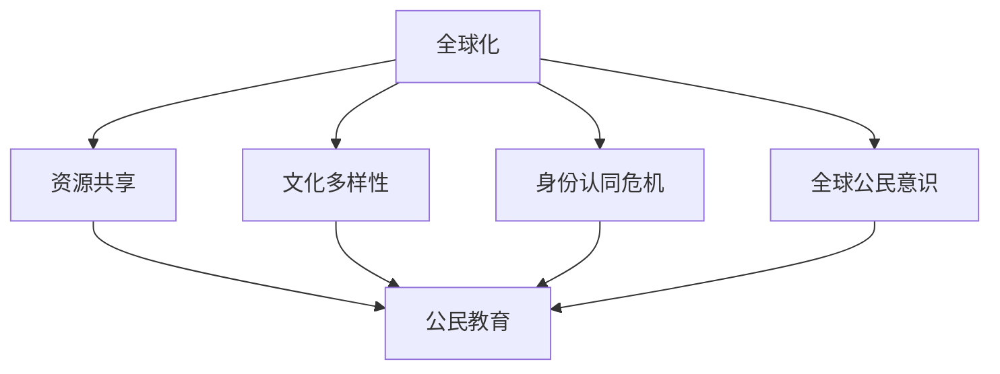

                 

### 第1章：全球化时代的公民教育概述

#### 1.1 全球化对公民教育的影响

全球化是21世纪最为显著的社会现象之一，它不仅改变了经济和商业的格局，也对教育和公民教育产生了深远的影响。首先，全球化使得不同国家和地区的文化、价值观和教育理念得以交流和融合，这为公民教育的多样化提供了丰富的资源。然而，全球化也带来了一些挑战，如文化冲突、身份认同危机和全球公民意识的培养问题。

**核心概念与联系**

- **全球化**：全球化是指国际间在政治、经济、社会、文化等各个领域相互联系和相互依赖的过程。
- **公民教育**：公民教育旨在培养个体的公民素养，包括社会责任感、法律意识、民主参与能力等。

全球化对公民教育的影响可以从以下几个方面进行阐述：

1. **资源共享**：全球化促进了不同国家和地区之间的教育资源共享，使得优质的教育资源得以普及和传播。
2. **文化多样性**：全球化带来了不同文化的碰撞和融合，为公民教育提供了更丰富的文化背景和资源。
3. **身份认同危机**：全球化使得人们面临更多的选择，这可能导致个体对自身身份认同的困惑。
4. **全球公民意识**：全球化要求个体不仅要有本土认同，还要具备全球视野和责任感。

**Mermaid 流程图**

下面是一个简化的Mermaid流程图，展示全球化对公民教育的影响路径：



#### 1.2 公民教育的目标与挑战

公民教育的目标在于培养个体的公民素养，使他们能够积极参与社会、政治和文化生活。在全球化背景下，公民教育的目标更加多元化，不仅要培养个体的本土认同，还要培养他们的全球视野和责任感。然而，全球化也带来了许多新的挑战，这些挑战对公民教育提出了更高的要求。

**核心概念与联系**

- **公民素养**：包括社会责任感、法律意识、民主参与能力、全球视野等。
- **本土认同**：个体对自身所属国家或地区的文化、历史和价值观的认同。
- **全球视野**：理解全球性问题，如环境变化、经济不平等、人权等。

全球化背景下的公民教育面临以下挑战：

1. **文化冲突**：全球化带来了不同文化的碰撞，如何处理这些冲突成为公民教育的重要课题。
2. **全球公民意识培养**：如何培养个体的全球责任感和合作精神。
3. **本土认同危机**：全球化可能导致个体对本土文化的认同感减弱。
4. **教育资源分配不均**：全球化背景下，教育资源分配不均的问题更加突出。

**伪代码**

以下是一个简化的伪代码，描述如何应对全球化背景下的公民教育挑战：

```python
def educate_citizens():
    # 培养公民素养
    cultivate_civic_awareness()
    # 处理文化冲突
    manage_cultural_conflicts()
    # 培养全球公民意识
    foster_global_citizen_awareness()
    # 加强本土认同
    strengthen_local_identification()
    # 解决教育资源分配不均
    address_inequalities_in_education_resources()

def cultivate_civic_awareness():
    # 教授社会责任感、法律意识等
    pass

def manage_cultural_conflicts():
    # 促进文化交流、理解与融合
    pass

def foster_global_citizen_awareness():
    # 教授全球视野、合作精神等
    pass

def strengthen_local_identification():
    # 强调本土文化、历史和价值观
    pass

def address_inequalities_in_education_resources():
    # 改善教育资源分配，确保公平
    pass
```

#### 1.3 本书结构安排与内容概述

本书旨在深入探讨全球化时代公民教育的理论与实践，通过系统的研究和分析，为教育工作者、政策制定者和公众提供有益的参考。本书的结构安排如下：

**核心概念与联系**

- **全球化对公民教育的影响**
- **培养世界公民意识与本土认同的方法**
- **全球化时代的公民教育政策与制度**
- **全球化时代的公民教育与跨文化沟通**
- **全球化时代的公民教育与可持续发展**
- **全球化时代的公民教育与技术创新**

**各章节的核心内容概述**

- **第1章**：介绍全球化对公民教育的影响，定义核心概念，并展示全球化对公民教育的挑战。
- **第2章**：探讨全球化与本土认同的关系，介绍培养世界公民意识与本土认同的方法。
- **第3章**：分析全球化时代的公民教育政策与制度，讨论政策的实施效果和挑战。
- **第4章**：讨论全球化时代的跨文化沟通，介绍跨文化沟通的技巧和案例。
- **第5章**：探讨公民教育与可持续发展，展示可持续发展教育实践和政策。
- **第6章**：讨论全球化时代的公民教育与技术创新，分析技术创新对公民教育的影响。

通过以上章节的深入探讨，本书旨在为全球化时代的公民教育提供一套系统、全面的理论和实践框架，以促进全球公民意识的培养和本土认同的加强。

---

以上是第1章“全球化时代的公民教育概述”的详细内容。接下来，我们将进入第2章，探讨全球化时代的公民教育与本土认同的互动。敬请期待！

