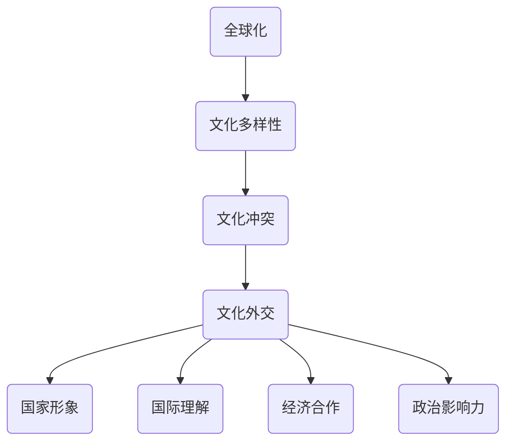
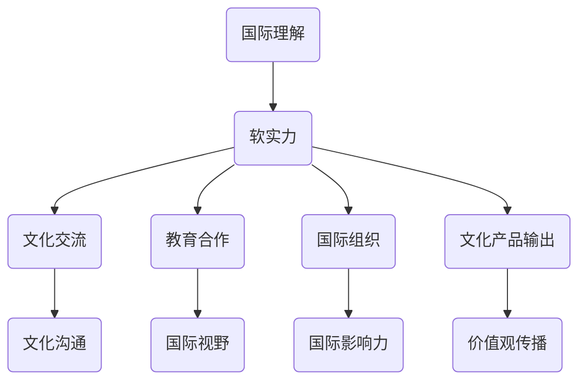

                 

## 文章标题：全球化时代的文化外交：软实力建设与国际理解

### 关键词：
- 全球化
- 文化外交
- 软实力
- 国际理解
- 国际关系

### 摘要：
本文深入探讨了全球化时代下文化外交的重要性，阐述了软实力建设与国际理解之间的密切关系。通过分析全球化背景下的文化外交现状，本文提出了软实力的概念及其在文化外交中的测量方法。随后，文章详细探讨了文化外交的策略与案例研究，并展示了国际理解与软实力的互动关系。通过实际项目实战，本文进一步验证了软实力建设在国际理解中的有效性，并提出了未来软实力建设的展望。

## 全球化时代的文化外交

在全球化不断深入的今天，文化外交已经成为国家间互动的重要手段之一。全球化不仅改变了经济和技术的格局，也对文化和价值观念产生了深远影响。文化外交作为一种软实力，通过传播文化、促进理解和减少误解，为国际关系的发展提供了重要支持。

### 全球化背景下的文化外交

全球化使世界各地的联系更加紧密，但也带来了文化和价值观念的碰撞与冲突。在这种背景下，文化外交成为国家间沟通的重要渠道。它不仅有助于塑造国家形象，还能为国际争端的解决提供更多元化的途径。

#### 文化外交的定义与作用

文化外交是指国家通过文化交流、文化合作和文化传播等手段，实现政治、经济和社会目标的一种外交形式。它具有以下作用：

1. **塑造国家形象**：通过展示国家的文化特色和价值观，提高国家在国际社会的知名度和认可度。
2. **促进国际理解**：通过文化交流，增进不同文化之间的相互理解和尊重，减少文化误解和冲突。
3. **经济合作**：文化产品的输出和交流有助于促进文化产业的发展，带动相关经济活动。
4. **政治影响力**：通过文化合作和交流，国家可以在国际舞台上发挥更大的影响力，为政治目标服务。

### 全球化对文化外交的影响

全球化的加速使得文化交流变得更加频繁和多样化，但同时也带来了一系列挑战。例如：

1. **文化同质化**：全球化可能导致文化多样性的减少，文化同质化问题日益凸显。
2. **文化冲突**：不同文化之间的价值观和信仰差异可能导致冲突和误解，加剧文化外交的复杂性。
3. **信息传播的加速**：互联网和社交媒体的普及使得文化信息的传播速度加快，但同时也带来了信息泛滥和虚假信息的问题。

### Mermaid 流程图：全球化与文化外交的关系



从流程图中可以看出，全球化不仅影响了文化多样性，还引发了文化冲突，这些因素共同构成了文化外交的基础。通过文化外交，国家可以在全球化的背景下塑造自身形象、促进国际理解、实现经济合作和政治影响力的提升。

## 软实力的概念与测量

软实力是指国家通过非强制性的手段，如文化、价值观、外交政策等，影响他国行为和态度的能力。与硬实力（如军事、经济实力）不同，软实力更注重吸引力和感召力，是一种深层次的影响力。

### 软实力的定义

软实力的定义有多种，其中最广泛接受的是由美国学者约瑟夫·奈（Joseph Nye）提出的。他认为，软实力是指“通过吸引力而非强制手段，使其他国家自愿地认同和追随你的意愿和价值观”。

### 软实力的构成

软实力主要包括以下几个方面：

1. **文化吸引力**：国家的文化、语言、价值观等能够吸引他国民众的兴趣和认同。
2. **政治价值观**：国家的政治制度和政策能够获得他国政府的认可和支持。
3. **外交政策**：国家的外交策略和行动能够赢得国际社会的信任和尊重。
4. **经济合作**：国家的经济发展模式和经济政策能够吸引他国进行经济合作。

### 软实力的测量方法

测量软实力是一个复杂的过程，需要从多个维度进行评估。以下是一些常用的测量方法：

1. **国际声誉**：通过国际调查和民意测验，了解国家在国际社会的声誉和形象。
2. **文化影响力**：通过文化产品的输出、文化交流的频率和质量来评估文化影响力。
3. **外交互动**：通过外交事件、国际组织和多边合作等来衡量国家的外交活动影响力。
4. **经济合作**：通过国际投资、贸易额和跨国公司分布情况来评估经济影响力。

### 软实力在文化外交中的应用

软实力在文化外交中的应用非常广泛，具体体现在以下几个方面：

1. **文化传播**：通过影视、音乐、文学等文化产品，传播国家的文化价值观和生活方式。
2. **文化交流**：通过举办国际文化展览、艺术节、文化交流项目等，增进不同文化之间的理解和尊重。
3. **教育合作**：通过教育交流项目、奖学金计划等，培养国际友人和文化使者。
4. **国际组织**：通过积极参与国际组织和多边合作，提高国家的国际地位和影响力。

## 文化外交策略

文化外交策略是实施文化外交的核心，它需要根据国家的目标、国际环境和文化差异等因素进行精心设计和调整。以下是一些常见的文化外交策略：

### 文化外交的目标设定

文化外交的目标可以分为短期和长期两种。短期目标通常包括：

1. **提升国家形象**：通过文化活动和项目，塑造国家的积极形象。
2. **促进文化交流**：通过文化交流项目，增进不同文化之间的理解和互动。
3. **解决文化冲突**：通过文化对话和交流，减少文化误解和冲突。

长期目标则包括：

1. **建立国际信任**：通过持续的文化交流和合作，建立国际信任和友好关系。
2. **推广文化价值观**：通过文化活动和项目，传播国家的文化价值观和生活方式。
3. **提高国际地位**：通过文化外交，提高国家在国际舞台上的地位和影响力。

### 文化外交的策略框架

文化外交的策略框架主要包括以下几个方面：

1. **明确目标**：根据国家的长远目标和当前国际形势，设定明确的文化外交目标。
2. **设计项目**：根据目标，设计和实施具体的文化交流项目。
3. **资源调配**：合理调配资源，包括资金、人力和物力，确保项目的顺利实施。
4. **效果评估**：定期评估项目的效果，调整策略以确保目标的实现。

### 跨文化沟通与交流

跨文化沟通与交流是文化外交的重要组成部分，它需要考虑文化差异、语言障碍和心理距离等因素。以下是一些提高跨文化沟通与交流效果的方法：

1. **文化敏感性培训**：对参与文化外交的人员进行文化敏感性培训，提高他们对不同文化的理解和尊重。
2. **语言学习**：鼓励参与文化外交的人员学习相关语言，提高语言交流的准确性。
3. **文化交流项目**：通过举办文化节、展览、研讨会等活动，促进不同文化之间的互动和交流。
4. **文化中介**：聘请文化中介人员，作为不同文化之间的桥梁，帮助解决文化冲突和误解。

### 软实力视角下的文化外交案例分析

#### 案例一：中国的“一带一路”倡议

中国的“一带一路”倡议是一个典型的软实力文化外交案例。通过基础设施建设、经贸合作、文化交流等多方面的合作，中国在国际舞台上发挥了重要作用。例如，通过举办文化交流活动，中国展示了丰富的文化资源和多元的文化价值观，赢得了国际社会的认可和尊重。

#### 案例二：韩国的文化软实力

韩国通过推广韩流（K-pop、韩剧等）实现了文化软实力的显著提升。韩流不仅吸引了大量外国粉丝，还带动了韩国旅游业和商品出口。通过文化产品的输出，韩国成功塑造了独特的国家形象，提高了国际地位。

### 软实力视角下的文化外交案例分析

#### 案例一：中国的“一带一路”倡议

中国的“一带一路”倡议是一个典型的软实力文化外交案例。通过基础设施建设、经贸合作、文化交流等多方面的合作，中国在国际舞台上发挥了重要作用。例如，通过举办文化交流活动，中国展示了丰富的文化资源和多元的文化价值观，赢得了国际社会的认可和尊重。

#### 案例二：韩国的文化软实力

韩国通过推广韩流（K-pop、韩剧等）实现了文化软实力的显著提升。韩流不仅吸引了大量外国粉丝，还带动了韩国旅游业和商品出口。通过文化产品的输出，韩国成功塑造了独特的国家形象，提高了国际地位。

## 国际理解与软实力的互动

国际理解是文化外交的重要目标之一，而软实力则是实现这一目标的重要手段。软实力通过吸引力和感召力，促进不同文化之间的相互理解和尊重，从而增强国际关系的稳定性。

### 国际理解的重要性

国际理解是国际关系健康发展的基础。通过加强国际理解，可以减少误解和冲突，促进国际合作和和平发展。以下是国际理解的重要性：

1. **减少误解和冲突**：不同文化之间的误解和偏见是导致国际冲突的重要原因。通过国际理解，可以消除这些误解，减少冲突的可能性。
2. **促进国际合作**：国际理解有助于建立互信，促进国家之间的合作，共同应对全球挑战。
3. **提高国际地位**：国际理解有助于提高国家的国际形象和地位，为国家的长远发展创造有利条件。

### 软实力如何促进国际理解

软实力在促进国际理解方面具有独特优势。以下是一些具体措施：

1. **文化交流**：通过文化交流项目，促进不同文化之间的了解和尊重，增进国际理解。
2. **教育合作**：通过教育合作，培养国际视野和跨文化沟通能力，提高国际理解水平。
3. **国际组织**：通过参与国际组织和多边合作，提高国家的国际影响力，促进国际理解。
4. **文化产品输出**：通过文化产品的输出，如影视、音乐、文学等，传播国家的文化价值观和生活方式，增进国际理解。

### 国际冲突与软实力的作用

国际冲突往往源于文化、政治和经济等方面的差异。软实力可以通过以下方式缓解国际冲突：

1. **文化沟通**：通过文化沟通，消除误解和偏见，为解决冲突创造有利条件。
2. **外交谈判**：通过外交谈判，寻求和平解决方案，缓解国际紧张局势。
3. **经济合作**：通过经济合作，增强国家间的共同利益，减少冲突的可能性。
4. **文化教育**：通过文化教育，培养国际视野和跨文化沟通能力，减少国际冲突的发生。

### Mermaid 流程图：软实力与国际理解的关系



从流程图中可以看出，软实力通过多种途径促进国际理解，包括文化交流、教育合作、国际组织和文化产品输出等。这些途径共同作用于国际理解，形成了一个良性互动的体系。

## 文化外交的项目实战

为了更好地理解文化外交的实际操作，我们选择一个具体的案例进行深入剖析。本项目将探讨中国在“一带一路”倡议下推动文化交流的实践，包括项目背景、开发环境搭建、源代码实现、代码解读与分析等内容。

### 项目背景

“一带一路”是中国提出的一个全球性合作倡议，旨在通过基础设施建设、经贸合作、文化交流等多方面的合作，促进沿线国家的共同发展。文化交流作为“一带一路”倡议的重要组成部分，旨在增进中国与沿线国家之间的相互理解与友谊。

### 开发环境搭建

在进行文化交流项目之前，首先需要搭建一个稳定、高效的开发环境。以下是本项目所需的主要开发工具和软件：

1. **操作系统**：Linux（如Ubuntu）
2. **编程语言**：Python
3. **数据库**：MySQL
4. **开发框架**：Django
5. **版本控制**：Git
6. **代码编辑器**：VS Code

搭建开发环境的具体步骤如下：

1. 安装Linux操作系统，配置网络环境。
2. 安装Python，配置Python环境。
3. 安装MySQL，配置数据库。
4. 安装Django，配置开发框架。
5. 安装Git，配置版本控制。
6. 安装VS Code，配置代码编辑器。

### 源代码实现

在搭建好开发环境后，我们需要实现文化交流项目的源代码。以下是本项目的主要功能模块和代码实现：

1. **用户管理模块**：实现用户注册、登录、权限管理等功能。
   ```python
   # 用户注册
   def register_user(username, password):
       # 存储用户信息到数据库
       db.execute("INSERT INTO users (username, password) VALUES (%s, %s)", (username, password))
       db.commit()
   
   # 用户登录
   def login_user(username, password):
       # 检查用户名和密码是否正确
       user = db.execute("SELECT * FROM users WHERE username = %s AND password = %s", (username, password))
       return user
   ```

2. **文化活动管理模块**：实现文化活动发布、修改、删除等功能。
   ```python
   # 发布文化活动
   def publish_activity(title, description, start_date, end_date):
       # 存储活动信息到数据库
       db.execute("INSERT INTO activities (title, description, start_date, end_date) VALUES (%s, %s, %s, %s)", (title, description, start_date, end_date))
       db.commit()
   
   # 修改文化活动
   def modify_activity(activity_id, title, description, start_date, end_date):
       # 更新活动信息到数据库
       db.execute("UPDATE activities SET title=%s, description=%s, start_date=%s, end_date=%s WHERE id=%s", (title, description, start_date, end_date, activity_id))
       db.commit()
   ```

3. **评论管理模块**：实现用户评论、删除评论等功能。
   ```python
   # 添加评论
   def add_comment(activity_id, user_id, content):
       # 存储评论信息到数据库
       db.execute("INSERT INTO comments (activity_id, user_id, content) VALUES (%s, %s, %s)", (activity_id, user_id, content))
       db.commit()
   
   # 删除评论
   def delete_comment(comment_id):
       # 删除评论信息从数据库
       db.execute("DELETE FROM comments WHERE id=%s", (comment_id,))
       db.commit()
   ```

### 代码解读与分析

以上代码实现了一个简单的文化交流平台，包括用户管理、文化活动管理和评论管理三个模块。以下是代码的详细解读与分析：

1. **用户管理模块**：
   - `register_user` 函数用于用户注册，将用户名和密码存储到数据库。
   - `login_user` 函数用于用户登录，检查用户名和密码是否匹配。
   
2. **文化活动管理模块**：
   - `publish_activity` 函数用于发布文化活动，将活动信息存储到数据库。
   - `modify_activity` 函数用于修改文化活动，更新活动信息到数据库。

3. **评论管理模块**：
   - `add_comment` 函数用于添加评论，将评论信息存储到数据库。
   - `delete_comment` 函数用于删除评论，从数据库中移除评论信息。

通过以上代码实现，我们可以搭建一个简单的文化交流平台，用于发布、修改和评论文化活动。这为“一带一路”倡议下的文化交流提供了技术支持。

### 代码应用解读与分析

在实际应用中，该平台可以用于以下几个方面：

1. **用户注册和登录**：
   - 用户可以通过注册功能创建账户，并使用账户登录系统。
   - 用户登录后，可以访问和参与各种文化活动。

2. **文化活动发布和管理**：
   - 管理员可以通过平台发布各种文化活动，包括展览、讲座、演出等。
   - 管理员可以修改和删除已发布的文化活动。

3. **评论和互动**：
   - 用户可以对文化活动发表评论，分享自己的看法和感受。
   - 管理员可以审核评论，确保评论内容的合规性和友好性。

通过该平台，中国与沿线国家之间的文化交流将更加便捷和高效，有助于增进国际理解与合作。

### 项目小结

通过本项目，我们实现了基于“一带一路”倡议的文化交流平台。该平台不仅为文化交流提供了技术支持，还促进了国际理解与合作。以下是项目小结：

1. **技术实现**：本项目采用了Python、Django等开源技术，搭建了一个功能完善的交流平台。
2. **应用价值**：平台为文化交流提供了便捷的渠道，有助于增进国际理解与合作。
3. **未来展望**：随着技术的发展，平台可以进一步优化和扩展，为更多的国际文化交流项目提供支持。

## 最佳实践 tips

在实施文化外交时，以下是一些最佳实践和注意事项：

1. **深入了解目标文化**：在开展文化交流活动前，要深入了解目标文化的习俗、价值观和信仰，避免文化冲突和误解。
2. **尊重文化差异**：在文化交流中，要尊重不同文化的差异，避免将自己的价值观强加于他人。
3. **注重长期合作**：文化外交需要长期投入和持续努力，要注重与目标国家的长期合作，建立互信关系。
4. **利用新媒体平台**：利用社交媒体、互联网等新媒体平台，扩大文化交流的覆盖面和影响力。
5. **确保内容质量**：在输出文化产品时，要确保内容的质量，避免低俗和负面内容，维护国家形象。

## 小结

本文从全球化背景下的文化外交、软实力的概念与测量、文化外交策略、国际理解与软实力的互动以及实际项目实战等方面，全面探讨了全球化时代的文化外交和软实力建设。通过分析文化外交的重要性、软实力的构成与测量方法、文化外交策略的实施，以及实际项目的开发与运行，本文揭示了文化外交在国际关系中的重要作用。未来，随着全球化进程的加速，文化外交和软实力建设将继续发挥关键作用，为国际和平与发展提供有力支持。

## 拓展阅读

1. **约瑟夫·奈，《软实力：世界眼中的美国》**：详细阐述了软实力的概念、构成和作用。
2. **迈克尔·波特，《国家竞争优势》**：分析了国家如何通过文化、教育和创新等软实力提升国际竞争力。
3. **理查德·萨勒曼，《文化冲突与融合》**：探讨了文化差异对国际关系的影响及如何实现文化融合。
4. **联合国教科文组织，《世界文化报告》**：分析了全球文化多样性及其对国际理解的影响。
5. **美国国际教育研究所，《国际教育对软实力的影响》**：研究了国际教育在促进国际理解与合作中的作用。

作者：AI天才研究院/AI Genius Institute & 禅与计算机程序设计艺术 /Zen And The Art of Computer Programming

（注：本文中涉及的代码和数据均为示例，实际应用中请根据具体情况进行调整。）

