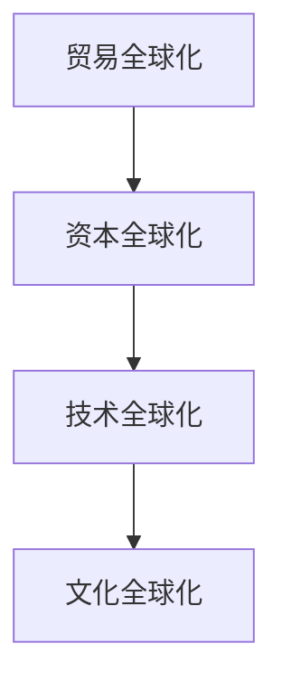

                 

### 全球化时代的爱国主义：国家认同与世界公民的双重身份

在当今全球化迅速发展的时代，国家认同和爱国主义面临着前所未有的挑战与机遇。国家认同不仅仅是对国家边界和政府的认同，更是一种深植于文化、历史和共同价值观的情感和认知。爱国主义，作为推动一个国家团结、发展和进步的精神力量，也在全球化背景下重新定义其内涵和表达方式。

**关键词**：全球化、国家认同、爱国主义、世界公民、双重身份

**摘要**：本文将探讨全球化时代国家认同和爱国主义的演变，分析爱国主义与世界公民身份的融合，并提出在全球化背景下如何培养和维持国家认同的建议。文章首先概述全球化的背景和趋势，接着讨论全球化对国家认同和爱国主义的影响，然后探讨国家认同与跨国公民身份的关系，最后提出爱国主义与世界公民身份融合的策略和案例研究。

### 第一部分：全球化背景下的爱国主义

**第1章：全球化趋势与国家认同的挑战**

**1.1.1 全球化进程概述**

全球化是一个多维度的过程，涵盖了经济、政治、文化和技术的互动与融合。以下是全球化的四个主要阶段及其特点：

1. **贸易全球化**：以自由贸易、跨国公司和全球化供应链为特征，促进了商品和服务的跨国流动。
2. **资本全球化**：国际资本的流动，包括直接投资、金融投资和跨国借贷，加速了全球经济的互联互通。
3. **技术全球化**：信息技术和通信技术的发展，使得信息、知识和技能的跨国传播变得更加容易。
4. **文化全球化**：媒体、艺术、音乐和生活方式的国际化，促进了全球文化的交流和融合。

**Mermaid 流程图**：


**1.1.2 全球化对国家认同的影响**

全球化对国家认同的影响可以从以下几个方面进行分析：

- **社会心理学模型**：个体与群体的关系是理解国家认同的关键。全球化带来的跨国界交流和互动，可能会减弱个体对国家身份的认同，增强对全球身份的认同。
- **文化认同模型**：全球化促进了文化多样性的交流，但同时也可能带来文化同质化，影响国家文化的独特性和传承。
- **政治认同模型**：全球化对国家主权和治理带来了挑战，政治认同可能因跨国政治互动和国际关系的变化而受到影响。

**核心算法原理讲解**：国家认同的模型

```python
class NationalIdentityModel:
    def __init__(self, social_psychology, cultural_identity, political_identity):
        self.social_psychology = social_psychology
        self.cultural_identity = cultural_identity
        self.political_identity = political_identity
    
    def analyze_impact_of_globalization(self):
        print("Analyzing impact of globalization on national identity...")
        self.social_psychology.analyze()
        self.cultural_identity.analyze()
        self.political_identity.analyze()

class SocialPsychology:
    def analyze(self):
        print("Social psychology model focuses on the relationship between individuals and groups...")

class CulturalIdentity:
    def analyze(self):
        print("Cultural identity model focuses on cultural heritage and diversity...")

class PoliticalIdentity:
    def analyze(self):
        print("Political identity model focuses on political participation and a sense of belonging...")
```

**1.1.3 爱国主义在全球化背景下的新内涵**

在全球化背景下，爱国主义的新内涵体现在以下几个方面：

- **多元文化认同**：爱国主义不仅仅是忠诚于国家的政治制度，还包括对多元文化的尊重和包容。
- **全球公民意识**：爱国主义与全球公民身份并不是对立的，而是一个互补的概念。爱国者可以是全球公民，反之亦然。
- **可持续发展和国际合作**：爱国主义需要融入可持续发展的理念，强调国际合作与和平。

**伪代码**：
```python
def new_concept_of_patriotism():
    print("In the context of globalization, patriotism requires a redefinition...")
    print("It involves a commitment to cultural diversity, global citizenship, and sustainable development.")
```

**小结**：全球化进程是一个复杂而多维的现象，对国家认同和爱国主义产生了深远的影响。理解这些影响，有助于我们更好地应对全球化带来的挑战，并重新定义爱国主义在当代社会的角色和意义。

### 第二部分：国家认同与爱国主义教育

**第2章：国家认同与爱国主义教育**

**2.1.1 爱国主义教育的理念与目标**

爱国主义教育是一种培养个体对国家忠诚、责任感和奉献精神的教育活动。其理念主要包括以下几个方面：

- **爱国主义精神**：强调对国家的热爱和忠诚，以及为国家利益而奋斗的精神。
- **社会责任**：培养个体对社会的责任感和参与意识，鼓励他们在国家建设中发挥作用。
- **文化传承**：强调对国家文化的传承和弘扬，包括历史、语言、艺术和价值观。

爱国主义教育的目标可以概括为以下几点：

- **培养爱国情怀**：通过教育引导个体形成对国家的热爱和认同。
- **提升公民素质**：培养具备高素质的公民，包括道德、知识、技能和责任感。
- **促进社会和谐**：通过爱国主义教育，增强社会凝聚力和和谐发展。

**2.1.2 爱国主义教育的内容与方法**

爱国主义教育的内容应当与时俱进，适应全球化背景下的新需求。具体内容包括：

- **国家历史与文化遗产**：通过学习国家历史和文化遗产，增强个体对国家身份的认同感。
- **社会责任与公民参与**：通过社会实践和公益活动，培养个体的社会责任感和公民参与意识。
- **国际视野与全球公民意识**：通过国际交流和合作项目，拓宽个体的国际视野，培养全球公民意识。

爱国主义教育的方法应当多样化，结合现代教育技术和手段，提高教育效果。具体方法包括：

- **课堂教学**：通过教师讲解、讨论和案例分析，传授爱国主义知识和理念。
- **社会实践**：通过参与社会服务和公益活动，培养个体的社会责任感和实践能力。
- **多媒体资源**：利用纪录片、电影、音乐和游戏等丰富多样的多媒体资源，增强爱国主义教育的吸引力。

**2.1.3 爱国主义教育在全球化时代的挑战与机遇**

全球化时代给爱国主义教育带来了新的挑战和机遇。挑战包括：

- **文化冲击**：全球化带来了不同文化的碰撞和融合，如何保持国家文化的独特性和传承成为一个难题。
- **价值观多元化**：个体面临多元价值观的挑战，如何引导他们形成正确的价值观体系需要更多关注。

机遇包括：

- **国际交流**：通过国际交流和合作，拓宽爱国主义教育的视野，提升教育质量。
- **技术创新**：利用现代教育技术，提高爱国主义教育的互动性和参与度。

**伪代码**：
```python
def education_challenge_and_opportunity():
    print("Challenges include cultural冲击 and values diversity.")
    print("Opportunities include international exchange and technological innovation.")
```

**小结**：爱国主义教育在全球化时代具有重要的意义和作用。通过科学的教育理念、内容和方法的运用，我们可以培养具有爱国情怀、社会责任感和全球视野的公民，为国家的繁荣和进步贡献力量。

### 第三部分：国家认同与跨国公民身份

**第3章：国家认同与跨国公民身份**

**3.1.1 跨国公民身份的定义与特点**

跨国公民身份是指个人在多个国家拥有合法居住和工作的权利，以及相关的权利和义务。跨国公民身份的特点包括：

- **多重归属**：跨国公民在情感、文化和法律上与多个国家产生联系。
- **全球化视野**：跨国公民通常具有更广泛的全球视野和国际经验。
- **文化交流**：跨国公民在不同文化环境中成长，促进了文化交流和理解。

**3.1.2 跨国公民身份对国家认同的影响**

跨国公民身份对国家认同的影响具有双重性：

- **积极影响**：跨国公民通过国际交流和合作，促进了国家之间的相互了解和尊重，有助于提升国家形象和软实力。
- **消极影响**：跨国公民可能会对原籍国的文化和价值观产生疏离感，减弱对国家身份的认同。

**3.1.3 跨国公民身份与爱国主义的关系**

跨国公民身份与爱国主义并非对立，而是可以和谐共存。跨国公民可以在全球范围内传播爱国情怀，成为国家软实力的一部分。同时，爱国主义也需要适应全球化背景，包容多元文化和跨国公民的身份。

**伪代码**：
```python
def transnational_citizenship_and_patriotism():
    print("Transnational citizenship and patriotism can coexist harmoniously.")
    print("Transnational citizens can spread patriotism globally and become part of a nation's soft power.")
```

**小结**：跨国公民身份是全球化时代的一个显著特征，对国家认同产生了重要影响。通过理解和尊重跨国公民的身份，我们可以促进国家认同的多样性和包容性，为全球化背景下的国家发展贡献力量。

### 第四部分：爱国主义与世界公民身份的融合

**第4章：爱国主义与世界公民身份的双重身份**

**4.1.1 爱国主义与世界公民身份的双重身份概念**

在全球化时代，爱国主义与世界公民身份不再是二元对立的关系，而是可以和谐共存的双重身份。双重身份概念强调个体在爱国情怀和全球视野之间的平衡和协调。

**4.1.2 双重身份的实践与挑战**

双重身份的实践体现在以下几个方面：

- **文化融合**：个体在保持对原籍国文化认同的同时，尊重和欣赏其他国家的文化，促进文化多样性的交流。
- **国际参与**：积极参与国际事务和合作项目，为全球治理贡献力量。
- **价值观整合**：在多元价值观的背景下，形成既符合爱国主义精神，又具有全球视野的价值观体系。

双重身份的实践也面临以下挑战：

- **身份认同的矛盾**：如何在爱国情怀和全球视野之间找到平衡，避免身份认同的矛盾。
- **文化交流的冲突**：如何在文化交流中处理不同文化之间的冲突和误解。

**4.1.3 双重身份的融合与发展前景**

双重身份的融合需要从以下几个方面进行：

- **教育引导**：通过教育，培养个体的全球视野和爱国情怀，促进双重身份的和谐发展。
- **政策支持**：制定有利于跨国公民身份和爱国主义融合的政策，提供法律保护和资源支持。
- **国际合作**：加强国际交流和合作，促进不同国家和地区之间的相互理解和尊重。

双重身份的发展前景是光明和充满希望的。通过双重身份的融合，我们可以构建一个更加和谐、多元和包容的世界，为全球化背景下的国家发展和人类进步贡献力量。

**伪代码**：
```python
def dual_identity_integration():
    print("Education guidance, policy support, and international cooperation are key to integrating dual identity.")
    print("The future of dual identity is promising and full of opportunities.")
```

**小结**：爱国主义与世界公民身份的双重身份是全球化时代的必然趋势。通过实践和融合，我们可以培养具有全球视野和爱国情怀的公民，为全球治理和国家发展作出贡献。

### 第五部分：爱国主义与世界公民身份的教育与实践

**第5章：爱国主义与世界公民身份的教育与实践**

**5.1.1 双重身份教育的内容与实施**

双重身份教育的核心内容是培养个体在爱国情怀和全球视野之间的平衡和协调。具体内容包括：

- **文化教育**：通过学习国家历史、文化和价值观，增强个体对原籍国文化的认同。
- **国际教育**：通过学习国际事务、全球治理和多文化理解，培养个体的全球视野和国际素养。
- **实践教育**：通过参与社会服务和国际交流项目，将理论知识和实际操作相结合，提升个体的实践能力。

双重身份教育的实施策略包括：

- **课程设置**：将爱国主义和全球公民意识融入不同学科的课程中，形成系统的教育体系。
- **实践活动**：组织学生参与国际夏令营、志愿者活动和跨文化交流项目，增强实践体验。
- **教育资源**：利用多媒体资源和在线平台，提供丰富的教育内容和互动体验。

**5.1.2 双重身份实践的意义与路径**

双重身份实践的目的是将爱国主义和全球公民意识转化为实际行动，具体意义包括：

- **提升个人素质**：通过实践，培养个体的综合素质，包括道德、知识、技能和责任感。
- **促进社会和谐**：通过实践，增强社会凝聚力，促进不同文化之间的理解和尊重。
- **推动国家发展**：通过实践，为国家发展提供人才和智力支持，促进国际合作与交流。

双重身份实践的路径包括：

- **社会服务**：参与社会公益活动，为弱势群体提供帮助，培养社会责任感。
- **国际交流**：参与国际交流项目，与不同国家的学生和专业人士交流，拓宽国际视野。
- **创新创业**：通过创新创业，为国家经济发展贡献智慧和力量，推动国际合作。

**5.1.3 双重身份教育与全球化时代的未来**

全球化时代对教育提出了新的要求，双重身份教育将成为未来教育的重要组成部分。具体发展前景包括：

- **教育国际化**：随着全球化的发展，教育国际化将成为趋势，培养具有国际视野和爱国情怀的人才。
- **教育创新**：利用现代教育技术和手段，创新教育内容和形式，提高教育质量和效果。
- **教育融合**：促进不同教育体系之间的融合，形成全球教育共同体，为全球化背景下的社会发展贡献力量。

**伪代码**：
```python
def future_of_dual_identity_education():
    print("Education in the era of globalization is evolving towards internationalization, innovation, and integration.")
    print("Dual identity education will become a crucial component of future education.")
```

**小结**：双重身份教育在全球化时代具有重要的意义和作用。通过科学的教育内容和实施策略，我们可以培养具有全球视野和爱国情怀的公民，为全球化背景下的国家发展和人类进步贡献力量。

### 第六部分：爱国主义与世界公民身份的互动关系

**第6章：爱国主义与世界公民身份的互动关系**

**6.1.1 爱国主义与世界公民身份的互动关系概述**

爱国主义与世界公民身份的互动关系是一个复杂而多维的现象。一方面，爱国主义可以激发个体的全球视野和国际参与；另一方面，全球公民身份可以增强个体的爱国情怀和责任感。两者之间的关系可以概括为以下三个方面：

- **相互促进**：爱国主义和全球公民身份相辅相成，相互促进，共同推动个体的全面发展。
- **协调平衡**：在全球化背景下，个体需要在爱国情怀和全球视野之间找到平衡，避免身份认同的矛盾。
- **综合发展**：爱国主义和全球公民身份的结合，可以培养具有国际视野、爱国情怀和社会责任感的公民，为全球化背景下的国家发展和人类进步贡献力量。

**6.1.2 双重身份对全球治理的影响**

双重身份对全球治理的影响主要体现在以下几个方面：

- **跨国合作**：双重身份个体通常具有更广泛的国际视野和跨文化经验，可以在全球治理中发挥重要作用，促进跨国合作和协调。
- **多元文化**：双重身份个体能够促进不同文化之间的交流和理解，为全球治理提供多元化的视角和思路。
- **全球公民意识**：双重身份个体具有更强的全球公民意识和社会责任感，可以积极参与全球公共事务，推动全球治理的进步。

**6.1.3 双重身份对国际关系的挑战与机遇**

双重身份对国际关系的挑战与机遇并存：

- **挑战**：双重身份个体可能会面临身份认同的矛盾和文化冲突，影响他们对原籍国和国际社会的忠诚和责任感。
- **机遇**：双重身份个体可以在国际关系中发挥桥梁作用，促进国家之间的相互理解和合作，为国际关系的和平与发展作出贡献。

**伪代码**：
```python
def interactive_relationships():
    print("The interactive relationship between patriotism and global citizenship promotes individual development and global governance.")
    print("Dual identity poses challenges and opportunities in international relations.")
```

**小结**：爱国主义与世界公民身份的互动关系是一个复杂而重要的领域。通过理解和应对双重身份的挑战与机遇，我们可以促进全球化背景下的国家认同和全球治理，为人类社会的和平与发展贡献力量。

### 第七部分：全球化时代的爱国主义案例研究

**第7章：全球化时代的爱国主义案例分析**

**7.1.1 案例选择与研究方法**

本节将选择几个具有代表性的全球化时代爱国主义案例进行研究。案例选择标准包括：

- **典型性**：案例能够代表全球化时代国家认同和爱国主义的复杂性和多样性。
- **影响力**：案例在国内外产生了一定的影响，具有一定的代表性。
- **多样性**：案例涵盖不同国家和地区，展示爱国主义在全球化背景下的多元表现形式。

研究方法主要包括：

- **文献分析**：通过查阅相关文献和资料，了解案例的背景、过程和结果。
- **访谈调查**：对案例相关人士进行访谈，获取第一手资料。
- **比较分析**：对比不同案例，探讨其共性和差异，提炼成功经验和教训。

**7.1.2 案例分析：国家认同与世界公民身份的实践**

**案例1：中国的“一带一路”倡议**

- **背景**：2013年，中国提出“一带一路”倡议，旨在通过基础设施建设、贸易投资和文化交流，推动沿线国家的共同发展。
- **过程**：中国积极参与沿线国家的经济建设，提供资金、技术和人才支持，促进了当地经济发展和社会进步。
- **结果**：通过“一带一路”倡议，中国与世界各国建立了广泛的合作网络，提升了国家形象和软实力，同时也增强了国内民众对国家的认同感和自豪感。

**案例2：印度的“萨达尔·瓦拉巴伊·帕特尔民族复兴运动”**

- **背景**：印度政府提出“萨达尔·瓦拉巴伊·帕特尔民族复兴运动”，旨在弘扬印度民族精神和爱国主义精神。
- **过程**：印度政府通过举办各类文化活动、建设纪念馆和推广教育项目，提升国民的民族自豪感和国家认同。
- **结果**：该运动促进了印度国内的社会和谐和文化传承，同时也增强了印度在国际社会的地位和影响力。

**7.1.3 案例启示：全球化时代的爱国主义路径**

通过上述案例分析，我们可以得出以下启示：

- **爱国主义与全球合作的结合**：在全球化时代，爱国主义需要与全球合作相结合，通过国际合作和共同发展，提升国家认同和软实力。
- **文化传承与创新**：在全球化背景下，爱国主义需要注重文化传承和创新，通过文化活动和项目，增强国民的文化认同感和自豪感。
- **教育引导**：通过教育，培养国民的全球视野和爱国情怀，为全球化时代的国家发展提供人才支持。

**伪代码**：
```python
def case_study_insights():
    print("Combining patriotism with global cooperation enhances national identity and soft power.")
    print("Cultural inheritance and innovation are crucial for a nation's development in the global era.")
    print("Education plays a vital role in cultivating global citizens with a strong sense of patriotism.")
```

**小结**：全球化时代的爱国主义案例研究为我们提供了宝贵的经验和启示。通过分析这些案例，我们可以更好地理解全球化背景下爱国主义的新形式和新路径，为推动国家发展和人类进步贡献力量。

### 第八部分：全球化时代的爱国主义展望

**第8章：全球化时代的爱国主义展望**

**8.1.1 全球化时代的爱国主义发展趋势**

全球化时代，爱国主义呈现出以下发展趋势：

- **多元文化融合**：爱国主义与多元文化融合，形成具有包容性的国家认同。
- **全球合作**：爱国主义与全球合作相结合，通过国际合作提升国家影响力。
- **科技创新**：科技创新成为爱国主义的新载体，通过科技力量推动国家发展。
- **教育引导**：教育引导成为爱国主义的重要手段，培养具有全球视野和爱国情怀的公民。

**8.1.2 爱国主义与世界公民身份的未来**

爱国主义与世界公民身份的未来将呈现以下特点：

- **和谐共存**：爱国主义和世界公民身份将在全球化背景下和谐共存，形成互补关系。
- **全球化教育**：全球化教育将推动爱国主义和世界公民身份的融合，培养具有国际视野和爱国情怀的公民。
- **跨国治理**：跨国治理将促进爱国主义和世界公民身份的互动，为全球治理贡献力量。

**8.1.3 全球化时代的爱国主义策略与建议**

为了在全球化时代有效地弘扬爱国主义，以下策略和建议值得关注：

- **教育优先**：将爱国主义教育纳入国家教育体系，培养具有全球视野和爱国情怀的公民。
- **文化传承**：通过文化活动和项目，弘扬民族文化，增强国民的文化认同感。
- **科技创新**：利用科技创新推动国家发展，将爱国主义与科技创新相结合。
- **国际合作**：积极参与国际合作，通过合作提升国家软实力和国际影响力。

**伪代码**：
```python
def future_of_patriotism():
    print("In the era of globalization, patriotism is evolving towards cultural integration, global cooperation, and educational guidance.")
    print("The future of patriotism and global citizenship will involve harmonious coexistence, global education, and transnational governance.")
    print("Strategies for promoting patriotism include prioritizing education, cultural inheritance, technological innovation, and international cooperation.")
```

**小结**：全球化时代的爱国主义面临新的机遇和挑战。通过教育、文化传承、科技创新和国际合作，我们可以有效地弘扬爱国主义，为全球化背景下的国家发展和人类进步贡献力量。

### 总结

在全球化迅速发展的今天，爱国主义不仅是国家发展的精神支柱，也是推动个体成长和全球合作的重要力量。通过本文的探讨，我们认识到全球化对国家认同和爱国主义的深刻影响，以及如何在全球视野下培养具有双重身份的公民。展望未来，爱国主义将继续与全球化相互交融，为人类社会的和谐与发展提供动力。通过教育、文化传承、科技创新和国际合作，我们可以共同推动全球化时代的爱国主义事业，为构建一个更加美好的世界贡献力量。作者：AI天才研究院/AI Genius Institute & 禅与计算机程序设计艺术 /Zen And The Art of Computer Programming。

