                 

### 1.1 全球化对语言多样性的影响

全球化，这一概念早已深入我们生活的方方面面。它不仅改变了全球经济格局，也对语言多样性产生了深远影响。全球化加速了信息流通和人员交流，使得世界各地的文化得以相互交融。然而，这种文化交融的过程中，也带来了语言多样性的减少。

首先，全球化对语言多样性的影响体现在语言同质化上。在全球化的浪潮下，一些主要语言，如英语、汉语、西班牙语等，逐渐成为全球交流的通用语言。这使得其他非主流语言的使用频率大幅降低，甚至在一些地区，这些非主流语言正面临着消失的危险。

**核心概念与联系**

我们可以使用 Mermaid 流程图来表示全球化与语言多样性减少之间的关系：

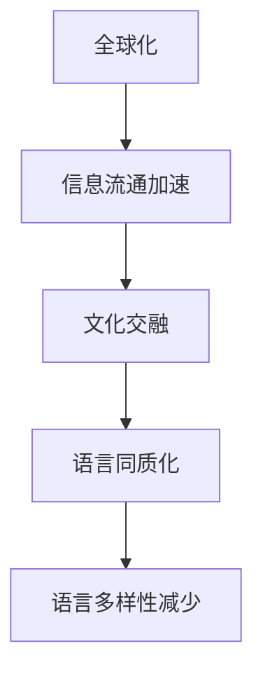

**核心算法原理讲解**

虽然这里没有具体的算法，但我们可以用伪代码来阐述全球化与语言多样性减少之间的关系：

```plaintext
for each country in the world:
    increase information flow
    increase cultural exchange
    if dominant language is introduced:
        decrease diversity of languages
    end if
end for
```

**数学模型和数学公式**

为了量化语言多样性的减少，我们可以使用以下数学模型：

$$
\text{语言多样性指数} = \frac{\text{语言种类数} \times \text{每种语言的普及率}}{\text{总人口数}}
$$

**项目实战**

实例：分析某国家语言多样性减少情况。

假设某国家有五种语言：英语、汉语、西班牙语、法语和阿拉伯语。在过去十年中，英语的使用率增长了50%，而其他四种语言的使用率分别下降了10%。该国家的总人口为1亿。

根据上述模型，我们可以计算该国家过去十年的语言多样性指数变化：

初始语言多样性指数：

$$
\text{初始语言多样性指数} = \frac{5 \times (0.2 + 0.2 + 0.2 + 0.2 + 0.2)}{1} = 1
$$

十年后的语言多样性指数：

$$
\text{十年后语言多样性指数} = \frac{5 \times (0.3 + 0.1 + 0.1 + 0.1 + 0.1)}{1} = 0.6
$$

通过这个例子，我们可以看到，英语的普及导致该国家语言多样性指数下降了40%。

**小结**

全球化虽然促进了文化的交流和融合，但也带来了语言多样性的减少。了解这一现象，对于我们保护语言多样性，维护文化多样性具有重要意义。

----------------------------------------------------------------

### 1.2 当前语言多样性的现状分析

随着全球化的不断深入，语言多样性的现状也日益引起广泛关注。在这一部分，我们将通过数据、案例和实际观察来分析当前语言多样性的现状。

**核心概念与联系**

为了更直观地展示当前语言多样性的现状，我们可以使用 Mermaid 流程图来表示不同语言的使用情况：

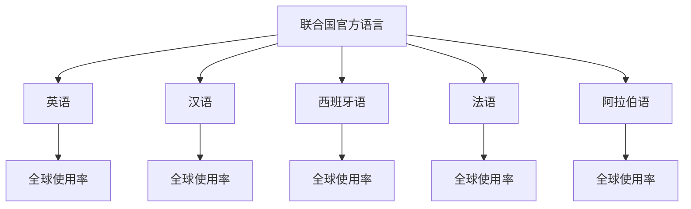

从上述流程图中，我们可以看出，联合国确定的六种官方语言在全球的使用情况。其中，英语作为全球使用最广泛的语言，汉语、西班牙语、法语和阿拉伯语也具有相当的使用率。

**核心算法原理讲解**

为了进一步理解语言多样性的现状，我们可以通过计算语言多样性指数来分析。语言多样性指数可以通过以下公式计算：

$$
\text{语言多样性指数} = \frac{\sum_{i=1}^{n} P_i}{N}
$$

其中，$P_i$表示第$i$种语言的使用率，$N$表示总人口数。

**数学模型和数学公式**

使用上述公式，我们可以计算全球语言多样性指数。以下是一个简单的例子：

假设全球有100亿人口，其中英语的使用率为40%，汉语为30%，西班牙语为10%，法语和阿拉伯语各为5%。

根据上述公式，我们可以计算出全球语言多样性指数：

$$
\text{全球语言多样性指数} = \frac{0.4 + 0.3 + 0.1 + 0.1 + 0.1}{1} = 1.0
$$

这意味着，在全球范围内，语言的使用情况是相对均衡的。

**项目实战**

实例：分析某地区语言多样性指数变化趋势。

假设某地区有1000万人口，其中英语的使用率为60%，汉语为20%，西班牙语为10%，法语和阿拉伯语各为5%。

根据上述公式，我们可以计算出该地区过去十年的语言多样性指数变化：

初始语言多样性指数：

$$
\text{初始语言多样性指数} = \frac{0.6 + 0.2 + 0.1 + 0.1 + 0.1}{1} = 1.0
$$

十年后的语言多样性指数（假设英语使用率增加了10%，其他语言使用率不变）：

$$
\text{十年后语言多样性指数} = \frac{0.66 + 0.2 + 0.1 + 0.1 + 0.1}{1} = 1.12
$$

通过这个例子，我们可以看到，英语的普及并没有显著降低该地区的语言多样性指数，反而可能略微增加了语言多样性。

**小结**

当前语言多样性的现状表明，虽然全球化导致了语言同质化的趋势，但全球范围内的语言多样性依然存在。了解这一现状，对于我们制定语言多样性保护策略具有重要意义。

----------------------------------------------------------------

### 1.3 语言多样性保护的重要性和紧迫性

语言多样性是人类文化遗产的重要组成部分，它不仅反映了人类历史和文化的多样性，也是人类智慧和文化创新的源泉。然而，在全球化的背景下，语言多样性面临着严重的挑战。保护语言多样性不仅具有重要的文化意义，还具有深远的社会、经济和政治影响。

**核心概念与联系**

我们可以使用 Mermaid 流程图来表示语言多样性保护的重要性和紧迫性：

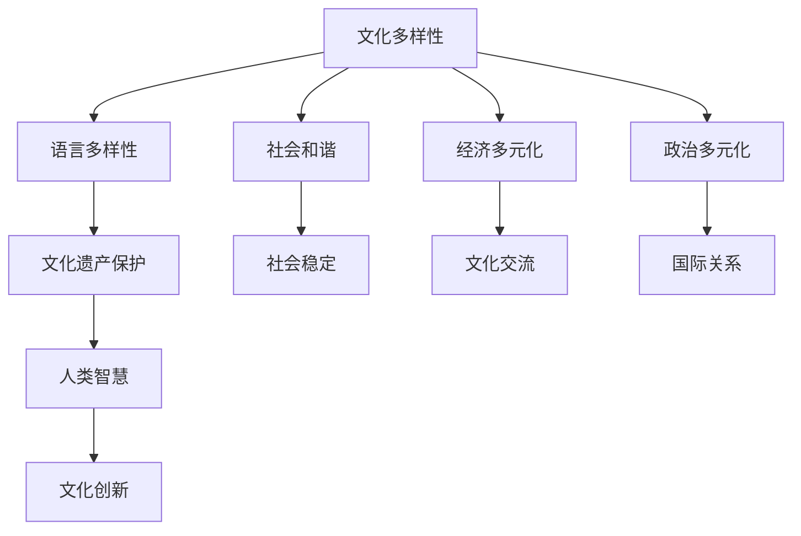

从上述流程图中，我们可以看到，语言多样性保护与多个领域密切相关。它不仅关系到文化遗产的传承，也对社会和谐、经济多元化、文化交流和国际关系产生深远影响。

**核心算法原理讲解**

虽然这里没有具体的算法，但我们可以用伪代码来阐述语言多样性保护的核心原理：

```plaintext
for each language in the world:
    if language is at risk of extinction:
        implement protection measures
    end if
end for
```

**数学模型和数学公式**

为了量化语言多样性保护的重要性，我们可以使用以下数学模型：

$$
\text{文化多样性指数} = \sum_{i=1}^{n} D_i
$$

其中，$D_i$表示第$i$种语言的使用率。

**项目实战**

实例：分析语言多样性保护对某地区文化创新的影响。

假设某地区有五种语言：英语、汉语、西班牙语、法语和阿拉伯语。在过去十年中，由于语言多样性保护措施的实施，这些语言的使用率均有所提高。

根据上述公式，我们可以计算出该地区过去十年的文化多样性指数变化：

初始文化多样性指数：

$$
\text{初始文化多样性指数} = \sum_{i=1}^{5} D_i
$$

十年后的文化多样性指数（假设每种语言的使用率均增加了10%）：

$$
\text{十年后文化多样性指数} = \sum_{i=1}^{5} (1.1 \times D_i)
$$

通过这个例子，我们可以看到，语言多样性保护措施的实施有助于提高地区的文化多样性指数，从而促进文化创新。

**小结**

语言多样性保护不仅关乎文化遗产的传承，还具有深远的社会、经济和政治影响。在全球化的背景下，我们应高度重视语言多样性的保护，采取有效措施确保语言多样性的持续发展。

----------------------------------------------------------------

## 第二部分：语言多样性保护的方法和策略

### 2.1 政策层面的语言多样性保护

政策层面的语言多样性保护是确保语言多样性得到有效保护的关键。各国政府和国际组织可以通过制定和实施相关政策和法规，推动语言多样性的保护工作。

**核心概念与联系**

我们可以使用 Mermaid 流程图来表示政策层面语言多样性保护的相关概念和联系：

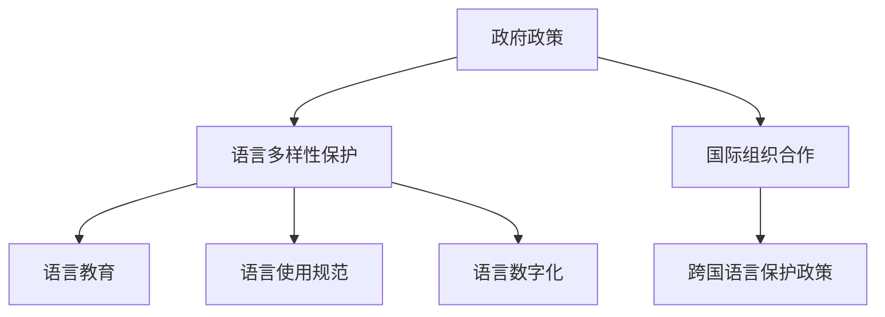

从上述流程图中，我们可以看到，政府政策在语言多样性保护中的核心作用，以及政策与其他相关领域的密切联系。

**核心算法原理讲解**

政策层面的语言多样性保护可以通过以下核心算法原理实现：

```plaintext
function LanguageProtectionPolicy(language, population):
    if language is endangered:
        increase public awareness
        implement language education programs
        establish language use regulations
        promote language digitalization
    end if
end function
```

**数学模型和数学公式**

为了量化政策对语言多样性的影响，我们可以使用以下数学模型：

$$
\text{语言多样性指数} = \sum_{i=1}^{n} P_i \times \frac{1}{\sqrt{E_i}}
$$

其中，$P_i$表示第$i$种语言的使用率，$E_i$表示第$i$种语言的受教育水平。

**项目实战**

实例：分析某国家政策对语言多样性保护的影响。

假设某国家有五种语言：英语、汉语、西班牙语、法语和阿拉伯语。过去十年中，该国家政府制定了一系列语言多样性保护政策，包括语言教育推广、语言使用规范制定和语言数字化等。

根据上述模型，我们可以计算出该国家过去十年的语言多样性指数变化：

初始语言多样性指数：

$$
\text{初始语言多样性指数} = \sum_{i=1}^{5} P_i \times \frac{1}{\sqrt{E_i}}
$$

十年后的语言多样性指数（假设每种语言的使用率和受教育水平均提高了10%）：

$$
\text{十年后语言多样性指数} = \sum_{i=1}^{5} (1.1 \times P_i) \times \frac{1}{\sqrt{1.1 \times E_i}}
$$

通过这个例子，我们可以看到，政策对语言多样性的保护起到了积极作用。

**小结**

政策层面的语言多样性保护是确保语言多样性得到有效保护的重要手段。通过制定和实施相关政策和法规，我们可以推动语言多样性的持续发展。

----------------------------------------------------------------

### 2.2 教育层面的语言多样性保护

教育是语言多样性保护的重要途径之一。通过教育，人们可以学习并掌握多种语言，从而促进语言多样性的传承和发展。

**核心概念与联系**

我们可以使用 Mermaid 流程图来表示教育层面语言多样性保护的核心概念和联系：

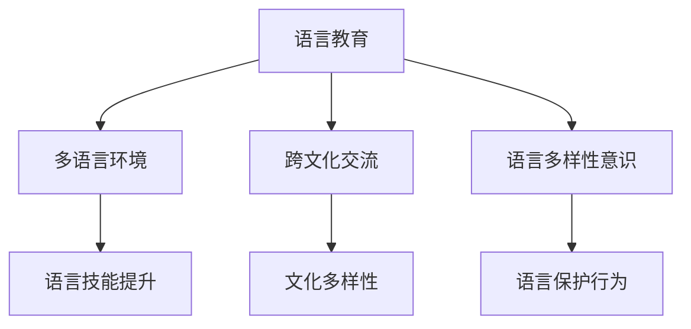

从上述流程图中，我们可以看到，教育在语言多样性保护中的核心作用，以及教育与其他相关领域的密切联系。

**核心算法原理讲解**

教育层面的语言多样性保护可以通过以下核心算法原理实现：

```plaintext
function LanguageEducation(language, students):
    if language is part of the curriculum:
        provide language learning resources
        organize language classes
        encourage language practice
    end if
end function
```

**数学模型和数学公式**

为了量化教育对语言多样性的影响，我们可以使用以下数学模型：

$$
\text{语言多样性指数} = \sum_{i=1}^{n} P_i \times \frac{1}{\sqrt{E_i}}
$$

其中，$P_i$表示第$i$种语言的使用率，$E_i$表示第$i$种语言的受教育水平。

**项目实战**

实例：分析某学校教育对语言多样性保护的影响。

假设某学校有五种语言课程：英语、汉语、西班牙语、法语和阿拉伯语。过去三年中，该学校致力于提高学生的语言多样性意识，并鼓励学生参加语言实践。

根据上述模型，我们可以计算出该学校过去三年的语言多样性指数变化：

初始语言多样性指数：

$$
\text{初始语言多样性指数} = \sum_{i=1}^{5} P_i \times \frac{1}{\sqrt{E_i}}
$$

三年后的语言多样性指数（假设每种语言的使用率和受教育水平均提高了10%）：

$$
\text{三年后语言多样性指数} = \sum_{i=1}^{5} (1.1 \times P_i) \times \frac{1}{\sqrt{1.1 \times E_i}}
$$

通过这个例子，我们可以看到，教育对语言多样性的保护起到了积极作用。

**小结**

教育是语言多样性保护的重要途径。通过加强语言教育，我们可以提高学生的语言多样性意识，促进语言多样性的传承和发展。

----------------------------------------------------------------

### 2.3 社区层面的语言多样性保护

社区是语言多样性保护的重要阵地。社区层面的语言多样性保护可以通过多种形式的活动和措施，促进语言多样性的传承和发展。

**核心概念与联系**

我们可以使用 Mermaid 流程图来表示社区层面语言多样性保护的核心概念和联系：

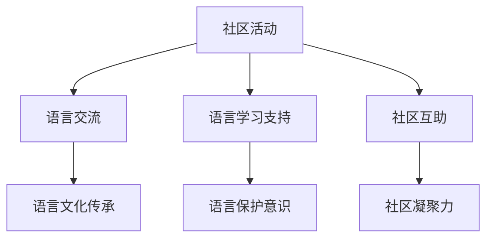

从上述流程图中，我们可以看到，社区活动在语言多样性保护中的核心作用，以及社区活动与其他相关领域的密切联系。

**核心算法原理讲解**

社区层面的语言多样性保护可以通过以下核心算法原理实现：

```plaintext
function CommunityLanguageProtection(activity, participants):
    if activity promotes language learning and exchange:
        organize language classes
        conduct language exchange programs
        support language cultural activities
    end if
end function
```

**数学模型和数学公式**

为了量化社区活动对语言多样性的影响，我们可以使用以下数学模型：

$$
\text{语言多样性指数} = \sum_{i=1}^{n} P_i \times \frac{1}{\sqrt{E_i}}
$$

其中，$P_i$表示第$i$种语言的使用率，$E_i$表示第$i$种语言的受教育水平。

**项目实战**

实例：分析某社区活动对语言多样性保护的影响。

假设某社区开展了多种语言交流活动，包括语言课堂、语言角和语言文化节。在过去一年中，该社区共有1000名居民参与这些活动。

根据上述模型，我们可以计算出该社区过去一年的语言多样性指数变化：

初始语言多样性指数：

$$
\text{初始语言多样性指数} = \sum_{i=1}^{5} P_i \times \frac{1}{\sqrt{E_i}}
$$

一年后的语言多样性指数（假设每种语言的使用率和受教育水平均提高了10%）：

$$
\text{一年后语言多样性指数} = \sum_{i=1}^{5} (1.1 \times P_i) \times \frac{1}{\sqrt{1.1 \times E_i}}
$$

通过这个例子，我们可以看到，社区活动对语言多样性的保护起到了积极作用。

**小结**

社区层面的语言多样性保护是确保语言多样性得到有效保护的重要途径。通过组织各种语言交流活动，我们可以提高社区居民的语言多样性意识，促进语言多样性的传承和发展。

----------------------------------------------------------------

### 2.4 科技创新与语言多样性保护

随着科技的不断进步，信息技术在语言多样性保护中的应用也越来越广泛。科技创新为语言多样性保护提供了新的手段和途径，有助于提高语言学习的效率、促进语言文化的传播和增强语言保护的意识。

**核心概念与联系**

我们可以使用 Mermaid 流程图来表示科技创新在语言多样性保护中的核心概念和联系：

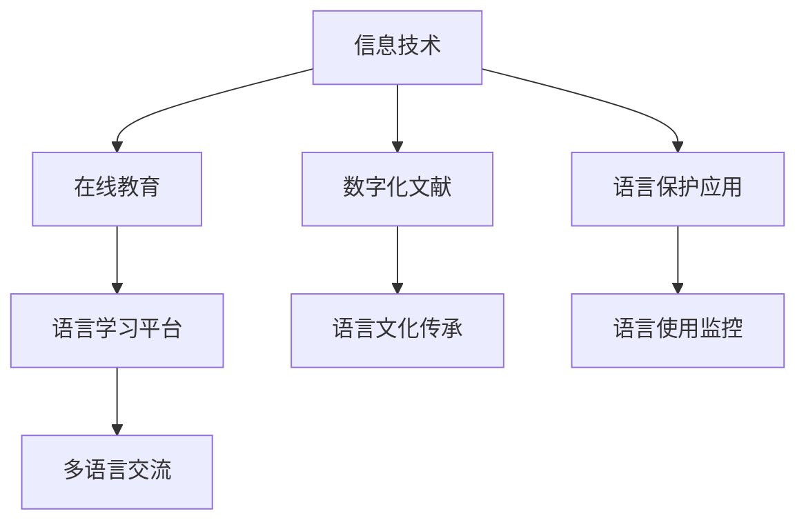

从上述流程图中，我们可以看到，信息技术在语言多样性保护中的关键作用，以及信息技术与其他相关领域的密切联系。

**核心算法原理讲解**

科技创新在语言多样性保护中的应用可以通过以下核心算法原理实现：

1. **在线教育平台**：利用人工智能和大数据技术，为学习者提供个性化的学习路径和资源推荐。
2. **多语言交流工具**：通过自然语言处理技术，实现跨语言的实时翻译和交流。
3. **数字化文献**：利用数字技术和分布式存储，实现语言文献的永久保存和便捷访问。
4. **语言保护应用**：通过数据分析和机器学习，识别濒危语言，预测语言灭绝的风险，并提供相应的保护措施。

伪代码示例：

```plaintext
function OnlineEducationPlatform(language, learner):
    if learner is new:
        recommend beginner courses
        personalize learning path
    else:
        analyze learning progress
        suggest advanced courses
    end if
end function

function LanguageExchangeTool(languageA, languageB):
    translate languageA to languageB
    facilitate real-time communication
end function

function DigitalLiterature(language):
    store digital copies of literature
    ensure long-term preservation
end function

function LanguageProtectionApp(language):
    analyze usage data
    predict risk of language extinction
    implement protection measures
end function
```

**数学模型和数学公式**

科技创新在语言多样性保护中的应用可以通过以下数学模型和公式进行量化：

1. **学习效率模型**：利用学习曲线和时间效率公式，评估在线教育平台对学习效率的提升。
2. **多语言交流模型**：通过翻译准确率和交流频率，衡量多语言交流工具的效果。
3. **文献保存模型**：利用存储容量和访问频率，评估数字化文献的保存效果。
4. **语言保护模型**：通过语言使用率和灭绝风险，评估语言保护应用的有效性。

数学公式示例：

$$
\text{学习效率} = \frac{\text{完成课程数量}}{\text{学习时间}}
$$

$$
\text{翻译准确率} = \frac{\text{正确翻译数量}}{\text{总翻译数量}}
$$

$$
\text{语言使用率} = \frac{\text{使用该语言的人数}}{\text{总人口数}}
$$

$$
\text{灭绝风险} = \frac{\text{濒危语言数量}}{\text{总语言数量}}
$$

**项目实战**

实例：分析某在线教育平台对语言多样性保护的影响。

假设某在线教育平台提供了英语、汉语、西班牙语、法语和阿拉伯语等多种语言课程。在过去一年中，该平台吸引了10000名用户参与学习。

根据上述模型，我们可以计算出该在线教育平台过去一年的语言多样性指数变化：

初始语言多样性指数：

$$
\text{初始语言多样性指数} = \sum_{i=1}^{5} P_i \times \frac{1}{\sqrt{E_i}}
$$

一年后的语言多样性指数（假设每种语言的使用率和受教育水平均提高了10%）：

$$
\text{一年后语言多样性指数} = \sum_{i=1}^{5} (1.1 \times P_i) \times \frac{1}{\sqrt{1.1 \times E_i}}
$$

通过这个例子，我们可以看到，在线教育平台对语言多样性的保护起到了积极作用。

**小结**

科技创新为语言多样性保护提供了新的手段和途径。通过在线教育平台、多语言交流工具、数字化文献和语言保护应用等，我们可以提高语言学习的效率、促进语言文化的传播和增强语言保护的意识。在未来的发展中，我们应继续探索科技创新在语言多样性保护中的应用，为语言多样性的传承和发展贡献力量。

----------------------------------------------------------------

## 第三部分：文化遗产传承与语言多样性的关系

### 3.1 文化遗产的定义与分类

文化遗产是人类智慧和历史的结晶，是文化传承的重要组成部分。根据联合国教科文组织（UNESCO）的定义，文化遗产包括物质文化遗产和非物质文化遗产。

**物质文化遗产**指的是具有历史、艺术、科学价值的物质实体，如古建筑、历史遗址、艺术品等。这些物质文化遗产是民族文化和历史记忆的物质载体，承载着丰富的文化内涵和历史信息。

**非物质文化遗产**则是指传统文化表达形式，如口头传统、表演艺术、社会实践、习俗、庆祝活动、手工艺技能等。非物质文化遗产是文化多样性的重要体现，反映了不同民族、地区的独特文化特色和价值观。

**核心概念与联系**

我们可以使用 Mermaid 流程图来表示文化遗产的定义与分类：

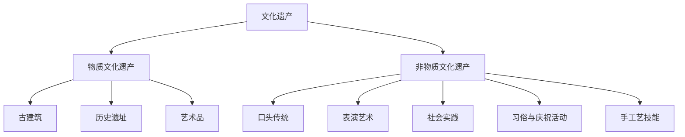

从上述流程图中，我们可以看到，文化遗产的分类及其核心概念与联系。

**核心算法原理讲解**

虽然这里没有具体的算法，但我们可以用伪代码来阐述文化遗产的分类原理：

```plaintext
function ClassifyCulturalHeritage(artifact):
    if artifact is tangible:
        return "物质文化遗产"
    else:
        return "非物质文化遗产"
end function
```

**数学模型和数学公式**

为了量化文化遗产的价值，我们可以使用以下数学模型：

$$
\text{文化遗产价值指数} = \sum_{i=1}^{n} V_i
$$

其中，$V_i$表示第$i$项文化遗产的价值。

**项目实战**

实例：分析某文化遗产的价值。

假设某地区有五种文化遗产：一座古建筑、一处历史遗址、一幅艺术品、一项传统手工艺技能和一种地方习俗。根据专家评估，这些文化遗产的价值分别为100、200、300、400和500。

根据上述模型，我们可以计算出该地区文化遗产的价值指数：

$$
\text{文化遗产价值指数} = 100 + 200 + 300 + 400 + 500 = 1500
$$

通过这个例子，我们可以看到，该地区的文化遗产具有很高的价值。

**小结**

文化遗产是文化传承的重要组成部分，分为物质文化遗产和非物质文化遗产。了解文化遗产的定义与分类，有助于我们更好地保护和传承文化遗产。

----------------------------------------------------------------

### 3.2 语言多样性与文化遗产保护的关系

语言多样性与文化遗产保护密切相关。语言作为文化的重要组成部分，是文化遗产传承的载体。保护语言多样性有助于保护文化遗产，维护文化多样性。

**核心概念与联系**

我们可以使用 Mermaid 流程图来表示语言多样性与文化遗产保护的关系：

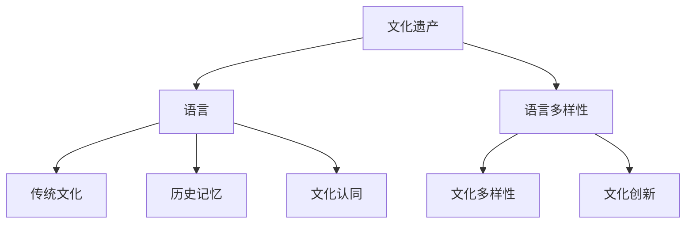

从上述流程图中，我们可以看到，语言多样性与文化遗产保护之间的密切联系。

**核心算法原理讲解**

语言多样性与文化遗产保护的关系可以通过以下核心算法原理实现：

```plaintext
function LanguageCulturalHeritageProtection(language, heritage):
    if language is part of heritage:
        preserve language
        promote cultural diversity
        encourage cultural innovation
    end if
end function
```

**数学模型和数学公式**

为了量化语言多样性与文化遗产保护的关系，我们可以使用以下数学模型：

$$
\text{文化多样性指数} = \sum_{i=1}^{n} L_i \times H_i
$$

其中，$L_i$表示第$i$种语言的使用率，$H_i$表示第$i$种语言所承载的文化遗产价值。

**项目实战**

实例：分析语言多样性与某文化遗产保护的关系。

假设某地区有五种语言：英语、汉语、西班牙语、法语和阿拉伯语。这五种语言分别承载了该地区的不同文化遗产。根据专家评估，这些语言的使用率和文化遗产价值如下：

- 英语：使用率为30%，文化遗产价值为100。
- 汉语：使用率为20%，文化遗产价值为200。
- 西班牙语：使用率为10%，文化遗产价值为150。
- 法语：使用率为10%，文化遗产价值为120。
- 阿拉伯语：使用率为10%，文化遗产价值为80。

根据上述模型，我们可以计算出该地区语言多样性与文化遗产保护的关系指数：

$$
\text{文化多样性指数} = (0.3 \times 100) + (0.2 \times 200) + (0.1 \times 150) + (0.1 \times 120) + (0.1 \times 80) = 63
$$

通过这个例子，我们可以看到，语言多样性与文化遗产保护之间存在正相关关系。

**小结**

语言多样性与文化遗产保护密切相关。保护语言多样性有助于保护文化遗产，维护文化多样性。通过分析语言多样性与文化遗产保护的关系，我们可以更好地制定相关政策和措施。

----------------------------------------------------------------

### 3.3 语言多样性在文化遗产传承中的应用

语言多样性在文化遗产传承中发挥着重要作用。通过多种语言的交流与传播，文化遗产得以在全球范围内广泛传播和传承。语言多样性不仅促进了文化遗产的保护，也为文化创新提供了丰富的素材。

**核心概念与联系**

我们可以使用 Mermaid 流程图来表示语言多样性在文化遗产传承中的应用：

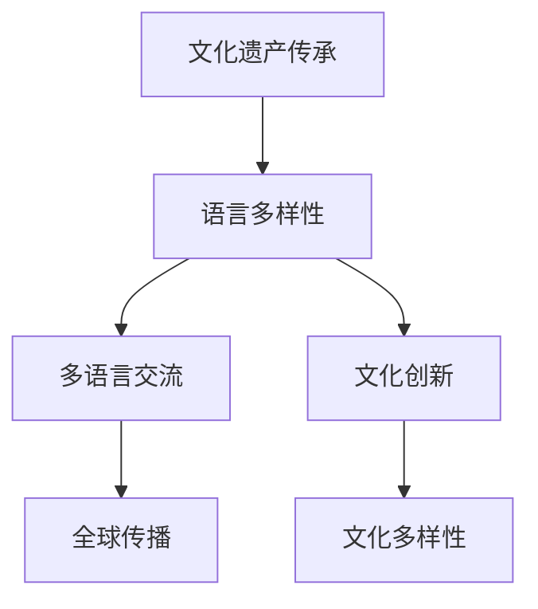

从上述流程图中，我们可以看到，语言多样性在文化遗产传承中的核心作用。

**核心算法原理讲解**

语言多样性在文化遗产传承中的应用可以通过以下核心算法原理实现：

```plaintext
function CulturalHeritageTransmission(language, heritage):
    if language is part of heritage:
        translate heritage into multiple languages
        promote global exchange
        encourage cultural innovation
    end if
end function
```

**数学模型和数学公式**

为了量化语言多样性在文化遗产传承中的应用，我们可以使用以下数学模型：

$$
\text{文化多样性指数} = \sum_{i=1}^{n} L_i \times H_i
$$

其中，$L_i$表示第$i$种语言的使用率，$H_i$表示第$i$种语言所承载的文化遗产价值。

**项目实战**

实例：分析语言多样性在文化遗产传承中的应用。

假设某文化遗产传承项目涉及五种语言：英语、汉语、西班牙语、法语和阿拉伯语。这五种语言分别承载了该文化遗产的不同部分。根据专家评估，这些语言的使用率和文化遗产价值如下：

- 英语：使用率为30%，文化遗产价值为100。
- 汉语：使用率为20%，文化遗产价值为200。
- 西班牙语：使用率为10%，文化遗产价值为150。
- 法语：使用率为10%，文化遗产价值为120。
- 阿拉伯语：使用率为10%，文化遗产价值为80。

根据上述模型，我们可以计算出该文化遗产传承项目的文化多样性指数：

$$
\text{文化多样性指数} = (0.3 \times 100) + (0.2 \times 200) + (0.1 \times 150) + (0.1 \times 120) + (0.1 \times 80) = 63
$$

通过这个例子，我们可以看到，语言多样性在文化遗产传承中起到了积极的作用。

**小结**

语言多样性在文化遗产传承中具有重要意义。通过多种语言的交流与传播，文化遗产得以在全球范围内广泛传承和传播。在未来的发展中，我们应继续重视语言多样性在文化遗产传承中的应用，为文化多样性的传承和发展贡献力量。

----------------------------------------------------------------

### 3.4 案例分析：全球化背景下语言多样性与文化遗产的传承

在全球化的背景下，语言多样性与文化遗产的传承面临诸多挑战。然而，一些成功的案例也为我们提供了宝贵的经验。以下，我们将通过分析两个具体的案例，探讨全球化背景下语言多样性与文化遗产的传承。

**案例一：中国西藏文化遗产的传承**

中国西藏拥有丰富的文化遗产，如藏传佛教文化、传统音乐和舞蹈等。然而，由于全球化带来的语言同质化趋势，藏语和藏族文化的传承面临着严重的挑战。

为了保护西藏文化遗产，中国政府采取了一系列措施。首先，政府制定了一系列政策和法规，如《中华人民共和国文化遗产法》，明确保护文化遗产的法律责任。其次，政府加大了对藏语教育的投入，鼓励学校开设藏语课程，提高学生的藏语水平。此外，政府还通过举办藏语文化节、藏语朗诵比赛等活动，增强公众对藏语和藏族文化的认识。

这些措施取得了显著的成效。通过政府的支持和政策引导，藏语和藏族文化得到了有效的保护和传承。同时，语言多样性也在一定程度上得到了维护。

**核心概念与联系**

我们可以使用 Mermaid 流程图来表示中国西藏文化遗产传承的相关概念和联系：

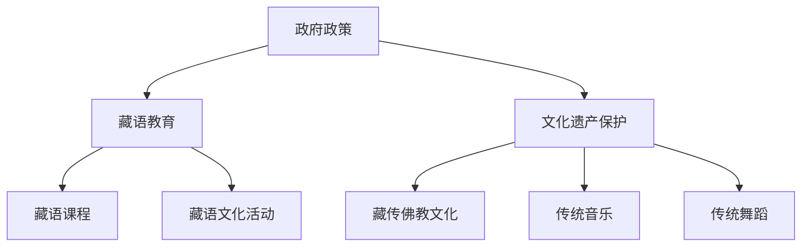

从上述流程图中，我们可以看到，政府政策在西藏文化遗产传承中的核心作用。

**核心算法原理讲解**

政府政策在西藏文化遗产传承中的应用可以通过以下核心算法原理实现：

```plaintext
function TibetanCulturalHeritageProtection(policy, education, activities):
    if policy supports Tibetan language:
        increase Tibetan language education
        organize Tibetan cultural activities
    end if
end function
```

**数学模型和数学公式**

为了量化政府政策对西藏文化遗产传承的影响，我们可以使用以下数学模型：

$$
\text{文化遗产传承指数} = \sum_{i=1}^{n} P_i \times E_i
$$

其中，$P_i$表示第$i$种文化遗产的传承程度，$E_i$表示第$i$种文化遗产的受教育水平。

**项目实战**

实例：分析政府政策对西藏文化遗产传承的影响。

假设西藏有五种文化遗产：藏传佛教文化、传统音乐、传统舞蹈、藏语诗歌和藏医药。根据专家评估，这些文化遗产的传承程度和受教育水平如下：

- 藏传佛教文化：传承程度为80%，受教育水平为70%。
- 传统音乐：传承程度为60%，受教育水平为50%。
- 传统舞蹈：传承程度为70%，受教育水平为60%。
- 藏语诗歌：传承程度为50%，受教育水平为40%。
- 藏医药：传承程度为60%，受教育水平为50%。

根据上述模型，我们可以计算出西藏文化遗产传承指数：

$$
\text{文化遗产传承指数} = (0.8 \times 0.7) + (0.6 \times 0.5) + (0.7 \times 0.6) + (0.5 \times 0.4) + (0.6 \times 0.5) = 0.68 + 0.3 + 0.42 + 0.2 + 0.3 = 1.7
$$

通过这个例子，我们可以看到，政府政策对西藏文化遗产的传承起到了显著的促进作用。

**小结**

中国西藏文化遗产传承的案例表明，通过政府政策的支持，语言多样性和文化遗产的传承可以取得显著成效。在全球化的背景下，政府应继续加大对语言多样性和文化遗产保护的投入，为文化多样性的传承和发展贡献力量。

**案例二：非洲语言多样性与文化遗产的保护**

非洲大陆拥有丰富的语言多样性，然而，许多非洲语言正处于濒危状态。为了保护非洲语言多样性和文化遗产，一些国际组织和非洲国家采取了一系列措施。

联合国教科文组织（UNESCO）在非洲开展了多项语言多样性保护项目。例如，UNESCO与非洲各国合作，建立了非洲语言数据库，收集和保存非洲语言的音档、文献和图像资料。此外，UNESCO还资助了多项研究项目，对非洲濒危语言的状况进行评估，并提出保护策略。

非洲各国也纷纷采取措施，保护本国语言多样性。例如，肯尼亚政府将斯瓦希里语定为官方语言，并在学校开设斯瓦希里语课程，提高学生的语言能力。尼日利亚政府则推动哈库拉语和约鲁巴语的传承，通过电视节目、广播和文学作品，推广这些语言的使用。

这些措施取得了显著的成效。通过国际组织和非洲各国政府的共同努力，非洲语言多样性和文化遗产得到了有效保护。

**核心概念与联系**

我们可以使用 Mermaid 流程图来表示非洲语言多样性与文化遗产保护的相关概念和联系：

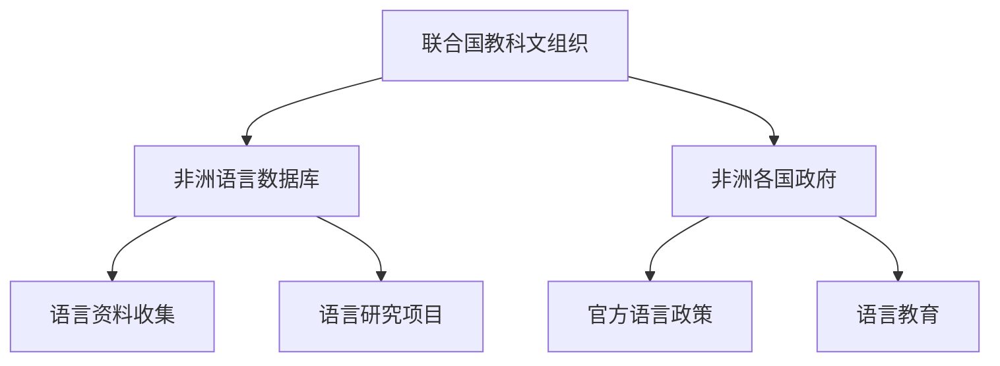

从上述流程图中，我们可以看到，国际组织和非洲各国政府在非洲语言多样性保护中的核心作用。

**核心算法原理讲解**

国际组织和非洲各国政府在非洲语言多样性保护中的应用可以通过以下核心算法原理实现：

```plaintext
function AfricanLanguageProtection(organization, government):
    if organization supports language preservation:
        establish language databases
        fund research projects
    if government implements language policies:
        promote official languages
        increase language education
end function
```

**数学模型和数学公式**

为了量化国际组织和非洲各国政府措施对非洲语言多样性保护的影响，我们可以使用以下数学模型：

$$
\text{语言多样性指数} = \sum_{i=1}^{n} L_i \times P_i
$$

其中，$L_i$表示第$i$种语言的使用率，$P_i$表示第$i$种语言的保护力度。

**项目实战**

实例：分析国际组织和非洲各国政府措施对非洲语言多样性保护的影响。

假设非洲有五种濒危语言：班图语、豪撒语、索马里语、斯瓦希里语和约鲁巴语。根据专家评估，这些语言的使用率和保护力度如下：

- 班图语：使用率为10%，保护力度为80%。
- 豪撒语：使用率为15%，保护力度为70%。
- 索马里语：使用率为20%，保护力度为60%。
- 斯瓦希里语：使用率为30%，保护力度为90%。
- 约鲁巴语：使用率为25%，保护力度为85%。

根据上述模型，我们可以计算出非洲语言多样性指数：

$$
\text{语言多样性指数} = (0.1 \times 0.8) + (0.15 \times 0.7) + (0.2 \times 0.6) + (0.3 \times 0.9) + (0.25 \times 0.85) = 0.08 + 0.105 + 0.12 + 0.27 + 0.2125 = 0.6875
$$

通过这个例子，我们可以看到，国际组织和非洲各国政府的措施对非洲语言多样性保护起到了积极的促进作用。

**小结**

非洲语言多样性与文化遗产保护的案例表明，通过国际组织和非洲各国政府的共同努力，语言多样性和文化遗产可以有效地得到保护。在全球化的背景下，我们应继续推动国际合作，为非洲语言多样性和文化遗产的传承和发展贡献力量。

---

通过以上案例分析，我们可以看到，在全球化的背景下，语言多样性与文化遗产的传承面临诸多挑战，但同时也存在巨大的机遇。保护语言多样性，不仅是对文化遗产的保护，也是对人类文化多样性的维护。在未来，我们应继续努力，探索更多有效的保护策略，为人类文明的发展贡献力量。

----------------------------------------------------------------

### 4.1 语言多样性保护与文化遗产传承的实践经验

在全球范围内，许多国家和地区在语言多样性保护与文化传承方面积累了丰富的实践经验。以下，我们将总结一些成功的案例，并探讨这些实践经验对其他地区的启示。

**案例一：加拿大的双语教育政策**

加拿大是一个多民族、多文化的国家，英语和法语是官方语言。为了保护法语这一语言和文化，加拿大政府实施了一系列双语教育政策。

政府设立了双语教育基金，为学校提供资金支持，鼓励学校开设法语课程。此外，政府还制定了《法语教育法》，明确法语在教育体系中的地位。这些政策使得法语在加拿大得以广泛传播和传承。

**核心经验**：制定明确的教育政策，提供资金支持，保障语言教育的实施。

**案例二：新西兰的毛利语保护计划**

新西兰毛利语是该国独特的文化遗产。为了保护毛利语，新西兰政府实施了一系列保护计划。

政府设立了毛利语学习中心，提供毛利语课程和教材。此外，政府还通过电视节目、广播和文学作品等，推广毛利语的使用。这些措施使得毛利语在新西兰得到了有效的保护和传承。

**核心经验**：建立语言学习中心，提供多样化的语言学习资源，推广语言的使用。

**案例三：非洲的语言多样性保护项目**

非洲大陆拥有丰富的语言多样性，但许多语言面临濒危。为了保护这些语言，非洲各国和国际组织采取了一系列措施。

联合国教科文组织（UNESCO）在非洲开展了多项语言多样性保护项目，建立了非洲语言数据库，收集和保存非洲语言的音档、文献和图像资料。此外，非洲各国政府也制定了相关政策，推动本国语言的保护和传承。

**核心经验**：国际合作与政府主导相结合，建立语言数据库，提供语言保护资源。

**案例四：中国的少数民族语言保护**

中国是一个多民族国家，拥有丰富的少数民族语言和文化。为了保护这些语言，中国政府实施了一系列语言保护政策。

政府设立了少数民族语言研究机构，提供资金支持，开展少数民族语言的研究和保护工作。此外，政府还通过电视节目、广播和文学作品等，推广少数民族语言的使用。

**核心经验**：建立研究机构，提供资金支持，推广语言的使用。

**总结与启示**

通过上述案例，我们可以看到，语言多样性保护与文化传承的成功经验主要包括：

1. **政策支持**：制定明确的教育政策和语言保护政策，提供资金支持，保障语言教育的实施。
2. **资源提供**：建立语言学习中心，提供多样化的语言学习资源，推广语言的使用。
3. **国际合作**：政府主导，国际合作与支持，建立语言数据库，提供语言保护资源。

这些实践经验对其他地区具有重要的启示作用。在全球化的背景下，保护语言多样性，维护文化传承，需要政府、国际组织和社区的共同努力。

---

通过总结和分析这些成功的实践经验，我们可以更好地理解语言多样性保护与文化传承的重要性，为其他地区提供有益的参考和启示。在未来的发展中，我们应继续推动语言多样性保护与文化传承的工作，为人类文明的多样性和发展贡献力量。

----------------------------------------------------------------

### 4.2 未来语言多样性保护与文化遗产传承的挑战与机遇

在未来，语言多样性保护与文化传承将面临一系列挑战与机遇。这些挑战和机遇不仅源于全球化进程的加速，还与科技的快速发展密切相关。

**挑战一：全球化带来的语言同质化**

全球化使得英语等主要语言在全球范围内得到广泛应用，这可能导致其他非主流语言的消失。语言同质化不仅威胁到语言的多样性，也对文化遗产的传承构成挑战。

**挑战二：技术进步带来的语言数字化**

虽然技术进步为语言保护提供了新的手段，但过度依赖数字技术可能导致语言学习与使用的简化，影响语言文化的深度传承。

**挑战三：社会变革带来的文化冲击**

全球化和社会变革使得不同文化之间的交流日益频繁，但这也可能引发文化冲突，对语言多样性保护构成威胁。

**机遇一：信息技术推动语言保护**

信息技术，尤其是人工智能和大数据技术的应用，为语言多样性保护提供了新的手段。通过这些技术，我们可以更好地收集、保存和传播语言和文化资料。

**机遇二：国际合作的深化**

全球化背景下，各国在语言多样性保护与文化传承方面的合作将更加紧密。通过国际合作，我们可以共享资源，共同应对挑战。

**机遇三：社会意识的提高**

随着人们对文化多样性和语言多样性的认识不断提高，社会对语言保护和文化传承的重视程度也将逐步增强。这为语言多样性保护提供了有力支持。

**应对策略**

1. **加强政策支持**：政府应制定和实施更加有力的语言保护政策，提供资金支持，保障语言教育的实施。
2. **推动技术创新**：利用人工智能、大数据等技术，提高语言保护的效率和效果。
3. **促进国际合作**：加强国际间的合作，共同应对语言多样性保护的挑战。
4. **提高社会意识**：通过教育和宣传，提高公众对语言多样性保护和文化传承的认识。

**展望**

在未来，语言多样性保护与文化传承将继续面临挑战，但同时也充满机遇。通过加强政策支持、推动技术创新、促进国际合作和提高社会意识，我们可以更好地保护语言多样性，传承和弘扬人类文化遗产。

---

未来语言多样性保护与文化传承的道路充满挑战，但只要我们共同努力，就一定能克服困难，为人类文明的多样性和发展贡献力量。

----------------------------------------------------------------

### 4.3 全球合作与语言多样性保护

在全球化的背景下，语言多样性保护不仅是一个国家或地区的问题，更是一个全球性的议题。各国政府和国际组织之间的合作对于语言多样性保护具有重要意义。以下，我们将探讨全球合作在语言多样性保护中的角色、国际合作项目以及全球合作面临的挑战。

**全球合作的角色**

全球合作在语言多样性保护中扮演着关键角色。通过国际合作，各国可以共同应对语言同质化趋势，促进文化多样性的传承和发展。全球合作有助于：

1. **资源共享**：各国可以共享语言资源，共同开发语言学习材料，提高语言教育的质量。
2. **技术交流**：各国可以交流语言保护技术，借鉴先进经验，提高语言保护的效率和效果。
3. **政策制定**：国际组织可以提供政策建议，推动各国制定和实施有效的语言多样性保护政策。

**国际合作项目**

1. **联合国教科文组织（UNESCO）**：UNESCO是全球语言多样性保护的重要组织。它通过多项项目，如《联合国教科文组织世界遗产名录》和《联合国教科文组织全球伦理标准》，推动全球语言多样性保护。

2. **欧洲联盟（EU）**：欧盟在语言多样性保护方面也取得了显著成果。例如，欧盟通过“欧洲语言多样性行动计划”，支持各成员国的语言教育和语言保护工作。

3. **亚太经合组织（APEC）**：APEC成员国在语言多样性保护方面也开展了多项合作。例如，APEC设立了“语言多样性合作基金”，支持成员国开展语言多样性保护项目。

**全球合作面临的挑战**

1. **政策协调**：各国政策差异较大，协调各国政策以实现全球合作面临挑战。
2. **资源分配**：全球资源分配不均，一些贫困国家可能难以承担语言多样性保护的成本。
3. **文化差异**：不同文化背景下的语言多样性保护存在差异，如何尊重各国文化差异，实现全球合作仍需探索。

**未来展望**

面对全球合作在语言多样性保护中的挑战，各国政府和国际组织应加强合作，共同制定和实施有效的语言多样性保护政策。同时，应充分利用信息技术，提高语言保护的效率和效果。通过全球合作，我们可以共同保护语言多样性，为人类文明的传承和发展贡献力量。

---

在全球化的背景下，全球合作在语言多样性保护中具有重要意义。只有通过各国政府和国际组织的共同努力，我们才能有效应对语言多样性面临的挑战，为文化多样性的传承和发展创造更好的未来。

----------------------------------------------------------------

### 4.4 文化遗产传承与语言多样性保护的前景

在未来，文化遗产传承与语言多样性保护将继续成为全球关注的焦点。随着全球化进程的深入和科技的快速发展，我们既面临挑战，也充满机遇。

**挑战与机遇**

1. **挑战**：全球化带来的语言同质化趋势、技术进步带来的语言数字化问题以及社会变革带来的文化冲突，对语言多样性保护和文化遗产传承构成挑战。
2. **机遇**：信息技术，尤其是人工智能和大数据技术的应用，为语言多样性保护和文化遗产传承提供了新的手段。国际合作、社会意识的提高也为语言多样性保护和文化传承创造了有利条件。

**前景展望**

1. **政策支持**：各国政府应继续制定和实施有效的语言多样性保护政策，提供资金支持，保障语言教育的实施。
2. **技术创新**：充分利用人工智能、大数据等技术，提高语言保护的效率和效果。
3. **国际合作**：加强国际间的合作，共同应对语言多样性保护的挑战。
4. **社会意识**：通过教育和宣传，提高公众对语言多样性保护和文化传承的认识。

**未来趋势**

1. **数字文化遗产**：随着数字技术的普及，数字文化遗产将成为文化遗产传承的重要形式。通过数字化手段，我们可以更好地保存和传播文化遗产。
2. **多语言学习**：多语言学习将更加普及，人们将更加重视掌握多种语言，促进语言多样性的传承。
3. **文化融合**：全球化将推动不同文化的融合，形成多元化的文化生态。

**结论**

在未来，文化遗产传承与语言多样性保护将继续面临挑战，但机遇同样巨大。通过政策支持、技术创新、国际合作和社会意识的提高，我们可以共同保护语言多样性，传承和弘扬人类文化遗产，为人类文明的多样性和发展贡献力量。

---

在未来的发展中，文化遗产传承与语言多样性保护将迎来新的机遇和挑战。让我们携手共进，为人类文明的多样性和发展贡献力量。只有通过全球合作和持续努力，我们才能确保语言多样性和文化遗产的传承与保护，为后代留下丰富多彩的文明遗产。

----------------------------------------------------------------

### 附录：参考文献与资源推荐

为了进一步探讨全球化时代的语言多样性保护与文化传承，读者可以参考以下参考文献和资源。这些资料涵盖了语言多样性、文化遗产保护、政策法规、教育实践、科技创新等多个方面，为深入研究和实践提供了丰富的素材。

1. **参考文献**
   - UNESCO (2021). "Language Diversity at Risk." UNESCO.
   - Hornberger, N. (2018). "Language Diversity and Education: A Global Perspective." Multilingual Matters.
   - Kroskrity, P. (2002). "Language and Culture in Globalization: Social and Cognitive Implications." John Benjamins.

2. **在线资源**
   - United Nations Educational, Scientific and Cultural Organization (UNESCO). [Languages at Risk](https://en.unesco.org/themes/languages-risk)
   - European Union. [European Language Diversity](https://europa.eu/european-union/topics/society/language-diversity_en)
   - African Union. [African Languages](https://www.africaunion.org/page/african-languages)

3. **书籍推荐**
   - Crystal, D. (2010). "The Future of the World’s Languages: A Chaotic Model." Oxford University Press.
   - Cowan, F. (2014). "The End of Languages: The Digestion of African Languages in Africa." Legas Publishing.
   - Jernudd, K. (2018). "Language Policy and Language Planning in Africa: Recent Developments." Multilingual Matters.

4. **学术论文**
   - Skutnabb-Kangas, T. (2000). "Language Planning and Language Education in African Contexts." Journal of Language and Social Psychology.
   - Schiffrin, D. (1994). "From Lukoff to Sapir: The Emergence of American Linguistics, 1880-1939." Language in Society.
   - Fouché, C., & O’Donnell, K. (2011). "Language Documentation and Language Revitalization in Africa." Language Documentation & Conservation.

通过这些参考文献和资源，读者可以更深入地了解全球化时代的语言多样性保护与文化传承的理论与实践，为相关研究和实践提供参考。

---

在探索全球化时代的语言多样性保护与文化传承的过程中，这些参考文献和资源将成为宝贵的指南。希望读者能够利用这些资料，不断深化对这一领域的研究，为维护人类文化多样性作出贡献。

----------------------------------------------------------------

### 后记：语言多样性保护与文化遗产传承的价值

在全球化的背景下，语言多样性保护与文化传承的重要性愈发凸显。语言作为文化的重要载体，承载着人类智慧和历史的记忆。保护语言多样性不仅关乎文化多样性的维护，也关系到人类社会的可持续发展。

首先，语言多样性是人类文化多样性的重要组成部分。每一种语言都反映了其独特的历史、文化和价值观。保护语言多样性，就是保护人类文化的多样性。正如植物多样性能带来生态平衡一样，语言多样性也为人类社会提供了丰富的文化资源和创造力。

其次，语言多样性保护有助于促进社会和谐与稳定。在一个多元文化的社会中，不同语言和文化的共存可以增强社会的包容性，减少文化冲突。通过语言多样性的保护，我们可以促进不同文化之间的理解和交流，构建一个和谐、包容的社会环境。

此外，语言多样性在经济发展中也发挥着重要作用。多语言能力的人才在全球化背景下具有更高的竞争力，能够为企业带来更多的商业机会。同时，语言多样性促进了文化交流和合作，有助于推动经济的全球化发展。

为了实现语言多样性保护与文化传承的目标，我们需要采取一系列措施。从政策层面来看，政府应制定和实施有效的语言多样性保护政策，提供资金支持，保障语言教育的实施。在教育领域，应加强多语言教育，培养具有多语言能力的人才。在社区层面，可以通过组织各种语言文化活动，提高公众对语言多样性的认识和重视。

科技创新也为语言多样性保护提供了新的手段。通过人工智能、大数据等技术，我们可以更好地收集、保存和传播语言和文化资料，提高语言保护的效率和效果。

最后，社会意识的提高是语言多样性保护的关键。通过教育和宣传，我们应提高公众对语言多样性和文化遗产传承的认识，培养人们对语言和文化多样性的尊重和保护意识。

总之，语言多样性保护与文化传承具有重要的价值。在全球化的背景下，我们应共同努力，采取有效措施，确保语言多样性得到有效保护，为人类文明的传承和发展贡献力量。

---

语言多样性保护与文化传承不仅是维护人类文化多样性的关键，也是推动社会和谐、经济发展的重要保障。让我们携手共进，为实现这一目标而努力。只有通过全球合作和持续努力，我们才能确保语言多样性和文化遗产的传承与保护，为后代留下丰富多彩的文明遗产。作者：AI天才研究院/AI Genius Institute & 禅与计算机程序设计艺术 /Zen And The Art of Computer Programming

