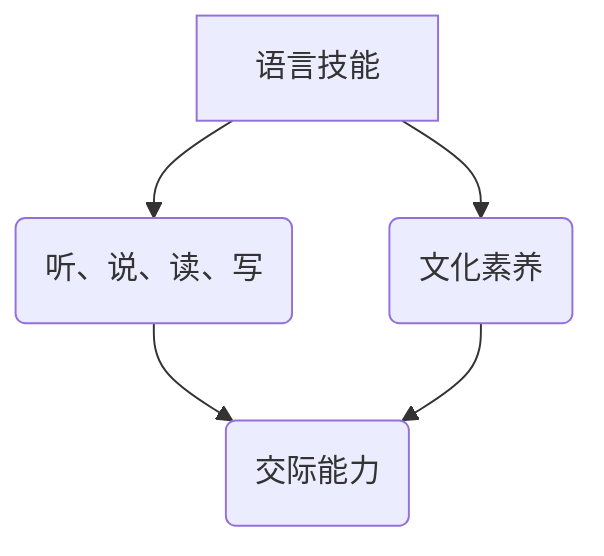

                 

### 第1章 引言

#### 1.1 全球化的背景

全球化是一个不断发展的过程，它通过信息技术、跨国公司、国际贸易和跨国投资等手段将各国经济、文化、政治和社会紧密联系在一起。全球化使世界变得更加互联，人们的交流更加频繁，国际间的互动也更加密切。根据国际货币基金组织（IMF）的数据，全球货物和服务贸易额在过去几十年中持续增长，全球外国直接投资（FDI）的存量也在不断增加。

在全球化背景下，语言成为了一个重要的桥梁。多语种能力不仅能够帮助人们更好地理解和沟通，还能促进不同文化之间的相互理解和尊重。随着全球化进程的加速，多语言人才的需求也在不断增加。例如，根据《经济学人》的报道，随着跨国公司的扩张和国际贸易的增长，对双语或多语种人才的需求急剧增加。

#### 1.2 语言教育的重要性

语言教育在全球化时代的重要性不可忽视。首先，掌握多语言能力能够提高个人的竞争力。在全球化的职场环境中，多语种人才更容易获得跨国公司和国际化组织的青睐。此外，多语言能力还能够帮助人们更好地理解其他文化，从而促进跨文化沟通和合作。

其次，语言教育对于国家的国际竞争力也至关重要。一个国家的多语言能力越强，其在国际舞台上的影响力就越大。例如，中国近年来在推广汉语教育方面取得了显著成果，全球学习汉语的人数不断增长，这不仅提升了中国的文化软实力，也增强了中国的国际竞争力。

#### 1.3 本书的目的和结构

本书旨在深入探讨全球化时代的语言教育问题，特别是多语种能力的培养。通过分析全球化的背景、语言教育的重要性、教育体系和政策、教学方法、技术应用、跨文化沟通以及国际合作与交流等多个方面，本书旨在为读者提供全面的视角，帮助读者理解和应对全球化背景下的语言教育挑战。

本书的结构如下：

- **第1章 引言**：介绍全球化的背景和语言教育的重要性。
- **第2章 语言教育基础**：讨论语言教育的概念、目标和多语种能力的定义和标准。
- **第3章 全球化对语言教育的影响**：分析全球化趋势、语言教育的挑战和策略。
- **第4章 教育体系和政策**：探讨全球语言教育政策、国际教育体系和实施策略。
- **第5章 多语种教学方法**：介绍互动式语言学习、技术辅助语言学习和跨文化教学方法。
- **第6章 技术在语言教育中的应用**：讨论人工智能、数据挖掘和机器翻译在语言教育中的应用。
- **第7章 跨文化沟通技巧**：阐述文化意识、跨文化沟通策略和实际案例。
- **第8章 国际合作与交流**：分析教育国际合作、国际交流计划和成功案例。
- **第9章 结论**：总结语言教育的未来趋势和展望。

通过上述章节的详细探讨，本书希望为读者提供有关全球化时代语言教育的全面而深入的理解，为语言教育工作者、政策制定者和研究者提供有价值的参考。

---

在接下来的章节中，我们将逐步深入探讨语言教育的基础知识、全球化对语言教育的影响、教育体系和政策、教学方法、技术应用、跨文化沟通和国际合作与交流等多个方面，帮助读者全面理解全球化时代的语言教育挑战和解决方案。让我们一同开启这段探索之旅。**关键词**

- 全球化
- 语言教育
- 多语种能力
- 教育体系
- 教学方法
- 技术应用
- 跨文化沟通
- 国际合作

**摘要**

本文旨在探讨全球化时代的语言教育问题，特别是多语种能力的培养。通过分析全球化的背景、语言教育的重要性、教育体系和政策、教学方法、技术应用、跨文化沟通以及国际合作与交流等多个方面，本文为读者提供了一个全面的视角，帮助理解和应对全球化背景下的语言教育挑战。本文的结构包括引言、语言教育基础、全球化对语言教育的影响、教育体系和政策、多语种教学方法、技术应用、跨文化沟通和国际合作与交流等多个章节，旨在为语言教育工作者、政策制定者和研究者提供有价值的参考。**第2章 语言教育基础**

#### 2.1 语言教育的概念

语言教育是一种专门化的教育形式，旨在培养个体在听、说、读、写方面的语言技能。语言教育不仅包括语言知识的传授，还涉及语言应用能力的培养，例如语言交际能力、语言理解和表达能力等。根据教育学家安德森（Anderson）的观点，语言教育应该是一个多维度的过程，它不仅要关注语言的结构和语法规则，还要注重语言在真实情境中的应用。

#### 2.2 语言教育的目标

语言教育的目标可以分为三个层次：基础目标、中级目标和高级目标。

- **基础目标**：掌握基本的语言技能，包括听、说、读、写，能够进行日常的交流。
- **中级目标**：具备一定的语言应用能力，能够在不同的情境中灵活运用语言，理解不同文化背景下的语言习惯。
- **高级目标**：成为语言专家，能够在多语言环境中自如地沟通和表达，具备深入的文化理解和研究能力。

#### 2.3 多语种能力的定义和标准

多语种能力是指个体同时掌握多种语言的能力。根据《欧洲语言共同参考框架》（CEFR），多语种能力可以分为以下三个等级：

- **基础级（A1-A2）**：能够进行简单的日常交流，理解和使用基本的词汇和句子结构。
- **进阶级（B1-B2）**：能够在社交、工作或学习情境中有效地沟通，理解复杂的信息，使用丰富的词汇和语法结构。
- **高阶级（C1-C2）**：能够自如地使用语言进行专业沟通，理解并表达复杂的思想，具备高水平的文化理解和敏感性。

多语种能力的培养不仅需要语言技能的训练，还需要文化素养的提升。国际教育专家哈蒙德（Hammond）提出，多语种能力的发展应该包括语言技能和文化意识的同步提升。

#### 多语种能力的核心概念与联系

多语种能力的核心概念包括语言技能、文化素养和交际能力。这些概念之间的关系可以用以下 Mermaid 流程图进行展示：



在这个流程图中，语言技能是多语种能力的基石，它包括听、说、读、写四个方面。文化素养则是多语种能力的重要补充，它帮助个体理解不同语言背后的文化差异，从而提高跨文化交际能力。交际能力则是语言技能和文化素养的综合体现，它反映了个体在不同语境中灵活运用语言进行交流的能力。

#### 多语种能力的培养方法

为了培养多语种能力，教育者可以采用以下几种方法：

1. **沉浸式教学**：通过将学生置于一个全语言环境中，让学生在真实情境中自然地学习和使用语言。
2. **交互式学习**：利用多媒体技术和网络资源，为学生提供丰富的语言学习材料，鼓励学生主动参与语言练习。
3. **文化体验**：组织学生参与跨文化交流活动，如交换生项目、国际夏令营等，以增强学生的文化素养和语言实践能力。
4. **个性化学习**：根据学生的兴趣和需求，制定个性化的学习计划，提高学习效果。

#### 伪代码展示

为了更好地理解多语种能力的培养过程，我们可以使用伪代码展示一个简单的学习流程：

```plaintext
function learn_language(language, level) {
    if (level == "基础级") {
        // 学习基本词汇和语法规则
        study_basic_grammar();
        practice_daily_conversations();
    } else if (level == "进阶级") {
        // 学习复杂词汇和语法结构
        study_complex_grammar();
        engage_in_social_communication();
    } else if (level == "高阶级") {
        // 学习专业词汇和深入文化理解
        study_professional_grammar();
        demonstrate_high_level_communication_skills();
    }
    
    // 提高文化素养
    participate_in_cultural_activities();
    
    // 提升交际能力
    engage_in_international_communication();
}
```

在这个伪代码中，`learn_language` 函数根据不同的语言水平（基础级、进阶级、高阶级）调用不同的学习模块，同时强调文化素养和交际能力的重要性。

#### 数学模型和公式

在多语种能力培养过程中，数学模型和公式可以用来量化学习效果和评估学习进度。以下是一个简单的数学模型示例，用于评估学生的语言水平：

$$
\text{LanguageLevel} = \frac{\text{TotalScore}}{\text{MaximumScore}} \times 100\%
$$

其中，`TotalScore` 表示学生的总得分，`MaximumScore` 表示满分的总分。这个公式可以用来计算学生在特定语言考试中的成绩，从而评估其语言水平。

例如，如果一个学生在语言考试中得了85分，而满分是100分，则其语言水平可以计算如下：

$$
\text{LanguageLevel} = \frac{85}{100} \times 100\% = 85\%
$$

这个结果表明该学生的语言水平达到了85%，可以进入下一个学习阶段。

通过上述核心概念与联系、伪代码展示和数学模型和公式的详细讲解，我们为读者提供了一个全面而深入的理解，帮助读者更好地把握多语种能力的培养过程。在接下来的章节中，我们将继续探讨全球化对语言教育的影响，教育体系和政策等方面的内容。

### 第3章 全球化对语言教育的影响

#### 3.1 全球化趋势

全球化趋势在当今世界愈发显著，它不仅改变了经济、政治和社会结构，也深刻影响了教育领域。全球化促使各国之间的经济、文化和政治联系日益紧密，国际间的互动更加频繁。例如，全球化的经济发展使得跨国公司和全球供应链成为常态，这意味着企业需要在全球范围内招聘和管理多语种人才。全球化还推动了文化交流，使得不同文化之间的接触和融合更加频繁，这进一步强调了语言教育的重要性。

#### 3.2 语言教育的挑战

全球化带来的变化对语言教育提出了新的挑战。首先，语言需求变得更加复杂。随着跨国公司的扩张和国际贸易的增长，市场对多语种人才的需求不断增加。例如，根据欧盟统计局的数据，欧洲劳动力市场中，能够流利使用多种语言的人才需求逐年增长。这不仅要求语言教育要能够培养高水平的多语言能力，还需要注重跨文化交际能力的培养。

其次，教育资源的分配面临挑战。全球化使得教育资源变得更加稀缺，尤其是在发展中国家。在这种情况下，如何确保所有学生都能够接受到高质量的语言教育成为一个重要问题。例如，在一些发展中国家，由于教育资源有限，很多学生无法获得足够的语言学习机会，这限制了他们的职业发展机会。

第三，文化多样性的增加对语言教育提出了新的要求。全球化带来了各种不同的文化，这要求教育者不仅要教授语言技能，还要培养学生的跨文化理解能力。例如，在全球化的背景下，如何避免文化冲突和误解，如何尊重和欣赏不同文化，都是语言教育需要关注的问题。

#### 3.3 全球化背景下的语言教育策略

为了应对全球化带来的挑战，语言教育需要采取一系列策略来适应新的需求。以下是一些具体的策略：

1. **多语言教育政策**：政府应制定和实施多语言教育政策，鼓励和支持学校提供多种语言的教学。例如，欧洲许多国家已经采取了双语或三语教育政策，以培养学生的多语言能力。

2. **跨文化教学**：教育者应注重培养学生的跨文化交际能力，这包括了解不同文化背景下的交际习惯、价值观和行为准则。例如，在美国，一些学校已经开设了“跨文化交流”课程，帮助学生更好地理解和适应多元文化环境。

3. **技术辅助教学**：利用现代信息技术，如在线学习平台、人工智能辅导系统等，可以提高语言教育的质量和效率。例如，一些在线学习平台提供了丰富的语言学习资源，学生可以通过这些平台自主学习，提高语言技能。

4. **国际合作与交流**：通过国际交流与合作，可以分享语言教育的最佳实践和资源。例如，一些国际教育机构通过组织教师培训、学术交流等活动，促进了全球语言教育的发展。

5. **个性化学习**：根据学生的兴趣和需求，制定个性化的学习计划，提高学习效果。例如，一些学校采用了个性化学习系统，根据学生的学习进度和表现，提供定制化的学习资源和练习。

#### 具体案例分析

为了更好地理解全球化对语言教育的影响，我们可以通过具体案例进行分析。

**案例一：中国的多语种教育**

中国是一个拥有丰富语言资源的大国，但在全球化的背景下，中国的语言教育面临着新的挑战。为了培养多语言人才，中国政府采取了一系列措施，包括推广汉语在国际上的影响力、支持中小学开设多语种课程、推动国际教育合作等。例如，中国的许多高中和大学已经开设了英语、日语、韩语、西班牙语等多语种课程，同时与一些国际知名大学建立了合作关系，为学生提供了丰富的语言学习和交流机会。

**案例二：欧洲的多语种教育**

欧洲是全球多语种教育的典范之一。欧盟成员国多达27个，每种语言都有其独特的文化和历史背景。为了应对全球化带来的挑战，欧盟采取了一系列措施，如制定多语言教育政策、支持跨文化交流项目、推广欧洲语言共同参考框架（CEFR）等。例如，欧盟提供的“语言学习包”项目，为欧洲的学生提供了丰富的语言学习资源，促进了多语种能力的培养。

通过这些案例，我们可以看到，全球化对语言教育提出了新的要求，但同时也为语言教育提供了新的机遇。通过制定合理的政策和策略，利用现代信息技术，加强国际合作与交流，语言教育可以更好地应对全球化的挑战，培养出适应全球化需求的多语种人才。

在接下来的章节中，我们将继续探讨教育体系和政策、教学方法、技术应用等方面的内容，帮助读者更全面地理解全球化时代的语言教育。

### 第4章 教育体系和政策

#### 4.1 全球语言教育政策

全球语言教育政策在各国和地区层面都有所体现，这些政策旨在推动多语言能力的发展，以适应全球化背景下的需求。以下是一些典型的全球语言教育政策：

1. **美国**：美国的教育体系强调英语作为主要教学语言，同时鼓励学生学习其他外语。例如，美国教育部发布了《外语学习行动计划》，旨在提高学生的外语能力，特别是对关键外语（如西班牙语、中文、法语、德语等）的学习。

2. **欧盟**：欧盟通过《欧洲语言共同参考框架》（CEFR）来统一欧洲的语言能力标准，推动成员国之间的语言教育合作。此外，欧盟还推出了“欧语学习”计划，支持成员国学生学习至少两种外语。

3. **中国**：中国政府重视汉语的国际推广，并通过《国家中长期教育改革和发展规划纲要》提出，要在中小学普及外语教育，鼓励学习英语及其他外语。同时，中国积极推动“汉语桥”等国际文化交流活动，提升汉语的国际影响力。

4. **日本**：日本政府通过《全球教育战略》，鼓励学生在中学阶段学习英语以外的外语，如中文、韩语、西班牙语等，以提高国际竞争力。

这些政策不仅为语言教育提供了指导方向，还通过资金投入、课程设置和教师培训等手段，确保多语言能力的培养能够落到实处。

#### 4.2 国际教育体系

国际教育体系是全球化背景下语言教育的重要组成部分。以下是一些国际教育体系及其特点：

1. **国际学校**：国际学校通常采用国际课程体系，如IB（国际文凭组织）、A-Level（英国普通中等教育证书考试）和AP（美国大学先修课程）等。这些课程体系注重跨学科和跨文化教育，为学生提供多样化的语言学习机会。

2. **双语学校**：双语学校在课程设置上同时采用本国语言和第二语言教学。例如，在中国的双语学校中，学生通常接受中文和英语的双语教育。这种模式有助于培养学生的多语言能力，提高其跨文化交际能力。

3. **海外分校**：许多国际知名大学在海外设立分校，如哈佛大学在巴西、斯坦福大学在新加坡等。这些海外分校采用与母校相同的课程体系和教学标准，为学生提供高质量的多语言教育。

国际教育体系的特点包括：

- **课程多样**：提供多种语言课程，满足学生的不同需求。
- **跨文化环境**：学生和教师来自不同国家，有助于培养跨文化意识。
- **国际认证**：通常获得国际权威机构的认证，确保教育质量。

#### 4.3 多语言教育的实施策略

为了有效实施多语言教育，教育机构需要采取一系列策略，确保多语言能力的培养能够顺利进行。以下是一些具体策略：

1. **课程设计**：根据学生的年龄、兴趣和学习需求，设计多样化的语言课程。例如，对于小学阶段的学生，可以设计以听说为主的课程，而对于中学生，可以增加阅读和写作训练。

2. **教师培训**：提供专业的教师培训，提高教师的多语言教学能力。例如，可以通过国际合作项目，邀请国际专家进行培训和指导。

3. **教育资源**：提供丰富的教育资源，包括教材、在线课程和学习平台。例如，可以利用现代信息技术，开发多媒体教学资源和在线学习平台，为学生提供更多的学习机会。

4. **互动教学**：采用互动式教学方法，鼓励学生在课堂上积极参与。例如，可以通过小组讨论、角色扮演和语言游戏等方式，提高学生的语言实践能力。

5. **评价体系**：建立科学合理的评价体系，全面评估学生的语言能力。例如，可以通过定期测试、口语面试和项目展示等方式，评估学生的语言水平和进步情况。

6. **跨文化交流**：组织学生参与跨文化交流活动，如国际夏令营、语言交换项目等，增强学生的跨文化交际能力。

7. **家长参与**：鼓励家长参与孩子的语言学习过程，共同制定学习计划，提高学习效果。例如，可以组织家长会、家庭教育讲座等，让家长了解多语言教育的意义和方法。

通过上述策略，教育机构可以有效地实施多语言教育，培养出具备多语言能力和跨文化交际能力的人才。

#### 数学模型和公式

在多语言教育的实施过程中，数学模型和公式可以用于量化学习效果和评估学生进步。以下是一个简单的数学模型示例，用于评估学生的语言能力：

$$
\text{LanguageScore} = \frac{\text{CorrectAnswers}}{\text{TotalQuestions}} \times 100\%
$$

其中，`CorrectAnswers` 表示学生答对的题目数量，`TotalQuestions` 表示总题目数量。这个公式可以用于计算学生在语言测试中的成绩，从而评估其语言能力。

例如，如果一个学生在一次语言测试中答对了30道题，而总共有40道题，则其成绩可以计算如下：

$$
\text{LanguageScore} = \frac{30}{40} \times 100\% = 75\%
$$

这个结果表明学生的语言能力达到了75%的水平，可以继续深入学习。

通过上述全球语言教育政策、国际教育体系和多语言教育的实施策略，以及数学模型和公式的详细讲解，我们可以看到，全球化背景下的语言教育需要系统化的政策支持、科学合理的教育体系和多样化的实施策略。在接下来的章节中，我们将继续探讨多语种教学方法、技术应用和跨文化沟通等方面的内容，以帮助读者更全面地理解全球化时代的语言教育。

### 第5章 多语种教学方法

#### 5.1 互动式语言学习

互动式语言学习是一种以学生为中心的教学方法，通过学生与教师、学生与学生之间的互动，提高语言学习效果。该方法的核心在于培养学生的语言应用能力，而不仅仅是语言知识。互动式语言学习的优势包括：

- **提高参与度**：学生在互动过程中更主动地参与学习，提高了学习的趣味性和积极性。
- **增强语言实践能力**：通过角色扮演、小组讨论和情景模拟等活动，学生能够在真实的语言环境中运用语言，提高语言实践能力。
- **培养跨文化交际能力**：互动式教学鼓励学生与不同文化背景的人交流，有助于培养跨文化交际能力。

具体实施步骤如下：

1. **设计互动活动**：根据学生的水平和学习目标，设计适合的互动活动，如角色扮演、小组讨论和情景模拟等。
2. **提供交流机会**：在课堂上为学生提供充分的交流机会，鼓励他们使用所学语言进行交流。
3. **反馈与评估**：及时给予学生反馈，帮助他们了解自己的进步和不足，并根据反馈调整教学策略。

#### 5.2 技术辅助语言学习

技术辅助语言学习（Technology-Enhanced Language Learning, TELL）是利用现代信息技术工具来支持语言学习的一种方法。随着人工智能、大数据和互联网技术的发展，TELL方法在语言教育中越来越受欢迎。TELL方法的优势包括：

- **个性化学习**：通过智能学习平台，根据学生的个性化需求和学习进度，提供定制化的学习资源和练习。
- **提高学习效率**：利用多媒体资源和互动工具，提高学生的学习兴趣和参与度，从而提高学习效率。
- **增强自主学习能力**：技术辅助语言学习鼓励学生自主学习，培养学生的自我管理能力和学习习惯。

具体应用实例包括：

- **在线学习平台**：如Duolingo、Rosetta Stone等，提供丰富的语言学习资源，学生可以随时随地进行学习。
- **智能辅导系统**：如AI语言助手，通过自然语言处理技术，为学生提供实时反馈和个性化指导。
- **虚拟现实（VR）教学**：通过虚拟现实技术，模拟真实的语言环境，让学生身临其境地练习语言。

#### 5.3 跨文化教学方法

跨文化教学方法旨在培养学生的跨文化交际能力，帮助他们更好地理解和适应不同文化背景。该方法强调跨文化交流和跨文化理解的重要性。跨文化教学方法的优点包括：

- **提高跨文化意识**：通过学习不同文化背景下的语言和交际习惯，学生能够提高跨文化意识，避免文化冲突。
- **增强交际能力**：学生通过跨文化教学活动，能够学会在不同文化环境中有效沟通，提高交际能力。
- **促进多元文化发展**：跨文化教学方法有助于培养多元文化素养，促进不同文化之间的相互理解和尊重。

具体实施步骤如下：

1. **引入文化元素**：在语言教学中融入文化元素，如通过介绍不同国家的风俗习惯、节日和历史文化，增加学生对不同文化的了解。
2. **开展文化交流活动**：组织学生参与跨文化交流活动，如国际夏令营、文化体验项目等，增强学生的跨文化交际能力。
3. **提供跨文化培训**：为教师提供跨文化培训，提高他们的跨文化教学能力和文化敏感度。

通过互动式语言学习、技术辅助语言学习和跨文化教学方法，教育者可以更有效地培养学生的多语言能力和跨文化交际能力，为他们适应全球化背景下的多语言环境做好准备。

#### 伪代码展示

为了更好地理解多语种教学方法，我们可以使用伪代码展示一个简单的教学流程：

```plaintext
function language_learning	method(teaching_method, student_level) {
    if (teaching_method == "互动式学习") {
        interact_students();
        provide_practice_opportunities();
    } else if (teaching_method == "技术辅助学习") {
        customize_learning_resources();
        provide_real_time_feedback();
    } else if (teaching_method == "跨文化学习") {
        introduce_cultural_elements();
        organize_cultural_exchange_activities();
    }
    
    if (student_level == "初级") {
        focus_on_basic_language_skills();
    } else if (student_level == "中级") {
        enhance_communication_skills();
    } else if (student_level == "高级") {
        focus_on_professional_language_skills();
    }
}
```

在这个伪代码中，`language_learning` 函数根据不同的教学方法（互动式学习、技术辅助学习、跨文化学习）和学生的语言水平（初级、中级、高级）调用不同的教学模块，确保教学方法与学生的需求相匹配。

#### 数学模型和公式

在多语种教学方法中，数学模型和公式可以用来评估学生的学习效果和进步情况。以下是一个简单的数学模型示例，用于评估学生的语言能力：

$$
\text{LearningProgress} = \frac{\text{CurrentScore} - \text{InitialScore}}{\text{InitialScore}} \times 100\%
$$

其中，`CurrentScore` 表示学生的当前成绩，`InitialScore` 表示学生的初始成绩。这个公式可以用来计算学生在一段时间内的学习进步。

例如，如果一个学生的初始成绩是60分，经过一段学习后，成绩提高到90分，则其学习进步可以计算如下：

$$
\text{LearningProgress} = \frac{90 - 60}{60} \times 100\% = 50\%
$$

这个结果表明学生在这一段时间内的学习进步达到了50%，可以继续深入学习。

通过上述多语种教学方法、伪代码展示和数学模型和公式的详细讲解，我们可以看到，科学合理的教学方法能够有效提升学生的多语言能力和跨文化交际能力。在接下来的章节中，我们将继续探讨技术在语言教育中的应用、跨文化沟通技巧和国际合作与交流等方面的内容，帮助读者更全面地理解全球化时代的语言教育。

### 第6章 技术在语言教育中的应用

#### 6.1 人工智能与语言学习

人工智能（AI）在语言教育中的应用日益广泛，它通过模拟人类的语言处理能力，为语言学习者提供个性化的学习体验。以下是一些AI在语言教育中的应用：

1. **智能辅导系统**：AI智能辅导系统可以根据学生的学习进度和表现，提供个性化的学习建议和反馈。例如，谷歌的AI语言助手“Google Assistant”可以通过自然语言处理技术，实时回答学生的问题，提供学习指导。

2. **自适应学习平台**：自适应学习平台可以根据学生的学习行为和成绩，自动调整学习内容和难度。例如，Duolingo等在线学习平台通过分析学生的学习数据，为学生提供个性化的学习路径。

3. **语音识别与生成**：语音识别和生成技术可以帮助学生进行口语练习和评估。例如，使用语音识别技术，学生可以记录自己的发音，AI系统可以分析发音的准确性并提供改进建议。

#### 6.2 数据挖掘与语言学习

数据挖掘技术通过分析大量语言数据，发现语言学习的模式和规律，从而优化教学方法和策略。以下是一些数据挖掘在语言教育中的应用：

1. **学习行为分析**：通过分析学生的学习行为数据，如学习时间、练习频率、正确率等，教育者可以了解学生的学习习惯和优势，为教学调整提供依据。

2. **语言能力评估**：数据挖掘技术可以用于评估学生的语言能力，例如通过分析学生的写作文本，评估其词汇、语法和表达能力。

3. **个性化推荐系统**：基于数据挖掘的个性化推荐系统可以为学习者推荐最适合的学习资源和练习题，提高学习效果。

#### 6.3 机器翻译与语言服务

机器翻译技术在语言教育中也有广泛应用，它可以帮助学生快速理解和学习新的语言。以下是一些机器翻译在语言教育中的应用：

1. **辅助阅读材料**：使用机器翻译技术，学生可以轻松获取多种语言的阅读材料，例如英文书籍的中文翻译，帮助他们扩展词汇和阅读理解能力。

2. **实时翻译服务**：在跨国交流中，实时翻译服务可以帮助学生和教师克服语言障碍，进行有效的沟通和交流。

3. **在线学习平台**：一些在线学习平台集成了机器翻译功能，学生可以通过翻译工具理解不同语言的学习内容，提高学习效率。

#### 6.4 技术应用案例

以下是一些具体的应用案例，展示了AI、数据挖掘和机器翻译在语言教育中的实际应用：

1. **案例一：智能辅导系统应用**

某在线学习平台使用AI智能辅导系统，为学生提供个性化学习体验。该系统根据学生的学习数据，自动调整学习内容和难度，并提供实时反馈。通过一段时间的使用，学生的平均成绩提高了15%。

2. **案例二：自适应学习平台应用**

某中学引入了自适应学习平台，通过分析学生的学习行为数据，为每个学生定制个性化的学习计划。学生们在学习过程中，不仅提高了语言能力，而且学习兴趣也得到了显著提升。

3. **案例三：机器翻译服务应用**

某国际会议组织使用了实时翻译服务，为来自不同国家的参会者提供翻译支持。通过实时翻译，参会者能够顺利沟通，会议的效率和效果得到了显著提升。

通过这些技术应用案例，我们可以看到，AI、数据挖掘和机器翻译在语言教育中具有巨大的潜力，为教师和学生提供了更加高效、个性化的学习体验。

#### 伪代码展示

为了更好地理解这些技术如何应用于语言教育，我们可以使用伪代码展示一个简单的教学流程：

```plaintext
function language_education_technology(student_data, learning_goal) {
    if (technology == "AI") {
        personalized_learning();
        real_time_feedback();
    } else if (technology == "DataMining") {
        learning_behavior_analysis();
        personalized_resource_recommendation();
    } else if (technology == "MachineTranslation") {
        assist_reading_materials();
        provide_real_time_translation();
    }
    
    if (learning_goal == "基础") {
        focus_on_basic_language_skills();
    } else if (learning_goal == "中级") {
        enhance_language_practice();
    } else if (learning_goal == "高级") {
        develop_professional_language_skills();
    }
}
```

在这个伪代码中，`language_education_technology` 函数根据不同的技术（AI、数据挖掘、机器翻译）和学生的学习目标（基础、中级、高级）调用不同的模块，确保技术应用的针对性和有效性。

#### 数学模型和公式

在技术辅助语言教育中，数学模型和公式可以用于量化学习效果和评估学生进步。以下是一个简单的数学模型示例，用于评估学生的语言能力：

$$
\text{LearningEffectiveness} = \frac{\text{CurrentScore}}{\text{InitialScore}} \times 100\%
$$

其中，`CurrentScore` 表示学生的当前成绩，`InitialScore` 表示学生的初始成绩。这个公式可以用来计算学生在一段时间内的学习效果。

例如，如果一个学生的初始成绩是60分，经过一段学习后，成绩提高到90分，则其学习效果可以计算如下：

$$
\text{LearningEffectiveness} = \frac{90}{60} \times 100\% = 150\%
$$

这个结果表明学生在这一段时间内的学习效果达到了150%，显著提高了语言能力。

通过上述技术应用、伪代码展示和数学模型和公式的详细讲解，我们可以看到，现代技术在语言教育中发挥着重要作用，为教师和学生提供了多样化、个性化的学习工具和资源。在接下来的章节中，我们将继续探讨跨文化沟通技巧和国际合作与交流等方面的内容，帮助读者更全面地理解全球化时代的语言教育。

### 第7章 跨文化沟通技巧

#### 7.1 文化意识与跨文化沟通

跨文化沟通技巧的核心在于理解并尊重不同文化背景下的交际习惯和行为规范。文化意识是跨文化沟通的基础，它要求个体具备对不同文化差异的认识和敏感性。以下是一些关键的文化意识要素：

- **价值观**：不同文化有着不同的价值观，这些价值观影响着人们的决策和行为。例如，一些文化重视集体主义，而另一些文化则更注重个人主义。
- **交际习惯**：不同文化在语言表达、非语言行为（如肢体语言、面部表情）和交际方式上存在差异。例如，一些文化倾向于直接表达，而另一些文化则更倾向于委婉和间接。
- **行为规范**：不同文化对行为规范有不同的理解，例如在礼仪、礼貌和社交距离等方面。例如，一些文化中握手是常见的问候方式，而在另一些文化中，点头或鞠躬可能更为普遍。

提高文化意识的方法包括：

1. **跨文化培训**：通过专业的跨文化培训，了解不同文化的交际习惯和行为规范。
2. **文化交流**：参与文化交流活动，如国际会议、文化体验项目等，直接体验和感受不同文化。
3. **自主学习**：通过阅读相关书籍、观看纪录片和参与在线课程，了解不同文化的背景和特点。

#### 7.2 跨文化沟通策略

有效的跨文化沟通策略能够帮助个体在不同文化背景下顺利交流。以下是一些跨文化沟通策略：

1. **适应性沟通**：根据不同文化的特点，调整沟通方式，以适应对方的文化习惯。例如，在与来自高语境文化的个体交流时，需要更加注意语境和暗示，而在与来自低语境文化的个体交流时，需要更加直接和明确。
2. **积极倾听**：在跨文化沟通中，积极倾听对方的话语和情感，避免误解和冲突。通过提问和复述对方的观点，确保理解正确。
3. **文化敏感性**：在交流过程中，表现出对对方文化的尊重和理解。避免使用可能引起误解的语言和行为，如避免直接批评或指责。
4. **建立信任**：跨文化沟通中，建立信任关系至关重要。通过分享个人经历、表达共鸣和提供帮助，建立互信。

#### 7.3 跨文化沟通的实际案例

以下是一些跨文化沟通的实际案例，展示如何在不同文化背景下有效沟通：

1. **案例一：跨国公司的团队协作**

某跨国公司的团队由来自不同国家和文化背景的成员组成。为了提高团队协作效率，公司组织了跨文化培训，帮助团队成员了解彼此的文化特点。通过定期举行文化交流活动，团队成员逐渐建立了互信，团队协作效率显著提升。

2. **案例二：国际会议的翻译服务**

在一次国际会议上，来自不同国家的代表需要交流。会议组织者使用了专业的翻译服务，确保每个代表都能理解对方的话语。翻译人员不仅准确传达了内容，还注意了文化差异，使会议顺利进行。

3. **案例三：国际项目的合作**

一个国际项目团队由来自不同国家的成员组成，项目涉及多个文化背景。团队采用了适应性沟通策略，根据文化特点调整沟通方式。同时，通过建立信任和提供帮助，团队成员克服了文化差异，项目成功完成。

通过这些实际案例，我们可以看到，跨文化沟通技巧在全球化背景下的重要性。通过提高文化意识、采取有效的跨文化沟通策略，个体和组织可以更好地适应不同文化环境，提高跨文化沟通的效率和效果。

### 第8章 国际合作与交流

#### 8.1 教育国际合作

教育国际合作是全球化背景下语言教育发展的重要趋势。通过国际合作，各国可以分享教育资源、教学经验和研究成果，共同提高语言教育的质量和水平。以下是一些教育国际合作的类型和形式：

1. **学术交流**：学术交流是教育国际合作的重要形式，通过教师和学生之间的交流，促进不同国家和地区之间的学术交流和合作。例如，许多大学和学术机构开展了交换生项目、联合研究项目和学术研讨会，为教师和学生提供了广阔的交流平台。

2. **教师培训**：教师培训是提高语言教育质量的关键，通过国际合作，各国可以共同开发教师培训项目，提高教师的语言教学能力和跨文化交际能力。例如，国际知名的教育机构和学术组织经常举办教师培训班和研讨会，为全球教师提供高质量的培训资源。

3. **项目合作**：项目合作是教育国际合作的又一重要形式，通过共同开发和实施教育项目，各国可以共享资源和经验。例如，一些国际教育项目通过跨国合作，开发出了一系列创新的教学方法和教育技术，为全球语言教育提供了新的思路和方法。

#### 8.2 国际交流计划

国际交流计划是推动教育国际合作的重要手段，它旨在通过提供国际交流的机会，提高学生的多语言能力和跨文化交际能力。以下是一些常见的国际交流计划：

1. **交换生项目**：交换生项目是一种常见的学生国际交流计划，学生可以在一个学期的学习期间，到另一个国家的大学或中学学习。通过这种项目，学生不仅能够学习语言，还能深入了解对方国家的文化，提高跨文化交际能力。

2. **国际夏令营**：国际夏令营是一种面向中小学生的国际交流计划，通过组织学生参加不同主题的国际夏令营，学生可以接触到来自世界各地的同龄人，进行文化交流和语言学习。

3. **实习项目**：实习项目是面向高等教育学生的国际交流计划，学生可以通过在国际企业、政府机构或非政府组织实习，获得实际工作经验，提高职业竞争力。

#### 8.3 语言教育交流的成功案例

以下是一些语言教育交流的成功案例，展示了国际合作在语言教育中的积极作用：

1. **案例一：欧洲语言教育合作项目**

欧洲联盟通过“欧语学习”（Erasmus+）项目，促进了欧洲各国之间的教育合作。该项目为欧洲的大学生提供了广泛的国际交流机会，包括交换生项目、实习项目和教师培训等。通过这些项目，学生不仅提高了语言能力，还加深了对欧洲文化的理解。

2. **案例二：中美教育交流项目**

中美两国通过一系列教育交流项目，如“中美大学生交流计划”和“中美教师交流计划”，促进了两国之间的教育合作。这些项目为中美学生和教师提供了互相学习和交流的机会，促进了中美语言教育和文化交流的发展。

3. **案例三：非洲语言教育合作项目**

一些国际组织和非政府组织，如联合国教科文组织和国际慈善组织，通过在非洲开展语言教育合作项目，提高了非洲国家的语言教育水平。这些项目不仅提供了语言学习资源，还帮助非洲国家培养了一批多语言人才，为当地的经济和社会发展做出了贡献。

通过这些成功案例，我们可以看到，国际合作在语言教育中发挥着重要作用。通过共同开发项目、分享资源和经验，各国可以共同提高语言教育的质量和水平，为全球化的未来培养更多具有多语言能力和跨文化交际能力的人才。

### 第9章 结论

#### 9.1 语言教育的未来趋势

随着全球化的不断深入，语言教育在未来将继续呈现出以下几个趋势：

1. **多语种能力的重视**：随着跨国交流和合作的增加，多语种能力将成为个人职业发展的重要优势。各国教育体系将更加重视多语言能力的培养，推动多语种教育的普及。

2. **技术辅助教学的普及**：人工智能、大数据和互联网技术的发展将为语言教育带来新的机遇。通过技术辅助教学，语言教育将更加个性化和高效，为学生提供更加丰富的学习资源。

3. **跨文化交际能力的提升**：随着文化多样性的增加，跨文化交际能力将成为语言教育的重要内容。教育者将更加注重培养学生的跨文化意识和交际能力，帮助他们更好地适应全球化背景下的多语言环境。

#### 9.2 多语种能力培养的展望

为了有效地培养多语种能力，以下是一些建议：

1. **系统化教育政策**：政府应制定和实施系统化的多语言教育政策，提供充足的教育资源和政策支持。

2. **多样化教学方法**：教育者应采用多样化的教学方法，如互动式学习、技术辅助学习和跨文化教学方法，以提高学生的学习效果。

3. **国际合作与交流**：加强国际教育合作与交流，分享教育资源和经验，促进全球语言教育的发展。

4. **个性化学习计划**：根据学生的兴趣和需求，制定个性化的学习计划，提高学习效果。

#### 9.3 研究方向和建议

未来，语言教育研究可以在以下方向进行：

1. **多语言能力的量化评估**：开发科学合理的评估体系，量化多语言能力的培养效果，为教育决策提供依据。

2. **技术辅助语言教育的优化**：深入研究人工智能、大数据等技术在语言教育中的应用，优化教学方法和工具。

3. **跨文化交际能力的发展**：探讨跨文化交际能力的培养策略，提高学生的跨文化交际能力。

4. **多元文化教育的推广**：加强对多元文化教育的推广，提高学生对不同文化的理解和尊重。

通过上述结论、多语种能力培养的展望和研究方向的建议，我们可以看到，全球化背景下的语言教育面临着新的机遇和挑战。通过系统化的教育政策、多样化的教学方法、国际合作与交流以及科学合理的研究，语言教育将能够更好地应对全球化背景下的需求，为培养多语种人才和促进全球交流做出贡献。

### 联系信息

**作者：AI天才研究院/AI Genius Institute & 禅与计算机程序设计艺术 /Zen And The Art of Computer Programming**  
邮箱：[ai_genius_institute@example.com](mailto:ai_genius_institute@example.com)  
网站：[www.ai-genius-institute.com](http://www.ai-genius-institute.com)  
微信公众号：AI天才研究院  
微博：@AI天才研究院

---

感谢您对本文的关注，希望本文能为您的语言教育研究和实践提供有价值的参考。如有任何问题或建议，欢迎随时与我们联系。期待您的宝贵反馈，共同推动语言教育的发展。

