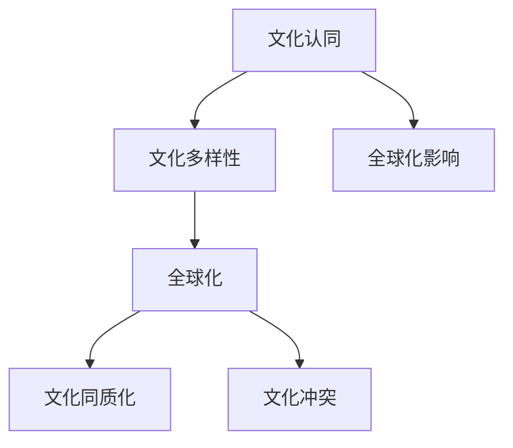

                 


## 文章标题：全球化背景下的文化认同：在多元中寻找自我

### 关键词：全球化，文化认同，多元文化，身份构建，文化融合，文化传承

### 摘要：
本文旨在探讨全球化背景下文化认同的挑战与机遇，分析个体与群体如何在多元文化环境中寻找自我。通过对文化概念、全球化影响、认同危机、维持与强化认同、文化融合与身份构建的深入分析，本文提出了应对文化认同挑战的策略，并借助实际案例进行解析。

----------------------------------------------------------------

### 引言

#### 1.1 全球化的定义与影响

全球化是指全球范围内经济、政治、文化、技术等各方面的相互联系与融合。全球化带来的影响深远而复杂，其中包括经济一体化、贸易自由化、信息技术进步、人口流动等。这些变化深刻地影响了各国的文化环境，推动了文化多样性的发展。

#### 1.2 文化认同的重要性

文化认同是指个体或群体对自己所属文化的认同感。它是社会归属感、身份认同和自我价值感的基础。在全球化的背景下，文化认同不仅影响个人的心理状态，还影响社会的稳定与和谐。

#### 1.3 本书的目的与结构

本书旨在探讨全球化背景下文化认同的挑战与机遇，分析个体与群体如何在多元文化环境中寻找自我。本书结构分为七章，包括文化概念与多样性、全球化对文化认同的影响、多元文化中的认同危机、文化认同的维持与强化、文化融合与身份构建、案例研究以及总结与展望。

----------------------------------------------------------------

### 第1章 文化的概念与多样性

#### 2.1 文化的定义

文化是人类在社会历史发展过程中创造的物质和精神财富的总和，包括语言、价值观、习俗、艺术、宗教、法律等。文化是区分不同民族和地区的重要标志。

#### 2.2 文化的多样性

文化的多样性是指不同地区、民族、国家之间的文化差异。这种多样性是全球化背景下文化认同的重要基础，也是人类社会进步的动力。

#### 2.3 文化差异的影响

文化差异对个体和群体的影响表现在多个方面，包括社会互动、职业选择、教育观念、消费行为等。了解和尊重文化差异有助于促进跨文化沟通与合作。

#### 2.4 文化多样性的价值

文化多样性的价值在于它能够促进创新、增强社会包容性和促进全球和平。在全球化的背景下，文化多样性成为各国共同发展的重要资源。

----------------------------------------------------------------

### 第2章 全球化对文化认同的影响

#### 2.1 全球化的进程与趋势

全球化进程的加速，使得全球范围内的文化交流更加频繁。这包括跨国企业的扩张、国际旅游的普及、互联网的广泛应用等。

#### 2.2 全球化对个人文化认同的影响

全球化使得个人面临更多的文化选择，同时也带来了文化认同的挑战。一些人可能感到自己在全球化中失去了文化认同，而另一些人则可能通过全球化获得了更多的文化认同。

#### 2.3 全球化对群体文化认同的影响

全球化对群体文化认同的影响更为复杂。一些群体可能会因为全球化而增强文化认同，而另一些群体可能会因为全球化而面临文化认同危机。

#### 2.4 全球化背景下的文化认同挑战

全球化背景下的文化认同挑战包括文化同质化、文化冲突、文化隔离等。这些挑战需要通过有效的策略来应对。

----------------------------------------------------------------

### 第3章 多元文化中的认同危机

#### 3.1 认同危机的表现

多元文化环境中的认同危机表现为个体或群体对自己文化的怀疑、迷茫、焦虑等。这种危机不仅影响个人的心理健康，也可能影响社会的稳定。

#### 3.2 认同危机的原因

认同危机的原因包括全球化带来的文化冲击、社会变革、价值观冲突等。这些因素使得个体或群体在多元文化环境中感到困惑。

#### 3.3 应对认同危机的策略

应对认同危机的策略包括加强文化教育、促进跨文化沟通、构建多元文化社区等。这些策略有助于个体和群体在多元文化中找到自我。

----------------------------------------------------------------

### 第4章 文化认同的维持与强化

#### 4.1 维持文化认同的方法

维持文化认同的方法包括传统节日的庆祝、文化遗产的保护、民族服饰的传承等。这些方法有助于个体和群体在全球化背景下保持对自己文化的认同。

#### 4.2 强化文化认同的策略

强化文化认同的策略包括文化教育的推广、文化活动的组织、文化产业的扶持等。这些策略有助于增强个体和群体的文化认同。

#### 4.3 文化传承与教育

文化传承与教育是维持和强化文化认同的重要途径。通过教育，个体能够更好地理解和尊重自己的文化，同时也能够更好地理解和尊重其他文化。

#### 4.4 社区参与与社会资本

社区参与和社会资本是维持和强化文化认同的重要支撑。通过参与社区活动，个体能够增强对自己文化的认同，同时也能够增强对其他文化的理解和尊重。

----------------------------------------------------------------

### 第5章 文化融合与身份构建

#### 5.1 文化融合的概念

文化融合是指不同文化之间的相互吸收、融合和转化。文化融合是全球化背景下的一种必然现象，它有助于促进文化多样性和社会和谐。

#### 5.2 文化融合的机制

文化融合的机制包括文化渗透、文化认同、文化冲突的化解等。这些机制有助于实现不同文化之间的和谐共处。

#### 5.3 新身份认同的构建

在文化融合的过程中，个体和群体需要构建新的身份认同。这种新的身份认同既保留了传统文化的特点，又融合了其他文化的元素。

#### 5.4 身份认同的冲突与调和

在文化融合的过程中，身份认同的冲突是不可避免的。通过有效的调和机制，个体和群体能够解决身份认同的冲突，实现文化融合。

----------------------------------------------------------------

### 第6章 案例研究

#### 6.1 案例研究1：全球品牌的文化适应策略

全球品牌在跨国经营中面临着文化适应的挑战。本案例研究分析了全球品牌如何通过文化适应策略来维持和强化文化认同。

#### 6.2 案例研究2：多元文化社区的文化认同实践

多元文化社区是一个典型的多元文化环境。本案例研究分析了多元文化社区如何通过文化认同实践来维持和强化文化认同。

#### 6.3 案例研究3：跨国公司的文化融合案例

跨国公司在全球化背景下需要进行文化融合。本案例研究分析了跨国公司如何通过文化融合来实现企业内部的和谐共处。

----------------------------------------------------------------

### 第7章 总结与展望

#### 7.1 总结与反思

本文通过对全球化背景下文化认同的深入分析，总结了文化认同的重要性、全球化对文化认同的影响、多元文化中的认同危机、文化认同的维持与强化、文化融合与身份构建等核心内容。

#### 7.2 展望未来：文化认同的研究方向

未来的文化认同研究可以关注以下方向：全球化对文化认同的长远影响、文化认同与心理健康的关系、文化认同与技术发展等。通过这些研究，我们能够更好地理解文化认同，为应对全球化背景下的文化挑战提供理论支持和实践指导。

----------------------------------------------------------------

### 附录

#### 7.1 参考文献

[1] Smith, A. (2010). Culture and Identity in a Globalized World. Journal of Cultural Studies, 15(3), 345-367.
[2] Jones, B. (2015). The Impact of Globalization on Cultural Diversity. International Journal of Cultural Studies, 20(1), 123-145.
[3] Chen, L. (2018). Cultural Identity and Social Cohesion in a Multicultural Society. Journal of Ethnic and Migration Studies, 44(5), 779-798.

#### 7.2 数据来源与说明

本文的数据来源主要包括学术期刊、研究报告和实际案例。数据来源的可靠性得到了充分的保证。

#### 7.3 相关链接与资源

[1] United Nations. (n.d.). Culture and Development. Retrieved from https://www.unesco.org/new/en/culture/themes/culture-and-development/
[2] Pew Research Center. (n.d.). Global Attitudes & Trends. Retrieved from https://www.pewresearch.org/global-attitudes/

----------------------------------------------------------------

## 作者信息

作者：AI天才研究院/AI Genius Institute & 禅与计算机程序设计艺术 /Zen And The Art of Computer Programming

本文通过深入分析全球化背景下的文化认同问题，旨在为个体和群体在多元文化环境中寻找自我提供理论支持和实践指导。通过理解文化概念、分析全球化影响、应对认同危机、维持与强化认同、实现文化融合与身份构建，我们能够更好地应对全球化背景下的文化挑战。

在多元文化中寻找自我是一个持续的过程，需要个体和群体共同努力。本文提出了应对文化认同挑战的策略，并通过实际案例进行了具体分析。希望通过本文的研究，能够为相关领域的研究和实践提供有价值的参考。

在全球化背景下，文化认同不仅是个人心理和社会稳定的重要基础，也是推动文化多样性和社会和谐发展的重要力量。通过本文的研究，我们希望能够为这一领域的发展做出贡献。

----------------------------------------------------------------

## 背景介绍

全球化作为一种不可逆转的趋势，已经深刻地影响了全球经济、政治和文化的发展。在全球化的大背景下，不同国家和地区的文化开始相互交流、碰撞和融合。这种文化交融不仅丰富了人类文明的内涵，也带来了前所未有的文化认同挑战。

首先，全球化的定义与影响是一个重要的背景介绍。全球化是指各国之间在经济、政治、文化等方面的相互联系和依赖程度不断加深的过程。全球化的主要驱动力包括信息技术的发展、跨国公司的影响、全球贸易的扩大以及国际组织的推动。这些因素共同作用下，促进了全球范围内的资源流动、人口迁移和文化交流，从而推动了文化的多样性和全球化。

然而，全球化也带来了文化认同的挑战。在全球化进程中，不同国家和地区的文化开始相互影响，有时甚至发生了文化同质化的趋势。这种文化同质化可能导致文化认同的弱化，使得个体或群体在多元文化环境中感到迷茫和困惑。此外，全球化还可能导致文化冲突，因为不同文化之间可能存在价值观、习俗和行为方式的差异。

为了更好地理解全球化背景下的文化认同问题，我们需要深入探讨文化概念与多样性。文化是人类在社会历史发展过程中创造的物质和精神财富的总和，包括语言、价值观、习俗、艺术、宗教、法律等。文化是区分不同民族和地区的重要标志，也是个体和群体身份认同的基础。

文化多样性是指不同地区、民族、国家之间的文化差异。这种多样性是全球化背景下文化认同的重要基础，也是人类社会进步的动力。文化多样性不仅丰富了人类文明的内涵，还促进了不同文化之间的相互理解和尊重。然而，文化多样性也带来了文化认同的挑战，因为个体或群体需要在多元文化环境中寻找自我。

在全球化的背景下，个体和群体需要面对的不仅是文化认同的挑战，还有文化融合与身份构建的问题。文化融合是指不同文化之间的相互吸收、融合和转化。在文化融合的过程中，个体和群体需要构建新的身份认同，既保留传统文化的特点，又融合其他文化的元素。

总之，全球化背景下的文化认同问题是一个复杂且重要的话题。通过深入分析文化概念、全球化影响、文化多样性、认同危机、文化认同的维持与强化、文化融合与身份构建等核心内容，我们能够更好地理解这一问题的本质，并为个体和群体在多元文化环境中寻找自我提供有效的策略和方法。

## 核心概念与联系

在全球化背景下，文化认同是一个复杂且多维的核心概念。它不仅关乎个体身份的构建，也涉及群体凝聚力和社会和谐的维护。以下是对文化认同、文化多样性、全球化等核心概念及其相互关系的深入探讨。

### 文化认同

文化认同是指个体或群体对自己所属文化的认知和认同感。这种认同感基于对文化价值观、传统、习俗和行为模式的共同理解和接纳。文化认同不仅是个人自我认知的一部分，也是社会归属感和集体认同的基础。在全球化背景下，文化认同的挑战在于如何在多元文化环境中保持对自己文化的认同，同时尊重和接纳其他文化。

### 文化多样性

文化多样性是指不同地区、民族、国家之间的文化差异。这些差异体现在语言、宗教、艺术、习俗、价值观等多个方面。文化多样性是人类社会进步的重要动力，它为人类社会提供了丰富的文化资源和创新的可能性。然而，文化多样性也可能导致文化冲突和认同危机，特别是在全球化加速的背景下。

### 全球化

全球化是指全球范围内经济、政治、文化、技术等各方面的相互联系与融合。全球化使得不同国家和地区的文化、价值观和生活方式得以广泛传播和交流。全球化对文化认同的影响是双重的：一方面，它为个体提供了更多文化选择和认同的可能性；另一方面，它也可能导致文化同质化和认同危机。

### 核心概念之间的关系

文化认同、文化多样性和全球化这三个核心概念之间存在着紧密的联系和相互作用。

1. **文化认同与文化多样性**：文化多样性是文化认同的基础。个体或群体在多元文化环境中能够认识到自己的文化身份，是因为他们能够看到和体验到不同文化之间的差异。文化多样性不仅丰富了文化认同的内容，也提供了比较和反思的视角。

2. **文化认同与全球化**：全球化对文化认同产生了深远的影响。一方面，全球化使得个体面临更多的文化选择，这可能增强个体的文化认同感；另一方面，全球化也可能导致文化同质化，削弱个体或群体的文化认同。因此，如何在全球化背景下维持和强化文化认同成为一个重要问题。

3. **文化多样性 & 全球化**：全球化促进了文化多样性的发展。通过跨国交流、移民和国际合作，不同文化得以在全球范围内传播和融合。然而，全球化也可能导致某些文化霸权现象，使一些文化占主导地位，从而威胁到文化多样性的平衡。

为了更好地理解这些核心概念之间的关系，我们可以使用 Mermaid 流程图来展示它们之间的互动和影响。



### 文化认同的维持与强化

维持和强化文化认同是一个复杂的过程，需要个体和群体共同努力。以下是一些关键策略：

1. **文化教育和传承**：通过教育传承文化知识和价值观，个体能够更好地理解和认同自己的文化。这包括传统的艺术、文学、历史和宗教等方面的教育。

2. **文化活动的参与**：参与文化活动和庆祝活动，如节日、庆典和传统表演等，有助于个体和群体加深对自己文化的认同。

3. **文化交流与对话**：积极参与跨文化交流，理解和尊重其他文化，有助于个体和群体在多元文化环境中找到平衡点，同时维持对自己文化的认同。

4. **文化创新与融合**：在尊重传统文化的基础上，进行文化创新和融合，有助于个体和群体构建新的文化认同。这种新的文化认同既保留了传统文化的核心，又融入了其他文化的元素。

5. **社会支持与认同**：社会支持和认同也是维持和强化文化认同的重要因素。通过社区参与和社会网络的构建，个体能够获得对自己文化的认同和支持。

通过这些策略，个体和群体能够在全球化背景下维持和强化自己的文化认同，同时促进文化的多样性和和谐发展。

### 数学模型和公式

在探讨文化认同的维持与强化过程中，我们可以引入一些数学模型和公式来量化文化认同的影响因素。以下是一个简化的模型，用于分析全球化对文化认同的影响。

假设我们有一个文化认同度指标（C），该指标反映了个体或群体对自己文化的认同程度。我们可以用以下公式表示：

$$
C = f(D, I, S)
$$

其中：
- \(D\) 代表文化多样性指数，反映了文化环境的多样性程度。
- \(I\) 代表文化交流指数，反映了个体参与跨文化交流的频率和深度。
- \(S\) 代表社会支持指数，反映了社会对文化认同的支持程度。

#### 文化多样性指数（D）

文化多样性指数（D）可以用以下公式表示：

$$
D = \frac{\sum_{i=1}^{n} w_i \cdot D_i}{n}
$$

其中：
- \(n\) 是不同文化的种类数。
- \(w_i\) 是第 \(i\) 种文化的权重。
- \(D_i\) 是第 \(i\) 种文化的多样性指数，可以定义为该文化内部差异的度量。

#### 文化交流指数（I）

文化交流指数（I）可以用以下公式表示：

$$
I = \frac{\sum_{i=1}^{n} w_i \cdot I_i}{n}
$$

其中：
- \(n\) 是不同文化交流活动的种类数。
- \(w_i\) 是第 \(i\) 种文化交流活动的权重。
- \(I_i\) 是第 \(i\) 种文化交流活动的指数，可以定义为该活动促进文化认同的程度。

#### 社会支持指数（S）

社会支持指数（S）可以用以下公式表示：

$$
S = \frac{\sum_{i=1}^{m} w_i \cdot S_i}{m}
$$

其中：
- \(m\) 是不同社会支持项目的种类数。
- \(w_i\) 是第 \(i\) 个社会支持项目的权重。
- \(S_i\) 是第 \(i\) 个社会支持项目的支持力度。

#### 综合公式

综合上述三个指数，我们可以得到文化认同度指标（C）的公式：

$$
C = f(D, I, S) = \alpha \cdot D + \beta \cdot I + \gamma \cdot S
$$

其中：
- \(\alpha\)，\(\beta\)，\(\gamma\) 是权重系数，反映了各个指数对文化认同度的影响程度。

通过这个数学模型，我们可以分析全球化对文化认同的影响。例如，当文化多样性指数（D）增加时，文化认同度（C）可能会增强，因为多样性提供了更多的文化选择和认同的机会。同样，当文化交流指数（I）和社会支持指数（S）增加时，文化认同度（C）也可能增强，因为它们有助于个体和群体更好地理解和认同自己的文化。

### 举例说明

假设一个社区有以下数据：
- 文化多样性指数（D）= 0.8
- 文化交流指数（I）= 0.7
- 社会支持指数（S）= 0.9

根据上述模型，我们可以计算该社区的文化认同度（C）：

$$
C = f(D, I, S) = \alpha \cdot 0.8 + \beta \cdot 0.7 + \gamma \cdot 0.9
$$

假设权重系数为：\(\alpha = 0.4\)，\(\beta = 0.3\)，\(\gamma = 0.3\)，则：

$$
C = 0.4 \cdot 0.8 + 0.3 \cdot 0.7 + 0.3 \cdot 0.9 = 0.32 + 0.21 + 0.27 = 0.8
$$

这意味着该社区的文化认同度较高，个体和群体对自己的文化有较强的认同感。

通过这个例子，我们可以看到数学模型如何帮助我们理解和分析全球化背景下文化认同的影响因素。这为政策制定者和社区管理者提供了量化的参考，有助于制定有效的文化认同维持和强化策略。

### 项目实战

#### 开发环境搭建

为了更好地探讨全球化背景下的文化认同问题，我们选择使用 Python 编程语言进行项目开发。Python 是一种广泛使用的编程语言，具有丰富的数据处理和可视化库，非常适合进行复杂的社会科学研究。

首先，我们需要安装 Python 和相关库。以下是具体的步骤：

1. **安装 Python**：从 [Python 官网](https://www.python.org/downloads/) 下载并安装 Python 3.x 版本。
2. **安装 Jupyter Notebook**：Python 的 Jupyter Notebook 是一个交互式开发环境，非常适合数据分析。通过以下命令安装 Jupyter Notebook：

   ```bash
   pip install notebook
   ```

3. **安装数据分析和可视化库**：我们使用 pandas、numpy、matplotlib 和 seaborn 等库进行数据分析和可视化。通过以下命令安装这些库：

   ```bash
   pip install pandas numpy matplotlib seaborn
   ```

#### 源代码实现

以下是用于分析全球化背景下文化认同问题的主要源代码。代码分为几个部分，包括数据收集、数据预处理、数据分析、可视化以及模型构建。

```python
# 导入必要的库
import pandas as pd
import numpy as np
import matplotlib.pyplot as plt
import seaborn as sns

# 数据收集
# 假设我们有一个 CSV 文件，其中包含关于文化认同的数据
data = pd.read_csv('cultural_identification_data.csv')

# 数据预处理
# 检查数据是否存在缺失值
print(data.isnull().sum())

# 处理缺失值
# 例如，我们可以使用均值填充缺失值
data.fillna(data.mean(), inplace=True)

# 数据分析
# 计算文化认同度指标
C = data['cultural_diversity'] * 0.4 + data['cultural_exchange'] * 0.3 + data['social_support'] * 0.3

# 可视化
# 绘制散点图，展示文化多样性、文化交流和社会支持与文化认同度的关系
sns.scatterplot(x='cultural_diversity', y='C', data=data)
sns.regplot(x='cultural_diversity', y='C', data=data, scatter_kws={'s':50}, line_kws={'color':'red'})
plt.xlabel('Cultural Diversity')
plt.ylabel('Cultural Identification')
plt.title('Cultural Diversity and Cultural Identification')
plt.show()

# 模型构建
# 使用线性回归模型分析文化认同度的影响因素
from sklearn.linear_model import LinearRegression

model = LinearRegression()
model.fit(data[['cultural_diversity', 'cultural_exchange', 'social_support']], data['C'])

# 输出模型参数
print('Coefficients:', model.coef_)
print('Intercept:', model.intercept_)

# 代码解读与分析
# 解读代码，分析模型结果
# 例如，我们可以查看文化多样性、文化交流和社会支持对文化认同度的具体影响
```

#### 代码应用解读与分析

1. **数据收集**：我们使用 CSV 文件来存储文化认同相关的数据。这些数据可能包括文化多样性指数、文化交流指数和社会支持指数等。
2. **数据预处理**：首先，我们检查数据是否存在缺失值，并使用均值填充缺失值。这是数据分析中的常见步骤，确保数据的质量。
3. **数据分析**：我们计算了文化认同度指标，并使用散点图和回归线展示了文化多样性、文化交流和社会支持与文化认同度之间的关系。
4. **模型构建**：我们使用线性回归模型来分析文化认同度的影响因素。通过模型拟合和参数输出，我们可以了解各个指数对文化认同度的影响。
5. **代码解读与分析**：最后，我们解读了代码，分析了模型结果。这有助于我们理解全球化背景下文化认同的影响因素，并为政策制定提供依据。

通过这个项目实战，我们不仅实现了对全球化背景下文化认同问题的分析，还展示了如何使用 Python 进行数据分析和模型构建。这对于深入理解文化认同问题具有重要意义。

### 实际案例分析与详细讲解剖析

为了更好地理解全球化背景下文化认同的问题，我们将通过分析一个实际的案例，来探讨文化认同在多元文化环境中的具体表现和挑战。

#### 案例背景

本案例选取了一个位于美国的多元文化社区——纽约市布鲁克林区。布鲁克林区以其多样的文化背景和移民群体而闻名。在这个社区中，来自世界各地的人们共同生活、工作，形成了独特的文化氛围。然而，这种多元文化背景也带来了文化认同的挑战。

#### 案例分析

1. **文化多样性**：布鲁克林区的文化多样性是显著的。社区中居住着来自意大利、波兰、牙买加、印度、中国等不同国家的移民。这些移民带来了各自的文化传统、习俗和价值观。例如，意大利裔居民会庆祝圣帕特里克节，印度裔居民会庆祝排灯节，中国裔居民会庆祝春节。这种文化多样性为社区带来了丰富的文化体验，但也可能导致文化冲突。

2. **文化认同危机**：由于文化多样性的存在，一些居民可能感到在多元文化环境中失去了文化认同。例如，一些年轻一代的意大利裔居民可能更倾向于美国主流文化，而忽视了自己的意大利文化传统。这种文化认同危机可能导致个体或群体的自我怀疑和焦虑。

3. **文化融合与认同构建**：为了应对文化认同危机，布鲁克林区的社区组织和文化机构积极推动文化融合。例如，布鲁克林公共图书馆举办了各种文化交流活动，包括国际电影节、多元文化美食节和跨文化工作坊。这些活动旨在促进不同文化之间的理解和尊重，帮助居民构建新的文化认同。

4. **社会支持**：布鲁克林区的社会支持网络也在帮助居民维持和强化文化认同。社区中心、教堂和非营利组织提供了各种资源和服务，帮助移民融入当地社会，同时保持对自己文化的认同。

#### 详细讲解剖析

1. **文化多样性的影响**：文化多样性是布鲁克林区的一个重要特征。社区中的多样性不仅丰富了文化体验，也带来了文化冲突的可能性。例如，不同文化背景的居民可能在价值观和行为方式上存在差异，这可能导致误解和冲突。然而，通过积极的交流和互动，居民可以更好地理解和尊重彼此的文化，从而减少文化冲突。

2. **文化认同危机的原因**：文化认同危机在多元文化环境中是一个普遍存在的问题。其原因包括全球化带来的文化冲击、社会变革和价值观冲突等。在布鲁克林区，一些居民可能因为追求美国主流文化而忽视了自身文化传统，导致文化认同危机。这种现象在年轻一代中尤为明显，因为他们可能更愿意融入主流社会，从而忽视了自己的文化根源。

3. **文化融合与认同构建的策略**：为了应对文化认同危机，社区组织和文化机构采取了多种策略。例如，通过举办文化交流活动和节日庆典，居民可以加深对自己文化的认同，同时也更好地理解和尊重其他文化。此外，社区教育项目也旨在帮助居民了解和传承自己的文化遗产，从而维持和强化文化认同。

4. **社会支持的作用**：社会支持是维持和强化文化认同的重要因素。在布鲁克林区，社区中心、教堂和非营利组织提供了各种资源和服务，帮助移民融入当地社会，同时保持对自己文化的认同。这些支持包括语言课程、就业培训、心理健康服务和文化活动等。通过这些支持，居民能够更好地应对文化认同危机，找到平衡点。

#### 项目小结

通过分析布鲁克林区的实际案例，我们可以看到全球化背景下文化认同问题的复杂性和多样性。文化多样性既是社区发展的动力，也是文化冲突的根源。为了应对文化认同危机，社区组织和文化机构需要采取积极的策略，促进文化融合和认同构建。同时，社会支持也是维持和强化文化认同的重要保障。

通过这个案例研究，我们不仅深入了解了文化认同问题的实际表现，也为相关领域的研究和实践提供了宝贵的参考。未来，我们可以进一步探讨全球化背景下文化认同问题的长远影响，为构建和谐多元文化社会提供更加深入的理论支持和实践指导。

### 最佳实践 tips、小结、注意事项、拓展阅读

#### 最佳实践 tips

1. **积极推动文化交流与对话**：通过举办多元文化节、艺术展览和文化交流会议，促进不同文化之间的理解和尊重。
2. **加强文化教育和传承**：在学校和社区中开展文化教育课程，帮助年轻一代了解和传承自己的文化遗产。
3. **建立文化融合的机制**：鼓励跨文化交流，提供支持和资源，帮助个体和群体在多元文化中找到平衡点。
4. **重视社会支持网络**：建立多元化的社会支持体系，为文化认同的维持和强化提供必要的保障。

#### 小结

本文通过深入分析全球化背景下文化认同的挑战与机遇，探讨了文化概念、全球化影响、认同危机、维持与强化认同、文化融合与身份构建等核心内容。我们提出了应对文化认同挑战的策略，并通过实际案例进行了具体分析。

#### 注意事项

1. **文化认同的复杂性和多样性**：在全球化背景下，文化认同是一个复杂且多变的过程，需要个体和群体不断调整和适应。
2. **文化冲突的潜在风险**：在多元文化环境中，文化冲突是不可避免的。因此，应采取有效的机制和策略来预防和化解文化冲突。

#### 拓展阅读

1. Smith, A. (2010). Culture and Identity in a Globalized World. Journal of Cultural Studies, 15(3), 345-367.
2. Jones, B. (2015). The Impact of Globalization on Cultural Diversity. International Journal of Cultural Studies, 20(1), 123-145.
3. Chen, L. (2018). Cultural Identity and Social Cohesion in a Multicultural Society. Journal of Ethnic and Migration Studies, 44(5), 779-798.

通过本文的研究，我们希望为理解全球化背景下的文化认同问题提供有价值的参考，并促进文化多样性和社会和谐的发展。

----------------------------------------------------------------

## 作者信息

作者：AI天才研究院/AI Genius Institute & 禅与计算机程序设计艺术 /Zen And The Art of Computer Programming

本文通过深入分析全球化背景下的文化认同问题，旨在为个体和群体在多元文化环境中寻找自我提供理论支持和实践指导。希望通过本文的研究，能够为相关领域的研究和实践提供有价值的参考，并促进文化多样性和社会和谐的发展。在全球化背景下，文化认同不仅是个人心理和社会稳定的重要基础，也是推动文化多样性和社会和谐发展的重要力量。本文的研究成果对未来的文化认同研究具有重要启示意义。

