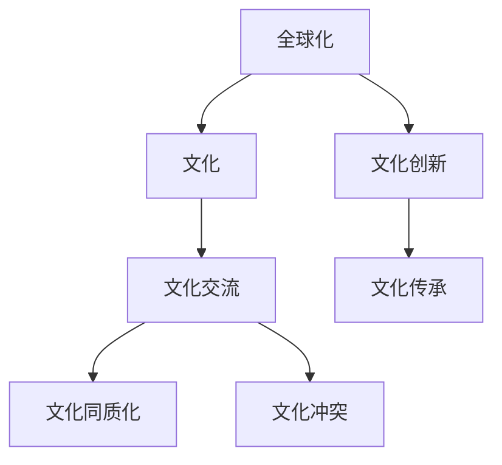

                 

### 文章标题

# 全球化背景下的文化认同：统一与多样性的平衡

全球化作为当今世界发展的主要趋势，深刻影响着各个国家和地区的政治、经济、文化等方面。在这一背景下，文化认同问题日益凸显，成为国际社会关注的焦点。本文旨在探讨全球化背景下文化认同的统一与多样性的平衡问题，分析其内涵、重要性及面临的挑战，并提出相应的对策。

## 文章关键词

- 全球化
- 文化认同
- 统一与多样性
- 文化冲突
- 文化融合

## 摘要

全球化推动了各国之间的文化交流与互动，同时也带来了文化认同的挑战。如何在全球化进程中实现文化认同的统一与多样性的平衡，成为当前国际社会亟待解决的问题。本文首先分析了全球化的定义及其对文化的影响，然后探讨了文化认同的概念及其在全球化背景下的重要性。接着，文章阐述了统一与多样性的辩证关系，并分析了全球化对文化认同的影响。在此基础上，文章提出了文化认同面临的挑战及应对策略，最后通过案例分析总结了全球化背景下文化认同的实践经验和启示。本文旨在为文化认同问题的解决提供理论指导和实践参考。

### 引言

#### 1.1 全球化浪潮下的文化环境

全球化是一个复杂且多维度的过程，它不仅涉及经济和技术的交流，还涵盖了文化的传播与融合。全球化浪潮始于20世纪末，随着信息技术的迅猛发展、跨国公司的崛起以及国际贸易的加深，文化在全球范围内的传播速度和影响力前所未有。在这一过程中，各国文化开始相互碰撞、借鉴和融合，形成了独特的文化环境。

全球化对文化环境的影响主要体现在以下几个方面：

1. **文化交流与传播**：全球化打破了地理和文化的壁垒，使得不同文化之间的交流更加频繁和便捷。通过互联网、媒体、旅游等途径，文化产品如电影、音乐、艺术等在全球范围内迅速传播，促进了文化的多样性和丰富性。
   
2. **文化同质化**：随着全球化进程的推进，一些西方文化元素在全球范围内占据主导地位，导致了文化同质化现象的出现。这种现象在一定程度上削弱了地方文化的独特性和多样性。

3. **文化冲突与融合**：全球化带来的文化交流和互动，既促进了文化的融合，也引发了文化冲突。不同文化之间的价值观、信仰和行为方式的差异，往往会导致误解和矛盾，甚至引发冲突。

#### 1.2 文化认同的重要性

文化认同是指个体或群体对自己所属文化的认同和归属感。在全球化的背景下，文化认同具有重要意义，主要体现在以下几个方面：

1. **个体认同**：文化认同有助于个体建立自我认同，增强个人的自信心和归属感。个体通过认同自己的文化，可以找到自己的文化根源，从而更好地理解和面对外部世界的挑战。

2. **社会凝聚**：文化认同是社会团结和稳定的重要基础。一个社会如果成员对共同文化有认同，将更容易形成共识，促进社会的和谐发展。

3. **国家战略**：文化认同是国家软实力的重要组成部分。一个国家如果能够保持和弘扬自己的文化特色，将有助于提升国家的国际形象和影响力。

#### 1.3 本书的目的与结构

本书旨在深入探讨全球化背景下文化认同的统一与多样性的平衡问题。具体目标包括：

1. **理解全球化对文化认同的影响**：分析全球化进程中的文化环境变化，探讨全球化对文化认同带来的机遇与挑战。

2. **探讨文化认同的核心概念**：明确文化认同的定义、内涵和影响因素，为后续分析提供理论基础。

3. **分析统一与多样性的关系**：探讨统一与多样性的辩证关系，提出在全球化背景下实现统一与多样性平衡的策略。

4. **提出文化认同的应对策略**：结合实际案例，分析文化认同面临的挑战及应对策略，为政策制定者和实践者提供参考。

全书分为七个章节，具体结构如下：

- **第一章**：全球化与文化的定义和关系，介绍全球化的定义、发展历程及其对文化的影响。
- **第二章**：文化认同的概念和重要性，探讨文化认同的定义、核心要素及其在个体和社会层面的重要性。
- **第三章**：统一与多样性的关系，分析统一与多样性的辩证关系，探讨如何实现二者的平衡。
- **第四章**：全球化对文化认同的影响，分析全球化对文化认同的正面和负面影响。
- **第五章**：文化认同的挑战与应对，探讨文化认同面临的挑战及应对策略。
- **第六章**：案例分析，通过具体案例展示文化认同的实际应用和挑战。
- **第七章**：结论与展望，总结全书的主要观点，对未来的发展方向提出建议。

### 第一章：全球化与文化的定义和关系

#### 1.1 全球化的定义与发展

全球化是一个复杂且多层面的过程，它涉及经济、政治、文化等多个领域。简单来说，全球化是指各国在经济、政治、文化等方面的日益紧密联系和互动。全球化的概念最早可以追溯到19世纪末20世纪初，随着国际贸易和资本流动的增加，各国之间的联系逐渐加强。然而，现代意义上的全球化主要是在20世纪末随着信息技术和交通运输的发展而加速推进的。

全球化的发展可以分为以下几个阶段：

1. **初始阶段（19世纪末-20世纪中叶）**：这一阶段的全球化主要表现为国际贸易和资本流动的增加，各国开始通过贸易和投资相互联系。

2. **加速阶段（20世纪后半叶）**：随着信息技术和交通运输的快速发展，全球化进程加速。跨国公司崛起，全球化的经济效应更加显著。

3. **深化阶段（20世纪末至今）**：这一阶段的全球化不仅体现在经济领域，还扩展到了政治、文化等多个层面。全球治理、跨国合作、文化交流等成为全球化的重要内容。

#### 1.2 全球化的主要驱动力

全球化的主要驱动力包括以下几个方面：

1. **经济全球化**：经济全球化是全球化进程的核心驱动力。跨国公司通过投资、生产和销售全球化，促进了全球经济的紧密联系。同时，国际贸易的自由化和全球化金融市场的发展，也加速了全球化的进程。

2. **技术进步**：信息技术和交通运输的进步是全球化的重要推动力。互联网的普及和电子商务的发展，使得信息传输和交流更加便捷，跨国贸易和合作更加高效。同时，高速交通网络的建设，如高速公路、高铁和航空网络，也大大缩短了各国之间的距离。

3. **政策支持**：政府政策的支持和国际合作也是全球化的重要驱动力。许多国家通过签订自由贸易协定、加入国际组织和推进区域一体化，促进了全球化的进程。

4. **人口流动**：全球化也伴随着人口流动的增加。大量人口通过移民、留学、旅游等方式跨越国界，促进了不同文化之间的交流和融合。

#### 1.3 全球化对文化的影响

全球化对文化的影响是深远且复杂的，它既促进了文化的融合，也带来了文化的冲突。具体来说，全球化对文化的影响主要表现在以下几个方面：

1. **文化交流与传播**：全球化使得各国文化之间的交流更加频繁和便捷。通过互联网、媒体、旅游等途径，文化产品如电影、音乐、艺术等在全球范围内迅速传播。这种文化交流不仅丰富了人们的生活，也促进了文化的多样性和丰富性。

2. **文化同质化**：全球化也带来了一定的文化同质化现象。一些西方文化元素在全球范围内占据主导地位，导致了文化同质化现象的出现。这种现象在一定程度上削弱了地方文化的独特性和多样性。

3. **文化冲突**：全球化过程中的文化交流和互动，既促进了文化的融合，也引发了文化冲突。不同文化之间的价值观、信仰和行为方式的差异，往往会导致误解和矛盾，甚至引发冲突。

4. **文化创新**：全球化也为文化创新提供了新的机遇。不同文化之间的交流与融合，激发了文化的创新和变革，产生了许多新的文化形式和艺术作品。

#### 1.4 全球化与文化的辩证关系

全球化与文化的辩证关系表现在以下几个方面：

1. **相互促进**：全球化促进了文化的传播与融合，同时也为文化的创新提供了新的机遇。全球化与文化的相互促进，使得文化更加多样化和丰富。

2. **相互制约**：全球化也带来了一定的文化同质化现象和文化冲突。文化同质化削弱了地方文化的独特性，而文化冲突则可能导致社会的不稳定。

3. **动态平衡**：全球化与文化的辩证关系是一个动态平衡的过程。在全球化的进程中，各国需要通过有效的政策和措施，平衡文化的多样性与同质性，促进文化的创新与传承。

#### 1.5 全球化与文化的关系架构

为了更清晰地展示全球化与文化的关系，我们可以使用Mermaid流程图来描述。以下是一个简单的Mermaid流程图示例：

在这个流程图中，全球化作为主要驱动因素，影响了文化的交流、同质化、冲突和创新。通过这个流程图，我们可以更直观地理解全球化与文化的复杂关系。

#### 1.6 全球化对文化认同的影响

全球化对文化认同的影响是双重的，既有积极的方面，也有消极的方面。

1. **积极影响**：
   - **增强文化认同感**：全球化使得人们更加了解其他文化，从而增强了对自己文化的认同感。通过文化交流，个体可以更好地认识自己的文化特征和价值。
   - **促进文化多元化**：全球化带来了不同文化的交流与融合，促进了文化的多元化。这有助于丰富人们的精神世界，提高社会的文化多样性。

2. **消极影响**：
   - **文化同质化**：全球化可能导致一些文化元素被同化，削弱了地方文化的独特性和多样性。这可能导致文化认同的减弱，甚至消失。
   - **文化冲突**：全球化过程中的文化交流和互动，可能会引发文化冲突。不同文化之间的价值观和行为方式的差异，可能导致误解和矛盾，甚至引发冲突。

#### 1.7 全球化背景下文化认同的挑战与应对

在全球化的背景下，文化认同面临着一系列挑战，主要包括：

1. **文化同质化**：如何防止文化同质化，保持文化的多样性，是全球化背景下文化认同面临的一个重要挑战。应对策略包括加强文化教育和推广，提高公众对文化多样性的认识。

2. **文化冲突**：如何处理不同文化之间的冲突，促进文化之间的和谐与融合，是另一个重要挑战。应对策略包括促进文化交流，增进相互理解，以及建立文化对话机制。

3. **文化保护**：如何保护地方文化，防止其被全球化所淹没，也是全球化背景下文化认同面临的一个挑战。应对策略包括制定相关政策，保护文化遗产，以及推动文化创新。

通过上述分析，我们可以看出，全球化对文化认同有着深远的影响。在全球化的背景下，如何实现文化认同的统一与多样性的平衡，是国际社会共同面临的问题。通过有效的政策和措施，我们可以应对全球化带来的挑战，促进文化认同的建设与发展。

### 第二章：文化认同的概念和重要性

#### 2.1 文化认同的定义

文化认同是指个体或群体对其所属文化的认同和归属感。文化认同不仅涉及对文化的认知，还包括对文化价值观、信仰、习俗、传统等的接受和传承。文化认同是个人身份和社会认同的重要组成部分，它影响着个体的行为、态度和价值观念。

文化认同的定义可以从以下几个方面进行解释：

1. **文化认同的主体**：文化认同的主体可以是个人、群体或社会。个体通过文化认同来建立自我认同，群体通过文化认同来增强社会凝聚力，而社会则通过文化认同来形成共同价值观。

2. **文化认同的内容**：文化认同的内容包括对文化价值观、信仰、习俗、传统等的认同。这些文化元素构成了文化认同的核心，是文化认同的基础。

3. **文化认同的作用**：文化认同在个体的心理、社会和文化层面发挥着重要作用。在心理层面，文化认同有助于增强个体的自信心和归属感；在社会层面，文化认同有助于增强社会的凝聚力和稳定性；在文化层面，文化认同有助于传承和弘扬文化。

#### 2.2 文化认同的核心要素

文化认同的核心要素包括以下几个方面：

1. **文化价值观**：文化价值观是文化认同的核心，它反映了文化的精神内核和价值取向。文化价值观包括道德观念、人生观、世界观等，它们在文化认同中起着重要的指导作用。

2. **文化传统**：文化传统是文化认同的重要基础，它包括历史、习俗、传统节日、文化遗产等。文化传统不仅传递了文化的记忆，也塑造了文化认同。

3. **文化习俗**：文化习俗是文化认同的具体表现，它包括日常生活中的行为规范、礼仪习惯等。文化习俗是文化认同的外在表现形式，是文化认同的具体体现。

4. **文化认同感**：文化认同感是指个体或群体对自身文化的认同和归属感。文化认同感是文化认同的核心，它直接影响个体的行为和态度。

#### 2.3 文化认同与个体认同的关系

文化认同与个体认同之间存在密切的关系。个体认同是指个体对自身身份的认同，它包括对个人身份、角色和价值的认同。文化认同与个体认同的关系可以从以下几个方面进行阐述：

1. **文化认同是个体认同的基础**：个体认同是在文化认同的基础上形成的。个体通过认同自己的文化，来建立自己的身份和角色。文化认同为个体认同提供了基础和方向。

2. **个体认同反映文化认同**：个体认同反映了一个体对自身文化的认同程度。一个对自身文化高度认同的个体，通常具有强烈的个体认同感。

3. **文化认同与个体认同的互动**：文化认同与个体认同之间是互动的关系。文化认同会影响个体认同的形成和发展，而个体认同又会影响文化认同的内涵和表现。

#### 2.4 文化认同的重要性

文化认同在个体、社会和国家层面都具有重要意义：

1. **个体层面**：文化认同有助于个体建立自我认同，增强自信心和归属感。文化认同为个体提供了身份和归属感，使个体在复杂多变的社会中找到自己的位置。

2. **社会层面**：文化认同是社会凝聚力和稳定性的基础。文化认同能够增强社会成员之间的联系，促进社会团结和合作。一个具有强烈文化认同感的社会，通常更加和谐稳定。

3. **国家层面**：文化认同是国家软实力的重要组成部分。一个国家如果能够保持和弘扬自己的文化特色，将有助于提升国家的国际形象和影响力。文化认同也是国家文化战略的重要方向。

#### 2.5 文化认同的多元性

文化认同具有多元性，它不仅包括对本文化的认同，还包括对其他文化的尊重和包容。文化认同的多元性体现在以下几个方面：

1. **多元文化认同**：在一个多元文化的社会中，个体可能同时认同多个文化。例如，一个移民可能在认同自己的民族文化的同时，也认同所居住国的文化。

2. **文化相对主义**：文化相对主义认为，每种文化都有其独特的价值和意义，没有一种文化可以称为“优越”或“正确”。文化相对主义强调对各种文化的尊重和包容。

3. **文化融合**：文化融合是指不同文化在相互交流中，相互吸收、借鉴，形成新的文化。文化融合是文化认同多元性的重要表现，它促进了文化的多样性和丰富性。

#### 2.6 文化认同的构建与传承

文化认同的构建与传承是一个长期而复杂的过程，它需要社会各界的共同努力。以下是一些关键点：

1. **文化教育**：文化教育是构建文化认同的重要手段。通过教育，个体可以了解和认同自己的文化，同时也能理解和尊重其他文化。

2. **文化传播**：文化传播是文化认同构建的重要途径。通过媒体、网络、艺术等形式，文化可以在更广泛的范围内传播，增强人们对文化的认同感。

3. **文化遗产保护**：文化遗产保护是文化认同传承的重要任务。保护文化遗产，不仅是对历史的尊重，也是对文化的传承。

4. **文化创新**：文化创新是文化认同发展的重要动力。在保持文化传统的基础上，文化创新可以推动文化的繁荣和发展。

通过上述分析，我们可以看到，文化认同在个体和社会层面具有重要意义。在全球化的背景下，如何构建和传承文化认同，实现文化认同的统一与多样性的平衡，是国际社会共同面临的问题。通过有效的政策和措施，我们可以促进文化认同的建设与发展，增强社会的凝聚力和稳定性。

### 第三章：统一与多样性的关系

#### 3.1 统一与多样性的辩证关系

统一与多样性是全球化背景下文化认同的两个重要方面，它们既有对立性，又有统一性。理解统一与多样性的辩证关系，有助于我们更好地应对全球化带来的挑战，实现文化认同的平衡与发展。

1. **对立性**：
   - **统一性**强调一致性、一致性和标准化，追求一种共同的价值观和行为准则。
   - **多样性**则强调差异性和独特性，尊重各种文化传统和个体差异。

2. **统一性**的优点包括：
   - **提高效率**：通过统一标准，可以简化流程，提高工作效率。
   - **促进合作**：统一的价值观和行为准则有助于团队协作和项目推进。

3. **多样性**的优点包括：
   - **创新与创造力**：多样性可以激发创新思维，推动文化创新和艺术创作。
   - **文化传承**：多样性有助于保护和传承各种文化传统，维护文化多样性。

4. **统一性**的挑战包括：
   - **文化同质化**：过度追求统一可能导致文化同质化，削弱地方文化的独特性。
   - **文化冲突**：统一性可能引发文化冲突，加剧不同文化之间的矛盾。

5. **多样性**的挑战包括：
   - **文化差异**：多样性可能导致文化差异，增加社会冲突和不稳定。
   - **管理难度**：多样性管理难度大，需要更多资源和精力来处理文化差异。

#### 3.2 平衡统一与多样性的挑战

在全球化背景下，实现统一与多样性的平衡是一个复杂的过程，面临着诸多挑战：

1. **文化同质化**：全球化进程中，一些西方文化元素占据主导地位，导致文化同质化现象加剧。这削弱了地方文化的独特性，影响了文化认同。

2. **文化冲突**：全球化加速了文化之间的交流，但同时也带来了文化冲突。不同文化之间的价值观和行为方式的差异，可能导致误解和矛盾。

3. **文化保护与传承**：如何在保持多样性的同时，保护和传承各种文化传统，是一个重要挑战。文化多样性的保护需要有效的政策和措施。

4. **文化教育**：如何通过文化教育，提高公众对文化多样性的认识和理解，是一个关键问题。文化教育有助于促进文化认同的建设。

#### 3.3 实现统一与多样性平衡的策略

为了实现统一与多样性的平衡，我们可以采取以下策略：

1. **文化包容与尊重**：倡导文化包容和尊重，鼓励不同文化之间的交流与对话，减少文化冲突。

2. **文化教育**：加强文化教育，提高公众对文化多样性的认识和理解，增强文化认同感。

3. **政策支持**：制定相关政策，支持文化多样性的保护与传承，推动文化创新与发展。

4. **文化交流**：促进文化交流，通过艺术、文学、音乐等形式，增强文化之间的互动和了解。

5. **文化创新**：鼓励文化创新，推动文化传统与现代元素的融合，促进文化的繁荣与发展。

#### 3.4 统一与多样性平衡的实践案例

以下是几个实现统一与多样性平衡的实践案例：

1. **新加坡**：新加坡是一个多元文化的国家，通过文化包容政策和多元文化教育，实现了文化认同的统一与多样性的平衡。

2. **印度**：印度通过多元文化政策，尊重和保护各种文化传统，促进了文化的多样性发展。

3. **联合国教科文组织**：联合国教科文组织通过推动文化交流和文化多样性保护，促进了全球文化认同的统一与多样性的平衡。

通过上述分析和实践案例，我们可以看到，统一与多样性的辩证关系在全球化的背景下具有重要意义。通过有效的策略和实践，我们可以实现统一与多样性的平衡，促进文化认同的建设与发展。

### 第四章：全球化对文化认同的影响

全球化对文化认同产生了深远的影响，这种影响既体现在正面的文化交流与融合，也体现在负面的文化同质化与冲突。在这一部分，我们将深入探讨全球化对文化认同的正面和负面影响。

#### 4.1 全球化对文化认同的正面影响

1. **文化交流与传播**：全球化促进了不同文化之间的交流与传播，使得文化产品如电影、音乐、艺术等在全球范围内迅速传播。这种文化交流不仅丰富了人们的精神世界，也促进了文化认同的多样性和丰富性。

   - **实例**：好莱坞电影在全球范围内的流行，使得美国文化在全球范围内得到了广泛传播。这不仅增强了美国文化的认同感，也促进了其他文化对美国的认同和理解。

2. **文化融合与创新**：全球化带来了不同文化之间的融合，促进了文化的创新和发展。在全球化背景下，各种文化元素相互借鉴、融合，产生了许多新的文化形式和艺术作品。

   - **实例**：全球流行音乐产业中，各种文化元素相互融合，产生了如爵士乐、摇滚乐等新的音乐形式。这些新的音乐形式不仅丰富了全球音乐文化，也增强了不同文化之间的认同。

3. **文化认同感的增强**：全球化使得人们更加了解其他文化，从而增强了对自己文化的认同感。通过文化交流，个体可以更好地认识自己的文化特征和价值，增强文化认同感。

   - **实例**：在中国，随着对外文化交流的增加，越来越多的人开始关注和认同中国传统文化。这种现象不仅促进了中华文化的传播，也增强了国民的文化认同感。

4. **文化多样性的提升**：全球化促进了文化的多样性发展，使得不同文化之间的差异得到更广泛的认可和尊重。这种多样性不仅丰富了人们的文化生活，也增强了社会的包容性和多样性。

   - **实例**：在全球化背景下，各国通过文化交流，相互了解和尊重彼此的文化。这种现象在全球范围内促进了文化多样性的提升，为社会的和谐发展奠定了基础。

#### 4.2 全球化对文化认同的负面影响

1. **文化同质化**：全球化也带来了一定的文化同质化现象，一些西方文化元素在全球范围内占据主导地位，导致了文化同质化现象的出现。这种现象在一定程度上削弱了地方文化的独特性和多样性。

   - **实例**：随着全球化进程的推进，西方快餐文化在全球范围内流行，导致了某些地方文化的同质化。这种现象不仅削弱了地方文化的独特性，也影响了人们对地方文化的认同感。

2. **文化冲突与矛盾**：全球化过程中的文化交流和互动，既促进了文化的融合，也引发了文化冲突。不同文化之间的价值观、信仰和行为方式的差异，往往会导致误解和矛盾，甚至引发冲突。

   - **实例**：在全球化背景下，一些国家的移民问题引发了文化冲突。不同文化之间的价值观和行为方式的差异，导致了一些社会矛盾和冲突，影响了社会的稳定与发展。

3. **文化认同感的减弱**：全球化过程中，一些文化元素被同化，导致文化认同感的减弱。这种现象可能导致人们对自身文化的认同感下降，甚至出现文化迷失。

   - **实例**：在一些全球化的城市中，年轻一代受到西方文化的影响，对自身传统文化的认同感减弱。这种现象不仅影响了传统文化的传承，也影响了社会的文化认同。

4. **文化多样性的保护与挑战**：全球化背景下，如何保护文化多样性成为一个重要问题。全球化带来了文化多样性的挑战，需要通过有效的政策和措施来保护文化多样性。

   - **实例**：在全球化进程中，一些国家的文化遗产受到了严重破坏。这种现象不仅影响了文化的传承，也影响了人们对文化的认同。

#### 4.3 全球化背景下文化认同的挑战与应对

在全球化的背景下，文化认同面临着一系列挑战，主要包括：

1. **文化同质化**：如何防止文化同质化，保持文化的多样性，是全球化背景下文化认同面临的一个重要挑战。应对策略包括加强文化教育和推广，提高公众对文化多样性的认识。

2. **文化冲突**：如何处理不同文化之间的冲突，促进文化之间的和谐与融合，是另一个重要挑战。应对策略包括促进文化交流，增进相互理解，以及建立文化对话机制。

3. **文化保护**：如何保护地方文化，防止其被全球化所淹没，也是全球化背景下文化认同面临的一个挑战。应对策略包括制定相关政策，保护文化遗产，以及推动文化创新。

通过上述分析，我们可以看到，全球化对文化认同产生了深远的影响。在全球化背景下，如何实现文化认同的统一与多样性的平衡，是国际社会共同面临的问题。通过有效的政策和措施，我们可以应对全球化带来的挑战，促进文化认同的建设与发展。

### 第五章：文化认同的挑战与应对

#### 5.1 文化认同的挑战

在全球化的背景下，文化认同面临着一系列挑战，这些挑战不仅影响了个体和社会的和谐发展，也威胁到文化多样性和文化传承。以下是一些主要的文化认同挑战：

1. **文化同质化**：全球化导致了文化同质化的现象，西方文化在一些地区和领域中占据了主导地位，导致地方文化的独特性和多样性受到冲击。

2. **文化冲突**：随着全球化的推进，不同文化之间的交流和互动日益频繁，但也伴随着文化冲突的加剧。文化冲突不仅表现在价值观和信仰的冲突上，也体现在日常生活中的行为规范和文化习惯的冲突。

3. **文化保护与传承**：在全球化背景下，一些传统文化面临着被忽视、误解甚至破坏的风险。文化保护与传承成为文化认同面临的一个重要挑战。

4. **文化认同感的减弱**：随着全球化的深入，一些人感到自己的文化认同感减弱，甚至出现文化迷失。这种现象在年轻一代中尤为明显，他们可能更加认同西方文化，而忽视了自己的传统文化。

5. **文化多样性的保护**：全球化带来了文化多样性的挑战，如何在保持文化多样性的同时，促进不同文化之间的和谐发展，是一个需要解决的问题。

#### 5.2 应对文化认同挑战的策略

为了应对文化认同的挑战，我们可以采取以下策略：

1. **加强文化教育**：文化教育是提高文化认同感和增强文化自信的重要手段。通过学校教育、社区教育和家庭教育，普及文化知识，增强学生对自身文化的认同感。

2. **促进文化交流**：文化交流有助于增进不同文化之间的理解和尊重。通过举办国际文化节、文化交流活动等，促进不同文化之间的交流和互动。

3. **保护文化遗产**：文化遗产是文化认同的重要组成部分，保护文化遗产有助于传承和弘扬文化。政府和相关机构应制定相关政策，加强对文化遗产的保护和修复。

4. **推动文化创新**：在保持文化传统的基础上，推动文化创新，使文化能够适应时代的发展和变化。文化创新有助于保持文化的活力和吸引力。

5. **建立文化对话机制**：建立文化对话机制，促进不同文化之间的对话和交流，减少文化冲突。通过对话，可以增进相互理解和尊重，促进文化的和谐发展。

6. **加强政策支持**：政府应制定相关政策，支持文化认同的建设和发展。政策支持包括财政支持、法律保护和政策引导等。

#### 5.3 案例分析

以下是几个应对文化认同挑战的案例分析：

1. **新加坡**：新加坡通过多元文化政策，实现了文化认同的统一与多样性的平衡。新加坡政府通过教育、媒体和文化活动，促进不同文化之间的交流和理解，增强了国民的文化认同感。

2. **韩国**：韩国通过推动韩流文化，提升了国家的文化认同和国际影响力。韩国政府通过支持影视制作、音乐演出和文化交流，推广韩国文化，增强了国民的文化自信。

3. **中国**：中国通过加强对传统文化的保护和传承，增强了国民的文化认同。中国政府和相关机构通过政策引导、资金支持和文化活动，推动了传统文化的传承和创新。

通过上述分析和案例分析，我们可以看到，应对文化认同的挑战需要多方面的努力。通过加强文化教育、促进文化交流、保护文化遗产和推动文化创新，我们可以应对文化认同的挑战，促进文化认同的建设与发展。

### 第六章：案例分析

#### 6.1 案例一：全球化背景下的文化认同冲突

**案例背景**：
在全球化背景下，国际移民和跨国公司的发展导致不同文化在某一地区或国家内交织，从而引发文化认同冲突。以下是一个具体案例：20世纪末，随着中国改革开放的深入推进，大量外来移民涌入北京，其中不乏来自不同国家和地区的移民。这一现象在北京的日常生活中引发了显著的文化认同冲突。

**冲突表现**：
1. **价值观冲突**：外来移民与本地居民在价值观、行为规范等方面存在显著差异。例如，一些外来移民在日常生活中表现出较高的随意性和灵活性，而本地居民则倾向于遵循传统的礼节和规矩。
2. **生活方式冲突**：外来移民与本地居民在饮食习惯、休闲活动等方面存在显著差异。例如，一些外来移民喜欢在公共场所大声喧哗或穿着暴露，而本地居民则倾向于保持安静和礼貌。
3. **教育资源冲突**：外来移民子女与本地学生之间在教育资源和教育质量方面存在差异，导致教育不公平现象的出现。

**冲突原因**：
1. **文化差异**：不同文化之间的价值观和行为方式的差异是引发文化认同冲突的主要原因。
2. **经济利益**：外来移民对本地就业市场和资源的需求可能导致资源分配不均，从而引发冲突。
3. **社会认同感**：外来移民可能感到自己的文化认同受到挑战，从而产生抵触情绪。

**解决措施**：
1. **促进文化交流与理解**：通过举办文化交流活动，增进本地居民和外来移民之间的了解和尊重。
2. **制定公平政策**：政府应制定相关政策，保障外来移民的合法权益，减少因资源分配不均引发的文化认同冲突。
3. **加强教育引导**：通过学校教育和家庭教育，提高居民对文化多样性的认识和接受程度。

**案例分析**：
这一案例表明，全球化背景下的文化认同冲突是一个普遍存在的问题。通过有效的政策和社会引导，可以减少文化认同冲突，促进社会的和谐发展。

#### 6.2 案例二：多元文化融合的成功实践

**案例背景**：
加拿大是一个典型的多元文化国家，其社会政策和文化实践在全球范围内具有示范意义。以下是一个具体案例：多伦多作为加拿大的文化中心，吸引了来自世界各地的移民。多伦多市政府采取了一系列措施，促进多元文化的融合。

**融合措施**：
1. **多元文化教育**：多伦多市政府在学校教育中推广多元文化教育，使学生在学习不同文化的过程中，增进对文化多样性的理解和尊重。
2. **文化活动**：多伦多市政府举办各类文化活动，如国际文化节、文化展览等，展示不同文化的独特魅力，促进文化交流与融合。
3. **社区参与**：多伦多市政府鼓励居民积极参与社区活动，通过社区建设增强居民的归属感和文化认同感。
4. **政策支持**：多伦多市政府制定了一系列支持多元文化融合的政策，如语言培训、就业支持、住房补贴等，为移民提供便利和帮助。

**融合效果**：
1. **文化认同感增强**：通过多元文化教育和文化活动，居民对自身文化的认同感和对他文化的尊重程度显著提高。
2. **社会凝聚力增强**：多元文化融合促进了社会凝聚力的增强，减少了社会冲突和分裂。
3. **经济繁荣**：多元文化的融合为多伦多带来了经济繁荣，吸引了更多的国际移民和投资。

**案例分析**：
这一案例表明，多元文化融合不仅有助于解决文化认同冲突，还能促进社会的和谐发展。通过政策引导和社区参与，可以实现文化认同的统一与多样性的平衡。

#### 6.3 案例三：文化认同建设与国家战略

**案例背景**：
中国作为一个拥有悠久历史和丰富文化的国家，在全球化的背景下，如何建设文化认同成为国家战略的重要组成部分。以下是一个具体案例：中国政府在“十四五”规划中明确提出，要弘扬中华优秀传统文化，增强国家文化软实力。

**建设措施**：
1. **文化传承**：中国政府通过制定文化传承政策，保护和传承中华优秀传统文化，如通过修复文化遗产、推广传统艺术等方式。
2. **文化创新**：中国政府鼓励文化创新，推动传统文化与现代元素的融合，促进文化的创新和发展。
3. **文化交流**：中国政府积极参与国际文化交流，通过举办国际文化节、文化展览等活动，推广中国文化，增强文化影响力。
4. **文化教育**：中国政府通过学校教育和社会教育，普及文化知识，提高国民的文化素养和文化认同感。

**建设效果**：
1. **文化自信提升**：通过文化传承和创新，中国人民的文化自信显著提升，对中华优秀传统文化的认同感和自豪感增强。
2. **国家形象提升**：中国文化的传播和推广，提高了中国的国际形象，增强了国家的文化软实力。
3. **社会凝聚力增强**：文化认同建设促进了社会的和谐发展，增强了社会的凝聚力和稳定性。

**案例分析**：
这一案例表明，文化认同建设与国家战略密切相关。通过有效的文化政策和措施，可以提升国家的文化认同，增强国家的文化软实力，促进社会的和谐发展。

### 第七章：结论与展望

#### 7.1 文化认同与全球化的发展趋势

在全球化的背景下，文化认同问题日益凸显。随着全球文化交流与互动的加深，文化认同的重要性愈发显现。文化认同不仅是个人身份认同的重要组成部分，也是社会凝聚力和国家软实力的重要体现。在未来，文化认同与全球化的发展趋势将呈现以下特点：

1. **文化认同的多元化**：全球化促进了文化的多样性发展，不同文化之间的交流和互动将更加频繁。在未来，文化认同将呈现多元化特点，个体和群体对多种文化的认同和归属感将不断增强。

2. **文化融合与创新**：全球化背景下，不同文化之间的融合和创新将成为主流。文化融合不仅有助于提升文化的多样性和丰富性，也有助于促进文化的创新和发展。

3. **文化冲突与和谐**：虽然全球化带来了文化冲突，但在未来，通过有效的政策和社会引导，文化冲突将得到缓解，不同文化之间的和谐发展将成为主流趋势。

#### 7.2 未来文化认同的建设路径

为了应对全球化带来的文化认同挑战，未来文化认同的建设路径应包括以下几个方面：

1. **加强文化教育**：通过学校教育和社会教育，普及文化知识，提高公众的文化素养和文化认同感。特别是要加强对传统文化和多元文化的教育，增强学生对自身文化的认同和对其他文化的尊重。

2. **推动文化交流**：促进不同文化之间的交流与互动，通过举办各类文化交流活动，增进不同文化之间的理解和尊重。特别是要加强国际文化交流，推广中国文化，增强文化影响力。

3. **保护文化遗产**：加强对文化遗产的保护和传承，通过修复文化遗产、推广传统艺术等方式，弘扬中华优秀传统文化。同时，要注重文化遗产的保护与创新，使传统文化在现代社会中焕发新的活力。

4. **制定相关政策**：政府应制定相关政策，支持文化认同的建设和发展。政策应包括文化传承、文化交流、文化创新等多个方面，为文化认同建设提供制度保障。

5. **加强文化创新**：鼓励文化创新，推动传统文化与现代元素的融合，促进文化的创新和发展。通过文化创新，可以提升文化的吸引力和影响力，增强文化认同感。

#### 7.3 研究展望与政策建议

在全球化背景下，文化认同问题是一个复杂且多维的问题，需要持续研究和探索。未来的研究应关注以下几个方面：

1. **全球化对文化认同的影响机制**：深入研究全球化对文化认同的影响机制，包括文化同质化、文化冲突、文化融合等方面，为政策制定提供理论依据。

2. **文化认同建设的长效机制**：探讨文化认同建设的长效机制，包括文化教育、文化交流、文化创新等方面的具体措施和实施策略。

3. **跨文化管理**：研究跨文化管理的方法和策略，为企业和组织在全球化背景下的文化认同建设提供参考。

4. **文化认同与经济发展**：探讨文化认同与经济发展之间的关系，分析文化认同对经济增长和社会发展的作用。

在政策建议方面，政府应采取以下措施：

1. **加强文化教育**：提高文化教育的质量和覆盖面，特别是要加强多元文化教育和跨文化交流教育。

2. **支持文化产业发展**：通过政策支持和资金投入，支持文化产业的发展，推动文化创新和文化出口。

3. **促进文化交流与合作**：积极参与国际文化交流与合作，推动文化的多样性和融合。

4. **保护文化遗产**：加强对文化遗产的保护和传承，制定相关法律法规，确保文化遗产的安全和可持续发展。

5. **完善相关政策**：制定和完善相关政策，为文化认同建设提供制度保障，确保文化认同的建设和发展的顺利进行。

### 作者信息

作者：AI天才研究院/AI Genius Institute & 禅与计算机程序设计艺术 /Zen And The Art of Computer Programming

这篇文章从全球化背景下的文化认同问题出发，探讨了统一与多样性的平衡、全球化对文化认同的影响、文化认同的挑战与应对等多个方面。通过深入分析，文章提出了文化认同建设的发展趋势和建设路径，为政策制定者和实践者提供了有益的参考。希望这篇文章能够引发读者对文化认同问题的深入思考，共同推动全球化背景下的文化认同建设。作者AI天才研究院和《禅与计算机程序设计艺术》的作者，致力于推动人工智能和计算机科学的发展，期望通过技术手段促进文化的传承和创新。

