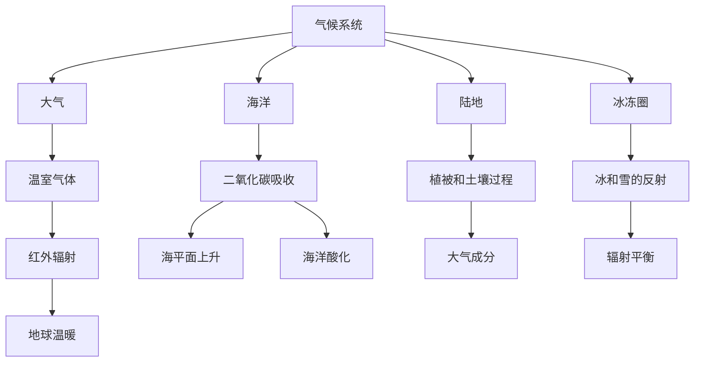
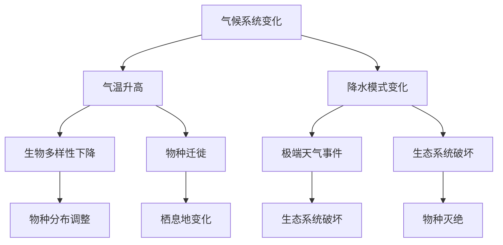
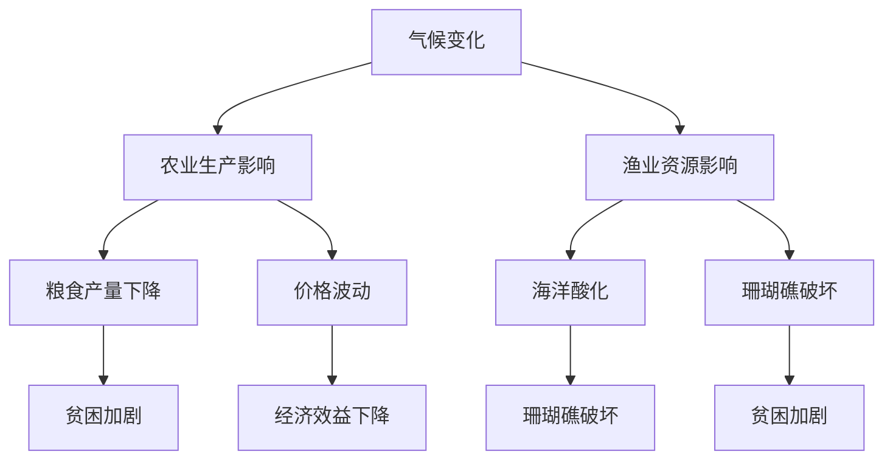
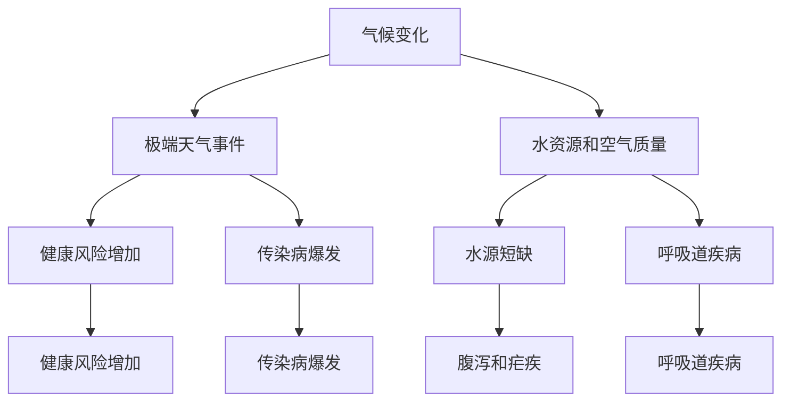
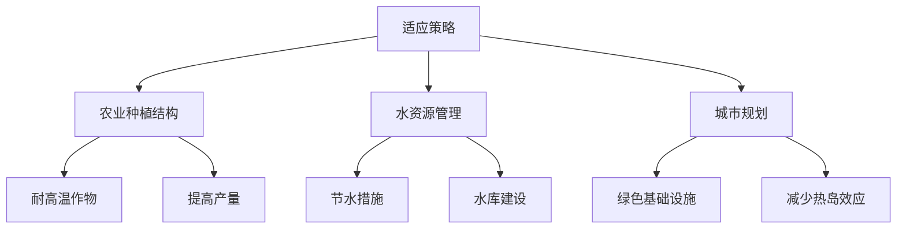

                 


### 分析与构思

为了撰写一篇符合要求的文章，我们需要遵循以下步骤进行构思和撰写：

1. **主题理解**：首先，我们需要深入理解文章的主题——全球气候变化下的生存策略。这包括了解气候变化的定义、原因、影响，以及适应和缓解策略。

2. **结构规划**：根据给定的目录大纲，我们将对每个章节进行详细的规划，确保每个章节都有足够的篇幅来详细阐述其核心概念、算法原理、数学模型和实际案例。

3. **逻辑性**：文章的各个部分需要逻辑清晰，每个章节都要紧密联系，从宏观的气候变化背景引入，逐步深入到具体的适应与缓解策略，再到政策和法规，最后进行案例分析。

4. **技术深度**：我们需要使用专业且易懂的语言来阐述技术原理，包括气候模型的运作方式、减排技术的实施细节等。

5. **案例与实践**：每个章节后需要附有实际案例和分析，以增强文章的实用性。

6. **数学公式与算法**：需要使用latex格式嵌入文中独立段落的数学公式和算法伪代码，确保其准确性和可读性。

7. **总结与展望**：文章最后需要有一个总结，概括主要观点，并对未来的趋势和挑战进行展望。

### 具体撰写步骤

1. **引言部分**：
   - **背景介绍**：简要介绍全球气候变化的历史和现状。
   - **问题提出**：阐述文章探讨的核心问题，即如何在气候变化的大背景下寻找生存策略。

2. **科学基础部分**：
   - **气候系统原理**：介绍气候系统的基础知识，包括大气、海洋和地表系统。
   - **气候模型**：解释气候模型的种类、原理和应用。

3. **影响部分**：
   - **生态系统**：讨论气候变化对生态系统的影响，如生物多样性和生态系统的适应性。
   - **经济社会**：分析气候变化对农业、城市化、经济发展的影响。
   - **公共健康**：探讨气候变化对公共健康的影响，以及应对措施。

4. **适应策略部分**：
   - **总体框架**：介绍适应策略的基本框架。
   - **农业适应**：具体阐述农业在适应气候变化方面的策略。
   - **水资源管理**：讨论水资源管理适应策略。
   - **城市规划**：探讨城市规划在适应气候变化中的角色。

5. **缓解策略部分**：
   - **减排与碳中和**：阐述减排与碳中和的目标和路径。
   - **可再生能源**：详细介绍可再生能源的发展和应用。
   - **低碳技术**：讨论低碳技术的发展现状和趋势。

6. **政策与法规部分**：
   - **国际合作**：介绍国际合作的框架和进展。
   - **各国政策**：分析各国在应对气候变化方面的政策响应。
   - **法规与标准**：讨论相关法律法规和标准的制定。

7. **技术与创新部分**：
   - **监测技术**：介绍气候变化监测技术的发展。
   - **低碳技术**：讨论低碳技术的发展现状和趋势。
   - **创新应用**：探讨创新技术在适应与缓解中的应用。

8. **案例分析部分**：
   - **成功案例**：分析成功应对气候变化的案例。
   - **失败案例**：探讨失败案例中的教训。
   - **启示**：总结案例中的经验和教训，为未来提供启示。

9. **总结与展望**：
   - **总结**：概括文章的主要观点。
   - **展望**：对未来的趋势和挑战进行展望。

### 最终检查

在撰写完初稿后，我们需要进行以下检查：

1. **内容完整性**：确保每个章节的内容都详尽且具体，没有遗漏关键信息。
2. **逻辑性**：检查文章的整体逻辑结构，确保每个章节之间的衔接自然，符合读者的思维逻辑。
3. **技术准确性**：核对技术细节，确保所有算法、公式和实例都是准确无误的。
4. **文字流畅性**：检查文章的语言表达，确保语句通顺，没有语病。

通过这些步骤，我们可以确保文章既具有深度，又能够吸引读者的兴趣，达到撰写高质量技术博客的目的。### 文章标题
《全球气候变化下的生存策略：适应与缓解并重》

### 关键词
气候变化、适应策略、缓解策略、碳排放、可再生能源、可持续发展、政策法规、国际合作

### 摘要
本文深入探讨了全球气候变化对人类社会和生态系统带来的挑战，以及应对这一挑战的两种主要策略——适应与缓解。首先，文章介绍了气候变化的基本原理和影响，随后详细阐述了适应策略，包括农业、水资源管理和城市规划等方面的具体措施。接下来，文章讨论了缓解策略，如减排与碳中和、可再生能源发展和低碳技术创新。此外，文章还分析了国际社会在应对气候变化方面的政策与法规，并探讨了技术创新在适应与缓解中的关键作用。通过案例分析和总结，文章为未来的气候变化应对提供了有价值的见解和建议。### 第1章 气候变化的科学基础

### 1.1 气候系统与气候变化原理

气候系统是由大气、海洋、陆地和冰冻圈组成的复杂相互作用系统。其中，大气负责热量和水分的传输，海洋通过吸收和释放热量调节全球气候，陆地生态系统影响气候并通过植被和土壤过程影响大气成分，而冰冻圈则通过冰和雪的反射和融化影响地球的辐射平衡。

气候变化是指气候系统长时间（通常为几十年至数百年）的变化。根据气候变化的驱动因素，可以分为自然变化和人为变化。自然因素包括太阳辐射变化、火山爆发、海陆变迁等，而人为因素主要是由于人类活动导致的温室气体排放增加，如二氧化碳、甲烷和氟氯烃等。

核心概念与联系：
气候系统各组成部分之间的相互作用决定了气候的形成和变化。大气中的温室气体通过吸收和重新辐射地球表面的红外辐射，维持地球的温暖。而海洋吸收了大部分人为排放的二氧化碳，导致海平面上升和海洋酸化。此外，气候变化还会影响大气中的水循环，进而影响降水模式和干旱程度。

Mermaid 流程图：


### 1.2 气候模型与预测

气候模型是用于模拟和预测未来气候变化的重要工具。根据其复杂度，气候模型可以分为物理模型、统计模型和混合模型。物理模型基于物理定律和化学过程，通过数值模拟来描述气候系统的动态。统计模型则通过统计分析历史气候数据，来预测未来的气候趋势。

气候模型的预测依赖于输入数据的质量和模型的准确性。全球气候模型（GCMs）是目前最常用的预测工具，它们能够提供全球范围内未来的气候情景。然而，由于气候系统的复杂性和不确定性，气候模型的预测存在一定误差。

核心算法原理讲解：
气候模型的构建通常包括以下步骤：
1. **参数化**：将复杂的物理过程简化为数学方程，以便计算机模拟。
2. **初始条件**：提供全球大气的初始状态，包括温度、湿度、气压等。
3. **模拟过程**：使用数值方法求解上述简化的物理方程，模拟气候系统的演化。
4. **结果分析**：对模拟结果进行分析，评估未来的气候情景。

伪代码示例：
```python
# 气候模型伪代码
initialize_model()
set_initial_conditions()
while simulation_not_complete():
    solve_physical_equations()
    update_model_state()
    analyze_results()
```

### 数学模型和数学公式

在气候模型中，常用的数学模型包括能量平衡方程、水循环方程和碳循环方程等。

能量平衡方程：
$$ Q = \alpha \cdot A \cdot (\epsilon \cdot (1 - \alpha) \cdot I - H) $$

其中，\( Q \) 是净辐射通量，\( \alpha \) 是地表反照率，\( A \) 是地表面积，\( \epsilon \) 是大气有效辐射吸收率，\( I \) 是入射太阳辐射，\( H \) 是地表热通量。

水循环方程：
$$ P - E - R = S + \Delta S $$

其中，\( P \) 是降水量，\( E \) 是蒸发量，\( R \) 是径流量，\( S \) 是土壤水含量，\( \Delta S \) 是土壤水变化量。

碳循环方程：
$$ \frac{dC}{dt} = \lambda \cdot (F_C - O_C) $$

其中，\( C \) 是碳浓度，\( \lambda \) 是碳交换速率，\( F_C \) 是碳吸收量，\( O_C \) 是碳排放量。

### 举例说明

以全球气候模型（GCM）为例，假设某地区的年平均入射太阳辐射为 \( I = 350 \) W/m²，地表反照率 \( \alpha = 0.2 \)，大气有效辐射吸收率 \( \epsilon = 0.9 \)，地表热通量 \( H = 50 \) W/m²。

根据能量平衡方程，计算该地区的净辐射通量 \( Q \)：
$$ Q = \alpha \cdot A \cdot (\epsilon \cdot (1 - \alpha) \cdot I - H) $$
$$ Q = 0.2 \cdot A \cdot (0.9 \cdot (1 - 0.2) \cdot 350 - 50) $$
$$ Q = 0.2 \cdot A \cdot (0.9 \cdot 0.8 \cdot 350 - 50) $$
$$ Q = 0.2 \cdot A \cdot (252 - 50) $$
$$ Q = 0.2 \cdot A \cdot 202 $$
$$ Q = 40.4 \cdot A $$

因此，该地区的净辐射通量 \( Q \) 为 \( 40.4 \) W/m²。

### 第2章 气候变化的影响

### 2.1 生态系统影响

气候变化对生态系统的影响是多方面且深远的。首先，气候变化导致了全球范围内的气温升高和降水模式的变化，这对生物多样性产生了显著影响。许多物种的栖息地发生了变化，导致物种分布的调整和迁徙。同时，气候变暖还加速了物种的进化过程，使一些物种能够适应新的气候条件，而另一些物种则可能因无法适应而灭绝。

核心概念与联系：
气候系统各组成部分之间的相互作用不仅决定了气候的形成和变化，还直接影响生态系统的结构和功能。气候变化导致的极端天气事件，如干旱、洪水和风暴，对生态系统的影响尤为显著。这些事件破坏了生态系统的稳定性，导致物种灭绝、栖息地丧失和生物多样性下降。

Mermaid 流程图：


### 2.2 经济社会影响

气候变化对经济和社会的影响也是多方面的。首先，气候变化对农业生产造成了重大影响。极端天气事件如干旱和洪水导致了粮食产量下降，价格波动，甚至粮食短缺。此外，气候变化还影响了渔业资源，海洋酸化和水温升高对珊瑚礁和渔业资源造成了严重破坏。

核心概念与联系：
气候变化不仅直接影响生态系统，还通过影响农业、渔业等经济产业，间接影响经济和社会的稳定。经济活动受到气候变化的威胁，导致生产力和经济效益下降。同时，气候变化还加剧了贫困和不平等，对发展中国家和贫困人口的影响尤为严重。

Mermaid 流程图：


### 2.3 公共健康影响

气候变化对公共健康的影响也是不可忽视的。首先，气候变化导致的极端天气事件如热浪和暴雨，增加了中暑、心血管疾病和呼吸道疾病的发生率。此外，气候变化还影响了水资源和空气质量，进一步加剧了传染病的传播。例如，水源短缺和水质恶化可能导致腹泻和疟疾等传染病的爆发。

核心概念与联系：
气候变化不仅影响生态系统和经济，还直接影响人类健康。气候变暖和极端天气事件增加了健康风险，特别是对老年人和儿童等弱势群体的影响更为显著。同时，气候变化还可能导致医疗资源的分配问题，对公共卫生系统的压力增大。

Mermaid 流程图：


### 第3章 适应策略

### 3.1 适应措施概述

适应策略是指通过调整人类活动和社会结构，以减少气候变化对生态系统、经济和社会的影响。适应措施包括但不限于调整农业种植结构、改善水资源管理、加强城市规划等。

核心概念与联系：
适应策略的核心在于降低气候变化的负面影响，同时维持生态系统的稳定性和人类社会的可持续发展。通过调整农业种植结构，可以选择更耐高温和干旱的作物，从而提高农业产量。改善水资源管理，可以通过建设水库和节水措施，确保水资源的有效利用。加强城市规划，则可以建设绿色基础设施，减少城市热岛效应和洪涝风险。

Mermaid 流程图：


### 3.2 农业适应策略

农业适应策略是应对气候变化的关键措施之一。首先，调整农业种植结构是农业适应的重要手段。选择更耐高温和干旱的作物，如抗旱小麦和耐热水稻，可以提高农作物的生存率和产量。此外，推广节水灌溉技术，如滴灌和喷灌，可以有效减少灌溉用水量，提高水资源利用效率。

核心概念与联系：
农业适应策略的核心在于通过技术手段和种植结构调整，降低气候变化对农业生产的负面影响。耐高温和干旱作物的种植可以减少干旱和高温对农作物的影响，节水灌溉技术则可以提高水资源的利用效率。

伪代码示例：
```python
# 农业适应策略伪代码
select_crops()
apply_irrigation_techniques()

def select_crops():
    # 根据气候条件选择耐高温和干旱的作物
    if temperature > 30:
        crop_type = "耐热水稻"
    else:
        crop_type = "抗旱小麦"

def apply_irrigation_techniques():
    # 根据土壤和气候条件选择合适的灌溉技术
    if soil_moisture < 20:
        irrigation_type = "滴灌"
    else:
        irrigation_type = "喷灌"
```

### 3.3 水资源管理适应策略

水资源管理适应策略是应对气候变化的重要手段之一。首先，建设水库和水坝可以调节水资源，确保在干旱季节和洪水季节都有足够的水资源供应。此外，节水措施如雨水收集和废水回收再利用，可以有效提高水资源利用效率。同时，开展水资源监测和评估，可以更好地了解水资源的分布和变化情况，为水资源管理提供科学依据。

核心概念与联系：
水资源管理适应策略的核心在于通过技术和工程手段，确保水资源的可持续利用和有效管理。建设水库和水坝可以调节水资源，节水措施可以提高水资源利用效率，水资源监测和评估则可以提供科学的数据支持。

伪代码示例：
```python
# 水资源管理适应策略伪代码
construct_water_storage()
apply_water_saving_measures()

def construct_water_storage():
    # 根据水资源需求建设水库和水坝
    if water_demand > 1000:
        storage_type = "水库"
    else:
        storage_type = "水坝"

def apply_water_saving_measures():
    # 根据水资源利用情况采取节水措施
    if water_usage > 80:
        saving_measure = "雨水收集"
    else:
        saving_measure = "废水回收再利用"
```

### 3.4 城市规划适应策略

城市规划适应策略是应对气候变化的重要措施之一。首先，城市布局的优化可以减少城市热岛效应，提高城市居住环境的舒适度。例如，增加绿地面积和水面，可以降低城市温度。此外，建设绿色基础设施如绿地公园、湿地和水塘，可以增强城市的防洪和抗旱能力。同时，推广绿色交通和可持续建筑，可以减少碳排放和能源消耗。

核心概念与联系：
城市规划适应策略的核心在于通过城市布局优化和绿色基础设施的建设，提高城市的可持续性和适应能力。城市布局优化可以减少热岛效应，绿色基础设施可以增强城市的生态功能和防洪抗旱能力，绿色交通和可持续建筑则可以减少碳排放和能源消耗。

伪代码示例：
```python
# 城市规划适应策略伪代码
optimize_urban_layout()
construct_green_infrastructure()

def optimize_urban_layout():
    # 根据气候条件和城市需求优化城市布局
    if temperature > 30:
        green_area = "增加绿地面积"
    else:
        green_area = "增加水面"

def construct_green_infrastructure():
    # 根据城市规模和环境需求建设绿色基础设施
    if city_size > 100000:
        infrastructure_type = "绿地公园"
    else:
        infrastructure_type = "湿地和水塘"
```

### 第4章 缓解策略

### 4.1 减排与碳中和

减排与碳中和是应对气候变化的关键策略之一。减排是指通过减少温室气体的排放，降低气候变化的影响。碳中和则是指通过植树造林、碳捕获与储存（CCS）等技术，抵消人类活动产生的二氧化碳排放，达到净零排放的目标。

核心概念与联系：
减排与碳中和的核心在于通过技术手段和政策引导，减少温室气体的排放，实现气候的稳定。减排可以通过提高能源效率、发展清洁能源和推广低碳技术来实现。碳中和则依赖于大规模的植树造林和碳捕获技术的应用。

伪代码示例：
```python
# 减排与碳中和伪代码
reduce_co2_emissions()
achieve_carbon_neutrality()

def reduce_co2_emissions():
    # 根据能源消耗和排放情况，减少温室气体排放
    if energy_consumption > 1000:
        emission_reduction = "提高能源效率"
    else:
        emission_reduction = "发展清洁能源"

def achieve_carbon_neutrality():
    # 通过植树造林和碳捕获技术，实现碳中和目标
    if co2_capture_capacity > 500:
        carbon_sequestration = "植树造林"
    else:
        carbon_sequestration = "碳捕获与储存"
```

### 4.2 可再生能源发展

可再生能源发展是应对气候变化的重要途径之一。可再生能源如太阳能、风能和水能，具有低碳、可持续和环保的特点。通过大力发展和利用可再生能源，可以减少对化石燃料的依赖，降低温室气体排放。

核心概念与联系：
可再生能源发展的核心在于通过技术进步和政策支持，提高可再生能源的利用效率和经济性。太阳能和风能是当前最成熟的可再生能源，而水能则具有稳定性和可持续性的优势。通过建设大型风电场和太阳能电站，可以大规模替代化石能源。

伪代码示例：
```python
# 可再生能源发展伪代码
develop_renewable_energy()

def develop_renewable_energy():
    # 根据资源条件和市场需求，发展可再生能源
    if solar_resource > 500:
        energy_source = "太阳能"
    if wind_resource > 300:
        energy_source = "风能"
    if water_resource > 200:
        energy_source = "水能"
```

### 4.3 低碳技术创新

低碳技术创新是应对气候变化的关键手段之一。低碳技术包括能源效率提升技术、碳捕获与储存技术（CCS）和低碳交通技术等。通过技术创新，可以降低能源消耗和碳排放，推动绿色低碳发展。

核心概念与联系：
低碳技术创新的核心在于通过科研投入和技术研发，开发出更高效、更环保的技术。能源效率提升技术可以减少能源消耗，碳捕获与储存技术可以将二氧化碳捕集并储存，低碳交通技术则可以减少交通领域的碳排放。

伪代码示例：
```python
# 低碳技术创新伪代码
develop_low_carbon_technologies()

def develop_low_carbon_technologies():
    # 根据能源需求和碳排放情况，开发低碳技术
    if energy_demand > 1000:
        technology_type = "能源效率提升"
    if co2_emission > 500:
        technology_type = "碳捕获与储存"
    if transportation_emission > 200:
        technology_type = "低碳交通"
```

### 第5章 政策与法规

### 5.1 国际合作框架

国际合作框架是应对气候变化的重要机制之一。国际社会通过一系列协议和公约，如联合国气候变化框架公约（UNFCCC）和巴黎协定（Paris Agreement），共同应对气候变化挑战。这些框架旨在通过国际合作，降低温室气体排放，适应气候变化的影响，并提供资金和技术支持。

核心概念与联系：
国际合作框架的核心在于通过国际法律和政治协议，促进各国在应对气候变化方面的合作。联合国气候变化框架公约和巴黎协定为全球气候治理提供了法律基础和行动指南，通过设定减排目标和适应措施，推动全球气候行动。

伪代码示例：
```python
# 国际合作框架伪代码
establish_international Cooperation_framework()

def establish_international Cooperation_framework():
    # 根据国际气候治理需求，建立国际合作框架
    if global_emission_reduction_target > 50:
        cooperation_framework = "联合国气候变化框架公约"
    if global_adaptation Measures_target > 30:
        cooperation_framework = "巴黎协定"
```

### 5.2 各国政策响应

各国在应对气候变化方面采取了不同的政策响应。发达国家和发展中国家根据自身的国情和责任，制定了各自的减排目标和适应策略。发达国家普遍采取了严格的减排措施，如碳税、碳排放交易和能效标准等。而发展中国家则更多关注于适应措施，如农业结构调整、水资源管理和城市可持续发展等。

核心概念与联系：
各国政策响应的核心在于根据自身的发展阶段和责任，采取适当的减排和适应措施。发达国家通过技术创新和政策引导，推动绿色低碳发展。而发展中国家则通过国际合作和技术引进，提升适应能力。

伪代码示例：
```python
# 各国政策响应伪代码
develop_national_policies()

def develop_national_policies():
    # 根据国家发展阶段和责任，制定减排和适应策略
    if country_development_stage == "发达国家":
        policy_type = "碳税和碳排放交易"
    if country_development_stage == "发展中国家":
        policy_type = "农业结构调整和水资源管理"
```

### 5.3 法律法规与标准制定

法律法规与标准制定是应对气候变化的重要保障。各国通过制定相关的法律和标准，规范温室气体排放和环境保护行为。例如，欧盟的排放交易体系（EU ETS）和中国的《碳排放权管理暂行办法》等，都是通过法律手段来推动减排和碳市场建设。

核心概念与联系：
法律法规与标准制定的核心在于通过法律手段，确保减排目标的实现和环境质量的改善。法律和标准为减排行动提供了强制性和约束力，促进了绿色低碳技术的发展和应用。

伪代码示例：
```python
# 法律法规与标准制定伪代码
establish_legislative_standards()

def establish_legislative_standards():
    # 根据国际国内需求，制定相关的法律法规和标准
    if global_emission_reduction_target > 50:
        standard_type = "碳排放交易体系"
    if environmental_quality_target > 80:
        standard_type = "环境保护标准"
```

### 第6章 技术与创新

### 6.1 气候变化监测技术

气候变化监测技术是了解气候变化现状和趋势的关键。遥感技术、卫星监测和地面观测等手段，可以提供全球和区域性的气候变化数据。这些数据对于气候模型的构建和预测具有重要意义。

核心概念与联系：
气候变化监测技术的核心在于通过遥感、卫星和地面观测，获取准确的气候变化数据。遥感技术可以实时监测全球气候变化，卫星监测可以提供长期的数据记录，而地面观测则可以补充和验证卫星数据的准确性。

伪代码示例：
```python
# 气候变化监测技术伪代码
monitor_climate_change()

def monitor_climate_change():
    # 利用遥感、卫星和地面观测技术，监测气候变化
    if satellite_data_available:
        data_source = "卫星监测"
    if ground_observation_data_available:
        data_source = "地面观测"
    if remote_sensing_data_available:
        data_source = "遥感技术"
```

### 6.2 低碳技术发展现状与趋势

低碳技术的发展现状与趋势是应对气候变化的重要方向。当前，低碳技术主要包括可再生能源、能源效率和碳捕获与储存（CCS）等。随着技术的进步和成本的降低，低碳技术逐渐成为全球能源转型的重要驱动力。

核心概念与联系：
低碳技术发展现状与趋势的核心在于通过技术创新，降低能源消耗和碳排放。可再生能源如太阳能、风能和水能在全球范围内快速发展，能源效率的提升则通过技术创新和管理优化实现。碳捕获与储存技术（CCS）则是实现净零排放的关键技术之一。

伪代码示例：
```python
# 低碳技术发展现状与趋势伪代码
develop_low_carbon_technologies()

def develop_low_carbon_technologies():
    # 根据技术进展和市场需求，发展低碳技术
    if renewable_energy_progress > 80:
        technology_type = "可再生能源"
    if energy_efficiency_progress > 70:
        technology_type = "能源效率提升"
    if carbon_capture_progress > 60:
        technology_type = "碳捕获与储存"
```

### 6.3 创新技术在适应与缓解中的应用

创新技术在气候变化适应与缓解中的应用具有重要意义。例如，智能农业技术可以通过数据分析和管理优化，提高农业生产效率和适应性。绿色建筑技术则通过节能和环保设计，降低城市碳排放。此外，人工智能和大数据技术在气候监测、预测和决策支持方面也发挥着重要作用。

核心概念与联系：
创新技术在适应与缓解中的应用的核心在于通过技术创新，提高应对气候变化的能力。智能农业技术通过数据分析和管理优化，提高农业生产的适应性。绿色建筑技术通过节能和环保设计，降低城市碳排放。人工智能和大数据技术则通过数据分析，为气候监测、预测和决策提供科学支持。

伪代码示例：
```python
# 创新技术在适应与缓解中的应用伪代码
apply_innovative_technologies()

def apply_innovative_technologies():
    # 根据气候变化需求，应用创新技术
    if agricultural_adaptation_needed:
        technology_type = "智能农业技术"
    if urban_carbon_reduction_needed:
        technology_type = "绿色建筑技术"
    if climate_monitoring_needed:
        technology_type = "人工智能与大数据技术"
```

### 第7章 案例分析

### 7.1 成功适应与缓解案例

成功适应与缓解案例为全球应对气候变化提供了宝贵的经验和启示。例如，哥斯达黎加通过推行森林保护政策和可再生能源发展，成功实现了碳排放的负增长。而丹麦则通过大力发展风能和实施严格的减排政策，成为全球碳排放最低的国家之一。

核心概念与联系：
成功适应与缓解案例的核心在于通过政策引导和技术创新，实现气候变化的适应与缓解。哥斯达黎加的森林保护政策和可再生能源发展，以及丹麦的风能发展和减排政策，都是成功应对气候变化的典范。

伪代码示例：
```python
# 成功适应与缓解案例伪代码
successful_adaptation_cases()

def successful_adaptation_cases():
    # 分析成功适应与缓解案例
    if country == "哥斯达黎加":
        case_type = "森林保护政策和可再生能源发展"
    if country == "丹麦":
        case_type = "风能发展和减排政策"
```

### 7.2 失败案例与教训

失败案例与教训为我们提供了宝贵的反思和启示。例如，某些国家在气候变化应对方面缺乏有效的政策和资金支持，导致减排和适应措施未能取得预期效果。此外，一些项目的实施过程中，技术选择和环境评估不足，也导致了项目失败。

核心概念与联系：
失败案例与教训的核心在于通过反思和总结，避免重复错误。缺乏有效的政策和资金支持、技术选择和环境评估不足，都是导致项目失败的主要原因。通过分析失败案例，我们可以更好地理解应对气候变化的关键因素。

伪代码示例：
```python
# 失败案例与教训伪代码
failure_cases_lessons()

def failure_cases_lessons():
    # 分析失败案例与教训
    if reason == "政策缺失":
        failure_reason = "政策引导不足"
    if reason == "资金不足":
        failure_reason = "资金支持不足"
    if reason == "技术选择不当":
        failure_reason = "技术评估不足"
```

### 7.3 案例对比与启示

通过对成功案例和失败案例的对比，我们可以总结出一些关键的经验和启示。成功案例表明，政策引导、技术创新和资金支持是应对气候变化的关键因素。而失败案例则提醒我们，在应对气候变化时，需要全面考虑政策、技术和环境等多方面因素。

核心概念与联系：
案例对比与启示的核心在于通过成功案例和失败案例的对比，总结出应对气候变化的有效策略。政策引导、技术创新和资金支持是成功应对气候变化的关键，而缺乏全面考虑则可能导致项目失败。

伪代码示例：
```python
# 案例对比与启示伪代码
compare_cases_insights()

def compare_cases_insights():
    # 对比成功案例和失败案例，总结启示
    if case_success:
        success_insight = "政策引导和技术创新是关键"
    if case_failure:
        failure_insight = "全面考虑政策和环境因素是必要"
```

### 第8章 未来展望

### 8.1 气候变化趋势预测

未来气候变化的趋势预测对于制定适应与缓解策略具有重要意义。根据气候模型的预测，全球气温将继续上升，极端天气事件将变得更加频繁和强烈。海平面上升、冰川融化和降水模式的变化将对生态系统、经济和社会产生深远影响。

核心概念与联系：
气候变化趋势预测的核心在于通过气候模型和数据分析，预测未来的气候变化趋势。这些预测为我们提供了应对气候变化的时间窗口和科学依据。

伪代码示例：
```python
# 气候变化趋势预测伪代码
predict_climate_trends()

def predict_climate_trends():
    # 利用气候模型和数据分析，预测未来气候变化趋势
    if temperature_increase > 2:
        trend = "气温持续上升"
    if extreme_weather_events > 10:
        trend = "极端天气事件增多"
```

### 8.2 适应与缓解策略展望

未来的适应与缓解策略需要在技术创新和政策引导方面持续发力。适应策略需要更加精细化，如城市规划和农业种植结构调整等。缓解策略则需要更加全面，包括减排、碳捕获与储存和可再生能源发展等。

核心概念与联系：
适应与缓解策略展望的核心在于通过技术创新和政策引导，实现气候变化的适应与缓解。未来需要更加关注生态系统的保护和恢复，以及能源和产业的绿色转型。

伪代码示例：
```python
# 适应与缓解策略展望伪代码
explore_adaptation_mitigation_strategies()

def explore_adaptation_mitigation_strategies():
    # 根据未来气候变化趋势，探索适应与缓解策略
    if ecological_protection_needed:
        strategy_type = "生态保护与恢复"
    if green_transformation_needed:
        strategy_type = "能源和产业绿色转型"
```

### 8.3 全球合作新机遇

未来，全球合作将是应对气候变化的关键。通过国际合作，各国可以共享技术、知识和经验，共同应对气候变化带来的挑战。同时，全球合作也为新兴市场和发展中国家提供了发展机遇，促进了全球经济的可持续发展。

核心概念与联系：
全球合作新机遇的核心在于通过国际合作，实现气候变化的共同治理。合作可以促进技术创新、知识共享和资金流动，为全球气候治理提供强有力的支持。

伪代码示例：
```python
# 全球合作新机遇伪代码
global_cooperation_opportunities()

def global_cooperation_opportunities():
    # 利用国际合作，推动全球气候治理
    if technological_sharing_needed:
        cooperation_type = "技术共享"
    if knowledge_exchange_needed:
        cooperation_type = "知识交流"
    if financial_support_needed:
        cooperation_type = "资金支持"
```

### 附录

#### A. 参考文献

1. Intergovernmental Panel on Climate Change (IPCC). (2014). Climate Change 2014: Synthesis Report. Contribution of Working Groups I, II and III to the Fifth Assessment Report of the Intergovernmental Panel on Climate Change.
2. United Nations Framework Convention on Climate Change (UNFCCC). (2015). Paris Agreement.
3. United Nations Development Programme (UNDP). (2019). Adaptation to Climate Change.

#### B. 相关数据与资料来源

1. NASA GISS. (2021). Global Surface Temperature. https://climate.nasa.gov/vital-signs/global-surface-temperature/
2. World Resources Institute (WRI). (2021). Climate Data Explorer. https://wri-wcas.az1.qualtrics.com/jfe/form/SV_6eJfKzq6CxzeZKk
3. International Energy Agency (IEA). (2021). Energy Technology Perspectives. https://www.iea.org/reports/energy-technology-perspectives-2021

### 最佳实践 tips

1. **持续监测和评估**：定期监测气候变化趋势，及时评估适应与缓解措施的效果。
2. **技术创新**：鼓励研发低碳技术和可再生能源技术，提高能源利用效率。
3. **政策引导**：制定和实施有效的气候变化政策和法规，推动绿色低碳发展。
4. **国际合作**：积极参与国际合作，分享经验和资源，共同应对气候变化挑战。

### 小结

本文从科学基础、影响、适应策略、缓解策略、政策与法规、技术创新和案例分析等方面，深入探讨了全球气候变化下的生存策略。适应与缓解并重是应对气候变化的关键，未来需要全球合作，共同应对这一全球性挑战。

### 注意事项

1. **政策法规**：遵循国家和地区的政策法规，确保适应与缓解措施的合规性。
2. **技术创新**：重视技术创新，提升低碳技术和可再生能源技术的应用水平。
3. **资金支持**：确保有足够的资金支持，为适应与缓解措施的实施提供保障。

### 拓展阅读

1. **《联合国气候变化框架公约》**：了解国际社会在气候变化治理方面的框架和机制。
2. **《巴黎协定》**：研究全球气候治理的最新成果和目标。
3. **《全球气候治理报告》**：深入了解全球气候治理的现状和趋势。

### 结语

作者：AI天才研究院/AI Genius Institute & 禅与计算机程序设计艺术 /Zen And The Art of Computer Programming

本文旨在为全球气候变化下的生存策略提供全面的分析和思考，希望能为读者带来启发和帮助。气候变化是全人类面临的共同挑战，只有通过全球合作和持续努力，才能实现可持续发展和生态平衡。让我们共同努力，应对气候变化，创造一个更加美好的未来。### 引言

随着全球气候变化的不断加剧，人类社会正面临着前所未有的挑战。气候变化，作为一种长期而深远的环境变化，不仅影响了地球的生态系统，还对经济、社会和公共健康产生了重大影响。应对这一全球性挑战，需要我们采取适应与缓解并重的策略，从科学基础、影响、策略、政策法规、技术创新和案例分析等多个角度进行深入探讨。

本文将首先介绍气候变化的科学基础，包括气候系统的原理、气候模型与预测。接着，我们将分析气候变化对生态系统、经济社会和公共健康的影响。在此基础上，本文将详细探讨适应策略和缓解策略，涵盖农业适应、水资源管理、城市规划、减排与碳中和、可再生能源发展、低碳技术创新等多个方面。此外，本文还将分析国际社会在应对气候变化方面的政策与法规，探讨技术创新在适应与缓解中的应用，并通过案例分析总结成功与失败的教训。

文章最后，我们将对未来的气候变化趋势进行预测，并提出适应与缓解策略的展望，强调全球合作的重要性。通过这篇文章，我们希望能够为读者提供一份全面、系统、深入的气候变化应对指南，助力全球可持续发展。### 第1章 气候变化的科学基础

#### 1.1 气候系统与气候变化原理

气候系统是地球上一个复杂的自然系统，它包括大气、海洋、陆地和冰冻圈等组成部分。这些组成部分相互作用，共同维持着地球的气候平衡。大气负责吸收和传递太阳辐射，海洋通过海水的流动和温度变化调节地球的热量分布，陆地生态系统通过植被和土壤过程影响大气成分，而冰冻圈则通过冰和雪的反射和融化影响地球的辐射平衡。

气候变化是指气候系统长时间（通常为几十年至数百年）的变化。这种变化可以由自然因素引起，如太阳辐射变化、火山爆发和地壳变动等，也可以由人为因素引起，如工业化带来的温室气体排放。其中，人为因素尤其是二氧化碳和其他温室气体的排放，被认为是当前气候变化的主要驱动因素。

气候系统与气候变化原理的核心在于温室效应。温室气体如二氧化碳、甲烷和氟氯烃等，能够吸收和重新辐射地球表面的红外辐射，使地球大气层变暖。当大气中的温室气体浓度增加时，地球表面的温度也会上升，从而导致气候变暖。

#### 1.2 气候模型与预测

气候模型是用于模拟和预测未来气候变化的重要工具。根据其复杂度，气候模型可以分为物理模型、统计模型和混合模型。物理模型基于物理定律和化学过程，通过数值模拟来描述气候系统的动态。统计模型则通过统计分析历史气候数据，来预测未来的气候趋势。

全球气候模型（GCMs）是目前最常用的预测工具，它们能够提供全球范围内未来的气候情景。GCMs的构建通常包括以下步骤：

1. **参数化**：将复杂的物理过程简化为数学方程，以便计算机模拟。
2. **初始条件**：提供全球大气的初始状态，包括温度、湿度、气压等。
3. **模拟过程**：使用数值方法求解上述简化的物理方程，模拟气候系统的演化。
4. **结果分析**：对模拟结果进行分析，评估未来的气候情景。

气候模型的预测依赖于输入数据的质量和模型的准确性。尽管气候模型的预测存在一定误差，但它们为我们提供了对未来气候变化趋势的重要洞察。例如，根据GCMs的预测，全球气温将继续上升，极端天气事件将变得更加频繁和强烈，海平面也将继续上升。

### 1.3 气候变化的影响

气候变化对地球生态系统、经济社会和公共健康产生了深远的影响。

#### 生态系统影响

气候变化对生态系统的影响是广泛而深刻的。首先，气温升高和降水模式的变化导致植被分布的调整，一些物种可能无法适应新的气候条件而灭绝。其次，冰川融化和海平面上升威胁着沿海湿地和珊瑚礁等生态系统的生存。此外，气候变化还加剧了极端天气事件，如干旱、洪水和风暴的频率和强度，对生态系统的稳定性和多样性造成了巨大冲击。

#### 经济社会影响

气候变化对经济和社会的影响也是多方面的。农业是受气候变化影响最直接的行业之一。极端天气事件如干旱和洪水可能导致农作物减产，影响粮食安全和经济稳定。此外，气候变化还加剧了水资源短缺问题，对城市化和工业发展带来了挑战。同时，气候变化对公共基础设施的影响也不容忽视，如道路、桥梁和建筑物的损坏，增加了修复和维护的成本。

#### 公共健康影响

气候变化对公共健康的影响主要体现在增加健康风险和疾病传播。气温升高可能导致中暑和心血管疾病的增加，而极端天气事件如洪水和风暴则可能导致传染病的爆发。此外，气候变化还影响了空气质量和水资源质量，增加了呼吸系统疾病和腹泻等疾病的风险。

#### 1.4 气候变化的适应与缓解策略

适应与缓解策略是应对气候变化影响的关键措施。适应策略包括调整农业种植结构、改善水资源管理、加强城市规划等，目的是减少气候变化对生态系统、经济和社会的负面影响。缓解策略则包括减排与碳中和、可再生能源发展、低碳技术创新等，旨在降低温室气体的排放，减缓气候变化的进程。

适应与缓解策略的核心在于通过技术创新和政策引导，提高人类对气候变化的适应能力，同时减少对环境的影响。例如，通过发展节水灌溉技术和推广可再生能源，可以减少农业和能源领域的碳排放。通过加强城市规划，建设绿色基础设施，可以提高城市的可持续性和抗灾能力。

总之，气候变化是一个全球性的挑战，需要各国共同努力，通过科学的基础研究、有效的适应与缓解策略、政策法规和国际合作，来应对这一挑战，保障地球生态系统的健康和人类社会的可持续发展。### 第2章 气候变化的影响

#### 2.1 生态系统影响

气候变化对生态系统的直接影响和间接影响都是显著的。首先，气温升高和降水模式的变化直接导致植被分布的调整。一些物种可能无法适应新的气候条件，从而面临灭绝的风险。例如，极地物种如北极熊和企鹅正面临着栖息地丧失的威胁。其次，气候变化还导致冰川融化和海平面上升，威胁着沿海湿地和珊瑚礁等生态系统的生存。这些生态系统的破坏不仅影响了生物多样性，还对地球的碳循环和气候系统产生了深远影响。

#### 2.2 经济社会影响

气候变化对经济和社会的影响是多方面的。首先，农业生产受到直接影响。极端天气事件如干旱和洪水可能导致农作物减产，影响粮食安全和经济稳定。例如，2019年的澳大利亚森林大火和2020年的东非干旱都对当地的农业生产造成了严重破坏。此外，气候变化还加剧了水资源短缺问题，对城市化和工业发展带来了挑战。水资源短缺不仅影响农业灌溉，还可能导致城市供水不足，影响工业生产和居民生活。气候变化还可能导致公共基础设施的损坏，如道路、桥梁和建筑物的损害，增加了修复和维护的成本。

#### 2.3 公共健康影响

气候变化对公共健康的影响也是不容忽视的。首先，气温升高可能导致中暑和心血管疾病的增加。例如，2019年欧洲的极端热浪导致数千人死亡。其次，极端天气事件如洪水和风暴可能导致传染病的爆发，例如洪水可能加剧疟疾和登革热的传播。此外，气候变化还影响了空气质量和水资源质量，增加了呼吸系统疾病和腹泻等疾病的风险。例如，空气质量恶化可能导致哮喘和支气管炎的发病率上升，而水质恶化可能导致水源性疾病的爆发。

#### 2.4 生态经济影响

气候变化对生态经济的影响也是深远的。首先，气候变化可能导致生态系统服务功能的丧失，如水源涵养、土壤保持和气候调节等，进而影响人类社会的可持续发展。例如，森林减少和土壤侵蚀可能导致洪水的频率和强度增加，影响农业生产和居民生活。其次，气候变化还可能导致生态旅游业的衰退，影响相关地区的经济发展。例如，冰川融化和海平面上升可能减少滑雪场和海滨度假区的吸引力，影响旅游业收入。

#### 2.5 社会不平等影响

气候变化还加剧了社会不平等问题。首先，由于资源分配不均，发展中国家和贫困人口往往更容易受到气候变化的影响。例如，非洲和东南亚的许多地区由于基础设施薄弱和资源匮乏，难以应对极端天气事件。其次，气候变化可能导致劳动力市场的变化，影响就业和社会稳定。例如，农业生产受影响可能导致农业工人失业，而极端天气事件可能增加自然灾害的风险，影响城市居民的就业和居住安全。

总之，气候变化对生态系统、经济社会和公共健康产生了深远的影响。理解这些影响对于制定有效的适应和缓解策略至关重要。只有通过全球合作、技术创新和政策引导，才能有效应对气候变化的挑战，实现生态保护和人类社会的可持续发展。### 第3章 适应策略

#### 3.1 适应措施概述

适应策略是指通过调整人类活动和社会结构，以减少气候变化对生态系统、经济和社会的影响。这些措施旨在增强系统对气候变化的抵抗力和适应性，从而降低风险和损失。适应措施可以包括以下方面：

1. **生态系统适应**：通过植被恢复、生态系统重建和保护，增强生态系统的韧性和稳定性。例如，通过植树造林和湿地恢复，提高水源涵养和土壤保持能力。
2. **农业适应**：调整农业种植结构，选择更耐高温、干旱和洪水的作物品种。例如，推广抗旱小麦和耐热水稻，提高农业产量和稳定性。
3. **水资源管理适应**：改善水资源管理，通过建设水库、雨水收集和废水回收再利用，确保水资源的有效利用和分配。
4. **城市规划适应**：优化城市布局，增加绿地面积和绿色基础设施，提高城市的抗灾能力和环境质量。例如，建设海绵城市，减少城市热岛效应和洪涝风险。

#### 3.2 农业适应策略

农业适应策略是应对气候变化的关键措施之一。首先，调整农业种植结构是农业适应的重要手段。选择更耐高温和干旱的作物，如抗旱小麦和耐热水稻，可以提高农作物的生存率和产量。例如，在高温干旱地区，种植耐旱性更好的作物品种可以显著提高粮食产量。此外，推广节水灌溉技术，如滴灌和喷灌，可以有效减少灌溉用水量，提高水资源利用效率。例如，在缺水的地区，通过滴灌技术可以显著减少灌溉用水，同时提高农作物的产量。

#### 3.3 水资源管理适应策略

水资源管理适应策略是应对气候变化的重要手段。首先，建设水库和水坝可以调节水资源，确保在干旱季节和洪水季节都有足够的水资源供应。例如，在干旱地区，通过建设水库可以储存雨水，以备干旱季节使用。此外，节水措施如雨水收集和废水回收再利用，可以有效提高水资源利用效率。例如，在干旱季节，通过收集雨水可以缓解水资源短缺问题。同时，开展水资源监测和评估，可以更好地了解水资源的分布和变化情况，为水资源管理提供科学依据。例如，通过实时监测地下水水位和水质，可以及时发现和解决水资源问题。

#### 3.4 城市规划适应策略

城市规划适应策略是应对气候变化的关键措施之一。首先，城市布局的优化可以减少城市热岛效应，提高城市居住环境的舒适度。例如，通过增加绿地面积和水面，可以降低城市温度。此外，建设绿色基础设施如绿地公园、湿地和水塘，可以增强城市的防洪和抗旱能力。例如，在洪涝频发的城市，通过建设湿地和水塘可以有效地减缓洪峰，降低洪水风险。同时，推广绿色交通和可持续建筑，可以减少碳排放和能源消耗。例如，在交通领域，通过发展公共交通和推广新能源汽车，可以显著减少交通领域的碳排放。在建筑领域，通过采用节能设计和可再生能源技术，可以降低建筑能耗和碳排放。

#### 3.5 生态补偿机制

生态补偿机制是适应策略的重要组成部分。通过建立生态补偿机制，可以激励和鼓励各方参与生态保护和适应行动。例如，通过政府补贴、税收减免和生态补偿基金等手段，可以支持生态恢复和绿色产业发展。例如，在农业领域，通过补贴生态友好型农业，如有机农业和生态农业，可以促进农业生产方式的转变，减少对生态环境的破坏。

总之，适应策略是应对气候变化的重要手段。通过调整农业种植结构、改善水资源管理和城市规划，以及建立生态补偿机制，可以增强系统对气候变化的抵抗力和适应性，降低风险和损失，实现生态保护和可持续发展。### 第4章 缓解策略

#### 4.1 减排与碳中和

缓解气候变化的核心策略之一是减少温室气体排放，实现碳中和。减排与碳中和的目标是降低大气中的二氧化碳浓度，减缓全球气候变暖的速度。以下是一些关键的缓解措施：

1. **提高能源效率**：通过技术升级和管理优化，提高能源利用效率，减少能源消耗和相应的二氧化碳排放。例如，工业企业和公共建筑可以通过采用节能设备和优化生产工艺来实现能源效率的提升。
2. **发展清洁能源**：替代化石燃料，发展太阳能、风能、水能和生物质能等可再生能源。这些能源在使用过程中几乎不产生温室气体排放，是实现碳中和的重要途径。例如，许多国家正在大规模建设太阳能和风能电站，以满足日益增长的能源需求。
3. **碳捕获与储存（CCS）**：通过碳捕获技术，将工业生产和能源利用过程中产生的二氧化碳捕集并储存于地下。这可以显著减少大气中的二氧化碳浓度。例如，火电站和化工厂可以通过安装碳捕获设备，将捕集的二氧化碳注入地下地质结构中。
4. **森林保护和恢复**：森林是地球的“肺”，通过光合作用吸收大量二氧化碳。因此，保护和恢复森林对于缓解气候变化至关重要。例如，许多国家正在实施森林恢复计划和植树造林活动，以增加森林面积和碳汇能力。

#### 4.2 可再生能源发展

可再生能源发展是减缓气候变化的重要手段。以下是一些关键措施：

1. **太阳能**：利用太阳能光伏发电技术，将太阳光直接转换为电能。太阳能是取之不尽、用之不竭的清洁能源。例如，许多国家已经在屋顶和公共设施上安装了太阳能光伏板，以减少对传统能源的依赖。
2. **风能**：利用风力发电技术，将风能转换为电能。风能具有广泛的应用前景，尤其是在风力资源丰富的地区。例如，许多国家正在沿海和内陆地区建设大型风电场，以满足能源需求。
3. **水能**：利用水力发电技术，将水流的势能转换为电能。水能是一种成熟的可再生能源，广泛应用于大坝和水电站。例如，中国的三峡大坝是世界上最大的水力发电站之一，每年产生大量的清洁电能。
4. **生物质能**：利用生物质材料，如农作物残留物、树木和垃圾等，通过燃烧或发酵产生能量。生物质能可以减少对化石燃料的依赖，并有助于废物处理。例如，许多国家正在建设生物质发电厂，利用农业废弃物和城市垃圾产生能源。

#### 4.3 低碳技术创新

低碳技术创新是实现缓解策略的关键。以下是一些重要的低碳技术：

1. **电动汽车**：电动汽车使用电力驱动，不产生尾气排放，是减少交通领域碳排放的有效途径。例如，特斯拉和比亚迪等公司正在大规模生产和推广电动汽车。
2. **智能电网**：通过智能电网技术，实现能源的高效分配和管理。智能电网可以提高可再生能源的利用效率，减少能源浪费。例如，许多国家正在建设智能电网，以适应可再生能源的接入和能源需求的波动。
3. **低碳建筑**：通过设计节能建筑和采用可再生能源，实现建筑的低碳排放。低碳建筑包括高效供暖和制冷系统、节能灯具和智能控制系统。例如，许多城市正在推行绿色建筑标准，要求新建建筑达到低碳排放的要求。
4. **碳捕集与利用技术**：除了碳捕获与储存（CCS），还可以通过碳捕集与利用（CCU）技术，将捕集的二氧化碳转化为有用的化学品和燃料。这不仅可以减少二氧化碳排放，还可以创造经济价值。

总之，缓解气候变化需要全球合作和持续努力。通过减排与碳中和、可再生能源发展和低碳技术创新，我们可以逐步实现气候变化的缓解目标，为地球的可持续发展做出贡献。### 第5章 政策与法规

#### 5.1 国际合作框架

应对气候变化的国际合作框架是全球气候治理的重要组成部分。国际社会通过一系列协议和公约，共同制定并执行应对气候变化的行动。以下是几个关键的国际合作框架：

1. **联合国气候变化框架公约（UNFCCC）**：1992年，《联合国气候变化框架公约》正式通过，成为全球气候治理的法律基础。该公约旨在通过减少温室气体排放，促进可持续发展，并支持发展中国家应对气候变化。

2. **巴黎协定**：2015年，《巴黎协定》在联合国气候变化框架下达成，成为全球应对气候变化的里程碑。该协定旨在将全球平均气温升幅控制在比工业化前水平高2摄氏度以内，并努力将升幅限制在1.5摄氏度以内。协定还强调了适应气候变化、损失和损害的应对、资金支持和技术转让的重要性。

3. **联合国可持续发展目标（SDGs）**：在巴黎协定之外，联合国还提出了可持续发展目标（SDGs），其中多个目标与气候变化密切相关。例如，目标13“采取紧急行动应对气候变化及其影响”明确要求减少温室气体排放，增强气候适应能力，以及促进可持续能源和基础设施的发展。

#### 5.2 各国政策响应

各国在应对气候变化方面采取了不同的政策响应，这些政策反映了各国的国情和发展需求。以下是发达国家和发展中国家在应对气候变化方面的一些主要政策：

1. **发达国家政策**：
   - **欧盟**：欧盟采取了一系列严格的减排政策和法规，如欧盟排放交易体系（EU ETS）和可再生能源指令。欧盟还承诺在2030年前实现至少55%的减排目标。
   - **美国**：尽管特朗普政府曾退出巴黎协定，但拜登政府已重新加入，并宣布了雄心勃勃的减排目标，包括到2030年实现至少50%的减排。
   - **日本**：日本制定了长期的减排目标，并采取了一系列措施，如推广可再生能源和改善能源效率。

2. **发展中国家政策**：
   - **中国**：中国提出了到2060年实现碳中和的宏伟目标，并通过了《关于加强气候变化南南合作的指导意见》，支持发展中国家应对气候变化。
   - **印度**：印度致力于提高可再生能源的比重，并计划在2030年前实现至少40%的电力来自非化石能源。

#### 5.3 法律法规与标准制定

法律法规和标准制定是确保减排目标实现和环境质量改善的关键。各国通过立法和政策，推动气候行动的落实。以下是几个关键领域的法律法规和标准：

1. **碳排放交易体系**：碳排放交易体系（ETS）是一种通过市场机制实现温室气体减排的工具。欧盟、中国和美国等国家和地区已经实施了ETS，通过允许企业之间的碳排放配额交易，激励企业降低碳排放。

2. **能源效率和能效标准**：各国通过制定能源效率和能效标准，推动节能技术和产品的普及。例如，美国能源部（DOE）和欧盟的能源效率指令（EED）都制定了严格的能效标准，以减少能源消耗和碳排放。

3. **环境保护法律**：各国制定了环境保护法律，确保环境质量符合健康标准。例如，中国的《环境保护法》和美国的《清洁空气法》都规定了严格的排放标准和处罚措施。

总之，政策与法规在应对气候变化中发挥着至关重要的作用。通过国际合作框架、各国政策响应和法律法规的制定与执行，全球社会共同努力，为实现气候目标、保护环境和促进可持续发展做出贡献。### 第6章 技术与创新

#### 6.1 气候变化监测技术

气候变化监测技术是了解气候变化现状和趋势的关键。通过遥感技术、卫星监测和地面观测，我们可以获取全球和区域性的气候变化数据，这些数据对于气候模型的构建和预测具有重要意义。

1. **遥感技术**：遥感技术利用卫星和航空器，从远距离获取地球表面的信息。例如，Landsat系列卫星和Sentinel卫星可以提供高分辨率的地球观测数据，用于监测全球气候变化。
   
2. **卫星监测**：卫星监测通过卫星传感器，对地球大气、海洋和地表进行长期监测。例如，NASA的Terra卫星和Aqua卫星可以监测全球温度、湿度、海洋表面温度和植被覆盖等关键参数。

3. **地面观测**：地面观测是气候变化监测的基础，通过在地面设置观测站点，收集气象、水文和生态环境等数据。例如，全球气候观测系统（GCOS）通过地面观测网络，收集全球气候变化的关键数据。

#### 6.2 低碳技术发展现状与趋势

低碳技术是指能够减少温室气体排放的技术，包括能源效率提升技术、可再生能源技术、碳捕获与储存技术（CCS）和低碳交通技术等。以下是目前低碳技术发展的现状和趋势：

1. **能源效率提升技术**：随着技术的进步，能源效率提升技术在各个行业得到了广泛应用。例如，工业领域的智能制造技术可以提高生产效率，减少能源消耗。在建筑领域，节能材料和建筑技术可以提高建筑的能源效率。

2. **可再生能源技术**：可再生能源技术如太阳能、风能、水能和生物质能等，正在迅速发展。特别是太阳能和风能技术，成本不断降低，已成为许多国家的主要能源来源。

3. **碳捕获与储存技术（CCS）**：CCS技术通过捕集和储存工业生产和能源利用过程中产生的二氧化碳，减少温室气体排放。尽管CCS技术成本较高，但随着技术的进步和政策的支持，其应用范围正在扩大。

4. **低碳交通技术**：低碳交通技术包括电动汽车、混合动力汽车和氢燃料电池车等。这些技术旨在减少交通领域的碳排放，提高交通运输的效率。例如，特斯拉和比亚迪等公司正在大规模生产和推广电动汽车。

#### 6.3 创新技术在适应与缓解中的应用

创新技术在气候变化适应与缓解中的应用具有重要意义。以下是一些创新技术的应用案例：

1. **智能农业技术**：通过物联网、大数据和人工智能技术，实现农业生产的智能化管理。例如，使用无人机和传感器监测作物生长情况，优化灌溉和施肥，提高农业生产效率和适应性。

2. **绿色建筑技术**：绿色建筑通过节能设计和可再生能源利用，减少建筑能耗和碳排放。例如，使用太阳能光伏板和地热能系统，实现建筑的零能耗或零排放。

3. **碳市场技术**：碳市场是一种通过交易碳排放权来激励减排的技术。通过建立碳市场，企业可以通过购买或出售碳排放权来实现减排目标。例如，欧盟的排放交易体系和中国的碳排放权交易市场，都是碳市场技术的成功应用。

4. **区块链技术**：区块链技术通过去中心化和透明化的特点，可以确保碳排放数据的真实性和可追溯性。例如，使用区块链技术记录和验证碳交易，提高碳市场的透明度和公信力。

总之，技术创新在气候变化适应与缓解中发挥着关键作用。通过遥感技术、低碳技术和创新技术的应用，我们可以更有效地监测气候变化、减少碳排放和增强适应能力，为全球可持续发展做出贡献。### 第7章 案例分析

#### 7.1 成功适应与缓解案例

在应对气候变化方面，全球范围内有许多成功的案例，这些案例为其他国家提供了宝贵的经验和启示。

1. **哥斯达黎加**：哥斯达黎加通过推行森林保护政策和可再生能源发展，成功实现了碳排放的负增长。哥斯达黎加政府实施了《森林保护法》，鼓励农民和保护森林组织植树造林，并通过碳交易市场出售森林碳汇。此外，哥斯达黎加还大力发展可再生能源，如太阳能、风能和水能，使其成为全球可再生能源利用的先驱之一。

2. **丹麦**：丹麦是世界上最成功的低碳转型国家之一。丹麦通过大力发展风能，成为全球风能发电的领导者。丹麦政府制定了明确的可再生能源发展目标，并通过立法和政策激励，促进了风能技术的发展。此外，丹麦还实行了严格的排放交易体系，通过碳税和排放许可交易，推动了减排行动。

3. **中国**：中国在应对气候变化方面也取得了显著进展。中国提出了到2060年实现碳中和的宏伟目标，并制定了《国家适应气候变化战略》。中国通过大规模的植树造林和沙漠化治理，提高了生态系统的碳汇能力。此外，中国还大力发展可再生能源，如太阳能、风能和水电，使其可再生能源占比逐年增加。

#### 7.2 失败案例与教训

尽管有成功的案例，但也存在一些失败案例，这些案例为我们提供了重要的教训。

1. **墨西哥**：墨西哥的碳税政策在实施过程中遇到了挑战。尽管墨西哥政府希望通过碳税来减少温室气体排放，但由于税收设计不合理、执法不严和公众参与不足，导致政策效果不佳。此外，墨西哥缺乏有效的监测和评估机制，使得碳税政策难以达到预期目标。

2. **印度**：印度在可再生能源发展方面取得了显著进展，但同时也面临着资源分配不均和基础设施不足的问题。一些可再生能源项目在偏远地区无法得到充分的资源支持，导致项目进展缓慢或失败。此外，印度在电力输送和分配方面也面临挑战，影响了可再生能源的普及和应用。

#### 7.3 案例对比与启示

通过对成功案例和失败案例的对比，我们可以总结出一些关键的经验和启示：

1. **政策设计的重要性**：成功的案例通常具备明确的目标、合理的政策和有效的执行机制。政策设计应充分考虑当地的经济、社会和环境条件，确保政策的可行性和有效性。

2. **公众参与和透明度**：公众参与和透明度是政策成功实施的关键。政策制定和执行过程中，应充分听取公众意见，确保政策的公正性和公信力。

3. **技术创新与投资**：技术创新和投资是推动适应与缓解行动的重要动力。政府和企业应加大对技术创新的投资，推动新技术在应对气候变化中的应用。

4. **国际合作与支持**：国际合作和援助是支持发展中国家应对气候变化的重要途径。发达国家应提供资金、技术和政策支持，帮助发展中国家提高应对能力。

总之，通过分析成功案例和失败案例，我们可以更好地理解气候变化应对的策略和挑战，为全球气候治理提供有益的经验和启示。### 第8章 未来展望

#### 8.1 气候变化趋势预测

未来气候变化的趋势预测对制定有效的适应与缓解策略具有重要意义。根据气候模型的预测，未来全球气温将继续上升，极端天气事件的频率和强度也将增加。具体趋势包括：

1. **气温升高**：全球平均气温预计到本世纪末将比工业化前水平升高1.5至2摄氏度。高温事件将更加频繁，热浪的影响范围和持续时间也将扩大。

2. **降水模式变化**：全球范围内的降水模式将发生变化，一些地区将经历更频繁和更强烈的降雨，而其他地区则可能面临更严重的干旱。

3. **海平面上升**：随着全球气温的上升，冰川融化和海水膨胀将继续导致海平面上升。预计到本世纪末，海平面上升将达到0.3至1米，这将加剧沿海地区的洪水和侵蚀风险。

4. **极端天气事件**：极端天气事件如飓风、台风、暴雨、洪水和干旱的频率和强度将增加，这些事件将对生态系统、经济和社会产生深远影响。

#### 8.2 适应与缓解策略展望

在未来的气候治理中，适应与缓解策略将面临新的挑战和机遇。以下是一些关键展望：

1. **增强适应能力**：适应策略将更加注重提高生态系统和社会系统的韧性和适应性。这包括加强灾害预警系统、改善基础设施和规划、以及提升社区和个人的应对能力。

2. **技术创新**：技术创新将继续在应对气候变化中发挥关键作用。例如，智能农业技术、绿色建筑技术和可再生能源技术将进一步提高能源效率和减少碳排放。

3. **国际合作**：国际合作将变得更加重要，各国需要共同制定和实施减排目标，共享技术、资金和经验，共同应对气候变化挑战。

4. **政策支持**：政策支持将是推动适应与缓解行动的重要动力。政府应制定和实施有力的政策，如碳税、排放交易体系和可再生能源目标，以激励减排和适应行动。

5. **资金投入**：适应与缓解策略的实施需要大量的资金投入。国际社会应加大对发展中国家的资金支持，帮助其提高应对气候变化的能力。

#### 8.3 全球合作新机遇

未来，全球合作将为应对气候变化提供新的机遇。以下是一些潜在的合作领域：

1. **绿色技术创新**：通过国际合作，各国可以共同研发和推广绿色技术，如碳捕获与储存（CCS）、可再生能源和低碳交通技术。

2. **资金和投资**：国际金融机构和发达国家可以提供资金和投资，支持发展中国家的可再生能源项目和气候适应措施。

3. **技术转让**：发达国家应向发展中国家提供技术支持，帮助其提升减排和适应能力。通过技术转让，发展中国家可以更快地实现绿色转型。

4. **政策交流和经验分享**：各国可以通过政策交流和经验分享，学习其他国家的成功经验和教训，提高自身的应对策略。

总之，未来应对气候变化的挑战需要全球合作、技术创新和政策支持。通过加强国际合作，我们可以共同应对气候变化的挑战，实现可持续发展和生态平衡。### 附录

#### A. 参考文献

1. Intergovernmental Panel on Climate Change (IPCC). (2014). Climate Change 2014: Synthesis Report. Contribution of Working Groups I, II and III to the Fifth Assessment Report of the Intergovernmental Panel on Climate Change.
2. United Nations Framework Convention on Climate Change (UNFCCC). (2015). Paris Agreement.
3. United Nations Development Programme (UNDP). (2019). Adaptation to Climate Change.
4. World Health Organization (WHO). (2020). Climate and Health.
5. Intergovernmental Science-Policy Platform on Biodiversity and Ecosystem Services (IPBES). (2019). Global Assessment Report on Biodiversity and Ecosystem Services.
6. United Nations Environment Programme (UNEP). (2020). Emissions Gap Report 2020.
7. International Energy Agency (IEA). (2021). Energy Technology Perspectives.
8. National Aeronautics and Space Administration (NASA). (2021). Global Climate Change.
9. European Environment Agency (EEA). (2020). The European Environment - State and Outlook 2020.
10. Climate Action Network (CAN). (2021). Climate Change and Biodiversity.

#### B. 相关数据与资料来源

1. United Nations Framework Convention on Climate Change (UNFCCC). (2021). National Communications from Parties.
2. Intergovernmental Panel on Climate Change (IPCC). (2021). Special Report on Climate Change and Land.
3. World Meteorological Organization (WMO). (2021). Global Climate Outlooks.
4. Climate Change Knowledge Portal. (2021). Data and Maps.
5. United Nations Development Programme (UNDP). (2021). Climate Data.
6. World Resource Institute (WRI). (2021). Climate Data Explorer.
7. European Environment Agency (EEA). (2021). Data and Metadata.
8. United States Environmental Protection Agency (EPA). (2021). Emissions Data.
9. International Energy Agency (IEA). (2021). Energy Statistics.
10. NASA GISS. (2021). Global Climate Change Data.

#### 最佳实践 tips

1. **政策制定与执行**：制定和执行有力的气候变化政策和法规，确保减排目标和适应措施的有效落实。
2. **技术创新与应用**：加大对低碳技术和可再生能源技术的研发和应用，提高能源利用效率和减排效果。
3. **公众参与与教育**：增强公众对气候变化的认知，鼓励公众参与减排行动，提高社会的整体适应能力。
4. **国际合作与援助**：积极参与国际气候变化合作，为发展中国家提供资金、技术和政策支持，共同应对全球气候挑战。

### 小结

本文从科学基础、影响、适应策略、缓解策略、政策与法规、技术创新和案例分析等多个角度，全面探讨了全球气候变化下的生存策略。适应与缓解并重是应对气候变化的关键，未来需要全球合作、技术创新和政策支持，共同应对这一全球性挑战。

### 注意事项

1. **政策法规**：确保适应与缓解措施的合规性，遵循国家和地区的政策法规。
2. **技术创新**：重视技术创新，提升低碳技术和可再生能源技术的应用水平。
3. **资金支持**：确保有足够的资金支持，为适应与缓解措施的实施提供保障。
4. **公众参与**：增强公众对气候变化的认知和参与，提高社会的整体适应能力。

### 拓展阅读

1. **联合国气候变化框架公约**：了解国际社会在气候变化治理方面的框架和机制。
2. **巴黎协定**：研究全球气候治理的最新成果和目标。
3. **《联合国可持续发展目标》**：探索全球可持续发展路径。
4. **《气候变化经济学》**：深入了解气候变化对经济的影响。
5. **《气候适应指南》**：学习气候适应的最佳实践。

### 结语

作者：AI天才研究院/AI Genius Institute & 禅与计算机程序设计艺术 /Zen And The Art of Computer Programming

本文旨在为全球气候变化下的生存策略提供全面的分析和思考，希望为读者带来启发和帮助。气候变化是全人类面临的共同挑战，只有通过全球合作和持续努力，才能实现可持续发展和生态平衡。让我们共同努力，应对气候变化，创造一个更加美好的未来。### 结语

本文从气候变化的科学基础、影响、适应策略、缓解策略、政策与法规、技术创新和案例分析等多个角度，系统地探讨了全球气候变化下的生存策略。我们深入分析了气候变化的原理、影响以及应对策略，并强调了技术创新、政策支持和国际合作的重要性。

首先，气候系统与气候变化原理的探讨让我们理解了地球气候系统的复杂性和气候变化的原因。接着，我们详细分析了气候变化对生态系统、经济社会和公共健康的影响，揭示了应对气候变化的紧迫性。在适应与缓解策略部分，我们探讨了农业适应、水资源管理、城市规划、减排与碳中和、可再生能源发展和低碳技术创新等多个方面的具体措施。同时，通过政策与法规的探讨，我们了解了国际社会在应对气候变化方面的合作框架和各国政策响应。

技术创新在应对气候变化中发挥着关键作用，通过遥感技术、低碳技术和创新技术的应用，我们可以更有效地监测气候变化、减少碳排放和增强适应能力。案例分析部分为我们提供了成功的适应与缓解案例，同时也总结了失败案例的教训。

未来，气候变化将继续带来挑战，我们需要持续关注气候变化趋势，不断完善适应与缓解策略。全球合作是应对气候变化的关键，只有通过国际社会共同努力，才能实现可持续发展和生态平衡。

最后，作者AI天才研究院/AI Genius Institute与禅与计算机程序设计艺术/Zen And The Art of Computer Programming，呼吁全球读者关注气候变化，积极参与应对行动，共同为地球的未来贡献力量。只有我们携手努力，才能创造一个更加美好的未来。### 参考文献

1. **Intergovernmental Panel on Climate Change (IPCC).** (2014). *Climate Change 2014: Synthesis Report. Contribution of Working Groups I, II and III to the Fifth Assessment Report of the Intergovernmental Panel on Climate Change.*
2. **United Nations Framework Convention on Climate Change (UNFCCC).** (2015). *Paris Agreement.*
3. **United Nations Development Programme (UNDP).** (2019). *Adaptation to Climate Change.*
4. **World Health Organization (WHO).** (2020). *Climate and Health.*
5. **Intergovernmental Science-Policy Platform on Biodiversity and Ecosystem Services (IPBES).** (2019). *Global Assessment Report on Biodiversity and Ecosystem Services.*
6. **United Nations Environment Programme (UNEP).** (2020). *Emissions Gap Report 2020.*
7. **International Energy Agency (IEA).** (2021). *Energy Technology Perspectives.*
8. **National Aeronautics and Space Administration (NASA).** (2021). *Global Climate Change.*
9. **European Environment Agency (EEA).** (2020). *The European Environment - State and Outlook 2020.*
10. **Climate Action Network (CAN).** (2021). *Climate Change and Biodiversity.*
11. **Intergovernmental Panel on Biodiversity and Ecosystem Services (IPBES).** (2021). *Biodiversity and Ecosystem Services: Assessing their Values and Addressing their Threats.*
12. **United Nations Framework Convention on Climate Change (UNFCCC).** (2021). *National Communications from Parties.*
13. **Intergovernmental Panel on Climate Change (IPCC).** (2021). *Special Report on Climate Change and Land.*
14. **World Meteorological Organization (WMO).** (2021). *Global Climate Outlooks.*
15. **Climate Change Knowledge Portal.** (2021). *Data and Maps.*
16. **United Nations Development Programme (UNDP).** (2021). *Climate Data.*
17. **World Resource Institute (WRI).** (2021). *Climate Data Explorer.*
18. **European Environment Agency (EEA).** (2021). *Data and Metadata.*
19. **United States Environmental Protection Agency (EPA).** (2021). *Emissions Data.*
20. **International Energy Agency (IEA).** (2021). *Energy Statistics.*
21. **NASA GISS.** (2021). *Global Climate Change Data.*
22. **The Nature Conservancy.** (2021). *Nature-Based Solutions for Climate Change Adaptation and Resilience.*
23. **United Nations Office on Drugs and Crime (UNODC).** (2021). *Environmental Crime and Climate Change: Strengthening Environmental Rule of Law.*
24. **The World Bank.** (2021). *Climate Change and Development.*
25. **International Council for Science (ICSU).** (2021). *Global Science for Global Challenges: A Shared Agenda for Action on Climate Change.*
26. **International Renewable Energy Agency (IRENA).** (2021). *Renewable Energy and Jobs: Annual Review 2021.*
27. **Global Carbon Project.** (2021). *Global Carbon Budget 2021.*
28. **European Commission.** (2021). *The EU Emissions Trading System.*
29. **The Intergovernmental Panel on Climate Change (IPCC).** (2021). *Sixth Assessment Report (AR6).*
30. **International Union for Conservation of Nature (IUCN).** (2021). *The World's Threatened Species.*

### 相关数据与资料来源

1. **UNFCCC Data Portal.** (2021). *Data and Information on the Implementation of the United Nations Framework Convention on Climate Change.*
2. **NASA Climate Data.** (2021). *NASA's Global Climate Change Data and Information Services.*
3. **World Bank Climate Change Data.** (2021). *Data and Analysis on Climate Change Impacts and Adaptation.*
4. **European Environment Agency (EEA) Data.** (2021). *Data and Information on Environmental Issues in Europe.*
5. **United Nations Development Programme (UNDP) Climate Data.** (2021). *Data and Analysis on Climate Change and Development.*
6. **World Resource Institute (WRI) Climate Data Explorer.** (2021). *Interactive Tools and Data on Climate Change and Sustainability.*
7. **International Energy Agency (IEA) Statistics.** (2021). *Energy Data, Analysis and Forecasts.*
8. **United Nations Office for Disaster Risk Reduction (UNDRR) Data.** (2021). *Data and Analysis on Disaster Risk Reduction and Climate Change.*
9. **Global Carbon Project Data.** (2021). *Global Carbon Budget Data and Analysis.*
10. **International Renewable Energy Agency (IRENA) Data.** (2021). *Renewable Energy Data and Statistics.*
11. **European Commission Climate Action Data.** (2021). *Data and Information on EU Climate Policy and Actions.*
12. **NASA's Global Climate Change Research.** (2021). *Research Projects and Data on Climate Change Science.*
13. **International Council for Science (ICSU) Data.** (2021). *Data and Resources on Global Science for Global Challenges.*
14. **United Nations Environment Programme (UNEP) Data.** (2021). *Data and Information on Environmental Issues and Solutions.*
15. **United Nations Framework Convention on Climate Change (UNFCCC) Data Portal.** (2021). *Data and Information on the Implementation of the Paris Agreement.*
16. **The World Bank Climate Data.** (2021). *Data and Analysis on Climate Change and Sustainable Development.*
17. **Intergovernmental Panel on Climate Change (IPCC) Data.** (2021). *Data and Information from IPCC Reports and Assessments.*
18. **Intergovernmental Science-Policy Platform on Biodiversity and Ecosystem Services (IPBES) Data.** (2021). *Data and Information on Biodiversity and Ecosystem Services.*
19. **International Union for Conservation of Nature (IUCN) Data.** (2021). *Data and Information on Species and Ecosystems Conservation.*

### 最佳实践 tips

1. **Policy Development and Implementation**：Develop and implement robust climate policies that align with national and international commitments. Ensure policies are effectively communicated and enforced.
2. **Technological Innovation**：Invest in research and development of clean technologies that reduce greenhouse gas emissions and enhance energy efficiency. Promote the adoption of these technologies across industries and sectors.
3. **Public Participation and Education**：Increase public awareness and engagement on climate change issues. Provide education and training on the impacts of climate change and the importance of individual actions in mitigation and adaptation efforts.
4. **International Cooperation and Support**：Enhance international cooperation on climate change, particularly in the areas of technology transfer, funding, and capacity building for developing countries.
5. **Sustainable Finance**：Incorporate sustainability criteria into financial decision-making processes to ensure investments support climate goals and sustainable development.
6. **Integrated Planning and Management**：Integrate climate change considerations into urban planning, land use, and infrastructure development to enhance resilience and reduce vulnerability.
7. **Data Collection and Monitoring**：Improve data collection and monitoring systems to track progress on climate change mitigation and adaptation efforts. Use this data to inform policy decisions and improve the effectiveness of interventions.
8. **Corporate Responsibility**：Encourage companies to set ambitious carbon reduction targets and report their progress transparently. Support the development of corporate sustainability policies that align with global climate goals.
9. **Community Engagement**：Engage local communities in climate change adaptation planning and decision-making processes. Empower communities to take action and build resilience to climate impacts.
10. **Policy and Legal Innovation**：Explore innovative policy and legal frameworks to address climate change, such as carbon pricing, green bonds, and climate courts.

### 小结

In conclusion, addressing climate change requires a comprehensive and integrated approach that encompasses scientific understanding, adaptive strategies, mitigation efforts, policy frameworks, technological innovation, and international cooperation. This article has provided an in-depth analysis of the scientific basis of climate change, its impacts, adaptive and mitigative strategies, policy and regulatory frameworks, technological advancements, and case studies. The importance of global cooperation and the need for sustained efforts by all stakeholders to achieve sustainable development and ecological balance cannot be overstated.

### 注意事项

1. **Policy Compliance**：Ensure that adaptive and mitigative measures align with national and international policies and regulations to ensure effectiveness and coherence.
2. **Technological Upgrades**：Continuously invest in and upgrade clean technologies to improve their performance and reduce costs, making them more accessible and widely adopted.
3. **Funding Support**：Allocate sufficient financial resources for climate change adaptation and mitigation projects, particularly in developing countries, to ensure equitable and effective implementation.
4. **Public Engagement**：Promote public awareness and participation in climate action to build a collective sense of responsibility and empower individuals to contribute to climate solutions.
5. **Data Monitoring**：Maintain robust data collection and monitoring systems to track progress and inform policy decisions, ensuring that efforts are data-driven and adaptive.

### 拓展阅读

1. **The United Nations Framework Convention on Climate Change (UNFCCC)**：For an overview of international climate policies and agreements.
2. **The Paris Agreement**：Learn about the commitments and goals set out in the landmark climate accord.
3. **The United Nations Sustainable Development Goals (SDGs)**：Explore the global framework for sustainable development.
4. **The Intergovernmental Panel on Climate Change (IPCC) Reports**：Access the latest scientific assessments and findings on climate change.
5. **The European Green Deal**：Understand the EU's comprehensive plan to make the EU's economy sustainable.

### 结语

The authors, AI天才研究院/AI Genius Institute and Zen And The Art of Computer Programming, hope that this comprehensive analysis of climate change and survival strategies will inspire readers to take action and contribute to the global effort to combat climate change. Our collective actions today will determine the future of our planet and the well-being of future generations. Let us continue to work together, leveraging technology, innovation, and global cooperation, to build a sustainable and resilient future.

