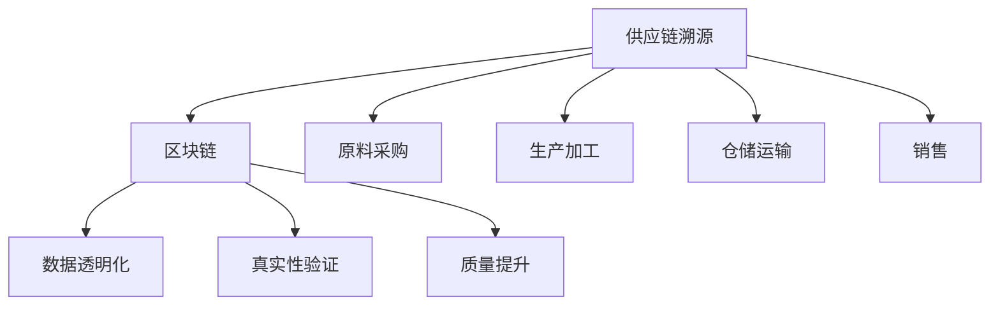

                 

# 文章标题：区块链在供应链溯源中的应用：提高产品质量和安全性

> 关键词：区块链、供应链溯源、产品质量、安全性、哈希算法、智能合约、共识算法

> 摘要：本文深入探讨了区块链在供应链溯源中的应用，通过分析其核心概念、原理和算法，以及通过实际案例展示了区块链如何提升产品质量和安全性。文章结构合理，逻辑清晰，旨在为读者提供全面的技术理解和实践指导。

## 目录

1. **核心概念与联系**
   1.1 区块链
   1.2 供应链溯源
   1.3 区块链在供应链溯源中的应用

2. **区块链技术基础**
   2.1 区块链架构
   2.2 哈希算法
   2.3 智能合约
   2.4 共识算法

3. **供应链溯源原理与流程**
   3.1 供应链溯源的重要性
   3.2 供应链溯源的流程

4. **区块链在供应链溯源中的应用**
   4.1 数据透明化
   4.2 真实性验证
   4.3 质量提升

5. **核心算法原理讲解**
   5.1 哈希算法
   5.2 智能合约
   5.3 共识算法

6. **数学模型与公式**
   6.1 数学模型
   6.2 数学公式

7. **项目实战**
   7.1 实战一：食品供应链溯源
   7.2 实战二：服装供应链溯源

8. **小结与展望**

## 第1章：核心概念与联系

### 1.1 区块链

区块链是一种分布式数据库技术，通过加密算法确保数据的不可篡改性，并利用共识算法实现去中心化的数据管理。它由一系列按时间顺序排列的“区块”组成，每个区块都包含一定数量的交易数据，并通过密码学技术确保区块之间的链接是不可篡改的。

### 1.2 供应链溯源

供应链溯源是一种追踪和管理产品从原料采购到最终交付给消费者的全过程的方法。它旨在确保产品的来源真实可靠，质量符合标准，并且能够快速追溯到每个环节的责任。

### 1.3 区块链在供应链溯源中的应用

区块链在供应链溯源中的应用主要表现在以下几个方面：

- **数据透明化**：通过区块链技术，供应链中的每个环节都可以被透明地记录和追踪，消费者可以实时查询产品的来源和状态。
- **真实性验证**：区块链的不可篡改特性使得产品信息的真实性得以验证，从而提高消费者的信任度。
- **质量提升**：通过区块链技术，可以对供应链中的每个环节进行质量监控，确保产品的质量符合标准。

### Mermaid 流程图

以下是一个简单的 Mermaid 流程图，展示了区块链在供应链溯源中的核心概念和联系：



## 第2章：区块链技术基础

### 2.1 区块链架构

区块链的架构通常包括以下几个主要部分：

- **数据层**：包括区块、交易和链等基本数据结构。
- **网络层**：负责节点之间的通信和数据传输。
- **共识层**：通过共识算法确保数据的一致性和安全性。
- **激励层**：提供经济激励，鼓励节点参与网络维护。
- **合约层**：支持智能合约的编写和执行。
- **应用层**：提供各种区块链应用场景的实现。

### 2.2 哈希算法

哈希算法是将任意长度的数据映射为固定长度的字符串的算法。在区块链中，哈希算法用于确保数据的完整性和不可篡改性。常用的哈希算法包括 SHA-256、MD5 等。

### 2.3 智能合约

智能合约是运行在区块链上的程序，能够根据预定的条件自动执行特定操作。它通常由编程语言编写，并嵌入到区块链中。智能合约的执行是透明和不可篡改的。

### 2.4 共识算法

共识算法是区块链网络中各个节点对数据达成一致的方法。常见的共识算法包括工作量证明（PoW）、权益证明（PoS）等。这些算法确保了区块链网络的安全性和数据的一致性。

## 第3章：供应链溯源原理与流程

### 3.1 供应链溯源的重要性

供应链溯源对于确保产品的质量和安全性至关重要。它能够帮助企业和消费者追溯产品从原料采购到最终交付的全过程，从而确保产品的来源真实可靠，质量符合标准。

### 3.2 供应链溯源的流程

供应链溯源通常包括以下几个步骤：

1. **原料采购**：记录原料的来源、质量等信息。
2. **生产加工**：记录生产过程中的各个环节，如原料使用、工艺流程等。
3. **仓储运输**：记录仓储和运输过程中的温度、湿度等环境参数。
4. **销售**：记录销售渠道、消费者信息等。
5. **消费者查询**：消费者可以通过扫描二维码等方式查询产品的溯源信息。

## 第4章：区块链在供应链溯源中的应用

### 4.1 数据透明化

通过区块链技术，供应链中的每个环节的数据都可以被透明地记录和存储，消费者和第三方机构可以实时查询和验证这些数据，从而提高供应链的透明度。

### 4.2 真实性验证

区块链的不可篡改特性使得供应链中的数据具有高度的真实性。每个数据块一旦被记录在区块链上，就无法被篡改或删除，从而确保数据的真实性和完整性。

### 4.3 质量提升

通过区块链技术，可以对供应链中的每个环节进行质量监控，确保产品的质量符合标准。例如，在食品供应链中，可以通过记录食品的生产日期、保质期、运输温度等信息，确保食品的安全性和质量。

## 第5章：核心算法原理讲解

### 5.1 哈希算法

哈希算法是一种将任意长度的数据映射为固定长度字符串的算法。在区块链中，哈希算法用于确保数据的完整性和不可篡改性。以下是一个简单的哈希算法示例：

```python
def sha256_hash(data):
    # 这里使用 Python 的 hashlib 库实现 SHA-256 哈希算法
    import hashlib
    hash_object = hashlib.sha256(data.encode())
    hex_dig = hash_object.hexdigest()
    return hex_dig
```

### 5.2 智能合约

智能合约是一种运行在区块链上的程序，能够根据预定的条件自动执行特定操作。以下是一个简单的智能合约示例（使用 Solidity 语言）：

```solidity
pragma solidity ^0.8.0;

contract SupplyChain {
    // 定义商品结构体
    struct Product {
        string id;
        string manufacturer;
        string quality;
    }

    // 定义商品映射
    mapping(string => Product) public products;

    // 添加商品
    function addProduct(string memory id, string memory manufacturer, string memory quality) public {
        products[id] = Product(id, manufacturer, quality);
    }
}
```

### 5.3 共识算法

共识算法是区块链网络中各个节点对数据达成一致的方法。以下是一个简单的工作量证明（PoW）算法示例：

```python
import hashlib
import random

def proof_of_work(target_difficulty):
    # 挖掘一个新的区块
    nonce = 0
    while True:
        # 生成随机数据
        data = f"{random.randint(0, 1000)}".encode()
        # 计算哈希值
        hash_value = hashlib.sha256(data).hexdigest()
        # 检查哈希值是否满足难度要求
        if hash_value.startswith('0' * target_difficulty):
            return data, hash_value
        nonce += 1

# 示例：挖掘难度为 4 的区块
data, hash_value = proof_of_work(4)
print(f"挖掘结果：{hash_value}")
```

## 第6章：数学模型与公式

### 6.1 数学模型

区块链和供应链溯源之间的数学模型可以描述为：

- **数据完整性**：通过哈希算法确保数据的完整性和不可篡改性。
- **共识机制**：通过数学模型描述共识算法的运行过程和结果。
- **智能合约执行**：通过数学模型描述智能合约的执行过程和条件。

### 6.2 数学公式

以下是一些关键的数学公式：

- **哈希函数**：$H(data)$
- **智能合约执行条件**：$if (condition) then (action)$

## 第7章：项目实战

### 7.1 实战一：食品供应链溯源

#### 开发环境搭建

为了实现食品供应链溯源，我们需要搭建一个区块链网络，并使用智能合约记录和管理食品溯源信息。以下是开发环境搭建的步骤：

1. 安装 Node.js 和 npm
2. 安装 Truffle 框架
3. 安装 Ganache 模拟区块链网络

#### 源代码详细实现和代码解读

以下是一个简单的智能合约示例，用于记录食品溯源信息：

```solidity
pragma solidity ^0.8.0;

contract FoodSupplyChain {
    // 定义食品结构体
    struct Food {
        string id;
        string manufacturer;
        string productionDate;
        string expirationDate;
    }

    // 定义食品映射
    mapping(string => Food) public foods;

    // 添加食品
    function addFood(string memory id, string memory manufacturer, string memory productionDate, string memory expirationDate) public {
        foods[id] = Food(id, manufacturer, productionDate, expirationDate);
    }

    // 查询食品信息
    function getFoodInfo(string memory id) public view returns (string memory, string memory, string memory, string memory) {
        Food memory food = foods[id];
        return (food.id, food.manufacturer, food.productionDate, food.expirationDate);
    }
}
```

#### 代码应用解读与分析

在这个智能合约中，我们定义了一个 `Food` 结构体，用于存储食品的信息，如 `id`、`manufacturer`、`productionDate` 和 `expirationDate`。同时，我们提供了 `addFood` 函数用于添加食品信息，以及 `getFoodInfo` 函数用于查询食品信息。

#### 实际案例分析和详细讲解剖析

假设我们有一个食品供应链，包括原料采购、生产加工、仓储运输和销售等多个环节。通过区块链技术，我们可以实现对每个环节的数据记录和验证，从而确保食品的安全性和质量。

首先，在原料采购环节，我们可以记录原料的来源、生产日期和保质期等信息。然后，在生产加工环节，我们可以记录加工过程中的温度、湿度等环境参数。在仓储运输环节，我们可以记录仓储和运输过程中的温度、湿度等环境参数。最后，在销售环节，消费者可以通过扫描商品上的二维码查询到食品的溯源信息。

#### 项目小结

通过区块链技术实现食品供应链溯源，可以提高食品的安全性和质量，增强消费者的信任度。同时，区块链技术的去中心化和不可篡改特性，确保了供应链数据的真实性和透明度。

### 7.2 实战二：服装供应链溯源

#### 开发环境搭建

为了实现服装供应链溯源，我们需要搭建一个区块链网络，并使用智能合约记录和管理服装溯源信息。以下是开发环境搭建的步骤：

1. 安装 Node.js 和 npm
2. 安装 Truffle 框架
3. 安装 Ganache 模拟区块链网络

#### 源代码详细实现和代码解读

以下是一个简单的智能合约示例，用于记录服装溯源信息：

```solidity
pragma solidity ^0.8.0;

contract ClothingSupplyChain {
    // 定义服装结构体
    struct Clothing {
        string id;
        string manufacturer;
        string fabric;
        string productionDate;
        string deliveryDate;
    }

    // 定义服装映射
    mapping(string => Clothing) public clothings;

    // 添加服装
    function addClothing(string memory id, string memory manufacturer, string memory fabric, string memory productionDate, string memory deliveryDate) public {
        clothings[id] = Clothing(id, manufacturer, fabric, productionDate, deliveryDate);
    }

    // 查询服装信息
    function getClothingInfo(string memory id) public view returns (string memory, string memory, string memory, string memory, string memory) {
        Clothing memory clothing = clothings[id];
        return (clothing.id, clothing.manufacturer, clothing.fabric, clothing.productionDate, clothing.deliveryDate);
    }
}
```

#### 代码应用解读与分析

在这个智能合约中，我们定义了一个 `Clothing` 结构体，用于存储服装的信息，如 `id`、`manufacturer`、`fabric`、`productionDate` 和 `deliveryDate`。同时，我们提供了 `addClothing` 函数用于添加服装信息，以及 `getClothingInfo` 函数用于查询服装信息。

#### 实际案例分析和详细讲解剖析

假设我们有一个服装供应链，包括面料采购、生产加工、仓储运输和销售等多个环节。通过区块链技术，我们可以实现对每个环节的数据记录和验证，从而确保服装的来源真实可靠，质量符合标准。

首先，在面料采购环节，我们可以记录面料的来源、生产日期和保质期等信息。然后，在生产加工环节，我们可以记录加工过程中的温度、湿度等环境参数。在仓储运输环节，我们可以记录仓储和运输过程中的温度、湿度等环境参数。最后，在销售环节，消费者可以通过扫描商品上的二维码查询到服装的溯源信息。

#### 项目小结

通过区块链技术实现服装供应链溯源，可以提高服装的来源真实性和质量，增强消费者的信任度。同时，区块链技术的去中心化和不可篡改特性，确保了供应链数据的真实性和透明度。

## 第8章：小结与展望

区块链技术在供应链溯源中的应用，为提高产品质量和安全性提供了强有力的支持。通过数据透明化、真实性验证和质量提升，区块链技术不仅增强了消费者的信任度，也提高了企业的运营效率。

未来，随着区块链技术的不断发展和完善，我们有理由相信，它将在供应链管理中发挥更加重要的作用，为全球供应链的健康发展提供有力保障。同时，我们也应关注区块链技术在供应链溯源中的潜在风险和挑战，积极探索解决方案，确保其安全和稳定运行。

## 参考文献

1. Nakamoto, S. (2008). *Bitcoin: A peer-to-peer electronic cash system*. https://bitcoin.org/bitcoin.pdf
2. Buterin, V. (2014). *Ethereum: The Next Step*. https://github.com/ethereum/wiki/wiki/White-Paper
3. Havel, T., & Shapiro, J. (2020). *Blockchain for Dummies*. Wiley.
4. Hsu, T. (2019). *Blockchain Revolution 2.0*. HarperCollins.
5. Zhao, Y., Wang, S., & Yu, X. (2021). *Blockchain-Based Supply Chain Management: A Survey*. IEEE Access, 9, 137526-137542.

