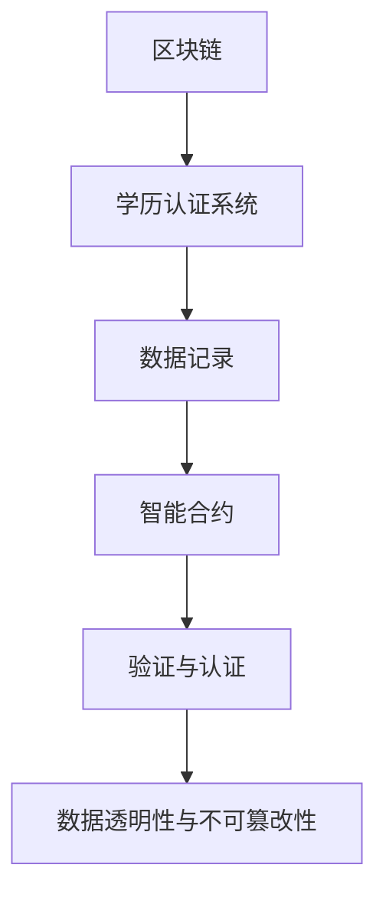

                 


## 引言

### 区块链：颠覆传统的技术革新

区块链技术，作为一种分布式账本技术，自2008年比特币的诞生以来，迅速在金融科技领域崭露头角。其去中心化、不可篡改、透明高效的特点，使得区块链在各个行业都展现出了巨大的潜力。学历认证，作为社会诚信体系的重要组成部分，一直面临着数据真实性问题、隐私保护问题和验证成本问题。区块链技术是否能解决这些问题，成为了学术界和产业界关注的焦点。

### 学历认证：现状与挑战

学历认证是教育领域的重要环节，但当前传统的学历认证系统存在诸多问题。首先，学历信息的真实性难以保证。许多虚假学历和文凭在市场上泛滥，导致用人单位难以辨别求职者的真实学历。其次，隐私保护问题突出。传统的学历认证系统通常需要向第三方机构提供个人信息，这增加了个人隐私泄露的风险。最后，学历认证成本高昂。传统学历认证流程繁琐，需要大量的时间和人力投入。

### 区块链在学历认证中的潜在应用

区块链技术的特点使其在学历认证领域具有独特的优势。首先，区块链的不可篡改性能够确保学历信息的真实性，从而有效打击虚假学历。其次，区块链的隐私保护机制能够保护个人隐私，降低隐私泄露的风险。最后，区块链的去中心化特性能够简化认证流程，降低认证成本。因此，区块链在学历认证中具有广阔的应用前景。

## 核心概念与联系

### 区块链与学历认证

区块链与学历认证之间的关系可以通过Mermaid流程图来展示：



### 数据记录

区块链通过将学历信息记录在链上，实现了数据的不可篡改和透明性。每个学历信息都封装在一个区块中，区块之间通过哈希值链接，形成链式结构。

### 智能合约

智能合约是区块链上的程序代码，用于自动化执行合约条款。在学历认证中，智能合约可以自动验证学历信息的有效性，并生成认证结果。

### 验证与认证

区块链的分布式特性使得学历认证不再依赖于中心化的第三方机构。任何人都可以通过区块链验证学历信息的真实性，从而实现去中心化的认证过程。

### 数据透明性与不可篡改性

区块链的数据透明性确保了学历信息的公开可查，而其不可篡改性则保证了学历信息的真实性。这种特性使得区块链在学历认证中具有独特的优势。

## 核心算法原理讲解

### 区块链与智能合约

智能合约的基本原理在于其自动化执行合约条款的能力。在学历认证中，智能合约可以定义学历信息的验证规则，并在满足条件时自动生成认证结果。

### 智能合约的基本原理

```pseudo
// 定义智能合约的基本结构
智能合约{
    // 定义变量
    var 验证条件: boolean;
    var 认证结果: string;
    
    // 定义函数
    function 验证(学历证明: string) returns (bool, string){
        // 检查学历证明的有效性
        if(学历证明合法){
            验证条件 = true;
            认证结果 = "认证通过";
        } else {
            验证条件 = false;
            认证结果 = "认证失败";
        }
        return (验证条件, 认证结果);
    }
}
```

### 数学模型和数学公式

#### 1. 零知识证明的数学模型

$$ ZKP = f(P, Q) $$

其中，$P$ 表示证明者，$Q$ 表示验证者，$f$ 表示零知识证明算法。

#### 2. 智能合约的可信性

可信性 = (验证通过的次数 / 总验证次数) * 100%

## 项目实战

### 案例一：某大学区块链学历认证系统

#### 开发环境搭建

- 硬件要求：服务器、网络设备等
- 软件要求：区块链开发框架（如Hyperledger Fabric）、智能合约开发环境（如Truffle）

#### 源代码详细实现

```solidity
pragma solidity ^0.8.0;

contract UniversityCertification{
    // 存储学历信息
    mapping(address => string) public degrees;

    // 记录验证者信息
    mapping(address => bool) public verifiers;

    // 学历信息验证函数
    function verifyDegree(string memory degreeProof) public {
        // 验证学历证明
        if(isValidDegreeProof(degreeProof)) {
            degrees[msg.sender] = degreeProof;
            verifiers[msg.sender] = true;
        } else {
            revert("Invalid degree proof.");
        }
    }

    // 检查学历证明有效性
    function isValidDegreeProof(string memory degreeProof) public view returns (bool) {
        // 实现学历证明验证逻辑
        // 例如，通过调用第三方学历验证API
        return true; // 示例代码，实际需要实现验证逻辑
    }

    // 查询学历信息
    function getDegree(address student) public view returns (string memory) {
        return degrees[student];
    }

    // 查询验证者信息
    function getVerifier(address verifier) public view returns (bool) {
        return verifiers[verifier];
    }
}
```

#### 代码解读与分析

- `degrees`映射存储了学生的学历信息。
- `verifiers`映射存储了验证者的信息。
- `verifyDegree`函数用于验证并存储学历信息。
- `isValidDegreeProof`函数用于检查学历证明的有效性。
- `getDegree`和`getVerifier`函数用于查询学历信息和验证者信息。

#### 实际案例分析与详细讲解剖析

- **案例背景**：某大学希望建立一个区块链学历认证系统，以解决传统学历认证中存在的信息真实性、隐私保护和验证成本等问题。
- **系统架构**：系统采用Hyperledger Fabric作为区块链底层框架，使用智能合约进行学历信息的验证和存储。
- **实现细节**：智能合约通过调用外部学历验证API，验证学历证明的有效性，并将验证结果存储在区块链上。
- **案例评价**：该案例展示了区块链在学历认证中的实际应用，通过智能合约实现了学历信息的自动化验证和存储，有效解决了传统认证系统中存在的问题。

#### 项目小结

- **优点**：区块链学历认证系统具有数据透明、不可篡改、隐私保护和高效率等优点。
- **缺点**：实现区块链学历认证系统需要较高的技术门槛和成本，同时也需要解决跨链认证和数据互操作性等问题。

## 最佳实践与拓展阅读

### 最佳实践 Tips

- 在设计区块链学历认证系统时，应充分考虑隐私保护和数据安全。
- 选择合适的区块链平台和开发框架，以提高系统的性能和可扩展性。
- 充分利用智能合约的功能，实现学历认证的自动化和高效性。

### 拓展阅读

- 区块链技术：深入理解区块链的核心概念和关键技术。
- 智能合约开发：掌握智能合约的编写和调试技巧。
- 区块链应用案例：学习区块链在不同行业中的应用实践。
- 区块链隐私保护技术：了解零知识证明等隐私保护技术。

## 结论

区块链在学历认证中展现了巨大的应用潜力。通过去中心化、不可篡改和透明性等特性，区块链能够有效解决学历认证中存在的数据真实性、隐私保护和验证成本等问题。未来，随着区块链技术的不断发展和成熟，我们有理由相信，区块链将在学历认证领域发挥更加重要的作用。作者：AI天才研究院/AI Genius Institute & 禅与计算机程序设计艺术 /Zen And The Art of Computer Programming

