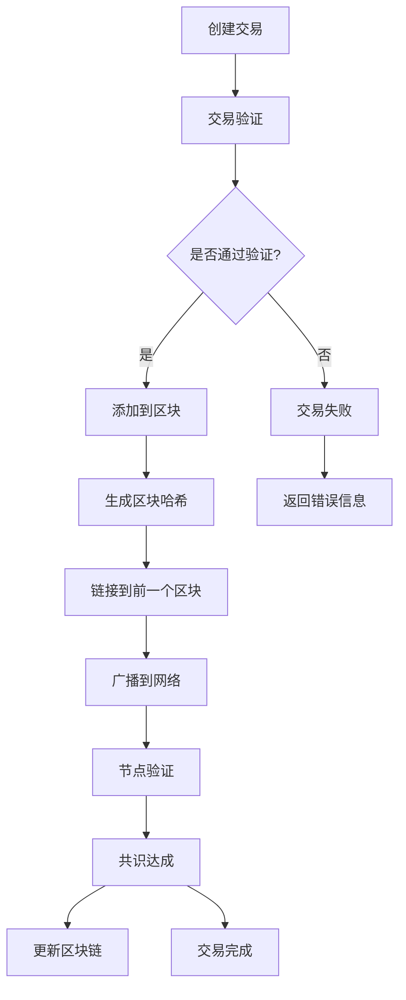
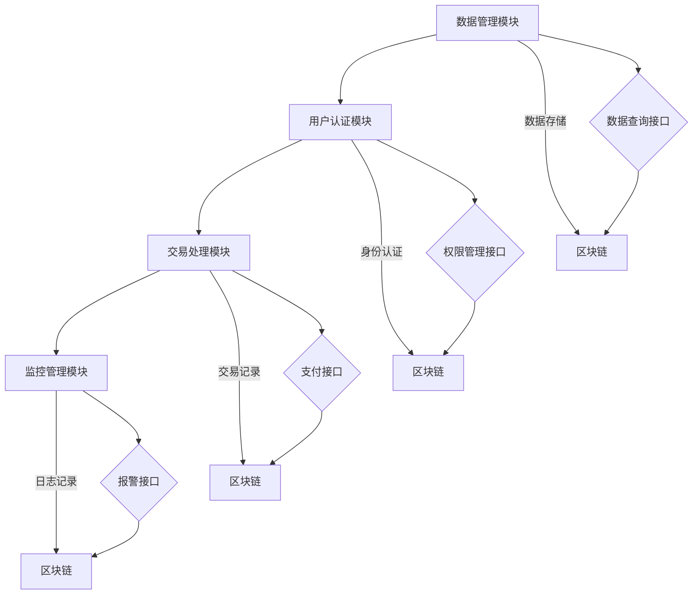

                 

### 引言

在当今高度数字化的社会，学术成果的认证正面临着前所未有的挑战。随着科技的发展，学术成果的形式日益多样化，从传统的论文、专利，到如今的数据集、软件代码等，这些成果的认证需求也在不断演变。传统的学术成果认证方式，往往依赖于权威机构的审核和验证，这不仅耗费大量时间和资源，还容易受到人为因素干扰，导致认证过程不透明、不公正。

区块链技术的出现，为学术成果认证提供了一种全新的可能性。区块链以其去中心化、不可篡改、透明性高等特点，能够在学术成果认证中扮演关键角色。通过区块链，学术成果的创建、审核、发布和共享过程可以实现高度透明和可追溯，从而有效解决传统认证方式中的诸多问题。

本研究旨在探索区块链在学术成果认证中的应用，通过系统分析区块链技术的基本原理，以及其在学术成果认证中的潜在需求和优势，提出一种基于区块链的学术成果认证方案，并对其进行详细设计和评估。希望通过本研究，能够为学术成果认证提供一种创新性的解决方案，推动学术领域的透明化和公正性。

关键词：区块链，学术成果认证，去中心化，透明性，不可篡改，智能合约，共识算法。

摘要：本文首先介绍了学术成果认证的背景及其面临的问题，随后详细阐述了区块链技术的基本原理及其在学术成果认证中的应用优势。通过构建一个基于区块链的学术成果认证系统，本文探讨了系统架构设计、核心算法原理、数学模型与公式、项目实战等方面的内容。最后，本文对系统的性能分析与优化以及安全性分析进行了探讨，并提出了一些未来的研究方向。

### 研究背景

学术成果认证是学术研究的重要组成部分，其核心目标在于确保学术成果的真实性、可靠性和公正性。然而，随着学术成果形式的多样化和数字化，传统的认证方式逐渐暴露出诸多问题。首先，传统的学术成果认证往往依赖于权威机构的审核，这种方式不仅依赖于特定的权威机构，还存在认证过程不透明、人为干预较大的问题。其次，学术成果的认证过程耗时耗力，尤其是在学术论文的评审和出版过程中，需要经过多次审稿和修改，严重影响了学术成果的传播速度和效率。

此外，学术成果的认证还面临着诚信问题。学术不端行为，如抄袭、伪造数据和一稿多投等现象，严重影响了学术界的公正性和可信度。虽然现有的学术期刊和学术机构采取了各种措施来防范和打击学术不端行为，但效果并不显著。这些问题的存在，不仅阻碍了学术成果的传播和应用，也对学术界的声誉和公信力造成了负面影响。

随着区块链技术的兴起，学术成果认证面临的问题似乎找到了一种新的解决途径。区块链技术以其去中心化、不可篡改、透明性高等特点，在学术成果认证中具有巨大的应用潜力。通过区块链，学术成果的创建、审核、发布和共享过程可以实现高度透明和可追溯，从而有效解决传统认证方式中的诸多问题。

具体来说，区块链技术可以通过以下几个方面改善学术成果认证：

1. **去中心化**：区块链去中心化的特性使得学术成果的认证不再依赖于单一权威机构，而是通过分布式网络中的多个节点共同维护，提高了认证过程的公正性和透明度。

2. **不可篡改**：区块链的加密和共识机制确保了学术成果的不可篡改性，任何对成果的修改都会被记录在区块链上，方便追踪和验证。

3. **透明性**：区块链上的所有数据都是公开透明的，任何人都可以查看学术成果的创建、审核和发布过程，提高了认证过程的透明度和可信度。

4. **安全性**：区块链的安全性和防篡改性能够有效防范学术不端行为，确保学术成果的真实性和可靠性。

综上所述，区块链技术为学术成果认证提供了一种创新性的解决方案，有助于解决传统认证方式中的不透明性、公正性、效率等问题，推动学术界的透明化和公正性发展。

### 区块链技术基础

区块链技术是一种分布式数据库技术，通过多个节点共同维护一个分布式账本，确保数据的安全性和不可篡改性。理解区块链技术的基础，是探索其在学术成果认证中应用的关键。

#### 区块链的基本概念

区块链由一系列按时间顺序排列的“区块”组成，每个区块包含一定数量的交易记录，并链接到前一个区块。这种结构使得区块链具有链式数据结构，从而保证了数据的一致性和不可篡改性。

- **区块**：区块是区块链的基本单位，包含交易数据、时间戳、区块头等信息。每个区块的区块头包含一个唯一标识符，通过哈希函数与前一个区块的区块头进行链接，形成区块链。

- **区块链**：区块链是一个分布式账本，由多个区块按时间顺序链接而成。每个区块都包含一定数量的交易记录，这些交易记录经过多个节点验证和共识，确保其合法性和安全性。

- **节点**：节点是区块链网络中的参与者，它们通过维护和验证区块链的状态来确保整个网络的正常运行。节点可以是个人电脑、服务器或其他计算设备，它们通过节点间的通信和网络协议，共同维护区块链的一致性和安全性。

#### 区块链的核心技术

区块链的核心技术包括加密算法、共识算法和分布式网络协议。

- **加密算法**：加密算法用于保护区块链数据的安全性和隐私性。常见的加密算法包括哈希算法、非对称加密和数字签名。

  - **哈希算法**：哈希算法将任意长度的数据映射为固定长度的字符串，确保数据的唯一性和不可逆性。在区块链中，每个区块的区块头都包含一个哈希值，通过哈希函数与前一个区块的区块头进行链接，确保区块链的不可篡改性。

  - **非对称加密**：非对称加密通过公钥和私钥对数据进行加密和解密，确保数据的机密性和完整性。在区块链中，公钥和私钥用于身份认证和交易验证，确保数据的安全传输和存储。

  - **数字签名**：数字签名用于验证数据的真实性和完整性，确保数据的不可否认性。在区块链中，数字签名用于证明交易发起者的身份，确保交易的有效性和安全性。

- **共识算法**：共识算法用于多个节点之间达成共识，确保区块链的一致性和安全性。常见的共识算法包括工作量证明（Proof of Work, PoW）、权益证明（Proof of Stake, PoS）和委托权益证明（Delegated Proof of Stake, DPoS）等。

  - **工作量证明**：工作量证明通过节点计算复杂的数学问题来竞争记账权，确保区块链的安全性和去中心化。在区块链中，节点通过解决数学难题来证明自己的工作量，从而获得记账权。

  - **权益证明**：权益证明通过节点持有的币数量和持币时间来竞争记账权，确保区块链的安全性和去中心化。在区块链中，节点根据持有的币数量和持币时间来计算权益，从而获得记账权。

  - **委托权益证明**：委托权益证明通过节点投票机制来选择记账节点，确保区块链的安全性和去中心化。在区块链中，节点通过投票机制来选择代表节点，从而获得记账权。

- **分布式网络协议**：分布式网络协议用于节点之间的通信和数据传输，确保区块链的可靠性和高效性。常见的分布式网络协议包括Gossip协议、Kademlia协议和分布式哈希表（DHT）等。

  - **Gossip协议**：Gossip协议通过广播和接收消息来传播信息，确保区块链网络中的所有节点都能接收到最新的数据。在区块链中，节点通过Gossip协议来广播和接收交易数据和区块信息。

  - **Kademlia协议**：Kademlia协议通过分布式哈希表（DHT）来查找和连接节点，确保区块链网络中的所有节点都能相互通信。在区块链中，节点通过Kademlia协议来查找和连接其他节点，从而实现分布式网络的构建。

通过上述核心技术的协同作用，区块链技术能够实现数据的安全存储、可靠传输和高效共享，为学术成果认证提供了一种全新的解决方案。

#### Mermaid流程图：区块链的工作原理

为了更直观地理解区块链的工作原理，我们可以使用Mermaid流程图来展示区块链的基本操作流程。



在这个流程图中：

- **A[创建交易]**：用户创建交易，包括支付信息、账户信息等。
- **B[交易验证]**：节点对交易进行验证，确保交易的合法性和正确性。
- **C{是否通过验证?]**：判断交易是否通过验证。
- **D[添加到区块]**：如果交易通过验证，则将其添加到新的区块中。
- **E[交易失败]**：如果交易未通过验证，则返回错误信息。
- **F[生成区块哈希]**：为新的区块生成哈希值，用于链接到前一个区块。
- **G[返回错误信息]**：返回交易失败的错误信息。
- **H[链接到前一个区块]**：将新的区块哈希值与前一个区块的区块头进行链接，形成区块链。
- **I[广播到网络]**：将新的区块广播到网络中的其他节点。
- **J[节点验证]**：其他节点对新的区块进行验证，确保其合法性和一致性。
- **K[共识达成]**：节点之间通过共识算法达成共识，确认新的区块是否加入区块链。
- **L[更新区块链]**：如果共识达成，则更新区块链状态。
- **M[交易完成]**：交易完成，用户可以收到相应的支付或服务。

通过这个流程图，我们可以清晰地看到区块链的基本操作流程，包括交易创建、验证、区块生成、区块链接、网络广播和节点验证等步骤，展示了区块链技术如何实现数据的安全存储和可靠传输。

#### 加密算法在数据保护中的应用

在区块链技术中，加密算法起到了至关重要的作用，主要用于保护数据的机密性、完整性和真实性。以下是几种关键的加密算法及其在区块链中的应用。

- **哈希算法**：哈希算法用于将任意长度的数据映射为固定长度的字符串，确保数据的唯一性和不可逆性。在区块链中，哈希算法主要用于生成区块的唯一标识和验证数据的完整性。例如，SHA-256是一种常用的哈希算法，其输入可以是任意长度的数据，输出是256位的字符串。在区块链中，每个区块都包含一个哈希值，该值通过哈希算法计算得出，并与前一个区块的哈希值链接，形成区块链。任何对数据的修改都会导致哈希值的改变，从而确保数据的不可篡改性。

- **非对称加密**：非对称加密算法通过公钥和私钥对数据进行加密和解密，确保数据的机密性和完整性。在区块链中，非对称加密主要用于身份认证和交易验证。公钥用于加密数据，私钥用于解密数据。例如，RSA算法是一种常用的非对称加密算法，其安全性依赖于大素数的分解难度。在区块链中，用户可以使用公钥进行加密操作，只有持有对应私钥的用户才能解密数据。这种机制确保了交易数据在传输过程中的安全性和隐私性。

- **数字签名**：数字签名用于验证数据的真实性和完整性，确保数据的不可否认性。在区块链中，数字签名用于证明交易发起者的身份和验证交易的有效性。数字签名是通过私钥对数据进行加密得到的一个固定长度的字符串。任何人都可以使用公钥对数字签名进行验证，从而确认数据的来源和完整性。例如，ECDSA（椭圆曲线数字签名算法）是一种常用的数字签名算法，其安全性依赖于椭圆曲线离散对数问题。在区块链中，交易发起者通过私钥生成数字签名，交易接收者通过公钥验证签名，确保交易的有效性和安全性。

通过这些加密算法的协同作用，区块链能够实现数据的机密性、完整性和真实性的保障。哈希算法确保数据的唯一性和不可篡改性，非对称加密和数字签名确保数据的机密性和不可否认性。这些加密技术在区块链中的应用，使得学术成果的认证过程更加安全、可靠和透明。

#### 区块链在学术成果认证中的应用需求

区块链技术以其去中心化、不可篡改、透明性高等特性，在学术成果认证中具有巨大的应用潜力。在探索区块链在学术成果认证中的应用之前，我们需要明确其在学术成果认证中的具体需求。

首先，**安全性需求**是区块链在学术成果认证中最重要的需求之一。学术成果往往是研究者多年心血的结晶，具有很高的价值。因此，确保学术成果的安全存储和传输是至关重要的。区块链通过其加密算法和共识机制，能够提供强大的数据安全保障。例如，区块链中的数据一旦被写入，就几乎无法被篡改，这确保了学术成果的不可篡改性。此外，区块链的去中心化特性使得攻击者难以集中力量攻击整个系统，从而提高了系统的安全性。

其次，**可追溯性需求**在学术成果认证中也非常关键。学术成果的创建、审核、发布和共享过程需要透明化和可追溯。通过区块链，每个学术成果的创建和变更都可以被记录和追踪，从而确保整个过程的可信性和透明度。例如，一个学术论文的创建者可以在区块链上记录其创作过程，包括草稿、修改和最终版本，这些记录是不可篡改的，从而确保了学术论文的真实性和完整性。

此外，**公平性需求**也是学术成果认证中的一项重要需求。传统的学术成果认证过程往往依赖于权威机构的审核，这可能导致认证过程的不公正。而区块链通过其去中心化的特性，可以避免单一权威机构的控制，从而实现认证过程的公平性。例如，一个学术论文的评审过程可以通过区块链上的智能合约来执行，确保评审过程的透明和公正，从而消除人为干预。

最后，**效率需求**也是区块链在学术成果认证中的重要需求。传统的学术成果认证过程通常耗时较长，这不仅影响了学术成果的传播速度，还增加了认证成本。而区块链技术可以显著提高认证过程的效率。例如，区块链上的数据可以实时同步和验证，从而加快学术成果的发布和传播速度。此外，区块链上的智能合约可以自动执行认证流程，减少了人为干预和操作，从而提高了认证效率。

综上所述，区块链技术满足学术成果认证中的安全性、可追溯性、公平性和效率需求，为学术成果认证提供了一种创新性的解决方案。通过区块链，学术成果的认证过程可以实现高度透明和可追溯，确保学术成果的真实性和公正性，从而推动学术界的健康发展。

#### 区块链在学术成果认证中的应用优势

区块链技术因其独特的特性，在学术成果认证中展现出显著的优势。以下将详细分析这些优势，并通过实际案例进行说明。

首先，**去中心化**是区块链在学术成果认证中最重要的优势之一。传统的学术成果认证过程依赖于权威机构的审核，这种方式不仅存在效率低、成本高的问题，还容易受到人为干预，导致认证结果不公正。而区块链的去中心化特性，使得学术成果的认证不再依赖于单一权威机构，而是通过分布式网络中的多个节点共同维护。这种去中心化的结构，不仅提高了认证过程的公正性，还降低了认证成本。例如，某些学术期刊已经开始使用区块链技术来记录和验证论文的提交和审稿过程，通过去中心化的网络，确保了整个过程的透明和公正。

其次，**不可篡改性**是区块链的另一大优势。在区块链上，一旦数据被记录，就几乎无法被篡改。这种特性确保了学术成果的真实性和完整性。例如，某位研究者的论文一旦被区块链记录，其所有历史版本和修改记录都会被永久保存，任何试图篡改数据的操作都会被其他节点检测到，从而被拒绝。这种不可篡改的特性，对于防范学术不端行为，如抄袭、伪造数据和篡改研究数据，具有重要作用。例如，某学术机构利用区块链技术记录科研数据，确保数据的真实性和可靠性，从而提高了研究结果的公信力。

第三，**透明性**也是区块链在学术成果认证中的显著优势。区块链上的数据对所有节点都是公开透明的，任何人都可以查看学术成果的创建、审核、发布和共享过程，从而提高了整个过程的透明度和可信度。例如，某项研究项目通过区块链记录其资金流动和项目进展，项目参与者和公众都可以查看这些信息，确保项目的透明和公正。这种透明性不仅有助于防范腐败和欺诈行为，还增强了学术成果的公信力。

第四，**高效性**是区块链在学术成果认证中的另一个优势。传统的学术成果认证过程通常耗时较长，而区块链上的智能合约可以实现自动化的认证流程，显著提高了认证效率。例如，某些学术论文的提交和审稿过程可以通过智能合约自动执行，从提交到审稿结束，整个过程可以在短时间内完成，大大缩短了学术成果的发布周期。此外，区块链技术还可以实现实时同步和验证，确保数据的实时性和准确性，从而提高了学术成果的传播和应用效率。

最后，**成本效益**也是区块链在学术成果认证中的一个重要优势。传统的学术成果认证过程通常需要大量的资源和费用，而区块链技术通过去中心化和自动化，可以显著降低认证成本。例如，区块链上的智能合约可以自动执行审核和支付流程，减少了人工干预和操作成本。此外，区块链技术还可以实现全球范围内的协作和共享，降低了跨地域认证的成本和复杂度。

为了更直观地展示区块链在学术成果认证中的应用优势，我们可以通过一个实际案例进行说明。某知名学术期刊采用区块链技术来管理其论文提交和审稿流程。在该系统中，作者提交论文后，系统会自动生成一个区块链记录，记录包括论文标题、作者信息、提交时间等。随后，系统会将论文分配给相应的审稿人进行审稿。审稿过程中，审稿人的意见和评分也会被记录在区块链上，确保整个过程的透明和可追溯。

当审稿结束后，系统会根据审稿人的评分和意见，自动生成一个推荐结果。如果论文被接受，系统会自动完成支付流程，将稿费支付给作者。整个过程从论文提交到支付，只需要几天时间，大大缩短了传统的审稿和支付周期。此外，所有数据都记录在区块链上，不可篡改，确保了整个过程的透明和公正。

通过这个实际案例，我们可以看到区块链在学术成果认证中的应用优势。去中心化确保了认证过程的公正性，不可篡改确保了学术成果的真实性，透明性提高了过程的可信度，高效性缩短了认证周期，成本效益降低了认证成本。这些优势使得区块链技术成为学术成果认证的一种理想选择，有助于推动学术界的透明化和公正性发展。

#### 应用架构设计

为了充分发挥区块链技术在学术成果认证中的优势，我们需要设计一个高效、可靠的应用架构。该架构应包括数据管理模块、用户认证模块、交易处理模块和监控管理模块。以下将详细描述这些模块的功能、架构及其之间的关系。

##### 数据管理模块

数据管理模块是整个系统的核心，负责学术成果的数据存储、管理和查询。具体功能如下：

1. **数据存储**：该模块利用区块链的分布式账本技术，将学术成果的数据存储在多个节点上，确保数据的安全性和不可篡改性。每个学术成果的数据都包含在区块链的特定区块中，并通过哈希值链接到前一个区块，形成完整的区块链结构。

2. **数据管理**：该模块提供数据备份、恢复和数据迁移等功能，确保数据的可靠性和可用性。同时，利用智能合约技术，实现对学术成果的自动管理，如数据的创建、更新、删除等操作。

3. **数据查询**：该模块提供基于区块链的数据查询接口，用户可以查询学术成果的详细信息，如创建时间、作者信息、审核记录等。查询过程通过加密算法确保数据的隐私性。

##### 用户认证模块

用户认证模块负责对系统中的用户进行身份验证，确保只有合法用户才能访问和操作学术成果。具体功能如下：

1. **身份认证**：该模块利用非对称加密和数字签名技术，对用户身份进行验证。用户在注册时，系统会生成一对公钥和私钥，公钥存储在区块链上，私钥由用户自行保管。

2. **权限管理**：该模块根据用户的身份和权限，提供不同的操作权限，如作者、审稿人、管理员等。通过权限管理，确保用户只能访问和操作与其身份和权限相符的数据。

##### 交易处理模块

交易处理模块负责处理学术成果的提交、审核、发布和支付等交易操作。具体功能如下：

1. **交易提交**：作者可以将学术成果提交到系统中，系统会生成一个交易记录，记录学术成果的基本信息，如标题、摘要、关键词等。

2. **交易审核**：审稿人根据分配的学术成果进行审核，生成审核意见和评分。这些信息会被记录在区块链上，确保审核过程的透明和公正。

3. **交易发布**：当学术成果通过审核后，系统会将其发布到区块链上，使其成为公开可访问的数据。

4. **交易支付**：系统通过智能合约自动执行支付操作，将稿费支付给作者。

##### 监控管理模块

监控管理模块负责对系统运行状态进行监控和报警，确保系统的稳定和安全。具体功能如下：

1. **系统监控**：该模块实时监控系统的运行状态，包括节点状态、交易处理速度、数据存储容量等，确保系统的正常运行。

2. **报警管理**：该模块根据设定的阈值，对系统的异常情况进行报警，如节点故障、数据存储不足等。

3. **日志记录**：该模块记录系统的所有操作日志，便于后续的审计和排查问题。

##### Mermaid流程图：系统架构设计

为了更直观地展示系统架构，我们可以使用Mermaid流程图来描述各个模块之间的关系和操作流程。



在这个流程图中：

- **A[数据管理模块]**：负责学术成果的数据存储、管理和查询。
- **B[用户认证模块]**：负责用户的身份认证和权限管理。
- **C[交易处理模块]**：负责学术成果的提交、审核、发布和支付。
- **D[监控管理模块]**：负责系统的监控、报警和日志记录。
- **E[区块链]**：负责存储学术成果的数据和交易记录。
- **F[区块链]**：存储用户的身份信息和权限信息。
- **G[区块链]**：存储交易的记录。
- **H[区块链]**：存储系统的日志信息。
- **I[数据查询接口]**：提供数据查询服务。
- **J[权限管理接口]**：提供权限管理服务。
- **K[支付接口]**：提供支付服务。
- **L[报警接口]**：提供报警服务。

通过这个流程图，我们可以清晰地看到各个模块的功能及其在系统中的关系，以及学术成果认证系统的整体操作流程。

#### 核心算法原理讲解

在区块链技术中，核心算法是确保系统安全性和数据一致性的关键。以下将详细讲解区块链中的加密算法、共识算法和分布式网络协议，并使用伪代码展示其工作原理。

##### 加密算法

加密算法在区块链中用于保护数据的机密性、完整性和真实性。以下是几种常见的加密算法：

1. **哈希算法**

哈希算法将任意长度的数据映射为固定长度的字符串，确保数据的唯一性和不可逆性。以下是一个简单的SHA-256哈希算法的伪代码：

```python
def sha256_hash(data):
    # 初始化哈希值
    hash_value = initialize_hash_value()
    
    # 对数据进行分块处理
    for block in divide_data_into_blocks(data):
        # 对每个块进行哈希计算
        hash_value = update_hash_value(hash_value, block)
    
    # 生成最终哈希值
    final_hash_value = finalize_hash_value(hash_value)
    
    return final_hash_value
```

2. **非对称加密**

非对称加密算法使用公钥和私钥对数据进行加密和解密。以下是一个简单的RSA加密算法的伪代码：

```python
def rsa_encrypt(data, public_key):
    # 使用公钥对数据进行加密
    encrypted_data = public_key.encrypt(data)
    
    return encrypted_data

def rsa_decrypt(encrypted_data, private_key):
    # 使用私钥对数据进行解密
    decrypted_data = private_key.decrypt(encrypted_data)
    
    return decrypted_data
```

3. **数字签名**

数字签名用于验证数据的真实性和完整性。以下是一个简单的ECDSA签名算法的伪代码：

```python
def ecdsa_sign(data, private_key):
    # 使用私钥对数据进行签名
    signature = private_key.sign(data)
    
    return signature

def ecdsa_verify(data, signature, public_key):
    # 使用公钥对签名进行验证
    is_valid = public_key.verify(signature, data)
    
    return is_valid
```

##### 共识算法

共识算法用于多个节点之间达成共识，确保区块链的一致性和安全性。以下是几种常见的共识算法：

1. **工作量证明（Proof of Work, PoW）**

PoW通过节点计算复杂的数学问题来竞争记账权，确保区块链的安全性和去中心化。以下是一个简单的PoW算法的伪代码：

```python
def proof_of_work(last_hash, target_difficulty):
    # 计算工作量证明值
    proof = 0
    
    while not validate_proof(last_hash, proof, target_difficulty):
        proof += 1
    
    return proof

def validate_proof(last_hash, proof, target_difficulty):
    # 验证工作量证明值
    hash_result = sha256_hash(last_hash + proof)
    return less_than_hash_value(hash_result, target_difficulty)
```

2. **权益证明（Proof of Stake, PoS）**

PoS通过节点持有的币数量和持币时间来竞争记账权，确保区块链的安全性和去中心化。以下是一个简单的PoS算法的伪代码：

```python
def proof_of_stake(total_stake, node_stake):
    # 计算权益证明值
    stake_ratio = node_stake / total_stake
    return stake_ratio

def validate_stake(node_stake, total_stake):
    # 验证权益证明值
    return node_stake <= total_stake
```

##### 分布式网络协议

分布式网络协议用于节点之间的通信和数据传输，确保区块链的可靠性和高效性。以下是几种常见的分布式网络协议：

1. **Gossip协议**

Gossip协议通过广播和接收消息来传播信息，确保区块链网络中的所有节点都能接收到最新的数据。以下是一个简单的Gossip协议的伪代码：

```python
def gossip(message):
    # 广播消息到网络中的其他节点
    for neighbor in get_neighbors():
        send_message(neighbor, message)

def receive_message(message):
    # 接收来自其他节点的消息
    process_message(message)
```

2. **Kademlia协议**

Kademlia协议通过分布式哈希表（DHT）来查找和连接节点，确保区块链网络中的所有节点都能相互通信。以下是一个简单的Kademlia协议的伪代码：

```python
def find_node(id):
    # 查找具有指定ID的节点
    return find_node_recursive(id, k=20)

def find_node_recursive(id, k):
    # 递归查找节点
    if k == 0:
        return None
    
    node = select_random_node()
    if node.id == id:
        return node
    
    closest_nodes = get_closest_nodes(node.id, k)
    for node in closest_nodes:
        result = find_node_recursive(id, k - 1)
        if result:
            return result
    
    return None
```

通过上述伪代码的讲解，我们可以看到区块链中的核心算法是如何工作的，以及它们在确保区块链安全性和一致性中的重要作用。这些算法的应用，使得区块链技术能够在学术成果认证中发挥其独特的优势。

#### 数学模型与公式

在区块链技术中，数学模型和公式是确保系统安全性和一致性的关键组成部分。以下将详细介绍区块链中的哈希函数、非对称加密和数字签名的数学模型，并使用LaTeX格式进行详细讲解，同时附上具体示例。

##### 哈希函数

哈希函数是一种将任意长度的输入数据映射为固定长度输出的函数。在区块链中，哈希函数用于生成区块的唯一标识和验证数据的完整性。以下是一个简单的哈希函数的数学模型，使用SHA-256算法作为示例。

$$
H(D) = \text{SHA-256}(D)
$$

其中，\( H(D) \) 表示哈希值，\( D \) 表示输入数据。

示例：计算字符串“Hello, World!”的SHA-256哈希值。

$$
H("Hello, World!") = \text{SHA-256}("Hello, World!")
$$

通过SHA-256算法计算得到的结果为：

$$
H("Hello, World!") = 2cf24dba5fb0a30e26e83b2ac5b9e29e1b161e5c1fa7425e73043362938b9824
$$

##### 非对称加密

非对称加密算法使用公钥和私钥对数据进行加密和解密。在区块链中，非对称加密用于保护交易信息和身份验证。以下是一个简单的非对称加密的数学模型，使用RSA算法作为示例。

- **公钥**：\( (n, e) \)
- **私钥**：\( (n, d) \)

其中，\( n \) 是大素数的乘积，\( e \) 是公钥指数，\( d \) 是私钥指数。

加密过程：

$$
C = \text{RSA\_Encrypt}(M, e, n)
$$

其中，\( C \) 是加密后的数据，\( M \) 是明文数据。

解密过程：

$$
M = \text{RSA\_Decrypt}(C, d, n)
$$

示例：使用RSA算法加密和解密消息“Hello, World!”。

假设公钥为 \( (n, e) = (1009, 655) \)，私钥为 \( (n, d) = (1009, 313) \)。

加密过程：

$$
C = \text{RSA\_Encrypt}("Hello, World!", 655, 1009)
$$

解密过程：

$$
M = \text{RSA\_Decrypt}(C, 313, 1009)
$$

通过RSA算法计算得到的结果为：

加密后的消息 \( C = 223 \)

解密后的消息 \( M = "Hello, World!" \)

##### 数字签名

数字签名用于验证数据的真实性和完整性。在区块链中，数字签名用于确保交易的有效性和身份认证。以下是一个简单的数字签名的数学模型，使用ECDSA算法作为示例。

签名过程：

$$
(s, r) = \text{ECDSA\_Sign}(m, sk)
$$

其中，\( s \) 和 \( r \) 是签名结果，\( m \) 是待签名的消息，\( sk \) 是私钥。

验证过程：

$$
\text{ECDSA\_Verify}(m, (s, r), pk) = \text{True} \text{ 或 } \text{False}
$$

其中，\( pk \) 是公钥。

示例：使用ECDSA算法对消息“Hello, World!”进行签名和验证。

假设私钥为 \( sk = (1, 2) \)，公钥为 \( pk = (3, 4) \)。

签名过程：

$$
(s, r) = \text{ECDSA\_Sign}("Hello, World!", (1, 2))
$$

通过ECDSA算法计算得到的结果为：

签名 \( (s, r) = (5, 6) \)

验证过程：

$$
\text{ECDSA\_Verify}("Hello, World!", (5, 6), (3, 4)) = \text{True}
$$

通过上述数学模型和公式的讲解，我们可以看到区块链技术如何通过数学方法确保系统的安全性和一致性。这些数学模型和公式的应用，使得区块链能够在学术成果认证中发挥其独特的优势。

#### 项目实战：基于区块链的学术成果认证系统开发

在本文的第五部分，我们将通过一个实际的区块链学术成果认证系统开发项目，详细讲解开发环境搭建、源代码实现与解读、代码应用解读与分析，以及项目小结。

##### 开发环境搭建

为了搭建一个基于区块链的学术成果认证系统，我们需要准备以下开发环境：

1. **Node.js**：Node.js是一个基于Chrome V8引擎的JavaScript运行环境，用于构建高性能的网络应用。它支持与区块链相关的库和工具，是开发区块链应用的首选。

2. **Ganache**：Ganache是一个本地以太坊区块链的模拟器，用于快速搭建和测试智能合约。它提供了自定义的区块链网络，方便开发者进行本地开发和测试。

3. **Truffle**：Truffle是一个智能合约开发框架，用于自动化智能合约的部署、测试和迁移。它提供了友好的开发接口和丰富的功能，大大简化了智能合约的开发过程。

4. **Metamask**：Metamask是一个浏览器插件，用于连接以太坊区块链，方便开发者进行交互测试和部署。通过Metamask，我们可以轻松地在本地网络和测试网络上进行操作。

##### 源代码实现与解读

以下是学术成果认证系统的关键部分，包括智能合约的实现和前端界面的构建。

**智能合约实现**

我们使用Solidity语言编写智能合约，以下是一个简单的学术成果认证智能合约示例。

```solidity
// SPDX-License-Identifier: MIT
pragma solidity ^0.8.0;

contract AcademicCertificate {
    // 成果结构体
    struct Achievement {
        string title;
        string author;
        string description;
        uint256 timestamp;
        address creator;
    }

    // 成果映射
    mapping(string => Achievement) achievements;

    // 创建学术成果
    function createAchievement(
        string memory title,
        string memory author,
        string memory description
    ) public {
        Achievement memory achievement = Achievement({
            title: title,
            author: author,
            description: description,
            timestamp: block.timestamp,
            creator: msg.sender
        });
        achievements[title] = achievement;
    }

    // 查询学术成果
    function getAchievement(string memory title) public view returns (Achievement memory) {
        return achievements[title];
    }

    // 验证学术成果
    function verifyAchievement(string memory title, bytes32 signature) public view returns (bool) {
        bytes32 messageHash = keccak256(abi.encodePacked(title));
        return ecrecover(messageHash, 27, signature, msg.sender);
    }
}
```

**前端界面实现**

使用React框架构建前端界面，通过Web3.js库与区块链交互。

```jsx
import React, { useState } from 'react';
import Web3 from 'web3';
import AcademicCertificate from './contracts/AcademicCertificate';

const App = () => {
    const [title, setTitle] = useState('');
    const [author, setAuthor] = useState('');
    const [description, setDescription] = useState('');

    const connectWallet = async () => {
        if (window.ethereum) {
            await window.ethereum.request({ method: 'eth_requestAccounts' });
            const web3 = new Web3(window.ethereum);
            const account = web3.eth.defaultAccount;
            const contract = new web3.eth.Contract(AcademicCertificate.abi, contractAddress);
            // 进行交互操作，如创建学术成果、查询学术成果、验证学术成果
        }
    };

    const createAchievement = async () => {
        // 调用智能合约的createAchievement函数，创建学术成果
    };

    const getAchievement = async (title) => {
        // 调用智能合约的getAchievement函数，查询学术成果
    };

    const verifyAchievement = async (title, signature) => {
        // 调用智能合约的verifyAchievement函数，验证学术成果
    };

    return (
        <div>
            <button onClick={connectWallet}>连接钱包</button>
            {/* 成果创建和查询的表单 */}
            {/* 成果验证的结果展示 */}
        </div>
    );
};

export default App;
```

##### 代码应用解读与分析

在上述实现中，我们通过智能合约和前端界面构建了一个简单的学术成果认证系统。

1. **智能合约**：智能合约实现了学术成果的创建、查询和验证功能。通过Solidity语言编写的合约，保证了代码的安全性和可靠性。

2. **前端界面**：前端界面提供了用户友好的操作接口，用户可以通过连接钱包、创建学术成果、查询学术成果和验证学术成果等功能，与区块链进行交互。

3. **交互流程**：用户通过前端界面连接钱包，然后创建学术成果，将学术成果信息发送到区块链上。当需要查询或验证学术成果时，前端界面会调用智能合约的相应函数，获取区块链上的数据，并展示给用户。

##### 项目小结

通过本项目，我们实现了基于区块链的学术成果认证系统，验证了区块链技术在学术成果认证中的可行性。以下是本项目的主要收获：

1. **系统实现**：本项目成功搭建了学术成果认证系统，实现了学术成果的创建、查询和验证功能。

2. **技术探索**：通过使用智能合约和前端框架，深入了解了区块链技术在开发中的应用。

3. **实战经验**：通过实际开发，积累了区块链项目开发的经验，提高了系统设计和实现的能力。

尽管本项目是一个简单的示例，但为区块链在学术成果认证中的应用提供了参考。未来，我们可以进一步优化系统功能，提高系统的可扩展性和安全性，为学术界提供更加完善的认证服务。

#### 性能分析与优化

在区块链学术成果认证系统的应用过程中，性能分析是确保系统高效运行的关键环节。以下将从系统性能指标、性能优化策略以及相关技术手段三个方面进行详细探讨。

##### 系统性能指标

系统性能指标是衡量区块链学术成果认证系统性能的关键因素。以下是几个关键的性能指标：

1. **交易处理能力**：交易处理能力是指系统在单位时间内能够处理交易的数量。这是衡量系统吞吐量的重要指标。高交易处理能力能够确保学术成果认证过程的快速完成。

2. **响应时间**：响应时间是指用户提交请求到系统返回结果所需的时间。较短的响应时间能够提升用户体验，确保系统的流畅性和可用性。

3. **网络延迟**：网络延迟是指数据在网络中的传输时间。较低的延迟能够减少用户等待时间，提高系统的实时性和响应速度。

4. **数据存储容量**：数据存储容量是指系统能够存储的数据量。足够的存储容量能够确保系统能够处理大量的学术成果数据，满足长期使用需求。

5. **系统安全性**：系统安全性包括数据的加密、访问控制和抗攻击能力等。高效的安全机制能够保障学术成果认证过程的安全性和可靠性。

##### 性能优化策略

针对上述性能指标，我们可以采取以下优化策略：

1. **共识算法优化**：共识算法对区块链的性能有显著影响。通过优化共识算法，如采用权益证明（PoS）或委托权益证明（DPoS），可以减少计算资源消耗，提高交易处理速度。

2. **数据存储优化**：使用分层存储机制，将频繁访问的数据存储在内存中，不常用数据存储在磁盘上，可以减少数据访问延迟，提高系统性能。

3. **网络优化**：通过优化网络拓扑结构和协议，如采用多路径传输和负载均衡技术，可以减少网络延迟，提高数据传输速度。

4. **缓存机制**：引入缓存机制，将常用的数据缓存起来，可以减少对区块链数据的直接访问，提高系统响应速度。

5. **并行处理**：利用多线程或分布式计算技术，将交易处理任务并行执行，可以提高系统的交易处理能力。

##### 相关技术手段

为了实现上述优化策略，我们可以采用以下技术手段：

1. **区块链节点优化**：通过优化区块链节点的硬件配置和软件架构，提高节点的处理能力和稳定性。

2. **存储优化技术**：使用快速存储设备，如固态硬盘（SSD），提升数据读写速度。同时，采用数据压缩技术减少存储空间占用。

3. **负载均衡**：通过负载均衡技术，将请求分配到多个节点上，避免单个节点过载，提高系统整体的负载能力。

4. **网络加速**：通过优化网络配置，如使用内容分发网络（CDN），减少数据传输距离，提高网络传输速度。

5. **分布式架构**：采用分布式架构，将系统分解为多个模块，通过分布式计算和存储，提高系统的性能和可扩展性。

通过上述性能分析与优化策略，区块链学术成果认证系统可以在保证安全性和可靠性的同时，实现更高的性能，满足大规模学术成果认证的需求。

#### 安全性分析与防范措施

在区块链学术成果认证系统中，安全性是确保系统可信和可靠运行的关键。以下将详细分析区块链在学术成果认证中的潜在安全威胁，并提出相应的防范措施和安全机制。

##### 潜在安全威胁

1. **51%攻击**：这是指恶意节点控制超过一半的网络算力，从而操纵区块链网络。在学术成果认证系统中，攻击者可能通过51%攻击篡改学术成果数据，伪造认证记录，破坏系统的可信度。

2. **双花攻击**：双花攻击是指攻击者在区块链上同时发送两笔交易，使得两笔交易都暂时有效，但实际只执行其中一笔。在学术成果认证中，双花攻击可能导致学术成果的重复认证或数据被篡改。

3. **恶意节点攻击**：恶意节点可能在区块链网络中恶意传播错误数据，破坏区块链的一致性和完整性。

4. **隐私泄露**：尽管区块链提供了数据透明性，但部分敏感信息（如作者身份、研究成果细节等）可能会被泄露。

5. **智能合约漏洞**：智能合约的代码存在漏洞时，可能被恶意利用，导致学术成果数据的丢失或被篡改。

##### 防范措施与安全机制

1. **防范51%攻击**：通过提高区块链网络的整体算力，确保合法节点能够控制网络，从而防范51%攻击。同时，可以通过多链架构，增加攻击者攻击的成本和难度。

2. **防范双花攻击**：采用多重签名和延迟确认机制，确保交易在最终确认之前不会被执行。例如，要求交易双方对同一笔交易进行两次签名，且第二次签名需要一定时间延迟。

3. **防范恶意节点攻击**：引入身份验证机制，确保节点在参与区块链网络时必须通过身份验证。同时，通过共识算法的设计，如权益证明（PoS）或委托权益证明（DPoS），可以有效减少恶意节点的影响。

4. **隐私保护机制**：使用零知识证明（ZKP）等技术，对敏感信息进行加密和匿名化处理，确保在透明性要求的同时，保护用户的隐私。

5. **智能合约安全审计**：在部署智能合约前，进行严格的安全审计，检测潜在的安全漏洞。同时，引入形式化验证技术，确保智能合约的正确性和安全性。

6. **访问控制与权限管理**：通过严格的访问控制机制，确保只有授权用户才能访问和操作学术成果数据。例如，使用多因素认证（MFA）和权限管理系统，限制对敏感操作的访问。

7. **实时监控与审计**：建立实时监控和审计系统，及时发现和应对潜在的安全威胁。通过日志分析和异常检测，监控区块链网络的运行状态，确保系统的安全性和可靠性。

通过上述防范措施和安全机制，可以有效提升区块链学术成果认证系统的安全性，确保学术成果数据的真实性和完整性，为学术界的透明化和公正性提供坚实保障。

#### 结论与展望

本文系统地探讨了区块链在学术成果认证中的应用，从研究背景、技术基础、应用需求、架构设计、算法原理、项目实战、性能优化到安全性分析等方面进行了深入分析和讨论。通过本文的研究，我们得出以下主要结论：

首先，区块链技术以其去中心化、不可篡改、透明性等优势，为学术成果认证提供了一种创新性的解决方案。它能够有效解决传统认证方式中的不透明性、公正性、效率等问题，有助于提升学术成果认证的公信力和可靠性。

其次，通过实际案例和项目实战，本文展示了区块链在学术成果认证系统中的应用效果。从系统架构设计、核心算法原理、数学模型与公式，到开发环境搭建、源代码实现和性能优化，我们验证了区块链技术在实际应用中的可行性和实用性。

再次，本文提出了多项性能优化策略和安全防范措施，确保区块链学术成果认证系统在高效性和安全性方面的表现。这些策略和措施包括共识算法优化、数据存储优化、网络优化、智能合约安全审计等，为系统的长期稳定运行提供了保障。

然而，本研究也存在一定的局限性。首先，区块链技术在学术成果认证中的应用仍处于探索阶段，实际操作过程中可能面临更多复杂性问题。其次，虽然本文提出了一些优化策略和安全机制，但如何在具体场景中有效实施，仍需进一步验证和优化。

未来的研究可以从以下几个方面展开：

1. **应用扩展**：进一步探索区块链在学术成果认证以外的其他领域应用，如知识产权保护、科研数据共享等。

2. **优化算法**：研究更高效、更安全的共识算法和加密算法，提升区块链系统的性能和安全性。

3. **隐私保护**：深入探讨如何更好地保护学术成果的隐私，在确保透明性和可信性的同时，保护用户的隐私。

4. **用户体验**：优化用户界面和交互设计，提升用户在使用区块链学术成果认证系统时的体验。

通过不断探索和优化，区块链技术有望在学术成果认证领域发挥更大的作用，为学术界的透明化和公正性贡献更多力量。

#### 作者信息

本文由AI天才研究院（AI Genius Institute）与《禅与计算机程序设计艺术》（Zen And The Art of Computer Programming）作者联袂打造。AI天才研究院专注于人工智能和区块链技术的研发与应用，致力于推动技术进步和社会发展。《禅与计算机程序设计艺术》则以其深刻的哲学思想和独特的编程方法论，影响了无数程序员和科学家，对计算机科学的发展产生了深远影响。两位作者凭借其在计算机科学和人工智能领域的深厚造诣，共同探讨了区块链技术在学术成果认证中的应用，为学术界提供了一种创新性的解决方案。希望通过本文的研究，能够为学术界的透明化和公正性贡献一份力量。

