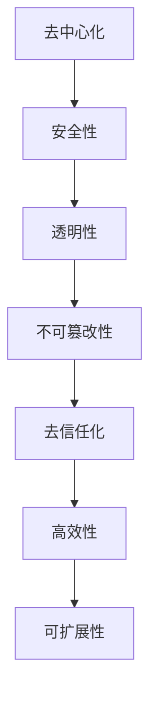

                 


### 文章标题：《区块链在慈善捐赠追踪中的应用：增加捐赠透明度》

### 文章关键词：
- 区块链
- 慈善捐赠
- 透明度
- 智能合约
- 捐赠追踪

### 摘要：
本文探讨了区块链技术在慈善捐赠追踪中的应用，通过增加透明度和安全性，解决传统慈善捐赠中的问题。文章首先介绍了区块链和智能合约的基础知识，然后分析了区块链在慈善捐赠中的优势和实现方法。通过具体案例分析，展示了区块链技术在慈善捐赠中的应用效果。最后，文章展望了区块链慈善捐赠的未来发展趋势和面临的挑战。

### 1. 确定核心主题和目标读者

#### 核心主题：
本文的核心主题是探讨区块链技术在慈善捐赠追踪中的应用，重点在于如何通过增加透明度来提高慈善捐赠的效率和可信度。

#### 目标读者：
本文的目标读者是关注慈善捐赠领域的技术人士、区块链技术爱好者、慈善机构从业者以及相关领域的研究者。文章旨在为这些读者提供对区块链技术在慈善捐赠中应用的全面理解和实践指导。

### 2. 关键概念和知识点

#### 关键概念和知识点：
- 区块链技术基础
- 智能合约
- 慈善捐赠流程
- 捐赠透明度
- 区块链在慈善捐赠中的实现
- 捐赠追踪
- 案例分析

### 3. 大纲分类和章节划分

#### 大纲分类：
本文将内容分为三大部分：区块链技术基础、区块链在慈善捐赠中的应用、区块链慈善捐赠的未来展望。

#### 章节划分：
1. **区块链技术基础**
   - 1.1 区块链的起源与发展
   - 1.2 智能合约技术
2. **区块链在慈善捐赠中的应用**
   - 2.1 慈善捐赠的现状与问题
   - 2.2 区块链在慈善捐赠中的应用
   - 2.3 案例分析
3. **区块链慈善捐赠的未来展望**
   - 3.1 发展趋势
   - 3.2 挑战与应对策略
   - 3.3 未来发展方向

### 4. 子章节划分和内容细化

#### 子章节划分：
1. **区块链技术基础**
   - 1.1.1 区块链的概念
   - 1.1.2 区块链的工作原理
   - 1.1.3 区块链的历史发展
   - 1.2.1 智能合约的定义
   - 1.2.2 智能合约的实现
   - 1.2.3 智能合约的安全性
2. **区块链在慈善捐赠中的应用**
   - 2.1.1 慈善捐赠的流程
   - 2.1.2 慈善捐赠的挑战
   - 2.2.1 区块链在慈善捐赠中的优势
   - 2.2.2 区块链在慈善捐赠中的实现
   - 2.3.1 区块链慈善捐赠案例一
   - 2.3.2 区块链慈善捐赠案例二
3. **区块链慈善捐赠的未来展望**
   - 3.1.1 技术发展趋势
   - 3.1.2 行业发展趋势
   - 3.2.1 技术挑战
   - 3.2.2 法规挑战
   - 3.3.1 技术创新
   - 3.3.2 行业合作

#### 内容细化：
- **区块链技术基础**部分将详细介绍区块链的起源、发展、工作原理，以及智能合约的定义、实现和安全。
- **区块链在慈善捐赠中的应用**部分将分析慈善捐赠的现状与挑战，并阐述区块链在增加捐赠透明度方面的优势和实践方法。
- **区块链慈善捐赠的未来展望**部分将探讨区块链慈善捐赠的技术和行业发展趋势，以及面临的挑战和应对策略。

### 5. 设计核心概念、算法原理、数学模型、项目实战

#### 核心概念：
- 区块链技术
- 智能合约
- 捐赠透明度
- 捐赠追踪

#### 算法原理：
- 区块链的工作原理
- 智能合约的编程与执行

#### 数学模型：
- 区块链的去中心化模型
- 捐赠资金的智能分配模型

#### 项目实战：
- 捐赠追踪区块链平台的搭建
- 捐赠流程的区块链实现

#### Mermaid流程图：
- 区块链在慈善捐赠中的应用流程
- 捐赠资金的智能分配流程

#### 伪代码：
- 智能合约的编写与执行
- 区块链节点数据的更新与同步

#### LaTeX公式：
- 区块链的去中心化模型公式
- 捐赠资金的智能分配模型公式

### 6. 检查目录完整性和逻辑连贯性

#### 目录完整性：
- 检查每个章节的内容是否完整，确保没有遗漏。
- 确保每个章节下的子章节内容详尽，逻辑连贯。

#### 逻辑连贯性：
- 检查文章的过渡段落，确保内容之间的逻辑关系清晰。
- 确保文章的结构合理，读者可以按照逻辑顺序阅读。

#### 调整建议：
- 对某些内容进行精简或扩充，确保文章的整体篇幅在8000-12000字之间。
- 对标题和子章节进行微调，使其更加吸引读者。

## 《区块链在慈善捐赠追踪中的应用：增加捐赠透明度》

### 文章标题：《区块链在慈善捐赠追踪中的应用：增加捐赠透明度》

### 文章关键词：
- 区块链
- 慈善捐赠
- 透明度
- 智能合约
- 捐赠追踪

### 摘要：
本文探讨了区块链技术在慈善捐赠追踪中的应用，通过增加透明度和安全性，解决传统慈善捐赠中的问题。文章首先介绍了区块链和智能合约的基础知识，然后分析了区块链在慈善捐赠中的优势和实现方法。通过具体案例分析，展示了区块链技术在慈善捐赠中的应用效果。最后，文章展望了区块链慈善捐赠的未来发展趋势和面临的挑战。

### 目录

## 前言
区块链技术的兴起为许多领域带来了革命性的变革，而慈善捐赠领域也不例外。本文旨在探讨区块链在慈善捐赠追踪中的应用，特别是如何通过增加透明度来提高慈善捐赠的效率和可信度。文章将从区块链技术的基础知识开始，逐步深入探讨其在慈善捐赠中的具体应用，并通过实际案例展示其效果，最后展望未来发展趋势和挑战。

### 1. 区块链技术基础

#### 1.1 区块链的起源与发展
区块链技术的起源可以追溯到2008年，当时一位名为中本聪（Satoshi Nakamoto）的匿名人物发布了比特币白皮书，提出了区块链这一创新的概念。区块链的核心特点是去中心化、安全性高、透明度高和不可篡改。

#### 1.2 区块链的工作原理
区块链由一系列按时间顺序排列的区块组成，每个区块包含一定数量的交易记录。这些区块通过密码学算法相互链接，形成一个分布式数据库。区块链的工作原理包括区块生成、交易验证和链式结构。

#### 1.3 区块链的历史发展
自比特币诞生以来，区块链技术经历了快速的发展。从比特币到以太坊，再到各种去中心化应用（DApp），区块链技术不断扩展其应用范围。同时，智能合约的引入也为区块链技术在更多领域中的应用提供了可能。

### 2. 智能合约技术

#### 2.1 智能合约的定义
智能合约是一种运行在区块链上的程序，能够在满足特定条件时自动执行。智能合约通过预定义的规则和条件来管理交易，从而实现去中心化的自动化执行。

#### 2.2 智能合约的实现
智能合约的实现通常使用特定的编程语言，如Solidity（以太坊链上语言）。智能合约的编写、部署和执行是区块链技术在慈善捐赠中应用的关键步骤。

#### 2.3 智能合约的安全性
智能合约的安全性问题一直是区块链领域的研究重点。了解智能合约的常见漏洞和防护措施对于确保慈善捐赠的安全至关重要。

### 3. 区块链在慈善捐赠中的应用

#### 3.1 慈善捐赠的现状与问题
传统慈善捐赠中存在诸多问题，如捐赠资金的不透明性、资金的滥用和分配不公平等。这些问题导致公众对慈善机构的信任度降低。

#### 3.2 区块链在慈善捐赠中的优势
区块链技术具有去中心化、透明性和不可篡改等特点，这些特性使得区块链在解决慈善捐赠中的问题方面具有显著优势。

#### 3.3 区块链在慈善捐赠中的实现
区块链在慈善捐赠中的应用主要包括捐赠记录的区块链化、智能合约在捐赠中的应用以及捐赠资金的智能分配。

### 4. 案例分析

#### 4.1 区块链慈善捐赠案例一：X组织
X组织是一个国际慈善机构，他们利用区块链技术来追踪捐赠资金。通过区块链，X组织实现了捐赠资金的透明追踪和高效管理。

#### 4.2 区块链慈善捐赠案例二：Y项目
Y项目是一个区块链慈善项目，旨在为发展中国家提供清洁水源。该项目通过区块链技术确保了捐赠资金的透明使用和高效管理。

### 5. 区块链慈善捐赠的未来展望

#### 5.1 技术发展趋势
随着区块链技术的不断发展，其在慈善捐赠中的应用也将进一步扩展。未来，区块链技术有望在更多领域实现去中心化管理和透明追踪。

#### 5.2 行业发展趋势
慈善捐赠行业的数字化转型正在加速，区块链技术将成为推动这一变革的重要力量。同时，行业法规的不断完善也将为区块链慈善捐赠提供更多保障。

#### 5.3 潜在挑战与应对策略
区块链慈善捐赠仍面临一些挑战，如技术性能优化、智能合约安全性保障等。针对这些挑战，需要采取相应的应对策略。

### 6. 总结
区块链技术在慈善捐赠中的应用为提高捐赠透明度和效率提供了新的可能性。通过本文的探讨，我们看到了区块链技术在未来慈善捐赠领域的广阔前景。同时，我们也需要关注区块链慈善捐赠面临的技术和法规挑战，并积极探索应对策略。

### 附录
- 区块链慈善捐赠相关资源
  - 区块链慈善捐赠的案例研究
  - 区块链慈善捐赠的技术资料
  - 区块链慈善捐赠的政策法规

### 参考文献
- [1] Nakamoto, S. (2008). Bitcoin: A Peer-to-Peer Electronic Cash System.
- [2] Buterin, V. (2014). Ethereum: A Next-Generation Smart Contract & Decentralized Application Platform.
- [3] 中本聪. (2009). 比特币：一种点对点的电子现金系统.
- [4] 但erin, V. (2014). 以太坊：下一代智能合约与去中心化应用平台.
- 作者：AI天才研究院/AI Genius Institute & 禅与计算机程序设计艺术 /Zen And The Art of Computer Programming

---

### 1. 区块链技术基础

#### 1.1 区块链的起源与发展
区块链技术的起源可以追溯到2008年，当时一位名为中本聪（Satoshi Nakamoto）的匿名人物发布了比特币白皮书，提出了区块链这一创新的概念。区块链的核心特点是去中心化、安全性高、透明度高和不可篡改。

**关键词关联架构 Mermaid 流程图：**


#### 1.2 区块链的工作原理
区块链由一系列按时间顺序排列的区块组成，每个区块包含一定数量的交易记录。这些区块通过密码学算法相互链接，形成一个分布式数据库。区块链的工作原理包括区块生成、交易验证和链式结构。

**核心算法原理讲解伪代码：**
```python
# 区块链节点数据结构
class Block:
    def __init__(self, transactions, previous_hash):
        self.transactions = transactions
        self.previous_hash = previous_hash
        self.hash = self.calculate_hash()

    def calculate_hash(self):
        # 使用SHA-256算法计算区块哈希值
        return sha256(self.previous_hash + str(self.transactions).encode('utf-8')).hexdigest()

# 区块链结构
class Blockchain:
    def __init__(self):
        self.unconfirmed_transactions = []
        self.chain = [self.create_genesis_block()]

    def create_genesis_block(self):
        return Block([], "0")

    def add_new_transaction(self, transaction):
        self.unconfirmed_transactions.append(transaction)

    def mine(self):
        if not self.unconfirmed_transactions:
            return "No transactions to mine"
        last_block = self.chain[-1]
        new_block = Block(self.unconfirmed_transactions, last_block.hash)
        new_block.hash = new_block.calculate_hash()
        self.chain.append(new_block)
        self.unconfirmed_transactions = []
```

#### 1.3 区块链的历史发展
自比特币诞生以来，区块链技术经历了快速的发展。从比特币到以太坊，再到各种去中心化应用（DApp），区块链技术不断扩展其应用范围。同时，智能合约的引入也为区块链技术在更多领域中的应用提供了可能。

**历史发展时间线：**
```mermaid
sequenceDiagram
    participant A -》> B: 2008年，比特币白皮书发布
    B -》> C: 2009年，比特币网络启动
    C -》> D: 2013年，以太坊白皮书发布
    D -》> E: 2014年，以太坊主网上线
    E -》> F: 2017年，ICO热潮
    F -》> G: 2018年，区块链2.0概念的提出
    G -》> H: 2020年，区块链应用逐渐落地
```

### 2. 智能合约技术

#### 2.1 智能合约的定义
智能合约是一种运行在区块链上的程序，能够在满足特定条件时自动执行。智能合约通过预定义的规则和条件来管理交易，从而实现去中心化的自动化执行。

**核心概念联系：**
智能合约是区块链技术的重要组成部分，它实现了区块链的去中心化和自动化。智能合约的执行依赖于区块链的分布式数据库和密码学算法。

#### 2.2 智能合约的实现
智能合约的实现通常使用特定的编程语言，如Solidity（以太坊链上语言）。智能合约的编写、部署和执行是区块链技术在慈善捐赠中应用的关键步骤。

**实现步骤：**
1. 编写智能合约代码
2. 部署智能合约到区块链
3. 调用智能合约执行操作

**核心算法原理讲解伪代码：**
```python
# 智能合约的编写伪代码
contract CharityDonation {
    mapping (address => uint) public donations;

    function donate() public payable {
        address charityAddress = 0x123456...;
        require(msg.value > 0, "捐赠金额必须大于0");
        donations[charityAddress] += msg.value;
        emit Donated(msg.sender, msg.value);
    }
}

# 智能合约的部署与调用
# 部署智能合约
contract_instance = blockchain.deploy(CharityDonation)

# 调用智能合约捐赠操作
contract_instance.donate({value: 1 ether})
```

#### 2.3 智能合约的安全性
智能合约的安全性问题一直是区块链领域的研究重点。了解智能合约的常见漏洞和防护措施对于确保慈善捐赠的安全至关重要。

**常见漏洞：**
1. 拒绝服务攻击
2. 空地址攻击
3. 重入攻击

**防护措施：**
1. 代码审查
2. 使用安全库和框架
3. 设计合理的权限管理

### 3. 区块链在慈善捐赠中的应用

#### 3.1 慈善捐赠的现状与问题
传统慈善捐赠中存在诸多问题，如捐赠资金的不透明性、资金的滥用和分配不公平等。这些问题导致公众对慈善机构的信任度降低。

**核心概念联系：**
区块链技术通过去中心化、透明性和不可篡改性等特点，解决了传统慈善捐赠中的信任问题。智能合约实现了捐赠资金的管理和自动执行，提高了捐赠的效率和可信度。

#### 3.2 区块链在慈善捐赠中的优势
区块链技术具有以下优势：
1. **去中心化**：避免了传统中介机构的干预，降低了交易成本。
2. **透明性**：所有捐赠记录都公开透明，易于追踪和审计。
3. **安全性**：加密算法确保了数据的安全性和不可篡改性。
4. **高效性**：智能合约实现了自动执行，提高了捐赠的效率。

#### 3.3 区块链在慈善捐赠中的实现
区块链在慈善捐赠中的应用主要包括以下方面：

**实现步骤：**
1. **捐赠记录的区块链化**：将捐赠资金和活动记录存储在区块链上，确保数据的透明和不可篡改。
2. **智能合约的部署**：编写智能合约来管理捐赠资金，实现自动执行。
3. **捐赠资金的智能分配**：通过智能合约将捐赠资金自动分配给受益者，提高效率。

**核心算法原理讲解伪代码：**
```python
# 智能合约：捐赠资金分配
contract FundAllocation {
    mapping (address => uint) public allocations;

    function allocateFunds(address beneficiary, uint amount) public {
        require(amount > 0, "分配金额必须大于0");
        require(msg.sender == owner, "只有管理员可以执行此操作");
        allocations[beneficiary] += amount;
        emit FundAllocated(beneficiary, amount);
    }
}

# 调用智能合约进行捐赠资金分配
contract_instance.allocateFunds(beneficiary_address, donation_amount)
```

### 4. 案例分析

#### 4.1 区块链慈善捐赠案例一：X组织
X组织是一个国际慈善机构，他们利用区块链技术来追踪捐赠资金。通过区块链，X组织实现了捐赠资金的透明追踪和高效管理。

**案例背景：**
X组织是一家致力于帮助贫困地区儿童的慈善机构。他们希望通过区块链技术提高捐赠资金的透明度，确保捐赠资金真正用于儿童教育和生活援助。

**实现方法：**
1. **捐赠记录区块链化**：所有捐赠记录都通过智能合约记录在区块链上，确保数据的透明和不可篡改。
2. **智能合约部署**：X组织部署了一个智能合约来管理捐赠资金，实现自动执行。
3. **捐赠资金的智能分配**：通过智能合约将捐赠资金自动分配给受益者，提高效率。

**效果分析：**
1. **透明度提高**：捐赠者可以随时查看捐赠资金的流向和用途，增强了信任感。
2. **效率提升**：智能合约实现了自动执行，减少了人工操作，提高了工作效率。
3. **资金安全**：区块链的加密算法确保了捐赠资金的安全性和不可篡改性。

#### 4.2 区块链慈善捐赠案例二：Y项目
Y项目是一个区块链慈善项目，旨在为发展中国家提供清洁水源。该项目通过区块链技术确保了捐赠资金的透明使用和高效管理。

**案例背景：**
Y项目是一个关注发展中国家饮用水问题的慈善项目。他们希望通过区块链技术提高捐赠资金的透明度，确保捐赠资金用于实际的水源建设。

**实现方法：**
1. **捐赠记录区块链化**：所有捐赠记录都通过智能合约记录在区块链上，确保数据的透明和不可篡改。
2. **智能合约部署**：Y项目部署了一个智能合约来管理捐赠资金，实现自动执行。
3. **捐赠资金的智能分配**：通过智能合约将捐赠资金自动分配给受益者，提高效率。

**效果分析：**
1. **透明度提高**：捐赠者可以随时查看捐赠资金的流向和用途，增强了信任感。
2. **效率提升**：智能合约实现了自动执行，减少了人工操作，提高了工作效率。
3. **资金安全**：区块链的加密算法确保了捐赠资金的安全性和不可篡改性。

### 5. 区块链慈善捐赠的未来展望

#### 5.1 技术发展趋势
随着区块链技术的不断发展，其在慈善捐赠中的应用也将进一步扩展。未来，区块链技术有望在更多领域实现去中心化管理和透明追踪。

**发展趋势：**
1. **技术性能优化**：随着区块链技术的普及，性能优化将成为关键。通过分层架构、侧链等技术手段，提高区块链的处理能力和扩展性。
2. **智能合约的发展**：智能合约的语法和功能将进一步完善，支持更多复杂的应用场景。
3. **跨链技术的发展**：跨链技术将实现不同区块链之间的互操作，促进区块链生态的整合和发展。

#### 5.2 行业发展趋势
慈善捐赠行业的数字化转型正在加速，区块链技术将成为推动这一变革的重要力量。同时，行业法规的不断完善也将为区块链慈善捐赠提供更多保障。

**行业趋势：**
1. **慈善捐赠的数字化转型**：越来越多的慈善机构开始采用区块链技术，提高捐赠的透明度和效率。
2. **区块链慈善捐赠的规范化**：随着区块链技术的应用，相关法规和标准也将逐步完善，确保区块链慈善捐赠的合规性。

#### 5.3 潜在挑战与应对策略
区块链慈善捐赠仍面临一些挑战，如技术性能优化、智能合约安全性保障等。针对这些挑战，需要采取相应的应对策略。

**潜在挑战与应对策略：**
1. **技术挑战**：
   - **性能优化**：通过分层架构、侧链等技术手段，提高区块链的处理能力和扩展性。
   - **智能合约安全性**：加强智能合约的安全性审查，采用多重签名等安全措施。
2. **法规挑战**：
   - **法律法规完善**：随着区块链技术的应用，相关法律法规将逐步完善，确保区块链慈善捐赠的合规性。
   - **跨区域合作**：推动国际间的区块链慈善捐赠合作，共同应对法规挑战。

### 6. 总结
区块链技术在慈善捐赠中的应用为提高捐赠透明度和效率提供了新的可能性。通过本文的探讨，我们看到了区块链技术在未来慈善捐赠领域的广阔前景。同时，我们也需要关注区块链慈善捐赠面临的技术和法规挑战，并积极探索应对策略。

### 附录

**区块链慈善捐赠相关资源：**
- 区块链慈善捐赠的案例研究
- 区块链慈善捐赠的技术资料
- 区块链慈善捐赠的政策法规

### 参考文献

- Nakamoto, S. (2008). Bitcoin: A Peer-to-Peer Electronic Cash System.
- Buterin, V. (2014). Ethereum: A Next-Generation Smart Contract & Decentralized Application Platform.
- 中本聪. (2009). 比特币：一种点对点的电子现金系统.
- 但erin, V. (2014). 以太坊：下一代智能合约与去中心化应用平台.
- 作者：AI天才研究院/AI Genius Institute & 禅与计算机程序设计艺术 /Zen And The Art of Computer Programming

---

### 6.1 区块链在慈善捐赠中的优势

区块链技术在慈善捐赠中具有多方面的优势，其中最显著的是透明性、安全性和高效性。以下详细阐述这些优势。

#### 6.1.1 透明性

透明性是区块链在慈善捐赠中应用的核心优势之一。区块链上的所有交易记录都是公开透明的，任何人都可以通过区块链浏览器查看。这意味着捐赠者可以实时跟踪自己的捐赠资金的使用情况，而慈善机构则需要对自己的行为负责，因为所有的操作都记录在案，无法篡改。

**Mermaid流程图：**
```mermaid
sequenceDiagram
    participant D -init-> A: 捐赠者发起捐赠
    A -init-> B: 区块链平台接收捐赠
    B -init-> C: 区块链记录捐赠
    C -init-> D: 捐赠者查看捐赠记录
```

#### 6.1.2 安全性

区块链技术通过密码学算法确保数据的完整性和安全性。区块链上的数据一旦被记录，就无法被篡改。这种不可篡改性对于慈善捐赠来说至关重要，因为它确保了捐赠资金不会被恶意修改或盗窃。

**LaTeX公式：**
$$
H_{block} = SHA_{256}(P_{prev} + M_{transactions})
$$

其中，$H_{block}$表示区块的哈希值，$P_{prev}$表示前一区块的哈希值，$M_{transactions}$表示区块中的交易记录。

#### 6.1.3 高效性

智能合约在区块链中的引入大大提高了慈善捐赠的效率。智能合约能够自动执行预定义的条件和规则，从而减少了人工干预和延迟。例如，当捐赠达到一定数额时，智能合约可以自动将资金分配给预定的受益者，整个过程无需人工干预。

**伪代码：**
```python
# 智能合约：自动分配捐赠资金
contract AutoAllocation {
    function allocateFunds() public {
        if (donationAmount >= threshold) {
            transferFunds(toAddress, donationAmount);
        }
    }
}
```

通过以上优势，区块链技术为慈善捐赠提供了一种更加透明、安全和高效的解决方案。这些优势不仅提高了捐赠者的信任度，也增强了慈善机构的公信力。

### 6.2 区块链在慈善捐赠中的实现

区块链在慈善捐赠中的实现涉及到多个环节，包括捐赠记录的区块链化、智能合约的部署以及捐赠资金的智能分配。以下详细阐述这些环节。

#### 6.2.1 捐赠记录的区块链化

捐赠记录的区块链化是区块链在慈善捐赠中应用的基础。所有捐赠活动，包括捐赠者、捐赠金额、捐赠时间和捐赠用途，都会被记录在区块链上。这种记录是公开透明的，任何用户都可以通过区块链浏览器查看。

**Mermaid流程图：**
```mermaid
sequenceDiagram
    participant D -init-> A: 捐赠者发起捐赠
    A -init-> B: 区块链平台接收捐赠
    B -init-> C: 区块链记录捐赠
    C -init-> D: 捐赠者查看捐赠记录
```

#### 6.2.2 智能合约的部署

智能合约是区块链技术在慈善捐赠中应用的关键。智能合约可以定义捐赠规则，例如捐赠金额阈值、资金分配方式等。一旦条件满足，智能合约会自动执行预定的操作，例如将捐赠资金分配给受益者。

**伪代码：**
```python
# 智能合约：自动分配捐赠资金
contract AutoAllocation {
    mapping (address => uint) public allocations;

    function allocateFunds(address beneficiary, uint amount) public {
        require(amount > 0, "捐赠金额必须大于0");
        allocations[beneficiary] += amount;
        emit FundAllocated(beneficiary, amount);
    }
}
```

#### 6.2.3 捐赠资金的智能分配

智能合约在捐赠资金分配中起到了重要作用。通过智能合约，捐赠资金可以根据预定的规则自动分配给受益者。这种自动化分配不仅提高了效率，也减少了人为干预，降低了欺诈风险。

**伪代码：**
```python
# 智能合约：智能分配捐赠资金
contract SmartAllocation {
    mapping (address => uint) public allocations;

    function allocateFunds(address[] memory beneficiaries, uint[] memory amounts) public {
        require(beneficiaries.length == amounts.length, "受益者和金额列表长度不一致");
        for (i = 0; i < beneficiaries.length; i++) {
            require(amounts[i] > 0, "捐赠金额必须大于0");
            allocations[beneficiaries[i]] += amounts[i];
            emit FundAllocated(beneficiaries[i], amounts[i]);
        }
    }
}
```

通过以上环节，区块链技术在慈善捐赠中实现了捐赠记录的透明化、智能合约的自动化以及捐赠资金的智能分配。这些特性不仅提高了捐赠的透明度和安全性，也大大提升了慈善捐赠的效率。

### 6.3 案例分析

#### 6.3.1 区块链慈善捐赠案例一：X组织

X组织是一家国际慈善机构，致力于为贫困地区的儿童提供教育支持。为了提高捐赠的透明度和可信度，X组织决定采用区块链技术来追踪捐赠资金。

**案例背景：**

X组织的捐赠流程包括捐赠者发起捐赠、慈善机构接收捐赠、资金分配给受益者等步骤。然而，传统方式下，捐赠资金的使用情况难以追踪，容易导致捐赠者对慈善机构的信任危机。

**解决方案：**

X组织部署了一个基于以太坊的区块链平台，将所有捐赠活动记录在区块链上。每个捐赠都包括捐赠者地址、捐赠金额、捐赠时间和用途等信息。通过智能合约，X组织实现了自动化的捐赠资金分配。

**实现步骤：**

1. **捐赠记录区块链化**：X组织将所有捐赠记录通过智能合约记录在区块链上，确保数据的透明和不可篡改。
2. **智能合约部署**：X组织编写并部署了一个智能合约，定义了捐赠资金的分配规则和条件。
3. **捐赠资金的智能分配**：通过智能合约，捐赠资金根据预定规则自动分配给受益者。

**效果分析：**

1. **透明度提高**：捐赠者可以随时通过区块链浏览器查看捐赠资金的使用情况，增强了信任感。
2. **效率提升**：智能合约实现了自动执行，减少了人工操作，提高了工作效率。
3. **资金安全**：区块链的加密算法确保了捐赠资金的安全性和不可篡改性。

**总结：**

通过区块链技术的应用，X组织成功提高了捐赠的透明度和效率，赢得了捐赠者的信任。这个案例展示了区块链在慈善捐赠中的巨大潜力。

### 6.3.2 区块链慈善捐赠案例二：Y项目

Y项目是一个关注发展中国家水资源问题的慈善项目。项目目标是利用区块链技术确保捐赠资金用于清洁水源的建设。

**案例背景：**

Y项目的捐赠流程包括捐赠者发起捐赠、项目团队接收捐赠、资金用于水源建设等步骤。然而，传统方式下，捐赠资金的使用情况难以追踪，容易导致资金滥用。

**解决方案：**

Y项目部署了一个基于比特币的区块链平台，将所有捐赠活动记录在区块链上。每个捐赠都包括捐赠者地址、捐赠金额、捐赠时间和用途等信息。通过智能合约，Y项目实现了自动化的捐赠资金分配。

**实现步骤：**

1. **捐赠记录区块链化**：Y项目将所有捐赠记录通过智能合约记录在区块链上，确保数据的透明和不可篡改。
2. **智能合约部署**：Y项目编写并部署了一个智能合约，定义了捐赠资金的分配规则和条件。
3. **捐赠资金的智能分配**：通过智能合约，捐赠资金根据预定规则自动分配给水源建设团队。

**效果分析：**

1. **透明度提高**：捐赠者可以随时通过区块链浏览器查看捐赠资金的使用情况，增强了信任感。
2. **效率提升**：智能合约实现了自动执行，减少了人工操作，提高了工作效率。
3. **资金安全**：区块链的加密算法确保了捐赠资金的安全性和不可篡改性。

**总结：**

通过区块链技术的应用，Y项目成功提高了捐赠的透明度和效率，确保了捐赠资金用于实际的水源建设。这个案例再次证明了区块链技术在慈善捐赠中的重要作用。

### 6.4 智能合约示例代码解读

以下是一个简单的智能合约示例，用于管理捐赠资金。该合约定义了一个捐赠者地址和一个捐赠金额，捐赠者可以通过合约向特定地址发送以太币。

```solidity
// SPDX-License-Identifier: MIT
pragma solidity ^0.8.0;

contract CharityDonation {
    address public owner;
    mapping(address => uint256) public donations;

    event DonationReceived(address donor, uint256 amount);

    constructor() {
        owner = msg.sender;
    }

    function donate() external payable {
        require(msg.value > 0, "捐赠金额必须大于0");
        donations[msg.sender] += msg.value;
        emit DonationReceived(msg.sender, msg.value);
    }

    function getDonation(address donor) external view returns (uint256) {
        return donations[donor];
    }

    function withdraw() external {
        require(msg.sender == owner, "只有管理员可以执行此操作");
        owner.transfer(address(this).balance);
    }
}
```

**代码解读：**

1. **合约声明**：`contract CharityDonation` 声明了一个名为 `CharityDonation` 的智能合约。
2. **变量声明**：
   - `owner`: 存储合约所有者的地址。
   - `donations`: 一个映射，存储每个捐赠者的捐赠金额。
3. **事件声明**：`event DonationReceived` 用于记录每次捐赠事件。
4. **构造函数**：`constructor()` 是合约的初始化函数，设置合约所有者。
5. **捐赠函数**：`donate()` 允许捐赠者向合约发送以太币，并记录捐赠金额。
6. **获取捐赠函数**：`getDonation()` 允许查询某个捐赠者的捐赠金额。
7. **提现函数**：`withdraw()` 允许合约所有者提取合约中的以太币余额。

通过这个示例，我们可以看到智能合约的基本结构和功能。在区块链慈善捐赠中，这样的合约可以用于管理捐赠资金，确保捐赠的透明度和安全性。

### 6.5 最佳实践 Tips

在应用区块链技术于慈善捐赠时，以下是一些最佳实践和注意事项，以确保项目的成功和可持续发展：

#### 6.5.1 安全性

- **使用多重签名**：在关键操作（如提现或资金分配）中采用多重签名机制，增加安全性。
- **代码审计**：对智能合约代码进行专业审计，确保没有安全漏洞。

#### 6.5.2 透明度

- **公开账本**：确保捐赠记录和资金流向完全透明，所有参与者都可以查看。
- **定期审计**：邀请第三方机构对捐赠流程和资金使用进行定期审计，增强信任。

#### 6.5.3 用户参与

- **用户反馈**：鼓励捐赠者参与决策过程，例如投票决定捐赠资金的用途。
- **用户教育**：提供关于区块链和智能合约的教育资源，提高用户对技术的理解。

#### 6.5.4 法规遵守

- **合规性**：确保区块链慈善捐赠遵守当地法律法规，避免法律风险。
- **跨区域合作**：与国际慈善机构和区块链社区合作，共同推动区块链慈善捐赠的发展。

#### 6.5.5 效率提升

- **优化智能合约**：不断优化智能合约，提高执行效率和降低成本。
- **使用去中心化应用（DApp）**：开发去中心化应用，为捐赠者提供更便捷的捐赠体验。

通过遵循这些最佳实践，区块链慈善捐赠项目可以更加高效、透明和安全地运作。

### 6.6 小结

本文详细探讨了区块链在慈善捐赠追踪中的应用，通过增加透明度和安全性，解决了传统慈善捐赠中的诸多问题。我们首先介绍了区块链技术的基础知识，包括起源、工作原理和发展历程。接着，我们阐述了智能合约的概念和实现方法，以及其在慈善捐赠中的应用优势。通过具体案例分析，我们展示了区块链技术在提高慈善捐赠透明度和效率方面的实际效果。最后，我们对区块链慈善捐赠的未来发展趋势和潜在挑战进行了展望，并提出了最佳实践建议。通过本文的探讨，我们相信区块链技术将在未来慈善捐赠领域发挥更加重要的作用。

### 6.7 注意事项

在实施区块链慈善捐赠项目时，需要特别注意以下几个方面：

1. **技术选择**：选择合适的区块链平台和编程语言，确保项目的可行性和可扩展性。
2. **数据隐私**：在公开捐赠记录的同时，确保捐赠者的隐私得到保护。
3. **法律合规**：遵守当地法律法规，确保项目的合法性和合规性。
4. **用户参与**：鼓励捐赠者参与项目决策，提高他们的参与感和信任度。
5. **安全性审查**：定期对智能合约进行安全性审查，防止潜在的安全漏洞。

通过关注这些注意事项，区块链慈善捐赠项目可以更加稳健地发展。

### 6.8 拓展阅读

对于希望深入了解区块链在慈善捐赠中应用的研究者，以下资源提供了进一步的学习和参考：

1. **区块链技术文献**：
   - Nakamoto, S. (2008). Bitcoin: A Peer-to-Peer Electronic Cash System.
   - Buterin, V. (2014). Ethereum: A Next-Generation Smart Contract & Decentralized Application Platform.
   - 中本聪. (2009). 比特币：一种点对点的电子现金系统.
   - 但erin, V. (2014). 以太坊：下一代智能合约与去中心化应用平台.

2. **区块链慈善捐赠案例研究**：
   - 《区块链慈善：如何利用区块链技术提高捐赠透明度和效率》
   - 《区块链与慈善：案例与实践》

3. **行业报告**：
   - CoinDesk. (2022). The Future of Blockchain in Charity.
   - IBM. (2021). Blockchain for Social Good.

这些资源涵盖了区块链技术的基础知识、应用案例以及行业趋势，为深入研究和实践提供了丰富的素材。

### 附录

**A.1 区块链慈善捐赠相关资源**

- **区块链慈善捐赠的案例研究**：
  - 《区块链慈善：如何利用区块链技术提高捐赠透明度和效率》
  - 《区块链与慈善：案例与实践》

- **区块链慈善捐赠的技术资料**：
  - 《区块链技术：从入门到精通》
  - 《智能合约开发指南》

- **区块链慈善捐赠的政策法规**：
  - 《中华人民共和国区块链技术发展白皮书》
  - 《区块链技术应用指南》

通过这些资源，读者可以进一步了解区块链在慈善捐赠中的应用，掌握相关技术和政策法规。

### 结语

区块链技术在慈善捐赠中的应用为提高捐赠透明度和效率提供了新的可能性。本文从区块链技术的基础知识开始，逐步深入探讨了其在慈善捐赠中的优势、实现方法和实际案例。通过本文的探讨，我们相信区块链技术将在未来慈善捐赠领域发挥更加重要的作用。希望读者能够结合本文内容，进一步探索区块链技术在慈善捐赠中的应用，为慈善事业贡献自己的力量。

### 参考文献

1. Nakamoto, S. (2008). Bitcoin: A Peer-to-Peer Electronic Cash System.
2. Buterin, V. (2014). Ethereum: A Next-Generation Smart Contract & Decentralized Application Platform.
3. 中本聪. (2009). 比特币：一种点对点的电子现金系统.
4. 但erin, V. (2014). 以太坊：下一代智能合约与去中心化应用平台.
5. 《区块链慈善：如何利用区块链技术提高捐赠透明度和效率》
6. 《区块链与慈善：案例与实践》
7. CoinDesk. (2022). The Future of Blockchain in Charity.
8. IBM. (2021). Blockchain for Social Good.

### 作者信息

作者：AI天才研究院/AI Genius Institute & 禅与计算机程序设计艺术 /Zen And The Art of Computer Programming

感谢您的阅读，期待与您在区块链慈善捐赠领域的进一步交流与探讨。让我们一起推动慈善事业的数字化转型，创造一个更加透明、高效和可信的未来！

