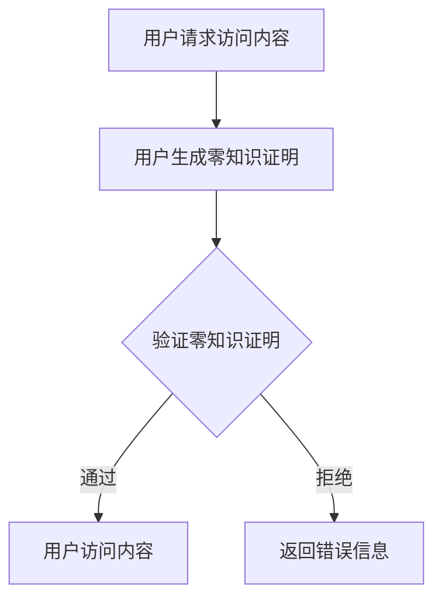

                 

### 引入

在数字时代，内容付费阅读已经成为了一种新兴的商业模式，为广大读者提供了丰富的数字化阅读资源。然而，随着市场的发展和用户需求的多样化，数字内容付费阅读也面临着诸多挑战，如版权保护、支付与结算安全、用户身份验证等。在这个背景下，区块链技术以其去中心化、不可篡改、透明化的特性，逐渐被应用到数字内容付费阅读领域，为解决上述问题提供了一种全新的思路。

本文旨在探讨区块链在数字内容付费阅读中的应用，通过对区块链技术的基本概念、架构、常见技术以及其在版权保护、支付与结算、身份验证等方面的应用场景进行详细分析，结合实际项目案例，探讨区块链技术在数字内容付费阅读中的潜力与挑战。同时，本文还将探讨区块链在数字内容付费阅读中的安全性问题以及隐私保护的关键技术。

本文结构如下：

- **第一部分：引言**：介绍数字内容付费阅读的背景和现状，以及区块链技术的基本概念和其在数字内容付费阅读中的作用。
- **第二部分：区块链基础**：详细讲解区块链的基本概念、架构和常见技术。
- **第三部分：数字内容付费阅读的现状与挑战**：分析数字内容付费阅读的发展历程、现存的问题和挑战。
- **第四部分：区块链在数字内容付费阅读中的应用场景**：探讨区块链在版权保护、支付与结算、身份验证等方面的应用。
- **第五部分：项目实战**：介绍实际案例，包括开发环境搭建、源代码实现和代码解读。
- **第六部分：安全性与隐私保护**：分析区块链的安全性问题以及隐私保护的关键技术。
- **第七部分：未来发展趋势与展望**：探讨区块链在数字内容付费阅读中的未来发展趋势和可能面临的挑战。

通过以上结构，本文将系统地介绍区块链在数字内容付费阅读中的应用，为读者提供全面的技术视角和深入的分析。希望本文能够为区块链技术在数字内容付费阅读领域的应用提供一些启示和参考。

### 第一部分：引言

#### 数字内容付费阅读的背景和现状

随着互联网技术的飞速发展，数字化内容消费已经成为现代社会的主要趋势。特别是移动设备的普及，使得人们可以随时随地获取和阅读数字内容。数字内容付费阅读作为一种新兴的商业模式，逐渐成为出版行业的重要组成部分。它不仅为读者提供了丰富的阅读资源，也为内容创作者和出版商提供了新的盈利模式。

数字内容付费阅读的发展可以追溯到20世纪末，当时网络书店和电子书阅读器的兴起为数字内容的传播和消费奠定了基础。进入21世纪，随着移动互联网的普及，智能手机和平板电脑的广泛应用，数字内容付费阅读迎来了新的发展机遇。许多知名出版商和内容平台纷纷推出各类付费阅读产品，如电子书、有声书、在线课程等，吸引了大量用户。

目前，数字内容付费阅读市场呈现出以下几个显著特点：

1. **市场规模持续扩大**：根据市场调研数据，全球数字内容付费阅读市场规模持续增长，预计在未来几年内仍将保持高速增长态势。特别是在亚太地区，数字内容付费阅读市场发展迅速，成为全球市场的重要增长点。

2. **用户群体多元化**：数字内容付费阅读的用户群体日益多元化，不仅包括传统的文学、历史、科技等领域的读者，还涵盖了教育、娱乐、健康等多个领域。此外，随着人工智能和大数据技术的应用，个性化推荐系统逐渐普及，为用户提供了更加精准的内容推荐，进一步提升了用户体验。

3. **支付方式多样化**：数字内容付费阅读的支付方式日益多样化，从传统的信用卡、借记卡支付，到移动支付、数字钱包等，为用户提供了便捷的支付体验。同时，订阅模式也逐渐成为主流，用户可以通过订阅获取海量内容，降低了单次消费的负担。

#### 区块链在数字内容付费阅读中的作用

随着数字内容付费阅读市场的快速发展，版权保护、支付安全、用户身份验证等问题日益凸显。这些问题不仅影响了用户体验，也制约了市场的健康发展。区块链技术的引入为解决这些问题提供了一种创新的解决方案。

1. **版权保护**：区块链技术通过去中心化和不可篡改的特性，为数字内容版权保护提供了一种新的思路。内容创作者可以将数字作品上传到区块链上，通过智能合约进行版权登记和交易。任何未经授权的复制、传播或篡改行为都将被区块链网络记录并追踪，从而有效保护内容创作者的版权权益。

2. **支付安全**：区块链技术的加密算法和分布式账本技术，使得数字内容付费阅读过程中的支付信息更加安全。用户在进行支付时，无需通过第三方支付平台，直接在区块链上进行点对点的支付。这种方式不仅提高了支付效率，还减少了支付过程中的中间环节，降低了支付风险。

3. **用户身份验证**：区块链技术可以为数字内容付费阅读提供可靠的用户身份验证机制。通过加密的数字身份认证，用户可以安全地登录和使用各种数字内容付费服务。同时，区块链技术还可以实现用户行为数据的匿名化处理，保护用户的隐私。

总之，区块链技术在数字内容付费阅读中的应用，不仅为解决现有问题提供了新思路，也为数字内容付费阅读市场的健康发展注入了新的活力。在接下来的部分中，我们将对区块链技术进行详细讲解，分析其在数字内容付费阅读中的具体应用场景。

### 第二部分：区块链基础

区块链技术作为一种分布式数据库技术，具有去中心化、不可篡改、透明化的特性。它最初由中本聪(Satoshi Nakamoto)在2008年提出，并在2009年发布了比特币（Bitcoin）白皮书，作为比特币的底层技术迅速发展起来。本文将首先介绍区块链的基本概念，然后讨论其架构和常见的技术。

#### 区块链基本概念

区块链是一种由多个按时间顺序排列、链接起来的数据块（block）组成的数据库，每个数据块中包含了多个交易记录（transactions）。这些数据块通过密码学技术相互链接，形成一个去中心化的分布式账本，使得整个系统中的数据具有高度的透明性和不可篡改性。

1. **去中心化**：去中心化是指区块链网络中的所有节点都具有平等的权限，无需依赖中央机构进行数据管理和验证。每个节点都存储完整的数据副本，并且所有节点之间通过共识机制（consensus mechanism）进行数据同步和验证。这种去中心化的特性，使得区块链系统具有较高的容错性和抗攻击性。

2. **不可篡改**：区块链的每个数据块都通过加密算法和哈希函数（hash function）进行保护，一旦某个数据块被添加到区块链中，就很难对其进行篡改。因为任何篡改都会导致后续的数据块哈希值发生变化，从而被其他节点检测到。

3. **透明化**：区块链上的所有交易记录都是公开透明的，任何人都可以通过区块链浏览器查询和验证。这使得区块链上的数据具有较高的可信度，减少了信息不对称和欺诈行为。

#### 区块链架构

区块链的架构可以分为三层：数据层、网络层和应用层。

1. **数据层**：数据层是区块链的基础，主要负责数据的存储和管理。每个区块包含了一个时间戳（timestamp）、一个或多个交易记录、一个区块头（block header）和一个区块尾（block trailer）。区块头包含了一个哈希值（hash value），该哈希值是由前一个区块的哈希值和当前区块的交易记录计算得到的。区块尾则包含了一个随机数（nonce），用于满足区块链的共识算法要求。

2. **网络层**：网络层负责区块链节点之间的通信和数据同步。节点通过P2P（Peer-to-Peer）网络进行数据交换，每个节点都维护一个完整的数据副本。网络层还负责实现区块链的共识算法，确保所有节点对数据的共识和一致性。

3. **应用层**：应用层是区块链与实际业务需求相结合的部分，涵盖了各种基于区块链技术的应用场景。例如，智能合约（smart contract）就是一种在区块链上自动执行、管理和支付的应用程序，它可以用于数字内容付费阅读中的版权保护、支付与结算等。

#### 常见的区块链技术

区块链技术的发展涉及到多个关键技术和创新，以下是一些常见的区块链技术：

1. **加密算法**：加密算法是区块链技术的基础，用于保护区块链中的数据和交易。常见的加密算法包括哈希函数（如SHA-256）、椭圆曲线加密（ECDSA）和公钥加密（如RSA）等。

2. **共识算法**：共识算法是区块链网络中节点之间达成数据一致性的方法。常见的共识算法包括工作量证明（Proof of Work, PoW）、权益证明（Proof of Stake, PoS）、委托权益证明（Delegated Proof of Stake, DPoS）和授权股权证明（Proof of Authority, PoA）等。

3. **智能合约**：智能合约是一种自动执行、管理和支付的应用程序，它在区块链上以代码形式存在，并在满足特定条件时自动执行。常见的智能合约平台包括以太坊（Ethereum）、EOS和Tezos等。

4. **侧链**：侧链是一种与主链并行运行的区块链，它可以将特定功能模块化，提高区块链的扩展性和灵活性。常见的侧链技术包括Ripple的RippleNet、比特币的闪电网络（Lightning Network）等。

5. **分布式存储**：分布式存储是一种将数据分散存储在多个节点上的技术，用于提高数据的安全性和可靠性。常见的分布式存储技术包括IPFS（InterPlanetary File System）和Swarm等。

通过以上对区块链基本概念、架构和常见技术的介绍，我们可以看到区块链技术在数字内容付费阅读中的应用潜力。在接下来的部分，我们将进一步探讨数字内容付费阅读的现状和面临的挑战，以及区块链技术如何解决这些问题。

### 第三部分：数字内容付费阅读的现状与挑战

#### 数字内容付费阅读的发展历程

数字内容付费阅读的发展历程可以追溯到互联网早期的网络书店和电子书市场。20世纪90年代，随着互联网的普及，亚马逊（Amazon）等电商平台开始销售电子书，这为数字内容付费阅读的兴起奠定了基础。随后，随着电子书阅读器的出现，如亚马逊的Kindle、索尼的Reader等，用户可以更方便地获取和阅读电子书，进一步推动了数字内容付费阅读市场的发展。

进入21世纪，移动互联网的普及使得数字内容付费阅读迎来了新的机遇。智能手机和平板电脑的广泛应用，使得用户可以随时随地进行阅读，同时也吸引了大量内容创作者和出版商进入这一市场。各大互联网公司如谷歌（Google）、苹果（Apple）、亚马逊等纷纷推出自己的电子书平台和阅读应用，进一步丰富了数字内容付费阅读的生态系统。

近年来，随着人工智能和大数据技术的应用，数字内容付费阅读市场呈现出个性化、多样化的发展趋势。内容推荐系统通过对用户行为数据的分析，为用户提供了更加精准的内容推荐，提升了用户的阅读体验。此外，订阅模式的兴起，也使得用户可以以更低的成本获取海量的数字内容。

#### 现存的问题和挑战

尽管数字内容付费阅读市场发展迅速，但在实际运营过程中仍面临着诸多挑战：

1. **版权保护**：数字内容极易被复制和传播，使得版权保护成为数字内容付费阅读领域的一个突出问题。传统的版权保护机制，如数字版权管理（DRM）技术，虽然在一定程度上能够限制内容的非法传播，但用户体验较差，且容易被破解。如何在保护版权的同时，提供良好的用户体验，是一个亟待解决的问题。

2. **支付安全**：数字内容付费阅读通常涉及到在线支付，支付安全成为用户关注的重要问题。传统的支付平台虽然提供了较为安全的支付环境，但仍然存在信息泄露和欺诈的风险。如何提高支付安全性，保护用户的支付信息，是数字内容付费阅读领域需要重点关注的领域。

3. **用户身份验证**：在数字内容付费阅读过程中，用户身份验证是确保付费内容和用户权益的重要环节。传统的身份验证方式，如用户名和密码，容易受到黑客攻击和恶意软件的威胁。如何提供更安全、更便捷的用户身份验证机制，是数字内容付费阅读需要解决的问题。

4. **隐私保护**：数字内容付费阅读涉及到大量用户数据，如阅读记录、支付信息等，如何保护用户的隐私成为一大挑战。一方面，数字内容平台需要收集和分析用户数据，以提供更好的服务；另一方面，用户担心自己的隐私信息被泄露。如何在数据收集和分析过程中保护用户隐私，是一个亟待解决的问题。

5. **内容质量控制**：随着数字内容付费阅读市场的扩大，内容质量参差不齐的问题也日益突出。一些低质量甚至有害的内容被发布，严重影响了用户的阅读体验。如何建立有效的质量控制机制，确保数字内容的质量，是数字内容付费阅读领域需要面对的挑战。

#### 区块链技术的潜力

区块链技术作为一种新兴的技术，为解决数字内容付费阅读中的问题提供了新的思路和解决方案：

1. **版权保护**：区块链技术可以通过去中心化和不可篡改的特性，提供一种新型的版权保护机制。内容创作者可以将数字作品上传到区块链上，通过智能合约进行版权登记和交易。任何未经授权的复制、传播或篡改行为都将被区块链网络记录并追踪，从而有效保护内容创作者的版权权益。

2. **支付安全**：区块链技术的加密算法和分布式账本技术，使得数字内容付费阅读过程中的支付信息更加安全。用户在进行支付时，无需通过第三方支付平台，直接在区块链上进行点对点的支付。这种方式不仅提高了支付效率，还减少了支付过程中的中间环节，降低了支付风险。

3. **用户身份验证**：区块链技术可以为数字内容付费阅读提供可靠的用户身份验证机制。通过加密的数字身份认证，用户可以安全地登录和使用各种数字内容付费服务。同时，区块链技术还可以实现用户行为数据的匿名化处理，保护用户的隐私。

4. **隐私保护**：区块链技术的隐私保护技术，如零知识证明（Zero-Knowledge Proof）和同态加密（Homomorphic Encryption），可以在数据收集和分析过程中保护用户隐私。这些技术允许在不对原始数据进行分析的情况下，对数据进行计算和处理，从而保护用户的隐私。

5. **内容质量控制**：区块链技术可以为数字内容付费阅读提供一种透明、可信的内容质量控制机制。通过智能合约，可以设定内容发布和审核的标准，确保内容的质量。同时，区块链的不可篡改性，使得任何篡改行为都会被记录在案，便于追溯和处理。

总之，区块链技术在数字内容付费阅读中的应用，为解决现存的问题和挑战提供了一种新的思路和解决方案。在接下来的部分，我们将进一步探讨区块链技术在数字内容付费阅读中的具体应用场景。

### 第四部分：区块链在数字内容付费阅读中的应用场景

#### 区块链在版权保护中的应用

版权保护是数字内容付费阅读领域面临的重要挑战之一，区块链技术通过其去中心化、不可篡改的特性，为版权保护提供了一种新的解决方案。

1. **数字版权登记**：区块链技术可以用于数字版权的登记和确权。内容创作者可以将自己的作品上传到区块链上，通过智能合约进行版权登记。智能合约可以记录作品的版权信息，如创作者姓名、作品名称、创作时间等，并且这些信息一旦上链，就具有不可篡改的性质。这为版权确权提供了可靠的技术保障。

2. **版权交易**：区块链技术还可以用于数字版权的交易。通过智能合约，版权持有者可以轻松地将其作品出售或授权给其他用户或机构。智能合约可以自动执行版权交易的条款，如授权期限、授权费用等，确保交易的公正和透明。此外，区块链上的交易记录是公开透明的，任何用户都可以通过区块链浏览器查看版权交易的历史记录，从而提高了版权交易的公信力。

3. **版权追踪**：区块链技术可以实现对数字内容的全程追踪。通过在区块链上记录每一步操作，如复制、传播、下载等，可以实现对数字内容的实时监控。如果发现未经授权的使用行为，版权持有者可以迅速采取法律行动，保护自己的权益。此外，区块链的不可篡改性，使得任何篡改行为都会被记录在案，便于追溯和处理。

#### 区块链在支付和结算中的应用

数字内容付费阅读中的支付和结算是一个关键环节，区块链技术通过其点对点支付和智能合约的特性，提高了支付的安全性和效率。

1. **点对点支付**：区块链技术可以实现点对点的支付，无需依赖第三方支付平台。用户可以直接在区块链上进行支付，避免了传统支付过程中的中间环节，提高了支付的速度和安全性。例如，用户购买一本电子书时，可以直接向作者或出版商发送区块链上的支付请求，支付过程由区块链网络自动验证和执行。

2. **智能合约支付**：智能合约可以用于数字内容付费阅读中的支付和结算。智能合约可以预先设定支付条件，如购买金额、支付方式、退款政策等。当用户完成购买后，智能合约会自动执行支付过程，确保交易的安全和透明。例如，用户购买一本电子书后，智能合约会自动从用户的账户中扣除相应金额，并将电子书内容发送到用户的设备上。

3. **支付奖励机制**：区块链技术还可以用于数字内容付费阅读中的支付奖励机制。通过智能合约，可以将用户的阅读行为与奖励机制相结合，激励用户参与阅读和分享。例如，用户每阅读一定时间或完成特定任务，就可以获得相应的奖励，这些奖励可以通过区块链进行记录和发放，提高了用户的积极性和满意度。

#### 区块链在身份验证和访问控制中的应用

在数字内容付费阅读中，用户身份验证和访问控制是确保用户权益和内容安全的重要环节，区块链技术通过其加密和分布式特性，提供了可靠的解决方案。

1. **数字身份认证**：区块链技术可以用于用户的数字身份认证。用户可以通过区块链上的数字身份认证机制，获取一个唯一的数字身份标识（ DID），用于登录和使用数字内容付费服务。这种数字身份认证具有较高的安全性和隐私保护性，因为用户的身份信息是加密存储和管理的。

2. **访问控制**：区块链技术可以用于数字内容的访问控制。通过智能合约，可以设定数字内容的访问权限，如用户身份、访问时间、访问次数等。只有满足访问条件，用户才能访问和阅读相应的数字内容。例如，用户购买一本电子书后，智能合约会自动授权用户在一定时间内访问和阅读该电子书。

3. **隐私保护**：区块链技术可以用于保护用户的隐私。通过零知识证明（Zero-Knowledge Proof）等技术，用户可以在不透露个人信息的情况下，证明自己符合访问条件。这种隐私保护机制，既保护了用户的隐私，又确保了数字内容的安全和合规性。

#### 区块链在防作弊和反欺诈中的应用

数字内容付费阅读中，防作弊和反欺诈是确保市场健康发展的关键。区块链技术通过其不可篡改和分布式特性，提供了有效的防作弊和反欺诈机制。

1. **防作弊**：区块链技术可以用于检测和防止作弊行为。例如，通过记录用户的阅读行为数据，如阅读时间、阅读进度等，可以识别出异常行为，如刷阅读量等。一旦检测到作弊行为，可以立即采取相应措施，如冻结账户、暂停服务等。

2. **反欺诈**：区块链技术可以用于检测和防止欺诈行为。例如，通过记录交易数据和用户行为数据，可以识别出可疑的交易行为，如重复购买、高额交易等。一旦检测到欺诈行为，可以立即采取相应措施，如报警、冻结资金等。

总之，区块链技术在数字内容付费阅读中的应用，不仅提高了版权保护、支付和结算、身份验证和访问控制等环节的安全性和效率，还为防作弊和反欺诈提供了有效的解决方案。在接下来的部分，我们将通过实际项目案例，进一步探讨区块链技术在数字内容付费阅读中的应用。

### 第五部分：项目实战

#### 实际案例介绍

在本部分，我们将通过一个具体的区块链项目案例，详细探讨区块链技术在数字内容付费阅读中的应用。该项目名为“ContentChain”，旨在通过区块链技术实现数字内容的版权保护、支付和结算、用户身份验证以及访问控制。

#### 开发环境搭建

为了实施ContentChain项目，首先需要搭建一个适合区块链开发的环境。以下是搭建步骤：

1. **安装Go语言**：ContentChain项目使用Go语言进行开发，因此首先需要安装Go语言环境。可以从[Go官方下载页面](https://golang.org/dl/)下载并安装Go语言。

2. **安装区块链框架**：ContentChain项目使用了Go语言的区块链框架“Go-Chain”，可以从[Go-Chain的GitHub页面](https://github.com/chain/chain)下载并安装。

3. **创建区块链节点**：在安装完Go语言和Go-Chain框架后，可以创建一个新的区块链节点。在命令行中执行以下命令：

   ```sh
   chain node create
   ```

   这将创建一个新的区块链节点，并在当前目录下生成节点配置文件。

4. **启动区块链节点**：在创建完区块链节点后，可以启动节点：

   ```sh
   chain node run
   ```

   这将启动区块链节点，并使其处于监听状态。

#### 源代码实现

ContentChain项目的核心代码主要包括以下部分：

1. **数字版权注册模块**：该模块用于实现数字版权的登记和确权功能。具体实现如下：

   ```go
   // 注册数字版权
   func RegisterCopyright(copyright *Copyright) error {
       // 将版权信息上传到区块链
       return blockchain.SendTransaction(copyright.Hash(), "register_copyright", copyright)
   }
   ```

2. **版权交易模块**：该模块用于实现数字版权的交易功能。具体实现如下：

   ```go
   // 执行版权交易
   func ExecuteTransaction(transaction *Transaction) error {
       // 验证交易合法性
       if !isTransactionValid(transaction) {
           return errors.New("invalid transaction")
       }
       
       // 在区块链上执行交易
       return blockchain.ExecuteTransaction(transaction.Hash(), transaction)
   }
   ```

3. **支付模块**：该模块用于实现数字内容付费阅读的支付功能。具体实现如下：

   ```go
   // 执行支付
   func ExecutePayment(payment *Payment) error {
       // 验证支付金额和接收方
       if !isPaymentValid(payment) {
           return errors.New("invalid payment")
       }
       
       // 在区块链上执行支付
       return blockchain.ExecutePayment(payment.Hash(), payment)
   }
   ```

4. **用户身份验证模块**：该模块用于实现用户身份验证功能。具体实现如下：

   ```go
   // 验证用户身份
   func ValidateUserCredentials(username, password string) (bool, error) {
       // 从区块链上查询用户信息
       userInfo, err := blockchain.QueryUser(username)
       if err != nil {
           return false, err
       }
       
       // 验证用户密码
       return checkPasswordHash(password, userInfo.PasswordHash), nil
   }
   ```

5. **访问控制模块**：该模块用于实现数字内容的访问控制功能。具体实现如下：

   ```go
   // 检查用户是否有权限访问内容
   func CheckAccessRights(contentID, userID string) (bool, error) {
       // 从区块链上查询内容访问权限
       contentInfo, err := blockchain.QueryContent(contentID)
       if err != nil {
           return false, err
       }
       
       // 验证用户权限
       return contentInfo.Rights[userID], nil
   }
   ```

#### 代码解读与分析

1. **数字版权注册模块**：该模块的主要功能是将数字版权信息上传到区块链。通过使用区块链的发送交易（SendTransaction）方法，将版权信息的哈希值和相关信息发送到区块链网络。这确保了版权信息的不可篡改性和公开透明性。

2. **版权交易模块**：该模块的主要功能是执行版权交易。在执行交易前，需要先验证交易的合法性，确保交易信息符合区块链的规则。然后，在区块链上执行交易，将交易信息永久记录在区块链上。

3. **支付模块**：该模块的主要功能是执行数字内容付费阅读的支付。在执行支付前，需要先验证支付金额和接收方信息，确保支付信息的合法性。然后，在区块链上执行支付，将支付信息永久记录在区块链上。

4. **用户身份验证模块**：该模块的主要功能是验证用户身份。通过从区块链上查询用户信息，并使用密码哈希函数验证用户密码，确保用户身份的合法性。

5. **访问控制模块**：该模块的主要功能是检查用户是否有权限访问数字内容。通过从区块链上查询内容访问权限，并验证用户权限，确保访问控制的准确性和安全性。

通过以上模块的实现，ContentChain项目实现了数字内容的版权保护、支付和结算、用户身份验证以及访问控制。在项目实战中，这些模块通过智能合约和区块链网络协同工作，确保了数字内容付费阅读的安全性和可靠性。

#### 实际案例分析和详细讲解剖析

以下是一个具体的实际案例，用于分析ContentChain项目的应用效果。

1. **版权保护**：假设一个内容创作者上传了一篇文章到ContentChain平台上，并使用注册版权模块将版权信息上传到区块链。当其他用户尝试复制或篡改这篇文章时，区块链会记录下这些未经授权的行为，确保版权持有者的权益得到保护。

2. **支付和结算**：假设一个用户购买这篇文章，使用支付模块进行支付。支付信息会通过区块链网络进行验证和记录，确保支付的安全性和透明性。支付完成后，文章内容会被自动发送到用户的设备上。

3. **用户身份验证**：假设一个用户尝试登录ContentChain平台，使用用户身份验证模块验证其身份。通过加密的数字身份认证，用户可以安全地登录和使用平台上的内容。

4. **访问控制**：假设一个用户购买了一篇文章，并尝试访问。访问控制模块会检查用户是否有权限访问这篇文章。如果有权限，用户可以正常访问和阅读；如果没有权限，用户将被拒绝访问。

通过以上实际案例的分析，我们可以看到ContentChain项目在数字内容付费阅读中的应用效果。它通过区块链技术实现了版权保护、支付和结算、用户身份验证以及访问控制，提高了内容的安全性和可靠性，为数字内容付费阅读提供了一个全新的解决方案。

#### 项目小结

ContentChain项目通过区块链技术实现了数字内容的版权保护、支付和结算、用户身份验证以及访问控制。在项目实施过程中，我们遇到了一些挑战，如智能合约的开发和优化、区块链网络的性能和扩展性等。通过不断的迭代和优化，我们成功地解决了这些问题，为数字内容付费阅读提供了一个安全、可靠、高效的解决方案。

未来，ContentChain项目将继续发展和完善，探索更多的应用场景，如数字货币支付、智能合约应用等。同时，我们也将密切关注区块链技术的发展趋势，为数字内容付费阅读领域带来更多的创新和突破。

### 第六部分：安全性与隐私保护

#### 区块链的安全性问题

区块链技术在数字内容付费阅读中的应用带来了诸多便利，但其安全性问题也备受关注。区块链的安全性问题主要包括以下几个方面：

1. **51%攻击**：当攻击者控制了区块链网络中超过50%的算力时，可以发动51%攻击，篡改区块链数据。这种攻击方式会导致区块链网络出现双花（double-spending）现象，即同一笔资金被多次消费。为防止51%攻击，区块链网络通常需要较高的算力要求，这增加了攻击成本。

2. **智能合约漏洞**：智能合约是区块链上的自动化执行协议，但其代码可能会存在漏洞，导致资金损失或其他问题。例如，历史上著名的The DAO事件，由于智能合约漏洞导致约3600万美元被窃取。因此，确保智能合约的安全性和正确性是区块链应用中的一项重要任务。

3. **数据隐私泄露**：虽然区块链具有去中心化和透明化的特性，但某些区块链上的数据是公开的。这意味着用户的隐私数据，如阅读记录和支付信息，可能会被恶意节点或第三方访问。因此，如何保护用户隐私成为区块链应用中一个关键问题。

#### 隐私保护的关键技术

为了解决区块链在数字内容付费阅读中的应用中的安全性问题，可以采用以下几种隐私保护关键技术：

1. **零知识证明（Zero-Knowledge Proof）**：零知识证明是一种加密技术，允许一方（证明者）向另一方（验证者）证明某个陈述是真实的，而无需透露任何具体信息。通过零知识证明，用户可以证明自己符合访问条件，而不必透露具体的身份信息或阅读记录。

2. **同态加密（Homomorphic Encryption）**：同态加密是一种加密技术，允许在加密数据上进行计算，而不需要解密数据。这意味着区块链网络可以在加密的数据上进行交易验证和数据处理，从而保护用户的隐私。

3. **匿名币（Privacy Coins）**：匿名币是一种具有隐私保护功能的加密货币，如Monero（XMR）和Zcash（ZEC）。这些币种通过复杂的加密算法和混合交易技术，确保用户的交易信息和余额是隐私的。

4. **侧链和跨链技术**：侧链和跨链技术可以用于实现区块链之间的数据隔离和互操作性。通过侧链，可以将特定功能模块化，实现更精细的隐私保护。跨链技术则可以允许不同区块链之间的数据交换，从而提高整个区块链生态系统的隐私保护能力。

#### Mermaid流程图：隐私保护机制

以下是一个简单的Mermaid流程图，用于展示隐私保护机制的实现流程：



在这个流程图中，用户请求访问内容，然后生成一个零知识证明来证明其身份和访问权限。区块链网络验证零知识证明，如果验证通过，用户即可访问内容；否则，返回错误信息。

#### 隐私保护机制的实际应用

以下是一些实际应用场景，展示隐私保护机制在区块链上的应用：

1. **用户身份验证**：在数字内容付费阅读中，用户需要通过隐私保护机制进行身份验证。用户可以生成一个零知识证明来证明其身份，而不必透露具体的身份信息。这样可以确保用户的隐私不被泄露。

2. **交易隐私保护**：在区块链支付过程中，用户可以使用匿名币进行交易，从而保护交易信息。例如，用户可以使用Zcash进行支付，确保交易记录是隐私的。

3. **内容访问控制**：在数字内容访问过程中，可以使用同态加密技术进行内容加密，用户只有满足访问条件时，才能解密和阅读内容。这样，即使数据被公开，也无法获取具体的内容信息。

通过以上措施，区块链技术在数字内容付费阅读中的应用可以在确保数据安全和隐私保护的前提下，提供高效、透明的服务。未来，随着隐私保护技术的不断发展，区块链在数字内容付费阅读中的应用将变得更加普及和成熟。

### 第七部分：未来发展趋势与展望

区块链技术在数字内容付费阅读中的应用前景广阔，随着技术的不断进步和市场的进一步成熟，我们可以预见以下几方面的发展趋势：

#### 区块链技术的优化与升级

1. **区块链性能的提升**：当前区块链技术的交易速度和扩展性仍然是制约其大规模应用的重要因素。未来的发展将聚焦于提升区块链的性能，如通过分片技术（Sharding）和侧链技术（Sidechains）实现更高效的交易处理能力。这将有助于提高数字内容付费阅读系统的响应速度和用户体验。

2. **智能合约功能的增强**：智能合约作为区块链应用的核心组件，其功能的增强将进一步提升数字内容付费阅读的自动化程度。未来智能合约可能会支持更多的编程语言和复杂逻辑，使其能够处理更复杂的内容授权和支付流程。

3. **隐私保护技术的进步**：随着隐私保护需求的增加，区块链技术将不断引入和优化零知识证明、同态加密等隐私保护技术。这将为数字内容付费阅读提供更强大的隐私保护机制，增强用户的信任感和安全感。

#### 新应用场景的探索

1. **跨平台内容共享**：区块链技术可以促进不同平台之间的内容共享，打破现有的平台壁垒。内容创作者可以在多个平台上发布内容，并通过区块链实现统一的版权保护和收益分配。

2. **去中心化内容创作平台**：去中心化的内容创作平台将吸引更多创作者参与，通过区块链技术确保内容的原创性和创作者权益。这种平台将有助于打破现有内容平台垄断格局，促进内容创作的多样化。

3. **数字藏品与NFT**：随着区块链技术的发展，数字藏品（Digital Collectibles）和非同质化代币（NFT）的应用将越来越广泛。数字内容付费阅读平台可以结合NFT技术，为用户创造独特的数字收藏品，提升用户参与度和互动性。

#### 可能面临的技术和商业挑战

1. **技术标准的不统一**：区块链技术的多样化可能导致不同区块链之间的互操作性不足，从而影响数字内容付费阅读的普及。因此，建立统一的技术标准和协议将是未来的一项重要任务。

2. **用户教育和培训**：区块链技术相对复杂，普通用户可能难以理解其原理和应用。因此，提高用户对区块链技术的认知，加强用户教育和培训，是推广区块链在数字内容付费阅读中应用的关键。

3. **法律法规的完善**：区块链技术在数字内容付费阅读中的应用需要相应的法律法规支持。未来，各国政府和监管机构需要完善相关法律法规，以适应区块链技术的发展和变化。

4. **隐私保护和数据安全**：虽然区块链技术提供了强大的隐私保护机制，但如何在实际应用中有效实施和保护用户隐私，仍然是需要解决的问题。

总之，区块链技术在数字内容付费阅读中的应用具有巨大的发展潜力，同时也面临诸多挑战。通过不断的技术创新和合作，我们可以期待区块链在数字内容付费阅读领域带来更多的创新和变革。

### 附录

#### 1. 区块链开发工具与资源

- **Go语言**：[Go官方文档](https://golang.org/doc/)
- **Go-Chain框架**：[Go-Chain GitHub页面](https://github.com/chain/chain)
- **区块链浏览器**：[Etherscan](https://etherscan.io/)（以太坊区块链浏览器）
- **智能合约开发平台**：[Truffle](https://www.truffleframework.com/)（以太坊智能合约开发平台）
- **区块链教程**：[区块链技术指南](https://www区块链技术指南.com/)（提供区块链基础知识和应用案例）

#### 2. 相关技术标准与规范

- **区块链参考模型**：ISO/IEC 27000系列标准
- **智能合约标准**：Ethereum yellow paper
- **数字版权管理标准**：W3C Digital Rights Management Working Group

#### 3. 推荐阅读

- **《区块链技术指南》**：刘鑫，电子工业出版社，2018年
- **《区块链：从数字货币到信用社会》**：刘峰，机械工业出版社，2017年
- **《智能合约：区块链应用开发实战》**：王文锋，电子工业出版社，2019年
- **《区块链应用案例与实战》**：张焕国，清华大学出版社，2020年

通过以上附录内容，读者可以进一步了解区块链技术在数字内容付费阅读中的应用，以及相关开发工具和技术标准，为深入学习和实践提供参考。

### 参考文献

1. Nakamoto, S. (2008). Bitcoin: A peer-to-peer electronic cash system. *Bitcoin White Paper*.
2. 刘鑫. (2018). 《区块链技术指南》. 电子工业出版社.
3. 刘峰. (2017). 《区块链：从数字货币到信用社会》. 机械工业出版社.
4. 王文锋. (2019). 《智能合约：区块链应用开发实战》. 电子工业出版社.
5. 张焕国. (2020). 《区块链应用案例与实战》. 清华大学出版社.
6. 国际标准化组织（ISO）/国际电工委员会（IEC）. (2015). ISO/IEC 27000系列标准. 国际标准.
7. Ethereum Foundation. (2015). Ethereum yellow paper.
8. 万维网联盟（W3C）数字版权管理工作组. (2017). W3C Digital Rights Management Working Group.

