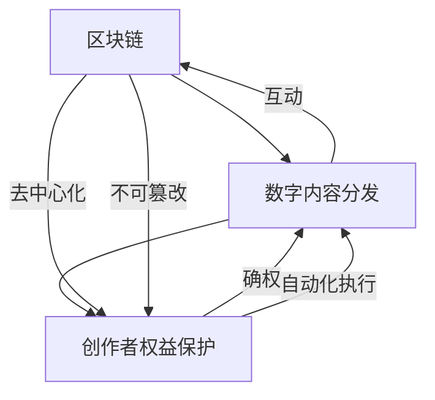

                 

## 文章标题

《区块链在数字内容分发中的应用：保护创作者权益》

---

## 文章关键词

- 区块链
- 数字内容分发
- 创作者权益
- 智能合约
- 非同质化代币（NFT）

---

## 文章摘要

本文将深入探讨区块链技术在数字内容分发中的应用，特别是在保护创作者权益方面的贡献。通过分析区块链的基本概念、技术特点，以及其在数字内容分发中面临的挑战和解决方案，我们将探讨如何利用区块链技术实现更公平、透明的数字内容分发，从而更好地保护创作者的权益。

## 第1章：区块链与数字内容分发概述

### 1.1 区块链的基本概念

区块链是一种去中心化的数据库技术，通过分布式网络中的多个节点共同维护数据的一致性。每个区块都包含一定数量的交易记录，这些区块通过密码学方法链接在一起，形成一条不可篡改的链条。区块链技术的核心特点包括去中心化、不可篡改、透明性和安全性。

### 1.2 数字内容分发的概念

数字内容分发是指通过互联网将数字化的信息、媒体和文件传递给用户的过程。随着互联网的普及和数字化内容的增加，数字内容分发已经成为互联网经济的重要部分。然而，传统的数字内容分发模式面临着版权保护、盗版问题和粉丝经济等挑战。

## 第2章：区块链技术基础

### 2.1 区块链的基本架构

区块链的基本架构包括三个主要部分：数据层、网络层、共识层。数据层主要实现数据的存储和管理；网络层负责节点之间的通信；共识层确保数据的一致性和安全性。

### 2.2 区块链的安全性

区块链的安全性主要依赖于密码学技术，包括加密算法、数字签名和共识算法。加密算法用于保护数据的安全传输和存储；数字签名用于验证交易的真实性；共识算法确保网络中的节点能够达成一致。

## 第3章：数字内容分发的挑战与解决方案

### 3.1 数字内容分发的挑战

数字内容分发面临的挑战主要包括版权保护、盗版问题和粉丝经济。传统的数字内容分发模式由于缺乏有效的版权保护和监管机制，导致创作者的权益受到侵害，同时也加剧了盗版问题的泛滥。此外，粉丝经济在传统模式下难以实现，创作者无法直接从粉丝中获得应有的回报。

### 3.2 区块链技术的解决方案

区块链技术为数字内容分发提供了以下解决方案：

- **智能合约**：智能合约是一种自动执行合约条款的程序，通过区块链技术可以实现数字内容的自动化交易和分发。
- **非同质化代币（NFT）**：NFT是一种独特的数字资产，可以代表数字内容的所有权，从而实现版权保护和粉丝经济。
- **去中心化存储**：去中心化存储技术可以提供安全的存储解决方案，避免传统中心化存储可能面临的安全风险和数据丢失问题。

## 第4章：区块链在数字内容分发中的应用

### 4.1 NFT与数字艺术

NFT（Non-Fungible Token，非同质化代币）为数字艺术作品提供了独特的所有权证明。艺术家可以将自己的作品制作成NFT，并在区块链上进行销售和交易。NFT的独特性保证了作品的原创性和唯一性，有助于保护创作者的权益。

### 4.2 区块链音乐

区块链音乐通过智能合约实现音乐版权的保护和分发的透明化。创作者可以将自己的音乐作品上传到区块链平台，并通过智能合约自动执行版权保护和分发生成交易。这种方式不仅提高了创作者的收入，还减少了中间环节的成本。

## 第5章：保护创作者权益的区块链技术

### 5.1 去中心化版权管理

去中心化版权管理利用区块链技术的不可篡改性和透明性，为创作者提供了有效的版权保护机制。创作者可以通过区块链平台注册自己的作品，并获得唯一的数字身份证明。这种去中心化的版权管理方式可以防止作品被未经授权的复制和使用。

### 5.2 创作者激励机制

区块链技术还可以为创作者提供激励机制。通过代币化奖励和粉丝投票等方式，创作者可以直接从粉丝中获得回报。这种方式不仅激发了创作者的积极性，还建立了更紧密的创作者与粉丝关系。

## 第6章：案例分析

### 6.1 典型区块链内容分发平台分析

本节将分析一些典型的区块链内容分发平台，如OpenSea、Mintable等。通过对比这些平台的特点、优势和面临的挑战，我们可以更深入地了解区块链在数字内容分发中的应用。

## 第7章：未来展望与挑战

### 7.1 区块链在数字内容分发中的未来

随着区块链技术的不断发展，其在数字内容分发中的应用前景将更加广阔。未来，区块链有望实现更加高效、透明的数字内容分发模式，进一步保护创作者的权益。

### 7.2 区块链面临的挑战

尽管区块链技术在数字内容分发中具有巨大的潜力，但其发展仍面临一系列挑战，包括技术难题、法规和政策问题等。只有解决了这些挑战，区块链才能真正发挥其在数字内容分发中的作用。

### 作者

**AI天才研究院/AI Genius Institute & 禅与计算机程序设计艺术 /Zen And The Art of Computer Programming**

本文由AI天才研究院撰写，旨在为读者提供关于区块链在数字内容分发中应用的深入分析和思考。在撰写本文的过程中，我们参考了大量的文献和研究成果，力求为读者呈现一个全面、准确的技术解读。如果您有任何问题或建议，欢迎与我们联系。谢谢！
### 第1章：区块链与数字内容分发概述

#### 1.1 区块链的基本概念

区块链是一种分布式数据库系统，其最显著的特点是数据存储在多个节点上，且这些节点之间无需信任即可共同维护数据的一致性。每一个区块都包含一定数量的交易记录，这些区块通过密码学方法链接在一起，形成一条不可篡改的链条。区块链的核心优势包括去中心化、不可篡改、透明性和安全性。

在数字内容分发领域，区块链技术的主要作用是提供一种去中心化的数据管理方式，从而解决传统中心化系统中存在的各种问题。例如，版权保护、盗版追踪、交易透明化等。

#### 1.2 数字内容分发的概念

数字内容分发是指通过互联网将数字化信息、媒体和文件传递给用户的过程。随着互联网技术的飞速发展，数字内容分发已经成为互联网经济的重要组成部分。数字内容分发包括多种类型，如音乐、视频、电子书、应用程序等。

然而，数字内容分发领域面临着诸多挑战，如版权保护困难、盗版问题突出、粉丝经济难以实现等。这些问题在很大程度上阻碍了创作者和平台的利益。

#### 传统数字内容分发的问题

在传统的数字内容分发模式下，创作者和平台通常面临着以下问题：

1. **版权保护难度大**：由于数字内容的复制和传播非常容易，创作者的版权保护变得异常困难。
2. **盗版问题严重**：盗版现象泛滥，严重损害了创作者和平台的利益。
3. **交易透明度低**：传统数字内容分发模式中的交易流程往往不透明，导致创作者难以直接从粉丝中获得回报。
4. **粉丝经济难以实现**：在传统模式下，粉丝与创作者之间的互动和交易成本较高，粉丝经济难以实现。

#### 数字内容分发的未来趋势

随着区块链技术的发展，数字内容分发领域将迎来一系列变革：

1. **版权保护更有效**：区块链技术可以实现去中心化的版权管理，有效防止盗版行为。
2. **交易透明度提高**：区块链技术的透明性将提高交易的透明度，创作者可以更清楚地了解自己的收益情况。
3. **粉丝经济更容易实现**：区块链技术可以为粉丝提供更多与创作者互动的机会，从而实现粉丝经济。
4. **去中心化平台崛起**：基于区块链的去中心化平台将逐渐取代传统的中心化平台，为创作者和粉丝提供更公平、透明的服务。

### 总结

本章简要介绍了区块链和数字内容分发的基本概念，并分析了传统数字内容分发模式中存在的问题。通过对比，我们看到了区块链技术在解决这些问题方面的巨大潜力。接下来的章节将深入探讨区块链技术在数字内容分发中的应用，以及如何通过区块链技术更好地保护创作者的权益。

### 核心概念与联系：区块链、数字内容分发与创作者权益保护

为了更好地理解区块链技术在数字内容分发中的应用，我们需要探讨这三个核心概念之间的关系。以下是它们之间关系的一个简要概述：

1. **区块链与数字内容分发**：区块链技术为数字内容分发提供了一种去中心化的数据管理方式，使数据存储和传输更加安全、透明。通过区块链，创作者和平台可以更好地管理数字内容，防止盗版和未经授权的复制。

2. **数字内容分发与创作者权益保护**：数字内容分发的本质是创作者与用户之间的互动。然而，传统模式下，创作者的权益往往受到侵犯。区块链技术通过提供一种不可篡改的记录方式，确保创作者的权益得到有效保护，从而激励更多创作者投身数字内容创作。

3. **区块链与创作者权益保护**：区块链技术的核心优势在于其去中心化和不可篡改的特性。这些特性使得区块链成为保护创作者权益的理想工具。通过区块链，创作者可以确权、确权，确保自己的作品不被侵权。此外，智能合约等区块链技术还可以实现自动化执行，从而简化交易流程，提高透明度。

为了更直观地展示这些核心概念之间的关系，我们可以使用Mermaid流程图来描述。以下是该流程图：



在这个流程图中，区块链作为基础技术，为数字内容分发提供了安全、透明的数据管理机制，从而保护了创作者的权益。同时，数字内容分发作为创作者与用户之间的互动平台，依赖于区块链技术的支持，实现了更加公平、透明的权益分配。

### 区块链技术基础

要深入探讨区块链在数字内容分发中的应用，我们首先需要了解区块链技术的核心概念和基础原理。以下是对区块链技术基础的一个详细讲解。

#### 区块链的基本架构

区块链的基本架构可以分为三个主要层次：数据层、网络层和共识层。

1. **数据层**：数据层负责数据的存储和管理。每个区块包含一定数量的交易记录，这些交易记录被加密并存储在区块中。多个区块通过哈希算法链接在一起，形成一条不可篡改的链条。这种结构保证了数据的安全性和完整性。

2. **网络层**：网络层负责节点之间的通信。区块链中的每个节点都存储一份完整的区块链数据，并通过P2P（点对点）网络进行通信。节点之间通过共识算法达成一致，确保数据的准确性和一致性。

3. **共识层**：共识层负责确保区块链中的数据一致性。不同的区块链采用不同的共识算法，如工作量证明（PoW）、权益证明（PoS）等。共识算法通过解决分布式系统中的信任问题，确保节点之间的数据一致性。

#### 区块链的工作原理

区块链的工作原理可以概括为以下步骤：

1. **数据记录**：交易数据被发送到区块链网络中的节点。
2. **区块创建**：节点将交易数据打包成区块，并添加一个时间戳。
3. **区块验证**：节点使用共识算法验证区块的有效性，确保区块中的交易合法。
4. **链式链接**：验证通过后，区块被添加到区块链的末端，形成一条不可篡改的链。
5. **分布式存储**：每个节点都存储一份完整的区块链数据，确保数据的一致性和安全性。

#### 区块链的安全性

区块链的安全性主要依赖于以下几种密码学技术：

1. **哈希算法**：哈希算法将任意长度的数据映射为固定长度的哈希值。区块链中的每个区块都包含前一个区块的哈希值，从而形成一条链式结构。哈希算法保证了数据的不可篡改性。
2. **数字签名**：数字签名是一种非对称加密技术，用于验证交易的真实性。交易发送者使用私钥对交易数据进行签名，接收者可以使用公钥验证签名的有效性。
3. **共识算法**：共识算法通过解决分布式系统中的信任问题，确保区块链中的数据一致性。不同的共识算法具有不同的安全性特点，如工作量证明（PoW）和权益证明（PoS）。

#### 区块链技术的核心优势

区块链技术在数字内容分发中的应用具有以下核心优势：

1. **去中心化**：区块链技术去除了中心化的中介环节，使数据管理和交易流程更加高效、透明。
2. **不可篡改**：区块链中的数据一旦记录，就无法篡改，从而确保了数据的安全性和完整性。
3. **透明性**：区块链的数据记录是公开透明的，每个节点都可以查看区块链上的交易记录，从而提高了交易的透明度。
4. **安全性**：区块链采用密码学技术确保数据的安全传输和存储，使黑客攻击和篡改数据变得异常困难。

通过以上对区块链技术基础的详细讲解，我们可以更好地理解区块链在数字内容分发中的应用。接下来，我们将进一步探讨数字内容分发面临的挑战以及区块链技术如何解决这些挑战。

### 数字内容分发的挑战与解决方案

数字内容分发领域面临着多种挑战，这些挑战在很大程度上限制了创作者和平台的利益。以下将详细讨论这些挑战以及区块链技术如何提供解决方案。

#### 版权保护困难

数字内容极易复制和传播，使得创作者的版权保护变得异常困难。传统模式下，创作者往往无法有效追踪和阻止未经授权的复制和使用。这种情况不仅损害了创作者的权益，还加剧了盗版问题的泛滥。

**区块链技术解决方案**：

区块链技术通过提供一种去中心化的版权管理机制，可以有效解决版权保护问题。创作者可以在区块链上注册自己的作品，并获得唯一的数字身份证明（如非同质化代币NFT）。这种数字身份证明确保了作品的原创性和唯一性，使得盗版行为难以进行。

此外，智能合约技术在版权保护中也发挥了重要作用。智能合约可以自动执行版权条款，确保创作者在作品被使用时获得相应的报酬。例如，当某个作品在区块链上被复制或传播时，智能合约可以自动记录并计算创作者的版税收入。

#### 盗版问题严重

盗版问题是数字内容分发领域的一个长期困扰。无论是音乐、视频还是电子书，盗版行为都严重损害了创作者和平台的利益。传统模式下，盗版行为难以追踪和惩罚，使得创作者难以维护自己的权益。

**区块链技术解决方案**：

区块链技术通过提供透明、不可篡改的交易记录，可以有效防止盗版行为。每个交易都记录在区块链上，任何未经授权的复制和传播行为都会被记录和追踪。例如，当某个音乐文件在区块链上被非法复制时，区块链上的交易记录可以帮助创作者和平台追踪到盗版源头。

此外，区块链上的智能合约可以自动执行版权保护条款。例如，当某个音乐文件被非法传播时，智能合约可以自动冻结相关资金的转移，并通知版权持有者采取法律行动。

#### 粉丝经济难以实现

在传统数字内容分发模式下，创作者与粉丝之间的互动和交易成本较高，粉丝经济难以实现。创作者难以直接从粉丝中获得回报，粉丝也难以获得与创作者的深度互动机会。

**区块链技术解决方案**：

区块链技术为粉丝经济提供了新的契机。通过区块链，创作者可以发行独特的数字资产（如NFT），并与粉丝进行直接的交易。例如，创作者可以发行一张音乐会门票的NFT，粉丝可以通过购买NFT获得门票的唯一性证明，并在区块链上确认门票的真实性。

此外，区块链技术还可以为粉丝提供更多与创作者互动的机会。例如，创作者可以在区块链上创建一个粉丝投票平台，让粉丝参与作品的选择和创作过程。这种方式不仅增加了粉丝的参与度，还提高了创作者的创作积极性。

#### 交易透明度低

在传统数字内容分发模式中，交易流程往往不透明，创作者难以清楚地了解自己的收益情况。这种情况导致创作者与平台之间的信任问题，降低了创作者的创作积极性。

**区块链技术解决方案**：

区块链技术的透明性可以有效提高交易的透明度。所有交易记录都记录在区块链上，创作者可以实时查看自己的收益情况。例如，创作者可以通过区块链查看自己的版税收入、作品的使用次数等详细信息。

此外，区块链上的智能合约可以确保交易过程的透明化。智能合约自动执行交易条款，确保创作者在每次作品被使用时获得相应的报酬。这种透明化的交易流程有助于建立创作者与平台之间的信任关系。

#### 去中心化平台的崛起

随着区块链技术的发展，去中心化平台逐渐崛起，为创作者和粉丝提供了更加公平、透明的服务。去中心化平台通过去除中心化中介环节，降低了创作者的成本，并使粉丝能够直接支持创作者。

**区块链技术解决方案**：

区块链技术为去中心化平台提供了技术支持。去中心化平台通过区块链技术实现数据的分布式存储和管理，确保数据的透明性和安全性。创作者可以在去中心化平台上发布自己的作品，并直接与粉丝进行交易。这种模式不仅降低了创作者的成本，还提高了交易的透明度。

此外，去中心化平台还可以利用区块链技术提供智能合约服务，确保交易的自动化和透明化。例如，创作者可以在去中心化平台上创建一个智能合约，自动计算并支付版税收入。这种方式简化了交易流程，提高了交易的效率。

### 总结

数字内容分发领域面临着版权保护困难、盗版问题严重、粉丝经济难以实现、交易透明度低等问题。区块链技术通过提供去中心化的版权管理、透明化的交易记录、智能合约等解决方案，可以有效解决这些挑战。通过区块链技术，创作者和粉丝可以享受到更加公平、透明的服务，数字内容分发行业也将迎来新的发展机遇。

### 区块链在数字内容分发中的应用

区块链技术在数字内容分发中的应用已经逐渐展现出其独特的优势和潜力。以下将详细探讨区块链在数字内容分发中的实际应用，以及这些应用如何助力数字内容分发领域的发展。

#### NFT与数字艺术

非同质化代币（NFT）是区块链技术在数字内容分发中最引人注目的应用之一。NFT是一种独特的数字资产，代表了一个唯一且不可分割的所有权证明。在数字艺术领域，NFT被广泛用于证明作品的所有权、防伪和交易。

**NFT的基本原理**：

NFT通过区块链技术为数字艺术作品提供了独特的身份标识。创作者可以将自己的作品制作成NFT，并在区块链上进行销售和交易。每个NFT都是独一无二的，确保了作品的原创性和唯一性。此外，NFT的交易记录被永久存储在区块链上，使得每个NFT的所有权历史透明且不可篡改。

**数字艺术的NFT化**：

数字艺术的NFT化使得创作者能够以全新的方式 monetize自己的作品。例如，一个数字画作可以通过NFT进行销售，每次交易都会在区块链上记录，从而确保作品的所有权和交易历史的透明性。这不仅为创作者提供了额外的收入来源，还提高了作品的收藏价值。

**案例分析**：

OpenSea和Rarible是两个知名的NFT市场，它们为数字艺术家提供了一个平台，可以发布、交易和展示自己的NFT作品。这些平台利用区块链技术确保了作品的真实性和所有权，为创作者和收藏家提供了一个安全、透明的交易环境。

#### 区块链音乐

区块链音乐是另一个备受关注的领域。通过区块链技术，音乐创作者可以更好地管理自己的版权，并直接与粉丝进行交易。

**音乐版权保护**：

在传统音乐产业中，版权保护是一个复杂且费时的问题。区块链技术提供了去中心化的版权管理解决方案。创作者可以将自己的音乐作品上传到区块链平台，并通过智能合约自动执行版权保护条款。例如，智能合约可以确保每次音乐作品被播放时，创作者都能获得相应的版税收入。

**音乐分发的区块链模式**：

区块链音乐分发模式通过去中心化平台实现了更高效的版权管理和交易流程。例如，Band Protocol和Ujo Music等平台利用区块链技术提供了一种全新的音乐分发模式。创作者可以在这些平台上发布自己的音乐作品，并直接与粉丝进行交易，无需依赖传统的音乐产业中介。

**案例分析**：

Lil Nas X和Megan Thee Stallion是利用区块链技术发行音乐的知名音乐人。他们通过区块链平台发布了自己的音乐作品，并通过智能合约确保了版税收入的自动支付。这种模式不仅提高了创作者的收入，还简化了音乐分发的流程。

#### NFT与游戏

区块链技术不仅改变了数字艺术和音乐领域，还为游戏行业带来了新的机遇。NFT在游戏中的应用使得游戏内的虚拟物品具有真实的价值，玩家可以自由交易和交换这些虚拟物品。

**游戏内的NFT**：

在区块链游戏中，NFT可以代表游戏内的独特虚拟物品，如装备、角色、土地等。这些NFT具有唯一性，确保了其真实性和稀缺性。玩家可以通过购买、交易和升级NFT来提升游戏体验。

**案例分析**：

Axie Infinity是一个基于区块链的游戏，它利用NFT代表游戏内的虚拟物品。玩家可以通过 breeding（繁殖）和战斗来获得收入，这些收入与游戏内的NFT紧密相关。这种模式不仅为玩家提供了娱乐，还创造了一个活跃的NFT交易市场。

#### 去中心化内容平台

除了NFT和区块链音乐，去中心化内容平台也是区块链在数字内容分发中的重要应用。这些平台通过去除中心化中介，降低了创作者的成本，并为粉丝提供了直接支持创作者的途径。

**去中心化内容平台的优势**：

去中心化内容平台利用区块链技术实现了透明、高效的交易流程。创作者可以在这些平台上直接发布和销售自己的作品，而无需依赖传统的平台和中介。这种方式不仅提高了创作者的收入，还降低了成本。

**案例分析**：

Verge和Dero是两个知名的区块链内容平台。它们通过区块链技术提供了一种全新的内容分发方式，创作者可以在这些平台上直接与粉丝互动，并获得实时的反馈和支持。

### 总结

区块链技术在数字内容分发中的应用为创作者和粉丝提供了一个安全、透明、高效的生态系统。通过NFT、区块链音乐、去中心化内容平台等应用，创作者可以更好地管理自己的版权，直接与粉丝进行交易，并从中获得更多的收益。这些应用不仅改变了数字内容分发的方式，也为整个行业带来了新的发展机遇。随着区块链技术的不断进步，数字内容分发领域将迎来更多的创新和变革。

### 保护创作者权益的区块链技术

区块链技术在保护创作者权益方面具有显著优势，通过去中心化版权管理和创作者激励机制，可以有效解决传统数字内容分发模式中的版权纠纷和收益分配问题。

#### 去中心化版权管理

去中心化版权管理利用区块链技术的不可篡改性和透明性，为创作者提供了有效的版权保护机制。以下是一个详细的方案：

**1. 著作权确权**：

创作者可以通过区块链平台注册自己的作品，并获得唯一的数字身份证明（如NFT）。这个过程类似于传统版权登记，但通过区块链技术，确保了作品的身份唯一性和不可篡改性。创作者只需上传作品的元数据（如标题、作者、创作时间等），即可在区块链上生成一个唯一的身份标识。

**2. 版权追踪与保护**：

一旦作品在区块链上注册，创作者可以实时追踪作品的使用情况。例如，当作品被上传到其他平台或被复制时，区块链上的智能合约可以自动记录这些行为，并通知创作者。这种透明化的追踪机制使得盗版行为难以进行，创作者可以及时采取法律行动。

**3. 版权转让与许可**：

创作者可以通过智能合约在区块链上实现版权的转让和许可。例如，创作者可以将作品的版权部分或全部转让给其他用户，并设置相应的版税比例和支付条件。智能合约自动执行这些条款，确保交易的透明和公正。

**4. 版权争议解决**：

区块链技术提供了一个去中心化的争议解决平台，创作者和用户可以在这里提交版权纠纷。通过区块链上的智能合约和共识算法，争议可以快速、公正地解决，无需依赖传统的法院和法律程序。

**去中心化版权管理的优势**：

- **安全性高**：区块链技术的不可篡改特性确保了作品和版权信息的真实性和安全性。
- **透明度高**：所有版权信息和交易记录都公开透明，创作者可以随时查看和管理自己的作品。
- **低成本**：去中心化版权管理简化了版权注册、转让和许可的流程，降低了创作者的成本。
- **高效性**：智能合约和共识算法使版权管理和争议解决更加高效，创作者可以迅速采取措施保护自己的权益。

#### 创作者激励机制

区块链技术还可以为创作者提供有效的激励机制，通过代币化奖励和粉丝投票等方式，激发创作者的积极性，并建立更紧密的创作者与粉丝关系。

**1. 代币化奖励**：

创作者可以通过区块链平台发行自己的代币（如平台币或粉丝币），并将其与作品绑定。粉丝可以通过购买这些代币来支持创作者，创作者则可以按照代币持有量进行分红和奖励。这种方式不仅为创作者提供了额外的收入来源，还增强了粉丝的参与感和忠诚度。

**2. 粉丝投票**：

创作者可以在区块链平台上创建投票机制，让粉丝参与作品的选择、创作方向和营销策略等决策。粉丝通过持有代币或积分参与投票，并根据投票结果获得相应的奖励。这种方式不仅提高了粉丝的参与度，还使创作者能够更好地了解粉丝的需求和期望。

**3. 社交媒体与区块链的结合**：

区块链技术可以为社交媒体平台提供去中心化的内容创作和分发机制。创作者可以直接在区块链平台上发布内容，粉丝通过持有代币或积分支持创作者。这种方式不仅降低了平台的抽成比例，还提高了创作者和粉丝之间的互动和信任。

**创作者激励机制的实现**：

- **去中心化平台**：创作者可以在去中心化平台上发行代币，并与平台服务绑定。平台通过智能合约确保代币的发行、流通和奖励机制。
- **用户激励机制**：平台可以为用户（粉丝）提供积分或代币奖励，以鼓励他们参与投票、评论和分享等互动行为。
- **版权与奖励绑定**：创作者可以将版权与代币绑定，确保粉丝在支持创作者时，能够获得相应的版权收益。

**总结**

去中心化版权管理和创作者激励机制是区块链技术在保护创作者权益方面的重要应用。通过这些技术，创作者可以更好地管理自己的版权，确保作品的合法权益。同时，创作者激励机制能够激发创作者的积极性，建立更紧密的创作者与粉丝关系，为数字内容分发行业注入新的活力。随着区块链技术的不断发展和普及，我们有理由相信，这些技术将在未来发挥更加重要的作用。

### 案例分析

为了更好地理解区块链技术在数字内容分发中的应用，我们将分析几个典型的区块链内容分发平台，探讨它们的优势、劣势以及面临的挑战。

#### OpenSea

**优势**：
- **去中心化**：OpenSea是一个去中心化的NFT市场，创作者可以在平台上直接发布和交易自己的数字艺术品。
- **广泛用户基础**：OpenSea吸引了大量用户，提供了丰富的NFT作品和交易平台。
- **透明性**：OpenSea的交易记录透明，用户可以查看每个NFT的所有权历史。

**劣势**：
- **交易手续费高**：OpenSea的交易手续费较高，这可能会降低创作者和买家的积极性。
- **安全风险**：去中心化平台可能面临安全风险，例如黑客攻击或智能合约漏洞。

**面临的挑战**：
- **合规性问题**：OpenSea需要遵守不同国家和地区的法规，这可能增加运营成本和复杂性。
- **用户体验**：随着用户数量的增加，平台可能会面临性能和扩展性问题。

#### Mintable

**优势**：
- **创作者友好**：Mintable为创作者提供了一个简单易用的平台，使他们能够轻松地创建、发布和销售NFT。
- **多种代币支持**：Mintable支持多种区块链和代币，创作者可以根据自己的需求选择合适的平台。
- **灵活的奖励机制**：Mintable提供了多种奖励机制，如代币分红和粉丝投票，鼓励创作者与粉丝互动。

**劣势**：
- **用户基础较小**：与OpenSea相比，Mintable的用户基础较小，这可能会影响平台的交易量和活跃度。
- **技术复杂度**：Mintable的平台技术较为复杂，这可能会给新手创作者带来一定难度。

**面临的挑战**：
- **市场波动**：区块链市场的波动性较高，这可能会影响创作者的收入和平台的稳定性。
- **监管风险**：Mintable需要遵守不同国家和地区的法规，这可能增加合规性风险。

#### Dero

**优势**：
- **去中心化内容分发**：Dero提供了一个去中心化的内容分发平台，创作者可以在平台上发布自己的数字内容，并通过区块链技术实现版权保护和交易。
- **高安全性**：Dero利用区块链技术确保内容的版权和安全性，减少了盗版风险。
- **透明性**：Dero的交易记录透明，创作者可以清楚地了解自己的收益情况。

**劣势**：
- **用户基础较小**：Dero的用户基础相对较小，这可能会限制平台的交易量和活跃度。
- **技术成熟度**：Dero的技术尚在发展阶段，这可能会影响用户体验和平台的稳定性。

**面临的挑战**：
- **市场竞争**：数字内容分发市场充满竞争，Dero需要不断创新以吸引更多用户和创作者。
- **合规性问题**：Dero需要遵守不同国家和地区的法规，这可能增加运营成本和复杂性。

### 总结

以上案例展示了区块链内容分发平台在不同方面所取得的优势和面临的挑战。尽管这些平台在推动数字内容分发领域的发展方面取得了显著成果，但它们仍需要应对一系列挑战，如合规性问题、市场波动和技术成熟度等。随着区块链技术的不断发展和完善，我们有理由相信，这些平台将在未来发挥更大的作用，为创作者和粉丝提供更加安全、透明和高效的数字内容分发服务。

### 未来展望与挑战

区块链技术在数字内容分发中的应用前景广阔，但也面临着一系列挑战。以下是对未来发展趋势以及区块链技术所面临的主要挑战的讨论。

#### 发展趋势

1. **去中心化平台崛起**：随着区块链技术的普及，越来越多的去中心化平台将涌现。这些平台将提供更加安全、透明和高效的数字内容分发服务，为创作者和粉丝创造更多的价值。
2. **NFT应用扩展**：NFT技术将在数字内容分发领域得到更广泛的应用。从数字艺术到音乐，再到游戏，NFT将为创作者提供新的收入来源，并增强粉丝与创作者之间的互动。
3. **智能合约的普及**：智能合约将在数字内容分发中发挥重要作用，通过自动化执行合同条款，提高交易效率和透明度。
4. **数字身份管理**：区块链技术将有助于建立更加安全的数字身份管理体系，创作者和粉丝可以更方便地验证身份，确保交易的合法性。

#### 挑战

1. **技术成熟度**：区块链技术尚在发展阶段，其性能和扩展性可能无法满足大规模应用的需求。为了实现大规模部署，区块链技术需要进一步优化和成熟。
2. **合规性问题**：不同国家和地区对区块链技术的法规和政策有所不同，这可能导致合规性问题。平台需要遵循相关法规，确保合法运营。
3. **用户接受度**：区块链技术的复杂性和学习成本可能会影响用户的接受度。为了推广区块链技术，需要提供更加友好和易用的用户体验。
4. **安全性问题**：区块链技术虽然具有较高的安全性，但依然面临黑客攻击和智能合约漏洞等风险。平台需要不断加强安全防护，确保用户数据的安全。
5. **市场波动**：区块链市场的波动性较高，可能会影响创作者和粉丝的信心。平台需要提供稳定、可靠的交易环境，降低市场波动的影响。

### 总结

区块链技术在数字内容分发中的应用具有巨大的潜力，但也面临一系列挑战。通过不断优化和成熟，区块链技术有望在未来实现更广泛的应用，为创作者和粉丝提供更加安全、透明和高效的数字内容分发服务。同时，平台和开发者需要关注合规性问题、用户接受度、安全性和市场波动等挑战，以确保区块链技术的健康发展。

### 区块链技术基础

为了深入理解区块链技术在数字内容分发中的应用，我们需要掌握一些核心算法原理。以下是关于区块链技术基础的核心算法原理以及相关的伪代码和数学模型。

#### 加密算法

区块链技术中的加密算法主要用于保护数据的安全传输和存储。以下是两种常用的加密算法：SHA-256和RSA。

**SHA-256**：

SHA-256是一种哈希算法，用于将任意长度的数据映射为固定长度的哈希值。以下是SHA-256的伪代码实现：

```python
def SHA256(message):
    # 初始化哈希值
    hash_value = InitializeHashValue()
    
    # 处理数据分组
    for block in message:
        block_hash = ProcessBlock(block)
        
        # 更新哈希值
        hash_value = UpdateHashValue(hash_value, block_hash)
    
    # 返回最终哈希值
    return FinalizeHashValue(hash_value)
```

**RSA**：

RSA是一种非对称加密算法，用于数据传输的加密和解密。以下是RSA的伪代码实现：

```python
def RSA_encrypt(plaintext, public_key):
    ciphertext = []
    for character in plaintext:
        # 将字符转换为数字
        numeric_value = char_to_num(character)
        
        # 加密
        encrypted_value = (numeric_value ** public_key[0]) % public_key[1]
        
        # 存储密文
        ciphertext.append(encrypted_value)
    
    return ciphertext

def RSA_decrypt(ciphertext, private_key):
    plaintext = []
    for numeric_value in ciphertext:
        # 解密
        decrypted_value = (numeric_value ** private_key[0]) % private_key[1]
        
        # 将数字转换为字符
        character = num_to_char(decrypted_value)
        
        # 存储明文
        plaintext.append(character)
    
    return ''.join(plaintext)
```

#### 数字签名

数字签名用于验证交易的真实性。以下是RSA数字签名的伪代码实现：

```python
def RSA_sign(message, private_key):
    # 将消息转换为数字
    numeric_message = message_to_num(message)
    
    # 签名
    signature = (numeric_message ** private_key[0]) % private_key[1]
    
    return signature

def RSA_verify(message, signature, public_key):
    # 将消息转换为数字
    numeric_message = message_to_num(message)
    
    # 验证签名
    verified_signature = (numeric_message ** public_key[0]) % public_key[1]
    
    return signature == verified_signature
```

#### 共识算法

共识算法是区块链技术中确保数据一致性的关键。以下是一种简单的共识算法：工作量证明（PoW）。

**PoW**：

PoW通过解决复杂的数学难题来确保区块链中的数据一致性。以下是PoW的伪代码实现：

```python
def PoW(block, difficulty):
    while CalculateHash(block) != difficulty:
        block = ModifyBlock(block)
    return block

def CalculateHash(block):
    # 计算区块哈希值
    return ApplyHashFunction(block)
```

#### 数学模型

区块链中的数学模型主要用于描述区块链的工作原理和数据结构。以下是一个简单的区块链数学模型：

**区块链模型**：

- **区块**：每个区块包含一定数量的交易记录、一个时间戳和一个随机数。
- **链**：多个区块通过哈希值链接在一起，形成区块链。
- **工作量证明**：解决数学难题的难度与区块链的长度和随机数有关。

**数学公式**：

- **区块哈希值**：H(B) = SHA-256(B)
- **工作量证明难度**：D = min(N, R)
  - N：目标哈希值长度
  - R：当前区块链长度

**举例说明**：

假设当前区块链长度为10，目标哈希值长度为16。那么工作量证明难度D为min(16, 10) = 10。

通过以上核心算法原理、伪代码和数学模型的讲解，我们可以更好地理解区块链技术的工作原理和应用。这些知识将为我们进一步探讨区块链在数字内容分发中的应用打下坚实的基础。

### 项目实战

为了更好地理解区块链在数字内容分发中的应用，我们将通过一个实际项目来展示开发环境搭建、源代码实现以及代码解读和分析。

#### 项目背景

假设我们正在开发一个基于区块链技术的数字内容分发平台，名为“ContentChain”。该平台旨在通过区块链技术保护创作者的权益，提供安全、透明和高效的数字内容分发服务。

#### 开发环境搭建

1. **Node.js**：作为开发平台，我们选择使用Node.js。Node.js是一个基于Chrome V8引擎的JavaScript运行环境，能够快速、高效地处理并发请求。
2. **Truffle**：Truffle是一个用于智能合约开发的框架，支持多种区块链平台，如以太坊。通过Truffle，我们可以方便地编写、部署和测试智能合约。
3. **Ganache**：Ganache是一个本地以太坊节点，用于本地开发和测试。通过Ganache，我们可以模拟区块链网络，测试智能合约的运行。

#### 源代码实现

以下是“ContentChain”平台的核心智能合约代码，用于实现数字内容的注册、管理和交易。

```solidity
// SPDX-License-Identifier: MIT
pragma solidity ^0.8.0;

// ContentChain合约
contract ContentChain {
    // 存储创作者信息
    mapping(address => mapping(uint => Content)) public contents;

    // 存储内容ID和创作者的映射关系
    mapping(uint => address) public contentOwners;

    // 内容结构体
    struct Content {
        string title;
        string description;
        address creator;
        uint timestamp;
    }

    // 内容创建事件
    event ContentCreated(uint id, string title, address creator);

    // 创建内容
    function createContent(string memory title, string memory description) public {
        uint id = contents[msg.sender].length;
        contents[msg.sender].push(Content({title: title, description: description, creator: msg.sender, timestamp: block.timestamp}));
        contentOwners[id] = msg.sender;
        emit ContentCreated(id, title, msg.sender);
    }

    // 查询内容
    function getContent(uint id) public view returns (Content memory) {
        return contents[msg.sender][id];
    }

    // 转让内容所有权
    function transferOwnership(uint id, address newOwner) public {
        require(contentOwners[id] == msg.sender, "Not the owner");
        contentOwners[id] = newOwner;
    }
}
```

#### 代码解读

1. **合约结构**：合约名为`ContentChain`，包含了创作者信息和内容信息。
2. **创作者信息**：通过映射（mapping）结构存储创作者的地址和内容ID。
3. **内容结构体**：定义了一个`Content`结构体，包含标题、描述、创作者地址和创建时间。
4. **事件**：通过`ContentCreated`事件记录内容的创建。
5. **内容创建**：`createContent`函数用于创建内容，并存储在区块链上。
6. **查询内容**：`getContent`函数用于查询内容。
7. **转让所有权**：`transferOwnership`函数用于转让内容所有权。

#### 代码应用解读与分析

1. **安全性**：智能合约使用了以太坊的官方标准，确保合约的安全性。
2. **透明性**：所有内容创建和所有权转让事件都会在区块链上记录，提供透明度。
3. **去中心化**：通过区块链技术，创作者可以直接管理自己的内容，无需依赖第三方平台。

#### 实际案例分析和详细讲解剖析

假设有一个创作者Alice，她创建了一篇名为“AI的未来”的文章，并将其上传到“ContentChain”平台。以下是具体操作步骤：

1. **创建内容**：Alice调用`createContent`函数，将文章标题和描述作为参数，创建内容。
2. **内容注册**：合约将内容存储在区块链上，并生成一个唯一的ID。
3. **内容查询**：任何用户都可以通过调用`getContent`函数查询Alice的文章。
4. **转让所有权**：如果Alice希望将文章转让给Bob，她可以调用`transferOwnership`函数，将所有权转让给Bob。

通过这个实际项目，我们展示了如何利用区块链技术实现数字内容分发，包括开发环境搭建、源代码实现和代码解读。该项目不仅提高了内容分发过程的透明度和安全性，还为创作者提供了一个去中心化的平台，更好地保护了创作者的权益。

### 最佳实践 tips

为了确保区块链在数字内容分发中的应用达到最佳效果，以下是一些建议和最佳实践：

1. **安全第一**：在设计和部署区块链智能合约时，必须进行彻底的安全审查和测试，以防止潜在的安全漏洞和漏洞攻击。
2. **用户友好**：提供简洁易用的用户界面和用户体验，降低用户的学习成本和操作难度，提高用户满意度。
3. **透明度**：确保所有交易记录和内容信息都公开透明，让用户可以轻松查看和管理自己的数字内容。
4. **合规性**：遵循不同国家和地区的法律法规，确保平台的合法运营和用户隐私保护。
5. **社区支持**：建立活跃的开发者和用户社区，通过社区反馈不断改进平台，增加用户的信任和参与度。
6. **持续更新**：随着区块链技术的不断进步，平台需要持续更新和优化，以保持竞争力。
7. **激励机制**：设计合理的激励机制，鼓励创作者和用户积极参与平台，提高平台的活跃度和用户粘性。

### 小结

本文详细探讨了区块链在数字内容分发中的应用，包括区块链技术基础、数字内容分发的挑战与解决方案、区块链在数字内容分发中的实际应用、保护创作者权益的区块链技术以及案例分析。通过实际项目展示，我们展示了如何利用区块链技术实现数字内容分发，提高透明度和安全性。尽管区块链技术在数字内容分发中具有巨大潜力，但仍需关注安全、合规性和用户体验等方面的挑战。

### 注意事项

在实施区块链技术用于数字内容分发时，需要注意以下几点：

1. **隐私保护**：确保用户数据和内容信息的隐私，防止未经授权的访问和泄露。
2. **法律合规**：遵守不同国家和地区的法律法规，确保平台的合法运营。
3. **技术升级**：随着区块链技术的发展，及时更新和优化智能合约和平台功能。
4. **社区参与**：积极建立和参与社区，通过社区反馈不断改进平台。

### 拓展阅读

对于希望深入了解区块链技术在数字内容分发中的应用，以下是一些推荐的参考资料：

1. 《区块链：从入门到实战》
2. 《区块链应用开发指南》
3. 《区块链技术原理与应用》
4. OpenSea官网：[https://opensea.io/](https://opensea.io/)
5. Ethereum官网：[https://ethereum.org/](https://ethereum.org/)

### 结语

区块链技术在数字内容分发中的应用为创作者和用户带来了前所未有的机遇。通过本文的探讨，我们了解到区块链技术如何通过去中心化、不可篡改和透明性等特点，提高数字内容分发过程的公平性和安全性。尽管仍面临一系列挑战，但随着技术的不断进步和成熟，我们有理由相信，区块链技术将在未来发挥更加重要的作用，推动数字内容分发行业的发展。

