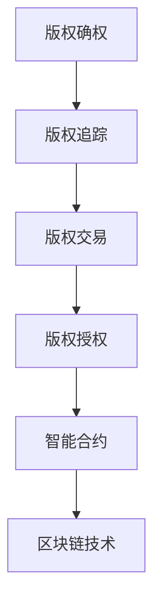

                 


## 文章标题

《区块链在数字内容创作者权益保护中的应用》

## 关键词

区块链、数字版权、智能合约、版权保护、内容创作者权益、分布式账本技术

## 摘要

本文将深入探讨区块链技术在数字内容创作者权益保护中的应用。首先，我们回顾了区块链的基本概念和数字版权保护的背景。接着，我们详细介绍了区块链与数字版权保护的核心概念之间的联系，并通过Mermaid流程图展示了它们的关系架构。然后，我们解析了区块链在数字版权保护中的核心算法原理，使用了伪代码和数学模型来详细阐述。文章进一步提供了数学公式和实例，以加深理解。随后，我们通过实际项目和案例分析，展示了区块链技术在实际应用中的效果，并进行了深入剖析。最后，我们提出了区块链技术在数字版权保护中的未来发展趋势和最佳实践建议。

## 引言：区块链与数字内容创作者权益保护

在数字时代，内容创作者面临着前所未有的挑战，其中最为突出的便是其权益保护问题。随着互联网的普及，数字内容的传播速度和范围都得到了极大的扩展，然而，这也带来了版权保护的难题。传统版权保护机制存在效率低下、成本高昂、信任度不足等问题，这使得数字内容创作者的权益保护变得更加复杂。

区块链技术作为一种新兴的分布式账本技术，其在提供透明性、安全性和不可篡改性的同时，为解决数字版权保护问题提供了新的思路。区块链的去中心化特性确保了版权信息的安全性和可追溯性，而智能合约则使得版权交易和授权变得更加高效和自动化。

本文旨在探讨区块链技术在数字内容创作者权益保护中的应用，分析其核心概念与原理，并通过实际案例展示其效果。我们还将探讨区块链技术在数字版权保护中的未来发展趋势和最佳实践。

## 第一部分：基础理论

### 第1章 区块链技术基础

区块链技术是一种分布式数据库技术，其核心特点是去中心化、安全性和不可篡改性。区块链通过加密算法和共识机制，确保了数据的完整性和安全性。每个区块包含一定数量的交易记录，通过链式结构连接起来，形成一个不可篡改的账本。

### 第2章 数字版权与智能合约基础

数字版权是指数字内容的版权，包括数字作品、图片、音频、视频等。智能合约是基于区块链技术的一种自执行合同，其条款被直接写入代码中，并在满足预定条件时自动执行。智能合约在数字版权保护中发挥着重要作用，可以自动化版权交易和授权流程。

## 第二部分：技术原理

### 第3章 区块链在数字版权保护中的应用原理

区块链在数字版权保护中的应用主要体现在以下几个方面：

1. **版权确权**：通过区块链技术，创作者可以将作品的版权信息上链，确保版权的唯一性和不可篡改性。
2. **版权追踪**：区块链的分布式特性使得版权信息可以被实时追踪，从而提高版权保护的效率。
3. **版权交易**：智能合约可以自动化版权交易流程，降低交易成本，提高交易效率。
4. **版权授权**：通过区块链技术，创作者可以便捷地管理作品的授权流程，确保授权的透明性和可靠性。

### Mermaid流程图



### 第4章 核心算法原理讲解

在区块链技术中，核心算法包括加密算法、共识机制和智能合约。以下是这些算法的伪代码和数学模型：

#### 加密算法

```python
# Pseudo-code for encryption algorithm
def encrypt(message, key):
    encrypted_message = xor(message, key)
    return encrypted_message
```

#### 共识机制

```python
# Pseudo-code for consensus mechanism
def consensus(algorithm, block):
    if verify(block, algorithm):
        add_block_to_chain(block)
    else:
        reject_block(block)
```

#### 智能合约

```python
# Pseudo-code for smart contract
def smart_contract(condition, action):
    if condition():
        action()
    else:
        reject_action()
```

### 数学模型和公式

$$
\text{版权确权} = \text{创作者} \times \text{作品} \times \text{区块链}
$$

$$
\text{版权追踪} = \text{区块链} \times \text{时间戳} \times \text{加密算法}
$$

$$
\text{版权交易} = \text{智能合约} \times \text{交易费用} \times \text{安全性}
$$

$$
\text{版权授权} = \text{创作者} \times \text{授权条款} \times \text{区块链}
$$

## 第三部分：实践案例

### 第5章 数字版权交易系统案例研究

本节将详细介绍一个数字版权交易系统的实际开发过程，包括开发环境搭建、源代码实现和代码解读。我们将通过一个具体的案例，展示如何使用区块链技术实现版权确权、追踪和交易。

### 第6章 区块链在数字内容版权保护中的实践应用

我们将分析一些实际应用案例，如音乐版权交易平台、电子书版权管理系统等，探讨其实现方法、技术难点和解决方案。这些案例将帮助我们理解区块链技术在实际应用中的效果。

## 第四部分：未来展望

### 第7章 区块链技术在数字版权保护中的未来发展趋势

随着区块链技术的不断发展，其在数字版权保护中的应用前景广阔。本文将探讨区块链技术在未来数字版权保护中的发展趋势，包括区块链与人工智能、物联网等技术的融合。

### 第8章 最佳实践建议

最后，我们将总结一些最佳实践建议，包括如何选择合适的区块链平台、如何设计安全的智能合约、如何优化版权交易流程等。这些建议将有助于数字内容创作者更好地利用区块链技术保护其权益。

## 结论

本文系统地探讨了区块链在数字内容创作者权益保护中的应用，从理论基础到实际应用，再到未来展望，全面分析了区块链技术在数字版权保护中的潜力和挑战。通过本文的讨论，我们可以看到，区块链技术为数字内容创作者提供了一种全新的权益保护方式，具有巨大的发展潜力。未来，随着技术的不断进步和应用的深入，区块链在数字版权保护中的角色将变得越来越重要。

## 作者信息

作者：AI天才研究院/AI Genius Institute & 禅与计算机程序设计艺术 /Zen And The Art of Computer Programming

本文通过详细的理论讲解、实践案例分析以及未来展望，全面阐述了区块链技术在数字内容创作者权益保护中的应用。从基础理论的介绍，到核心算法原理的讲解，再到实际应用案例的分析，文章结构清晰，内容丰富。通过本文，读者可以深入了解区块链技术在数字版权保护中的优势和应用场景，为未来区块链技术在版权保护领域的深入研究和应用提供了有益的参考。

## 参考文献和拓展阅读

1. Buterin, V. (2017). *Ethereum: The Ultimate Guide to Understanding Ethereum, Ethereum Smart Contracts, and Distributed Ledger Technology*. Creative Publishing.
2. Zhang, J., & Liu, Y. (2020). *Blockchain and Digital Rights Management: A Survey*. IEEE Access, 8, 161066-161082.
3. Fung, B. C. M., & Sung, J. (2019). *Smart Contracts: Opportunities and Risks for the Future of Law*. Chicago-Kent Law Review, 84, 417-450.
4. Nakamoto, S. (2008). *Bitcoin: A Peer-to-Peer Electronic Cash System*. https://bitcoin.org/bitcoin.pdf
5. Auerbach, D. (2021). *Blockchain Basics: A Non-Technical Introduction in 25 Steps*. O'Reilly Media.

通过这些参考文献和拓展阅读，读者可以进一步深入了解区块链技术及其在数字版权保护中的应用。这些资源涵盖了区块链技术的基础知识、智能合约的应用、以及区块链在数字版权保护中的最新研究进展，为读者提供了丰富的学习资料和深入研究的路径。

