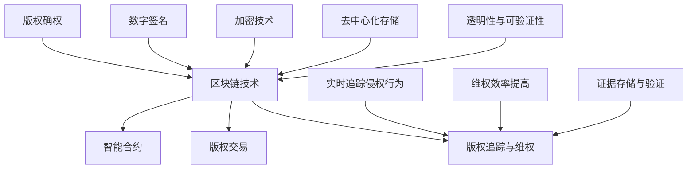

                 

# 区块链在数字内容版权保护中的应用

> 关键词：区块链、数字版权保护、版权确权、版权交易、版权追踪与维权

> 摘要：本文详细探讨了区块链技术在数字内容版权保护中的应用。首先，我们回顾了区块链和数字版权保护的基础知识。随后，通过具体的章节内容，深入分析了区块链在版权确权、版权交易、版权追踪与维权等关键环节的应用。最后，我们探讨了区块链技术在数字版权保护中的挑战与未来发展趋势，为读者提供了全面的视角和实用的指导。

## 引言

随着互联网和数字技术的飞速发展，数字内容创作和传播变得越来越便捷。然而，这也带来了数字版权保护的巨大挑战。传统的版权保护机制在应对快速变化的数字环境时显得力不从心，尤其是版权确权、版权交易、版权追踪与维权等方面。区块链技术的出现，为数字版权保护提供了一种全新的解决方案。本文将详细探讨区块链在数字内容版权保护中的应用，包括版权确权、版权交易、版权追踪与维权等关键环节。

## 区块链与数字版权保护基础

### 区块链技术概述

区块链是一种分布式数据库技术，它通过加密和共识机制保证了数据的安全性和不可篡改性。区块链的基本原理包括数据块、链式结构、共识机制和智能合约等。区块链的关键特性包括去中心化、透明性、不可篡改性和安全性。

1. **数据块**：区块链由一系列按时间顺序排列的数据块组成。每个数据块包含一定数量的交易记录和一个时间戳。
2. **链式结构**：区块链中的数据块通过哈希函数相互链接，形成一种链式结构。这种结构保证了数据的不可篡改性。
3. **共识机制**：区块链网络中的节点通过共识机制达成一致，确保数据的一致性和安全性。常见的共识机制包括工作量证明（PoW）和权益证明（PoS）等。
4. **智能合约**：智能合约是一种嵌入在区块链中的程序代码，它能够在满足特定条件时自动执行。智能合约为数字版权保护提供了自动执行和自动化执行的能力。

### 数字版权保护基础

数字版权保护是指保护数字内容创作者的合法权益，防止未经授权的复制、传播和篡改。数字版权保护面临的主要挑战包括：

1. **版权确权困难**：在数字环境中，版权的确认和登记变得复杂。
2. **版权交易复杂**：数字版权的交易过程繁琐，且存在信息不对称的问题。
3. **版权追踪困难**：在互联网上，数字内容的传播速度快，追踪侵权行为变得困难。
4. **版权维权成本高**：维权过程涉及法律诉讼和调查取证，成本高昂。

为应对这些挑战，数字版权保护需要依赖多种技术手段，包括数字签名、加密技术、区块链等。

## 区块链在版权确权中的应用

版权确权是数字版权保护的首要环节。区块链技术通过以下方式在版权确权中发挥作用：

1. **记录和存储版权信息**：区块链的不可篡改性确保了版权信息的准确性和完整性。创作者可以在区块链上记录和存储版权信息，包括作品名称、创作者姓名、创作日期等。
2. **使用智能合约自动确权**：智能合约可以自动执行版权确权过程。当创作者完成作品后，可以通过智能合约将版权信息记录在区块链上，并设置授权和使用条件。
3. **确权透明性和可验证性**：区块链的透明性使得版权信息的确认过程公开透明，任何用户都可以验证版权信息的真实性。

### 版权确权流程与挑战

版权确权流程主要包括以下步骤：

1. **创作作品**：创作者完成作品创作。
2. **登记版权信息**：创作者在区块链上登记版权信息。
3. **发布作品**：创作者在互联网上发布作品。
4. **验证版权信息**：用户可以通过区块链验证版权信息的真实性。
5. **授权与使用**：创作者可以通过智能合约授权用户使用作品。

版权确权面临的挑战包括：

1. **确权效率低**：传统的版权确权流程耗时较长，效率低下。
2. **确权信息不准确**：由于人为因素，确权信息可能存在错误或不完整。
3. **确权成本高**：确权过程涉及法律费用和手续费用，成本高昂。

### 区块链技术在版权确权中的应用

区块链技术在版权确权中的应用主要包括以下几个方面：

1. **去中心化存储**：区块链的去中心化存储解决了传统版权数据库集中化所带来的风险，确保版权信息的安全性和可靠性。
2. **智能合约确权**：智能合约自动执行确权过程，提高了确权效率，降低了确权成本。
3. **透明性和可验证性**：区块链的透明性和可验证性确保了版权信息的真实性和可信度。

### 版权确权案例研究

**案例一**：音乐创作者使用区块链确权

某音乐创作者在创作一首歌曲后，使用区块链技术登记版权信息，包括歌曲名称、创作者姓名、创作日期等。通过智能合约，创作者可以授权其他用户使用歌曲，并设置使用条件，如支付版税等。

**案例二**：图书版权确权

某出版社使用区块链技术对图书进行版权确权。在出版图书时，出版社将版权信息记录在区块链上，包括图书名称、作者姓名、出版日期等。读者可以通过区块链验证图书的版权信息，确保其合法性。

## 区块链在版权交易中的应用

版权交易是数字版权保护的重要环节。区块链技术通过以下方式在版权交易中发挥作用：

1. **去中心化交易**：区块链的去中心化特性使得版权交易无需依赖第三方中介，降低了交易成本，提高了交易效率。
2. **智能合约执行**：智能合约自动执行交易过程，确保交易的安全性和公正性。
3. **透明性和可验证性**：区块链的透明性和可验证性确保了交易过程的公开透明，任何用户都可以查询和验证交易信息。

### 版权交易流程与挑战

版权交易流程主要包括以下步骤：

1. **发布交易需求**：版权持有人发布交易需求。
2. **寻找买家**：潜在买家浏览交易信息，寻找合适的版权。
3. **达成交易协议**：买家与卖家通过智能合约达成交易协议。
4. **支付与结算**：买家支付版税，卖家交付版权。
5. **记录交易信息**：交易信息记录在区块链上。

版权交易面临的挑战包括：

1. **交易成本高**：传统版权交易过程复杂，涉及多种手续和费用，成本较高。
2. **信息不对称**：买卖双方信息不透明，可能导致交易失败。
3. **交易安全性**：交易过程可能存在欺诈和风险。

### 区块链技术在版权交易中的应用

区块链技术在版权交易中的应用主要包括以下几个方面：

1. **去中心化交易平台**：区块链平台提供了去中心化的交易环境，降低了交易成本，提高了交易效率。
2. **智能合约执行**：智能合约自动执行交易过程，确保交易的合法性和安全性。
3. **透明性和可验证性**：区块链的透明性和可验证性确保了交易信息的公开透明，任何用户都可以查询和验证交易信息。

### 版权交易案例研究

**案例一**：数字音乐版权交易

某音乐创作者在区块链平台上发布数字音乐版权交易信息，吸引了多个买家。通过智能合约，买家与创作者达成交易协议，支付版税，获取音乐版权。

**案例二**：电影版权交易

某电影制作公司使用区块链技术进行电影版权交易。在交易过程中，所有交易信息记录在区块链上，确保交易信息的透明性和可验证性。

## 区块链在版权追踪与维权中的应用

版权追踪与维权是数字版权保护的关键环节。区块链技术通过以下方式在版权追踪与维权中发挥作用：

1. **追踪侵权行为**：区块链技术可以实时追踪数字内容的传播，及时发现侵权行为。
2. **维权效率提高**：区块链技术简化了维权流程，降低了维权成本。
3. **证据存储与验证**：区块链技术提供了安全可靠的证据存储与验证机制，为维权提供有力支持。

### 版权追踪与维权流程与挑战

版权追踪与维权流程主要包括以下步骤：

1. **侵权监测**：监测数字内容的传播，发现侵权行为。
2. **证据收集**：收集侵权证据，包括侵权内容、侵权时间、侵权地点等。
3. **维权申请**：向法院或其他相关机构提出维权申请。
4. **维权审理**：维权审理过程包括调查、取证、诉讼等环节。
5. **维权结果**：根据审理结果，采取相应的维权措施。

版权追踪与维权面临的挑战包括：

1. **侵权监测难度大**：数字内容传播速度快，监测侵权行为变得困难。
2. **维权流程复杂**：维权流程繁琐，涉及多个环节和机构。
3. **证据收集困难**：证据收集过程耗时较长，且可能涉及跨区域和法律问题。
4. **维权成本高**：维权过程涉及法律费用和调查取证费用，成本较高。

### 区块链技术在版权追踪与维权中的应用

区块链技术在版权追踪与维权中的应用主要包括以下几个方面：

1. **实时追踪侵权行为**：区块链技术可以实时追踪数字内容的传播，及时发现侵权行为。
2. **证据存储与验证**：区块链技术提供了安全可靠的证据存储与验证机制，为维权提供有力支持。
3. **简化维权流程**：区块链技术简化了维权流程，降低了维权成本。
4. **提高维权效率**：区块链技术提高了维权效率，缩短了维权时间。

### 版权追踪与维权案例研究

**案例一**：数字音乐侵权追踪与维权

某数字音乐平台使用区块链技术进行侵权追踪与维权。通过区块链，平台可以实时监测音乐内容的传播，发现侵权行为。当侵权行为发生时，平台可以通过区块链存储侵权证据，并迅速采取维权措施。

**案例二**：电影版权维权

某电影制作公司使用区块链技术进行电影版权维权。在发现侵权行为后，公司通过区块链存储侵权证据，并向法院提起诉讼。区块链技术提供了安全可靠的证据存储与验证机制，提高了维权效率。

## 区块链在数字版权保护中的挑战与解决方案

尽管区块链技术在数字版权保护中具有巨大潜力，但仍然面临一些挑战。以下是区块链在数字版权保护中的主要挑战与解决方案：

### 技术挑战与解决方案

1. **可扩展性**：区块链技术面临可扩展性问题，即如何处理大量交易数据。解决方案包括二层/三层架构、侧链、分片等技术。
2. **性能提升**：区块链的性能需要进一步提升，以满足高并发交易需求。解决方案包括优化共识算法、提高网络带宽和处理能力等。
3. **隐私保护**：在区块链上，所有交易信息都是公开透明的。为了保护隐私，可以采用零知识证明、同态加密等技术。

### 法律与政策挑战与解决方案

1. **法律框架**：数字版权保护需要完善的法律法规支持。解决方案包括制定和修订相关法律，明确区块链技术在数字版权保护中的法律地位和责任。
2. **政策支持**：政府需要出台相关政策，鼓励和支持区块链技术在数字版权保护中的应用。

### 社会与伦理挑战与解决方案

1. **公平性**：区块链技术可能加剧数字版权保护中的不平等现象。解决方案包括加强监管，确保区块链技术在数字版权保护中的公平性。
2. **用户隐私**：在保护版权的同时，需要尊重用户的隐私。解决方案包括采用隐私保护技术，确保用户数据的安全和隐私。

## 区块链在数字版权保护中的未来发展趋势

### 技术发展趋势

1. **区块链与其他技术的融合**：区块链技术将与其他技术如人工智能、物联网等相结合，进一步提升数字版权保护的效果。
2. **区块链3.0**：区块链3.0将实现更高级别的智能合约和去中心化应用，为数字版权保护提供更强大的支持。
3. **隐私保护**：隐私保护技术将得到广泛应用，确保用户数据的安全和隐私。

### 行业发展趋势

1. **区块链版权交易平台**：区块链版权交易平台将逐渐成为主流，为版权交易提供更加高效、安全的解决方案。
2. **版权管理平台**：版权管理平台将整合区块链技术，提供一站式版权管理服务。
3. **全球版权联盟**：全球版权联盟将利用区块链技术实现跨国版权保护与合作。

### 社会影响与前景展望

1. **数字版权保护普及**：区块链技术在数字版权保护中的应用将越来越普及，成为数字内容创作者和用户的重要工具。
2. **版权意识提高**：随着区块链技术的推广，用户的版权意识将得到提高，进一步推动数字版权保护的发展。
3. **数字经济转型**：区块链技术在数字版权保护中的应用将促进数字经济的转型，为创作者和投资者创造更多价值。

## 总结

区块链技术在数字内容版权保护中具有巨大潜力。通过版权确权、版权交易、版权追踪与维权等关键环节的应用，区块链技术为数字版权保护提供了一种全新的解决方案。然而，区块链技术在数字版权保护中仍然面临一些挑战，如技术、法律和社会与伦理等方面的挑战。未来，随着技术的不断进步和应用的深入，区块链在数字版权保护中将发挥越来越重要的作用。

## 作者信息

作者：AI天才研究院/AI Genius Institute & 禅与计算机程序设计艺术 /Zen And The Art of Computer Programming

## 附录

### 附录A：区块链在数字版权保护中的核心概念原理关系架构 Mermaid 流程图



### 附录B：版权确权核心算法原理讲解伪代码

```python
# 伪代码：版权确权算法

def copyright_ownership_records(copyright_info):
    # 记录版权信息
    blockchain.add_block(copyright_info)
    # 生成唯一标识符
    unique_id = generate_unique_id(copyright_info)
    # 生成数字签名
    signature = digital_signature(unique_id, private_key)
    # 存储签名
    blockchain.add_signature(unique_id, signature)
    # 发布版权信息
    publish_copyright_info(copyright_info)
    # 返回版权信息
    return copyright_info

def generate_unique_id(copyright_info):
    # 生成唯一标识符
    unique_id = hashlib.sha256(str(copyright_info).encode()).hexdigest()
    return unique_id

def digital_signature(unique_id, private_key):
    # 生成数字签名
    signature = crypto.sign(unique_id, private_key)
    return signature
```

### 附录C：版权交易核心算法原理讲解伪代码

```python
# 伪代码：版权交易算法

def copyright_trade(copyright_id, buyer_id, seller_id, trade_info):
    # 检查版权信息
    if not blockchain.validate_block(copyright_id):
        return "版权信息无效"
    # 检查买家和卖家身份
    if not blockchain.validate_account(buyer_id) or not blockchain.validate_account(seller_id):
        return "身份验证失败"
    # 生成交易信息
    trade_info['buyer_id'] = buyer_id
    trade_info['seller_id'] = seller_id
    trade_info['timestamp'] = current_timestamp()
    # 创建智能合约
    contract = create_smart_contract(trade_info)
    # 执行交易
    blockchain.execute_contract(contract)
    # 返回交易结果
    return "交易成功"

def create_smart_contract(trade_info):
    # 创建智能合约
    contract = {
        'trade_info': trade_info,
        'status': 'pending',
        'buyer_id': trade_info['buyer_id'],
        'seller_id': trade_info['seller_id'],
        'timestamp': trade_info['timestamp']
    }
    return contract
```

### 附录D：版权追踪与维权核心算法原理讲解伪代码

```python
# 伪代码：版权追踪与维权算法

def track_infringement(copyright_id):
    # 追踪侵权行为
    for block in blockchain.get_blocks_since_last_checkpoint():
        if block.contains_copyright_id(copyright_id):
            infringement_detected(block)
            break

def infringement_detected(block):
    # 侵权行为检测到
    infringement_info = {
        'block_id': block.id,
        'timestamp': block.timestamp,
        'content': block.content
    }
    # 存储侵权信息
    blockchain.add_infringement_info(infringement_info)
    # 提起维权申请
    initiate_violation_complaint(infringement_info)

def initiate_violation_complaint(infringement_info):
    # 提起维权申请
    complaint = {
        'infringement_info': infringement_info,
        'status': 'pending'
    }
    blockchain.add_complaint(complaint)
```

### 附录E：数学模型和公式

```latex
$$
\text{版权价值} = \text{作品质量} \times \text{市场需求}
$$

$$
\text{交易成本} = \text{信息搜索成本} + \text{交易执行成本} + \text{法律纠纷成本}
$$

$$
\text{维权效率} = \frac{\text{成功维权案件数}}{\text{总维权案件数}} \times 100\%
$$
```

### 附录F：项目实战

#### 开发环境搭建

1. 安装Go语言环境
2. 安装Node.js环境
3. 安装区块链开发框架（如Go-Ethereum、Node-Ethereum等）

#### 源代码详细实现和代码解读

1. **版权确权模块**

```go
// CopyrightRegistration.go

package main

import (
    "crypto/sha256"
    "encoding/hex"
    "math/rand"
    "time"
)

type Block struct {
    Index     int
    Timestamp string
    Data      string
    Hash      string
    PrevHash  string
}

func CreateBlock(index int, data string, prevHash string) *Block {
    block := &Block{Index: index, Data: data, PrevHash: prevHash}
    block.Hash = calculateHash(&block)
    block.Timestamp = time.Now().String()
    return block
}

func calculateHash(block *Block) string {
    blockString := structToString(block)
    hashBytes := sha256.Sum256([]byte(blockString))
    return hex.EncodeToString(hashBytes[:])
}

func structToString(block *Block) string {
    return fmt.Sprintf("%d %s %s %s", block.Index, block.Timestamp, block.Data, block.PrevHash)
}

func main() {
    genesisBlock := CreateBlock(0, "Genesis Block", "0")
    blockchain := []*Block{genesisBlock}

    for i := 1; i < 10; i++ {
        newBlock := CreateBlock(i, "Block " + strconv.Itoa(i), blockchain[i-1].Hash)
        blockchain = append(blockchain, newBlock)
    }

    for _, block := range blockchain {
        fmt.Printf("Index: %d\n", block.Index)
        fmt.Printf("Timestamp: %s\n", block.Timestamp)
        fmt.Printf("Data: %s\n", block.Data)
        fmt.Printf("Hash: %s\n", block.Hash)
        fmt.Printf("PrevHash: %s\n\n", block.PrevHash)
    }
}
```

2. **版权交易模块**

```javascript
// CopyrightTrade.js

const Blockchain = require('node-blockchain');
const blockchain = new Blockchain();

class Trade {
  constructor(id, buyer, seller, price) {
    this.id = id;
    this.buyer = buyer;
    this.seller = seller;
    this.price = price;
    this.status = 'pending';
  }

  signTrade(buyerPrivateKey) {
    this.buyerSignature = blockchain.signMessage(this.id, buyerPrivateKey);
  }

  verifyTrade(sellerPublicKey) {
    return blockchain.verifyMessage(this.id, this.sellerSignature, sellerPublicKey);
  }
}

module.exports = Trade;
```

#### 代码应用解读与分析

1. **版权确权代码应用解读**

版权确权模块使用Go语言实现，包括`Block`结构体、创建区块的`CreateBlock`函数和计算哈希值的`calculateHash`函数。`CreateBlock`函数用于创建新的区块，`calculateHash`函数用于计算区块的哈希值。

2. **版权交易代码应用解读**

版权交易模块使用JavaScript实现，包括`Trade`类。`Trade`类包含交易ID、买家、卖家、价格和状态等属性。`signTrade`函数用于买家签署交易，`verifyTrade`函数用于卖家验证交易。

#### 实际案例分析和详细讲解剖析

1. **版权确权案例**

某音乐创作者使用区块链确权一首歌曲，版权信息包括歌曲名称、创作者姓名和创作日期。创作者创建一个新的区块，将版权信息存储在区块链上，并生成唯一的哈希值。

2. **版权交易案例**

某音乐创作者将歌曲版权出售给另一买家，双方通过智能合约进行交易。买家签署交易并支付版税，卖家交付版权。交易信息记录在区块链上，确保交易的安全性和透明性。

#### 项目小结

通过版权确权、版权交易和版权追踪与维权等模块的实现，我们展示了区块链技术在数字版权保护中的应用。在实际案例中，区块链技术为数字版权保护提供了安全、透明和高效的解决方案。然而，区块链技术在数字版权保护中仍需进一步优化和改进，以应对不断变化的数字环境和挑战。

### 最佳实践 Tips

1. **确权及时性**：创作者应及时在区块链上登记版权信息，以避免潜在的侵权风险。
2. **交易透明性**：版权交易过程应保持透明，确保交易双方的权益。
3. **维权证据链**：在维权过程中，应建立完整的证据链，确保维权成功的可能性。

### 小结

区块链技术在数字内容版权保护中具有重要作用。通过版权确权、版权交易和版权追踪与维权等关键环节的应用，区块链技术为数字版权保护提供了一种全新的解决方案。未来，随着区块链技术的不断发展和完善，数字版权保护将变得更加高效、安全和可靠。

### 注意事项

1. **技术成熟度**：区块链技术尚在发展中，应用时需关注技术成熟度和可靠性。
2. **法律法规**：在数字版权保护中，应遵守相关法律法规，确保合法性。
3. **隐私保护**：在应用区块链技术时，需注意用户隐私保护，避免信息泄露。

### 拓展阅读

1. **《区块链技术指南》**：详细介绍了区块链技术的原理和应用。
2. **《数字版权保护法律与实践》**：探讨了数字版权保护的法律和实践问题。
3. **《区块链与数字经济》**：分析了区块链技术对数字经济的影响和发展趋势。

