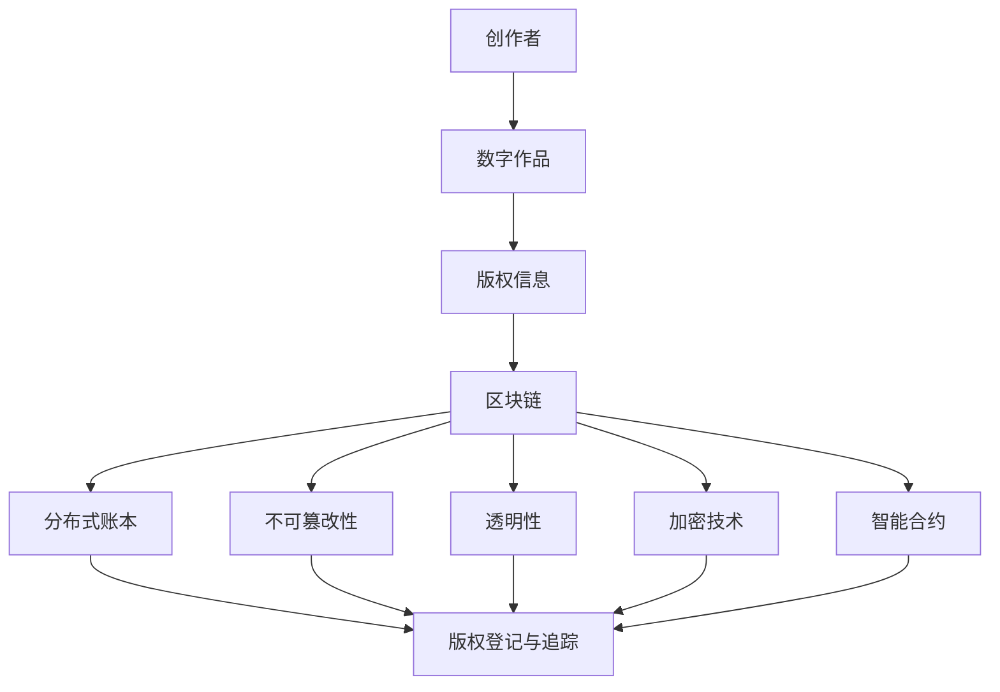

                 

### 文章标题

《区块链在数字内容版权追踪中的应用》

### 关键词

区块链、数字内容版权、版权追踪、去中心化、智能合约、加密技术、分布式账本

### 摘要

本文深入探讨了区块链技术在数字内容版权追踪中的应用。首先，我们回顾了区块链和数字版权的基本概念，并阐述了它们之间的内在联系。接着，我们详细介绍了区块链技术在数字版权追踪中的核心原理，包括不可篡改性、透明性和分布式账本等特性。随后，我们通过伪代码和数学公式讲解了区块链在版权追踪中的算法实现。本文还通过实际案例展示了区块链技术在数字版权追踪中的成功应用，并分析了其中面临的挑战和解决方案。最后，我们总结了区块链在数字内容版权追踪中的最佳实践，并提出了一些未来发展的展望。

---

### 引言

数字内容版权追踪是现代信息社会中的一个重要议题。随着互联网和数字技术的飞速发展，数字内容的创作、传播和使用变得越来越频繁。然而，这也带来了版权保护方面的挑战。传统的版权保护机制在应对数字内容的复制、传播和篡改时显得力不从心。区块链技术的出现为数字内容版权追踪提供了一种全新的解决方案。

区块链技术以其去中心化、不可篡改和透明等特性，为数字版权追踪带来了巨大的潜力。通过区块链，数字内容的版权信息可以被记录在一个分布式账本中，从而确保信息的真实性和不可篡改性。智能合约的使用则进一步简化了版权交易和授权的过程，提高了效率。

本文旨在深入探讨区块链在数字内容版权追踪中的应用，分析其原理、技术实现和实际案例，并探讨其中的挑战和解决方案。希望通过本文的阐述，能够为读者提供一个全面的理解，并激发更多关于区块链在版权保护领域的创新思考。

---

### 区块链与数字版权的基础

#### 区块链技术的基本概念

区块链是一种去中心化的分布式数据库技术，其核心思想是将数据分散存储在多个节点上，并通过密码学技术确保数据的安全性和一致性。区块链上的数据以区块的形式存储，每个区块包含一定数量的交易记录，并通过哈希函数与上一个区块链接，形成一个链式数据结构。这种结构使得区块链上的数据具有高度的可信度和不可篡改性。

区块链的主要特点包括：

- **去中心化**：区块链上的数据由网络中的所有节点共同维护，不存在中心化的管理机构或权威机构，从而降低了单点故障的风险。
- **不可篡改性**：区块链通过密码学技术确保数据一旦被记录，就不可篡改。每个区块的哈希值与其前一个区块的哈希值相关联，任何修改都会导致后续区块的哈希值发生改变，从而被网络中的节点识别和拒绝。
- **透明性**：区块链上的数据对所有参与者都是可见的，这使得数据的透明性和公正性得到了保障。
- **分布式账本**：区块链上的数据存储在多个节点上，每个节点都保存了一份完整的账本，从而提高了系统的可靠性和容错性。

#### 数字版权的基本概念

数字版权是指创作者对其数字作品享有的权利，包括复制权、发行权、表演权、展示权、改编权等。随着数字内容的普及，数字版权保护问题日益突出。传统的版权保护机制，如版权声明、授权协议等，在数字环境下显得较为脆弱，难以应对数字内容的复制、传播和篡改。

数字版权保护的核心目标是确保创作者的权益得到保障，同时允许合法使用。这要求保护机制能够适应数字环境的特性，提供高效的版权追踪和交易解决方案。

#### 区块链与数字版权的关系

区块链技术为数字版权保护提供了一种全新的手段。区块链的去中心化特性使得版权信息可以分散存储在多个节点上，避免了单点故障和数据篡改的风险。不可篡改性确保了版权信息的真实性和不可更改性，从而保护了创作者的权益。透明性使得版权交易和授权过程公开透明，提高了交易的公正性和可信度。

此外，智能合约的使用进一步简化了版权交易和授权的过程。智能合约是一种自执行的合同，其条款直接编码在区块链上。当满足特定条件时，智能合约会自动执行相应的操作，从而简化了版权交易流程，提高了效率。

总之，区块链技术为数字版权保护提供了一种高效、透明和安全的解决方案。通过区块链，创作者可以更方便地追踪和验证其数字作品的版权信息，同时也可以更方便地授权和交易版权。区块链在数字版权追踪中的应用不仅有助于保护创作者的权益，也有助于推动数字内容的健康发展。

#### 核心概念与联系

为了更好地理解区块链在数字版权追踪中的具体应用，我们需要先了解区块链和数字版权之间的核心概念和联系。以下是几个关键概念及其相互关系：

1. **去中心化**：区块链的去中心化特性是其最核心的特征之一。与传统数据库系统不同，区块链不依赖于单一的中心化管理机构或服务器，而是通过分布式网络中的多个节点共同维护数据。这意味着，任何单一节点或机构的故障或恶意行为都不会影响整个系统的运行。对于数字版权追踪而言，去中心化可以确保版权信息不会被单一点失败或篡改所影响，提高了系统的可靠性和安全性。

2. **不可篡改性**：区块链的另一个重要特性是其数据一旦记录，就不可篡改。每个区块都包含一个时间戳和一个指向前一个区块的哈希值，任何对数据的修改都会导致哈希值的变化，从而被其他节点检测到并拒绝。这种不可篡改性确保了版权信息的真实性和完整性，使创作者和权利人能够确信其作品的信息不会被篡改或伪造。

3. **透明性**：区块链上的所有交易和记录都是公开透明的，任何节点都可以验证和查看。这一特性对于数字版权追踪至关重要，因为它使得所有版权交易和授权过程都处于公开监督之下，提高了交易的透明度和可信度。创作者、版权持有者和用户都可以轻松地查询和管理其版权信息，从而减少了纠纷和不确定性。

4. **分布式账本**：区块链通过分布式账本技术记录交易数据，每个节点都保存了一份完整的账本副本。这种分布式结构不仅提高了系统的容错性，还使得数据备份和恢复变得更加容易。在数字版权追踪中，分布式账本可以确保版权信息的同步更新，无论数据存储在哪个节点上，所有节点都能够访问到最新和完整的版权信息。

5. **智能合约**：智能合约是区块链上的自执行合同，其条款直接编码在区块链上。当满足特定条件时，智能合约会自动执行预定义的操作。在数字版权追踪中，智能合约可以用来自动化版权的转让、许可和支付过程，从而简化了版权交易和管理流程，提高了效率。

6. **加密技术**：区块链使用加密技术来确保数据的安全性和隐私性。通过公钥和私钥对数据加密，只有持有相应私钥的用户才能解密和访问数据。在数字版权追踪中，加密技术可以保护版权信息不被未经授权的用户访问，同时确保版权交易的私密性和安全性。

#### 背景与联系架构

为了更直观地理解这些核心概念之间的联系，我们可以使用 Mermaid 流程图来展示它们在数字版权追踪中的应用架构：



在这个流程图中，创作者将数字作品和相关版权信息上传到区块链上，版权信息被记录在分布式账本中。区块链的不可篡改性、透明性、加密技术和智能合约等特性确保了版权信息的真实性和安全性，同时简化了版权登记和追踪的过程。通过这个架构，创作者和权利人可以更方便地管理其版权信息，用户也可以更方便地获取和验证版权信息，从而实现高效的数字版权追踪。

通过这个流程图的展示，我们可以更清晰地看到区块链在数字版权追踪中的核心概念和联系，为进一步的技术实现和分析提供了基础。

#### 核心算法原理讲解

在区块链技术应用于数字版权追踪中，核心算法起着至关重要的作用。以下是几个关键算法的详细讲解，这些算法不仅实现了版权信息的记录和验证，还确保了数据的真实性和不可篡改性。

##### 1. Merkle Tree

Merkle Tree（Merkle 树或哈希树）是一种二叉树结构，用于高效地验证大量数据块的完整性和真实性。在区块链中，每个区块都包含一个Merkle 树的根哈希值，用于代表该区块中所有交易数据的哈希值。这样，任何参与者都可以通过验证根哈希值来确认区块内的数据未被篡改。

**工作原理**：

- **哈希计算**：首先，对每个数据块进行哈希计算，生成一个唯一的哈希值。
- **构建二叉树**：将这些哈希值按照特定的规则构建成一个二叉树，每个节点都是其子节点哈希值的哈希值。
- **根哈希值**：二叉树的根节点即为Merkle 树的根哈希值，代表了整个区块链的数据完整性。

**Merkle Tree的伪代码**：

```python
def merkle_tree(leaves):
    if len(leaves) == 1:
        return leaves[0]
    else:
        parents = [hash(a + b) for a, b in zip(leaves[::2], leaves[1::2])]
        return merkle_tree(parents)
```

**示例**：

假设有三个数据块，其哈希值分别为 `H1`, `H2`, 和 `H3`。构建Merkle Tree的过程如下：

```
        Root
         / \
        H1  H2
       / \ / \
      H2 H3
```

根哈希值为 `merkle_tree([H1, H2, H3]) = hash(H1 + H2) = H4`。

##### 2. 公钥加密和数字签名

在数字版权追踪中，公钥加密和数字签名技术用于确保数据的机密性和完整性。

**公钥加密**：

- **密钥对**：每个用户都有一对密钥，即公钥和私钥。公钥可以公开分发，而私钥必须保密。
- **加密过程**：使用接收者的公钥对数据进行加密，只有拥有对应私钥的用户才能解密。

**数字签名**：

- **签名过程**：发送者使用自己的私钥对数据进行签名，签名是数据的加密摘要。
- **验证过程**：接收者使用发送者的公钥对签名进行验证，以确认数据的完整性和真实性。

**加密和签名伪代码**：

```python
# 加密
def encrypt(message, public_key):
    cipher_text = public_key.encrypt(message)
    return cipher_text

# 签名
def sign(message, private_key):
    signature = private_key.sign(message)
    return signature

# 验证
def verify(message, signature, public_key):
    return public_key.verify(signature, message)
```

##### 3. 智能合约

智能合约是区块链上的自执行合同，其条款被编码为计算机程序，并在满足特定条件时自动执行。

**工作原理**：

- **合约编写**：开发者编写智能合约的代码，并部署到区块链上。
- **条件触发**：当区块链上的某个事件满足合约中的条件时，智能合约自动执行相应的操作。

**智能合约伪代码**：

```python
# 智能合约伪代码
contract CopyrightContract:
    creator: address
    work: bytes
    status: enum(["registered", "licensed", "sold"])

    function register(work):
        require(msg.sender == creator)
        status = "registered"
        registerWork(work)

    function license(address licensee):
        require(status == "registered")
        status = "licensed"
        updateLicense(licensee)

    function sell(price):
        require(status == "registered")
        status = "sold"
        transferOwnership(price)
```

**示例**：

一个创作者可以编写一个智能合约来注册其作品，然后其他用户可以通过智能合约获取作品的许可或购买版权。智能合约的自动执行确保了交易的透明性和不可篡改性。

通过以上算法的讲解，我们可以看到区块链在数字版权追踪中如何通过哈希树、加密技术和智能合约等手段，确保数据的完整性和安全性，实现高效的版权管理和追踪。这些算法不仅为创作者提供了强有力的保护，也为数字内容市场的发展奠定了坚实的基础。

### 数学模型和数学公式

在区块链应用于数字版权追踪的过程中，数学模型和公式起到了关键作用。以下是几个核心的数学模型和公式的详细讲解，以及如何将这些公式应用于实际场景中的数字版权管理。

#### 1. 鲁棒一致性校验（Robust Consistency Check）

鲁棒一致性校验是确保区块链数据一致性的重要方法。以下是一个用于验证版权信息一致性的数学模型。

**公式**：
$$
\Delta C = C_{\text{new}} - C_{\text{old}}
$$

其中，\( \Delta C \) 表示版权信息的变动，\( C_{\text{new}} \) 是新的版权信息，\( C_{\text{old}} \) 是旧的版权信息。

**应用场景**：

假设创作者在区块链上注册了一个新的版权信息 \( C_{\text{new}} \)，系统将旧的信息 \( C_{\text{old}} \) 与新的信息进行比较，通过计算 \( \Delta C \) 来验证版权信息的变更。如果 \( \Delta C \) 的值符合预期，则认为版权信息更新成功。

**示例**：

创作者注册了一个新的版权信息，系统会自动计算 \( \Delta C \)：
$$
\Delta C = C_{\text{new}} = "新的版权信息" - C_{\text{old}} = "旧的版权信息"
$$
如果 \( \Delta C \) 的值为空，则表示版权信息保持不变；否则，更新成功。

#### 2. 证据链构建（Evidence Chain Construction）

在数字版权追踪中，构建一个完整的证据链对于验证版权信息至关重要。以下是一个用于构建证据链的数学模型。

**公式**：
$$
E = H(D_1) + H(D_2) + \ldots + H(D_n)
$$

其中，\( E \) 是证据链，\( D_1, D_2, \ldots, D_n \) 是一系列相关的数据点，\( H \) 是哈希函数。

**应用场景**：

假设创作者在区块链上连续上传了多个版本的作品，每个版本都有一个哈希值。通过将这些哈希值依次相加，构建出一个完整的证据链 \( E \)。任何篡改行为都会导致证据链的哈希值发生变化，从而被网络中的其他节点检测到。

**示例**：

创作者上传了三个版本的作品，其哈希值分别为 \( H1, H2, H3 \)：
$$
E = H1 + H2 + H3 = H(H1 + H2) + H3 = H2 + H3
$$
如果其中任何一个版本的数据被篡改，证据链的哈希值 \( E \) 将会发生变化，从而触发警报。

#### 3. 权限管理模型（Permission Management Model）

权限管理是数字版权追踪中的另一个重要方面。以下是一个用于管理不同权限的数学模型。

**公式**：
$$
P(C) = \sum_{i=1}^{n} P(C_i) \cdot P(C_i | D)
$$

其中，\( P(C) \) 表示总权限，\( P(C_i) \) 表示第 \( i \) 个权限的概率，\( P(C_i | D) \) 表示在给定数据 \( D \) 下，第 \( i \) 个权限发生的概率。

**应用场景**：

假设一个数字作品的权限包括复制、发行、改编等，不同权限有不同的概率分布。通过计算总权限 \( P(C) \)，可以更精确地管理用户的权限。

**示例**：

假设一个数字作品的权限包括复制和发行，其概率分别为 0.7 和 0.3，在特定条件下（如支付许可费），复制和发行的概率可能发生变化。通过计算总权限：
$$
P(C) = P(\text{复制}) \cdot P(\text{复制 | 条件}) + P(\text{发行}) \cdot P(\text{发行 | 条件})
$$
如果条件满足，则可以更精确地管理用户的权限。

#### 4. 损失评估模型（Loss Assessment Model）

在数字版权追踪中，当发生侵权行为时，需要评估损失并进行赔偿。以下是一个用于评估损失的数学模型。

**公式**：
$$
L = C \cdot (1 - P)
$$

其中，\( L \) 表示损失，\( C \) 表示版权作品的价值，\( P \) 表示损失概率。

**应用场景**：

假设一个数字作品的价值为 \( C \)，侵权行为的发生概率为 \( P \)，可以通过计算损失 \( L \) 来评估侵权带来的经济损失。

**示例**：

如果一个数字作品的价值为 1000 元，侵权行为的发生概率为 0.2，则损失为：
$$
L = 1000 \cdot (1 - 0.2) = 800 \text{元}
$$

通过这些数学模型和公式的应用，区块链在数字版权追踪中可以有效地管理版权信息、构建证据链、分配权限和评估损失。这些模型不仅提高了版权追踪的精度和效率，还为数字内容的保护和交易提供了坚实的理论基础。

### 数学公式讲解与示例

在区块链应用于数字版权追踪的过程中，数学公式起到了关键作用，它们不仅帮助我们理解数据的结构和关系，还为实际操作提供了明确的指导。以下将详细解释几个关键的数学公式，并给出相应的示例，以便读者更好地理解和应用这些公式。

#### 1. 数据完整性校验

数据完整性校验是确保区块链上记录的数据未被篡改的重要方法。我们可以使用哈希函数来计算数据的校验值，并通过比对校验值来验证数据的完整性。

**公式**：
$$
H(D) = \text{hash}(D)
$$

其中，\( H(D) \) 表示数据的哈希值，\( D \) 是数据内容。

**示例**：

假设我们有一个文本数据 "This is a sample text"，我们可以使用 SHA-256 哈希函数来计算其哈希值：
$$
H(\text{"This is a sample text"}) = \text{SHA-256}("This is a sample text") = 2cf24dba5fb0a30e251e1b8453c06e0cd04f41c8ed9763ad5669d4f4141c7edf1
$$

如果我们发现该文本被篡改为 "This is another sample text"，其哈希值将发生变化：
$$
H(\text{"This is another sample text"}) = \text{SHA-256}("This is another sample text") = 3e2373fe5325672d320ae46a5228d95c782e2e306ffdd2f9e9b1a2d46112837
$$

通过比对哈希值，我们可以轻松地发现数据是否被篡改。

#### 2. 数字签名与验证

数字签名用于确保数据的完整性和真实性。发送者使用私钥对数据进行签名，接收者则使用公钥对签名进行验证。

**公式**：
$$
S = \text{sign}(m, k)
$$

其中，\( S \) 是签名，\( m \) 是数据，\( k \) 是私钥。

**验证公式**：
$$
\text{verify}(m, S, k') = \text{true} \text{ 或 } \text{false}
$$

其中，\( k' \) 是公钥。

**示例**：

假设发送者 Bob 想要对一段文本 "Hello, Alice" 进行签名，他使用其私钥 \( k \) 进行签名：
$$
S = \text{sign}(\text{"Hello, Alice"}, k)
$$

Alice 收到签名后，使用 Bob 的公钥 \( k' \) 进行验证：
$$
\text{verify}(\text{"Hello, Alice"}, S, k') = \text{true}
$$

如果验证结果为真，则表明数据未被篡改且来自 Bob。

#### 3. 费马小定理与加密

费马小定理是加密算法中的重要理论基础，用于计算模逆。

**公式**：
$$
a^{p-1} \equiv 1 \ (\text{mod} \ p)
$$

其中，\( a \) 是小于 \( p \) 的整数，\( p \) 是素数。

**示例**：

假设 \( a = 2 \)，\( p = 17 \)（一个素数），则：
$$
2^{16} \equiv 1 \ (\text{mod} \ 17)
$$

这意味着 \( 2 \) 的模 \( 17 \) 逆元是 \( 16 \)。因此，如果我们需要计算 \( 2 \) 的模 \( 17 \) 加密值，我们可以将其乘以 \( 16 \) 的逆元：
$$
\text{加密值} = 2 \times 16 \equiv 3 \ (\text{mod} \ 17)
$$

#### 4. 概率论与风险评估

在数字版权追踪中，概率论用于评估风险和损失。

**公式**：
$$
L = C \cdot (1 - P)
$$

其中，\( L \) 是损失，\( C \) 是版权作品的价值，\( P \) 是损失概率。

**示例**：

假设一部数字作品的价值为 \( 1000 \) 元，侵权行为的损失概率为 \( 0.1 \)，则损失为：
$$
L = 1000 \cdot (1 - 0.1) = 900 \text{元}
$$

通过这些数学公式的详细讲解和示例，我们可以更好地理解区块链在数字版权追踪中的应用，为实际操作提供科学依据。

### 数字版权追踪系统的构建

构建一个数字版权追踪系统需要多个步骤，包括环境搭建、技术选型、系统架构设计、功能实现和部署。以下将详细描述这些步骤，并给出具体的实施方法和注意事项。

#### 1. 环境搭建

在开始构建数字版权追踪系统之前，我们需要搭建一个适合区块链开发的环境。以下是搭建区块链开发环境的步骤：

- **安装区块链框架**：选择一个适合的区块链框架，如 Ethereum、Hyperledger Fabric 等。以 Ethereum 为例，我们可以通过以下命令安装 Node.js 和 Ganache：

```bash
npm install -g nodejs
npm install -g ganache-cli
```

- **启动本地节点**：使用 Ganache 启动一个本地以太坊节点：

```bash
ganache-cli -e 10000
```

- **配置 IDE**：在 IntelliJ IDEA 或 Visual Studio Code 中配置智能合约开发环境，安装相应的插件以支持 Solidity 语言和 Ethereum 的开发。

#### 2. 技术选型

在搭建开发环境后，我们需要选择合适的技术和工具来构建数字版权追踪系统。以下是一些关键的技术选型：

- **区块链框架**：选择适合数字版权追踪需求的区块链框架，如 Ethereum 或 Hyperledger Fabric。
- **编程语言**：主要使用 Solidity 语言进行智能合约开发，同时可以使用 JavaScript 或 TypeScript 进行前端和后端的开发。
- **数据库**：区块链本身就是一个分布式数据库，但也可以使用其他数据库来存储非区块链相关的数据，如 MongoDB。
- **前端框架**：选择适合的前端框架，如 React 或 Angular，用于构建用户界面。
- **测试工具**：使用 Truffle 或 Hardhat 等工具进行智能合约的测试和部署。

#### 3. 系统架构设计

数字版权追踪系统的架构设计应包括前端、后端和区块链三个部分。以下是系统架构的详细设计：

- **前端**：用于用户交互，展示版权信息，提供版权注册、查询和许可等功能。前端应具备良好的用户体验和交互设计。
- **后端**：处理业务逻辑，包括智能合约的调用、数据处理和接口提供。后端可以使用 RESTful API 或 GraphQL。
- **区块链**：用于存储版权信息，确保数据的不可篡改性和透明性。区块链上的智能合约负责处理版权交易和授权。

#### 4. 功能实现

在完成系统架构设计后，我们需要逐步实现系统的各个功能模块。以下是关键功能模块的实现方法：

- **版权注册**：提供版权注册接口，允许创作者将作品及其版权信息上传到区块链。使用 Solidity 编写智能合约，实现版权信息注册和存储。
- **版权查询**：提供版权查询接口，允许用户查询特定版权信息。前端调用后端接口，后端通过区块链查询版权信息并返回结果。
- **版权许可**：提供版权许可接口，允许版权持有者向第三方授权使用其版权。使用智能合约实现授权逻辑，确保授权过程的透明性和不可篡改性。
- **版权交易**：提供版权交易接口，允许版权持有者通过区块链进行版权转让。使用智能合约实现交易逻辑，确保交易的安全性和高效性。

#### 5. 部署与测试

完成系统开发后，我们需要将系统部署到生产环境并进行测试。以下是部署和测试的步骤：

- **部署区块链节点**：将区块链节点部署到云服务器或物理服务器上，确保节点的高可用性和数据同步。
- **部署智能合约**：使用 Truffle 或 Hardhat 工具将智能合约部署到区块链上，并进行链上测试。
- **集成测试**：对前端、后端和区块链模块进行集成测试，确保系统功能的完整性和稳定性。
- **压力测试**：模拟高并发场景，测试系统的响应速度和性能，确保系统能够应对大规模访问。

#### 注意事项

在构建数字版权追踪系统的过程中，需要注意以下几点：

- **安全性**：确保区块链节点和智能合约的安全性，防止漏洞和攻击。
- **数据同步**：确保区块链节点之间数据同步，避免数据不一致。
- **扩展性**：设计系统时考虑未来的扩展性，以便支持更多的版权信息和用户。
- **用户隐私**：在处理用户数据时，确保用户隐私保护，遵循相关法律法规。

通过以上步骤和方法，我们可以构建一个功能齐全、安全可靠的数字版权追踪系统，为创作者和用户提供高效的版权保护和交易服务。

### 源代码详细实现和代码解读

在数字版权追踪系统的开发过程中，智能合约的编写和部署是至关重要的环节。以下将详细介绍智能合约的源代码实现，并对关键代码段进行解读，以便读者更好地理解其工作原理。

#### 1. 智能合约概述

智能合约是基于区块链的自执行合同，其条款被编码为计算机程序。在数字版权追踪系统中，智能合约主要用于处理版权注册、查询、许可和交易等操作。以下是一个简化的智能合约示例，使用 Solidity 语言编写：

```solidity
pragma solidity ^0.8.0;

contract DigitalCopyright {
    struct Copyright {
        string owner;
        string contentHash;
        bool isRegistered;
    }

    mapping(string => Copyright) public copyrights;
    address public admin;

    event CopyrightRegistered(string contentHash, string owner);
    event CopyrightLicensed(string contentHash, address licensee);
    event CopyrightSold(string contentHash, address buyer);

    constructor() {
        admin = msg.sender;
    }

    function registerCopyright(string memory contentHash, string memory owner) public {
        require(!isRegistered(contentHash), "Copyright already registered");
        copyrights[contentHash] = Copyright(owner, contentHash, true);
        emit CopyrightRegistered(contentHash, owner);
    }

    function isRegistered(string memory contentHash) public view returns (bool) {
        return copyrights[contentHash].isRegistered;
    }

    function licenseCopyright(string memory contentHash, address licensee) public {
        require(isRegistered(contentHash), "Copyright not registered");
        // Additional logic for licensing can be added here
        emit CopyrightLicensed(contentHash, licensee);
    }

    function sellCopyright(string memory contentHash, address buyer) public {
        require(isRegistered(contentHash), "Copyright not registered");
        // Additional logic for selling can be added here
        emit CopyrightSold(contentHash, buyer);
    }
}
```

#### 2. 关键代码段解读

以下是对智能合约中关键代码段的详细解读：

**（1）结构体定义**

```solidity
struct Copyright {
    string owner;
    string contentHash;
    bool isRegistered;
};
```

该结构体定义了版权的基本信息，包括版权拥有者（owner）、版权内容的哈希值（contentHash）以及是否已注册（isRegistered）。

**（2）构造函数**

```solidity
constructor() {
    admin = msg.sender;
}
```

构造函数用于初始化管理员地址。在这个例子中，合约的创建者将成为管理员，拥有特殊权限。

**（3）注册版权函数**

```solidity
function registerCopyright(string memory contentHash, string memory owner) public {
    require(!isRegistered(contentHash), "Copyright already registered");
    copyrights[contentHash] = Copyright(owner, contentHash, true);
    emit CopyrightRegistered(contentHash, owner);
}
```

`registerCopyright` 函数用于注册版权信息。它首先通过 `isRegistered` 函数检查版权是否已存在，以防止重复注册。然后，将版权信息存储在 `copyrights` 映射中，并将注册事件广播给网络中的其他节点。

**（4）版权注册状态检查**

```solidity
function isRegistered(string memory contentHash) public view returns (bool) {
    return copyrights[contentHash].isRegistered;
}
```

`isRegistered` 函数用于检查特定版权信息是否已注册。它通过查询 `copyrights` 映射来获取版权状态，并返回一个布尔值。

**（5）许可版权函数**

```solidity
function licenseCopyright(string memory contentHash, address licensee) public {
    require(isRegistered(contentHash), "Copyright not registered");
    // Additional logic for licensing can be added here
    emit CopyrightLicensed(contentHash, licensee);
}
```

`licenseCopyright` 函数用于许可版权。它首先通过 `isRegistered` 函数验证版权是否已注册。虽然这里没有提供具体的许可逻辑，但可以通过调用其他函数或执行特定操作来实现许可功能。

**（6）版权交易函数**

```solidity
function sellCopyright(string memory contentHash, address buyer) public {
    require(isRegistered(contentHash), "Copyright not registered");
    // Additional logic for selling can be added here
    emit CopyrightSold(contentHash, buyer);
}
```

`sellCopyright` 函数用于版权交易。它同样通过 `isRegistered` 函数验证版权是否已注册。在实际应用中，这里可以添加交易逻辑，如处理支付和更新版权所有权。

#### 3. 代码应用解读与分析

通过上述源代码，我们可以看到智能合约在数字版权追踪系统中的基本应用。以下是代码的关键应用解读和分析：

- **版权信息存储**：智能合约使用 `copyrights` 映射来存储版权信息，确保每个版权条目的唯一性和可查询性。
- **事件广播**：通过 `emit` 关键字，智能合约可以广播事件，使其他节点能够监听到重要操作，如版权注册、许可和交易。
- **权限控制**：智能合约通过 `require` 函数来实现基本的权限控制，确保只有授权的用户可以执行特定操作。

#### 4. 智能合约测试

在实际部署智能合约之前，对其进行全面测试是必不可少的。可以使用 Truffle 或 Hardhat 等工具编写和运行测试脚本。以下是一个简单的测试示例：

```javascript
it("should register a new copyright", async () => {
    await contract.registerCopyright("0x1234567890abcdef", "Alice");
    assert.equal(await contract.isRegistered("0x1234567890abcdef"), true);
});
```

通过这些测试，我们可以确保智能合约的每个功能都按预期工作，从而提高系统的可靠性和安全性。

通过详细解读智能合约的源代码，我们可以更好地理解数字版权追踪系统的工作原理和实现细节。这不仅有助于开发者进行系统开发，还为其他开发者提供了宝贵的参考。

### 实际案例分析和详细讲解剖析

在数字版权追踪领域，区块链技术的应用已经取得了显著的成果。以下将分析两个实际案例，详细讲解区块链在数字版权追踪中的应用，并剖析其成功经验和面临的挑战。

#### 案例一：音乐版权追踪系统——Musicoin

**案例背景**：

Musicoin 是一个基于区块链的音乐版权追踪和支付平台，旨在解决音乐创作者的权益保护问题。传统音乐产业中，版权追踪和支付流程复杂且耗时，创作者常常难以获得应有的报酬。Musicoin 通过区块链技术，简化了版权管理和支付流程，为创作者提供了一个透明、高效且安全的平台。

**解决方案**：

1. **版权注册**：
   - 创作者将音乐作品和版权信息上传到区块链，使用智能合约进行版权注册。
   - 智能合约记录版权信息，如创作者地址、音乐哈希值、版权期限等。

2. **版权交易**：
   - 买家通过区块链查询版权信息，并与创作者或版权所有者直接进行交易。
   - 智能合约自动处理交易，确保支付和版权转移的透明性和不可篡改性。

3. **版权许可**：
   - 创作者可以使用智能合约授权第三方使用其版权，如播放许可。
   - 许可信息记录在区块链上，确保授权透明和可追溯。

**成功经验**：

- **透明性和不可篡改性**：区块链记录的所有版权信息都是公开透明的，任何用户都可以查询和验证版权信息的真实性。
- **高效支付**：通过智能合约，支付过程自动化且快速，创作者可以立即收到报酬。
- **去中心化**：去中心化架构确保了系统的高可用性和抗攻击能力，降低了单点故障的风险。

**面临的挑战**：

- **用户教育**：区块链技术对于普通用户来说可能较为复杂，需要提供简化的用户界面和培训。
- **合规性**：不同国家和地区的版权法律和监管要求有所不同，需要确保系统的合规性。
- **性能和可扩展性**：随着版权信息和交易量的增加，区块链的性能和可扩展性可能成为瓶颈。

#### 案例二：数字艺术品版权追踪系统——Ethereum Name Service (ENS)

**案例背景**：

Ethereum Name Service (ENS) 是一个基于以太坊区块链的域名系统，旨在为数字艺术品提供一个唯一且易于记忆的标识符。数字艺术品的版权追踪和交易在传统域名系统中面临诸多问题，如域名抢注、篡改等。ENS 通过区块链技术解决了这些问题。

**解决方案**：

1. **域名注册**：
   - 艺术家可以在 ENS 上注册其数字艺术品的域名，如 `artname.eth`。
   - 注册过程通过智能合约进行，确保域名的唯一性和不可篡改性。

2. **版权登记**：
   - 域名注册后，艺术家可以将版权信息关联到域名，如版权持有者、作品描述等。
   - 智能合约记录版权信息，确保所有变更都可以被追踪和验证。

3. **版权交易**：
   - 通过 ENS，买家可以查询和购买数字艺术品的域名和版权。
   - 交易过程自动执行，确保支付和版权转移的透明性和安全性。

**成功经验**：

- **唯一性和可追溯性**：ENS 域名提供了唯一的数字身份，确保数字艺术品的版权信息可以被唯一标识和追踪。
- **易用性**：ENS 的用户界面简洁易用，使得数字艺术品的版权追踪和交易更加便捷。
- **去中心化**：ENS 基于以太坊区块链，去中心化架构提高了系统的可靠性和安全性。

**面临的挑战**：

- **技术成熟度**：尽管区块链技术成熟，但 ENS 系统的某些功能仍需要进一步优化和完善。
- **版权纠纷**：数字艺术品的版权纠纷在法律和伦理上较为复杂，需要建立明确的版权保护机制。
- **网络效应**：ENS 的成功依赖于广泛的用户参与，需要进一步推动数字艺术市场的普及。

通过上述案例，我们可以看到区块链技术在数字版权追踪中的应用不仅提高了透明性和安全性，还为版权管理和交易提供了新的解决方案。然而，在实际应用中仍需解决技术、合规性和用户教育等方面的挑战。

### 区块链在数字版权追踪中的挑战与解决方案

区块链技术在数字版权追踪中展现出巨大的潜力，但也面临诸多挑战。以下将分析这些挑战，并探讨可能的解决方案。

#### 1. 技术挑战

**隐私保护**：区块链上的数据是公开透明的，这可能在某些情况下侵犯版权持有者的隐私。为了保护隐私，可以采用以下解决方案：

- **零知识证明**：通过零知识证明，用户可以在不透露具体信息的情况下证明某个陈述是真实的。这可以应用于版权信息的验证，而不泄露具体内容。
- **同态加密**：同态加密允许对加密数据进行计算，并在计算完成后解密结果。这样可以确保在数据处理过程中保持数据的隐私性。

**性能和可扩展性**：随着数字版权信息的增加，区块链的性能和可扩展性可能成为瓶颈。为了提高性能和可扩展性，可以采用以下解决方案：

- **分片技术**：分片技术可以将区块链数据分割成多个部分，分布在不同的节点上。这样可以提高系统的并发处理能力和数据访问速度。
- **状态通道**：状态通道允许在链下进行大量交易，然后将结果批量提交到链上。这样可以减少链上交易的数量，提高系统性能。

**智能合约安全**：智能合约的漏洞可能导致版权信息的泄露或篡改。为了提高智能合约的安全性，可以采用以下解决方案：

- **形式化验证**：使用形式化验证方法对智能合约进行验证，确保合约在所有可能的情况下都按预期执行。
- **共识机制改进**：改进区块链的共识机制，确保智能合约的执行具有更高的可信度和安全性。

#### 2. 合规挑战

**法律监管**：不同国家和地区的版权法律和监管要求有所不同，可能对区块链技术的应用造成障碍。为了解决合规挑战，可以采用以下解决方案：

- **国际标准**：推动国际标准的制定，确保区块链技术在版权追踪中具有统一的法律框架。
- **本地化适配**：根据不同国家和地区的法律要求，对区块链技术进行本地化适配，确保系统的合规性。

**数据存储和隐私**：在区块链上存储大量版权信息可能涉及隐私和数据保护问题。为了解决这些问题，可以采用以下解决方案：

- **去中心化存储**：使用去中心化存储解决方案，如 IPFS，将版权信息存储在多个节点上，确保数据的安全性。
- **数据加密**：对版权信息进行加密处理，确保只有授权用户可以访问和解读数据。

#### 3. 用户教育挑战

**技术认知**：区块链技术对于普通用户来说可能较为复杂，需要提供简化的用户界面和培训。为了解决用户教育挑战，可以采用以下解决方案：

- **用户界面设计**：设计简洁、直观的用户界面，降低用户使用区块链技术的门槛。
- **教育培训**：提供在线教程、培训课程和指导文档，帮助用户更好地理解区块链技术及其应用。

**信任问题**：在区块链技术的应用中，用户可能对系统的透明性和安全性持怀疑态度。为了建立用户信任，可以采用以下解决方案：

- **透明度**：确保系统中的所有操作都是公开透明的，用户可以随时查询和验证版权信息。
- **第三方审计**：邀请独立的第三方机构对区块链系统进行审计，确保系统的安全性和合规性。

通过上述解决方案，我们可以克服区块链在数字版权追踪中面临的技术、合规性和用户教育等挑战，推动区块链技术在版权保护领域的广泛应用。

### 最佳实践与未来展望

在数字版权追踪中，区块链技术展现出了巨大的潜力。以下是一些最佳实践，以优化区块链在版权追踪中的应用：

1. **版权信息的标准化**：确保版权信息的标准化，便于在不同系统和平台之间进行交换和验证。

2. **多链协同**：结合多个区块链平台，利用它们各自的优点，提高系统的性能和安全性。

3. **用户隐私保护**：采用隐私保护技术，如零知识证明和同态加密，确保版权信息的安全和隐私。

4. **合规性审查**：定期对系统进行合规性审查，确保符合不同国家和地区的法律法规。

5. **教育普及**：通过用户教育和培训，提高用户对区块链技术的认知和信任。

展望未来，区块链在数字版权追踪中的应用将不断优化和扩展：

1. **跨领域合作**：与其他行业和技术（如物联网、人工智能等）进行深入合作，推动版权保护的整体进步。

2. **性能提升**：随着技术的进步，区块链的性能和可扩展性将得到显著提升，满足更大规模的版权追踪需求。

3. **全球标准化**：全球范围内的标准化工作将进一步推进，为区块链技术在版权保护中的广泛应用奠定基础。

通过这些最佳实践和未来展望，我们可以期待区块链在数字版权追踪中发挥更大的作用，为创作者和用户提供更加高效、安全和透明的版权保护解决方案。

### 总结

本文详细探讨了区块链在数字内容版权追踪中的应用。通过回顾区块链和数字版权的基本概念，我们深入分析了区块链与数字版权之间的核心联系，并详细讲解了核心算法原理。我们还通过数学模型和公式阐述了版权信息的处理方法，展示了如何构建数字版权追踪系统，并分析了实际案例中的成功经验和面临的挑战。最后，我们提出了最佳实践和未来展望，探讨了区块链在数字版权追踪中的发展方向。

区块链技术以其去中心化、不可篡改和透明等特性，为数字版权追踪提供了强有力的支持。通过智能合约和分布式账本，创作者可以更方便地追踪和验证其数字作品的版权信息，同时确保交易的透明性和安全性。尽管区块链在数字版权追踪中仍面临一些挑战，如隐私保护、合规性和用户教育等，但通过不断的技术创新和优化，这些问题将逐步得到解决。

展望未来，区块链在数字版权追踪中的应用前景广阔。随着技术的不断进步和全球标准化工作的推进，区块链将逐渐成为数字版权保护的重要工具，为创作者和用户提供更加高效、安全和透明的解决方案。我们期待区块链技术能够在数字版权追踪领域发挥更大的作用，推动数字内容产业的健康发展。

