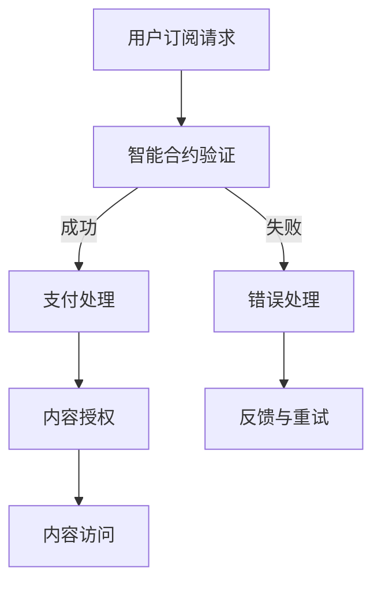

                 

### 文章标题：《区块链在数字内容订阅中的微支付应用》

#### 关键词：区块链、数字内容订阅、微支付、智能合约、数学模型

#### 摘要：本文将探讨区块链技术在数字内容订阅领域中的应用，特别是微支付系统的构建。我们将深入分析区块链的基础概念，解释其如何与数字内容订阅和微支付相结合，并详细讨论智能合约、数学模型及其在实际项目中的实现。通过案例分析，我们将展示区块链在数字内容订阅和微支付中的应用价值，并提供最佳实践和未来展望。

---

## 核心概念与联系

### 区块链基础概念

区块链是一种分布式账本技术，其核心特点是去中心化、安全性和不可篡改性。区块链由一系列按时间顺序排列的区块组成，每个区块包含一定数量的交易记录。这些区块通过密码学方法相互链接，形成一条连续的链条。

- **去中心化**：区块链不存在中心化的控制节点，所有节点都在同一级别上参与网络运行，从而实现了去中心化。
- **安全性**：区块链使用加密技术确保数据的安全性和完整性。一旦数据被记录在区块链上，就几乎不可能被篡改。
- **不可篡改性**：区块链上的数据一旦被添加，就永久存储，不可篡改，保证了数据的持久性和可靠性。

### 数字内容订阅与微支付

数字内容订阅是一种在线服务模式，用户通过支付订阅费用，获得特定数字内容的持续访问权。微支付则是指小额交易的支付方式，常见于购买数字内容、虚拟物品等。

- **数字内容订阅**：用户通过订阅服务获取内容，如在线杂志、电子书、音乐流媒体等。
- **微支付**：微支付适用于交易金额较小的情况，如0.01美元到几美元之间的交易。传统的支付系统在高交易费用和繁琐的交易流程上不适用，而区块链提供了便捷的微支付解决方案。

### 区块链与数字内容订阅的关联

区块链与数字内容订阅的结合，为微支付提供了一种新的解决方案。通过智能合约，内容订阅平台可以实现自动化的订阅和支付流程，确保内容的合法授权和及时支付。

- **智能合约**：智能合约是区块链上运行的程序，可以自动化执行合同条款。在数字内容订阅中，智能合约用于处理订阅费用支付、内容授权等操作。
- **数字资产**：区块链上的数字资产（如加密货币）可以作为支付手段，方便地进行微支付。

#### Mermaid 流程图

下面是一个简化的区块链在数字内容订阅中的微支付流程图：



在上述流程中，用户发起订阅请求，智能合约验证用户的支付状态，然后处理支付并授权访问内容。如果支付失败，则进行错误处理。

## 核心算法原理讲解

### 智能合约原理与实现

智能合约是区块链技术的重要组成部分，它是一种自动执行合同条款的计算机程序。智能合约在执行时，会读取输入参数，根据预定义的逻辑自动执行操作，并将结果记录在区块链上。

#### 智能合约编程语言

智能合约的编程语言通常是基于特定的区块链平台，例如以太坊的Solidity。以下是使用Solidity编写的一个简单智能合约示例，用于处理订阅支付：

```solidity
// SPDX-License-Identifier: MIT
pragma solidity ^0.8.0;

contract ContentSubscription {
    mapping(address => bool) public subscriptions;

    function subscribe() public payable {
        require(msg.value > 0, "订阅费用不能为0");
        subscriptions[msg.sender] = true;
        // 其他逻辑，如通知内容提供商等
    }

    function isSubscribed(address user) public view returns (bool) {
        return subscriptions[user];
    }

    // 提供退款等功能
    function unsubscribe() public {
        require(subscriptions[msg.sender], "未订阅");
        subscriptions[msg.sender] = false;
        payable(msg.sender).transfer(msg.value);
    }
}
```

#### 微支付算法

微支付算法的设计需要考虑交易费用、数据大小和交易速度等因素。以下是微支付算法的基本步骤：

1. 用户发起支付请求。
2. 智能合约验证支付金额是否足够。
3. 智能合约执行操作（如内容授权）。
4. 记录交易结果在区块链上。

#### 区块链网络与共识机制

区块链网络通过共识机制确保数据的可信和一致性。常见的共识机制包括：

- **工作量证明（PoW）**：通过计算证明参与者在区块链网络中的工作贡献。
- **权益证明（PoS）**：通过持有代币的数量和锁仓时间来决定参与者的权益。

这些机制确保了区块链网络的安全性和去中心化特性。

### 数学模型和数学公式

#### 数学模型概述

在区块链数字内容订阅中，数学模型主要用于描述交易行为和系统性能。以下是一些关键的数学模型：

- **概率论模型**：用于描述用户行为和交易成功率。
- **信息论模型**：用于评估交易信息的安全性和可靠性。

#### 概率论与信息论基础

- **概率论基础**：概率用于衡量事件发生的可能性，例如用户完成订阅的概率。
- **信息论基础**：熵用于衡量信息的不确定性，信息增益用于衡量信息的价值。

#### 微支付交易模型

微支付交易模型需要考虑交易费用、交易确认时间和交易成功率等因素。以下是一个简化的微支付交易模型：

$$
成功率 = \frac{交易确认次数}{尝试次数} \\
交易费用 = \frac{支付金额}{交易确认次数}
$$

### 伪代码示例

以下是微支付交易流程的伪代码：

```
// 微支付交易流程
function makeMicroPayment(address recipient, uint256 amount) {
    // 验证支付金额
    if (amount < MIN_PAYMENT) {
        throw "支付金额太小";
    }

    // 执行交易
    try this.transfer(recipient, amount) returns (bool success) {
        if (success) {
            // 记录交易成功
            logTransactionSuccess();
        } else {
            // 记录交易失败
            logTransactionFailure();
        }
    } catch Error(string memory reason) {
        // 处理错误
        logError(reason);
    }
}
```

## 项目实战

### 实际案例分析

#### 区块链数字内容订阅案例

以以太坊为例，我们来看一个区块链数字内容订阅的案例。用户通过智能合约订阅内容，每次订阅都需要支付一定的费用。内容提供商通过智能合约验证用户的支付状态，并授权访问订阅内容。

#### 微支付应用实例

在一个微支付应用中，用户可以购买小额数字商品，如音乐、游戏内虚拟物品等。通过智能合约，用户可以直接向内容提供商支付微额费用，并立即获得相应的数字商品。

### 开发环境搭建

搭建一个区块链数字内容订阅平台，需要以下工具和步骤：

1. 安装Node.js和npm。
2. 安装Truffle框架，用于智能合约开发、部署和测试。
3. 配置Ganache，用于本地以太坊节点搭建。
4. 编写智能合约代码，并使用Truffle编译和部署。

### 源代码详细实现与代码解读

以下是一个简单的智能合约代码示例，用于数字内容订阅：

```solidity
// SPDX-License-Identifier: MIT
pragma solidity ^0.8.0;

contract ContentSubscription {
    mapping(address => bool) public subscriptions;

    function subscribe() public payable {
        require(msg.value > 0, "订阅费用不能为0");
        subscriptions[msg.sender] = true;
        // 其他逻辑，如通知内容提供商等
    }

    function isSubscribed(address user) public view returns (bool) {
        return subscriptions[user];
    }

    // 提供退款等功能
    function unsubscribe() public {
        require(subscriptions[msg.sender], "未订阅");
        subscriptions[msg.sender] = false;
        payable(msg.sender).transfer(msg.value);
    }
}
```

### 代码解读与分析

在上述代码中，`subscribe` 函数用于处理订阅请求，用户发送一定数额的以太币到合约地址，合约则将用户的地址标记为订阅状态。`isSubscribed` 函数用于检查用户是否已订阅。`unsubscribe` 函数允许用户取消订阅并退回支付金额。

## 代码解读与分析

### 智能合约性能分析

智能合约的性能分析主要关注交易费用、执行速度和存储空间占用。通过优化代码结构、减少不必要的操作和合理使用存储结构，可以提高智能合约的性能。

### 微支付安全性分析

微支付的安全性依赖于区块链网络的安全性和智能合约的可靠性。智能合约应经过严格的代码审计，确保不存在漏洞和潜在风险。同时，区块链网络的共识机制和加密技术也为微支付提供了强有力的安全保障。

### 代码优化建议

1. 使用合理的变量类型，减少存储空间的占用。
2. 优化循环和递归调用，减少交易费用。
3. 审计智能合约代码，确保不存在安全漏洞。

## 总结与展望

区块链技术在数字内容订阅和微支付领域具有巨大的应用潜力。通过智能合约，可以实现自动化、去中心化的订阅和支付流程，为用户提供便捷的数字内容获取方式。同时，微支付技术的引入，使得小额交易变得更加可行，促进了数字内容市场的繁荣。

### 行业趋势分析

随着区块链技术的不断发展和完善，预计未来几年内，将有更多的数字内容订阅平台采用区块链技术。此外，随着加密货币的普及，微支付将成为数字内容交易的主流方式。

### 技术挑战与解决方案

区块链在数字内容订阅中面临的挑战包括：性能瓶颈、隐私保护、合规性等问题。针对这些挑战，可以通过优化网络架构、引入零知识证明技术和遵循相关法律法规来逐步解决。

### 未来展望

区块链与数字内容订阅的结合，将极大地改变传统的内容分发模式。未来，我们可以期待更加高效、安全、去中心化的数字内容订阅和微支付系统，为用户带来更好的体验。

### 最佳实践 Tips

- 在使用区块链技术时，务必进行充分的市场调研和需求分析，确保技术方案能够满足业务需求。
- 定期进行智能合约的代码审计和安全测试，确保系统的安全性。
- 关注区块链技术的最新动态，及时更新和优化技术方案。

### 拓展阅读

- 《区块链技术指南》
- 《智能合约开发实战》
- 《区块链与数字货币》

作者：AI天才研究院/AI Genius Institute & 禅与计算机程序设计艺术 /Zen And The Art of Computer Programming

---

本文详细探讨了区块链在数字内容订阅中的微支付应用，从核心概念到实际案例分析，为读者提供了全面的技术解读和实践指导。希望通过本文，能够激发更多开发者对区块链技术在数字内容订阅领域的探索和尝试。

