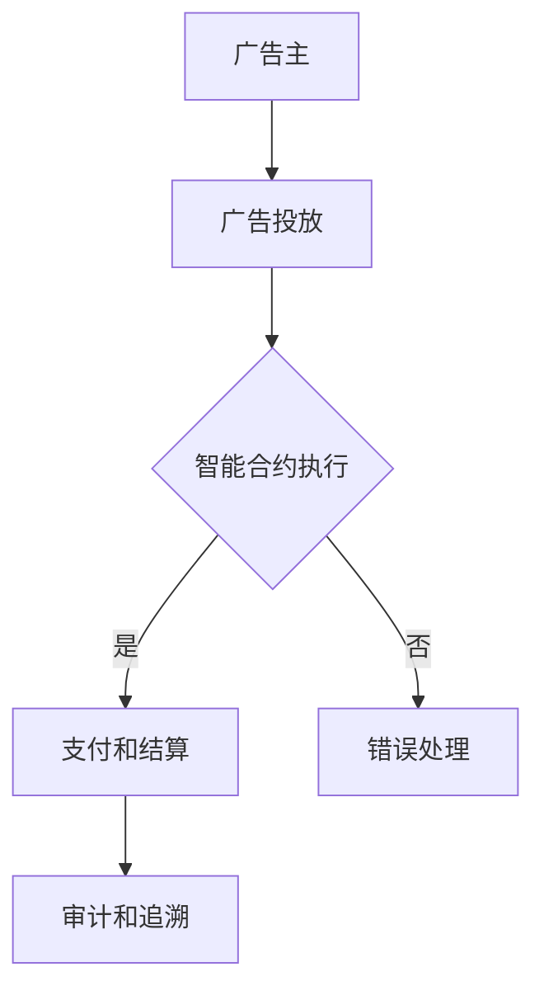
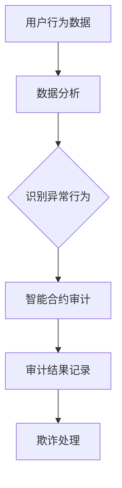

                 

## 文章标题：区块链在数字广告中的应用：减少广告欺诈，提高透明度

### 文章关键词：
- 区块链
- 数字广告
- 广告欺诈
- 透明度
- 智能合约

### 文章摘要：
区块链技术以其不可篡改和去中心化的特性，为数字广告领域带来了新的可能。本文将探讨区块链在数字广告中的应用，特别是如何减少广告欺诈，提高透明度。通过详细分析区块链的基本原理、智能合约的开发和部署，以及实际案例，我们将揭示区块链在数字广告领域的重要作用。

## 引言

数字广告已成为现代营销的重要组成部分，但其发展也伴随着一系列问题，如广告欺诈、数据隐私泄露、广告透明度不足等。传统解决方案往往无法从根本上解决这些问题，而区块链技术的出现为数字广告行业带来了新的希望。本文将从以下几个方面展开讨论：

1. 区块链在数字广告中的应用场景
2. 区块链技术的基础原理
3. 智能合约在数字广告中的应用
4. 区块链在减少广告欺诈和提升透明度方面的实际案例
5. 区块链广告应用的开发流程和实战案例

通过以上分析，我们将深入理解区块链技术在数字广告领域的重要性，以及如何利用区块链技术解决当前数字广告行业面临的挑战。

## 第一部分：区块链与数字广告概述

### 1.1 区块链技术简介

#### 1.1.1 区块链的基本原理

区块链是一种分布式数据库技术，它通过一系列按时间顺序排列的“区块”来存储数据。每个区块包含一组交易记录，并通过密码学确保数据的不可篡改性和唯一性。区块链的关键特性包括：

- **去中心化**：区块链没有中央权威机构，而是由网络中的多个节点共同维护。
- **不可篡改**：一旦数据被记录在区块链上，就几乎不可能被更改或删除。
- **透明性**：区块链上的所有数据都是公开透明的，任何人都可以查看和验证。

#### 1.1.2 区块链的架构

区块链的架构主要包括三个部分：区块、链和节点。每个区块包含一个时间戳、上一区块的哈希值、交易记录和当前区块的哈希值。区块通过哈希函数与前一个区块链接，形成区块链。节点是区块链网络中的参与者，负责验证和存储数据。

#### 1.1.3 区块链的优势

区块链技术具有以下优势：

- **安全性**：区块链使用密码学确保数据的完整性和隐私。
- **透明性**：区块链上的所有数据都是公开透明的，增加了系统的信任度。
- **去中心化**：去中心化降低了系统对中央权威机构的依赖，提高了系统的可靠性和抗攻击性。

### 1.2 数字广告市场概述

#### 1.2.1 数字广告的兴起与发展

数字广告自互联网兴起以来，迅速发展。随着移动互联网的普及，数字广告已经成为企业营销的重要手段。广告形式也从传统的横幅广告、按钮广告，发展到如今的视频广告、原生广告、社交媒体广告等。

#### 1.2.2 数字广告市场的规模与趋势

根据相关数据，全球数字广告市场持续增长，预计未来几年仍将保持高速增长。广告形式不断创新，广告投放渠道更加多样化，如搜索引擎、社交媒体、移动应用等。

#### 1.2.3 数字广告存在的问题

尽管数字广告市场发展迅速，但同时也存在一些问题：

- **广告欺诈**：包括点击欺诈、展示欺诈、伪装欺诈等，导致广告成本增加，广告效果下降。
- **数据隐私泄露**：广告投放过程中涉及大量的用户数据，存在数据隐私泄露的风险。
- **广告透明度不足**：广告投放过程不透明，广告主难以准确了解广告效果。

### 1.3 区块链在数字广告中的应用场景

#### 1.3.1 减少广告欺诈

区块链技术可以通过以下方式减少广告欺诈：

- **去中心化审计**：区块链的分布式特性使得所有节点都能参与审计，提高了审计的透明度和可信度。
- **智能合约**：智能合约可以自动执行交易，确保广告投放的真实性和有效性。

#### 1.3.2 提高透明度

区块链技术可以提高广告透明度：

- **透明数据记录**：所有广告交易记录都记录在区块链上，可供所有参与者查询。
- **去中心化审核**：广告效果和数据透明度得到多个节点的共同验证，提高了信任度。

#### 1.3.3 智能合约在广告交易中的应用

智能合约在广告交易中具有重要作用：

- **自动化交易**：智能合约可以自动执行广告投放和支付过程，减少了人工干预和欺诈风险。
- **透明交易记录**：所有交易记录都在区块链上公开透明，方便审计和追溯。

## 第二部分：区块链技术基础

### 2.1 区块链核心概念

#### 2.1.1 区块链的基本原理

区块链的基本原理主要包括以下三个方面：

1. **分布式数据库**：区块链是由多个节点共同维护的分布式数据库，每个节点都保存了一份完整的区块链数据。
2. **密码学**：区块链使用密码学技术确保数据的完整性和安全性，包括哈希函数、数字签名等。
3. **共识机制**：共识机制是区块链网络中节点达成一致的方式，常用的共识机制包括工作量证明（PoW）、权益证明（PoS）等。

#### 2.1.2 区块链的数据结构

区块链的数据结构主要由以下几部分组成：

1. **区块**：区块是区块链的基本单位，包含一组交易记录、时间戳、上一个区块的哈希值等。
2. **链**：链是由多个区块按时间顺序链接而成的数据结构。
3. **节点**：节点是区块链网络中的参与者，负责维护和验证区块链数据。

#### 2.1.3 区块链的共识机制

区块链的共识机制是节点之间达成一致的方式，常用的共识机制包括：

1. **工作量证明（PoW）**：节点通过计算复杂的数学问题来证明自己的工作，最先解决问题的节点可以获得区块奖励。
2. **权益证明（PoS）**：节点根据持有的代币数量和持币时间来决定是否参与区块验证，持币越多、持币时间越长，验证概率越高。
3. **委托权益证明（DPoS）**：类似于PoS，但通过选举产生超级节点，超级节点参与区块验证。

### 2.2 智能合约

#### 2.2.1 智能合约的基本原理

智能合约是一种自动执行合同条款的计算机程序，其基本原理如下：

1. **条件执行**：智能合约在满足特定条件时自动执行，无需人工干预。
2. **透明性**：智能合约的代码和执行过程都是公开透明的，任何参与者都可以查看和验证。
3. **安全性**：智能合约使用密码学技术确保数据的完整性和安全性。

#### 2.2.2 智能合约的开发与部署

智能合约的开发和部署主要包括以下步骤：

1. **编写智能合约代码**：使用Solidity等编程语言编写智能合约代码。
2. **编译智能合约**：将智能合约代码编译为字节码。
3. **部署智能合约**：将编译后的字节码部署到区块链上。
4. **调用智能合约**：通过区块链网络调用智能合约，执行相应的操作。

#### 2.2.3 智能合约在广告中的应用

智能合约在数字广告中的应用包括：

1. **自动广告投放**：智能合约可以自动执行广告投放流程，确保广告的真实性和有效性。
2. **透明广告交易**：智能合约记录所有广告交易记录，供所有参与者查询。
3. **智能合约审计**：智能合约的执行过程和结果都是公开透明的，方便审计和追溯。

### 2.3 公共区块链与私有区块链

#### 2.3.1 公共区块链的特点与应用

公共区块链具有以下特点：

1. **去中心化**：公共区块链没有中央权威机构，由网络中的多个节点共同维护。
2. **开放性**：公共区块链对所有参与者开放，任何人都可以参与区块链网络。
3. **安全性**：公共区块链使用密码学技术确保数据的完整性和安全性。

公共区块链的应用包括：

1. **数字货币**：如比特币、以太坊等。
2. **去中心化应用**：如去中心化金融（DeFi）、非同质化代币（NFT）等。

#### 2.3.2 私有区块链的特点与应用

私有区块链具有以下特点：

1. **集中化**：私有区块链由一个或多个实体控制，通常用于企业内部或特定组织。
2. **封闭性**：私有区块链通常不对外开放，仅限于特定组织的参与者。
3. **定制化**：私有区块链可以根据特定需求进行定制和优化。

私有区块链的应用包括：

1. **企业内部管理**：如供应链管理、财务审计等。
2. **行业联盟链**：如金融行业的支付结算、保险行业的理赔管理等。

#### 2.3.3 公共区块链与私有区块链的比较

公共区块链与私有区块链的比较主要包括以下几个方面：

1. **去中心化程度**：公共区块链更去中心化，私有区块链更集中化。
2. **开放性**：公共区块链更开放，私有区块链更封闭。
3. **安全性**：公共区块链使用密码学技术确保数据安全，私有区块链通常依赖特定的安全措施。
4. **应用场景**：公共区块链适用于去中心化应用和数字货币等领域，私有区块链适用于企业内部和行业联盟链等领域。

## 第三部分：区块链在数字广告中的应用

### 3.1 区块链与广告欺诈

#### 3.1.1 广告欺诈的现状

广告欺诈在数字广告领域普遍存在，主要包括以下几种形式：

1. **点击欺诈**：恶意用户或程序模拟真实用户点击广告，骗取广告费用。
2. **展示欺诈**：恶意用户或程序伪装成广告页面，骗取广告展示费用。
3. **伪装欺诈**：恶意用户或程序伪装成其他网站或应用，骗取广告投放费用。

广告欺诈导致广告成本增加，广告效果下降，严重影响广告主和广告平台的利益。

#### 3.1.2 区块链如何减少广告欺诈

区块链技术可以通过以下方式减少广告欺诈：

1. **去中心化审计**：区块链的分布式特性使得所有节点都能参与审计，提高了审计的透明度和可信度。
2. **智能合约**：智能合约可以自动执行广告投放和支付过程，确保广告投放的真实性和有效性。
3. **透明交易记录**：所有广告交易记录都记录在区块链上，方便审计和追溯。

#### 3.1.3 区块链广告欺诈检测案例

以某区块链广告平台为例，该平台使用区块链技术来检测广告欺诈。平台采用以下方法：

1. **用户行为分析**：通过分析用户的点击行为、浏览记录等数据，识别异常用户行为。
2. **智能合约审计**：智能合约自动执行广告投放过程，确保广告投放的真实性和有效性。
3. **区块链交易记录**：所有广告交易记录都记录在区块链上，供所有参与者查询和审计。

通过以上措施，该平台成功降低了广告欺诈的发生率，提高了广告投放的透明度和可信度。

### 3.2 区块链与广告透明度

#### 3.2.1 广告透明度的重要性

广告透明度是广告主、广告平台和广告受众共同关注的问题。提高广告透明度可以：

1. **降低广告成本**：广告主可以更精准地投放广告，减少无效广告投放，降低广告成本。
2. **提升广告效果**：广告主可以更清楚地了解广告投放效果，优化广告策略，提高广告效果。
3. **增强用户信任**：广告受众可以更透明地了解广告内容，增强对广告的信任。

#### 3.2.2 区块链如何提高广告透明度

区块链技术可以通过以下方式提高广告透明度：

1. **透明数据记录**：所有广告交易记录都记录在区块链上，供所有参与者查询。
2. **去中心化审计**：区块链的分布式特性使得所有节点都能参与审计，提高了审计的透明度和可信度。
3. **智能合约**：智能合约可以自动执行广告投放和支付过程，确保广告投放的真实性和有效性。

#### 3.2.3 区块链广告透明度案例分析

以某区块链广告平台为例，该平台通过以下方式提高广告透明度：

1. **透明交易记录**：所有广告交易记录都记录在区块链上，供所有参与者查询。
2. **智能合约**：智能合约自动执行广告投放和支付过程，确保广告投放的真实性和有效性。
3. **去中心化审计**：所有节点都可以参与审计，提高了审计的透明度和可信度。

通过以上措施，该平台成功提高了广告透明度，降低了广告欺诈发生率，提升了广告主和广告受众的满意度。

### 3.3 区块链广告交易平台

#### 3.3.1 区块链广告交易平台的架构

区块链广告交易平台的架构主要包括以下部分：

1. **广告主**：广告主是广告投放方，负责制定广告投放策略和支付广告费用。
2. **广告平台**：广告平台是广告交易的中介，负责广告投放和管理。
3. **广告受众**：广告受众是广告的目标用户，负责查看和参与广告活动。
4. **区块链**：区块链是广告交易的数据存储和传输系统，确保广告交易的安全和透明。
5. **智能合约**：智能合约是广告交易的核心，负责执行广告投放和支付过程。

#### 3.3.2 区块链广告交易平台的优势

区块链广告交易平台具有以下优势：

1. **去中心化**：区块链广告交易平台没有中央权威机构，所有交易都由网络中的多个节点共同维护，提高了系统的可靠性。
2. **透明性**：所有广告交易记录都记录在区块链上，供所有参与者查询，提高了广告交易的透明度和可信度。
3. **安全性**：区块链技术使用密码学确保数据的完整性和安全性，降低了广告欺诈和数据泄露的风险。
4. **自动化**：智能合约可以自动执行广告投放和支付过程，减少了人工干预和操作风险。

#### 3.3.3 区块链广告交易平台案例分析

以某区块链广告交易平台为例，该平台通过以下方式实现广告交易：

1. **去中心化审计**：所有交易记录都记录在区块链上，供所有参与者查询，提高了审计的透明度和可信度。
2. **智能合约**：智能合约自动执行广告投放和支付过程，确保广告投放的真实性和有效性。
3. **透明交易记录**：所有广告交易记录都记录在区块链上，供所有参与者查询。

通过以上措施，该平台成功降低了广告欺诈发生率，提高了广告透明度，提升了广告主和广告受众的满意度。

## 第四部分：区块链广告应用实战

### 4.1 区块链广告应用开发流程

#### 4.1.1 开发环境搭建

要开发区块链广告应用，首先需要搭建开发环境。主要包括以下步骤：

1. **选择区块链平台**：根据项目需求选择合适的区块链平台，如以太坊、EOS等。
2. **安装区块链节点**：在本地或远程服务器上安装区块链节点，确保区块链网络的正常运行。
3. **配置开发工具**：安装和配置智能合约开发工具，如Truffle、Hardhat等。

#### 4.1.2 开发工具与框架

开发区块链广告应用常用的开发工具和框架包括：

1. **智能合约开发框架**：如Truffle、Hardhat等，提供智能合约的编写、编译、部署和测试等功能。
2. **区块链节点管理工具**：如Ganache、Infura等，用于管理本地或远程区块链节点。
3. **前端框架**：如React、Vue等，用于开发用户界面和与区块链交互的接口。

#### 4.1.3 开发流程详解

区块链广告应用的开发流程主要包括以下步骤：

1. **需求分析**：明确广告应用的功能和需求，包括广告投放、支付、审计等。
2. **设计智能合约**：根据需求设计智能合约，确定智能合约的接口和逻辑。
3. **编写智能合约代码**：使用Solidity等编程语言编写智能合约代码。
4. **编译和部署智能合约**：将智能合约代码编译为字节码，并部署到区块链上。
5. **前端开发**：开发用户界面，实现与智能合约的交互。
6. **测试和调试**：对智能合约和前端应用进行测试和调试，确保系统正常运行。

### 4.2 区块链广告应用案例

#### 4.2.1 案例一：基于区块链的广告交易平台

某区块链广告交易平台采用以太坊平台，使用Solidity编写智能合约。平台的主要功能包括：

1. **广告投放**：广告主可以通过智能合约投放广告，广告受众可以查看和参与广告。
2. **支付和结算**：广告主和广告受众通过智能合约支付和结算广告费用。
3. **审计和追溯**：所有广告交易记录都记录在区块链上，供所有参与者查询和审计。

#### 4.2.2 案例二：基于区块链的广告欺诈检测系统

某区块链广告欺诈检测系统采用EOS平台，使用C++编写智能合约。系统的主要功能包括：

1. **用户行为分析**：分析用户的点击行为、浏览记录等数据，识别异常用户行为。
2. **智能合约审计**：智能合约自动执行广告投放过程，确保广告投放的真实性和有效性。
3. **区块链交易记录**：所有广告交易记录都记录在区块链上，供所有参与者查询和审计。

#### 4.2.3 案例三：基于区块链的个性化广告推荐系统

某区块链个性化广告推荐系统采用Hyperledger Fabric平台，使用Go语言编写智能合约。系统的主要功能包括：

1. **用户数据收集**：收集用户的行为数据，包括浏览记录、搜索历史等。
2. **广告推荐**：根据用户数据生成个性化广告推荐。
3. **智能合约执行**：智能合约自动执行广告投放和支付过程，确保广告投放的真实性和有效性。

## 附录

### A.1 常用区块链开发工具与资源

#### A.1.1 智能合约开发工具

1. **Truffle**：Truffle是一个基于以太坊的开发框架，提供智能合约的编写、编译、部署和测试等功能。
2. **Hardhat**：Hardhat是一个轻量级的开发环境，支持以太坊和其他EVM兼容链，提供智能合约的开发和测试功能。
3. **Solc**：Solc是Solidity编译器的官方实现，用于编译Solidity智能合约代码。

#### A.1.2 区块链节点搭建工具

1. **Ganache**：Ganache是一个轻量级的本地以太坊节点，用于开发和测试智能合约。
2. **Infura**：Infura是提供以太坊和其他区块链节点的云服务，方便开发者远程访问区块链数据。
3. **Docker**：Docker可以用于构建和管理区块链节点容器，方便搭建和迁移区块链环境。

#### A.1.3 区块链数据分析工具

1. **Ethers.js**：Ethers.js是一个JavaScript库，用于与以太坊区块链进行交互。
2. **Web3.js**：Web3.js是一个JavaScript库，提供与以太坊区块链交互的API。
3. **Blockcypher**：Blockcypher提供以太坊区块链数据的API，方便开发者获取和解析区块链数据。

### A.2 Mermaid流程图展示

#### A.2.1 区块链广告交易流程

#### A.2.2 广告欺诈检测流程

## 结论

区块链技术在数字广告中的应用为解决广告欺诈和提升广告透明度提供了新的思路。通过去中心化审计、智能合约和透明交易记录，区块链技术可以有效减少广告欺诈，提高广告透明度，为数字广告行业带来新的发展机遇。未来，随着区块链技术的不断成熟和应用，数字广告行业将迎来更加健康和可持续的发展。

## 作者信息

作者：AI天才研究院/AI Genius Institute & 禅与计算机程序设计艺术 /Zen And The Art of Computer Programming

